# PostgreSQL / PL/pgSQL Notes

---

## Table of Contents

- [PostgreSQL / PL/pgSQL Notes](#postgresql--plpgsql-notes)
  - [Table of Contents](#table-of-contents)
  - [1. Database Foundations](#1-database-foundations)
  - [2. Introduction to PostgreSQL / PL/pgSQL](#2-introduction-to-postgresql--plpgsql)
    - [Dollar-Quoting (`$$`)](#dollar-quoting-)
    - [SERIAL and GENERATED AS IDENTITY](#serial-and-generated-as-identity)
  - [3. Data Types](#3-data-types)
  - [4. Variables & Constants](#4-variables--constants)
  - [5. Languages in PostgreSQL](#5-languages-in-postgresql)
    - [DDL — CREATE, ALTER, TRUNCATE, DROP](#ddl---data-definition-language)
    - [DML — INSERT, UPDATE, DELETE, MERGE](#dml---data-manipulation-language)
    - [DQL — SELECT](#dql---data-query-language)
    - [DCL — GRANT, REVOKE](#dcl---data-control-language)
    - [TCL — BEGIN, COMMIT, ROLLBACK, SAVEPOINT](#tcl---transaction-control-language)
  - [6. Types of Operators](#6-types-of-operators)
  - [7. Types of Constraints](#7-types-of-constraints)
  - [8. Database Design & Normalization](#8-database-design--normalization)
  - [9. JOINs](#9-joins)
  - [10. Aggregations & Grouping](#10-aggregations--grouping)
  - [11. Subqueries](#11-subqueries)
  - [12. Built-in Functions](#12-built-in-functions)
  - [13. Indexes & Performance](#13-indexes--performance)
  - [14. Transactions & Concurrency (Extended)](#14-transactions--concurrency-extended)
  - [15. Views](#15-views)
  - [16. Window Functions](#16-window-functions)
  - [17. CTEs & Advanced Querying](#17-ctes--advanced-querying)
  - [18. Control Structures](#18-control-structures)
  - [19. Loops](#19-loops)
  - [20. Cursors](#20-cursors)
  - [21. Exceptions & Exception Handling](#21-exceptions--exception-handling)
    - [Re-Raising Exceptions](#re-raising-exceptions)
    - [GET STACKED DIAGNOSTICS](#get-stacked-diagnostics)
  - [22. Stored Procedures](#22-stored-procedures)
    - [Procedure with INOUT Parameter](#procedure-with-inout-parameter)
    - [Transaction Control Inside a Procedure](#transaction-control-inside-a-procedure)
  - [23. Functions](#23-functions)
    - [RETURNS SETOF](#returns-setof--return-multiple-rows-of-an-existing-type)
    - [SQL-Language Function](#sql-language-function)
    - [SECURITY DEFINER vs SECURITY INVOKER](#security-definer-vs-security-invoker)
  - [24. Packages & Schemas](#24-packages--schemas)
  - [25. Triggers](#25-triggers)
    - [Trigger with WHEN Condition](#trigger-with-when-condition)
    - [Statement-Level Trigger](#statement-level-trigger)
    - [INSTEAD OF Trigger (on Views)](#instead-of-trigger-on-views)
  - [26. Collections](#26-collections)
    - [JSONB — Semi-Structured Data](#jsonb--semi-structured-data-in-postgresql)
  - [27. Backend Integration — Node.js Perspective](#27-backend-integration--nodejs-perspective)
  - [28. Interview Preparation](#28-interview-preparation)
  - [29. Jobs & Scheduled Tasks in PostgreSQL](#29-jobs--scheduled-tasks-in-postgresql)

---

## 1. Database Foundations

[↑ Back to Index](#table-of-contents)

### 1.1 What is a Database

#### What It Is (Simply)

Imagine you are running a large hospital. Every day, thousands of patients visit, doctors write prescriptions, nurses update records, billing issues invoices, and the pharmacy tracks medicine stock. If all of this information was stored in paper files, finding a specific patient's record from five years ago would take hours. That is the problem databases solve.

A **database** is an organized, structured collection of related data that can be stored, retrieved, modified, and managed efficiently. The key word here is _organized_ — without structure, data is just noise. With structure, it becomes actionable information.

#### What It Is (Technically)

Technically, a database is a persistent, organized data store managed by a **Database Management System (DBMS)**. The data is stored on disk in a structured format, and the DBMS provides a query interface — typically SQL — to interact with that data safely, concurrently, and consistently.

---

#### DBMS vs RDBMS

A **Database Management System (DBMS)** is the software that manages data storage, retrieval, and access control. It could manage data in any format — files, XML, key-value pairs, documents.

A **Relational Database Management System (RDBMS)** is a specific category of DBMS that organizes data into **tables** (relations in the mathematical sense), enforces relationships between tables via keys, and uses **SQL** as the standard query language. PostgreSQL, MySQL, Oracle, and MS SQL Server are all RDBMSs.

The "relational" part comes from the mathematical concept of a _relation_ — a set of tuples sharing the same attributes. When you see a table with rows and columns, you are looking at a relation.

RDBMSs give you: guaranteed data integrity via constraints, the ability to join and relate data across tables, ACID transaction support, and a standardized query language. Something like Redis (key-value store) or MongoDB (document store) is a DBMS but not an RDBMS — they sacrifice some guarantees for speed or flexibility.

---

#### Structured vs Unstructured Data

**Structured data** follows a fixed, predefined schema. Every record has the same fields. A database table of employees — each row has an ID, name, salary, department — is structured. SQL databases excel at structured data.

**Unstructured data** has no predefined schema. Think of email bodies, PDFs, images, videos, social media posts. You cannot put a tweet into a neat row-column format because every tweet might carry different metadata.

**Semi-structured data** sits in between — JSON, XML, CSV. It has some structure but is schema-flexible. PostgreSQL's `JSONB` type lets you store semi-structured data inside a structured database, bridging both worlds — which is why PostgreSQL is so powerful for modern applications.

As a backend developer, you will almost always have both. User profile data (structured) lives in PostgreSQL. User-uploaded documents (unstructured) live in object storage (S3). Your application bridges them.

---

#### Row-Oriented vs Column-Oriented Databases

**Row-oriented databases** (PostgreSQL, MySQL) store data row by row on disk. When you fetch one row, the entire row is read in a single I/O operation. This is efficient for **OLTP workloads** — where you frequently read or write complete records one at a time.

**Column-oriented databases** (Redshift, ClickHouse, BigQuery) store data column by column. When you run `SELECT AVG(salary) FROM employees`, only the salary column needs to be read — millions of rows, but a single column. This is massively efficient for **OLAP workloads** — large analytical queries aggregating across millions of rows.

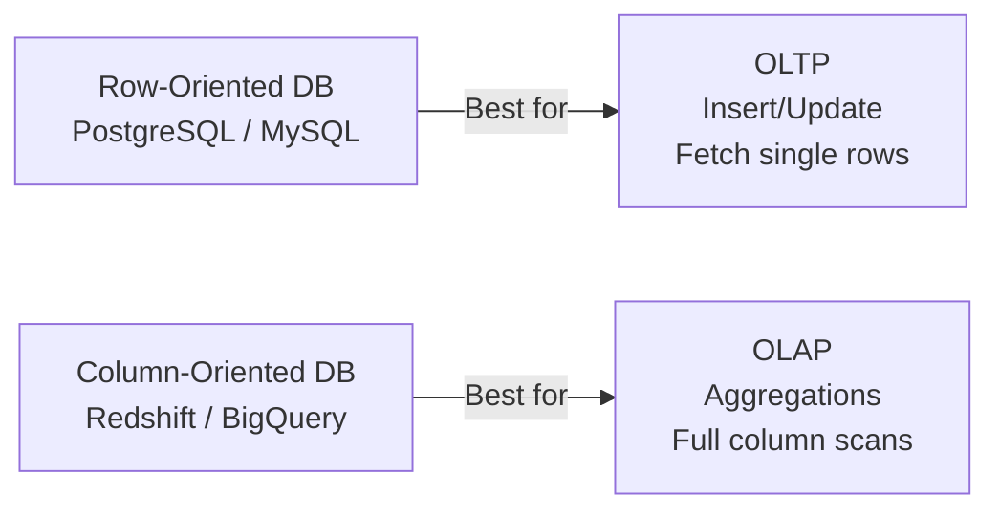

**Common mistake:** Deploying PostgreSQL for analytics workloads with millions of rows and complex aggregations and hitting performance walls. Understanding this distinction helps you choose the right tool — or the right PostgreSQL optimization (indexes, materialized views, partitioning).

---

#### OLTP vs OLAP Systems

**OLTP (Online Transaction Processing)** systems handle day-to-day operational transactions — user logins, order placements, payment processing.

- High volume of short, fast queries
- Many concurrent users
- Frequent INSERT, UPDATE, DELETE
- Data is current and normalized
- Response time measured in milliseconds

**OLAP (Online Analytical Processing)** systems support business intelligence and reporting.

- Low volume of complex, slow queries
- Few concurrent users (analysts, dashboards)
- Mostly SELECT (read-heavy)
- Data is historical and often denormalized
- Response time measured in seconds to minutes

As a backend engineer, you build OLTP systems. The classic mistake is running heavy OLAP-style queries on your OLTP PostgreSQL database during peak hours — this degrades performance for all users. The solution is read replicas, materialized views, or a separate data warehouse.

---

#### CAP Theorem (High-Level Awareness)

The **CAP theorem** states that in any distributed data system, you can only guarantee **two out of three** of the following properties simultaneously:

- **Consistency (C):** Every read gets the most recent write (no stale data)
- **Availability (A):** Every request gets a response (no errors, no timeouts)
- **Partition Tolerance (P):** The system continues operating even if some network nodes lose communication

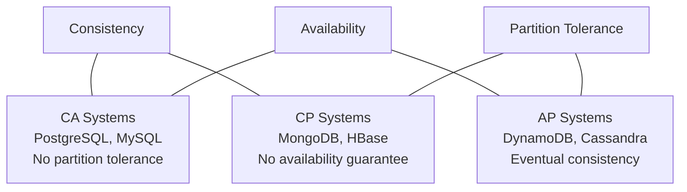

Because network partitions are inevitable in distributed systems, you must always tolerate P. So the real choice is **CP vs AP** — consistency or availability when a partition occurs.

PostgreSQL is a single-node system by default — CAP doesn't apply until you add replication. With streaming replication, PostgreSQL is **AP by default** (replicas may serve slightly stale data) unless you configure synchronous replication (CP).

**Interview perspective:** The key insight is: in a real system, partition tolerance is non-negotiable, so you choose between strong consistency and high availability when a network partition occurs.

---

### 1.2 Relational Database Concepts

#### Tables, Rows, and Columns

In a relational database, all data lives in **tables**. A table has a name (e.g., `employees`) and is made up of:

- **Columns (attributes):** Define the structure — what kind of data the table stores. Each column has a name and a data type.
- **Rows (records/tuples):** Represent individual data entries. Each row is one instance of the entity — one employee, one order, one product.
- **Cells:** The intersection of a row and column — a single piece of data.

Think of a table exactly like a spreadsheet tab — columns are the headers, rows are the data. But unlike a spreadsheet, a database table enforces data types, constraints, and relationships between tables.

---

#### Schema

A **schema** is the structural blueprint of your database — the definition of all tables, their columns, data types, constraints, indexes, and relationships. The schema is what you design before you insert a single row of data.

Think of a schema like the architectural blueprint of a building. The blueprint doesn't contain furniture or people (data), but it defines how many rooms there are, where the doors go, and what each room is for.

In PostgreSQL, "schema" has a dual meaning:

1. The **overall database design** (all tables and their structure)
2. A **namespace** inside a database (like a folder that groups related objects — `hr`, `finance`, `public`)

---

#### Relationships

The power of relational databases is the ability to **relate** data across tables, avoiding duplication. There are three fundamental relationship types:

**1:1 (One-to-One):** One row in Table A corresponds to exactly one row in Table B. Example: each employee has exactly one passport record. In practice, 1:1 relationships are rare and often a sign the data could be merged into one table.

**1:N (One-to-Many):** One row in Table A relates to many rows in Table B. This is by far the most common relationship. Example: one department has many employees, but each employee belongs to one department.

**N:M (Many-to-Many):** Many rows in Table A relate to many rows in Table B. Example: students can enroll in many courses, and courses have many students. In SQL, you implement M:N relationships with a **junction table** (bridge table / associative table).

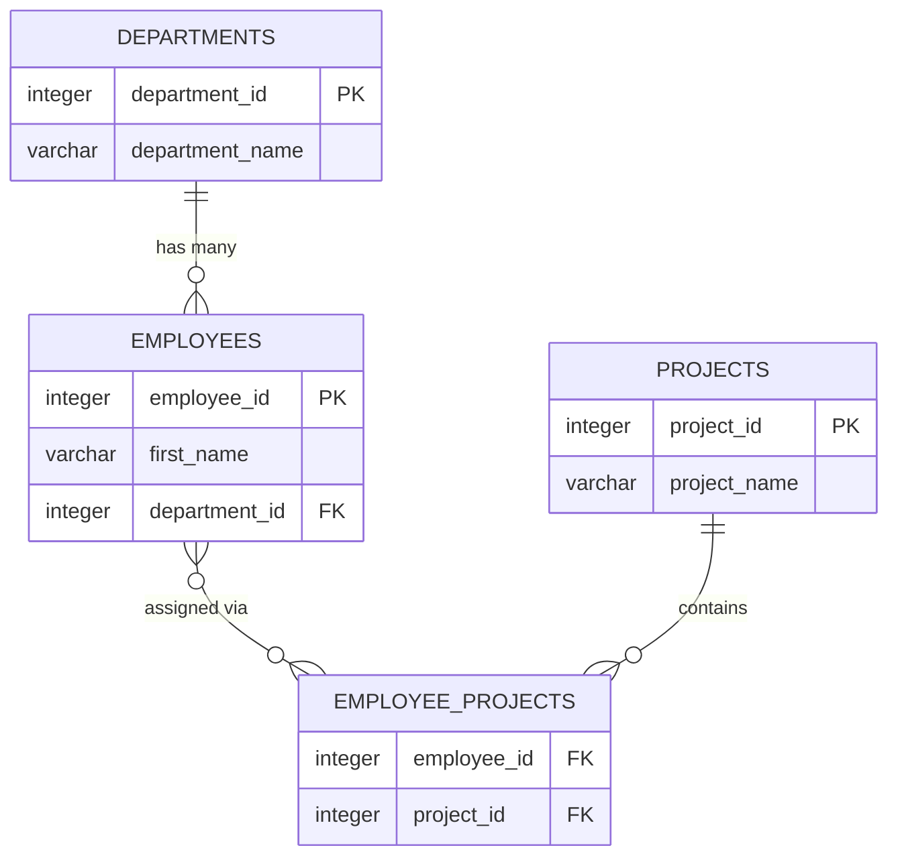

---

#### Entity-Relationship Model (ERD Basics)

An **Entity-Relationship Diagram (ERD)** is a visual map of your database design. Before writing a single `CREATE TABLE` statement, experienced engineers draw an ERD to think through entities, their attributes, and their relationships.

**Entities** become tables. **Attributes** become columns. **Relationships** become foreign keys (or junction tables for M:N).

**Common mistake:** Skipping the ERD and jumping directly to `CREATE TABLE` statements. This leads to schema designs that require painful migrations later when you realize two entities actually have a many-to-many relationship you hadn't modeled.

---

#### Normalization Overview

**Normalization** is the process of structuring a relational database to reduce data redundancy and improve data integrity. The process involves decomposing tables into smaller, well-structured tables and defining relationships between them.

Without normalization, you get anomalies:

- **Insert anomaly:** You cannot insert data about one entity without having data about another
- **Update anomaly:** Changing one fact requires updating many rows
- **Delete anomaly:** Deleting one record unintentionally deletes other information

Normalization is organized into **Normal Forms (NF)** — each form a stricter set of rules (covered in full detail in Section 24 — Normalization).

---

### 1.3 Declarative vs Procedural Paradigm

This is a subtle but critically important distinction that trips up many developers.

**SQL is a declarative language.** When you write `SELECT * FROM employees WHERE salary > 50000`, you are declaring _what_ you want — employees with salary over 50k — without specifying _how_ the database should retrieve it. The database engine's query planner decides the execution strategy: whether to use an index, which join algorithm to use, in what order to read tables. You describe the desired outcome, not the steps to achieve it.

**PL/pgSQL is procedural.** When you write a loop in a stored procedure, you are explicitly controlling _how_ things happen — step by step. You decide the order of operations, conditionals, and iterations.

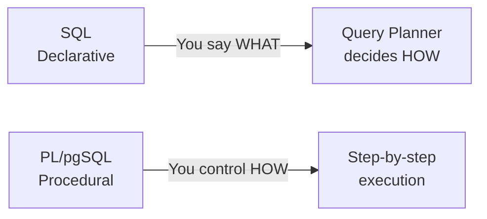

**Why this matters:** SQL being declarative is why you should not write procedural-style SQL (row-by-row cursor loops) for things that set-based SQL can solve. Set-based SQL is almost always faster because the query planner can optimize it. Save PL/pgSQL loops for when you genuinely need row-by-row logic.

---

## 2. Introduction to PostgreSQL / PL/pgSQL

[↑ Back to Index](#table-of-contents)

- **PL/pgSQL** = Procedural Language/PostgreSQL SQL — PostgreSQL's built-in procedural language
- Extends SQL with procedural features: loops, conditionals, exception handling, and variables
- Runs inside the PostgreSQL server engine — tightly integrated with SQL
- Used to write stored procedures, functions, triggers, and custom logic
- **PostgreSQL** is open-source, ACID-compliant, and supports advanced data types natively

### Types of SQL / Relational Databases

| Database          | Description                                     |
| ----------------- | ----------------------------------------------- |
| **PostgreSQL**    | Open-source, advanced object-relational DB      |
| **MS SQL Server** | Microsoft's enterprise relational DB            |
| **MySQL**         | Popular open-source DB, widely used in web apps |
| **Oracle SQL**    | Enterprise-grade DB by Oracle Corporation       |
| **PL/pgSQL**      | PostgreSQL's built-in procedural extension      |

### PL/pgSQL Block Structure

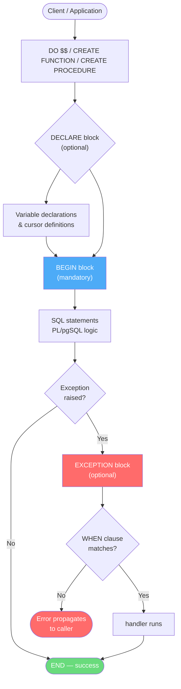

Every PL/pgSQL program is made up of **blocks**:

```sql
DO $$
DECLARE
  -- variable declarations (optional)
BEGIN
  -- executable statements (mandatory)
EXCEPTION
  -- error handling (optional)
END;
$$;
```

- **Anonymous Block** – not stored in DB, runs once (wrapped in `DO $$ ... $$;`)
- **Named Block** – stored as procedures, functions, triggers

### Hello World Example

```sql
DO $$
BEGIN
  RAISE NOTICE 'Hello, World!';
END;
$$;
```

> Messages appear via `RAISE NOTICE` — no additional setup required in psql

### Dollar-Quoting (`$$`)

PL/pgSQL function and procedure bodies are string literals passed to the PostgreSQL parser. You could wrap them in single quotes, but then every single quote _inside_ the body would need to be escaped (`''`). **Dollar-quoting** is a cleaner alternative — the body is delimited by `$$...$$` (or any tag like `$body$...$body$`), and single quotes inside need no escaping.

```sql
-- Single-quote style (messy — every internal quote must be doubled)
CREATE FUNCTION example() RETURNS TEXT LANGUAGE plpgsql AS
'BEGIN RETURN ''hello''; END;';

-- Dollar-quote style (clean — no escaping needed)
CREATE FUNCTION example() RETURNS TEXT LANGUAGE plpgsql AS
$$
BEGIN
  RETURN 'hello';
END;
$$;
```

The `$$` delimiter can be any identifier surrounded by `$`: `$body$`, `$func$`, `$q$`. All forms work identically — use a unique tag when nested dollar-quoting is required.

---

### SERIAL and GENERATED AS IDENTITY

Every table needs a primary key. In practice, most tables use an **auto-incrementing integer** as the PK. PostgreSQL provides two approaches:

**`SERIAL` (traditional, pre-10):**
`SERIAL` is syntactic sugar that creates a sequence and sets a default. It is shorthand — `id SERIAL PRIMARY KEY` expands to creating a sequence, setting `DEFAULT nextval(seq)`, and adding `NOT NULL`.

```sql
CREATE TABLE orders (
  order_id  SERIAL       PRIMARY KEY,  -- auto-increments: 1, 2, 3 ...
  customer  VARCHAR(100) NOT NULL
);

-- SERIAL variants by size:
-- SMALLSERIAL  → 2-byte integer, max ~32,000
-- SERIAL       → 4-byte integer, max ~2.1 billion
-- BIGSERIAL    → 8-byte integer, max ~9.2 quintillion (use for any growing table)
```

**`GENERATED ALWAYS AS IDENTITY` (SQL-standard, PostgreSQL 10+):**
The modern, SQL-standard approach. Prevents accidental overrides — `GENERATED ALWAYS` blocks manual inserts of the identity column unless you use `OVERRIDING SYSTEM VALUE`.

```sql
CREATE TABLE orders (
  order_id  INTEGER GENERATED ALWAYS AS IDENTITY PRIMARY KEY,
  customer  VARCHAR(100) NOT NULL
);

-- GENERATED BY DEFAULT allows manual override:
CREATE TABLE events (
  event_id  INTEGER GENERATED BY DEFAULT AS IDENTITY PRIMARY KEY,
  name      TEXT NOT NULL
);

-- Resetting a sequence (e.g., after bulk delete in dev)
ALTER SEQUENCE orders_order_id_seq RESTART WITH 1;
```

**Best practice:** Prefer `GENERATED ALWAYS AS IDENTITY` for new tables. Use `BIGSERIAL` / `BIGINT GENERATED ALWAYS AS IDENTITY` for any table that could grow large — you can never easily change PK type on a large live table.

---

## 3. Data Types

[↑ Back to Index](#table-of-contents)

```mermaid
graph TD
    DT["PostgreSQL Data Types"]
    DT --> NUM["Numeric<br/>INTEGER · NUMERIC · FLOAT"]
    DT --> MON["Monetary<br/>MONEY · NUMERIC(15,2)"]
    DT --> CHR["Character<br/>CHAR · VARCHAR · TEXT"]
    DT --> BIN["Binary<br/>BYTEA"]
    DT --> ENM["Enumerated<br/>ENUM"]
    DT --> BOL["Boolean<br/>TRUE / FALSE / NULL"]
    DT --> GEO["Geometric<br/>POINT · LINE · POLYGON"]
    DT --> DTM["Date / Time<br/>DATE · TIMESTAMP · INTERVAL"]
    DT --> JSN["Semi-Structured<br/>JSON · JSONB"]
    DT --> ARR["Arrays<br/>INTEGER[] · TEXT[]"]
    DT --> SPC["Special<br/>%TYPE · %ROWTYPE"]
    style DT fill:#4dabf7,color:#fff
    style NUM fill:#74c0fc
    style CHR fill:#74c0fc
    style DTM fill:#74c0fc
    style JSN fill:#ffa94d,color:#fff
    style SPC fill:#a9e34b
```

### Scalar Data Types

| Type            | Description                             |
| --------------- | --------------------------------------- |
| `INTEGER`       | Whole numbers                           |
| `NUMERIC(p, s)` | Exact numeric values (precision, scale) |
| `VARCHAR(n)`    | Variable-length string up to n chars    |
| `CHAR(n)`       | Fixed-length string                     |
| `DATE`          | Date only (no time component)           |
| `TIMESTAMP`     | Date and time with optional timezone    |
| `BOOLEAN`       | TRUE / FALSE / NULL (full column type)  |
| `TEXT`          | Unlimited-length text data              |
| `BYTEA`         | Binary data                             |

### Data Type Categories

#### 1. Numeric

- **INTEGER** — stores pure whole numbers (e.g., `EmpId INT` → 100, 101)
- **NUMERIC(P, S)** — stores exact decimal numbers

  - `P` = Precision → total number of digits (both sides of decimal)
  - `S` = Scale → number of digits **after** the decimal point
  - Example: `NUMERIC(10, 2)` allows up to 10 total digits with 2 decimal places

  | Value      | Precision (P) | Scale (S) |
  | ---------- | :-----------: | :-------: |
  | 100.23     |       5       |     2     |
  | 2345.98765 |       9       |     5     |

  ```sql
  DO $$
  DECLARE
    v_emp_id  INTEGER := 101;
    v_salary  NUMERIC(10, 2) := 2345.98;
  BEGIN
    RAISE NOTICE 'Emp ID : %', v_emp_id;
    RAISE NOTICE 'Salary : %', v_salary;
  END;
  $$;
  ```

#### 2. Monetary

- Used for currency values
- PostgreSQL has a native `MONEY` type, or use `NUMERIC(15, 2)` for full precision control

  ```sql
  DO $$
  DECLARE
    v_price   NUMERIC(15, 2) := 19999.99;
    v_tax     NUMERIC(15, 2) := v_price * 0.18;  -- 18% GST
  BEGIN
    RAISE NOTICE 'Price : %', v_price;
    RAISE NOTICE 'Tax   : %', v_tax;
    RAISE NOTICE 'Total : %', (v_price + v_tax);
  END;
  $$;
  ```

#### 3. Character

- **CHAR(n)** — Fixed-length string; always uses `n` characters of storage
  - e.g., `Emp_Name CHAR(100)` storing `'Prashant'` (8 chars) → **92 spaces padded**
- **VARCHAR(n)** — Variable-length string; stores only what's needed
  - e.g., `Emp_Name VARCHAR(100)` storing `'Prashant'` → only **8 chars used**
- Always enclose `CHAR` / `VARCHAR` values in **single quotes**: `'Prashant'`

  ```sql
  DO $$
  DECLARE
    v_fixed   CHAR(10)      := 'Hi';        -- always 10 chars (space-padded)
    v_dynamic VARCHAR(100)  := 'Prashant';  -- only 8 chars used
  BEGIN
    RAISE NOTICE 'CHAR   : %', v_fixed;
    RAISE NOTICE 'VARCHAR: %', v_dynamic;
  END;
  $$;
  ```

#### 4. Binary

- Stores data in byte format (images, files, etc.)
- Primary type: `BYTEA` (byte array) — PostgreSQL's native binary storage type

  ```sql
  -- Declaring a BYTEA variable to hold binary data (e.g., an image)
  DO $$
  DECLARE
    v_image  BYTEA;
  BEGIN
    -- In real use, BYTEA is loaded from a file or table column
    RAISE NOTICE 'BYTEA variable declared successfully.';
  END;
  $$;
  ```

#### 5. Enumerated

- A fixed set of named values
- Example: `CREATE TYPE sport_type AS ENUM ('Tennis', 'Cricket', 'Volleyball', 'Basketball')`
- PostgreSQL natively supports ENUM types via `CREATE TYPE ... AS ENUM`

  ```sql
  -- Creating a native ENUM type in PostgreSQL
  CREATE TYPE sport_type AS ENUM ('Tennis', 'Cricket', 'Volleyball', 'Basketball');

  CREATE TABLE Player (
    player_id  INTEGER,
    sport      sport_type
  );

  -- Valid insert
  INSERT INTO Player VALUES (1, 'Cricket');

  -- This will throw an error (value not in allowed list)
  INSERT INTO Player VALUES (2, 'Football');
  ```

#### 6. Boolean

- Holds `TRUE`, `FALSE`, or `NULL`
- Equivalent to `1 / 0` in some contexts
- **Note:** `BOOLEAN` is a **full column type** in PostgreSQL — usable in both PL/pgSQL code and table definitions

  ```sql
  DO $$
  DECLARE
    v_is_active  BOOLEAN := TRUE;
  BEGIN
    IF v_is_active THEN
      RAISE NOTICE 'Employee is active.';
    ELSE
      RAISE NOTICE 'Employee is inactive.';
    END IF;
  END;
  $$;
  ```

#### 7. Geometric

- Used to represent spatial/geometric data
- PostgreSQL has **built-in geometric types**: `POINT`, `LINE`, `LSEG`, `BOX`, `PATH`, `POLYGON`, `CIRCLE`
- No extension required — geometric types are part of PostgreSQL core

  ```sql
  -- Creating a table with a native PostgreSQL POINT column
  CREATE TABLE locations (
    loc_id  INTEGER,
    shape   POINT         -- native PostgreSQL geometric type
  );

  -- Storing a point (longitude, latitude) — Bangalore coordinates
  INSERT INTO locations (loc_id, shape)
  VALUES (1, POINT(77.5946, 12.9716));
  ```

#### 8. Date / Time

PostgreSQL has **six dedicated date/time types**:

| Type                                       | Stores                       | Storage  | Example Value             |
| ------------------------------------------ | ---------------------------- | -------- | ------------------------- |
| `DATE`                                     | Date only (no time)          | 4 bytes  | `2026-03-13`              |
| `TIME`                                     | Time of day (no date)        | 8 bytes  | `14:30:00`                |
| `TIME WITH TIME ZONE`                      | Time + timezone offset       | 12 bytes | `14:30:00+05:30`          |
| `TIMESTAMP`                                | Date + time (no timezone)    | 8 bytes  | `2026-03-13 14:30:00`     |
| `TIMESTAMP WITH TIME ZONE` (`TIMESTAMPTZ`) | Date + time + UTC-normalized | 8 bytes  | `2026-03-13 09:00:00+00`  |
| `INTERVAL`                                 | A duration / span of time    | 16 bytes | `2 years 3 months 5 days` |

---

**DATE** — stores the calendar date only; no time component.

```sql
-- Column definition
CREATE TABLE employees (
  hire_date  DATE NOT NULL
);

-- Inserting
INSERT INTO employees (hire_date) VALUES ('2025-01-15');
INSERT INTO employees (hire_date) VALUES (CURRENT_DATE);  -- today

-- Arithmetic: subtract two dates → number of days
SELECT CURRENT_DATE - '2025-01-01'::DATE AS days_since_new_year;  -- → integer
SELECT CURRENT_DATE + 30 AS date_in_30_days;                      -- add days
```

---

**TIME** — stores the time of day only; no date, no timezone.

```sql
CREATE TABLE schedules (
  start_time  TIME NOT NULL,
  end_time    TIME NOT NULL
);

INSERT INTO schedules VALUES ('09:00:00', '17:30:00');

SELECT TIME '14:30:00';           -- literal
SELECT CURRENT_TIME;              -- current time (with timezone)
SELECT LOCALTIME;                 -- current time (without timezone)

-- Arithmetic
SELECT TIME '17:30:00' - TIME '09:00:00';  -- → 08:30:00 (interval)
```

---

**TIMESTAMP** — stores date + time together, but **no timezone awareness**. Stores whatever you put in.

```sql
CREATE TABLE orders (
  created_at  TIMESTAMP NOT NULL DEFAULT CURRENT_TIMESTAMP
);

INSERT INTO orders (created_at) VALUES ('2026-03-13 14:30:00');
SELECT CURRENT_TIMESTAMP;     -- current date + time (with tz info)
SELECT LOCALTIMESTAMP;        -- current date + time (no tz)
```

---

**TIMESTAMP WITH TIME ZONE (`TIMESTAMPTZ`)** — stores date + time normalized to **UTC** internally; converts to local timezone on display. This is the **recommended type** for any event time when users are in multiple time zones.

```sql
CREATE TABLE events (
  event_time  TIMESTAMPTZ NOT NULL DEFAULT NOW()
);

-- PostgreSQL stores as UTC, displays in session timezone
INSERT INTO events (event_time) VALUES ('2026-03-13 14:30:00+05:30');
-- Stored as: 2026-03-13 09:00:00 UTC

-- Change session timezone to see conversion
SET TIME ZONE 'America/New_York';
SELECT event_time FROM events;  -- → displayed in EST/EDT
```

> **Best practice:** Always use `TIMESTAMPTZ` for `created_at`, `updated_at`, event times. Use plain `TIMESTAMP` only when timezone is truly irrelevant (e.g., a local schedule printed on paper).

---

**INTERVAL** — stores a duration (a span of time), not a point in time.

```sql
-- Interval literals
SELECT INTERVAL '1 year';
SELECT INTERVAL '2 months 15 days';
SELECT INTERVAL '3 hours 30 minutes';
SELECT INTERVAL '1 year 2 months 3 days 4 hours 5 minutes 6 seconds';

-- Using intervals in arithmetic
SELECT CURRENT_DATE + INTERVAL '30 days'       AS one_month_later;
SELECT NOW()        - INTERVAL '1 year'        AS one_year_ago;
SELECT hire_date    + INTERVAL '90 days'       AS probation_end FROM employees;

-- Column use: storing a session duration
CREATE TABLE sessions (
  session_id  SERIAL PRIMARY KEY,
  duration    INTERVAL
);
INSERT INTO sessions (duration) VALUES (INTERVAL '1 hour 45 minutes');

-- Extract parts from an interval
SELECT EXTRACT(DAYS FROM INTERVAL '2 years 3 months 10 days');  -- → 10
```

---

**Summary — Which type to use?**

| Scenario                                      | Recommended Type |
| --------------------------------------------- | ---------------- |
| Birthday, hire date, event date               | `DATE`           |
| Store opening/closing time                    | `TIME`           |
| Multi-timezone event (logs, orders, messages) | `TIMESTAMPTZ`    |
| Local schedule with no timezone concern       | `TIMESTAMP`      |
| Session duration, loan term, age difference   | `INTERVAL`       |

---

```sql
-- Full example using all types together
DO $$
DECLARE
  v_today      DATE        := CURRENT_DATE;
  v_ts         TIMESTAMPTZ := NOW();
  v_join_date  DATE        := TO_DATE('01-JAN-2025', 'DD-MON-YYYY');
  v_duration   INTERVAL    := v_today - v_join_date;
BEGIN
  RAISE NOTICE 'Today          : %', TO_CHAR(v_today, 'DD-MON-YYYY');
  RAISE NOTICE 'Timestamp (UTC): %', TO_CHAR(v_ts, 'DD-MON-YYYY HH24:MI:SS TZ');
  RAISE NOTICE 'Join Date  : %', TO_CHAR(v_join_date, 'DD-MON-YYYY');
  RAISE NOTICE 'Days Since Join: %', v_duration;
END;
$$;
```

### %TYPE and %ROWTYPE

- `%TYPE` — variable inherits the data type of a specific **column**
- `%ROWTYPE` — variable inherits the structure of an entire **table row**
- Benefit: if the column type changes in the table, your code adapts automatically

```sql
-- %TYPE example: match salary column's data type
DO $$
DECLARE
  v_sal  employees.salary%TYPE;   -- same type as employees.salary
BEGIN
  SELECT salary INTO v_sal
  FROM employees
  WHERE employee_id = 101;

  RAISE NOTICE 'Salary: %', v_sal;
END;
$$;

-- %ROWTYPE example: fetch an entire row at once
DO $$
DECLARE
  v_emp  employees%ROWTYPE;       -- holds all columns of employees table
BEGIN
  SELECT * INTO v_emp
  FROM employees
  WHERE employee_id = 101;

  RAISE NOTICE 'Name  : % %', v_emp.first_name, v_emp.last_name;
  RAISE NOTICE 'Salary: %', v_emp.salary;
  RAISE NOTICE 'Dept  : %', v_emp.department_id;
END;
$$;
```

---

### Composite Types

A **composite type** is a user-defined type that groups multiple fields (columns) under one name — essentially a struct/record. You can use composite types as column types in tables, as function return types, or as PL/pgSQL record variables.

#### CREATE TYPE ... AS (...)

```sql
-- Define a composite type for an address
CREATE TYPE address_type AS (
  street      VARCHAR(100),
  city        VARCHAR(50),
  state       VARCHAR(20),
  postal_code VARCHAR(10),
  country     VARCHAR(50)
);

-- Define a composite type for a full name
CREATE TYPE full_name_type AS (
  first_name  VARCHAR(50),
  last_name   VARCHAR(50),
  title       VARCHAR(10)
);
```

#### Using Composite Types as Column Types

```sql
-- Use composite type as a column
CREATE TABLE employees_v2 (
  employee_id  SERIAL PRIMARY KEY,
  full_name    full_name_type,
  home_address address_type,
  work_address address_type,
  salary       NUMERIC(12,2)
);

-- Insert using ROW() constructor
INSERT INTO employees_v2 (full_name, home_address, salary)
VALUES (
  ROW('Alice', 'Smith', 'Ms.'),
  ROW('12 Main St', 'Bangalore', 'KA', '560001', 'India'),
  80000
);

-- Access a field of a composite column using dot notation
-- NB: wrap the column name in parentheses before the dot
SELECT
  (full_name).first_name,
  (full_name).last_name,
  (home_address).city,
  (home_address).country
FROM employees_v2;
```

#### Composite Types as Function Return Values

```sql
-- Function returning a composite type
CREATE OR REPLACE FUNCTION get_full_name(p_emp_id INTEGER)
RETURNS full_name_type
LANGUAGE plpgsql AS $$
DECLARE
  v_name full_name_type;
BEGIN
  SELECT
    ROW(first_name, last_name, 'Dr.')::full_name_type
  INTO v_name
  FROM employees
  WHERE employee_id = p_emp_id;

  RETURN v_name;
END;
$$;

-- Call it and access fields
SELECT (get_full_name(101)).first_name, (get_full_name(101)).last_name;
```

#### Composite Types in PL/pgSQL

```sql
DO $$
DECLARE
  v_addr  address_type;
BEGIN
  v_addr.street      := '45 Park Road';
  v_addr.city        := 'Mumbai';
  v_addr.state       := 'MH';
  v_addr.postal_code := '400001';
  v_addr.country     := 'India';

  RAISE NOTICE 'City: %, Country: %', v_addr.city, v_addr.country;
END;
$$;
```

#### Modify and Drop Composite Types

```sql
-- Add a field to an existing composite type
ALTER TYPE address_type ADD ATTRIBUTE floor_number INTEGER;

-- Rename a field
ALTER TYPE address_type RENAME ATTRIBUTE postal_code TO zip_code;

-- Drop a type (fails if any table/function still uses it)
DROP TYPE IF EXISTS address_type CASCADE;
```

| Feature                         | Composite Type | `%ROWTYPE`              |
| ------------------------------- | -------------- | ----------------------- |
| Defined by                      | `CREATE TYPE`  | Inferred from a table   |
| Reusable as column type         | ✅ Yes         | ❌ No                   |
| Portable across functions       | ✅ Yes         | ✅ Yes (for that table) |
| Auto-updates when table changes | ❌ No          | ✅ Yes                  |

> Use composite types when you have a **logical group of fields** that appears in multiple tables or function signatures. Use `%ROWTYPE` when you just need to hold a row fetched from a specific table.

---

### Practice Questions — Data Types

**Q1.** What data type would you use for an employee salary that can hold up to 10 digits with 2 decimal places? Write a `CREATE TABLE` using it.

```sql
CREATE TABLE employees (
  emp_id   SERIAL PRIMARY KEY,
  emp_name VARCHAR(50)    NOT NULL,
  salary   NUMERIC(10, 2) NOT NULL
);
```

**Q2.** What is the difference between `CHAR(10)` and `VARCHAR(10)`? Demonstrate with a variable.

```sql
DO $$
DECLARE
  v_fixed   CHAR(10)    := 'Hi';      -- always 10 chars, pads with spaces
  v_dynamic VARCHAR(10) := 'Hi';      -- only 2 chars stored
BEGIN
  RAISE NOTICE 'CHAR length   : %', LENGTH(v_fixed);   -- 10
  RAISE NOTICE 'VARCHAR length: %', LENGTH(v_dynamic); -- 2
END;
$$;
```

**Q3.** Store today's date, current timestamp, and calculate how many days since `2025-01-01`.

```sql
DO $$
DECLARE
  v_today    DATE        := CURRENT_DATE;
  v_ts       TIMESTAMPTZ := NOW();
  v_start    DATE        := '2025-01-01';
  v_days     INTEGER     := CURRENT_DATE - '2025-01-01'::DATE;
BEGIN
  RAISE NOTICE 'Today    : %', v_today;
  RAISE NOTICE 'Now      : %', v_ts;
  RAISE NOTICE 'Days since 2025-01-01: %', v_days;
END;
$$;
```

**Q4.** Fetch employees hired in the years 1987, 1982, or 1980 from HR, IT, or Finance departments.

```sql
SELECT * FROM emp
WHERE TO_CHAR(hiredate, 'YYYY') IN ('1987', '1982', '1980')
  AND department IN ('HR', 'IT', 'Finance');
```

---

## 4. Variables & Constants

[↑ Back to Index](#table-of-contents)

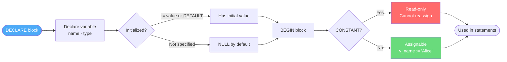

### Syntax

```sql
variable_name  data_type;                           -- uninitialized (NULL by default)
variable_name  data_type := initial_value;          -- initialized with :=
variable_name  data_type DEFAULT initial_value;     -- alternate init syntax
variable_name  CONSTANT data_type := value;         -- read-only constant
variable_name  table_name.column_name%TYPE;         -- type anchored to a table column
```

### Examples

**Basic declaration, initialization, and assignment:**

```sql
DO $$
DECLARE
  v_name    VARCHAR(50)    := 'Alice';        -- declared and initialized
  v_age     INTEGER        := 25;             -- integer variable
  v_salary  NUMERIC(10, 2);                   -- uninitialized → NULL
  v_pi      CONSTANT NUMERIC := 3.14159;      -- read-only constant
  v_active  BOOLEAN        := TRUE;
BEGIN
  v_salary := 75000.00;                       -- assigned in BEGIN block
  RAISE NOTICE 'Name   : %', v_name;
  RAISE NOTICE 'Age    : %', v_age;
  RAISE NOTICE 'Salary : %', v_salary;
  RAISE NOTICE 'Pi     : %', v_pi;
  RAISE NOTICE 'Active : %', v_active;
END;
$$;
```

**NULL check and DEFAULT value:**

```sql
DO $$
DECLARE
  v_discount  NUMERIC := NULL;
  v_label     TEXT    DEFAULT 'N/A';
BEGIN
  IF v_discount IS NULL THEN
    RAISE NOTICE 'No discount applied. Label: %', v_label;
  END IF;
END;
$$;
```

**Type-anchored variable (adapts automatically if the column type ever changes):**

```sql
DO $$
DECLARE
  v_emp_name  employees.first_name%TYPE;  -- same type as first_name column
  v_emp_sal   employees.salary%TYPE;      -- same type as salary column
BEGIN
  SELECT first_name, salary INTO v_emp_name, v_emp_sal
  FROM employees WHERE employee_id = 101;
  RAISE NOTICE 'Employee: %, Salary: %', v_emp_name, v_emp_sal;
END;
$$;
```

> - Variables are declared in the `DECLARE` block, before `BEGIN`
> - Use `:=` or `DEFAULT` for initialization; `:=` is preferred in PL/pgSQL
> - `CONSTANT` variables are read-only — attempting to reassign them raises an error
> - Uninitialized variables default to `NULL`

---

### Practice Questions — Variables & Constants

**Q1.** Declare variables for employee name (VARCHAR), salary (NUMERIC), and age (INTEGER). Assign values and print them.

```sql
DO $$
DECLARE
  v_name   VARCHAR(50) := 'Alice';
  v_salary NUMERIC     := 75000.00;
  v_age    INTEGER     := 30;
BEGIN
  RAISE NOTICE 'Name: %, Salary: %, Age: %', v_name, v_salary, v_age;
END;
$$;
```

**Q2.** Declare a constant for GST rate (18%). Calculate tax and total for a product priced at 5000.

```sql
DO $$
DECLARE
  v_price   NUMERIC          := 5000;
  v_gst     CONSTANT NUMERIC := 0.18;
  v_tax     NUMERIC;
  v_total   NUMERIC;
BEGIN
  v_tax   := v_price * v_gst;
  v_total := v_price + v_tax;
  RAISE NOTICE 'Price: %, GST: %, Total: %', v_price, v_tax, v_total;
END;
$$;
```

**Q3.** Use `%TYPE` to declare a variable matching `employees.salary`, fetch the salary of employee 101, and print it.

```sql
DO $$
DECLARE
  v_sal employees.salary%TYPE;
BEGIN
  SELECT salary INTO v_sal FROM employees WHERE employee_id = 101;
  RAISE NOTICE 'Salary of emp 101: %', v_sal;
END;
$$;
```

**Q4.** Declare an uninitialized variable. Check if it is NULL and assign a default if so.

```sql
DO $$
DECLARE
  v_bonus NUMERIC;
BEGIN
  IF v_bonus IS NULL THEN
    v_bonus := 0;
  END IF;
  RAISE NOTICE 'Bonus: %', v_bonus;  -- 0
END;
$$;
```

---

## 5. Languages in PostgreSQL

[↑ Back to Index](#table-of-contents)

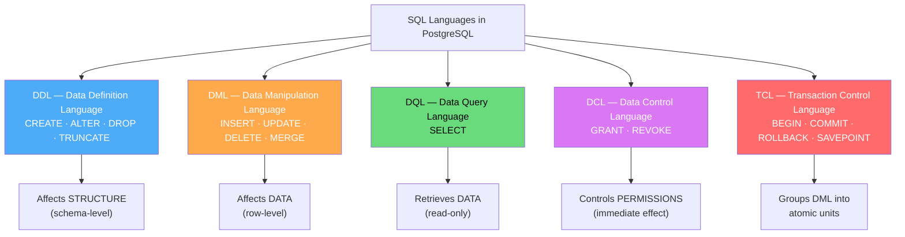

### DDL - Data Definition Language

- Defines and manages database **objects**: databases, tables, views, indexes, triggers, functions, etc.
- Operates on the **structure** of data (schema-level changes)
- DDL commands in PostgreSQL are **transactional** — they can be rolled back within a transaction block

#### CREATE

**Syntax:**

```sql
CREATE DATABASE database_name;

CREATE TABLE [IF NOT EXISTS] table_name (
  column1  datatype  [CONSTRAINT],
  column2  datatype  [CONSTRAINT],
  ...
);
```

**Example:**

```sql
-- Create a database
CREATE DATABASE company_db;

-- Create a table with constraints
CREATE TABLE employee_details (
  id      INTEGER        PRIMARY KEY,
  name    VARCHAR(100)   NOT NULL,
  salary  NUMERIC(10, 2) DEFAULT 0.00
);

-- Create only if it doesn't already exist
CREATE TABLE IF NOT EXISTS employee_details (
  id      INTEGER,
  name    VARCHAR(100),
  salary  NUMERIC(10, 2)
);
```

> **Table naming rules in PostgreSQL:**
>
> 1. Names may consist of letters, digits, and underscores
> 2. Identifiers are **case-insensitive** by default — `Employee` = `employee`
> 3. Use double-quotes to preserve exact case: `"Employee"`
> 4. SQL reserved keywords (e.g., `select`, `table`) must be quoted if used as names
> 5. A table must have at least one column

#### ALTER

**Syntax & Examples:**

```sql
-- Modify a column's data type
ALTER TABLE employee_details ALTER COLUMN name TYPE CHAR(100);
ALTER TABLE employee_details ALTER COLUMN name TYPE VARCHAR(200);

-- Add a new column
ALTER TABLE employee_details ADD COLUMN address VARCHAR(100);

-- Rename a column
ALTER TABLE employee_details RENAME COLUMN address TO emp_address;

-- Drop a column
ALTER TABLE employee_details DROP COLUMN emp_address;

-- Rename the table itself
ALTER TABLE employee_details RENAME TO employees;

-- Add a constraint
ALTER TABLE employees ADD CONSTRAINT chk_salary CHECK (salary >= 0);
```

#### TRUNCATE

**Syntax:**

```sql
TRUNCATE TABLE table_name;
TRUNCATE TABLE table_name RESTART IDENTITY;  -- also resets auto-increment sequences
```

**Example:**

```sql
TRUNCATE TABLE employee_details;
```

> Removes **all rows** but keeps the table structure intact. Faster than `DELETE` for full clears.

#### DROP

**Syntax:**

```sql
DROP TABLE [IF EXISTS] table_name;
DROP DATABASE [IF EXISTS] database_name;
```

**Example:**

```sql
DROP TABLE IF EXISTS employee_details;
DROP DATABASE IF EXISTS company_db;
```

> `DROP` **permanently deletes** the table and all its data. Use `IF EXISTS` to avoid errors if the object doesn't exist.

### DML - Data Manipulation Language

- Manipulates the **data** (rows) inside tables
- DML commands are **transactional** — changes can be rolled back before `COMMIT`

#### INSERT

**Syntax:**

```sql
INSERT INTO table_name VALUES (val1, val2, ...);
INSERT INTO table_name (col1, col2, ...) VALUES (val1, val2, ...);
```

**Examples:**

```sql
-- Insert into all columns (order must match table definition)
INSERT INTO employee_details VALUES (1, 'Prashant', 10000.00);

-- Insert into specific columns (recommended — column-order independent)
INSERT INTO employee_details (id, name, salary) VALUES (2, 'Pretti', 20000.00);

-- Insert multiple rows at once
INSERT INTO employee_details (id, name, salary) VALUES
  (3, 'Ravi',   35000.00),
  (4, 'Anjali', 42000.00),
  (5, 'Suresh', 28000.00);
```

#### UPDATE

**Syntax:**

```sql
UPDATE table_name
SET    column1 = value1 [, column2 = value2 ...]
WHERE  condition;
```

**Examples:**

```sql
-- Update a single field
UPDATE employee_details SET name = 'Prash' WHERE id = 1;

-- Update multiple fields at once
UPDATE employee_details SET name = 'Prash', salary = 15000.00 WHERE id = 1;

-- Update all rows (no WHERE — use with caution!)
UPDATE employee_details SET salary = salary * 1.10;
```

#### DELETE

**Syntax:**

```sql
DELETE FROM table_name WHERE condition;
```

**Examples:**

```sql
-- Delete a specific row
DELETE FROM employee_details WHERE id = 1;

-- Delete rows matching a condition
DELETE FROM employee_details WHERE salary < 5000;

-- Delete all rows (keeps the table — unlike TRUNCATE, this is transactional)
DELETE FROM employee_details;
```

#### MERGE (Upsert / Conditional DML — PostgreSQL 15+)

**What it is:** `MERGE` combines INSERT, UPDATE, and DELETE into a single statement based on whether a source row matches a target row. A true SQL-standard upsert.

**Syntax:**

```sql
MERGE INTO target_table AS t
USING source_table AS s
ON    t.key_column = s.key_column
WHEN MATCHED THEN
  UPDATE SET t.col1 = s.col1, t.col2 = s.col2
WHEN NOT MATCHED THEN
  INSERT (col1, col2) VALUES (s.col1, s.col2)
WHEN MATCHED AND s.status = 'deleted' THEN
  DELETE;
```

**Example — sync a staging table into production:**

```sql
MERGE INTO employees AS target
USING staging_employees AS source
ON    target.employee_id = source.employee_id
WHEN MATCHED THEN
  UPDATE SET
    first_name = source.first_name,
    salary     = source.salary
WHEN NOT MATCHED THEN
  INSERT (employee_id, first_name, salary)
  VALUES (source.employee_id, source.first_name, source.salary);
```

> **Note:** For PostgreSQL < 15, use `INSERT ... ON CONFLICT` (covered in Section 12 — Built-in Functions → UPSERT) which provides similar functionality.

---

#### RETURNING — Get Data Back from DML

**What it is:** `RETURNING` lets you retrieve column values from rows that were **just inserted, updated, or deleted** — in a single statement, without a separate `SELECT` round-trip. This is one of the most practically useful PostgreSQL-specific features.

**Syntax:**

```sql
INSERT INTO table_name (...) VALUES (...) RETURNING column [, column ...];
UPDATE table_name SET ... WHERE ... RETURNING column [, column ...];
DELETE FROM table_name WHERE ... RETURNING column [, column ...];
```

**Examples:**

```sql
-- INSERT RETURNING: get the auto-generated ID after insert
INSERT INTO employees (first_name, last_name, salary)
VALUES ('Alice', 'Smith', 75000)
RETURNING employee_id, created_at;
-- Returns the new row's employee_id and created_at without a second query

-- UPDATE RETURNING: get the new values after update
UPDATE employees
SET salary = salary * 1.10
WHERE department_id = 3
RETURNING employee_id, first_name, salary AS new_salary;
-- Returns every updated row with its new salary

-- DELETE RETURNING: get the rows you just deleted (e.g. for audit)
DELETE FROM orders
WHERE status = 'cancelled' AND order_date < NOW() - INTERVAL '1 year'
RETURNING order_id, customer_id, total_amount;

-- RETURNING * — return all columns
INSERT INTO departments (department_name)
VALUES ('Engineering')
RETURNING *;

-- Using RETURNING with a CTE (write-then-read pattern)
WITH inserted AS (
  INSERT INTO audit_log (action, performed_by)
  VALUES ('LOGIN', 'alice')
  RETURNING log_id, action_time
)
SELECT * FROM inserted;
```

> - `RETURNING` eliminates the extra `SELECT` roundtrip — critical in backend code (Node.js: `pool.query('INSERT ... RETURNING id')` gives you the new ID directly)
> - Works with all three DML commands: `INSERT`, `UPDATE`, `DELETE`
> - You can use `RETURNING *` to get all columns, or list specific ones
> - It does **not** require a separate transaction — the returned data is the committed state

---

### DQL - Data Query Language

- **DQL (Data Query Language)** uses the `SELECT` statement to **retrieve** data from one or more tables
- `SELECT` is read-only — it never modifies data
- Supports filtering (`WHERE`), sorting (`ORDER BY`), aggregation, JOINs, and subqueries

#### DISTINCT ON — PostgreSQL's Unique Row-Per-Group Feature

**What it is:** `DISTINCT ON (expression)` is a PostgreSQL-specific extension to `SELECT DISTINCT`. It returns **one row per distinct value of the expression**, choosing which row to keep based on an `ORDER BY` clause. This is the idiomatic way to get "the latest record per group" or "the top item per category" without a subquery.

**Syntax:**

```sql
SELECT DISTINCT ON (column1 [, column2 ...])
       column1, column2, ...
FROM   table_name
ORDER BY column1 [, column2 ...], tiebreaker_column [ASC | DESC];
```

> The `ORDER BY` must start with the same columns listed in `DISTINCT ON`.

**Examples:**

```sql
-- Latest order per customer (most recent order_date wins)
SELECT DISTINCT ON (customer_id)
       customer_id, order_id, order_date, total_amount
FROM   orders
ORDER BY customer_id, order_date DESC;
-- One row per customer_id — the one with the highest order_date

-- Highest-paid employee per department
SELECT DISTINCT ON (department_id)
       department_id, employee_id, first_name, salary
FROM   employees
ORDER BY department_id, salary DESC;

-- Latest log entry per action type
SELECT DISTINCT ON (action_type)
       action_type, user_id, log_time, details
FROM   audit_log
ORDER BY action_type, log_time DESC;
```

> **vs subquery approach:** `DISTINCT ON` is cleaner and usually faster than `ROW_NUMBER() OVER (...) = 1` or correlated subqueries for the "latest per group" pattern. It is PostgreSQL-only — not portable to MySQL/SQL Server.

#### SELECT Syntax

```sql
SELECT column1, column2, ...    -- or * for all columns
FROM   table_name
[JOIN  other_table ON condition]
[WHERE condition]
[GROUP BY column]
[HAVING group_condition]
[ORDER BY column [ASC | DESC]]
[LIMIT  n]
[OFFSET n];
```

#### Examples

```sql
-- All columns, all rows
SELECT * FROM employee_details;

-- Specific columns only
SELECT id, name FROM employee_details;

-- Filter with WHERE
SELECT * FROM employee_details WHERE id = 1;
SELECT * FROM employee_details WHERE salary > 20000;

-- Pattern matching with LIKE
SELECT * FROM employee_details WHERE name LIKE 'Pr%';   -- starts with 'Pr'
SELECT * FROM employee_details WHERE name LIKE '%ant';  -- ends with 'ant'

-- Sort results
SELECT * FROM employee_details ORDER BY salary DESC;
SELECT * FROM employee_details ORDER BY name ASC, salary DESC;

-- Limit rows (useful for pagination)
SELECT * FROM employee_details ORDER BY id LIMIT 10 OFFSET 20;

-- Column aliases
SELECT name AS employee_name, salary AS monthly_pay
FROM employee_details;

-- Aggregate functions
SELECT COUNT(*)    AS total_employees FROM employee_details;
SELECT MAX(salary) AS highest_salary  FROM employee_details;
SELECT MIN(salary) AS lowest_salary   FROM employee_details;
SELECT AVG(salary) AS average_salary  FROM employee_details;
SELECT SUM(salary) AS total_payroll   FROM employee_details;

-- GROUP BY with HAVING
SELECT   department_id, COUNT(*) AS headcount
FROM     employees
GROUP BY department_id
HAVING   COUNT(*) > 5
ORDER BY headcount DESC;

-- INNER JOIN
SELECT e.name, d.department_name
FROM   employee_details e
JOIN   departments d ON e.department_id = d.id;

-- LEFT JOIN (include employees even if they have no department)
SELECT e.name, d.department_name
FROM   employee_details e
LEFT JOIN departments d ON e.department_id = d.id;

-- Subquery
SELECT name, salary
FROM   employee_details
WHERE  salary = (SELECT MAX(salary) FROM employee_details);
```

### DCL - Data Control Language

- Controls **access permissions** on database objects (tables, schemas, functions, etc.)
- Changes take effect **immediately** — no `COMMIT` required

#### GRANT

**Syntax:**

```sql
GRANT privilege [, privilege ...]
ON    object
TO    user_or_role;
```

**Examples:**

```sql
-- Grant SELECT to a specific user
GRANT SELECT ON employee_details TO john;

-- Grant multiple privileges to a role
GRANT SELECT, INSERT, UPDATE ON employee_details TO hr_staff;

-- Grant all privileges
GRANT ALL PRIVILEGES ON employee_details TO admin_user;

-- Grant on all tables in a schema
GRANT SELECT ON ALL TABLES IN SCHEMA public TO readonly_user;

-- Grant schema usage
GRANT USAGE ON SCHEMA hr_pkg TO john;
```

#### REVOKE

**Syntax:**

```sql
REVOKE privilege [, privilege ...]
ON     object
FROM   user_or_role;
```

**Examples:**

```sql
-- Revoke SELECT from a user
REVOKE SELECT ON employee_details FROM john;

-- Revoke all privileges
REVOKE ALL PRIVILEGES ON employee_details FROM hr_staff;

-- Revoke schema usage
REVOKE USAGE ON SCHEMA hr_pkg FROM john;
```

### Roles and Users (DCL — Access Management)

In PostgreSQL, **roles** are the fundamental security principal. A role can be a login user, a group, or both. `CREATE USER` is just shorthand for `CREATE ROLE ... WITH LOGIN`.

#### CREATE ROLE / CREATE USER

```sql
-- Create a login role (i.e. a user)
CREATE ROLE alice WITH LOGIN PASSWORD 'securepass123';

-- CREATE USER is identical — just syntactic sugar
CREATE USER bob WITH PASSWORD 'anotherpass' CREATEDB;

-- Role without login (a group role — used to bundle privileges)
CREATE ROLE hr_readonly;

-- Grant group role to a user
GRANT hr_readonly TO alice;

-- Role with superuser (use with extreme caution)
CREATE ROLE admin_user WITH LOGIN SUPERUSER PASSWORD 'adminpass';

-- Role that can create databases
CREATE ROLE devuser WITH LOGIN CREATEDB PASSWORD 'devpass';
```

#### Role Attribute Options

| Attribute            | Description                                    |
| -------------------- | ---------------------------------------------- |
| `LOGIN`              | Can connect to a database                      |
| `SUPERUSER`          | Bypasses all permission checks — use sparingly |
| `CREATEDB`           | Can create new databases                       |
| `CREATEROLE`         | Can create new roles                           |
| `REPLICATION`        | Can initiate streaming replication             |
| `PASSWORD`           | Sets the login password                        |
| `CONNECTION LIMIT n` | Limits concurrent connections (-1 = unlimited) |
| `VALID UNTIL`        | Password expiry date                           |

#### Modify and Drop Roles

```sql
-- Change password
ALTER ROLE alice WITH PASSWORD 'newpass';

-- Disable login (lock the account)
ALTER ROLE alice WITH NOLOGIN;

-- Re-enable login
ALTER ROLE alice WITH LOGIN;

-- Grant object-level permissions to a group role
GRANT SELECT, INSERT ON employees TO hr_readonly;
GRANT USAGE ON SCHEMA public TO hr_readonly;

-- Revoke role membership
REVOKE hr_readonly FROM alice;

-- Drop a role (must have no owned objects or dependencies)
DROP ROLE IF EXISTS alice;
```

> **Best practice:** Never grant permissions directly to users — create **group roles** (`hr_readonly`, `app_user`, `analyst`) with the required permissions, then grant those roles to individual users. This makes permission management maintainable at scale.

#### COPY — Bulk Import / Export

`COPY` is PostgreSQL's high-performance bulk data transfer command. It reads/writes CSV or binary files directly from/to the server filesystem. `\copy` (psql client-side) works from the client machine.

```sql
-- Export a table to CSV (server-side; requires superuser or pg_write_server_files)
COPY employees TO '/tmp/employees.csv' WITH (FORMAT CSV, HEADER true);

-- Import from CSV into a table (all columns, in order)
COPY employees FROM '/tmp/employees.csv' WITH (FORMAT CSV, HEADER true);

-- Import specific columns only
COPY employees (first_name, last_name, salary)
FROM '/tmp/employees_partial.csv'
WITH (FORMAT CSV, HEADER true, DELIMITER ',', NULL 'NULL');

-- Export a custom query result to CSV
COPY (SELECT employee_id, first_name, salary FROM employees WHERE department_id = 3)
TO '/tmp/dept3.csv'
WITH (FORMAT CSV, HEADER true);

-- psql client-side \copy (no superuser needed — reads from your local machine)
-- Run from psql prompt:
-- \copy employees FROM '/Users/me/employees.csv' WITH (FORMAT CSV, HEADER);
-- \copy (SELECT * FROM employees) TO '/tmp/out.csv' WITH (FORMAT CSV);
```

|               | `COPY` (server-side)                          | `\copy` (client-side, psql)        |
| ------------- | --------------------------------------------- | ---------------------------------- |
| File location | PostgreSQL server filesystem                  | Your local machine                 |
| Permissions   | Requires `pg_write_server_files` or superuser | Any connected user                 |
| Performance   | Fastest (direct OS I/O)                       | Slightly slower (network transfer) |

> For production imports of millions of rows, `COPY FROM` is dramatically faster than batching `INSERT` statements — it bypasses trigger/constraint overhead in bulk mode.

### TCL - Transaction Control Language

- Groups DML statements into a **transaction** — treated as a single all-or-nothing unit of work
- Ensures **ACID** properties (Atomicity, Consistency, Isolation, Durability)

#### Commands Summary

| Command                      | Description                                       |
| ---------------------------- | ------------------------------------------------- |
| `BEGIN`                      | Start a new transaction block                     |
| `COMMIT`                     | Save all changes made within the transaction      |
| `ROLLBACK`                   | Undo all changes made since `BEGIN`               |
| `SAVEPOINT name`             | Set a named checkpoint within the transaction     |
| `ROLLBACK TO SAVEPOINT name` | Undo changes back to the savepoint only           |
| `RELEASE SAVEPOINT name`     | Remove the savepoint (changes before it are kept) |

#### ROLLBACK — Undo changes

```sql
BEGIN;

  DELETE FROM employee_details WHERE id = 1;
  SELECT * FROM employee_details;     -- row 1 appears gone (within this transaction)

ROLLBACK;

SELECT * FROM employee_details;       -- row 1 is restored
```

#### COMMIT — Persist changes permanently

```sql
BEGIN;

  DELETE FROM employee_details WHERE id = 1;
  UPDATE employee_details SET salary = salary * 1.10 WHERE id = 2;

COMMIT;

SELECT * FROM employee_details;       -- changes are now permanent
```

#### SAVEPOINT — Partial rollback within a transaction

```sql
BEGIN;

  INSERT INTO employee_details VALUES (10, 'Test1', 5000.00);
  SAVEPOINT sp1;                          -- checkpoint after first insert

  INSERT INTO employee_details VALUES (11, 'Test2', 6000.00);
  ROLLBACK TO SAVEPOINT sp1;              -- undo only the second insert

  INSERT INTO employee_details VALUES (12, 'Test3', 7000.00);

COMMIT;

-- Result: rows 10 and 12 are committed; row 11 was rolled back
```

---

### Training Sample Datasets

These two tables are used throughout the practice questions. Run these scripts once to set up the training environment.

#### EMP Table — Classic Oracle Demo Dataset (14 Employees)

```sql
CREATE TABLE EMP (
  EMPNO    INT          NOT NULL,
  ENAME    VARCHAR(10),
  JOB      VARCHAR(9),
  MGR      INT,
  HIREDATE DATE,
  SAL      INT,
  COMM     INT,
  DEPTNO   INT
);

INSERT INTO EMP VALUES (7369, 'SMITH',  'CLERK',     7902, TO_DATE('17-DEC-1980', 'DD-MON-YYYY'),  800, NULL, 20);
INSERT INTO EMP VALUES (7499, 'ALLEN',  'SALESMAN',  7698, TO_DATE('20-FEB-1981', 'DD-MON-YYYY'), 1600,  300, 30);
INSERT INTO EMP VALUES (7521, 'WARD',   'SALESMAN',  7698, TO_DATE('22-FEB-1981', 'DD-MON-YYYY'), 1250,  500, 30);
INSERT INTO EMP VALUES (7566, 'JONES',  'MANAGER',   7839, TO_DATE('2-APR-1981',  'DD-MON-YYYY'), 2975, NULL, 20);
INSERT INTO EMP VALUES (7654, 'MARTIN', 'SALESMAN',  7698, TO_DATE('28-SEP-1981', 'DD-MON-YYYY'), 1250, 1400, 30);
INSERT INTO EMP VALUES (7698, 'BLAKE',  'MANAGER',   7839, TO_DATE('1-MAY-1981',  'DD-MON-YYYY'), 2850, NULL, 30);
INSERT INTO EMP VALUES (7782, 'CLARK',  'MANAGER',   7839, TO_DATE('9-JUN-1981',  'DD-MON-YYYY'), 2450, NULL, 10);
INSERT INTO EMP VALUES (7788, 'SCOTT',  'ANALYST',   7566, TO_DATE('09-DEC-1982', 'DD-MON-YYYY'), 3000, NULL, 20);
INSERT INTO EMP VALUES (7839, 'KING',   'PRESIDENT', NULL, TO_DATE('17-NOV-1981', 'DD-MON-YYYY'), 5000, NULL, 10);
INSERT INTO EMP VALUES (7844, 'TURNER', 'SALESMAN',  7698, TO_DATE('8-SEP-1981',  'DD-MON-YYYY'), 1500,    0, 30);
INSERT INTO EMP VALUES (7876, 'ADAMS',  'CLERK',     7788, TO_DATE('12-JAN-1983', 'DD-MON-YYYY'), 1100, NULL, 20);
INSERT INTO EMP VALUES (7900, 'JAMES',  'CLERK',     7698, TO_DATE('3-DEC-1981',  'DD-MON-YYYY'),  950, NULL, 30);
INSERT INTO EMP VALUES (7902, 'FORD',   'ANALYST',   7566, TO_DATE('3-DEC-1981',  'DD-MON-YYYY'), 3000, NULL, 20);
INSERT INTO EMP VALUES (7934, 'MILLER', 'CLERK',     7782, TO_DATE('23-JAN-1982', 'DD-MON-YYYY'), 1300, NULL, 10);

SELECT * FROM EMP;
```

> `TO_DATE('17-DEC-1980', 'DD-MON-YYYY')` is the standard way to parse a date string into a `DATE` type. The format mask must match the input string exactly.

#### Employee Table — Modern Training Dataset (10 employees)

```sql
DROP TABLE IF EXISTS Employee;

CREATE TABLE Employee (
  EmpId    INT,
  Name     VARCHAR(30),
  Role     VARCHAR(30),
  HireDate DATE,
  Salary   INT
);

INSERT INTO Employee VALUES (1,  'Rizwan',      'TeamLead', '2022-03-13', 40000);
INSERT INTO Employee VALUES (2,  'Akash',       'Finance',  '2012-02-10', 60000);
INSERT INTO Employee VALUES (3,  'Annapoorani', 'HR',       '2018-09-24', 70000);
INSERT INTO Employee VALUES (4,  'Chandhan',    'Finance',  '2021-04-01', 65000);
INSERT INTO Employee VALUES (5,  'Gandi',       'TeamLead', '2023-03-30', 75000);
INSERT INTO Employee VALUES (6,  'Kaliban',     'HR',       '2005-03-13', 80000);
INSERT INTO Employee VALUES (7,  'Khurram',     'TeamLead', '2006-09-13', 70000);
INSERT INTO Employee VALUES (8,  'Masni',       'Finance',  '2016-08-13', 80000);
INSERT INTO Employee VALUES (9,  'Naveen',      'TeamLead', '2015-05-19', 90000);
INSERT INTO Employee VALUES (10, 'Pratik',      'HR',       '2025-03-13', 90000);

SELECT * FROM Employee;
```

---

### Practice Questions — DDL / DML / TCL

**Q1.** Create an `emp` table with `empno`, `ename`, `job`, `salary`, `hiredate`, `deptno` columns. Insert 3 rows.

```sql
CREATE TABLE emp (
  empno    SERIAL PRIMARY KEY,
  ename    VARCHAR(20)    NOT NULL,
  job      VARCHAR(15),
  salary   NUMERIC(10,2)  DEFAULT 0,
  hiredate DATE           DEFAULT CURRENT_DATE,
  deptno   INTEGER
);

INSERT INTO emp (ename, job, salary, hiredate, deptno) VALUES
  ('SMITH',  'CLERK',   800,  '1980-12-17', 20),
  ('SCOTT',  'ANALYST', 3000, '1982-12-09', 20),
  ('MILLER', 'CLERK',   1300, '1982-01-23', 10);
```

**Q2.** Update SMITH's salary to 1000, then use `RETURNING` to confirm the new value in one statement.

```sql
UPDATE emp
SET salary = 1000
WHERE ename = 'SMITH'
RETURNING empno, ename, salary;
```

**Q3.** Use a transaction: delete an employee, then roll back. Verify the row is still there.

```sql
BEGIN;
  DELETE FROM emp WHERE ename = 'MILLER';
  SELECT * FROM emp;   -- MILLER appears gone within this transaction
ROLLBACK;
SELECT * FROM emp;     -- MILLER is back
```

**Q4.** Use `DISTINCT ON` to get the most recently hired employee per department.

```sql
SELECT DISTINCT ON (deptno)
  deptno, empno, ename, hiredate
FROM emp
ORDER BY deptno, hiredate DESC;
```

---

## 6. Types of Operators

[↑ Back to Index](#table-of-contents)

- An **operator** is a symbol that tells PostgreSQL to perform a specific operation on one or more values
- Operators are used in `SELECT`, `WHERE`, `UPDATE`, `DELETE`, and expressions throughout SQL

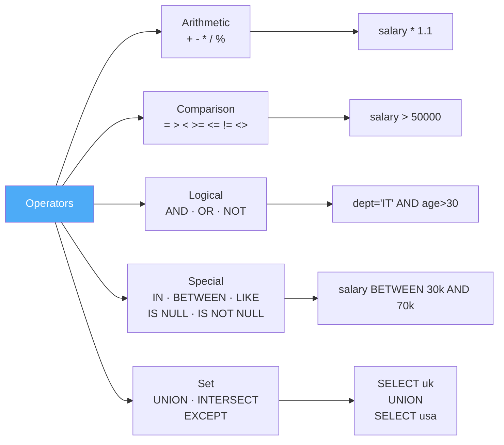

### Operator Categories Overview

| Category   | Operators                                                                              |
| ---------- | -------------------------------------------------------------------------------------- |
| Arithmetic | `+`, `-`, `*`, `/`, `%`                                                                |
| Assignment | `=` (in `SET` clause of `UPDATE`)                                                      |
| Comparison | `=`, `>`, `<`, `>=`, `<=`, `!=` / `<>`                                                 |
| Logical    | `AND`, `OR`, `NOT`                                                                     |
| Special    | `IN`, `NOT IN`, `BETWEEN`, `NOT BETWEEN`, `LIKE`, `NOT LIKE`, `IS NULL`, `IS NOT NULL` |
| Set        | `UNION`, `UNION ALL`, `INTERSECT`, `EXCEPT`                                            |

---

#### Setup — Sample Table

```sql
CREATE TABLE employee (
  id         INTEGER,
  name       VARCHAR(30),
  department VARCHAR(30),
  salary     INTEGER,
  gender     VARCHAR(10),
  age        INTEGER,
  city       VARCHAR(30)
);

INSERT INTO employee VALUES
  (1, 'Rizwan',  'IT',      10000, 'Male', 35, 'Hyderabad'),
  (2, 'Adari',   'HR',      20000, 'Male', 34, 'Mumbai'),
  (3, 'Akash',   'Finance', 30000, 'Male', 33, 'Bangalore'),
  (4, 'Khurram', 'IT',      40000, 'Male', 32, 'Hyderabad'),
  (5, 'Sagar',   'HR',      50000, 'Male', 31, 'Mumbai'),
  (6, 'Vaibhav', 'Finance', 60000, 'Male', 34, 'Bangalore'),
  (7, 'Zack',    'IT',      70000, 'Male', 32, 'Hyderabad');
```

---

### Arithmetic Operators

**Operators:** `+` (add), `-` (subtract), `*` (multiply), `/` (divide), `%` (modulo)

**Syntax:**

```sql
SELECT expression AS alias FROM table_name;
```

**Examples:**

```sql
-- Add 10,000 to each salary (display only, does not update)
SELECT id, name, salary, salary + 10000 AS increased_salary FROM employee;

-- Double every salary
SELECT id, name, salary, salary * 2 AS doubled_salary FROM employee;

-- Remaining after division
SELECT id, name, salary, salary % 3000 AS remainder FROM employee;

-- Calculate annual salary
SELECT id, name, salary * 12 AS annual_salary FROM employee;
```

---

### Comparison / Relational Operators

**Operators:** `=`, `>`, `<`, `>=`, `<=`, `!=` (or `<>`)

**Syntax:**

```sql
SELECT * FROM table_name WHERE column operator value;
```

**Examples:**

```sql
-- Equal to
SELECT * FROM employee WHERE id = 1;

-- Greater than
SELECT * FROM employee WHERE salary > 30000;

-- Less than or equal to
SELECT * FROM employee WHERE salary <= 30000;

-- Not equal to
SELECT * FROM employee WHERE salary != 30000;
SELECT * FROM employee WHERE salary <> 30000;   -- alternate syntax
```

---

### Logical Operators

**Operators:** `AND`, `OR`, `NOT`

| Operator | Description                         |
| -------- | ----------------------------------- |
| `AND`    | Both conditions must be true        |
| `OR`     | At least one condition must be true |
| `NOT`    | Reverses / negates the condition    |

**Examples:**

```sql
-- AND: department is IT AND gender is Male
SELECT * FROM employee WHERE department = 'IT' AND gender = 'Male';

-- AND: department is IT AND age is 35
SELECT * FROM employee WHERE department = 'IT' AND age = 35;

-- OR: department is IT OR age is 35
SELECT * FROM employee WHERE department = 'IT' OR age = 35;

-- NOT: employees not in Hyderabad
SELECT * FROM employee WHERE NOT city = 'Hyderabad';
SELECT * FROM employee WHERE city != 'Hyderabad';    -- equivalent

-- Combined: salary range AND city is not Bangalore
SELECT * FROM employee
WHERE (salary >= 30000 AND salary <= 70000)
  AND city != 'Bangalore';
```

---

### Special Operators

#### IN / NOT IN

**Syntax:**

```sql
column IN (val1, val2, ...)
column NOT IN (val1, val2, ...)
```

**Examples:**

```sql
-- Employees in IT or HR department
SELECT * FROM employee WHERE department IN ('IT', 'HR');

-- Employees NOT in IT or HR
SELECT * FROM employee WHERE department NOT IN ('IT', 'HR');

-- Delete employees with id 1, 2, or 3
DELETE FROM employee WHERE id IN (1, 2, 3);

-- Update salaries for employees aged 33 or 34
UPDATE employee SET salary = salary + 10000 WHERE age IN (33, 34);
```

#### BETWEEN / NOT BETWEEN

**Syntax:**

```sql
column BETWEEN lower_value AND upper_value
column NOT BETWEEN lower_value AND upper_value
```

> Note: Range is **inclusive** and the lower value must come first.

**Examples:**

```sql
-- Salary between 30k and 70k (inclusive)
SELECT * FROM employee WHERE salary BETWEEN 30000 AND 70000;

-- Salary outside that range
SELECT * FROM employee WHERE salary NOT BETWEEN 30000 AND 70000;

-- Age between 30 and 35
SELECT * FROM employee WHERE age BETWEEN 30 AND 35;
```

#### LIKE / NOT LIKE

**Syntax:**

```sql
column LIKE 'pattern'
column NOT LIKE 'pattern'
```

| Wildcard | Meaning                    |
| -------- | -------------------------- |
| `%`      | Any sequence of characters |
| `_`      | Any single character       |

**Examples:**

```sql
-- Names starting with 'A'
SELECT * FROM employee WHERE name LIKE 'A%';

-- Names ending with 'h'
SELECT * FROM employee WHERE name LIKE '%h';

-- Names containing 'a' anywhere
SELECT * FROM employee WHERE name LIKE '%a%';

-- Names where the second character is 'a'
SELECT * FROM employee WHERE name LIKE '_a%';

-- Names NOT starting with 'A'
SELECT * FROM employee WHERE name NOT LIKE 'A%';
```

#### IS NULL / IS NOT NULL

```sql
-- Find employees with no city recorded
SELECT * FROM employee WHERE city IS NULL;

-- Find employees who have a city recorded
SELECT * FROM employee WHERE city IS NOT NULL;
```

---

### Set Operators

Set operators combine results of two or more `SELECT` statements. Both queries must return the **same number of columns** with **compatible data types**.

| Operator    | Description                                                      |
| ----------- | ---------------------------------------------------------------- |
| `UNION`     | Combines results, returns **distinct** rows only                 |
| `UNION ALL` | Combines results, keeps **all rows including duplicates**        |
| `INTERSECT` | Returns rows that appear in **both** result sets                 |
| `EXCEPT`    | Returns rows in the **first** set that are **not** in the second |

**Setup:**

```sql
CREATE TABLE employee_uk (
  employee_id INTEGER, first_name VARCHAR(20), last_name VARCHAR(20),
  gender VARCHAR(10), department VARCHAR(20)
);
INSERT INTO employee_uk VALUES
  (1,'Pranaya','Rout','Male','IT'),   (2,'Priyanka','Dewangan','Female','IT'),
  (3,'Preety','Tiwary','Female','HR'),(4,'Subrat','Sahoo','Male','HR'),
  (5,'Anurag','Mohanty','Male','IT'), (6,'Rajesh','Pradhan','Male','HR'),
  (7,'Hina','Sharma','Female','IT');

CREATE TABLE employee_usa (
  employee_id INTEGER, first_name VARCHAR(20), last_name VARCHAR(20),
  gender VARCHAR(10), department VARCHAR(20)
);
INSERT INTO employee_usa VALUES
  (1,'James','Pattrick','Male','IT'),  (2,'Priyanka','Dewangan','Female','IT'),
  (3,'Sara','Taylor','Female','HR'),   (4,'Subrat','Sahoo','Male','HR'),
  (5,'Sushanta','Jena','Male','HR'),   (6,'Mahesh','Sindhey','Female','HR'),
  (7,'Hina','Sharma','Female','IT');
```

**Examples:**

```sql
-- UNION: unique employees from both offices
SELECT * FROM employee_uk
UNION
SELECT * FROM employee_usa;

-- UNION ALL: all employees including duplicates
SELECT * FROM employee_uk
UNION ALL
SELECT * FROM employee_usa;

-- INTERSECT: employees who work in BOTH offices
SELECT * FROM employee_uk
INTERSECT
SELECT * FROM employee_usa;

-- EXCEPT: employees only in UK office (not in USA)
SELECT * FROM employee_uk
EXCEPT
SELECT * FROM employee_usa;
```

---

### Practice Questions — Operators

**Q1.** Get employees in the IT or Finance department with salary greater than 30,000.

```sql
SELECT * FROM employee
WHERE department IN ('IT', 'Finance')
  AND salary > 30000;
```

**Q2.** Get employees whose name starts with 'S' and salary is between 20,000 and 60,000.

```sql
SELECT * FROM employee
WHERE name LIKE 'S%'
  AND salary BETWEEN 20000 AND 60000;
```

**Q3.** Get employees hired in 1987, 1982, or 1980 from HR, IT, or Finance.

```sql
SELECT * FROM emp
WHERE TO_CHAR(hiredate, 'YYYY') IN ('1987', '1982', '1980')
  AND department IN ('HR', 'IT', 'Finance');
```

**Q4.** Find all employees who do NOT have a city recorded (NULL city).

```sql
SELECT * FROM employee WHERE city IS NULL;
```

**Q5.** List employees who exist in the UK office but NOT in the USA office.

```sql
SELECT * FROM employee_uk
EXCEPT
SELECT * FROM employee_usa;
```

**Q6.** Get male employees from Hyderabad aged between 30 and 35.

```sql
SELECT * FROM employee
WHERE gender = 'Male'
  AND city = 'Hyderabad'
  AND age BETWEEN 30 AND 35;
```

---

## 7. Types of Constraints

[↑ Back to Index](#table-of-contents)

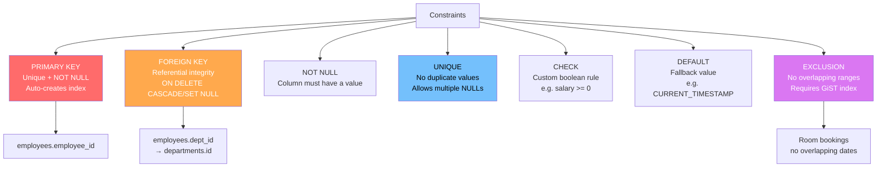

### What is a Constraint?

A **constraint** is a rule enforced on a table column (or a group of columns) to ensure the **accuracy, validity, and integrity** of the data stored in the database.

- Constraints are set at the **schema level** — the database itself rejects any INSERT, UPDATE, or DELETE that would violate them
- They can be defined **inline** (next to the column definition) or as a **table-level** declaration at the end of `CREATE TABLE`
- Most constraints can also be added to, or removed from, an existing table using `ALTER TABLE`
- PostgreSQL supports **named constraints** (using `CONSTRAINT constraint_name ...`) which makes it easier to identify and drop them later

**Two levels of constraint definition:**

```
Column-level  → defined beside a single column  → applies to that column only
Table-level   → defined after all columns       → can span multiple columns (composite)
```

### Constraints Overview

| Constraint    | Purpose                                                      |         Allows NULL?         |
| ------------- | ------------------------------------------------------------ | :--------------------------: |
| `PRIMARY KEY` | Uniquely identifies every row                                |              No              |
| `FOREIGN KEY` | Links a column to a row in another table                     |       Yes (by default)       |
| `NOT NULL`    | Column must always have a value                              |              No              |
| `UNIQUE`      | All values in the column must be distinct                    | Yes (multiple NULLs allowed) |
| `CHECK`       | Value must satisfy a custom boolean expression               |             Yes              |
| `DEFAULT`     | Provides a fallback value when none is supplied              |             Yes              |
| `EXCLUSION`   | No two rows may overlap according to a given operator (GiST) |             Yes              |

---

### PRIMARY KEY

#### Theory

- A **primary key** is the **unique identifier** for each row in a table
- It combines two rules: the value must be **unique** across all rows AND it must **never be NULL**
- Every table should have exactly **one** primary key (PostgreSQL enforces this)
- Internally, PostgreSQL automatically creates a **unique B-tree index** on the primary key column(s) for fast lookups
- A primary key can be **single-column** (simple) or **multi-column** (composite) — a composite PK is used when no single column uniquely identifies a row, but a _combination_ of columns does

**Real-world analogy:** Think of it like an Aadhaar number or Employee ID — no two people can share the same one, and everyone must have one.

#### Syntax

```sql
-- Inline (column-level)
column_name datatype PRIMARY KEY

-- Table-level (required for composite PKs)
CONSTRAINT constraint_name PRIMARY KEY (column1 [, column2 ...])
```

#### Example

```sql
-- Simple primary key
CREATE TABLE employees (
  employee_id  INTEGER      PRIMARY KEY,
  first_name   VARCHAR(50)  NOT NULL,
  last_name    VARCHAR(50)  NOT NULL
);

-- Composite primary key — neither order_id nor product_id alone is unique,
-- but the combination of both is
CREATE TABLE order_items (
  order_id    INTEGER,
  product_id  INTEGER,
  quantity    INTEGER,
  CONSTRAINT pk_order_items PRIMARY KEY (order_id, product_id)
);

-- Add primary key to an existing table
ALTER TABLE employees ADD CONSTRAINT pk_emp PRIMARY KEY (employee_id);
```

> - A table can have only **one** primary key
> - Automatically creates a unique index — no need to create one manually
> - For auto-incrementing IDs, use `SERIAL` or `GENERATED ALWAYS AS IDENTITY`

---

### FOREIGN KEY

#### Theory

- A **foreign key** (FK) links a column in one table (the **child table**) to the **primary key** (or unique key) of another table (the **parent / referenced table**)
- It enforces **referential integrity** — you cannot insert a value in the FK column that doesn't exist in the parent table, and you cannot delete a parent row that still has child rows pointing to it (unless a delete action is specified)
- This is how relational databases model **relationships between entities** (e.g., an Employee _belongs to_ a Department)

**Real-world analogy:** A `department_id` column in the `employees` table must refer to a real department that actually exists in the `departments` table. You can't assign an employee to a department that doesn't exist.

**ON DELETE behaviour options:**

| Option        | What happens to child rows when the parent row is deleted |
| ------------- | --------------------------------------------------------- |
| `NO ACTION`   | Error is raised (default)                                 |
| `RESTRICT`    | Error is raised (checked immediately, not deferred)       |
| `CASCADE`     | Child rows are automatically deleted                      |
| `SET NULL`    | FK column in child rows is set to `NULL`                  |
| `SET DEFAULT` | FK column in child rows is set to its default value       |

#### Syntax

```sql
-- Inline
column_name datatype REFERENCES parent_table(parent_column)
  [ON DELETE {CASCADE | SET NULL | RESTRICT | NO ACTION}]

-- Table-level
CONSTRAINT constraint_name FOREIGN KEY (column)
  REFERENCES parent_table(parent_column)
  [ON DELETE {CASCADE | SET NULL | RESTRICT | NO ACTION}]
```

#### Example

```sql
CREATE TABLE departments (
  department_id    INTEGER PRIMARY KEY,
  department_name  VARCHAR(100) NOT NULL
);

CREATE TABLE employees (
  employee_id    INTEGER PRIMARY KEY,
  name           VARCHAR(100),
  department_id  INTEGER,
  CONSTRAINT fk_dept
    FOREIGN KEY (department_id)
    REFERENCES departments(department_id)
    ON DELETE SET NULL    -- if a department is deleted, employee's dept becomes NULL
);

-- ON DELETE CASCADE: deleting a department also deletes all its employees
CREATE TABLE employees_v2 (
  employee_id    INTEGER PRIMARY KEY,
  name           VARCHAR(100),
  department_id  INTEGER REFERENCES departments(department_id) ON DELETE CASCADE
);

-- Add FK to an existing table
ALTER TABLE employees
  ADD CONSTRAINT fk_dept
  FOREIGN KEY (department_id) REFERENCES departments(department_id);

-- Remove a FK
ALTER TABLE employees DROP CONSTRAINT fk_dept;
```

---

### NOT NULL

#### Theory

- By default, any column in PostgreSQL can store `NULL` — meaning the value is **unknown or missing**
- The **NOT NULL** constraint forces a column to **always have a value**; an attempt to insert or update with `NULL` in that column will be rejected immediately
- Use NOT NULL on columns that are **logically required** — e.g., a person's name, an order's date, a product's price
- `NULL` is not the same as `0`, `FALSE`, or an empty string `''` — it means _no value at all_

**Real-world analogy:** A registration form field marked as "required" — the form won't submit unless you fill it in.

#### Syntax

```sql
column_name datatype NOT NULL
```

#### Example

```sql
CREATE TABLE employees (
  employee_id  INTEGER      NOT NULL,   -- must always have an ID
  first_name   VARCHAR(50)  NOT NULL,   -- name is always required
  last_name    VARCHAR(50)  NOT NULL,
  email        VARCHAR(100)            -- optional — can be NULL
);

-- Add NOT NULL to an existing column
-- (all existing rows must already have a non-NULL value, or this will fail)
ALTER TABLE employees ALTER COLUMN first_name SET NOT NULL;

-- Remove NOT NULL (make column nullable again)
ALTER TABLE employees ALTER COLUMN email DROP NOT NULL;
```

> `NOT NULL` is one of the **most commonly used constraints** and should be applied to every column that must have a value to make business sense.

---

### UNIQUE

#### Theory

- The **UNIQUE** constraint ensures that **no two rows** can have the same value in the specified column (or combination of columns)
- Unlike PRIMARY KEY, a UNIQUE column **can contain NULL** — and PostgreSQL treats each `NULL` as distinct (so multiple NULLs are allowed in a unique column)
- A table can have **multiple UNIQUE constraints** across different columns
- PostgreSQL automatically creates a **unique index** to enforce this constraint efficiently
- A **composite unique constraint** means the _combination_ of the specified columns must be unique, even if the individual columns repeat

**Real-world analogy:** An email address in a user accounts table — two users can't register with the same email, but a user without an email yet (NULL) is still allowed.

#### Syntax

```sql
-- Inline
column_name datatype UNIQUE

-- Table-level (supports composite)
CONSTRAINT constraint_name UNIQUE (column1 [, column2 ...])
```

#### Example

```sql
CREATE TABLE employees (
  employee_id  INTEGER      PRIMARY KEY,
  email        VARCHAR(100) UNIQUE,    -- each email must be unique
  phone        VARCHAR(20)  UNIQUE     -- each phone must be unique too
);

-- Composite unique: same person can attend different events,
-- and same event can have different attendees,
-- but one person cannot register for the same event twice
CREATE TABLE registrations (
  event_id  INTEGER,
  user_id   INTEGER,
  CONSTRAINT uq_registration UNIQUE (event_id, user_id)
);

-- Add UNIQUE to an existing column
ALTER TABLE employees ADD CONSTRAINT uq_email UNIQUE (email);

-- Remove a UNIQUE constraint
ALTER TABLE employees DROP CONSTRAINT uq_email;
```

---

### CHECK

#### Theory

- A **CHECK** constraint allows you to define a **custom validation rule** using any boolean expression
- Before any INSERT or UPDATE, PostgreSQL evaluates the expression — if it returns `FALSE`, the operation is rejected; if it returns `TRUE` or `NULL`, it is allowed
- Use CHECK constraints to enforce **business rules** directly at the database level (not just in application code), so they are enforced regardless of which application or user modifies the data
- CHECK constraints can reference **one column** (inline) or **multiple columns** in the same row (table-level)

**Real-world analogy:** A minimum age requirement on a registration form — if you enter an age below 18, the system rejects it.

#### Syntax

```sql
-- Inline
column_name datatype CONSTRAINT constraint_name CHECK (boolean_expression)

-- Table-level (can reference multiple columns)
CONSTRAINT constraint_name CHECK (boolean_expression)
```

#### Example

```sql
CREATE TABLE employees (
  employee_id  INTEGER        PRIMARY KEY,
  name         VARCHAR(100)   NOT NULL,
  salary       NUMERIC(10, 2) CONSTRAINT chk_salary CHECK (salary >= 0),
  age          INTEGER        CONSTRAINT chk_age    CHECK (age BETWEEN 18 AND 65),
  gender       VARCHAR(10)    CONSTRAINT chk_gender CHECK (gender IN ('Male', 'Female', 'Other'))
);

-- Multi-column CHECK: end date must be after start date
CREATE TABLE projects (
  project_id  INTEGER PRIMARY KEY,
  name        VARCHAR(100),
  start_date  DATE,
  end_date    DATE,
  CONSTRAINT chk_dates CHECK (end_date > start_date)
);

-- Add CHECK to an existing table
ALTER TABLE employees ADD CONSTRAINT chk_salary CHECK (salary >= 0);

-- Remove a CHECK constraint
ALTER TABLE employees DROP CONSTRAINT chk_salary;
```

> CHECK constraints make your **database self-defending** — even if a bug in application code tries to save bad data, the database will reject it.

---

### DEFAULT

#### Theory

- A **DEFAULT** constraint specifies the value that PostgreSQL automatically inserts into a column **when no value is provided** in an INSERT statement
- Without a DEFAULT, omitting a column in an INSERT results in `NULL` (assuming the column is nullable)
- Defaults are useful for **timestamps** (auto-record when a row was created), **status flags** (`is_active = TRUE`), **initial counters**, etc.
- The default value can be a **literal** (`0`, `'N/A'`, `TRUE`) or a **function call** (`CURRENT_TIMESTAMP`, `gen_random_uuid()`)
- DEFAULT is **not** a validation constraint — it doesn't prevent explicit insertion of any value, including `NULL`

**Real-world analogy:** A new employee joining a company is automatically assigned an "Active" status — you don't have to specify it every time; it's the assumed starting state.

#### Syntax

```sql
column_name datatype DEFAULT default_value_or_expression
```

#### Example

```sql
CREATE TABLE employees (
  employee_id  INTEGER        PRIMARY KEY,
  name         VARCHAR(100)   NOT NULL,
  salary       NUMERIC(10, 2) DEFAULT 0.00,            -- starts at 0
  is_active    BOOLEAN        DEFAULT TRUE,             -- active by default
  created_at   TIMESTAMP      DEFAULT CURRENT_TIMESTAMP -- auto-set to now
);

-- Inserting without providing defaulted columns
INSERT INTO employees (employee_id, name) VALUES (1, 'Alice');
-- Result: salary = 0.00, is_active = TRUE, created_at = current time

-- You can still override a default explicitly
INSERT INTO employees (employee_id, name, salary, is_active)
VALUES (2, 'Bob', 55000.00, FALSE);

-- Change the default value on an existing column
ALTER TABLE employees ALTER COLUMN salary SET DEFAULT 30000.00;

-- Remove the default (column becomes NULL if not provided)
ALTER TABLE employees ALTER COLUMN salary DROP DEFAULT;
```

> - DEFAULT **does not prevent** a user from explicitly inserting `NULL` — add `NOT NULL` alongside `DEFAULT` if the column must always have a value
> - `DEFAULT CURRENT_TIMESTAMP` is extremely common for `created_at` / `updated_at` audit columns

---

### EXCLUSION

#### Theory

- An **EXCLUSION constraint** is a generalisation of the UNIQUE constraint — instead of requiring that two rows are never **equal** on certain columns, it requires that no two rows **overlap** according to a specified operator
- Uniqueness is just one special case of exclusion (using the `=` operator); exclusion supports any operator that works with a GiST or SP-GiST index (e.g., `&&` for range overlap, `=` for equality)
- Exclusion constraints are evaluated during `INSERT` and `UPDATE`; if any existing row satisfies the exclusion condition with the new row, the operation is rejected
- They require the `btree_gist` extension for mixing equality operators (`=`) with range operators in the same constraint
- Most commonly used with **range types** (`daterange`, `tsrange`, `numrange`, `int4range`) to prevent **scheduling conflicts** and **double-bookings**

**Real-world analogy:** A hotel room booking system — Room 101 cannot be booked by two guests whose stay periods overlap. A UNIQUE constraint can't express "no overlapping ranges", but an EXCLUSION constraint with `&&` (overlaps) can.

**How it differs from UNIQUE:**

| Constraint  | Blocks when...                                     | Operator used  |
| ----------- | -------------------------------------------------- | -------------- |
| `UNIQUE`    | Two rows have the **same** value                   | `=`            |
| `EXCLUSION` | Two rows **overlap** according to a given operator | Any (&&, =, …) |

> Exclusion constraints require a **GiST index** (created automatically). For columns that use equality (`=`) alongside range operators, install the `btree_gist` extension first.

#### Syntax

```sql
-- Enable btree_gist (once per database, needed for = + range mix)
CREATE EXTENSION IF NOT EXISTS btree_gist;

-- Table-level exclusion constraint
CONSTRAINT constraint_name EXCLUDE USING gist (
  column1 WITH operator1,
  column2 WITH operator2
)
```

#### Example 1 — Prevent overlapping room bookings

```sql
CREATE EXTENSION IF NOT EXISTS btree_gist;

CREATE TABLE room_bookings (
  booking_id  SERIAL         PRIMARY KEY,
  room_no     INTEGER        NOT NULL,
  guest_name  VARCHAR(100)   NOT NULL,
  stay_period DATERANGE      NOT NULL,

  -- No two rows may have the same room_no AND overlapping stay_period
  CONSTRAINT no_overlap EXCLUDE USING gist (
    room_no     WITH =,
    stay_period WITH &&
  )
);

-- This insert succeeds
INSERT INTO room_bookings (room_no, guest_name, stay_period)
VALUES (101, 'Alice', '[2026-03-01, 2026-03-05]');

-- This insert succeeds — different room
INSERT INTO room_bookings (room_no, guest_name, stay_period)
VALUES (102, 'Bob', '[2026-03-01, 2026-03-05]');

-- This insert FAILS — same room, overlapping dates
INSERT INTO room_bookings (room_no, guest_name, stay_period)
VALUES (101, 'Carol', '[2026-03-03, 2026-03-07]');
-- ERROR: conflicting key value violates exclusion constraint "no_overlap"
```

#### Example 2 — Prevent overlapping employee shifts

```sql
CREATE TABLE shifts (
  shift_id     SERIAL       PRIMARY KEY,
  employee_id  INTEGER      NOT NULL,
  shift_period TSRANGE      NOT NULL,

  -- One employee cannot have two overlapping shifts
  CONSTRAINT no_shift_overlap EXCLUDE USING gist (
    employee_id  WITH =,
    shift_period WITH &&
  )
);

INSERT INTO shifts (employee_id, shift_period)
VALUES (5, '[2026-03-10 08:00, 2026-03-10 16:00]');

-- Overlapping shift for the same employee — rejected
INSERT INTO shifts (employee_id, shift_period)
VALUES (5, '[2026-03-10 14:00, 2026-03-10 22:00]');
-- ERROR: conflicting key value violates exclusion constraint "no_shift_overlap"
```

#### Managing Exclusion Constraints

```sql
-- View existing exclusion constraints on a table
SELECT conname, contype, consrc
FROM pg_constraint
WHERE conrelid = 'room_bookings'::regclass AND contype = 'x';

-- Drop an exclusion constraint
ALTER TABLE room_bookings DROP CONSTRAINT no_overlap;
```

> - Use `[lower, upper)` (half-open) range literals to avoid edge-case overlaps at boundaries
> - The GiST index created by the exclusion constraint also **speeds up range queries** on that column
> - For numeric or integer ranges without a range type column, use `int4range`, `numrange`, or `int8range`

---

### DEFERRABLE Constraints

By default, PostgreSQL checks constraints **immediately** after each statement within a transaction. **Deferrable constraints** allow you to postpone the check until `COMMIT` time — essential when you need to temporarily violate a constraint as part of a multi-step operation.

**Why you need it:** Suppose you have a circular FK (Employee has a `manager_id` → FK → Employee). Inserting the first employee fails because the manager (also being inserted) doesn't exist yet. With `DEFERRABLE INITIALLY DEFERRED`, both inserts happen, and the FK is only verified at `COMMIT`.

```sql
-- Declare a deferrable constraint at table creation
CREATE TABLE employees (
  employee_id  INTEGER PRIMARY KEY,
  first_name   VARCHAR(50),
  manager_id   INTEGER,
  CONSTRAINT fk_manager
    FOREIGN KEY (manager_id) REFERENCES employees(employee_id)
    DEFERRABLE INITIALLY DEFERRED   -- checked at COMMIT, not per-statement
);

-- Or make it deferrable but initially immediate (can be toggled per transaction)
CREATE TABLE order_items (
  item_id     SERIAL PRIMARY KEY,
  order_id    INTEGER REFERENCES orders(order_id)
    DEFERRABLE INITIALLY IMMEDIATE  -- default = immediate, but can be deferred
);

-- Toggle deferral inside a transaction
BEGIN;
  SET CONSTRAINTS fk_manager DEFERRED;  -- defer until COMMIT for this transaction
  INSERT INTO employees VALUES (1, 'Alice', 2);  -- manager 2 doesn't exist yet
  INSERT INTO employees VALUES (2, 'Bob',   1);  -- now both exist
COMMIT;  -- FK checked here — both rows present → passes

-- Defer ALL deferrable constraints in the current transaction
BEGIN;
  SET CONSTRAINTS ALL DEFERRED;
  -- ... multi-step inserts ...
COMMIT;
```

| Mode                             | Behaviour                                             |
| -------------------------------- | ----------------------------------------------------- |
| `NOT DEFERRABLE`                 | Always checked immediately (default)                  |
| `DEFERRABLE INITIALLY IMMEDIATE` | Immediate by default, can be deferred per transaction |
| `DEFERRABLE INITIALLY DEFERRED`  | Deferred by default — checked only at COMMIT          |

> Only `UNIQUE`, `PRIMARY KEY`, `FOREIGN KEY`, and `EXCLUSION` constraints can be deferrable. `CHECK` and `NOT NULL` are always immediate.

---

### Practice Questions — Constraints

**Q1.** Create a `students` table demonstrating PRIMARY KEY, NOT NULL, UNIQUE, CHECK, and DEFAULT.

```sql
CREATE TABLE students (
  student_id  SERIAL         PRIMARY KEY,
  name        VARCHAR(50)    NOT NULL,
  email       VARCHAR(100)   UNIQUE,
  age         INTEGER        CHECK (age BETWEEN 16 AND 60),
  grade       CHAR(1)        DEFAULT 'A',
  enrolled_on DATE           DEFAULT CURRENT_DATE
);
```

**Q2.** Add a FOREIGN KEY from `emp` to `dept` with `ON DELETE CASCADE`.

```sql
CREATE TABLE dept (
  deptno   INTEGER      PRIMARY KEY,
  dname    VARCHAR(30)  NOT NULL
);

ALTER TABLE emp
  ADD CONSTRAINT fk_emp_dept
  FOREIGN KEY (deptno) REFERENCES dept(deptno)
  ON DELETE CASCADE;
```

**Q3.** Add a CHECK constraint to ensure salary is always positive, then try inserting a negative salary.

```sql
ALTER TABLE emp ADD CONSTRAINT chk_salary CHECK (salary >= 0);

-- This will fail:
INSERT INTO emp (ename, salary) VALUES ('TEST', -500);  -- ERROR
```

**Q4.** Create a composite UNIQUE constraint: same employee cannot register for the same course twice.

```sql
CREATE TABLE enrollments (
  enrollment_id  SERIAL  PRIMARY KEY,
  emp_id         INTEGER NOT NULL,
  course_id      INTEGER NOT NULL,
  enrolled_on    DATE    DEFAULT CURRENT_DATE,
  CONSTRAINT uq_emp_course UNIQUE (emp_id, course_id)
);
```

---

## 8. Database Design & Normalization

[↑ Back to Index](#table-of-contents)

### What is Normalization?

**Normalization** is the process of structuring a relational database to minimize data redundancy and dependency. Poor normalization leads to three types of anomalies:

- **Insert anomaly:** You cannot record some facts without recording others
- **Update anomaly:** Changing one fact requires updating multiple rows
- **Delete anomaly:** Deleting one record accidentally deletes unrelated information

Normalization is organized into increasingly strict **Normal Forms (NF)**.

---

### First Normal Form (1NF)

**Rule:** Each column contains atomic (indivisible) values. No repeating groups or multi-value columns. Every row is unique (has a primary key).

**Violation:**

| order_id | customer | products                    |
| -------- | -------- | --------------------------- |
| 1        | Alice    | "Widget, Gadget, Doohickey" |
| 2        | Bob      | "Widget"                    |

The `products` column stores a comma-separated list — you cannot query "find all orders containing Widget" efficiently. **Fix:** create a separate `order_items` table.

```sql
-- 1NF Fix
CREATE TABLE orders (
  order_id  INT PRIMARY KEY,
  customer  VARCHAR(50)
);
CREATE TABLE order_items (
  order_id  INT REFERENCES orders(order_id),
  product   VARCHAR(50),
  PRIMARY KEY (order_id, product)
);
```

---

### Second Normal Form (2NF)

**Rule:** Must be in 1NF AND every non-key column must depend on the **entire** primary key (no partial dependencies on a composite PK).

**Violation** — Table with composite PK `(order_id, product_id)`:

| order_id | product_id | quantity | product_name | customer_name |
| -------- | ---------- | -------- | ------------ | ------------- |
| 1        | 101        | 2        | Widget       | Alice         |

`product_name` depends only on `product_id` (not the full PK). `customer_name` depends only on `order_id`. Both are partial dependencies. **Fix:** Move `product_name` to a `products` table, `customer_name` to an `orders` table.

---

### Third Normal Form (3NF)

**Rule:** Must be in 2NF AND no non-key column depends on another non-key column (no transitive dependencies).

**Violation:**

| employee_id | department_id | department_name | department_location |
| ----------- | ------------- | --------------- | ------------------- |
| 1           | 10            | IT              | Floor 3             |
| 2           | 10            | IT              | Floor 3             |

`department_name` and `department_location` depend on `department_id`, not on `employee_id`. This is a transitive dependency: `employee_id → department_id → department_name`. If IT moves to Floor 4, you must update every employee row in IT. **Fix:** Move department columns to a separate `departments` table.

---

### BCNF (Boyce-Codd Normal Form)

A stricter version of 3NF. For every functional dependency `X → Y`, X must be a superkey. BCNF resolves edge cases involving overlapping composite keys. Most well-designed 3NF schemas satisfy BCNF automatically.

---

### Denormalization

**Denormalization** is the deliberate introduction of redundancy to improve read performance. It contradicts normalization but is sometimes necessary for high-read, performance-critical applications.

**When to denormalize:**

- Pre-joined data for dashboards
- Storing computed values directly (e.g., `order_total` on the order row instead of recomputing from `order_items` every time)
- Avoiding slow joins on very large tables

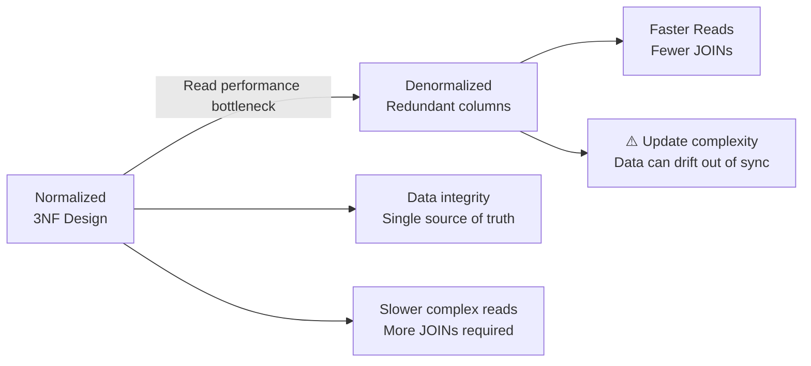

**The rule:** Normalize first for correctness. Denormalize selectively for performance based on **measured** bottlenecks — not speculation.

---

### Surrogate vs Natural Keys

A **natural key** uses real-world data as the primary key (e.g., email address, passport number).

A **surrogate key** is system-generated with no business meaning — typically an auto-incrementing integer (`SERIAL`, `BIGSERIAL`) or a UUID.

| Aspect            | Natural Key                | Surrogate Key   |
| ----------------- | -------------------------- | --------------- |
| Business meaning  | Yes                        | No              |
| Immutable?        | Not always (emails change) | Always          |
| FK size           | Can be large (string)      | Small (integer) |
| Index performance | Variable                   | Consistent      |
| Privacy concern   | Exposes business data      | None            |

**Best practice:** Always use surrogate keys as primary keys. Natural values can still have UNIQUE constraints for business rule enforcement, but they make poor primary keys because they can change.

---

## 9. JOINs

[↑ Back to Index](#table-of-contents)

### Practice Questions — JOINs

**Q1.** Get employee names along with their department names (only employees who have a department).

```sql
SELECT e.ename, d.dname
FROM emp e
INNER JOIN dept d ON e.deptno = d.deptno;
```

**Q2.** Get all departments, including those with no employees.

```sql
SELECT d.dname, e.ename
FROM dept d
LEFT JOIN emp e ON d.deptno = e.deptno;
```

**Q3.** Find employees along with their manager's name.

```sql
SELECT e.ename AS employee, m.ename AS manager
FROM emp e
LEFT JOIN emp m ON e.mgr = m.empno;
```

**Q4.** Get employee name, department name, and location for all employees in department 10 or 20.

```sql
SELECT e.ename, d.dname, d.loc
FROM emp e
JOIN dept d ON e.deptno = d.deptno
WHERE e.deptno IN (10, 20)
ORDER BY d.dname, e.ename;
```

**Q5.** Find pairs of employees who work in the same department (self-join).

```sql
SELECT a.ename AS emp1, b.ename AS emp2, a.deptno
FROM emp a
JOIN emp b ON a.deptno = b.deptno AND a.empno < b.empno
ORDER BY a.deptno;
```

---

### JOIN Classification

**ANSI JOINs** — Standard SQL syntax supported by all relational databases:

| ANSI JOIN Type     | Description                                                                  |
| ------------------ | ---------------------------------------------------------------------------- |
| `INNER JOIN`       | Returns only matching rows from both tables                                  |
| `LEFT OUTER JOIN`  | All rows from left + matched rows from right (NULL if no match)              |
| `RIGHT OUTER JOIN` | All rows from right + matched rows from left (NULL if no match)              |
| `FULL OUTER JOIN`  | All rows from both tables (NULLs wherever no match)                          |
| `CROSS JOIN`       | Cartesian product — every left row paired with every right row (m × n rows)  |
| `SELF JOIN`        | A table joined to itself using an alias (e.g., employee → manager hierarchy) |

**NON-ANSI JOINs** — Older or implicit join styles (still used but less explicit):

| NON-ANSI JOIN Type | Description                                                                          |
| ------------------ | ------------------------------------------------------------------------------------ |
| `NATURAL JOIN`     | Automatically joins on **all columns with the same name** — fragile, avoid in prod   |
| `EQUI JOIN`        | JOIN using `=` equality operator (most JOINs are equi joins) — not a keyword per se  |
| `NON-EQUI JOIN`    | JOIN using non-equality operators (`<`, `>`, `BETWEEN`) — e.g., salary range lookups |

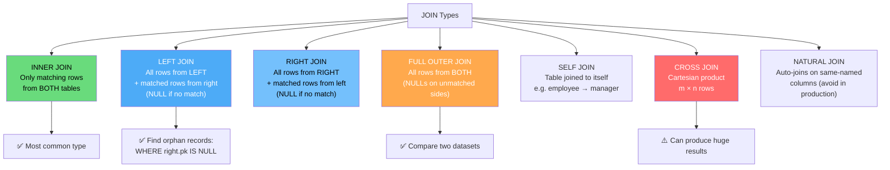

### What is a JOIN?

A **JOIN** combines rows from two or more tables based on a related column between them. JOINs are the primary mechanism for querying data spread across multiple tables in a relational database.

> **Is a PRIMARY KEY required to join two tables?**
>
> **No — a PRIMARY KEY is NOT required to join tables.** You can join on any column(s) as long as the data types are compatible and the values logically relate the rows. However, joining on indexed columns (like PKs and FKs) is dramatically faster than joining on unindexed columns.
>
> | Scenario                           | Valid? | Notes                                             |
> | ---------------------------------- | ------ | ------------------------------------------------- |
> | JOIN on PK ↔ FK                    | ✅ Yes | Most common and best-practice pattern             |
> | JOIN on any non-key column         | ✅ Yes | Works, but no index → full table scan risk        |
> | JOIN on two PKs (different tables) | ✅ Yes | Used in many-to-many junction tables              |
> | JOIN without any shared key        | ✅ Yes | CROSS JOIN or NON-EQUI JOIN (e.g., range lookups) |
>
> **Best practice:** Always join on indexed columns. A FK column automatically creates a relational link, but you still need a manual index on it in PostgreSQL (`REFERENCES` does not auto-create an index on the FK side — only on the PK side).

**Setup — Sample Tables used in all examples below:**

```sql
CREATE TABLE departments (
  department_id    INTEGER      PRIMARY KEY,
  department_name  VARCHAR(100) NOT NULL
);

CREATE TABLE employees (
  employee_id    INTEGER      PRIMARY KEY,
  first_name     VARCHAR(50)  NOT NULL,
  department_id  INTEGER      REFERENCES departments(department_id),
  salary         NUMERIC(10,2)
);

INSERT INTO departments VALUES
  (10, 'IT'),
  (20, 'HR'),
  (30, 'Finance'),
  (40, 'Marketing');   -- no employees assigned here

INSERT INTO employees VALUES
  (1, 'Alice',   10, 80000),
  (2, 'Bob',     20, 55000),
  (3, 'Carol',   10, 90000),
  (4, 'David',   30, 70000),
  (5, 'Eve',     NULL, 60000);  -- no department assigned
```

**JOIN Types at a glance:**

| JOIN Type         | Returns                                                                            |
| ----------------- | ---------------------------------------------------------------------------------- |
| `INNER JOIN`      | Only rows that match in **both** tables                                            |
| `LEFT JOIN`       | All rows from the **left** table + matching right rows (NULLs for no match)        |
| `RIGHT JOIN`      | All rows from the **right** table + matching left rows (NULLs for no match)        |
| `FULL OUTER JOIN` | All rows from **both** tables (NULLs wherever no match)                            |
| `NATURAL JOIN`    | Implicit join on all columns with the **same name**                                |
| `SELF JOIN`       | A table joined to **itself**                                                       |
| `CROSS JOIN`      | Every row of the left table paired with every row of the right (Cartesian product) |

---

### INNER JOIN

#### Theory

- Returns only the rows where there is a **matching value** in both tables on the join condition
- Rows from either table that have no match are **excluded** from the result
- This is the most commonly used join type
- `JOIN` without any keyword defaults to `INNER JOIN`

**Syntax:**

```sql
SELECT columns
FROM   table1
INNER JOIN table2 ON table1.column = table2.column;
```

**Example:**

```sql
-- Only employees who have a valid department (Eve is excluded — NULL dept)
SELECT e.employee_id, e.first_name, d.department_name, e.salary
FROM   employees e
INNER JOIN departments d ON e.department_id = d.department_id;
```

**Result:**

| employee_id | first_name | department_name | salary |
| ----------- | ---------- | --------------- | ------ |
| 1           | Alice      | IT              | 80000  |
| 2           | Bob        | HR              | 55000  |
| 3           | Carol      | IT              | 90000  |
| 4           | David      | Finance         | 70000  |

> Eve (no department) and Marketing (no employees) are both excluded — neither side has a match.

---

### LEFT JOIN

#### Theory

- Returns **all rows from the left table**, and the matching rows from the right table
- If a left-table row has **no match** in the right table, the right-table columns are filled with `NULL`
- Also called **LEFT OUTER JOIN**
- Use when you want to keep all records from the primary (left) table regardless of whether a related row exists

**Syntax:**

```sql
SELECT columns
FROM   table1
LEFT JOIN table2 ON table1.column = table2.column;
```

**Example:**

```sql
-- All employees, plus their department (NULL if unassigned)
SELECT e.employee_id, e.first_name, d.department_name
FROM   employees e
LEFT JOIN departments d ON e.department_id = d.department_id;
```

**Result:**

| employee_id | first_name | department_name |
| ----------- | ---------- | --------------- |
| 1           | Alice      | IT              |
| 2           | Bob        | HR              |
| 3           | Carol      | IT              |
| 4           | David      | Finance         |
| 5           | Eve        | NULL            |

```sql
-- Find employees with NO department assigned
SELECT e.employee_id, e.first_name
FROM   employees e
LEFT JOIN departments d ON e.department_id = d.department_id
WHERE  d.department_id IS NULL;
```

> This "NULL filter" pattern (`WHERE right_table.pk IS NULL`) is a common way to find **unmatched / orphan** records.

---

### RIGHT JOIN

#### Theory

- Returns **all rows from the right table**, and the matching rows from the left table
- If a right-table row has **no match** in the left table, the left-table columns are filled with `NULL`
- Also called **RIGHT OUTER JOIN**
- Less common than LEFT JOIN — most queries can be rewritten as a LEFT JOIN by swapping table order; use RIGHT JOIN when the table order is fixed

**Syntax:**

```sql
SELECT columns
FROM   table1
RIGHT JOIN table2 ON table1.column = table2.column;
```

**Example:**

```sql
-- All departments, plus their employees (NULL if no employees in that dept)
SELECT e.first_name, d.department_id, d.department_name
FROM   employees e
RIGHT JOIN departments d ON e.department_id = d.department_id;
```

**Result:**

| first_name | department_id | department_name |
| ---------- | ------------- | --------------- |
| Alice      | 10            | IT              |
| Carol      | 10            | IT              |
| Bob        | 20            | HR              |
| David      | 30            | Finance         |
| NULL       | 40            | Marketing       |

```sql
-- Find departments with NO employees
SELECT d.department_id, d.department_name
FROM   employees e
RIGHT JOIN departments d ON e.department_id = d.department_id
WHERE  e.employee_id IS NULL;
```

---

### FULL OUTER JOIN

#### Theory

- Returns **all rows from both tables**
- Where there is a match, the row is combined normally
- Where there is **no match on either side**, the missing columns are filled with `NULL`
- Useful for finding records that exist in one table but not the other (or comparing two datasets)

**Syntax:**

```sql
SELECT columns
FROM   table1
FULL OUTER JOIN table2 ON table1.column = table2.column;
```

**Example:**

```sql
-- All employees AND all departments — NULLs wherever there's no match
SELECT e.first_name, d.department_name
FROM   employees e
FULL OUTER JOIN departments d ON e.department_id = d.department_id;
```

**Result:**

| first_name | department_name |
| ---------- | --------------- |
| Alice      | IT              |
| Carol      | IT              |
| Bob        | HR              |
| David      | Finance         |
| Eve        | NULL            |
| NULL       | Marketing       |

```sql
-- Find ALL unmatched records from both sides at once
SELECT e.first_name, d.department_name
FROM   employees e
FULL OUTER JOIN departments d ON e.department_id = d.department_id
WHERE  e.employee_id IS NULL OR d.department_id IS NULL;
```

---

### EQUI JOIN

#### Theory

- An **EQUI JOIN** is any join that uses the **equality operator (`=`)** to match rows between two tables
- It is **not a separate SQL keyword** — it is a classification describing how the join condition works
- The `JOIN` keyword is **not required** — the original/old-style syntax uses comma-separated tables in `FROM` with a `WHERE` clause containing `=`
- The modern ANSI syntax uses `JOIN ... ON` — both styles produce the same result
- `INNER JOIN`, `LEFT JOIN`, `RIGHT JOIN`, and `FULL OUTER JOIN` are all equi joins when they use `=`

**Syntax — two equivalent styles:**

```sql
-- Old-style (NON-ANSI): comma-separated tables + WHERE with =
-- No JOIN keyword needed — just = in WHERE
SELECT columns
FROM   table1, table2
WHERE  table1.column = table2.column;

-- Modern ANSI style: explicit JOIN ... ON with =
SELECT columns
FROM   table1
JOIN   table2 ON table1.column = table2.column;
```

**Examples:**

```sql
-- Old-style equi join (no JOIN keyword — just comma + WHERE =)
SELECT e.first_name, e.salary, d.department_name
FROM   employees e, departments d
WHERE  e.department_id = d.department_id;

-- Same query, modern ANSI style
SELECT e.first_name, e.salary, d.department_name
FROM   employees e
JOIN   departments d ON e.department_id = d.department_id;

-- Multi-table old-style equi join
SELECT e.first_name, d.department_name, l.city
FROM   employees e, departments d, locations l
WHERE  e.department_id  = d.department_id
AND    d.location_id    = l.location_id;
```

| Style                | Syntax                               | Keyword Required?  |
| -------------------- | ------------------------------------ | ------------------ |
| Old-style (NON-ANSI) | `FROM t1, t2 WHERE t1.col = t2.col`  | ❌ No JOIN keyword |
| Modern (ANSI)        | `FROM t1 JOIN t2 ON t1.col = t2.col` | ✅ JOIN keyword    |

> Both styles produce identical results. Prefer the **modern ANSI style** in new code — it is more readable, easier to distinguish join conditions from filter conditions, and required for LEFT/RIGHT/FULL OUTER joins. Equi joins are the most common join type in practice. Virtually all FK-to-PK joins are equi joins.

---

### NON-EQUI JOIN

#### Theory

- A **NON-EQUI JOIN** uses a **comparison operator other than `=`** to match rows: `<`, `>`, `<=`, `>=`, `<>`, or `BETWEEN`
- Like EQUI JOIN, the `JOIN` keyword is **not required** — the old-style syntax uses comma-separated tables with a non-equality `WHERE` condition
- The modern ANSI style uses `JOIN ... ON` with a non-equality condition — both produce the same result
- Used when rows should be matched based on a **range or inequality** rather than an exact value match
- Common real-world uses: salary band lookups, date range matching, price tier assignment, overlap detection

**Syntax — two equivalent styles:**

```sql
-- Old-style (NON-ANSI): comma-separated tables + WHERE with non-equality operator
-- No JOIN keyword needed
SELECT columns
FROM   table1, table2
WHERE  table1.column BETWEEN table2.low_col AND table2.high_col;
-- or: WHERE table1.column > table2.column, etc.

-- Modern ANSI style: explicit JOIN ... ON with non-equality condition
SELECT columns
FROM   table1
JOIN   table2 ON table1.column BETWEEN table2.low_col AND table2.high_col;
```

**Examples:**

```sql
-- Setup: salary grades table with range columns
CREATE TABLE salary_grades (
  grade       VARCHAR(10),
  low_salary  NUMERIC(12,2),
  high_salary NUMERIC(12,2)
);
INSERT INTO salary_grades VALUES
  ('Grade A', 0,      50000),
  ('Grade B', 50001,  80000),
  ('Grade C', 80001,  120000),
  ('Grade D', 120001, 999999);

-- Old-style NON-EQUI JOIN (no JOIN keyword): salary grade lookup
SELECT e.first_name, e.salary, sg.grade
FROM   employees e, salary_grades sg
WHERE  e.salary BETWEEN sg.low_salary AND sg.high_salary;
-- 'Alice' (80000) → 'Grade B', 'Carol' (90000) → 'Grade C'

-- Modern ANSI style NON-EQUI JOIN: same result
SELECT e.first_name, e.salary, sg.grade
FROM   employees e
JOIN   salary_grades sg
  ON   e.salary BETWEEN sg.low_salary AND sg.high_salary;

-- Old-style NON-EQUI SELF JOIN: pairs where one employee earns more than another
SELECT a.first_name AS higher_paid, a.salary,
       b.first_name AS lower_paid,  b.salary
FROM   employees a, employees b
WHERE  a.salary > b.salary
ORDER BY a.salary DESC;

-- Date range NON-EQUI JOIN: which promotion was active on each order date
SELECT o.order_id, o.order_date, p.promo_name
FROM   orders o, promotions p
WHERE  o.order_date BETWEEN p.start_date AND p.end_date;
```

| Style                | Syntax                               | Keyword Required?  |
| -------------------- | ------------------------------------ | ------------------ |
| Old-style (NON-ANSI) | `FROM t1, t2 WHERE t1.col > t2.col`  | ❌ No JOIN keyword |
| Modern (ANSI)        | `FROM t1 JOIN t2 ON t1.col > t2.col` | ✅ JOIN keyword    |

> NON-EQUI JOINs can produce large result sets — every row that satisfies the inequality is matched. For range lookups (`BETWEEN`), ensure the range columns are indexed to avoid full table scans.

---

### NATURAL JOIN

#### Theory

- Automatically joins two tables on **all columns that share the same name and data type** — no explicit `ON` clause needed
- Convenient shorthand, but **fragile** — adding a same-named column to either table later changes the join condition silently
- Not recommended in production code; prefer explicit `INNER JOIN ... ON` for clarity and safety
- If there are no common column names, it produces a **CROSS JOIN** (Cartesian product)

**Syntax:**

```sql
SELECT columns
FROM   table1
NATURAL JOIN table2;
```

**Example:**

```sql
-- Joins on 'department_id' automatically (the only shared column name)
SELECT employee_id, first_name, department_name
FROM   employees
NATURAL JOIN departments;
-- Equivalent to: INNER JOIN departments ON employees.department_id = departments.department_id
```

> Avoid NATURAL JOIN in production — use explicit JOIN conditions for maintainability and predictability.

---

### SELF JOIN

#### Theory

- A **self join** joins a table to **itself** — useful for querying hierarchical or recursive relationships stored in the same table (e.g., employee → manager, category → parent category)
- Because both sides refer to the same table, you **must use aliases** to distinguish them
- Any join type (INNER, LEFT, etc.) can be used as a self join

**Syntax:**

```sql
SELECT a.column, b.column
FROM   table_name a
JOIN   table_name b ON a.related_column = b.column;
```

**Setup — employees table with a manager column:**

```sql
ALTER TABLE employees ADD COLUMN manager_id INTEGER REFERENCES employees(employee_id);

UPDATE employees SET manager_id = 3 WHERE employee_id IN (1, 2);   -- Alice & Bob report to Carol
UPDATE employees SET manager_id = 4 WHERE employee_id = 5;         -- Eve reports to David
-- Carol and David have no manager (top level)
```

**Example:**

```sql
-- Show each employee alongside their manager's name
SELECT e.first_name  AS employee,
       m.first_name  AS manager
FROM   employees e
LEFT JOIN employees m ON e.manager_id = m.employee_id;
```

**Result:**

| employee | manager |
| -------- | ------- |
| Alice    | Carol   |
| Bob      | Carol   |
| Carol    | NULL    |
| David    | NULL    |
| Eve      | David   |

```sql
-- Find employees who earn more than their manager
SELECT e.first_name AS employee,   e.salary AS emp_salary,
       m.first_name AS manager,    m.salary AS mgr_salary
FROM   employees e
JOIN   employees m ON e.manager_id = m.employee_id
WHERE  e.salary > m.salary;
```

---

### CROSS JOIN

#### Theory

- Produces the **Cartesian product** — every row in the left table is paired with every row in the right table
- If the left table has `m` rows and the right has `n` rows, the result has `m × n` rows
- No `ON` condition is used
- Useful for generating all combinations (e.g., sizes × colours for a product catalogue), but can produce enormous result sets if used carelessly

**Syntax:**

```sql
SELECT columns
FROM   table1
CROSS JOIN table2;
```

**Example:**

```sql
-- Pair every employee with every department (4 employees × 4 departments = 16 rows)
SELECT e.first_name, d.department_name
FROM   employees e
CROSS JOIN departments d
ORDER BY e.first_name, d.department_name;
```

---

### JOIN with Multiple Conditions and Aggregates

```sql
-- Average salary per department (only departments that have employees)
SELECT d.department_name,
       COUNT(e.employee_id)  AS headcount,
       ROUND(AVG(e.salary), 2) AS avg_salary,
       MAX(e.salary)           AS top_salary
FROM   departments d
INNER JOIN employees e ON d.department_id = e.department_id
GROUP BY d.department_name
ORDER BY avg_salary DESC;

-- Three-table join: orders → order_items → products
SELECT o.order_id, c.customer_name, p.product_name, oi.quantity
FROM   orders o
JOIN   customers  c  ON o.customer_id  = c.customer_id
JOIN   order_items oi ON o.order_id    = oi.order_id
JOIN   products    p  ON oi.product_id = p.product_id
WHERE  o.order_date >= CURRENT_DATE - INTERVAL '30 days';
```

> - Always use **table aliases** when joining (`e`, `d`) to keep queries readable
> - Join on **indexed columns** (primary keys / foreign keys) for best performance
> - For large datasets, `EXPLAIN ANALYZE` your join queries to verify the planner is using the indexes

---

### LATERAL JOIN

**What it is:** `LATERAL` allows a subquery in the `FROM` clause to **reference columns from preceding tables** in the same `FROM` clause — something a regular subquery cannot do. Think of it as a correlated subquery that acts as a table source, evaluated once per row of the left-hand table.

**Why it matters:** `LATERAL` is the idiomatic PostgreSQL way to:

- Get the top-N rows per group (replacing complex window function subqueries)
- Call a set-returning function per row
- Unnest and join array or JSONB data per row

```sql
-- Get the 3 most recent orders per customer
SELECT c.customer_id, c.name, recent.order_id, recent.order_date
FROM   customers c
CROSS JOIN LATERAL (
  SELECT order_id, order_date, total_amount
  FROM   orders
  WHERE  orders.customer_id = c.customer_id   -- references outer table c
  ORDER BY order_date DESC
  LIMIT 3
) AS recent;

-- LEFT JOIN LATERAL: include customers even with no orders (NULL for recent)
SELECT c.customer_id, c.name, recent.order_id, recent.order_date
FROM   customers c
LEFT JOIN LATERAL (
  SELECT order_id, order_date
  FROM   orders
  WHERE  orders.customer_id = c.customer_id
  ORDER BY order_date DESC
  LIMIT 1
) recent ON TRUE;
-- ON TRUE is required syntax for LATERAL — the join condition is always met

-- LATERAL with a set-returning function
SELECT e.employee_id, e.first_name, skill
FROM   employees e,
       LATERAL unnest(e.skills_array) AS skill;
-- Unnests skills_array for each employee row — one output row per skill

-- Use LATERAL to calculate a value from a subquery and reuse it
SELECT e.employee_id, e.salary, dept_avg.avg_sal,
       ROUND(e.salary - dept_avg.avg_sal, 2) AS diff_from_avg
FROM employees e
CROSS JOIN LATERAL (
  SELECT AVG(salary) AS avg_sal
  FROM   employees
  WHERE  department_id = e.department_id
) dept_avg;
```

|                                   | Regular subquery in FROM | LATERAL subquery in FROM           |
| --------------------------------- | ------------------------ | ---------------------------------- |
| Can reference outer table columns | ❌ No                    | ✅ Yes                             |
| Evaluated                         | Once                     | Once per outer row                 |
| Typical use                       | Static derived tables    | Top-N per group, per-row functions |

---

## 10. Aggregations & Grouping

[↑ Back to Index](#table-of-contents)

### What is Aggregation?

**Aggregation** is the process of computing a single summary value from a group of rows. Instead of retrieving individual records, you retrieve insights — totals, averages, counts — across sets of data.

Think of it this way: your database has 50,000 order records. A business analyst does not need to see all 50,000 rows. They need to know: "How much revenue did each product category generate this month?" Aggregation answers that question by collapsing many rows into one meaningful number per group.

Aggregation is central to every reporting feature you will ever build — dashboards, analytics, summaries, leaderboards, billing reports.

---

### Aggregate Functions

#### COUNT

`COUNT` returns the number of rows matching a condition. It has two important variants that behave very differently.

`COUNT(*)` counts every row in the result set, **including** rows where some columns are `NULL`.

`COUNT(column_name)` counts only rows where that specific column is **not NULL**. This distinction is extremely important and a frequent source of bugs.

```sql
-- Total number of employees
SELECT COUNT(*) AS total_employees FROM employees;

-- Number of employees who have an email on file (NULL emails excluded)
SELECT COUNT(email) AS employees_with_email FROM employees;

-- Number of distinct departments represented
SELECT COUNT(DISTINCT department_id) AS active_departments FROM employees;
```

**Interview trap:** "What is the difference between COUNT(_) and COUNT(column)?" — COUNT(_) includes NULLs, COUNT(column) does not. If 10 employees have no email, COUNT(\*) and COUNT(email) will differ by 10.

---

#### SUM, AVG, MIN, MAX

These functions operate on numeric (or date) columns and **ignore NULL values** in their calculations.

`SUM` returns the total. `AVG` returns the arithmetic mean. `MIN` and `MAX` return the smallest and largest values respectively.

```sql
-- Payroll summary
SELECT
  SUM(salary)  AS total_payroll,
  AVG(salary)  AS average_salary,
  MIN(salary)  AS lowest_salary,
  MAX(salary)  AS highest_salary
FROM employees;

-- NULL behavior: if 3 out of 10 employees have NULL salary,
-- AVG is computed over the 7 non-NULL values only — this can be misleading
-- Safe version: treat NULL salary as 0
SELECT AVG(COALESCE(salary, 0)) AS avg_including_zeros FROM employees;
```

**Common mistake:** Using `AVG` on a column with NULL values without realising NULLs are silently excluded. If employees with no salary set should count as 0, wrap with `COALESCE(salary, 0)` before averaging.

---

### GROUP BY

#### What It Is and Why It Exists

`GROUP BY` transforms aggregate functions from "give me one number for the whole table" into "give me one number per group". It collapses all rows that share the same value in the specified column(s) into a single result row, then applies the aggregate function to each group.

Without `GROUP BY`, `SELECT department_id, AVG(salary)` would be nonsensical — the database would not know which department's average to show. `GROUP BY department_id` says: "group all rows with the same department_id together, then compute AVG(salary) for each group."

```sql
-- Average salary per department
SELECT
  department_id,
  COUNT(*)      AS headcount,
  AVG(salary)   AS avg_salary,
  MAX(salary)   AS top_salary
FROM employees
GROUP BY department_id
ORDER BY avg_salary DESC;
```

#### The Golden Rule of GROUP BY

**Every column in your SELECT list must either be in the GROUP BY clause OR wrapped in an aggregate function.** This rule exists because once you group rows, individual row values lose meaning — only the group identity and aggregated values are meaningful.

```sql
-- WRONG: first_name is not in GROUP BY and not aggregated
SELECT department_id, first_name, AVG(salary)
FROM employees
GROUP BY department_id;  -- ERROR

-- CORRECT
SELECT department_id, AVG(salary)
FROM employees
GROUP BY department_id;

-- ALSO CORRECT: aggregate first_name
SELECT department_id, STRING_AGG(first_name, ', ') AS names, AVG(salary)
FROM employees
GROUP BY department_id;
```

#### Multi-Column GROUP BY

You can group by multiple columns. Each unique _combination_ of those column values forms a separate group.

```sql
-- Headcount per department per gender
SELECT
  department_id,
  gender,
  COUNT(*) AS headcount
FROM employees
GROUP BY department_id, gender
ORDER BY department_id, gender;
```

---

### HAVING

#### What It Is — The Filter for Groups

`HAVING` is to `GROUP BY` what `WHERE` is to individual rows. It filters **groups** based on a condition applied to the aggregated result. You use `HAVING` when your filter condition involves an aggregate function.

The reason `WHERE` cannot do this is fundamental: `WHERE` filters rows **before** grouping happens, before aggregates are even computed. `HAVING` filters **after** grouping, when aggregate values exist.

```sql
-- Departments with more than 5 employees (filter on aggregate result)
SELECT department_id, COUNT(*) AS headcount
FROM employees
GROUP BY department_id
HAVING COUNT(*) > 5
ORDER BY headcount DESC;

-- Departments where average salary exceeds 70,000
SELECT department_id, AVG(salary) AS avg_salary
FROM employees
GROUP BY department_id
HAVING AVG(salary) > 70000;
```

#### WHERE vs HAVING — The Key Difference

```sql
-- WHERE filters individual rows BEFORE grouping
-- HAVING filters groups AFTER aggregation
SELECT department_id, COUNT(*) AS headcount
FROM employees
WHERE employment_type = 'FULL_TIME'   -- row-level filter, runs before GROUP BY
GROUP BY department_id
HAVING COUNT(*) > 3;                   -- group-level filter, runs after GROUP BY
```

---

### SQL Query Logical Execution Order

This is one of the most important concepts for writing correct SQL. SQL is **not** executed in the order it is written. The logical execution order is:

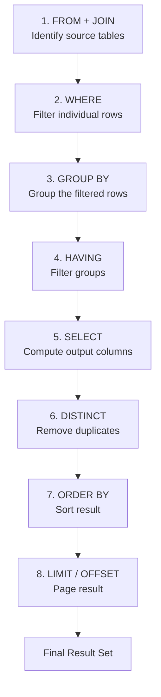

**Why this matters — the alias rule:**

At the time WHERE is evaluated (step 2), SELECT has not run yet (step 5). This is why you **cannot use a SELECT alias in a WHERE clause**.

```sql
-- WRONG: alias 'annual_salary' doesn't exist when WHERE runs
SELECT salary * 12 AS annual_salary
FROM employees
WHERE annual_salary > 600000;  -- ERROR: column "annual_salary" does not exist

-- CORRECT: repeat the expression
SELECT salary * 12 AS annual_salary
FROM employees
WHERE salary * 12 > 600000;

-- ALSO CORRECT: use a subquery or CTE
SELECT * FROM (
  SELECT salary * 12 AS annual_salary FROM employees
) sub
WHERE annual_salary > 600000;
```

You **CAN** use aliases in ORDER BY because ORDER BY runs after SELECT. This is a commonly tested exception.

**Interview perspective:** "Why can't you use a WHERE clause on an aggregate?" → Because WHERE runs before aggregation. Use HAVING instead. "Why can't you use a SELECT alias in WHERE?" → Because SELECT runs after WHERE in logical execution order.

---

### Practical Scenario — Aggregations

You are building a sales dashboard for an e-commerce platform. The business team wants total revenue per product category this month, only for categories with more than 100 orders, sorted by revenue descending.

```sql
SELECT
  p.category,
  COUNT(oi.order_id)           AS total_orders,
  SUM(oi.quantity * oi.price)  AS total_revenue,
  AVG(oi.price)                AS avg_item_price
FROM order_items oi
JOIN products p ON oi.product_id = p.product_id
JOIN orders   o ON oi.order_id   = o.order_id
WHERE o.order_date >= DATE_TRUNC('month', CURRENT_DATE)
GROUP BY p.category
HAVING COUNT(oi.order_id) > 100
ORDER BY total_revenue DESC;
```

**Session Recap:** Aggregation compresses many rows into meaningful summaries. `GROUP BY` divides data into groups for per-group aggregation. Every SELECT column must be in GROUP BY or aggregated. `HAVING` filters groups after aggregation — `WHERE` cannot do this. Understanding the logical execution order prevents a whole class of common errors. Always use `COALESCE` when aggregating nullable columns to avoid silently skewed results.

---

### GROUPING SETS, ROLLUP, and CUBE

These extensions to `GROUP BY` allow you to compute **multiple grouping levels in a single query** — without writing separate queries and `UNION ALL`-ing them together. Essential for reports and dashboards.

#### GROUPING SETS

Compute aggregates for **each specified combination** of columns independently.

```sql
-- Subtotals per department AND per job, in one pass
SELECT department_id, job_id, COUNT(*) AS headcount, SUM(salary) AS total_salary
FROM   employees
GROUP BY GROUPING SETS (
  (department_id),   -- subtotal per department
  (job_id),          -- subtotal per job
  ()                 -- grand total
);
-- Produces 3 result sets combined:
-- rows grouped by department_id | job_id=NULL
-- rows grouped by job_id        | department_id=NULL
-- grand total row               | both NULL
```

#### ROLLUP

`ROLLUP(a, b, c)` creates a hierarchy of subtotals: `(a,b,c)` → `(a,b)` → `(a)` → `()`. Perfect for reports that drill from most specific to grand total.

```sql
-- Sales subtotals: per year+month+product, per year+month, per year, grand total
SELECT
  EXTRACT(YEAR  FROM order_date) AS yr,
  EXTRACT(MONTH FROM order_date) AS mo,
  product_id,
  SUM(amount) AS total
FROM orders
GROUP BY ROLLUP (
  EXTRACT(YEAR FROM order_date),
  EXTRACT(MONTH FROM order_date),
  product_id
)
ORDER BY yr NULLS LAST, mo NULLS LAST, product_id NULLS LAST;
```

#### CUBE

`CUBE(a, b, c)` generates subtotals for **all possible combinations** — every subset of the listed columns (2ⁿ groups).

```sql
-- All combinations: (dept, gender), (dept), (gender), ()
SELECT department_id, gender, COUNT(*) AS headcount, AVG(salary) AS avg_salary
FROM   employees
GROUP BY CUBE (department_id, gender)
ORDER BY department_id NULLS LAST, gender NULLS LAST;
```

#### Detecting Subtotal Rows — GROUPING()

NULL in the output could mean "actual NULL data" or "subtotal row". Use `GROUPING(col)` to disambiguate: returns `1` for a subtotal row, `0` for a real group.

```sql
SELECT
  CASE WHEN GROUPING(department_id) = 1 THEN 'ALL DEPTS' ELSE department_id::TEXT END AS dept,
  CASE WHEN GROUPING(gender)        = 1 THEN 'ALL'       ELSE gender END              AS gender,
  COUNT(*) AS headcount
FROM employees
GROUP BY CUBE (department_id, gender);
```

| Feature         | Generates                   | Use when                           |
| --------------- | --------------------------- | ---------------------------------- |
| `GROUPING SETS` | Specified combinations only | Custom multi-level reports         |
| `ROLLUP`        | Hierarchical drill-down     | Time series, geography hierarchies |
| `CUBE`          | All possible combinations   | Cross-tabulation / pivot analysis  |

---

### Practice Questions — Aggregations & Grouping

**Q1.** Find the total salary, average salary, and headcount per department.

```sql
SELECT deptno,
       COUNT(*)         AS headcount,
       SUM(salary)      AS total_salary,
       ROUND(AVG(salary), 2) AS avg_salary
FROM emp
GROUP BY deptno
ORDER BY deptno;
```

**Q2.** Find departments where the average salary is greater than 2000.

```sql
SELECT deptno, ROUND(AVG(salary), 2) AS avg_salary
FROM emp
GROUP BY deptno
HAVING AVG(salary) > 2000;
```

**Q3.** Count the number of male and female employees per department in one query.

```sql
SELECT deptno,
       COUNT(CASE WHEN gender = 'Male'   THEN 1 END) AS male_count,
       COUNT(CASE WHEN gender = 'Female' THEN 1 END) AS female_count
FROM emp
GROUP BY deptno;
```

**Q4.** Get the highest and lowest salary per job role, only for roles with more than 2 employees.

```sql
SELECT job,
       MAX(salary) AS max_sal,
       MIN(salary) AS min_sal,
       COUNT(*)    AS cnt
FROM emp
GROUP BY job
HAVING COUNT(*) > 2;
```

**Q5.** Use ROLLUP to get salary totals per department, per job, and a grand total.

```sql
SELECT deptno, job, SUM(salary) AS total
FROM emp
GROUP BY ROLLUP (deptno, job)
ORDER BY deptno NULLS LAST, job NULLS LAST;
```

---

## 11. Subqueries

[↑ Back to Index](#table-of-contents)

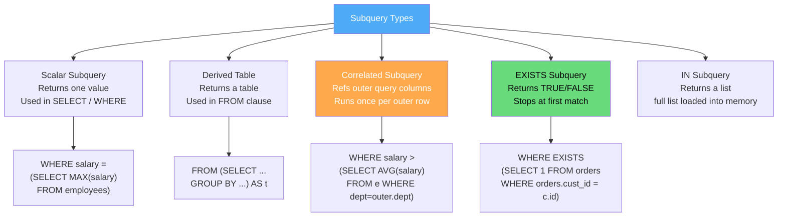

### What is a Subquery?

A **subquery** (also called an inner query or nested query) is a complete SQL `SELECT` statement embedded inside another SQL statement. The outer query uses the result of the inner query as though it were a table, a value, or a list of values.

Think of it like a two-step research process: first you run a background query to find some preliminary information, then you use that information in your main question. For example: "Find all employees who earn more than the company average." The "company average" requires its own query first — that is the subquery.

Subqueries can appear in the `SELECT`, `FROM`, `WHERE`, or `HAVING` clause. Each placement has a different name and behavior.

---

### Scalar Subquery

A **scalar subquery** returns exactly **one value** (one row, one column). It can appear anywhere a single value is expected — in a SELECT list, a WHERE condition, or a HAVING clause.

```sql
-- Find employees who earn more than the company-wide average salary
SELECT first_name, salary
FROM employees
WHERE salary > (SELECT AVG(salary) FROM employees);
-- The subquery returns a single number, compared against each employee's salary

-- Show each employee's salary alongside the company average
SELECT
  first_name,
  salary,
  (SELECT AVG(salary) FROM employees)             AS company_avg,
  salary - (SELECT AVG(salary) FROM employees)    AS diff_from_avg
FROM employees;
```

**When to use:** When you need a single computed value for comparison. Scalar subqueries are clean and readable for simple cases.

**Common mistake:** Not handling the case where the subquery might return NULL (e.g., if the table is empty). Always consider `COALESCE` wrapping.

---

### Subquery in FROM (Derived Table)

When a subquery appears in the `FROM` clause, it acts like a **temporary table** for the duration of the query. PostgreSQL requires you to give it an alias.

```sql
-- Find departments where average salary is above the company average
SELECT dept_summary.department_id, dept_summary.avg_sal
FROM (
  SELECT department_id, AVG(salary) AS avg_sal
  FROM employees
  GROUP BY department_id
) AS dept_summary
WHERE dept_summary.avg_sal > (SELECT AVG(salary) FROM employees);
```

This is equivalent to what you would accomplish with a CTE (Section 23), but inline. CTEs are generally more readable for complex cases.

---

### Correlated Subquery

A **correlated subquery** references a column from the **outer query**. Unlike a regular subquery that runs once, a correlated subquery runs **once per row** of the outer query — making it potentially expensive on large tables.

```sql
-- Find employees who earn more than the average in their OWN department
SELECT e.first_name, e.salary, e.department_id
FROM employees e
WHERE e.salary > (
  SELECT AVG(salary)
  FROM employees
  WHERE department_id = e.department_id  -- references outer query's e.department_id
);
```

Here, for every outer row, the inner query recomputes `AVG(salary)` for that specific department. If you have 10,000 employees, the inner query runs 10,000 times.

**Performance note:** Correlated subqueries are often the culprit in slow queries. The above example is better rewritten as a JOIN with a derived table — the per-department average is only computed once:

```sql
-- More efficient: compute department averages once, then join
SELECT e.first_name, e.salary, e.department_id
FROM employees e
JOIN (
  SELECT department_id, AVG(salary) AS dept_avg
  FROM employees
  GROUP BY department_id
) dept_avgs ON e.department_id = dept_avgs.department_id
WHERE e.salary > dept_avgs.dept_avg;
```

---

### EXISTS vs IN

Both `EXISTS` and `IN` can check whether a related record exists, but they work differently and have different performance characteristics.

**`IN` with a subquery** returns the full result set of the subquery, then checks if the outer value appears in that list.

```sql
-- Find employees who are also assigned as managers
SELECT first_name FROM employees
WHERE employee_id IN (
  SELECT DISTINCT manager_id FROM employees WHERE manager_id IS NOT NULL
);
```

**`EXISTS`** does not return the full result set. It stops as soon as it finds the **first matching row** and returns TRUE — short-circuit evaluation. It is often more efficient when the subquery returns many rows.

```sql
-- Same query with EXISTS
SELECT e.first_name FROM employees e
WHERE EXISTS (
  SELECT 1 FROM employees sub
  WHERE sub.manager_id = e.employee_id
);
-- SELECT 1 is a convention — EXISTS only cares whether a row exists, not what it contains
```

#### The NULL Trap with NOT IN

This is one of the most common silent bugs in SQL. If the subquery in `NOT IN` returns **any NULL values**, the entire condition evaluates to `UNKNOWN` for every outer row — returning an empty result set.

```sql
-- DANGEROUS: if manager_id contains any NULL, this returns zero rows
SELECT first_name FROM employees
WHERE employee_id NOT IN (SELECT manager_id FROM employees);
-- 5 NOT IN (1, 2, NULL) = TRUE AND TRUE AND UNKNOWN = UNKNOWN ≠ TRUE

-- SAFE: explicitly exclude NULLs from the subquery
SELECT first_name FROM employees
WHERE employee_id NOT IN (
  SELECT manager_id FROM employees WHERE manager_id IS NOT NULL
);

-- SAFEST: use NOT EXISTS (NULL-safe by design)
SELECT e.first_name FROM employees e
WHERE NOT EXISTS (
  SELECT 1 FROM employees sub WHERE sub.manager_id = e.employee_id
);
```

**Interview perspective:** "When would you use EXISTS over IN?" → When the subquery could return NULLs (especially with NOT IN), when the subquery returns many rows (EXISTS short-circuits), or when you only care whether matching rows exist, not what they contain.

---

### Practical Scenario — Subqueries

You are building a "top performer" report. Find all employees whose salary exceeds the average salary of their own department, with how much they exceed it by, limited to top 10.

```sql
SELECT
  e.first_name || ' ' || e.last_name    AS employee_name,
  d.department_name,
  e.salary,
  dept_avg.avg_salary                    AS dept_avg,
  e.salary - dept_avg.avg_salary         AS above_average_by
FROM employees e
JOIN departments d    ON e.department_id = d.department_id
JOIN (
  SELECT department_id, AVG(salary) AS avg_salary
  FROM employees
  GROUP BY department_id
) dept_avg ON e.department_id = dept_avg.department_id
WHERE e.salary > dept_avg.avg_salary
ORDER BY above_average_by DESC
LIMIT 10;
```

**Session Recap:** Subqueries are complete SELECT statements nested inside another query. Scalar subqueries return a single value. Derived table subqueries in FROM act as temporary tables. Correlated subqueries execute once per outer row and can be expensive — prefer JOINs with derived tables when possible. `EXISTS` is safer and often faster than `IN`, especially with NULLs. The `NOT IN` / NULL trap is one of the most common silent bugs in SQL — always filter `IS NOT NULL` in the subquery or use `NOT EXISTS`.

---

### Practice Questions — Subqueries

**Q1.** Find employees who earn more than the company's average salary.

```sql
SELECT ename, salary
FROM emp
WHERE salary > (SELECT AVG(salary) FROM emp);
```

**Q2.** Find the department name of the employee with the highest salary.

```sql
SELECT dname
FROM dept
WHERE deptno = (
  SELECT deptno FROM emp
  ORDER BY salary DESC
  LIMIT 1
);
```

**Q3.** Find employees who are managers (appear as mgr of someone else).

```sql
-- Using IN
SELECT ename FROM emp
WHERE empno IN (SELECT DISTINCT mgr FROM emp WHERE mgr IS NOT NULL);

-- Using EXISTS (safer)
SELECT e.ename FROM emp e
WHERE EXISTS (
  SELECT 1 FROM emp sub WHERE sub.mgr = e.empno
);
```

**Q4.** Find employees who earn more than the average salary in their own department.

```sql
SELECT e.ename, e.salary, e.deptno
FROM emp e
JOIN (
  SELECT deptno, AVG(salary) AS dept_avg
  FROM emp
  GROUP BY deptno
) d ON e.deptno = d.deptno
WHERE e.salary > d.dept_avg;
```

**Q5.** Find employees NOT in any department that has a manager.

```sql
SELECT ename FROM emp
WHERE deptno NOT IN (
  SELECT DISTINCT deptno FROM emp WHERE mgr IS NOT NULL
);
```

**Q6.** Find the employee with the highest salary from the `Employee` table using a subquery (avoid hardcoding the value).

```sql
-- Wrong approach (hardcoded — breaks when data changes):
SELECT * FROM Employee WHERE Salary = 100000;

-- Correct approach (dynamic subquery):
SELECT * FROM Employee
WHERE Salary = (SELECT MAX(Salary) FROM Employee);
```

**Q7.** Find the employee with the **second-highest** salary.

```sql
-- Method 1: nested MAX — find the max salary that is less than the overall max
SELECT * FROM Employee
WHERE Salary = (
  SELECT MAX(Salary) FROM Employee
  WHERE Salary < (SELECT MAX(Salary) FROM Employee)
);

-- Method 2: OFFSET (skip the top row)
SELECT * FROM Employee
ORDER BY Salary DESC
LIMIT 1 OFFSET 1;

-- Method 3: DENSE_RANK window function (handles ties correctly)
SELECT * FROM (
  SELECT *, DENSE_RANK() OVER (ORDER BY Salary DESC) AS rnk
  FROM Employee
) ranked
WHERE rnk = 2;
```

**Q8.** Find employees who have the **same role as 'Rizwan'** AND earn **more than Rizwan**.

```sql
SELECT * FROM Employee
WHERE Role = (SELECT Role FROM Employee WHERE Name = 'Rizwan')
  AND Salary > (SELECT Salary FROM Employee WHERE Name = 'Rizwan');
```

---

## 12. Built-in Functions

[↑ Back to Index](#table-of-contents)

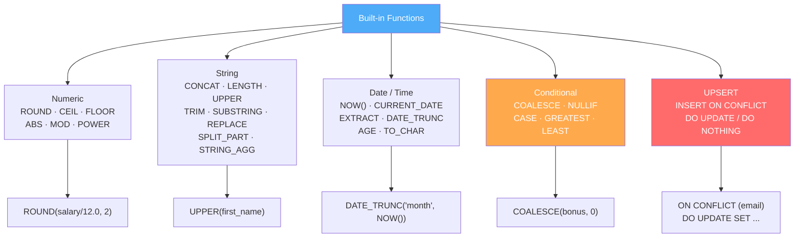

### System-Defined vs User-Defined Functions

| Type               | Description                                            | Examples                                                       |
| ------------------ | ------------------------------------------------------ | -------------------------------------------------------------- |
| **System-Defined** | Built into PostgreSQL — available without any setup    | `ROUND()`, `NOW()`, `LENGTH()`, `COALESCE()`, `CAST()`         |
| **User-Defined**   | Written by you using PL/pgSQL, SQL, or other languages | `get_full_name()`, `calculate_bonus()`, `get_dept_employees()` |

- **System-defined functions** (also called built-in functions) are shipped with PostgreSQL and cover numeric, string, date/time, conditional, conversion, and aggregate operations
- **User-defined functions (UDFs)** are custom functions you create using `CREATE FUNCTION` — covered in detail in [Section 23](#23-functions)
- Both types are called the same way: `function_name(arguments)` in SQL

---

### Numeric Functions

Built-in functions let you transform and compute data within SQL queries without pulling data into your application layer. Doing transformations in SQL is almost always more efficient because you process data at the source rather than transferring rows to your application.

```sql
-- ROUND: round to specified decimal places
SELECT ROUND(salary / 12.0, 2)  AS monthly_salary FROM employees;
SELECT ROUND(3.14159, 2);        -- → 3.14

-- CEIL / CEILING: round up to nearest integer
SELECT CEIL(4.1);    -- → 5
SELECT CEIL(4.9);    -- → 5

-- FLOOR: round down to nearest integer
SELECT FLOOR(4.9);   -- → 4
SELECT FLOOR(-4.1);  -- → -5  (floor goes more negative)

-- ABS: absolute value (ignore sign)
SELECT ABS(-1500);   -- → 1500
-- Use case: finding magnitude of difference regardless of direction
SELECT ABS(e.salary - m.salary) AS salary_gap
FROM employees e JOIN employees m ON e.manager_id = m.employee_id;

-- MOD / %: remainder after division
SELECT MOD(17, 5);  -- → 2
SELECT 17 % 5;      -- → 2 (PostgreSQL shorthand)
-- Use case: even/odd detection, cyclic assignments
SELECT employee_id, MOD(employee_id, 2) AS is_even FROM employees;

-- POWER and SQRT
SELECT POWER(2, 10);  -- → 1024
SELECT SQRT(144);     -- → 12
```

---

### String Functions

String manipulation is essential for every backend application — formatting names, cleaning user input, building dynamic text, extracting information from strings.

```sql
-- CONCAT: join strings together (ignores NULLs)
SELECT CONCAT(first_name, ' ', last_name) AS full_name FROM employees;

-- || operator: same as CONCAT but propagates NULLs
SELECT first_name || ' ' || last_name AS full_name FROM employees;
-- NULL behavior: 'Alice' || NULL = NULL
-- CONCAT('Alice', NULL, 'Smith') = 'AliceSmith' (skips NULL)

-- LENGTH: number of characters
SELECT first_name, LENGTH(first_name) AS name_length FROM employees;

-- UPPER / LOWER: change case
SELECT UPPER('hello world');  -- → HELLO WORLD
SELECT LOWER('ALICE');        -- → alice
-- Use for case-insensitive comparisons, normalizing user input before storage

-- TRIM: remove whitespace (or specified characters from edges)
SELECT TRIM('   hello   ');           -- → 'hello'
SELECT TRIM(LEADING '0' FROM '007');  -- → '7'
SELECT LTRIM('   spaces');            -- removes only left whitespace
SELECT RTRIM('spaces   ');            -- removes only right whitespace

-- SUBSTRING: extract part of a string
SELECT SUBSTRING('Hello World' FROM 7 FOR 5);   -- → 'World'
SELECT SUBSTRING('2026-03-10' FROM 1 FOR 4);    -- → '2026' (year extraction)

-- REPLACE: substitute all occurrences of a substring
SELECT REPLACE('Hello World', 'World', 'PostgreSQL');  -- → 'Hello PostgreSQL'
-- Use case: sanitizing data, bulk text corrections in UPDATE statements

-- SPLIT_PART: split by a delimiter and return the Nth part
SELECT SPLIT_PART('john.doe@company.com', '@', 1);  -- → 'john.doe'
SELECT SPLIT_PART('john.doe@company.com', '@', 2);  -- → 'company.com'

-- POSITION / STRPOS: find the 1-based position of a substring
SELECT STRPOS('hello world', 'world');  -- → 7

-- LPAD / RPAD: pad string to a fixed length
SELECT LPAD('42', 6, '0');   -- → '000042'  (e.g., invoice numbers)
SELECT RPAD('Alice', 10);    -- → 'Alice     '

-- STRING_AGG: aggregate multiple rows into one delimited string
SELECT department_id,
       STRING_AGG(first_name, ', ' ORDER BY first_name) AS members
FROM employees
GROUP BY department_id;
```

---

### Date and Time Functions

Date/time handling is notoriously tricky in databases. Timezone mismatches, DST changes, and date arithmetic errors are among the most common production bugs.

```sql
-- Current date and time
SELECT CURRENT_TIMESTAMP;   -- timestamp with timezone (same as NOW())
SELECT NOW();                -- timestamp with timezone
SELECT CURRENT_DATE;         -- date only (e.g., 2026-03-13)
SELECT CURRENT_TIME;         -- time only

-- Adding/subtracting plain integer days (integer shorthand)
SELECT CURRENT_DATE + 10;    -- 10 days from today
SELECT CURRENT_DATE + 30;    -- 30 days from today
SELECT CURRENT_DATE - 30;    -- 30 days ago

-- Adding months using INTERVAL
SELECT CURRENT_DATE + INTERVAL '1 month';   -- one month from today
SELECT CURRENT_DATE + INTERVAL '2 month';   -- two months from today
SELECT CURRENT_DATE + INTERVAL '3 months 15 days';  -- combined

-- Last day of the current month
-- Strategy: go to first of month → add 1 month → subtract 1 day → cast to DATE
SELECT (DATE_TRUNC('month', CURRENT_DATE) + INTERVAL '1 month - 1 day')::DATE
  AS last_day_of_month;
-- e.g. March 2026 → 2026-03-31

-- Last day of any specific month
SELECT (DATE_TRUNC('month', '2026-02-10'::DATE) + INTERVAL '1 month - 1 day')::DATE;
-- → 2026-02-28 (handles leap years automatically)

-- EXTRACT: get a specific component from a date/timestamp
-- Syntax: EXTRACT(field FROM date/timestamp/interval)
-- Always returns a NUMERIC value

SELECT EXTRACT(YEAR        FROM NOW());          -- → 2026
SELECT EXTRACT(MONTH       FROM NOW());          -- → 3  (March)
SELECT EXTRACT(DAY         FROM NOW());          -- → 13
SELECT EXTRACT(HOUR        FROM NOW());          -- → 14 (24-hour)
SELECT EXTRACT(MINUTE      FROM NOW());          -- → 30
SELECT EXTRACT(SECOND      FROM NOW());          -- → 45.123 (with fractions)
SELECT EXTRACT(DOW         FROM NOW());          -- → 5  (0=Sun, 1=Mon … 6=Sat)
SELECT EXTRACT(DOY         FROM NOW());          -- → 72 (day of year, 1–365)
SELECT EXTRACT(WEEK        FROM NOW());          -- → 11 (ISO week number)
SELECT EXTRACT(QUARTER     FROM NOW());          -- → 1  (Q1 = Jan–Mar)
SELECT EXTRACT(EPOCH       FROM NOW());          -- → seconds since 1970-01-01 UTC
SELECT EXTRACT(TIMEZONE    FROM NOW());          -- → offset in seconds from UTC
SELECT EXTRACT(MILLISECONDS FROM NOW());         -- → ms part (0–999)
SELECT EXTRACT(MICROSECONDS FROM NOW());         -- → µs part

-- Practical examples on table columns
SELECT EXTRACT(YEAR  FROM hire_date) AS hire_year  FROM employees;
SELECT EXTRACT(MONTH FROM hire_date) AS hire_month FROM employees;
SELECT EXTRACT(DAY   FROM hire_date) AS hire_day   FROM employees;
SELECT EXTRACT(HOUR  FROM created_at) AS created_hour FROM orders;

-- date_part() — older function, identical behaviour to EXTRACT
SELECT DATE_PART('year',  NOW());    -- → 2026  (same as EXTRACT)
SELECT DATE_PART('month', NOW());    -- → 3
SELECT DATE_PART('day',   NOW());    -- → 13

-- EXTRACT field reference
-- ┌──────────────┬────────────────────────────────────────┐
-- │ Field        │ Description                            │
-- ├──────────────┼────────────────────────────────────────┤
-- │ YEAR         │ 4-digit year                           │
-- │ MONTH        │ 1–12                                   │
-- │ DAY          │ 1–31                                   │
-- │ HOUR         │ 0–23                                   │
-- │ MINUTE       │ 0–59                                   │
-- │ SECOND       │ 0–59.999…                              │
-- │ MILLISECONDS │ 0–999 ms portion                       │
-- │ MICROSECONDS │ 0–999999 µs portion                    │
-- │ DOW          │ Day of week: 0=Sun … 6=Sat             │
-- │ ISODOW       │ ISO day of week: 1=Mon … 7=Sun         │
-- │ DOY          │ Day of year: 1–365 (366 in leap year)  │
-- │ WEEK         │ ISO week number: 1–53                  │
-- │ QUARTER      │ 1–4                                    │
-- │ EPOCH        │ Seconds since 1970-01-01 00:00:00 UTC  │
-- └──────────────┴────────────────────────────────────────┘

-- DATE_TRUNC: truncate to a time precision boundary
SELECT DATE_TRUNC('month', CURRENT_DATE);  -- → first day of current month
SELECT DATE_TRUNC('year',  CURRENT_DATE);  -- → Jan 1 of current year
SELECT DATE_TRUNC('hour',  NOW());         -- → current hour with :00:00
-- Golden use case: grouping time-series data by day, week, or month
SELECT DATE_TRUNC('month', created_at) AS month, COUNT(*) AS new_users
FROM users
GROUP BY DATE_TRUNC('month', created_at)
ORDER BY month;

-- Date arithmetic with INTERVAL
SELECT CURRENT_DATE + INTERVAL '30 days';        -- 30 days from now
SELECT CURRENT_DATE - INTERVAL '1 year';         -- 1 year ago
SELECT hire_date + INTERVAL '90 days' AS probation_end FROM employees;

-- AGE: human-readable interval between two dates
SELECT AGE(CURRENT_DATE, hire_date) AS tenure FROM employees;
-- → e.g., "3 years 2 months 15 days"
SELECT EXTRACT(YEAR FROM AGE(CURRENT_DATE, birth_date)) AS age_years FROM users;

-- TO_CHAR: format a date/timestamp as a string
SELECT TO_CHAR(CURRENT_DATE, 'DD Mon YYYY');        -- → '10 Mar 2026'
SELECT TO_CHAR(NOW(), 'YYYY-MM-DD HH24:MI:SS');     -- → '2026-03-10 14:30:00'

-- TO_DATE / TO_TIMESTAMP: parse string to date
SELECT TO_DATE('10-03-2026', 'DD-MM-YYYY');
SELECT TO_TIMESTAMP('2026-03-10 14:30:00', 'YYYY-MM-DD HH24:MI:SS');
```

**Critical best practice:** Store timestamps with timezone (`TIMESTAMPTZ`) for any event-time data when your users are in multiple time zones. Store all times as UTC internally and convert to local time in the application layer. A timezone-naive bug in production is extremely difficult to correct after the fact.

---

### Conditional Functions

These functions let you express conditional logic directly inside SQL — eliminating many application-layer transformations.

```sql
-- COALESCE: return the first non-NULL value in the list
SELECT COALESCE(phone, mobile, 'No contact') AS best_contact FROM customers;
-- Returns phone if not NULL, else mobile if not NULL, else 'No contact'
-- This is the most-used function for NULL handling in real applications

-- NULLIF: return NULL if two values are equal — prevents division-by-zero
SELECT total_sales / NULLIF(total_orders, 0) AS avg_order_value FROM daily_stats;
-- If total_orders = 0, NULLIF returns NULL → division becomes NULL instead of error

-- CASE (expression form — inline conditional, usable in SELECT lists)
SELECT
  first_name,
  salary,
  CASE
    WHEN salary > 100000 THEN 'Senior'
    WHEN salary >  60000 THEN 'Mid-Level'
    WHEN salary >  30000 THEN 'Junior'
    ELSE 'Intern'
  END AS salary_band
FROM employees;

-- Conditional aggregation — extremely powerful pattern
SELECT
  department_id,
  COUNT(*)                                        AS total,
  COUNT(CASE WHEN gender = 'Female' THEN 1 END)  AS female_count,
  COUNT(CASE WHEN gender = 'Male'   THEN 1 END)  AS male_count,
  ROUND(
    100.0 * COUNT(CASE WHEN gender = 'Female' THEN 1 END) / COUNT(*),
    1
  ) AS female_pct
FROM employees
GROUP BY department_id;

-- GREATEST / LEAST: return largest/smallest from a list of values
SELECT GREATEST(100, 200, 150);   -- → 200
SELECT LEAST(100, 200, 150);      -- → 100
-- Use case: cap a discount at maximum 50%
SELECT LEAST(discount_pct, 50) AS capped_discount FROM orders;
```

---

### UPSERT — INSERT ON CONFLICT

**UPSERT** means "update if exists, insert if not" — a common atomic operation in every backend application. In PostgreSQL, this is `INSERT ... ON CONFLICT`.

The traditional SELECT-then-INSERT-or-UPDATE pattern has a **race condition**: between your SELECT and your INSERT, another process might insert the same record. UPSERT solves this atomically in a single statement.

```sql
-- Track daily page view counts: increment if today's record exists, else insert
INSERT INTO page_views (page_id, view_date, view_count)
VALUES (42, CURRENT_DATE, 1)
ON CONFLICT (page_id, view_date)
DO UPDATE SET view_count = page_views.view_count + 1;

-- ON CONFLICT DO NOTHING: silently ignore duplicate inserts
INSERT INTO email_subscriptions (email)
VALUES ('user@example.com')
ON CONFLICT (email) DO NOTHING;

-- Update multiple columns; use EXCLUDED to reference the attempted new values
INSERT INTO products (sku, name, price, updated_at)
VALUES ('SKU-001', 'Widget Pro', 29.99, NOW())
ON CONFLICT (sku)
DO UPDATE SET
  name       = EXCLUDED.name,
  price      = EXCLUDED.price,
  updated_at = EXCLUDED.updated_at;
-- EXCLUDED refers to the row that would have been inserted (the new values)
```

**When to use:** Syncing data from external sources, building idempotent API endpoints (same request can be safely sent multiple times), incrementing counters, maintaining "latest-record" caches.

**Common mistake:** Forgetting which constraint to reference in `ON CONFLICT`. You must specify the column(s) forming the unique/primary key constraint — PostgreSQL needs to know what "conflict" means.

---

### Conversion Functions

Conversion functions change a value from one data type to another. PostgreSQL provides two syntaxes for casting, plus dedicated formatting functions.

#### CAST and :: Operator

```sql
-- CAST(value AS type) — SQL standard syntax
SELECT CAST('123' AS INTEGER);           -- → 123 (text to integer)
SELECT CAST(123 AS TEXT);               -- → '123' (integer to text)
SELECT CAST('2026-03-12' AS DATE);      -- → 2026-03-12 (text to date)
SELECT CAST(9.99 AS INTEGER);           -- → 10 (numeric to integer, rounds)
SELECT CAST(TRUE AS INTEGER);           -- → 1 (boolean to integer)

-- :: operator — PostgreSQL shorthand for CAST (preferred in practice)
SELECT '123'::INTEGER;                  -- → 123
SELECT 123::TEXT;                       -- → '123'
SELECT '2026-03-12'::DATE;             -- → 2026-03-12
SELECT '3.14'::NUMERIC;               -- → 3.14
SELECT NOW()::DATE;                    -- → today's date (strips time)
SELECT salary::TEXT FROM employees;    -- numeric column → text
```

#### TO_CHAR — Number / Date → Formatted String

`TO_CHAR` converts a number or date/timestamp into a **formatted string** using a format mask.

```sql
-- Date formatting
SELECT TO_CHAR(NOW(), 'DD-MON-YYYY');             -- → '12-MAR-2026'
SELECT TO_CHAR(NOW(), 'DD/MM/YYYY HH24:MI:SS');  -- → '12/03/2026 14:30:00'
SELECT TO_CHAR(NOW(), 'Day, DD Month YYYY');      -- → 'Thursday, 12 March 2026'
SELECT TO_CHAR(hire_date, 'YYYY-MM-DD') FROM employees;

-- Number formatting
SELECT TO_CHAR(1234567.89, '99,999,999.00');      -- → '1,234,567.89'
SELECT TO_CHAR(0.75, 'FM990.00%');                -- → '75.00%'
SELECT TO_CHAR(salary, 'L99,999.00') FROM employees;  -- L = locale currency symbol
```

| Format Pattern | Meaning                                     |
| -------------- | ------------------------------------------- |
| `DD`           | Day (01–31)                                 |
| `MM`           | Month number (01–12)                        |
| `MON`          | Abbreviated month name (JAN, FEB…)          |
| `Month`        | Full month name                             |
| `YYYY`         | 4-digit year                                |
| `HH24`         | Hour in 24-hour format                      |
| `MI`           | Minutes                                     |
| `SS`           | Seconds                                     |
| `9`            | Digit position (suppresses leading zeros)   |
| `0`            | Digit position (keeps leading zeros)        |
| `FM`           | Fill mode — removes leading/trailing spaces |

#### TO_NUMBER — Formatted String → Number

```sql
-- TO_NUMBER(string, format)
SELECT TO_NUMBER('1,234.56', '9,999.99');    -- → 1234.56
SELECT TO_NUMBER('$9,999.00', 'L9,999.99'); -- → 9999.00
SELECT TO_NUMBER('75%', '999%');             -- → 75
```

#### TO_DATE — Formatted String → Date

```sql
-- TO_DATE(string, format)
SELECT TO_DATE('12-03-2026', 'DD-MM-YYYY');        -- → 2026-03-12
SELECT TO_DATE('March 12 2026', 'Month DD YYYY');  -- → 2026-03-12
SELECT TO_DATE('12/Mar/26', 'DD/Mon/YY');          -- → 2026-03-12

-- Common use: storing dates received as strings from user input or APIs
INSERT INTO events (event_date)
VALUES (TO_DATE('12-03-2026', 'DD-MM-YYYY'));
```

#### TO_TIMESTAMP — Formatted String → Timestamp

```sql
SELECT TO_TIMESTAMP('2026-03-12 14:30:00', 'YYYY-MM-DD HH24:MI:SS');
-- → 2026-03-12 14:30:00

SELECT TO_TIMESTAMP('12/03/2026 02:30 PM', 'DD/MM/YYYY HH:MI AM');
-- → 2026-03-12 14:30:00
```

#### Quick Reference — Conversion Summary

| Goal                           | Function / Syntax                                        |
| ------------------------------ | -------------------------------------------------------- |
| Text → Integer                 | `'42'::INTEGER` or `CAST('42' AS INTEGER)`               |
| Integer → Text                 | `42::TEXT` or `CAST(42 AS TEXT)`                         |
| Text → Date                    | `TO_DATE('12-03-2026', 'DD-MM-YYYY')`                    |
| Text → Timestamp               | `TO_TIMESTAMP('2026-03-12 14:30', 'YYYY-MM-DD HH24:MI')` |
| Date/Number → Formatted String | `TO_CHAR(value, 'format')`                               |
| Formatted String → Number      | `TO_NUMBER('1,234.56', '9,999.99')`                      |
| Timestamp → Date only          | `NOW()::DATE`                                            |
| Numeric → Integer (truncate)   | `TRUNC(9.9)::INTEGER` → `9`                              |

> **Tip:** Use `::` in everyday queries (cleaner), `CAST()` when writing SQL that needs to be portable across databases.

---

### Practice Questions — Built-in Functions

**Q1.** Display each employee's monthly salary (annual / 12) rounded to 2 decimal places.

```sql
SELECT ename, salary, ROUND(salary / 12.0, 2) AS monthly_sal FROM emp;
```

**Q2.** Display employee names in UPPER case and show the length of each name.

```sql
SELECT UPPER(ename) AS name_upper, LENGTH(ename) AS name_length FROM emp;
```

**Q3.** Get employees hired in the year 1982 using `TO_CHAR`.

```sql
SELECT * FROM emp
WHERE TO_CHAR(hiredate, 'YYYY') = '1982';
```

**Q4.** Get employees hired in the years 1987, 1982, or 1980 from IT, HR, or Finance.

```sql
SELECT * FROM emp
WHERE TO_CHAR(hiredate, 'YYYY') IN ('1987', '1982', '1980')
  AND deptno IN (
    SELECT deptno FROM dept WHERE dname IN ('IT', 'HR', 'Finance')
  );
```

**Q5.** Display hire dates formatted as `DD-Month-YYYY` and calculate tenure in years.

```sql
SELECT
  ename,
  TO_CHAR(hiredate, 'DD-Month-YYYY')                    AS hire_formatted,
  EXTRACT(YEAR FROM AGE(CURRENT_DATE, hiredate))::INT   AS years_of_service
FROM emp;
```

**Q6.** Replace NULL commission values with 0, then calculate total compensation.

```sql
SELECT
  ename,
  salary,
  COALESCE(comm, 0)           AS commission,
  salary + COALESCE(comm, 0)  AS total_comp
FROM emp;
```

**Q7.** Convert the string `'12-03-2026'` to a DATE and add 90 days to it.

```sql
SELECT TO_DATE('12-03-2026', 'DD-MM-YYYY') + INTERVAL '90 days' AS future_date;
```

---

## 13. Indexes & Performance

[↑ Back to Index](#table-of-contents)

### What is an Index and Why Does It Exist?

Imagine your `users` table has 10 million rows. You run `SELECT * FROM users WHERE email = 'alice@example.com'`. Without an index, PostgreSQL must read **every single row** in the table, comparing the email field one by one. This is called a **full table scan** (sequential scan). For 10 million rows, this could take seconds.

An **index** is a separate data structure, maintained by the database alongside the table, that allows the database to locate rows matching a condition without reading every row. Think of a book index at the back: instead of reading every page to find where "PostgreSQL" is mentioned, you look up the index and jump directly to those pages.

**Indexes come at a cost:**

- They consume additional disk space
- Every INSERT, UPDATE, or DELETE must also update all relevant indexes
- Too many indexes on a write-heavy table can significantly slow down writes

This is why indiscriminately adding indexes is wrong — index design requires careful thought about your query patterns.

---

### B-Tree Index (Default)

PostgreSQL's default index type is the **B-Tree (Balanced Tree)**. When you write `CREATE INDEX idx_email ON users(email)`, you get a B-Tree index.

A B-Tree is a self-balancing tree structure where every leaf node is at the same depth. The tree is sorted, meaning it supports:

- **Equality:** `WHERE email = 'alice@example.com'` → O(log n)
- **Range:** `WHERE salary BETWEEN 50000 AND 100000` → O(log n + k)
- **Sorting:** `ORDER BY salary` can use the index, avoiding a sort step
- **Prefix match:** `WHERE name LIKE 'Ali%'` (only `%` at the end, not the beginning)

```sql
-- Create a standard B-Tree index
CREATE INDEX idx_employees_email ON employees(email);

-- Index on a frequently filtered column
CREATE INDEX idx_orders_customer_id ON orders(customer_id);

-- Partial index: only index rows matching a condition (smaller, faster to maintain)
CREATE INDEX idx_active_users ON users(email)
WHERE is_active = TRUE;
-- Only active users are indexed — much smaller if most users are inactive
```

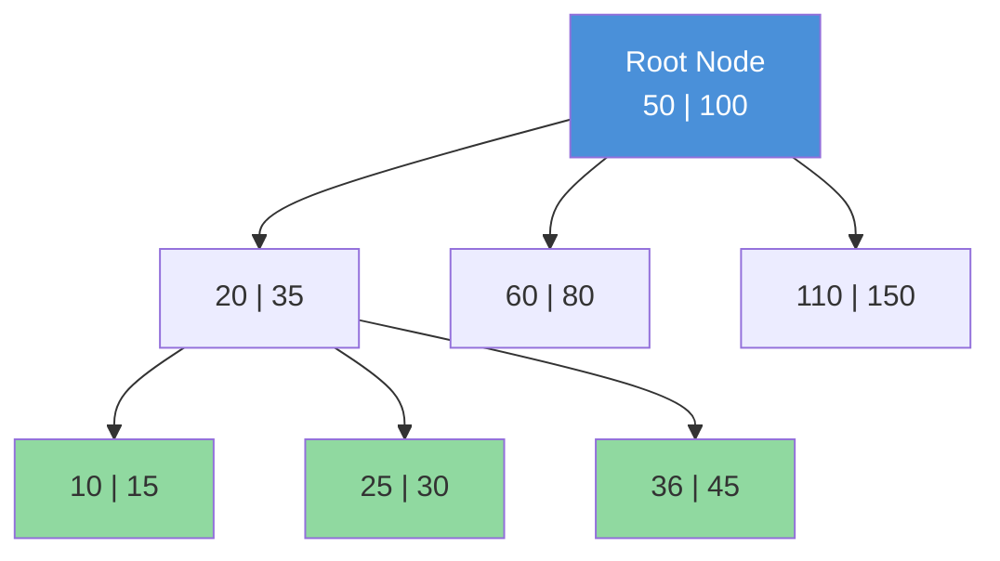

---

### Composite Index

A **composite index** covers multiple columns and is useful when queries filter or sort on combinations of columns.

```sql
-- Optimize queries like: WHERE department_id = 10 AND salary > 50000
CREATE INDEX idx_emp_dept_salary ON employees(department_id, salary);
```

**Critical rule: column order matters.** The index is usable only when the query filters on the **leading (leftmost)** column(s).

With `idx_emp_dept_salary(department_id, salary)`:

- `WHERE department_id = 10` ✅ uses index (leftmost column)
- `WHERE department_id = 10 AND salary > 50000` ✅ fully uses index
- `WHERE salary > 50000` ❌ does NOT use index (skips leftmost column)

This is the **left-prefix rule**. Design composite indexes so the most selective or most-frequently-filtered column comes first.

---

### Index Selectivity

**Selectivity** measures how many distinct values a column has relative to total rows. A highly selective column has many distinct values (like email — nearly unique per row). A low-selectivity column has few distinct values (like a `status` column with 3 values).

Indexes on low-selectivity columns are often **not used** by the query planner because it can be faster to scan the whole table than to use an index that still points to half the rows.

```sql
-- High selectivity = excellent index candidate
CREATE INDEX idx_email ON users(email);   -- nearly every value is unique

-- Low selectivity = poor index candidate, planner may ignore it
CREATE INDEX idx_gender ON users(gender); -- only ~3 distinct values
-- For 1M users a gender filter returns ~330K rows — sequential scan may be faster
```

---

### Covering Index (Index-Only Scan)

A **covering index** includes all columns needed by a query. When all required columns are in the index, PostgreSQL can satisfy the query entirely from the index without touching the actual table — an **index-only scan** — which is the fastest possible read path.

```sql
-- Query: SELECT email, created_at FROM users WHERE is_active = TRUE
-- Covering index includes filter column + all selected columns
CREATE INDEX idx_active_users_covering ON users(is_active, email, created_at);
-- PostgreSQL never needs to access the heap table — everything is in the index
```

---

### EXPLAIN and EXPLAIN ANALYZE

Before and after adding an index, use `EXPLAIN` to see the query plan and `EXPLAIN ANALYZE` to see actual runtime statistics.

```sql
-- EXPLAIN: shows estimated plan (does NOT execute the query)
EXPLAIN SELECT * FROM employees WHERE department_id = 10;

-- EXPLAIN ANALYZE: executes the query and shows actual vs estimated stats
EXPLAIN ANALYZE SELECT * FROM employees WHERE department_id = 10;

-- Full diagnostic version
EXPLAIN (ANALYZE, BUFFERS, FORMAT TEXT)
SELECT * FROM employees WHERE department_id = 10;
```

**Reading the output — key terms:**

- `Seq Scan` — full table scan. Bad for large tables.
- `Index Scan` — uses an index, still fetches non-indexed columns from table.
- `Index Only Scan` — uses a covering index, never touches the table. Best.
- `cost=0.00..X.XX` — estimated cost (startup..total). Lower is better.
- `actual time=X..X` — real wall-clock time (only in ANALYZE).
- `Nested Loop, Hash Join, Merge Join` — join algorithms chosen by planner.

```sql
-- Verify your new index is being used
EXPLAIN ANALYZE SELECT * FROM employees WHERE email = 'alice@example.com';
-- Should show: Index Scan using idx_employees_email
-- If it shows Seq Scan, the planner decided index was slower
-- (small table, low selectivity, or stale statistics — try running ANALYZE first)
```

---

### When NOT to Use Indexes

1. **Low-selectivity columns** (gender, boolean flags with mostly one value) — planner often ignores them
2. **Very small tables** — a full scan of 200 rows is faster than B-Tree traversal
3. **Write-heavy columns** — columns updated constantly cause high index maintenance overhead
4. **Columns not in WHERE, JOIN, or ORDER BY** — they will never be used by any query

**The rule of thumb:** Add indexes to columns that appear in `WHERE`, `JOIN ON`, or `ORDER BY` in your frequent or slow queries. Then verify with `EXPLAIN ANALYZE` that the index is actually being used.

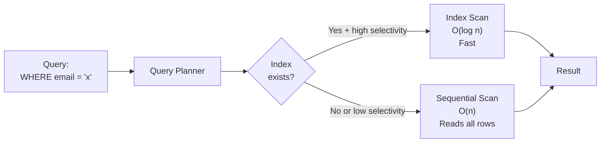

**Session Recap:** An index is a separate sorted data structure enabling direct row access, avoiding full table scans. B-Tree supports equality, range, and prefix patterns. Composite index column order matters — leftmost columns must be in your filter. High selectivity equals a good index candidate. Covering indexes eliminate table I/O entirely. Always verify with EXPLAIN ANALYZE before and after.

---

### Additional Index Types — Partial, GIN, GiST, Hash

#### Partial Index — Index Only What You Query

A **partial index** includes only rows satisfying a `WHERE` condition. It is smaller, faster to maintain, and more selective than a full-column index.

```sql
-- Only index active employees — WHERE active = TRUE queries use this
CREATE INDEX idx_active_employees
ON employees (last_name)
WHERE is_active = TRUE;

-- Only index large orders (most queries filter by status='pending')
CREATE INDEX idx_pending_orders
ON orders (order_date)
WHERE status = 'pending';

-- Partial unique index: enforce uniqueness only among active records
CREATE UNIQUE INDEX uq_active_email
ON users (email)
WHERE is_deleted = FALSE;
-- Two deleted users can share an email (soft deletes pattern)
```

#### GIN Index — Generalized Inverted Index (Arrays, JSONB, Full-Text)

**GIN** (Generalized Inverted Index) is optimized for values that contain **multiple component items** — arrays, JSONB, and full-text search vectors. It maps each element to the rows that contain it.

```sql
-- GIN on JSONB column (enables @>, ?, ?|, ?& operators)
CREATE INDEX idx_gin_product_attrs ON products USING GIN (attributes);

-- Fast: "find all products where attributes contains 'color': 'red'"
SELECT * FROM products WHERE attributes @> '{"color": "red"}';

-- GIN on text array column
CREATE INDEX idx_gin_tags ON articles USING GIN (tags);
SELECT * FROM articles WHERE tags @> ARRAY['postgresql', 'performance'];

-- GIN on tsvector column for full-text search
CREATE INDEX idx_fts_body ON articles USING GIN (to_tsvector('english', body));
SELECT * FROM articles
WHERE to_tsvector('english', body) @@ to_tsquery('english', 'database & performance');
```

#### GiST Index — Generalized Search Tree (Ranges, Geometry)

**GiST** (Generalized Search Tree) supports complex data types including ranges, geometric types, and nearest-neighbour searches.

```sql
-- GiST on daterange column (enables &&, @>, <@ operators)
CREATE INDEX idx_gist_booking ON room_bookings USING GIST (stay_period);

-- GiST on geometric point (enables nearest-neighbour / distance queries)
CREATE INDEX idx_gist_location ON venues USING GIST (location);
-- Find venues within 10km (with PostGIS, or using built-in <-> operator)
```

#### Hash Index — Equality-Only Fast Lookup

A **hash index** is optimized purely for `=` equality lookups. Smaller than B-Tree for equality-only workloads, but does not support range queries or sorting.

```sql
-- Hash index on UUID primary key (equality lookups only)
CREATE INDEX idx_hash_session_token
ON sessions USING HASH (session_token);

-- Use case: high-volume equality lookup on a long string column
CREATE INDEX idx_hash_email ON users USING HASH (email);
```

| Index Type | Best For                                            | Supports Range? | Supports Sort? |
| ---------- | --------------------------------------------------- | --------------- | -------------- |
| **B-Tree** | Equality, range, prefix                             | ✅              | ✅             |
| **Hash**   | Equality only                                       | ❌              | ❌             |
| **GIN**    | Arrays, JSONB, full-text                            | ❌              | ❌             |
| **GiST**   | Ranges, geometry, nearest-neighbour                 | ✅              | ❌             |
| **BRIN**   | Very large tables with sequential data (timestamps) | ✅ (coarse)     | ❌             |

---

### Table Partitioning

**Table partitioning** splits a logically single large table into multiple physical **child tables** (partitions). PostgreSQL routes queries and DML to the correct partitions automatically. Queries that include the partition key in `WHERE` only scan relevant partitions (**partition pruning**) — dramatically reducing I/O on large tables.

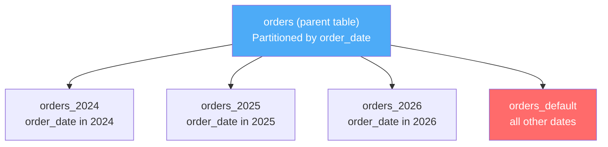

#### RANGE Partitioning — By Value Range

Most common type — partition by date ranges, ID ranges, etc.

```sql
-- Create a range-partitioned table
CREATE TABLE orders (
  order_id    BIGINT,
  order_date  DATE NOT NULL,
  customer_id INTEGER,
  total       NUMERIC(12,2)
) PARTITION BY RANGE (order_date);

-- Create partitions for each year
CREATE TABLE orders_2024 PARTITION OF orders
  FOR VALUES FROM ('2024-01-01') TO ('2025-01-01');

CREATE TABLE orders_2025 PARTITION OF orders
  FOR VALUES FROM ('2025-01-01') TO ('2026-01-01');

CREATE TABLE orders_2026 PARTITION OF orders
  FOR VALUES FROM ('2026-01-01') TO ('2027-01-01');

-- Default partition catches everything outside defined ranges
CREATE TABLE orders_default PARTITION OF orders DEFAULT;

-- INSERT automatically goes to the right partition
INSERT INTO orders VALUES (1, '2025-03-10', 42, 299.99);
-- → stored in orders_2025 automatically

-- Partition pruning: this only scans orders_2025
SELECT * FROM orders WHERE order_date BETWEEN '2025-01-01' AND '2025-12-31';
```

#### LIST Partitioning — By Discrete Values

```sql
CREATE TABLE employees (
  employee_id   INTEGER,
  first_name    VARCHAR(50),
  country       VARCHAR(50) NOT NULL,
  salary        NUMERIC(12,2)
) PARTITION BY LIST (country);

CREATE TABLE employees_india  PARTITION OF employees FOR VALUES IN ('India', 'IN');
CREATE TABLE employees_usa    PARTITION OF employees FOR VALUES IN ('USA', 'US');
CREATE TABLE employees_others PARTITION OF employees DEFAULT;
```

#### HASH Partitioning — Evenly Spread Data

```sql
-- Distribute rows evenly across 4 partitions using hash of customer_id
CREATE TABLE sessions (
  session_id  UUID NOT NULL,
  customer_id INTEGER NOT NULL,
  data        JSONB
) PARTITION BY HASH (customer_id);

CREATE TABLE sessions_p0 PARTITION OF sessions FOR VALUES WITH (MODULUS 4, REMAINDER 0);
CREATE TABLE sessions_p1 PARTITION OF sessions FOR VALUES WITH (MODULUS 4, REMAINDER 1);
CREATE TABLE sessions_p2 PARTITION OF sessions FOR VALUES WITH (MODULUS 4, REMAINDER 2);
CREATE TABLE sessions_p3 PARTITION OF sessions FOR VALUES WITH (MODULUS 4, REMAINDER 3);
```

#### Managing Partitions

```sql
-- List all partitions of a table
SELECT inhrelid::regclass AS partition_name
FROM pg_inherits
WHERE inhparent = 'orders'::regclass;

-- Detach a partition (keeps the table, just detaches it from the parent)
ALTER TABLE orders DETACH PARTITION orders_2024;

-- Attach an existing table as a new partition
ALTER TABLE orders ATTACH PARTITION orders_2027
  FOR VALUES FROM ('2027-01-01') TO ('2028-01-01');

-- Drop a partition and its data
DROP TABLE orders_2024;
```

| Partition Type | Partition Key                     | Best For                               |
| -------------- | --------------------------------- | -------------------------------------- |
| **RANGE**      | Continuous values (dates, IDs)    | Time-series data, logs, orders         |
| **LIST**       | Discrete values (country, status) | Regional data, categorical splits      |
| **HASH**       | Any column                        | Even data distribution, no natural key |

> **Key benefit:** Partition pruning. A query `WHERE order_date = '2025-06-15'` scans only `orders_2025` — skipping potentially billions of rows in other partitions. Always include the partition key in your `WHERE` clause to get the benefit.

---

## 14. Transactions & Concurrency (Extended)

[↑ Back to Index](#table-of-contents)

> The basic TCL commands (BEGIN, COMMIT, ROLLBACK, SAVEPOINT) are covered in Section 4. This section covers the critical advanced topics: ACID deep dive, isolation levels, locking, and deadlocks.

### ACID Properties — Deep Dive

**ACID** is the set of properties that guarantee database transactions are processed reliably. Every design decision in PostgreSQL's engine is driven by maintaining ACID.

**Atomicity** means a transaction is all-or-nothing. If you transfer $100 from Account A to Account B — debit A, credit B — atomicity guarantees that either both steps happen or neither does. You will never have a state where A was debited but B wasn't credited. PostgreSQL achieves this with Write-Ahead Logging (WAL) — changes are logged before they are applied, so incomplete transactions can be rolled back on crash recovery.

**Consistency** means a transaction brings the database from one valid state to another valid state, respecting all defined rules — constraints, cascades, triggers. You cannot commit a transaction that would leave the database in an invalid state (e.g., a foreign key pointing to a non-existent row).

**Isolation** means concurrent transactions see the database as if they were running serially — one at a time. The degree of isolation is configurable (isolation levels below). Without isolation, concurrent transactions can interfere in ways that produce incorrect results.

**Durability** means once a transaction is committed, it stays committed even if the server crashes immediately after. PostgreSQL syncs the WAL to disk before acknowledging a commit. The WAL is replayed on restart to recover all committed transactions.

---

### Transaction Isolation Levels

**Isolation levels** define how much one in-progress transaction can "see" the changes made by another concurrent in-progress transaction. Stronger isolation means better data correctness but lower concurrency; weaker isolation means higher concurrency but possible anomalies.

#### The Three Concurrency Anomalies

**Dirty Read:** Transaction A reads data that Transaction B has modified but **not yet committed**. If B then rolls back, A has read data that never actually existed — "phantom money."

**Non-Repeatable Read:** Transaction A reads a row. Transaction B updates and commits that row. A reads the same row again and gets a **different value**. The same SELECT returns different results within the same transaction.

**Phantom Read:** Transaction A queries a set of rows matching a condition. Transaction B inserts a new row matching that condition. A queries again and sees a new **"phantom" row** that wasn't there before.

| Isolation Level  | Dirty Read   | Non-Repeatable Read | Phantom Read |
| ---------------- | ------------ | ------------------- | ------------ |
| READ UNCOMMITTED | Possible ❌  | Possible ❌         | Possible ❌  |
| READ COMMITTED   | Prevented ✅ | Possible ❌         | Possible ❌  |
| REPEATABLE READ  | Prevented ✅ | Prevented ✅        | Possible ❌  |
| SERIALIZABLE     | Prevented ✅ | Prevented ✅        | Prevented ✅ |

> **PostgreSQL note:** PostgreSQL does not actually implement READ UNCOMMITTED differently from READ COMMITTED. The minimum isolation you ever get in PostgreSQL is READ COMMITTED.

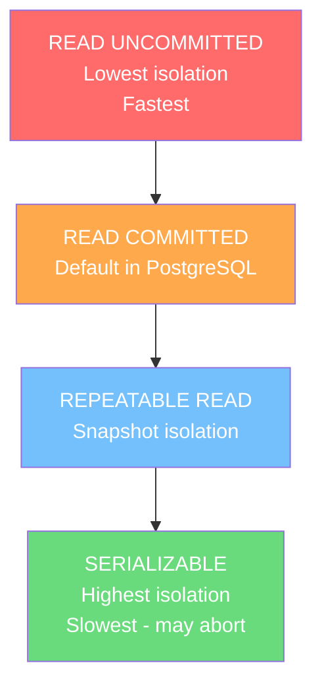

```sql
-- Set isolation level for a transaction
BEGIN TRANSACTION ISOLATION LEVEL READ COMMITTED;
-- ... statements ...
COMMIT;

BEGIN TRANSACTION ISOLATION LEVEL REPEATABLE READ;
-- ... statements ...
COMMIT;

BEGIN TRANSACTION ISOLATION LEVEL SERIALIZABLE;
-- ... statements ...
COMMIT;

-- Check current isolation level
SHOW transaction_isolation;
```

**READ COMMITTED (PostgreSQL default):** Each statement sees a snapshot of committed data as of the moment that statement began. Two SELECT statements in the same transaction can return different results if another transaction committed between them (non-repeatable read is possible). Suitable for most web applications.

**REPEATABLE READ:** The entire transaction sees a snapshot taken at its start. If another transaction commits changes to a row you've already read, your transaction still sees the old version. Prevents dirty reads and non-repeatable reads. Use for transactions that need a consistent view of data (reports, exports).

**SERIALIZABLE:** Transactions execute as if they ran one at a time, serially. PostgreSQL uses Serializable Snapshot Isolation (SSI) — a sophisticated algorithm that detects and aborts transactions that would produce non-serializable results. Use for financial transactions where even phantom reads are unacceptable. Requires retry logic in application code since transactions can be aborted.

---

### Locks

**Locks** are mechanisms that prevent conflicting concurrent operations on the same data.

#### Row-Level Locks

```sql
-- FOR UPDATE: lock selected rows, preventing other transactions from modifying them
-- Classic pattern: read-then-update without race conditions
BEGIN;
SELECT * FROM accounts WHERE account_id = 101 FOR UPDATE;
-- Other transactions trying to UPDATE this row will WAIT here
UPDATE accounts SET balance = balance - 100 WHERE account_id = 101;
COMMIT;

-- FOR SHARE: allows other readers but blocks writers
SELECT * FROM products WHERE product_id = 1 FOR SHARE;

-- NOWAIT: fail immediately if lock cannot be acquired (don't block)
SELECT * FROM orders WHERE order_id = 55 FOR UPDATE NOWAIT;
-- Raises: ERROR: could not obtain lock on row

-- SKIP LOCKED: skip already-locked rows (concurrent job queue pattern)
SELECT * FROM job_queue
WHERE status = 'pending'
LIMIT 10
FOR UPDATE SKIP LOCKED;
-- Returns up to 10 unlocked pending jobs — standard pattern for worker processes
```

#### Table-Level Locks

Most DDL operations acquire table-level locks. The most important is `ACCESS EXCLUSIVE` — acquired by `ALTER TABLE`, `DROP TABLE`, `TRUNCATE`. This blocks ALL other operations on the table.

**Real-world concern:** Running `ALTER TABLE ... ADD COLUMN` on a large production table acquires `ACCESS EXCLUSIVE` and blocks all reads and writes until complete. Zero-downtime migrations on large tables require careful planning: add nullable columns (no rewrite needed), use `DEFAULT` that can be pre-set, or use tools like `pg_repack`.

---

### Deadlocks

A **deadlock** occurs when two or more transactions are each waiting for the other to release a lock, creating a circular dependency. Neither can proceed, so PostgreSQL detects the deadlock and terminates one of the transactions with: `ERROR: deadlock detected`.

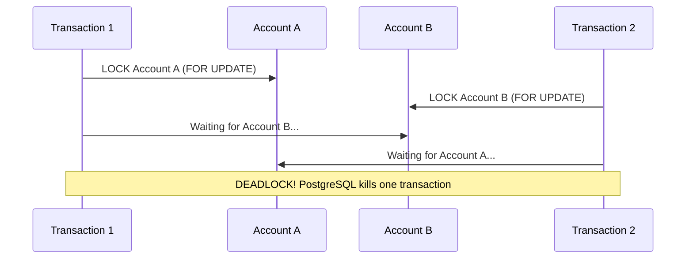

**How to prevent deadlocks:**

1. **Always acquire locks in the same order.** If all transactions lock Account A before Account B, there is no cycle possible.
2. **Keep transactions short.** The longer a transaction holds locks, the more likely conflicts arise.
3. **Use NOWAIT or SKIP LOCKED** where appropriate to fail fast rather than wait.
4. **Handle deadlock errors in application code.** PostgreSQL aborts one transaction (SQLSTATE `'40P01'`) — your code must catch this and retry.

```sql
-- Checking for blocking sessions
SELECT
  blocking.pid,
  blocking.query AS blocking_query,
  blocked.pid    AS blocked_pid,
  blocked.query  AS blocked_query
FROM pg_stat_activity blocked
JOIN pg_stat_activity blocking
  ON blocking.pid = ANY(pg_blocking_pids(blocked.pid))
WHERE blocked.wait_event_type = 'Lock';
```

**Session Recap:** ACID properties are the bedrock guarantees of reliable transactions. Isolation levels trade off data correctness against concurrency — most apps use READ COMMITTED, financial apps benefit from SERIALIZABLE. Row-level locks enable controlled concurrent access patterns. `SKIP LOCKED` is the key to building scalable job queues. Deadlocks are inevitable in high-concurrency systems — find them with EXPLAIN, prevent them with consistent lock ordering, and handle them with application retries.

---

### Practice Questions — Transactions & Concurrency

**Q1.** Transfer 500 salary from emp 7369 to emp 7788 atomically using a transaction.

```sql
BEGIN;
  UPDATE emp SET salary = salary - 500 WHERE empno = 7369;
  UPDATE emp SET salary = salary + 500 WHERE empno = 7788;
COMMIT;
```

**Q2.** Insert two employees but roll back only the second one using SAVEPOINT.

```sql
BEGIN;
  INSERT INTO emp (ename, salary, deptno) VALUES ('Alice', 3000, 10);
  SAVEPOINT sp1;
  INSERT INTO emp (ename, salary, deptno) VALUES ('Bad',   -999, 99);  -- bad data
  ROLLBACK TO SAVEPOINT sp1;
COMMIT;
-- Alice is committed; Bad row is rolled back
```

**Q3.** Lock a row with `FOR UPDATE` before updating it (prevent race conditions).

```sql
BEGIN;
  SELECT * FROM emp WHERE empno = 7369 FOR UPDATE;
  -- now safe to update — no other session can modify this row
  UPDATE emp SET salary = salary + 200 WHERE empno = 7369;
COMMIT;
```

**Q4.** Use REPEATABLE READ isolation to ensure consistent reads across two SELECTs in the same transaction.

```sql
BEGIN TRANSACTION ISOLATION LEVEL REPEATABLE READ;
  SELECT AVG(salary) FROM emp;  -- snapshot taken here
  -- ... other work ...
  SELECT AVG(salary) FROM emp;  -- same result, even if another session commits
COMMIT;
```

---

## 15. Views

[↑ Back to Index](#table-of-contents)

```mermaid
graph TD
    V["View Types"]
    V --> RV["Regular View<br/>Stored SQL query<br/>No data stored"]
    V --> UV["Updatable View<br/>Allows INSERT/UPDATE/DELETE<br/>WITH CHECK OPTION"]
    V --> MV["Materialized View<br/>Physically stores results<br/>Manual REFRESH needed"]
    V --> SV["Security View<br/>Hides sensitive columns<br/>Grant access to view only"]
    RV --> R1["SELECT always runs<br/>underlying query"]
    UV --> R2["Simple views only<br/>(single table, no DISTINCT)"]
    MV --> R3["Fast reads<br/>Data can be stale<br/>REFRESH CONCURRENTLY"]
    SV --> R4["GRANT on view<br/>REVOKE on base table"]
    style RV fill:#4dabf7,color:#fff
    style MV fill:#ffa94d,color:#fff
    style UV fill:#69db7c,color:#000
    style SV fill:#da77f2,color:#fff
```

### What is a View?

A **view** is a stored SQL query that you can reference by name as if it were a table. When you query a view, PostgreSQL executes the underlying query and returns the results. The view itself stores no data — it is a reusable, named query.

Think of a view as a window into the data. The data itself lives in base tables, but the view defines a specific perspective: a filtered subset, a join of multiple tables, or a computed presentation of raw data.

**Why views exist:**

- **Simplification:** Complex joins and calculations are written once in the view, then queried simply
- **Security:** You can grant users access to a view without exposing the underlying base tables or sensitive columns
- **Abstraction:** Your application queries `v_active_employees` rather than a complex 5-table join — if the join logic needs to change, you update the view, not every application query
- **Backward compatibility:** If you restructure tables, you can create views that mimic the old structure so existing queries still work

---

### Creating and Using Views

```sql
-- Create a view: active employees with department name
CREATE OR REPLACE VIEW v_active_employees AS
SELECT
  e.employee_id,
  e.first_name || ' ' || e.last_name  AS full_name,
  d.department_name,
  e.salary,
  e.hire_date
FROM employees e
JOIN departments d ON e.department_id = d.department_id
WHERE e.is_active = TRUE;

-- Query exactly like a table
SELECT * FROM v_active_employees WHERE salary > 60000;

-- Use in a JOIN
SELECT v.full_name, p.project_name
FROM v_active_employees v
JOIN project_assignments pa ON v.employee_id = pa.employee_id
JOIN projects p             ON pa.project_id  = p.project_id;

-- Drop a view
DROP VIEW IF EXISTS v_active_employees;
```

---

### Updatable Views

A simple view over a single table with no aggregation or DISTINCT is **updatable** — you can INSERT, UPDATE, and DELETE through the view.

```sql
CREATE VIEW v_it_department AS
SELECT employee_id, first_name, salary, department_id
FROM employees
WHERE department_id = 10
WITH CHECK OPTION;
-- WITH CHECK OPTION prevents INSERT/UPDATE that would make the row "fall outside" the view

-- These work through the view:
UPDATE v_it_department SET salary = salary * 1.10 WHERE employee_id = 5;
-- INSERT with department_id != 10 will be REJECTED by WITH CHECK OPTION
INSERT INTO v_it_department VALUES (99, 'New Person', 50000, 20);  -- ERROR
```

Complex views (with JOINs, aggregation, DISTINCT) are **not automatically updatable**. For those, use `INSTEAD OF` triggers.

---

### Materialized Views

A **materialized view** physically stores the result of the query on disk. Unlike a regular view which recomputes on every query, a materialized view reads from cached data. It is dramatically faster to query but the data is only as fresh as the last **REFRESH**.

```sql
-- Create a materialized view (immediately executes query and stores result)
CREATE MATERIALIZED VIEW mv_department_summary AS
SELECT
  d.department_name,
  COUNT(e.employee_id)  AS headcount,
  AVG(e.salary)         AS avg_salary,
  SUM(e.salary)         AS total_payroll
FROM departments d
LEFT JOIN employees e ON d.department_id = e.department_id
GROUP BY d.department_name;

-- Query is near-instant — reads from stored/cached data
SELECT * FROM mv_department_summary ORDER BY total_payroll DESC;

-- Refresh: re-execute query and update stored data (blocks reads during refresh)
REFRESH MATERIALIZED VIEW mv_department_summary;

-- Non-blocking refresh (allows reads during refresh — requires unique index)
CREATE UNIQUE INDEX ON mv_department_summary(department_name);
REFRESH MATERIALIZED VIEW CONCURRENTLY mv_department_summary;
```

**When to use:** Complex aggregation queries that run frequently but can tolerate slightly stale data (dashboard stats refreshed hourly), pre-computed reports joining multiple large tables.

**Common mistake:** Not having a refresh strategy. Stale data in a materialized view causing confusing bugs is extremely common. Use `pg_cron` for scheduled refreshes, or trigger refreshes after significant data changes.

#### generate_series — Bulk Data Insertion for Testing

`generate_series(start, stop)` generates a sequence of integers (or timestamps). It is the standard PostgreSQL way to insert large volumes of test data.

```sql
-- Create a test table
CREATE TABLE random_data (
  id    INT,
  value DECIMAL
);

-- Insert 1 million rows for id = 1
INSERT INTO random_data
SELECT 1, random()
FROM generate_series(1, 1000000);

-- Insert another 1 million rows for id = 2
INSERT INTO random_data
SELECT 2, random()
FROM generate_series(1, 1000000);

-- Verify counts
SELECT id, COUNT(*)
FROM random_data
GROUP BY id;
-- id=1 → 1000000, id=2 → 1000000

-- Now create a materialized view that aggregates this large table
CREATE MATERIALIZED VIEW mv_random_data AS
SELECT id, COUNT(*) AS total
FROM random_data
GROUP BY id;

SELECT * FROM mv_random_data;   -- fast — reads from cache

-- Add more data (id = 3)
INSERT INTO random_data
SELECT 3, random()
FROM generate_series(1, 1000000);

-- Stale! mv_random_data still shows only id=1 and id=2
-- Must refresh to include the new id=3 data:
REFRESH MATERIALIZED VIEW mv_random_data;

SELECT * FROM mv_random_data;   -- now shows id=1, id=2, id=3

-- Note: you CANNOT delete from a materialized view directly
-- delete from mv_random_data where id=3;  -- ERROR
-- To remove data: delete from the base table, then REFRESH
DELETE FROM random_data WHERE id = 3;
REFRESH MATERIALIZED VIEW mv_random_data;
```

> `random()` returns a random FLOAT between 0.0 and 1.0. Combined with `generate_series`, this is the fastest way to create large datasets for testing index performance, query plans, or materialized view refresh timing.

---

### Security via Views

Views are a powerful security tool. Grant specific roles access only to views that expose appropriate columns and rows — never the raw tables.

```sql
-- Grant read access to HR team (no salary exposure)
CREATE VIEW v_employee_directory AS
SELECT employee_id, first_name, last_name, department_id, email
FROM employees;

GRANT SELECT ON v_employee_directory TO hr_readonly_role;
-- HR team queries employee directory but can never see salary data

-- Row-level security via view (only see your own department)
-- Can also be done with PostgreSQL's built-in Row Level Security (RLS) feature
```

---

### Practice Questions — Views

**Q1.** Create a view that shows employee name, department name, and salary for active employees only.

```sql
CREATE OR REPLACE VIEW v_active_emp AS
SELECT e.ename, d.dname, e.salary
FROM emp e
JOIN dept d ON e.deptno = d.deptno
WHERE e.is_active = TRUE;

SELECT * FROM v_active_emp;
```

**Q2.** Create a view that hides the salary column (for non-HR users).

```sql
CREATE VIEW v_emp_directory AS
SELECT empno, ename, job, deptno
FROM emp;

GRANT SELECT ON v_emp_directory TO public_role;
```

**Q3.** Create a materialized view for department salary summary and refresh it.

```sql
CREATE MATERIALIZED VIEW mv_dept_salary AS
SELECT deptno,
       COUNT(*)              AS headcount,
       ROUND(AVG(salary), 2) AS avg_salary,
       SUM(salary)           AS total_salary
FROM emp
GROUP BY deptno;

-- Query (fast, reads from cache)
SELECT * FROM mv_dept_salary;

-- Refresh after data changes
REFRESH MATERIALIZED VIEW mv_dept_salary;
```

---

## 16. Window Functions

[↑ Back to Index](#table-of-contents)

### What is a Window Function?

A **window function** performs a calculation across a set of rows that are related to the current row — its "window" of rows. Unlike `GROUP BY` aggregation which collapses rows into groups, a window function **preserves all original rows** while also computing aggregate-like values spanning multiple rows.

This distinction is crucial: `GROUP BY` gives you one row per group. Window functions give you the same number of rows as the input, with an additional computed column.

Think of it like this: you are looking out a window on a train. As the train moves (you process each row), the window moves with you. You can calculate things about what you see through the window without changing how many windows the train has.

```mermaid
graph LR
    A["Regular GROUP BY<br/>100 employees<br/>→ 5 department rows"] -->|Loses individual rows| B["5 Results"]
    C["Window Function<br/>100 employees<br/>→ 100 rows + rank column"] -->|Preserves all rows| D["100 Results with rank"]
```

---

### OVER() Clause

Every window function requires an `OVER()` clause, which defines the window — the set of rows considered for each calculation. An empty `OVER()` means the window is the entire result set.

```sql
-- Running total across ALL rows (window = entire result set)
SELECT
  employee_id,
  salary,
  SUM(salary) OVER () AS total_payroll
FROM employees;
-- Every row gets the SAME total_payroll (sum of all salaries)

-- Each employee's salary as a percentage of total payroll
SELECT
  first_name,
  salary,
  ROUND(100.0 * salary / SUM(salary) OVER (), 2) AS pct_of_total
FROM employees;
```

---

### PARTITION BY

`PARTITION BY` divides rows into groups — the window function is computed within each partition, then resets for the next. Like `GROUP BY` but without collapsing rows.

```sql
-- Each employee's salary vs their department's average
SELECT
  first_name,
  department_id,
  salary,
  AVG(salary) OVER (PARTITION BY department_id)                  AS dept_avg,
  salary - AVG(salary) OVER (PARTITION BY department_id)         AS diff_from_dept_avg
FROM employees;
-- All rows are preserved; each gets its own department's average
```

---

### ORDER BY Inside OVER() — Running Calculations

Adding `ORDER BY` inside `OVER()` creates a **frame** — an ordered window. Combined with aggregate functions, this produces running totals, cumulative sums, and other progressive calculations.

```sql
-- Running total of salary (cumulative payroll as we hire more employees)
SELECT
  first_name,
  hire_date,
  salary,
  SUM(salary) OVER (ORDER BY hire_date)                              AS running_payroll
FROM employees;

-- Running total WITHIN each department
SELECT
  first_name,
  department_id,
  salary,
  SUM(salary) OVER (PARTITION BY department_id ORDER BY salary DESC) AS cumulative_dept_salary
FROM employees;
```

---

### ROW_NUMBER(), RANK(), DENSE_RANK()

These ranking functions assign a number to each row within its partition based on a defined ordering.

**ROW_NUMBER():** Unique sequential integer — no ties, no gaps. Arbitrary ordering for tied rows.

**RANK():** Tied rows get the same rank; the next rank **skips** after a tie: 1, 2, 2, **4**.

**DENSE_RANK():** Tied rows get the same rank; the next rank does **not skip**: 1, 2, 2, **3**.

```sql
SELECT
  first_name,
  department_id,
  salary,
  ROW_NUMBER() OVER (PARTITION BY department_id ORDER BY salary DESC) AS row_num,
  RANK()       OVER (PARTITION BY department_id ORDER BY salary DESC) AS rnk,
  DENSE_RANK() OVER (PARTITION BY department_id ORDER BY salary DESC) AS dense_rnk
FROM employees;
```

**Classic interview query — Top 3 earners per department:**

```sql
SELECT * FROM (
  SELECT
    first_name,
    department_id,
    salary,
    DENSE_RANK() OVER (PARTITION BY department_id ORDER BY salary DESC) AS dept_rank
  FROM employees
) ranked
WHERE dept_rank <= 3;
```

Use `DENSE_RANK()` for "top N" because it doesn't skip ranks after ties — you get a clean "top 3" without accidentally missing the 3rd person due to gaps.

---

### NTILE, FIRST_VALUE, LAST_VALUE, NTH_VALUE

#### NTILE(n) — Divide Rows into Buckets

`NTILE(n)` divides the rows within a partition into `n` equal (or near-equal) buckets and assigns each row a bucket number (1 through n). Used for quartile analysis, percentile bands, A/B test segmentation.

```sql
-- Divide employees into 4 salary quartiles
SELECT
  first_name,
  salary,
  NTILE(4) OVER (ORDER BY salary) AS salary_quartile
FROM employees;
-- Q1 = lowest 25%, Q4 = highest 25%

-- Quartiles per department
SELECT
  first_name, department_id, salary,
  NTILE(4) OVER (PARTITION BY department_id ORDER BY salary) AS dept_quartile
FROM employees;
```

#### FIRST_VALUE and LAST_VALUE — Boundary Values in Window

`FIRST_VALUE(expr)` returns the value of `expr` from the **first row** of the window frame. `LAST_VALUE(expr)` returns the value from the **last row**.

> **Important:** `LAST_VALUE` requires an explicit frame clause `ROWS BETWEEN UNBOUNDED PRECEDING AND UNBOUNDED FOLLOWING` — the default frame stops at the current row.

```sql
-- Compare each employee's salary to the lowest in their department
SELECT
  first_name, department_id, salary,
  FIRST_VALUE(salary) OVER (PARTITION BY department_id ORDER BY salary)         AS dept_min_salary,
  LAST_VALUE(salary)  OVER (
    PARTITION BY department_id ORDER BY salary
    ROWS BETWEEN UNBOUNDED PRECEDING AND UNBOUNDED FOLLOWING
  )                                                                               AS dept_max_salary
FROM employees;
```

#### NTH_VALUE — Value at a Specific Position

`NTH_VALUE(expr, n)` returns the value of `expr` from the `n`-th row of the window frame.

```sql
-- Get the 2nd highest salary in each department
SELECT
  first_name, department_id, salary,
  NTH_VALUE(salary, 2) OVER (
    PARTITION BY department_id
    ORDER BY salary DESC
    ROWS BETWEEN UNBOUNDED PRECEDING AND UNBOUNDED FOLLOWING
  ) AS second_highest_salary
FROM employees;
```

---

### Window Frame Clauses — ROWS BETWEEN and RANGE BETWEEN

By default, a window function with `ORDER BY` uses the frame `RANGE BETWEEN UNBOUNDED PRECEDING AND CURRENT ROW`. You can override this to control exactly **which rows are included** in the window calculation.

**Frame syntax:**

```sql
OVER (
  [PARTITION BY ...]
  [ORDER BY ...]
  { ROWS | RANGE | GROUPS } BETWEEN frame_start AND frame_end
)
```

| Boundary keyword      | Meaning                    |
| --------------------- | -------------------------- |
| `UNBOUNDED PRECEDING` | First row of the partition |
| `n PRECEDING`         | n rows before current row  |
| `CURRENT ROW`         | The current row            |
| `n FOLLOWING`         | n rows after current row   |
| `UNBOUNDED FOLLOWING` | Last row of the partition  |

**`ROWS`** counts physical rows. **`RANGE`** includes all rows with the same ORDER BY value as the current row (peer rows).

```sql
-- 3-month rolling average (current + 2 preceding months)
SELECT
  order_month,
  monthly_revenue,
  AVG(monthly_revenue) OVER (
    ORDER BY order_month
    ROWS BETWEEN 2 PRECEDING AND CURRENT ROW
  ) AS rolling_3mo_avg
FROM monthly_sales
ORDER BY order_month;

-- Running total (from very first row to current)
SELECT
  employee_id, hire_date, salary,
  SUM(salary) OVER (
    ORDER BY hire_date
    ROWS BETWEEN UNBOUNDED PRECEDING AND CURRENT ROW
  ) AS running_total_payroll
FROM employees;

-- Centered moving average (1 row before, current, 1 after)
SELECT
  day, temperature,
  AVG(temperature) OVER (
    ORDER BY day
    ROWS BETWEEN 1 PRECEDING AND 1 FOLLOWING
  ) AS smoothed_temp
FROM weather_readings;
```

> **Common mistake:** Forgetting that `LAST_VALUE` and `NTH_VALUE` use the default frame `RANGE BETWEEN UNBOUNDED PRECEDING AND CURRENT ROW`, which means they only "see" up to the current row — not the full partition. Always add `ROWS BETWEEN UNBOUNDED PRECEDING AND UNBOUNDED FOLLOWING` when using these functions.

---

### LEAD() and LAG()

`LAG()` accesses the value from a **previous** row. `LEAD()` accesses the value from a **subsequent** row. These are essential for period-over-period comparisons.

```sql
-- Month-over-month revenue comparison
SELECT
  month,
  revenue,
  LAG(revenue, 1) OVER (ORDER BY month)                    AS prev_month_revenue,
  revenue - LAG(revenue, 1) OVER (ORDER BY month)          AS mom_change,
  ROUND(
    100.0 * (revenue - LAG(revenue, 1) OVER (ORDER BY month))
    / NULLIF(LAG(revenue, 1) OVER (ORDER BY month), 0),
    2
  )                                                         AS pct_change
FROM monthly_revenue
ORDER BY month;

-- Salary gap between consecutive employees (ordered by salary)
SELECT
  first_name,
  salary,
  LEAD(salary) OVER (ORDER BY salary DESC)          AS next_lower_salary,
  salary - LEAD(salary) OVER (ORDER BY salary DESC) AS salary_gap
FROM employees;
```

---

### Window Functions vs GROUP BY

```sql
-- GROUP BY: collapses to one row per department
SELECT department_id, AVG(salary) AS avg_salary
FROM employees
GROUP BY department_id;
-- Returns 5 rows (one per department)

-- Window Function: preserves all rows, adds department average column
SELECT employee_id, first_name, department_id, salary,
       AVG(salary) OVER (PARTITION BY department_id) AS dept_avg
FROM employees;
-- Returns 50 rows (one per employee, each with their department's avg)
```

**When to use which:**

- Use `GROUP BY` when you need summary data (one row per group)
- Use window functions when you need both detail AND summary in the same row, for rankings, running totals, or period-over-period comparisons

**Interview perspective:** "What is the difference between GROUP BY and PARTITION BY?" → GROUP BY reduces rows to one per group; PARTITION BY defines groups for window functions but preserves all original rows. They serve different purposes and are not interchangeable.

---

### Practical Scenario — Window Functions

For each customer, show their lifetime value, their rank by lifetime value within their country, and their percentage share of their country's total revenue.

```sql
SELECT
  c.customer_id,
  c.name,
  c.country,
  SUM(o.total_amount)                                                    AS lifetime_value,
  RANK() OVER (PARTITION BY c.country ORDER BY SUM(o.total_amount) DESC) AS country_rank,
  ROUND(
    100.0 * SUM(o.total_amount)
    / SUM(SUM(o.total_amount)) OVER (PARTITION BY c.country),
    2
  )                                                                       AS pct_of_country
FROM customers c
JOIN orders o ON c.customer_id = o.customer_id
GROUP BY c.customer_id, c.name, c.country
ORDER BY c.country, country_rank;
```

**Session Recap:** Window functions compute values across a set of related rows without collapsing them. `OVER()` defines the window; `PARTITION BY` divides into groups; `ORDER BY` inside OVER creates running calculations. ROW_NUMBER gives unique numbers, RANK skips after ties, DENSE_RANK doesn't skip. LAG/LEAD enable period-over-period comparisons. Combining GROUP BY with window functions on the group totals is extremely powerful for analytics queries.

---

### Practice Questions — Window Functions

**Q1.** Rank employees within each department by salary (highest first). Show all rows.

```sql
SELECT
  ename, deptno, salary,
  RANK() OVER (PARTITION BY deptno ORDER BY salary DESC) AS dept_rank
FROM emp;
```

**Q2.** Get the top 2 earners in each department using DENSE_RANK.

```sql
SELECT * FROM (
  SELECT
    ename, deptno, salary,
    DENSE_RANK() OVER (PARTITION BY deptno ORDER BY salary DESC) AS rnk
  FROM emp
) t
WHERE rnk <= 2;
```

**Q3.** Show each employee's salary along with the department average and the difference.

```sql
SELECT
  ename, deptno, salary,
  ROUND(AVG(salary) OVER (PARTITION BY deptno), 2)         AS dept_avg,
  salary - AVG(salary) OVER (PARTITION BY deptno)          AS diff
FROM emp;
```

**Q4.** Calculate a running total of salary ordered by hire date.

```sql
SELECT
  ename, hiredate, salary,
  SUM(salary) OVER (ORDER BY hiredate) AS running_total
FROM emp;
```

**Q5.** Show each employee's salary and the salary of the previous employee (ordered by salary).

```sql
SELECT
  ename, salary,
  LAG(salary)  OVER (ORDER BY salary) AS prev_salary,
  LEAD(salary) OVER (ORDER BY salary) AS next_salary
FROM emp;
```

---

## 17. CTEs & Advanced Querying

[↑ Back to Index](#table-of-contents)

### What is a CTE?

A **Common Table Expression (CTE)**, written using the `WITH` keyword, is a named temporary result set you define at the top of a query and reference one or more times within that query. It is like a named subquery you define once and reference as if it were a table.

CTEs solve two problems:

1. **Readability:** Complex queries with multiple levels of subqueries become unreadable. CTEs allow you to name and describe each logical step.
2. **Reusability:** A subquery result used in multiple places would need to be duplicated. A CTE can be referenced multiple times in the same query.

```sql
-- Without CTE: nested and hard to read
SELECT dept.department_id, dept.avg_salary
FROM (
  SELECT department_id, AVG(salary) AS avg_salary
  FROM employees
  GROUP BY department_id
) dept
WHERE dept.avg_salary > (SELECT AVG(salary) FROM employees);

-- With CTE: clear, sequential, named steps
WITH dept_averages AS (
  SELECT department_id, AVG(salary) AS avg_salary
  FROM employees
  GROUP BY department_id
),
company_average AS (
  SELECT AVG(salary) AS overall_avg FROM employees
)
SELECT da.department_id, da.avg_salary
FROM dept_averages da, company_average ca
WHERE da.avg_salary > ca.overall_avg;
```

---

### Multiple CTEs — Step-by-Step Analysis

CTEs can be chained, each building on previous ones:

```sql
WITH
-- Step 1: orders from the last 30 days
recent_orders AS (
  SELECT order_id, customer_id, total_amount, order_date
  FROM orders
  WHERE order_date >= CURRENT_DATE - INTERVAL '30 days'
),
-- Step 2: aggregate per customer
customer_totals AS (
  SELECT customer_id,
         COUNT(*)          AS order_count,
         SUM(total_amount) AS total_spent
  FROM recent_orders
  GROUP BY customer_id
),
-- Step 3: classify customers by spend
customer_segments AS (
  SELECT customer_id, order_count, total_spent,
    CASE
      WHEN total_spent > 1000 THEN 'High Value'
      WHEN total_spent > 200  THEN 'Medium Value'
      ELSE 'Low Value'
    END AS segment
  FROM customer_totals
)
-- Final: join back to customer names
SELECT c.name, cs.segment, cs.total_spent, cs.order_count
FROM customers c
JOIN customer_segments cs ON c.customer_id = cs.customer_id
ORDER BY cs.total_spent DESC;
```

---

### Recursive CTE

A **recursive CTE** references itself, allowing traversal of hierarchical or graph-like data stored in a relational table. It has two parts combined with `UNION ALL`:

1. **Base case (anchor member):** The starting rows
2. **Recursive case:** References the CTE itself to find the next level

```sql
-- Traverse the employee → manager hierarchy
WITH RECURSIVE hierarchy AS (
  -- Base case: top-level managers (they have no manager)
  SELECT employee_id, first_name, manager_id,
         0             AS level,
         first_name::TEXT AS path
  FROM employees
  WHERE manager_id IS NULL

  UNION ALL

  -- Recursive case: find each employee whose manager is in the current result
  SELECT e.employee_id, e.first_name, e.manager_id,
         h.level + 1,
         h.path || ' → ' || e.first_name
  FROM employees e
  JOIN hierarchy h ON e.manager_id = h.employee_id
  WHERE h.level < 10  -- safety guard against infinite loops / cycles
)
SELECT employee_id, first_name, level, path
FROM hierarchy
ORDER BY path;
```

```mermaid
graph TD
    CEO["CEO<br/>Level 0"] --> VP1["VP Engineering<br/>Level 1"]
    CEO --> VP2["VP Sales<br/>Level 1"]
    VP1 --> M1["Engineering Manager<br/>Level 2"]
    VP1 --> M2["QA Manager<br/>Level 2"]
    VP2 --> M3["Sales Manager<br/>Level 2"]
    M1 --> E1["Engineer 1<br/>Level 3"]
    M1 --> E2["Engineer 2<br/>Level 3"]
```

---

### CTE vs Subquery vs Temporary Table

| Feature                | Subquery       | CTE              | Temp Table                   |
| ---------------------- | -------------- | ---------------- | ---------------------------- |
| Readability            | Low (nested)   | High (named)     | Medium                       |
| Reusable in same query | No             | Yes              | Yes                          |
| Persists after query   | No             | No               | Yes (session)                |
| Indexable              | No             | No               | Yes                          |
| Recursive              | No             | Yes              | No                           |
| Best for               | Simple one-off | Multi-step logic | Very large intermediate sets |

**Use CTE when:** Multiple steps reference the same result, the query has many logical steps, recursion is needed, or readability is paramount.

**Use temp table when:** The intermediate result set is very large and needs indexing for subsequent steps, or the logic spans multiple queries in a transaction.

---

### Practice Questions — CTEs

**Q1.** Use a CTE to find departments where average salary is above the company average.

```sql
WITH dept_avg AS (
  SELECT deptno, AVG(salary) AS avg_sal
  FROM emp
  GROUP BY deptno
),
company_avg AS (
  SELECT AVG(salary) AS overall_avg FROM emp
)
SELECT d.deptno, d.avg_sal
FROM dept_avg d, company_avg c
WHERE d.avg_sal > c.overall_avg;
```

**Q2.** Use a recursive CTE to list all employees and their management chain level.

```sql
WITH RECURSIVE mgr_chain AS (
  SELECT empno, ename, mgr, 0 AS level
  FROM emp WHERE mgr IS NULL   -- top-level (no manager)
  UNION ALL
  SELECT e.empno, e.ename, e.mgr, m.level + 1
  FROM emp e
  JOIN mgr_chain m ON e.mgr = m.empno
)
SELECT empno, ename, level FROM mgr_chain ORDER BY level, ename;
```

**Q3.** Chain two CTEs: first get high earners, then count them per department.

```sql
WITH high_earners AS (
  SELECT * FROM emp WHERE salary > 2000
),
dept_count AS (
  SELECT deptno, COUNT(*) AS cnt
  FROM high_earners
  GROUP BY deptno
)
SELECT * FROM dept_count ORDER BY cnt DESC;
```

---

## 18. Control Structures

[↑ Back to Index](#table-of-contents)

```mermaid
flowchart TD
    S(["START"]) --> IF{"IF condition"}
    IF -->|TRUE| A["IF block runs"]
    IF -->|FALSE| EL1{"ELSIF condition?"}
    EL1 -->|TRUE| B["ELSIF block runs"]
    EL1 -->|FALSE| EL2{"ELSE exists?"}
    EL2 -->|YES| C["ELSE block runs"]
    EL2 -->|NO| D["Nothing runs"]
    A --> E(["END IF"])
    B --> E
    C --> E
    D --> E
    E --> CS{"CASE expression"}
    CS -->|"Matches WHEN 1"| W1["Statements 1"]
    CS -->|"Matches WHEN 2"| W2["Statements 2"]
    CS -->|"No match"| WE["ELSE / error"]
    W1 --> EN(["END CASE"])
    W2 --> EN
    WE --> EN
    style S fill:#4dabf7,color:#fff
    style IF fill:#ffa94d,color:#fff
    style CS fill:#ffa94d,color:#fff
    style E fill:#69db7c,color:#000
    style EN fill:#69db7c,color:#000
```

### What are Control Structures?

**Control structures** determine the **flow of execution** in a PL/pgSQL block. Without them, code runs linearly from top to bottom. Control structures let you make **decisions** (branch to different code based on a condition) and are the foundation of any procedural logic.

In PL/pgSQL there are two main decision-making structures:

| Structure       | Purpose                                               |
| --------------- | ----------------------------------------------------- |
| `IF/ELSIF/ELSE` | Execute a block of code only when a condition is true |
| `CASE`          | Choose between multiple discrete values or conditions |

> Control structures only exist in PL/pgSQL blocks (`DO $$...$$` or inside functions/procedures) — they cannot be used in plain SQL.

---

### IF / ELSIF / ELSE

#### Theory

- `IF` checks a **boolean condition** and executes the block only when it evaluates to `TRUE`
- `ELSIF` (note: **not** `ELSEIF`) provides additional conditions checked in order — the first one that is `TRUE` wins
- `ELSE` is the **default fallback** — its block runs when none of the above conditions were true
- Both `ELSIF` and `ELSE` are optional
- Conditions can use any comparison (`=`, `>`, `<`, `!=`), logical operators (`AND`, `OR`, `NOT`), or any expression that evaluates to a boolean

**Syntax:**

```sql
IF condition THEN
  -- statements
ELSIF other_condition THEN
  -- statements
ELSE
  -- statements
END IF;

--

DO $$
DECLARE
  v_score INTEGER := 75;
BEGIN
  IF v_score >= 90 THEN
    RAISE NOTICE 'Grade: A';
  ELSIF v_score >= 75 THEN
    RAISE NOTICE 'Grade: B';
  ELSIF v_score >= 60 THEN
    RAISE NOTICE 'Grade: C';
  ELSE
    RAISE NOTICE 'Grade: F';
  END IF;
END;
$$;
```

### CASE Statement

#### Theory

- `CASE` is a cleaner alternative to a long chain of `IF/ELSIF` when you are comparing **one variable against many values** (Simple CASE) or evaluating **independent conditions** (Searched CASE)
- **Simple CASE** — evaluates one expression and compares it against a list of `WHEN` values; like a switch statement in other languages
- **Searched CASE** — each `WHEN` clause contains its own full boolean expression, giving maximum flexibility
- `ELSE` is optional in both forms; if omitted and no `WHEN` matches, PostgreSQL raises an error
- CASE can also be used **inline inside a SQL query** (as an expression), not just inside PL/pgSQL blocks

**Syntax (Simple CASE):**

```sql
CASE expression
  WHEN value1 THEN statements
  WHEN value2 THEN statements
  ELSE statements
END CASE;
```

**Syntax (Searched CASE):**

```sql
CASE
  WHEN condition1 THEN statements
  WHEN condition2 THEN statements
  ELSE statements
END CASE;
```

```sql
-- Simple CASE (matches a value)
DO $$
DECLARE
  v_day INTEGER := 3;
BEGIN
  CASE v_day
    WHEN 1 THEN RAISE NOTICE 'Monday';
    WHEN 2 THEN RAISE NOTICE 'Tuesday';
    WHEN 3 THEN RAISE NOTICE 'Wednesday';
    WHEN 4 THEN RAISE NOTICE 'Thursday';
    WHEN 5 THEN RAISE NOTICE 'Friday';
    ELSE       RAISE NOTICE 'Weekend';
  END CASE;
END;
$$;

-- Searched CASE (evaluates conditions)
DO $$
DECLARE
  v_salary NUMERIC := 55000;
BEGIN
  CASE
    WHEN v_salary > 100000 THEN RAISE NOTICE 'Band: Senior';
    WHEN v_salary >  50000 THEN RAISE NOTICE 'Band: Mid';
    ELSE                        RAISE NOTICE 'Band: Junior';
  END CASE;
END;
$$;
```

---

### Practice Questions — Control Structures

**Q1.** Check an employee's salary and print a grade: A (>5000), B (3000-5000), C (<3000).

```sql
DO $$
DECLARE
  v_sal   NUMERIC := 4200;
  v_grade TEXT;
BEGIN
  IF v_sal > 5000 THEN
    v_grade := 'A';
  ELSIF v_sal >= 3000 THEN
    v_grade := 'B';
  ELSE
    v_grade := 'C';
  END IF;
  RAISE NOTICE 'Salary: %, Grade: %', v_sal, v_grade;
END;
$$;
```

**Q2.** Use a CASE expression to label employees as 'Manager', 'Analyst', or 'Staff' based on job.

```sql
SELECT ename, job,
  CASE job
    WHEN 'MANAGER'  THEN 'Manager'
    WHEN 'ANALYST'  THEN 'Analyst'
    ELSE 'Staff'
  END AS role_label
FROM emp;
```

**Q3.** Check if a department exists before inserting an employee; raise an error if not.

```sql
DO $$
DECLARE
  v_deptno INTEGER := 99;
  v_count  INTEGER;
BEGIN
  SELECT COUNT(*) INTO v_count FROM dept WHERE deptno = v_deptno;
  IF v_count = 0 THEN
    RAISE EXCEPTION 'Department % does not exist', v_deptno;
  ELSE
    INSERT INTO emp (ename, deptno) VALUES ('NewEmp', v_deptno);
    RAISE NOTICE 'Employee inserted into dept %', v_deptno;
  END IF;
END;
$$;
```

---

## 19. Loops

[↑ Back to Index](#table-of-contents)

```mermaid
graph TD
    L["PL/pgSQL Loop Types"]
    L --> BL["Basic LOOP<br/>Runs indefinitely<br/>until EXIT"]
    L --> WL["WHILE LOOP<br/>Checks condition<br/>BEFORE each iteration"]
    L --> FR["FOR LOOP<br/>(Integer Range)<br/>FOR i IN 1..10"]
    L --> FQ["FOR LOOP<br/>(Query Result)<br/>FOR rec IN SELECT ..."]
    BL --> B1["EXIT WHEN i > 5<br/>CONTINUE WHEN ..."]
    WL --> W1["WHILE i <= 10 LOOP<br/>  i := i + 1; END LOOP"]
    FR --> F1["Auto-declares i<br/>Read-only loop var<br/>REVERSE, BY step"]
    FQ --> F2["Most practical loop<br/>Internally uses cursor<br/>Auto-terminates on no rows"]
    style BL fill:#ff6b6b,color:#fff
    style WL fill:#ffa94d,color:#fff
    style FR fill:#4dabf7,color:#fff
    style FQ fill:#69db7c,color:#000
```

### What are Loops?

A **loop** repeats a block of code multiple times. Without loops, you would have to write the same statement hundreds of times to process repetitive data. Loops are essential for batch processing, iterating over query results, building strings, and running calculations.

PL/pgSQL provides four loop types:

| Loop Type               | Best Used When                                              |
| ----------------------- | ----------------------------------------------------------- |
| `LOOP ... EXIT WHEN`    | You need full manual control over when to stop              |
| `WHILE ... LOOP`        | Number of iterations depends on a condition checked upfront |
| `FOR i IN range LOOP`   | You know the exact numeric range to iterate                 |
| `FOR rec IN query LOOP` | You want to process each row of a query result              |

> Always ensure a loop has an **exit condition** — an infinite loop will hang your session.

---

### Basic LOOP (with EXIT)

#### Theory

- The simplest loop — runs **indefinitely** until an `EXIT` statement is encountered
- `EXIT WHEN condition;` exits the loop when the condition becomes `TRUE`
- You can also use a plain `EXIT;` inside an `IF` block to exit conditionally
- `CONTINUE WHEN condition;` skips the rest of the current iteration and goes back to the top of the loop
- Use this when the exit logic is complex and needs to be checked in the middle of the loop body

**Syntax:**

```sql
LOOP
  EXIT WHEN condition;   -- checked at the top each iteration
  -- statements
END LOOP;
```

```sql
DO $$
DECLARE
  i INTEGER := 1;
BEGIN
  LOOP
    EXIT WHEN i > 5;
    RAISE NOTICE 'Count: %', i;
    i := i + 1;
  END LOOP;
END;
$$;
```

**`CONTINUE WHEN` — skip odd numbers:**

```sql
DO $$
DECLARE
  i INTEGER := 0;
BEGIN
  LOOP
    i := i + 1;
    EXIT WHEN i > 10;
    CONTINUE WHEN MOD(i, 2) <> 0;  -- skip odd numbers
    RAISE NOTICE 'Even: %', i;
  END LOOP;
END;
$$;
-- Output: Even: 2, Even: 4, Even: 6, Even: 8, Even: 10
```

### WHILE LOOP

#### Theory

- Checks the condition **before** each iteration — if the condition is `FALSE` from the start, the loop body never executes
- Best for situations where you don't know how many iterations are needed, but you know the ongoing condition that must remain true
- Always ensure the loop variable changes inside the body, otherwise the condition never becomes `FALSE` and the loop runs forever

**Syntax:**

```sql
WHILE condition LOOP
  -- statements
END LOOP;
```

```sql
DO $$
DECLARE
  i INTEGER := 1;
BEGIN
  WHILE i <= 5 LOOP
    RAISE NOTICE 'While: %', i;
    i := i + 1;
  END LOOP;
END;
$$;
```

### FOR LOOP (Integer Range)

#### Theory

- Iterates over an **integer range** from a lower bound to an upper bound (inclusive on both ends)
- The loop variable (`i`) is automatically declared — you do **not** declare it in the `DECLARE` block
- Default step is `1`; use `BY n` to step by a different amount (e.g., `FOR i IN 1..10 BY 2`)
- `REVERSE` counts **down** from the upper bound to the lower bound
- The loop variable is read-only inside the loop body — you cannot assign to it

**Syntax:**

```sql
FOR variable IN [REVERSE] lower..upper [BY step] LOOP
  -- statements
END LOOP;
```

```sql
-- Forward
DO $$
BEGIN
  FOR i IN 1..5 LOOP
    RAISE NOTICE 'For: %', i;
  END LOOP;
END;
$$;

-- Reverse
DO $$
BEGIN
  FOR i IN REVERSE 5..1 LOOP
    RAISE NOTICE 'Reverse: %', i;
  END LOOP;
END;
$$;
```

### FOR LOOP (Query Result)

#### Theory

- Iterates over **every row** returned by a `SELECT` query
- The record variable is automatically typed to match the shape of the query — no need to declare column variables individually
- This is the **most practical loop** in PL/pgSQL for processing table data row-by-row
- If the query returns no rows, the loop body simply never executes (no error)
- Internally, PostgreSQL opens a cursor for the query and fetches one row per iteration

**Syntax:**

```sql
FOR record_variable IN query LOOP
  -- use record_variable.column_name
END LOOP;
```

```sql
DO $$
BEGIN
  FOR rec IN SELECT employee_id, first_name FROM employees LOOP
    RAISE NOTICE 'ID: %, Name: %', rec.employee_id, rec.first_name;
  END LOOP;
END;
$$;
```

---

### Practice Questions — Loops

**Q1.** Print numbers 1 to 5 using a basic LOOP.

```sql
DO $$
DECLARE v_i INTEGER := 1;
BEGIN
  LOOP
    RAISE NOTICE 'Count: %', v_i;
    v_i := v_i + 1;
    EXIT WHEN v_i > 5;
  END LOOP;
END;
$$;
```

**Q2.** Print the sum of all numbers from 1 to 100 using a WHILE loop.

```sql
DO $$
DECLARE
  v_i   INTEGER := 1;
  v_sum INTEGER := 0;
BEGIN
  WHILE v_i <= 100 LOOP
    v_sum := v_sum + v_i;
    v_i   := v_i + 1;
  END LOOP;
  RAISE NOTICE 'Sum 1 to 100: %', v_sum;
END;
$$;
```

**Q3.** Use a FOR loop to iterate over all employees and print name + salary.

```sql
DO $$
DECLARE
  v_rec RECORD;
BEGIN
  FOR v_rec IN SELECT ename, salary FROM emp ORDER BY salary DESC LOOP
    RAISE NOTICE 'Employee: %, Salary: %', v_rec.ename, v_rec.salary;
  END LOOP;
END;
$$;
```

**Q4.** Loop through departments and print total salary per department.

```sql
DO $$
DECLARE
  v_rec RECORD;
BEGIN
  FOR v_rec IN
    SELECT deptno, SUM(salary) AS total FROM emp GROUP BY deptno
  LOOP
    RAISE NOTICE 'Dept: %, Total Salary: %', v_rec.deptno, v_rec.total;
  END LOOP;
END;
$$;
```

---

## 20. Cursors

[↑ Back to Index](#table-of-contents)

```mermaid
flowchart LR
    A(["DECLARE cursor_name<br/>CURSOR FOR SELECT ..."]) --> B["OPEN cursor_name"]
    B --> C["Query executes<br/>Result set ready on server"]
    C --> D["FETCH cursor_name<br/>INTO rec"]
    D --> E{"FOUND?"}
    E -->|"TRUE<br/>(got a row)"| F["Process row<br/>rec.column_name"]
    F --> D
    E -->|"FALSE<br/>(no more rows)"| G["EXIT WHEN NOT FOUND"]
    G --> H["CLOSE cursor_name"]
    H --> I(["Done"])
    style A fill:#4dabf7,color:#fff
    style B fill:#74c0fc,color:#000
    style E fill:#ffa94d,color:#fff
    style F fill:#69db7c,color:#000
    style H fill:#ff6b6b,color:#fff
    style I fill:#69db7c,color:#000
```

### What is a Cursor?

A **cursor** is a database object that allows you to retrieve and process query results **one row at a time**, rather than all at once. By default, a `SELECT` query returns its entire result set in one go. A cursor gives you fine-grained, **row-by-row control** over that result set.

**Why use cursors?**

- Process very large result sets without loading all rows into memory simultaneously
- Apply different logic to each row as it is fetched
- Pass query results across procedure boundaries
- Perform operations that depend on values in previous rows

**Cursor lifecycle:**

```
DECLARE cursor  →  OPEN cursor  →  FETCH row  →  process  →  FETCH next  →  ... →  CLOSE cursor
```

**Types of cursors in PL/pgSQL:**

| Type                     | Description                                                     |
| ------------------------ | --------------------------------------------------------------- |
| **Explicit cursor**      | Manually declared, opened, fetched, and closed                  |
| **Cursor FOR loop**      | PostgreSQL handles open/fetch/close automatically (recommended) |
| **Parameterized cursor** | Accepts parameters so the same cursor can run different queries |

> **Special variables inside cursors:**
>
> - `FOUND` — set to `TRUE` after a successful `FETCH`, `FALSE` when no more rows remain
> - `NOT FOUND` — the opposite; commonly used as the `EXIT WHEN` condition

---

### Explicit Cursor

#### Theory

- You fully control every step: `OPEN`, `FETCH`, and `CLOSE`
- `DECLARE cursor_name CURSOR FOR query;` — defines the cursor (does not run the query yet)
- `OPEN cursor_name;` — executes the query and positions the cursor before the first row
- `FETCH cursor_name INTO variables;` — retrieves the next row into the variable(s)
- `CLOSE cursor_name;` — releases server-side resources; always close when done
- After the last row is fetched, `FOUND` becomes `FALSE` — use `EXIT WHEN NOT FOUND`

**Syntax:**

```sql
DECLARE
  cursor_name CURSOR FOR SELECT ...;
  rec RECORD;
BEGIN
  OPEN cursor_name;
  LOOP
    FETCH cursor_name INTO rec;
    EXIT WHEN NOT FOUND;
    -- process rec
  END LOOP;
  CLOSE cursor_name;
END;
```

```sql
DO $$
DECLARE
  emp_cursor CURSOR FOR
    SELECT employee_id, first_name, salary
    FROM employees
    WHERE department_id = 10;
  rec RECORD;
BEGIN
  OPEN emp_cursor;
  LOOP
    FETCH emp_cursor INTO rec;
    EXIT WHEN NOT FOUND;
    RAISE NOTICE 'ID: %, Name: %, Salary: %', rec.employee_id, rec.first_name, rec.salary;
  END LOOP;
  CLOSE emp_cursor;
END;
$$;
```

### Cursor FOR Loop (Recommended)

#### Theory

- The **most concise cursor style** — PostgreSQL automatically handles `OPEN`, `FETCH`, and `CLOSE`
- The record variable is implicitly declared and typed to the query shape
- The loop exits automatically when there are no more rows
- Functionally equivalent to an explicit cursor but far less code — **prefer this in most situations**

**Syntax:**

```sql
FOR record_variable IN
  SELECT col1, col2 FROM table WHERE condition
LOOP
  -- use record_variable.col1, etc.
END LOOP;
```

```sql
-- PostgreSQL automatically opens, fetches, and closes the cursor
DO $$
BEGIN
  FOR rec IN
    SELECT employee_id, first_name, salary FROM employees WHERE salary > 50000
  LOOP
    RAISE NOTICE 'Name: %, Salary: %', rec.first_name, rec.salary;
  END LOOP;
END;
$$;
```

### Parameterized Cursor

#### Theory

- A cursor can accept **input parameters**, making it reusable for different sets of data without rewriting the query
- Parameters are declared in parentheses after the cursor name: `CURSOR (param_name datatype)`
- The parameters are passed at `OPEN` time: `OPEN cursor_name(value);`
- This avoids hardcoding filter values in the cursor definition

**Syntax:**

```sql
DECLARE
  cursor_name CURSOR (param datatype) FOR
    SELECT ... WHERE column = param;
BEGIN
  OPEN cursor_name(actual_value);
  ...
  CLOSE cursor_name;
END;
```

```sql
DO $$
DECLARE
  emp_cursor CURSOR (p_dept_id INTEGER) FOR
    SELECT employee_id, first_name FROM employees WHERE department_id = p_dept_id;
  rec RECORD;
BEGIN
  OPEN emp_cursor(20);
  LOOP
    FETCH emp_cursor INTO rec;
    EXIT WHEN NOT FOUND;
    RAISE NOTICE 'ID: %, Name: %', rec.employee_id, rec.first_name;
  END LOOP;
  CLOSE emp_cursor;
END;
$$;
```

---

### Practice Questions — Cursors

**Q1.** Use an explicit cursor to fetch and print the name and salary of each employee.

```sql
DO $$
DECLARE
  CURSOR emp_cur IS SELECT ename, salary FROM emp;
  v_rec emp_cur%ROWTYPE;
BEGIN
  OPEN emp_cur;
  LOOP
    FETCH emp_cur INTO v_rec;
    EXIT WHEN NOT FOUND;
    RAISE NOTICE 'Emp: %, Salary: %', v_rec.ename, v_rec.salary;
  END LOOP;
  CLOSE emp_cur;
END;
$$;
```

**Q2.** Use a cursor with a parameter to fetch employees from a specific department.

```sql
DO $$
DECLARE
  v_deptno INTEGER := 20;
  v_rec    RECORD;
BEGIN
  FOR v_rec IN
    SELECT ename, salary FROM emp WHERE deptno = v_deptno
  LOOP
    RAISE NOTICE 'Dept %: %, Salary: %', v_deptno, v_rec.ename, v_rec.salary;
  END LOOP;
END;
$$;
```

---

## 21. Exceptions & Exception Handling

[↑ Back to Index](#table-of-contents)

```mermaid
flowchart TD
    B(["BEGIN"])
    B --> S["Execute statements"]
    S --> E{"Runtime error<br/>raised?"}
    E -->|No| OK(["END — success"])
    E -->|Yes| EX["Jump to EXCEPTION block"]
    EX --> W{"WHEN clause<br/>matches?"}
    W -->|"WHEN division_by_zero"| H1["Handle division error"]
    W -->|"WHEN unique_violation"| H2["Handle duplicate error"]
    W -->|"WHEN OTHERS"| H3["Catch-all handler"]
    W -->|"No match"| P(["Error propagates<br/>to caller"])
    H1 --> R{"RAISE; ?"}
    H2 --> R
    H3 --> R
    R -->|Yes| P
    R -->|No| OK
    style B fill:#4dabf7,color:#fff
    style E fill:#ffa94d,color:#fff
    style EX fill:#ff6b6b,color:#fff
    style OK fill:#69db7c,color:#000
    style P fill:#ff6b6b,color:#fff
```

### What are Exceptions?

An **exception** is a runtime error that occurs during the execution of a PL/pgSQL block — for example, dividing by zero, querying a non-existent row, or violating a constraint. Without exception handling, any runtime error immediately **aborts** the entire block and rolls back its changes.

Exception handling lets you **catch those errors gracefully**, log them, display a friendly message, or take corrective action — rather than letting the program crash.

**How it works:**

```
BEGIN
  -- normal statements
EXCEPTION
  WHEN error_name THEN
    -- recovery logic
END;
```

When an error occurs inside `BEGIN`, PostgreSQL immediately **jumps to the `EXCEPTION` block**, checks each `WHEN` clause in order, and executes the first matching handler. If no clause matches, the error propagates upward to the calling block.

**Key diagnostic variables available inside the `EXCEPTION` block:**

| Variable   | Contains                                      |
| ---------- | --------------------------------------------- |
| `SQLERRM`  | Human-readable error message string           |
| `SQLSTATE` | 5-character POSIX error code (e.g. `'23505'`) |

**RAISE levels — not just for errors:**

| Level             | Effect                                                |
| ----------------- | ----------------------------------------------------- |
| `RAISE NOTICE`    | Prints a message; execution continues normally        |
| `RAISE WARNING`   | Prints a warning message; execution continues         |
| `RAISE EXCEPTION` | Throws a real error; aborts the block (can be caught) |

> **Important:** The `EXCEPTION` block creates an implicit savepoint. If you catch an error and do not re-raise it, the statements that ran before the error are **not rolled back** — only the statement that caused the error is rolled back.

### Common Built-in Exceptions

| Exception               | Trigger Condition                   |
| ----------------------- | ----------------------------------- |
| `no_data_found`         | `SELECT INTO` returns no rows       |
| `too_many_rows`         | `SELECT INTO` returns multiple rows |
| `division_by_zero`      | Division by zero                    |
| `unique_violation`      | Duplicate key / unique constraint   |
| `foreign_key_violation` | FK constraint violated              |
| `others`                | Catch-all for any other exception   |

### Handling Exceptions

```sql
DO $$
DECLARE
  v_result NUMERIC;
BEGIN
  v_result := 10 / 0;
  RAISE NOTICE 'Result: %', v_result;
EXCEPTION
  WHEN division_by_zero THEN
    RAISE NOTICE 'Error: Cannot divide by zero!';
  WHEN OTHERS THEN
    RAISE NOTICE 'Unexpected error: % (Code: %)', SQLERRM, SQLSTATE;
END;
$$;
```

### Raising Custom Exceptions

```sql
DO $$
DECLARE
  v_age INTEGER := -5;
BEGIN
  IF v_age < 0 THEN
    RAISE EXCEPTION 'Age cannot be negative: %', v_age
      USING ERRCODE = 'P0001';
  END IF;
  RAISE NOTICE 'Age: %', v_age;
END;
$$;
```

### NO_DATA_FOUND Example

```sql
DO $$
DECLARE
  v_name employees.first_name%TYPE;
BEGIN
  SELECT first_name INTO v_name
  FROM employees
  WHERE employee_id = 9999;
  RAISE NOTICE 'Found: %', v_name;
EXCEPTION
  WHEN no_data_found THEN
    RAISE NOTICE 'Employee not found.';
END;
$$;
```

### Re-Raising Exceptions

Sometimes you want to **catch** an exception (to log it), but then **re-raise** it so the caller still sees the error. Use `RAISE;` (with no arguments) to re-throw the current exception unchanged.

```sql
DO $$
BEGIN
  -- some operation that might fail
  INSERT INTO employees(employee_id, first_name) VALUES (1, 'Alice');
EXCEPTION
  WHEN unique_violation THEN
    -- log the error, then re-raise
    RAISE NOTICE 'Duplicate insert attempted — logging and re-raising.';
    RAISE;  -- re-throws unique_violation to the outer caller
END;
$$;
```

### GET STACKED DIAGNOSTICS

`GET STACKED DIAGNOSTICS` lets you extract **rich diagnostic information** about the caught exception — far more than just `SQLERRM` and `SQLSTATE`. This is essential for proper error logging.

```sql
DO $$
DECLARE
  v_state      TEXT;
  v_msg        TEXT;
  v_detail     TEXT;
  v_hint       TEXT;
  v_context    TEXT;
BEGIN
  PERFORM 1 / 0;  -- trigger division_by_zero
EXCEPTION
  WHEN OTHERS THEN
    GET STACKED DIAGNOSTICS
      v_state   = RETURNED_SQLSTATE,
      v_msg     = MESSAGE_TEXT,
      v_detail  = PG_EXCEPTION_DETAIL,
      v_hint    = PG_EXCEPTION_HINT,
      v_context = PG_EXCEPTION_CONTEXT;

    RAISE NOTICE 'SQLSTATE : %', v_state;
    RAISE NOTICE 'Message  : %', v_msg;
    RAISE NOTICE 'Detail   : %', v_detail;
    RAISE NOTICE 'Hint     : %', v_hint;
    RAISE NOTICE 'Context  : %', v_context;
END;
$$;
```

| Diagnostic Item        | Description                                   |
| ---------------------- | --------------------------------------------- |
| `RETURNED_SQLSTATE`    | 5-char error code (same as `SQLSTATE`)        |
| `MESSAGE_TEXT`         | Primary error message (same as `SQLERRM`)     |
| `PG_EXCEPTION_DETAIL`  | Detailed error message (if provided)          |
| `PG_EXCEPTION_HINT`    | Hint text (if provided by PostgreSQL)         |
| `PG_EXCEPTION_CONTEXT` | Call stack context — where the error occurred |

> Use `GET STACKED DIAGNOSTICS` in production stored procedures to build a proper audit/error log table instead of letting errors silently disappear.

---

### Practice Questions — Exception Handling

**Q1.** Fetch an employee by ID, and handle the `NO_DATA_FOUND` case gracefully.

```sql
DO $$
DECLARE
  v_ename emp.ename%TYPE;
BEGIN
  SELECT ename INTO STRICT v_ename FROM emp WHERE empno = 9999;
  RAISE NOTICE 'Found: %', v_ename;
EXCEPTION
  WHEN NO_DATA_FOUND THEN
    RAISE NOTICE 'Employee not found.';
END;
$$;
```

**Q2.** Insert an employee and catch a duplicate primary key error.

```sql
DO $$
BEGIN
  INSERT INTO emp (empno, ename) VALUES (7369, 'DUPLICATE');
EXCEPTION
  WHEN UNIQUE_VIOLATION THEN
    RAISE NOTICE 'Duplicate empno — insert skipped.';
END;
$$;
```

**Q3.** Raise a custom exception with a meaningful message and hint.

```sql
DO $$
DECLARE
  v_sal NUMERIC := -500;
BEGIN
  IF v_sal < 0 THEN
    RAISE EXCEPTION 'Salary cannot be negative: %', v_sal
      USING HINT = 'Provide a positive salary value';
  END IF;
END;
$$;
```

---

## 22. Stored Procedures

[↑ Back to Index](#table-of-contents)

```mermaid
graph LR
    APP["Application"] -->|"CALL update_salary(101, 10)"| PROC["Stored Procedure"]
    PROC --> IN_P["IN params<br/>(read-only input)"]
    PROC --> OUT_P["OUT params<br/>(output to caller)"]
    PROC --> INOUT_P["INOUT params<br/>(both ways)"]
    PROC --> TX["Can COMMIT /<br/>ROLLBACK inside body"]
    PROC --> DB[("Database<br/>Executes SQL logic")]
    DB --> PROC
    PROC -.->|"returns via OUT/INOUT"| APP
    style PROC fill:#4dabf7,color:#fff
    style DB fill:#ffa94d,color:#fff
    style TX fill:#ff6b6b,color:#fff
```

### What is a Stored Procedure?

A **stored procedure** is a named, precompiled block of PL/pgSQL code stored on the database server that can be called by name at any time. Procedures encapsulate repetitive business logic (salary updates, order processing, data cleansing) so client applications don't need to reimplement it.

**Procedures vs. Functions — key differences:**

| Feature             | Stored Procedure                   | Function                     |
| ------------------- | ---------------------------------- | ---------------------------- |
| Returns value?      | No (use `OUT` params for output)   | Yes — always returns a value |
| Used in SQL?        | No — called with `CALL`            | Yes — usable in `SELECT`     |
| Transaction control | Can use `COMMIT`/`ROLLBACK` inside | Cannot control transactions  |
| Purpose             | Execute actions / side effects     | Compute and return a result  |

**Parameter modes:**

| Mode    | Direction     | Description                                                  |
| ------- | ------------- | ------------------------------------------------------------ |
| `IN`    | Caller → Proc | Read-only input value (default if not specified)             |
| `OUT`   | Proc → Caller | Output value written by the procedure, read by the caller    |
| `INOUT` | Both ways     | Caller passes a value in; procedure may modify and return it |

> Stored procedures are called with `CALL procedure_name(args)`. They were introduced in **PostgreSQL 11**; earlier versions only had functions.

### Creating a Procedure

```sql
CREATE OR REPLACE PROCEDURE update_salary(
  p_emp_id   INTEGER,
  p_percent  NUMERIC
)
LANGUAGE plpgsql
AS $$
BEGIN
  UPDATE employees
  SET salary = salary * (1 + p_percent / 100)
  WHERE employee_id = p_emp_id;

  IF NOT FOUND THEN
    RAISE NOTICE 'Employee % not found.', p_emp_id;
  ELSE
    RAISE NOTICE 'Salary updated for employee %.', p_emp_id;
  END IF;
END;
$$;
```

### Calling a Procedure

```sql
CALL update_salary(101, 10);
```

### Procedure with OUT Parameter

```sql
CREATE OR REPLACE PROCEDURE get_employee_name(
  p_emp_id  IN  INTEGER,
  p_name    OUT VARCHAR
)
LANGUAGE plpgsql
AS $$
BEGIN
  SELECT first_name INTO p_name
  FROM employees
  WHERE employee_id = p_emp_id;
END;
$$;

-- Calling with OUT parameter
DO $$
DECLARE
  v_name VARCHAR;
BEGIN
  CALL get_employee_name(101, v_name);
  RAISE NOTICE 'Name: %', v_name;
END;
$$;
```

### Procedure with INOUT Parameter

`INOUT` means the caller passes a value **in**, and the procedure can **modify and return** it.

```sql
CREATE OR REPLACE PROCEDURE apply_tax(
  p_amount  INOUT NUMERIC,
  p_rate    IN    NUMERIC DEFAULT 0.18
)
LANGUAGE plpgsql
AS $$
BEGIN
  p_amount := p_amount + (p_amount * p_rate);  -- modify in place
END;
$$;

-- Call: pass a value in, get the result back in the same variable
DO $$
DECLARE
  v_price NUMERIC := 1000.00;
BEGIN
  CALL apply_tax(v_price);  -- v_price is both input and output
  RAISE NOTICE 'Price after tax: %', v_price;  -- 1180.00
END;
$$;
```

### Transaction Control Inside a Procedure

Unlike functions, **stored procedures can issue `COMMIT` and `ROLLBACK`** inside their body. This allows multi-step batch operations where intermediate commits are needed.

```sql
CREATE OR REPLACE PROCEDURE process_batch_payments()
LANGUAGE plpgsql
AS $$
DECLARE
  rec RECORD;
BEGIN
  FOR rec IN SELECT payment_id, amount FROM pending_payments LOOP
    -- process each payment
    UPDATE accounts SET balance = balance - rec.amount
    WHERE account_id = rec.account_id;

    UPDATE pending_payments SET status = 'processed'
    WHERE payment_id = rec.payment_id;

    COMMIT;  -- commit after each payment — allowed inside procedures
  END LOOP;
END;
$$;

CALL process_batch_payments();
```

> **Important:** When a procedure issues `COMMIT` or `ROLLBACK`, it cannot be called from inside a transaction block that the caller started. Call it directly with `CALL` or inside its own transaction.

### Dropping a Procedure

```sql
DROP PROCEDURE IF EXISTS update_salary(INTEGER, NUMERIC);
```

---

### Practice Questions — Stored Procedures

**Q1.** Create a procedure to give all employees in a department a salary raise by a given percentage.

```sql
CREATE OR REPLACE PROCEDURE raise_dept_salary(
  p_deptno  INTEGER,
  p_pct     NUMERIC
)
LANGUAGE plpgsql AS $$
BEGIN
  UPDATE emp
  SET salary = salary * (1 + p_pct / 100)
  WHERE deptno = p_deptno;
  RAISE NOTICE 'Salary raised by %% for dept %', p_pct, p_deptno;
END;
$$;

CALL raise_dept_salary(20, 10);
```

**Q2.** Create a procedure to transfer an employee from one department to another.

```sql
CREATE OR REPLACE PROCEDURE transfer_employee(
  p_empno      INTEGER,
  p_new_deptno INTEGER
)
LANGUAGE plpgsql AS $$
BEGIN
  UPDATE emp SET deptno = p_new_deptno WHERE empno = p_empno;
  IF NOT FOUND THEN
    RAISE EXCEPTION 'Employee % not found', p_empno;
  END IF;
  RAISE NOTICE 'Employee % transferred to dept %', p_empno, p_new_deptno;
END;
$$;

CALL transfer_employee(7369, 30);
```

---

## 23. Functions

[↑ Back to Index](#table-of-contents)

```mermaid
graph TD
    F["Functions"]
    F --> SC["Scalar<br/>RETURNS single value<br/>used in SELECT / WHERE"]
    F --> TB["Table Function<br/>RETURNS TABLE(...)<br/>or RETURNS SETOF"]
    F --> TR["Trigger Function<br/>RETURNS TRIGGER<br/>called by trigger"]
    F --> SQ["SQL Function<br/>LANGUAGE sql<br/>STABLE / IMMUTABLE"]
    F --> SD["SECURITY DEFINER<br/>Runs as owner<br/>privilege escalation"]
    SC --> V["Volatility"]
    V --> V1["VOLATILE — default<br/>may differ each call"]
    V --> V2["STABLE — same result<br/>per query"]
    V --> V3["IMMUTABLE — always<br/>same result (cacheable)"]
    style F fill:#4dabf7,color:#fff
    style SD fill:#ff6b6b,color:#fff
    style V3 fill:#69db7c,color:#000
```

### What is a Function?

A **function** is a named, stored block of PL/pgSQL (or SQL/Python/etc.) code that **computes and returns a value**. Unlike procedures, functions can be embedded directly in SQL expressions — inside `SELECT`, `WHERE`, `ORDER BY`, and other clauses.

**Function categories in PostgreSQL:**

| Category             | Returns                              | Example                           |
| -------------------- | ------------------------------------ | --------------------------------- |
| **Scalar function**  | A single value                       | `get_full_name()` → `'John Doe'`  |
| **Table function**   | A set of rows (`RETURNS TABLE(...)`) | `get_dept_employees()` → rows     |
| **Trigger function** | `TRIGGER` type                       | Called automatically by a trigger |

**Volatility categories** — PostgreSQL uses these to decide if it can cache or optimize function calls:

| Category    | Meaning                                                                            |
| ----------- | ---------------------------------------------------------------------------------- |
| `VOLATILE`  | May return different results on each call; can have side effects (default)         |
| `STABLE`    | Returns the same result for the same args within a single query/statement          |
| `IMMUTABLE` | Always returns the same result for the same args; no side effects (most cacheable) |

> Mark functions `STABLE` or `IMMUTABLE` when accurate to allow PostgreSQL to optimize queries that call them.

**`RETURNS TABLE` vs `SETOF`:**

- `RETURNS TABLE(col1 type, col2 type)` — defines named output columns; use with `RETURN QUERY`
- `RETURNS SETOF tablename` — returns full rows of an existing table type

### Scalar Function

```sql
CREATE OR REPLACE FUNCTION get_full_name(
  p_first  VARCHAR,
  p_last   VARCHAR
)
RETURNS VARCHAR
LANGUAGE plpgsql
AS $$
BEGIN
  RETURN p_first || ' ' || p_last;
END;
$$;

-- Usage in SQL
SELECT get_full_name('John', 'Doe');
```

### Function with Conditional Logic

```sql
CREATE OR REPLACE FUNCTION calculate_bonus(p_emp_id INTEGER)
RETURNS NUMERIC
LANGUAGE plpgsql
AS $$
DECLARE
  v_salary  NUMERIC;
  v_bonus   NUMERIC;
BEGIN
  SELECT salary INTO v_salary FROM employees WHERE employee_id = p_emp_id;

  IF NOT FOUND THEN
    RAISE EXCEPTION 'Employee % not found', p_emp_id;
  END IF;

  v_bonus := CASE
    WHEN v_salary > 100000 THEN v_salary * 0.20
    WHEN v_salary >  50000 THEN v_salary * 0.15
    ELSE                        v_salary * 0.10
  END;

  RETURN v_bonus;
END;
$$;

SELECT calculate_bonus(101);
```

### Table-Returning Function

```sql
CREATE OR REPLACE FUNCTION get_dept_employees(p_dept_id INTEGER)
RETURNS TABLE(emp_id INTEGER, emp_name VARCHAR, emp_salary NUMERIC)
LANGUAGE plpgsql
AS $$
BEGIN
  RETURN QUERY
    SELECT employee_id, first_name, salary
    FROM employees
    WHERE department_id = p_dept_id;
END;
$$;

SELECT * FROM get_dept_employees(10);
```

### RETURNS SETOF — Return Multiple Rows of an Existing Type

`RETURNS SETOF tablename` returns full rows matching an existing table's type. Good for wrapping complex WHERE logic into a reusable function.

```sql
CREATE OR REPLACE FUNCTION get_high_earners(p_threshold NUMERIC)
RETURNS SETOF employees        -- returns full rows of the employees table
LANGUAGE plpgsql
AS $$
BEGIN
  RETURN QUERY
    SELECT * FROM employees WHERE salary > p_threshold ORDER BY salary DESC;
END;
$$;

-- Use like a table:
SELECT employee_id, first_name, salary FROM get_high_earners(80000);
```

### SQL-Language Function

For simple queries that don't need procedural logic, use `LANGUAGE sql` — shorter, cleaner, and PostgreSQL can inline-optimize them.

```sql
CREATE OR REPLACE FUNCTION get_dept_count(p_dept_id INTEGER)
RETURNS BIGINT
LANGUAGE sql
STABLE
AS $$
  SELECT COUNT(*) FROM employees WHERE department_id = p_dept_id;
$$;

SELECT get_dept_count(10);
```

### SECURITY DEFINER vs SECURITY INVOKER

By default, functions run with the **privileges of the caller** (`SECURITY INVOKER`). With `SECURITY DEFINER`, the function runs with the **privileges of its creator** — useful for granting limited, controlled access to restricted tables.

```sql
-- Only the function creator needs SELECT on salary_audit;
-- the caller does not need direct table access.
CREATE OR REPLACE FUNCTION get_my_salary_history(p_emp_id INTEGER)
RETURNS TABLE(changed_at TIMESTAMP, old_salary NUMERIC, new_salary NUMERIC)
LANGUAGE sql
SECURITY DEFINER  -- runs as the function owner, not the caller
AS $$
  SELECT changed_at, old_salary, new_salary
  FROM salary_audit
  WHERE emp_id = p_emp_id;
$$;
```

> **Security warning:** `SECURITY DEFINER` functions are a privilege escalation boundary. Always validate input, never concatenate user input into SQL, and keep them narrow in scope.

### Dropping a Function

```sql
DROP FUNCTION IF EXISTS get_full_name(VARCHAR, VARCHAR);
```

---

### Practice Questions — Functions

**Q1.** Create a function that returns the annual salary of an employee given their empno.

```sql
CREATE OR REPLACE FUNCTION get_annual_salary(p_empno INTEGER)
RETURNS NUMERIC
LANGUAGE plpgsql AS $$
DECLARE
  v_sal NUMERIC;
BEGIN
  SELECT salary INTO v_sal FROM emp WHERE empno = p_empno;
  IF NOT FOUND THEN
    RAISE EXCEPTION 'Employee % not found', p_empno;
  END IF;
  RETURN v_sal * 12;
END;
$$;

SELECT get_annual_salary(7369);
```

**Q2.** Create a function that returns all employees in a given department as a table.

```sql
CREATE OR REPLACE FUNCTION get_dept_emp(p_deptno INTEGER)
RETURNS TABLE(empno INTEGER, ename VARCHAR, salary NUMERIC)
LANGUAGE plpgsql AS $$
BEGIN
  RETURN QUERY
    SELECT e.empno, e.ename, e.salary
    FROM emp e
    WHERE e.deptno = p_deptno;
END;
$$;

SELECT * FROM get_dept_emp(20);
```

**Q3.** Create a function to return a salary grade label (A/B/C) for a given salary.

```sql
CREATE OR REPLACE FUNCTION salary_grade(p_sal NUMERIC)
RETURNS TEXT
LANGUAGE plpgsql AS $$
BEGIN
  RETURN CASE
    WHEN p_sal > 5000 THEN 'A'
    WHEN p_sal >= 3000 THEN 'B'
    ELSE 'C'
  END;
END;
$$;

SELECT ename, salary, salary_grade(salary) AS grade FROM emp;
```

---

## 24. Packages & Schemas

[↑ Back to Index](#table-of-contents)

```mermaid
graph TD
    PG_SRV["PostgreSQL Server"]
    PG_SRV --> DB1["Database: company_db"]
    PG_SRV --> DB2["Database: analytics_db"]
    DB1 --> PUB["Schema: public<br/>(default)"]
    DB1 --> HR["Schema: hr_pkg"]
    DB1 --> FIN["Schema: finance"]
    PUB --> T1["Table: employees"]
    PUB --> T2["View: active_employees"]
    HR --> T3["Function: get_salary()"]
    HR --> T4["Procedure: raise_salary()"]
    HR --> T5["Table: employees<br/>(different from public.employees)"]
    FIN --> T6["Table: invoices"]
    FIN --> T7["Function: calc_tax()"]
    style PG_SRV fill:#4dabf7,color:#fff
    style HR fill:#ffa94d,color:#fff
    style FIN fill:#ffa94d,color:#fff
    style PUB fill:#69db7c,color:#000
```

### What is a Schema?

A **schema** is a named **namespace** inside a database that organizes objects (tables, views, functions, procedures, sequences, types) into logical groups. Every database object belongs to exactly one schema.

**Why use schemas?**

- **Organisation** — group related objects together (e.g., all HR objects under `hr`, all finance objects under `finance`)
- **Access control** — grant permissions at the schema level rather than object by object
- **Avoid naming conflicts** — two schemas can each have a table named `employees` without conflict
- **Multi-tenancy** — create one schema per tenant in a shared database

**Schema vs. Database:**

| Concept  | Description                                                      |
| -------- | ---------------------------------------------------------------- |
| Database | Top-level container; a PostgreSQL server can host many databases |
| Schema   | Namespace inside a database; a database can contain many schemas |
| Object   | Table, function, view, etc. — always belongs to one schema       |

**Default schema:** Every database has a `public` schema created by default. Objects created without a schema prefix go into `public`.

**Search path:** PostgreSQL uses `search_path` to resolve unqualified names. When you write `SELECT * FROM employees`, PostgreSQL looks in each schema on the search path in order until it finds a match.

> **Note:** PostgreSQL does not have Oracle-style packages. **Schemas** serve as the organizational equivalent — they group related tables, functions, procedures, and types under a named namespace.

### Creating and Using a Schema

```sql
-- Create a schema to group related objects
CREATE SCHEMA hr_pkg;

-- Function inside the schema
CREATE OR REPLACE FUNCTION hr_pkg.get_salary(p_emp_id INTEGER)
RETURNS NUMERIC
LANGUAGE plpgsql
AS $$
DECLARE
  v_sal NUMERIC;
BEGIN
  SELECT salary INTO v_sal FROM employees WHERE employee_id = p_emp_id;
  RETURN COALESCE(v_sal, 0);
END;
$$;

-- Procedure inside the schema
CREATE OR REPLACE PROCEDURE hr_pkg.raise_salary(p_emp_id INTEGER, p_amount NUMERIC)
LANGUAGE plpgsql
AS $$
BEGIN
  UPDATE employees SET salary = salary + p_amount WHERE employee_id = p_emp_id;
END;
$$;

-- Access via schema.object_name
SELECT hr_pkg.get_salary(101);
CALL hr_pkg.raise_salary(101, 5000);
```

### Schema Search Path

```sql
-- Call schema members without prefix by setting the search path
SET search_path TO hr_pkg, public;

SELECT get_salary(101);    -- resolves to hr_pkg.get_salary
```

---

## 25. Triggers

[↑ Back to Index](#table-of-contents)

```mermaid
flowchart TD
    APP(["Application runs<br/>INSERT / UPDATE / DELETE"])
    APP --> TM{"Trigger timing?"}
    TM -->|"BEFORE"| BF["BEFORE trigger fires<br/>Can modify NEW<br/>Can cancel operation<br/>(return NULL)"]
    BF --> DML["DML executes on table"]
    TM -->|"INSTEAD OF"| IO["INSTEAD OF fires<br/>(views only)<br/>Replaces DML entirely"]
    IO --> CV["Custom logic runs<br/>on base tables"]
    DML --> AF{"AFTER trigger?"}
    AF -->|Yes| AT["AFTER trigger fires<br/>NEW & OLD read-only<br/>Used for audit logs"]
    AF -->|No| DONE(["Done"])
    AT --> DONE
    CV --> DONE
    style BF fill:#ffa94d,color:#fff
    style AT fill:#4dabf7,color:#fff
    style IO fill:#da77f2,color:#fff
    style DONE fill:#69db7c,color:#000
```

### What is a Trigger?

A **trigger** is a special function that **automatically fires** in response to a data modification event (`INSERT`, `UPDATE`, or `DELETE`) on a table or view. You don't call triggers directly — PostgreSQL calls them for you when the specified event occurs.

**Common real-world use cases:**

- **Audit logging** — record who changed what and when (e.g., log salary changes)
- **Auto-populate columns** — automatically set `created_at` or `updated_at` timestamps
- **Data validation** — enforce business rules too complex for a simple constraint
- **Cascading updates** — keep summary/denormalised tables in sync
- **Preventing illegal operations** — block deletions of certain records

**Two-step process in PostgreSQL:**

1. Create a **trigger function** (must return `TRIGGER`)
2. Bind the function to a table using `CREATE TRIGGER`

**`NEW` and `OLD` record variables:**

| Variable | Available in       | Contains                      |
| -------- | ------------------ | ----------------------------- |
| `NEW`    | `INSERT`, `UPDATE` | The row **after** the change  |
| `OLD`    | `UPDATE`, `DELETE` | The row **before** the change |

- In a `BEFORE` trigger, you can **modify** `NEW` before the row is written (e.g., auto-set a timestamp)
- In an `AFTER` trigger, both `NEW` and `OLD` are read-only — the change has already happened

> **Row-level vs. Statement-level:**
>
> - `FOR EACH ROW` — fires once for every row affected; `NEW`/`OLD` are available
> - `FOR EACH STATEMENT` — fires once per SQL statement regardless of rows affected; `NEW`/`OLD` are `NULL`

### Trigger Events

| Timing               | Description                           |
| -------------------- | ------------------------------------- |
| `BEFORE`             | Fires before the DML operation        |
| `AFTER`              | Fires after the DML operation         |
| `INSTEAD OF`         | Fires instead of the DML (views only) |
| `FOR EACH ROW`       | Executes once per affected row        |
| `FOR EACH STATEMENT` | Executes once per SQL statement       |

### Step 1: Create the Trigger Function

```sql
CREATE OR REPLACE FUNCTION log_salary_change()
RETURNS TRIGGER
LANGUAGE plpgsql
AS $$
BEGIN
  INSERT INTO salary_audit(emp_id, old_salary, new_salary, changed_at)
  VALUES (NEW.employee_id, OLD.salary, NEW.salary, CURRENT_TIMESTAMP);
  RETURN NEW;
END;
$$;
```

### Step 2: Attach the Trigger to a Table

```sql
CREATE TRIGGER trg_salary_change
AFTER UPDATE OF salary ON employees
FOR EACH ROW
EXECUTE FUNCTION log_salary_change();
```

### BEFORE Insert Trigger Example

```sql
CREATE OR REPLACE FUNCTION set_created_at()
RETURNS TRIGGER
LANGUAGE plpgsql
AS $$
BEGIN
  NEW.created_at := CURRENT_TIMESTAMP;
  RETURN NEW;
END;
$$;

CREATE TRIGGER trg_set_created_at
BEFORE INSERT ON employees
FOR EACH ROW
EXECUTE FUNCTION set_created_at();
```

### Trigger with WHEN Condition

The `WHEN` clause on a `CREATE TRIGGER` makes the trigger fire only when a specific condition is true — avoiding unnecessary function calls.

```sql
-- Only fire the audit trigger when salary actually changes
CREATE TRIGGER trg_salary_change_conditional
AFTER UPDATE OF salary ON employees
FOR EACH ROW
WHEN (OLD.salary IS DISTINCT FROM NEW.salary)  -- skip if salary didn't change
EXECUTE FUNCTION log_salary_change();
```

> `IS DISTINCT FROM` handles NULLs correctly — `NULL IS DISTINCT FROM NULL` is `FALSE`, whereas `NULL <> NULL` is `NULL` (indeterminate).

### Statement-Level Trigger

A **statement-level trigger** fires once per SQL statement, regardless of how many rows were affected. Useful for audit logging when you only need to know _that_ a statement ran, not which rows.

```sql
CREATE OR REPLACE FUNCTION log_bulk_update()
RETURNS TRIGGER
LANGUAGE plpgsql
AS $$
BEGIN
  INSERT INTO audit_log(table_name, operation, changed_at)
  VALUES (TG_TABLE_NAME, TG_OP, CURRENT_TIMESTAMP);
  RETURN NULL;  -- statement-level triggers must return NULL
END;
$$;

CREATE TRIGGER trg_bulk_update
AFTER UPDATE ON employees
FOR EACH STATEMENT  -- fires once per UPDATE statement, not per row
EXECUTE FUNCTION log_bulk_update();
```

### INSTEAD OF Trigger (on Views)

`INSTEAD OF` triggers intercept DML on a view and let you define custom logic — making non-updatable views writable.

```sql
-- A view joining employees and departments
CREATE VIEW employee_details_view AS
  SELECT e.employee_id, e.first_name, e.salary, d.department_name
  FROM   employees e
  JOIN   departments d ON e.department_id = d.department_id;

-- INSTEAD OF trigger to handle INSERT on the view
CREATE OR REPLACE FUNCTION insert_employee_via_view()
RETURNS TRIGGER
LANGUAGE plpgsql
AS $$
DECLARE
  v_dept_id INTEGER;
BEGIN
  -- Look up the department id from the name
  SELECT department_id INTO v_dept_id
  FROM departments WHERE department_name = NEW.department_name;

  INSERT INTO employees(employee_id, first_name, salary, department_id)
  VALUES (NEW.employee_id, NEW.first_name, NEW.salary, v_dept_id);

  RETURN NEW;
END;
$$;

CREATE TRIGGER trg_insert_employee_view
INSTEAD OF INSERT ON employee_details_view
FOR EACH ROW
EXECUTE FUNCTION insert_employee_via_view();

-- Now you can INSERT through the view:
INSERT INTO employee_details_view(employee_id, first_name, salary, department_name)
VALUES (10, 'Frank', 65000, 'IT');
```

### Managing Triggers

```sql
-- Disable a trigger
ALTER TABLE employees DISABLE TRIGGER trg_salary_change;

-- Enable a trigger
ALTER TABLE employees ENABLE TRIGGER trg_salary_change;

-- Drop a trigger
DROP TRIGGER IF EXISTS trg_salary_change ON employees;

-- List all triggers on a table
SELECT trigger_name, event_manipulation, action_timing, action_orientation
FROM   information_schema.triggers
WHERE  event_object_table = 'employees';
```

---

## 26. Collections

[↑ Back to Index](#table-of-contents)

```mermaid
graph TD
    C["PostgreSQL Collections"]
    C --> ARR["Arrays<br/>INTEGER[] · TEXT[]<br/>1-based indexing"]
    C --> JSN["JSONB<br/>Semi-structured data<br/>Binary storage"]
    ARR --> A1["Access: arr[1]"]
    ARR --> A2["Slice: arr[2:4]"]
    ARR --> A3["ANY(arr) for membership"]
    ARR --> A4["unnest() → rows"]
    JSN --> J1["-> key (returns JSONB)"]
    JSN --> J2["->> key (returns TEXT)"]
    JSN --> J3["@> subset check"]
    JSN --> J4["GIN index for fast queries"]
    JSN --> J5["jsonb_set() for updates"]
    ARR -.->|"Use when:<br/>small fixed list<br/>per-row property (tags)"| ARR
    JSN -.->|"Use when:<br/>variable schema<br/>API payloads<br/>product configs"| JSN
    style C fill:#4dabf7,color:#fff
    style ARR fill:#74c0fc,color:#000
    style JSN fill:#ffa94d,color:#fff
```

### What are Collections / Arrays?

In PostgreSQL, a **collection** is a variable that holds **multiple values** of the same type. PostgreSQL's primary collection type is the **array** — a built-in, first-class data type that any column, variable, or function can use.

**Key characteristics of PostgreSQL arrays:**

- **1-based indexing** — the first element is at index `1`, not `0`
- **Any data type** — arrays of integers, text, dates, custom composite types, even arrays of arrays (multi-dimensional)
- **Variable length** — you don't declare a fixed size; the array grows as you append elements
- **Native syntax** — declare with `[]`, construct with `ARRAY[...]`, access with `arr[i]`, slice with `arr[start:end]`

**When to use arrays (vs. a separate table):**

| Use Arrays When...                                   | Use a Separate Table When...                      |
| ---------------------------------------------------- | ------------------------------------------------- |
| The list is small and belongs to one parent row      | The list can be large or grow unboundedly         |
| You don't need to join or filter on list elements    | You need to JOIN, index, or query inside the list |
| The data is truly a property of the row (e.g., tags) | Each item is an entity with its own attributes    |

> Arrays violate **1NF** (First Normal Form) since they store multiple values in one column. Use them pragmatically for genuinely list-like attributes (tags, phone numbers, roles) where normalization would add complexity without benefit.

### Declaring and Using Arrays

```sql
DO $$
DECLARE
  v_nums   INTEGER[] := ARRAY[10, 20, 30, 40, 50];
  v_names  TEXT[]    := ARRAY['Alice', 'Bob', 'Carol'];
BEGIN
  -- Access by index (1-based)
  RAISE NOTICE 'First number : %', v_nums[1];
  RAISE NOTICE 'Second name  : %', v_names[2];

  -- Append an element
  v_nums := v_nums || 60;
  RAISE NOTICE 'Array length : %', array_length(v_nums, 1);

  -- Slice: elements 2 to 4
  RAISE NOTICE 'Slice        : %', v_nums[2:4];
END;
$$;
```

### Iterating with FOREACH

```sql
DO $$
DECLARE
  v_colors TEXT[] := ARRAY['Red', 'Green', 'Blue'];
  v_color  TEXT;
BEGIN
  FOREACH v_color IN ARRAY v_colors LOOP
    RAISE NOTICE 'Color: %', v_color;
  END LOOP;
END;
$$;
```

### Arrays in Table Columns

```sql
CREATE TABLE projects (
  project_id  INTEGER,
  name        VARCHAR(100),
  tags        TEXT[]          -- array column
);

INSERT INTO projects VALUES (1, 'Website', ARRAY['html', 'css', 'js']);
INSERT INTO projects VALUES (2, 'API',     ARRAY['python', 'rest']);

-- Check if element exists
SELECT * FROM projects WHERE 'python' = ANY(tags);

-- Expand array into individual rows
SELECT project_id, unnest(tags) AS tag FROM projects;
```

### Useful Array Functions

| Function                    | Description                        |
| --------------------------- | ---------------------------------- |
| `array_length(arr, dim)`    | Length of array in given dimension |
| `array_append(arr, elem)`   | Append element to end of array     |
| `array_prepend(elem, arr)`  | Prepend element to start of array  |
| `array_cat(arr1, arr2)`     | Concatenate two arrays             |
| `unnest(arr)`               | Expand array into a set of rows    |
| `elem = ANY(arr)`           | True if element exists in array    |
| `array_position(arr, elem)` | Index of first matching element    |

---

### JSONB — Semi-Structured Data in PostgreSQL

`JSONB` is PostgreSQL's **binary JSON** type — it stores JSON data in a decomposed binary format that enables indexing and efficient querying. It is one of PostgreSQL's most powerful features, bridging relational and document-store capabilities.

**`JSON` vs `JSONB`:**

| Feature            | `JSON`                                    | `JSONB`                             |
| ------------------ | ----------------------------------------- | ----------------------------------- |
| Storage            | Stores text as-is                         | Parsed binary format                |
| Insert speed       | Faster (no parsing overhead)              | Slightly slower (parses on write)   |
| Query/index speed  | Slow (re-parses on every read)            | Fast (binary; supports GIN indexes) |
| Key ordering       | Preserves original key order              | Does NOT preserve key order         |
| Duplicate keys     | Keeps last                                | Keeps last (same)                   |
| **Recommendation** | Use only when you need exact text storage | **Use JSONB for almost everything** |

```sql
-- Create a table with JSONB column
CREATE TABLE products (
  product_id  INTEGER PRIMARY KEY,
  name        VARCHAR(100),
  attributes  JSONB          -- flexible schema for product specs
);

INSERT INTO products VALUES
  (1, 'Laptop',     '{"brand": "Dell",  "ram_gb": 16, "storage_gb": 512, "tags": ["electronics", "computer"]}'),
  (2, 'Headphones', '{"brand": "Sony",  "wireless": true, "tags": ["electronics", "audio"]}'),
  (3, 'Desk',       '{"material": "wood", "width_cm": 140, "tags": ["furniture"]}');

-- Access a top-level key (returns JSONB)
SELECT name, attributes -> 'brand' AS brand FROM products;

-- Access a top-level key as TEXT (use ->> for text output)
SELECT name, attributes ->> 'brand' AS brand FROM products;

-- Access nested value
SELECT attributes -> 'ram_gb' AS ram FROM products WHERE product_id = 1;

-- Filter by JSONB field value
SELECT name FROM products WHERE attributes ->> 'brand' = 'Dell';

-- Check if key exists (? operator)
SELECT name FROM products WHERE attributes ? 'wireless';

-- Check if any of a list of keys exist (?| operator)
SELECT name FROM products WHERE attributes ?| ARRAY['wireless', 'ram_gb'];

-- Check if JSONB contains a sub-object (@> operator)
SELECT name FROM products WHERE attributes @> '{"brand": "Sony"}';

-- Query inside a JSONB array
SELECT name FROM products WHERE attributes -> 'tags' @> '["audio"]';

-- Update a JSONB field (jsonb_set)
UPDATE products
SET attributes = jsonb_set(attributes, '{ram_gb}', '32')
WHERE product_id = 1;

-- Add a new key
UPDATE products
SET attributes = attributes || '{"in_stock": true}'
WHERE product_id = 1;

-- Remove a key (- operator)
UPDATE products
SET attributes = attributes - 'in_stock'
WHERE product_id = 1;
```

**JSONB operators at a glance:**

| Operator      | Description                             | Example                            |
| ------------- | --------------------------------------- | ---------------------------------- |
| `->  'key'`   | Get JSON value (returns JSONB)          | `attributes -> 'brand'`            |
| `->> 'key'`   | Get JSON value as TEXT                  | `attributes ->> 'brand'`           |
| `#>  '{a,b}'` | Get nested value (returns JSONB)        | `attributes #> '{address,city}'`   |
| `#>> '{a,b}'` | Get nested value as TEXT                | `attributes #>> '{address,city}'`  |
| `@>` json     | Does left contain right? (subset check) | `attributes @> '{"brand":"Sony"}'` |
| `<@` json     | Is left contained in right?             | `'{"a":1}' <@ attributes`          |
| `?` key       | Does key exist?                         | `attributes ? 'wireless'`          |
| `\|\|` json   | Concatenate / merge two JSONB objects   | `attributes \|\| '{"new":"val"}'`  |
| `-` key       | Remove a key                            | `attributes - 'brand'`             |

**GIN Index on JSONB — for fast queries:**

```sql
-- A GIN index allows fast @>, ?, ?|, ?& queries on JSONB
CREATE INDEX idx_products_attrs ON products USING GIN (attributes);

-- This query now uses the index instead of a full table scan:
SELECT name FROM products WHERE attributes @> '{"brand": "Sony"}';
```

> **When to use JSONB:** User preferences, product configurations, API payloads, settings objects, and any data where the schema varies per row. For fixed-schema data, normal columns outperform JSONB on query speed and storage efficiency.

---

## 27. Backend Integration — Node.js Perspective

[↑ Back to Index](#table-of-contents)

```mermaid
flowchart LR
    CLIENT["Node.js App"] --> POOL["pg.Pool<br/>(Connection Pool)"]
    POOL --> PG[("PostgreSQL Server")]
    CLIENT --> QRY{"Query type"}
    QRY -->|"Simple read"| RQ["pool.query()<br/>Parameterized SQL<br/>$1 $2 prevents injection"]
    QRY -->|"Transaction"| TX["client = pool.connect()<br/>client.query('BEGIN')<br/>... statements ...<br/>client.query('COMMIT')"]
    QRY -->|"Bulk / batch"| BK["Multiple statements<br/>inside BEGIN/COMMIT"]
    RQ --> PG
    TX --> PG
    BK --> PG
    PG --> RS["Result rows"]
    RS --> CLIENT
    TX -->|"Error"| RB["client.query('ROLLBACK')"]
    RB --> PG
    style POOL fill:#4dabf7,color:#fff
    style TX fill:#ffa94d,color:#fff
    style RB fill:#ff6b6b,color:#fff
    style PG fill:#69db7c,color:#000
```

### SQL Injection

**SQL injection is the most critical security vulnerability in database-backed applications.** It occurs when user-supplied input is embedded directly into a SQL query string, allowing an attacker to modify the query's logic.

```javascript
// NEVER DO THIS — SQL INJECTION VULNERABILITY
const email = req.body.email;
// Attacker sends: ' OR '1'='1
const query = `SELECT * FROM users WHERE email = '${email}'`;
// Results in: SELECT * FROM users WHERE email = '' OR '1'='1'
// Returns ALL users — complete authentication bypass

// ALWAYS DO THIS — parameterized query ($1, $2, ...)
const result = await pool.query(
  "SELECT * FROM users WHERE email = $1",
  [email] // email is treated as pure data, never as SQL code
);
```

**Why parameterized queries are safe:** The SQL structure is sent to the server first (pre-compiled). The parameters are sent separately as pure data values. The database engine never interprets parameters as SQL syntax — there is no way for user input to escape the data context.

---

### Connection Pooling

Opening a new database connection is expensive — it involves network round trips, authentication, and memory allocation. For a web server handling 100 requests per second, a new connection per request would be catastrophic.

**Connection pooling** maintains a pool of pre-established connections that are reused across requests.

```javascript
const { Pool } = require("pg");

const pool = new Pool({
  host: process.env.DB_HOST,
  database: process.env.DB_NAME,
  user: process.env.DB_USER,
  password: process.env.DB_PASSWORD,
  max: 20, // maximum connections in pool
  min: 2, // keep 2 connections warm at all times
  idleTimeoutMillis: 30000, // close idle connections after 30s
  connectionTimeoutMillis: 5000, // throw error if cannot connect in 5s
});

// pool.query() automatically borrows a connection, uses it, returns it
const result = await pool.query("SELECT * FROM users WHERE id = $1", [userId]);
```

**Common mistake:** Creating a new `Pool` on every request, or using a single `Client` (direct connection) instead of `Pool`. Always create the pool once at application startup and reuse it for the lifetime of the process.

---

### Transactions in Backend Code

```javascript
// Correct pattern: use a dedicated client from the pool for transactions
const client = await pool.connect();
try {
  await client.query("BEGIN");

  await client.query(
    "UPDATE accounts SET balance = balance - $1 WHERE account_id = $2",
    [amount, fromAccountId]
  );

  await client.query(
    "UPDATE accounts SET balance = balance + $1 WHERE account_id = $2",
    [amount, toAccountId]
  );

  await client.query("COMMIT");
} catch (error) {
  await client.query("ROLLBACK");
  throw error; // re-throw so the caller knows the transaction failed
} finally {
  client.release(); // ALWAYS release the connection back to the pool
}
```

**Critical:** You must use a single `client` (not `pool.query`) for transactions. Each call to `pool.query` can use a different connection — `BEGIN` and `COMMIT` must happen on the same connection.

---

### ORM vs Raw SQL

| Aspect                 | ORM (Prisma, TypeORM)        | Raw SQL                       |
| ---------------------- | ---------------------------- | ----------------------------- |
| Development speed      | Faster for CRUD              | Slower                        |
| Complex queries        | Often awkward                | Full control                  |
| Performance            | Can generate inefficient SQL | You control exactly what runs |
| Migrations             | Built-in tooling             | Manual or with tools          |
| Debugging              | Harder (generated SQL)       | Easier (exact queries)        |
| SQL knowledge required | Lower                        | High                          |

**Pragmatic recommendation:** Use an ORM for standard CRUD operations. Drop to raw SQL for complex queries, reports, and performance-critical paths. Never let the ORM be an excuse not to learn SQL — you will always need to write SQL directly at some point in your career.

---

### Pagination at Scale

```sql
-- OFFSET pagination (simple but slow at large offsets)
SELECT * FROM products ORDER BY id LIMIT 20 OFFSET 1000000;
-- Problem: PostgreSQL reads and discards the first 1,000,000 rows!
-- Performance degrades linearly as the page number increases.

-- KEYSET pagination (efficient, scales to any depth)
-- First page:
SELECT * FROM products ORDER BY id LIMIT 20;

-- Next page (after seeing last id = 450):
SELECT * FROM products WHERE id > 450 ORDER BY id LIMIT 20;
-- Jumps directly via index — no discarded rows, O(log n) regardless of page
```

**Keyset pagination** is the correct approach for large datasets. Instead of OFFSET (which forces reading all previous rows), you remember the last seen value of the sort key and use it as a WHERE filter. The sort column must be indexed. This is the standard approach for infinite scroll and high-volume API pagination.

---

## 28. Interview Preparation

[↑ Back to Index](#table-of-contents)

### 25 SQL Interview Questions — Beginner to 3 YOE Level

---

#### Beginner Level (1–8)

**Q1. What is the difference between DELETE, TRUNCATE, and DROP?**

`DELETE` removes specific rows matching a WHERE clause; it is transactional (can be rolled back) and fires row-level triggers. `TRUNCATE` removes all rows from a table at once — faster because it does not log individual row deletions, and also transactional in PostgreSQL. `DROP` removes the entire table structure including all data, indexes, and constraints permanently.

**Q2. What is the difference between WHERE and HAVING?**

`WHERE` filters individual rows from the base table **before** aggregation. `HAVING` filters groups **after** aggregation with `GROUP BY`. You use HAVING when your filter condition references an aggregate function (COUNT, SUM, AVG). You cannot reference an aggregate in WHERE because WHERE runs before GROUP BY in the logical execution order.

**Q3. What is a PRIMARY KEY?**

A primary key uniquely identifies each row in a table. It automatically enforces two constraints: the value must be unique across all rows AND must never be NULL. A table can have only one primary key. PostgreSQL automatically creates a unique B-Tree index on the primary key column(s).

**Q4. What is a FOREIGN KEY?**

A foreign key is a column in one table that references the PRIMARY KEY of another table. It enforces referential integrity — you cannot insert a value in the FK column that does not exist in the referenced table, and you cannot delete a parent row that has child rows referencing it (unless `ON DELETE CASCADE` or `ON DELETE SET NULL` are configured).

**Q5. What is the difference between INNER JOIN and LEFT JOIN?**

INNER JOIN returns only rows where there is a match in both tables. LEFT JOIN returns all rows from the left table — if a left row has no match in the right table, the right columns are NULL. LEFT JOIN is used when you want to keep records from the primary table even when no related records exist.

**Q6. What is NULL and how is it different from 0 or an empty string?**

NULL represents the absence of any value — "unknown" or "not applicable." Zero (0) is a valid numeric value. Empty string (`''`) is a valid string of zero length. NULL is not equal to anything, including itself — `NULL = NULL` is `UNKNOWN`, not `TRUE`. You must use `IS NULL` or `IS NOT NULL` to check for NULL.

**Q7. What is the difference between COUNT(\*) and COUNT(column)?**

`COUNT(*)` counts all rows including those with NULL values in any column. `COUNT(column_name)` counts only rows where that specific column is NOT NULL. If 10 employees have no email, `COUNT(*)` and `COUNT(email)` will differ by 10.

**Q8. What is a UNIQUE constraint versus a PRIMARY KEY?**

Both enforce uniqueness. PRIMARY KEY additionally prohibits NULL values (one per table). A UNIQUE constraint allows NULL values (multiple NULLs are permitted since each NULL is considered distinct) and a table can have multiple UNIQUE constraints. Both automatically create a unique index.

---

#### Intermediate Level (9–17)

**Q9. Explain the SQL query logical execution order.**

FROM/JOIN → WHERE → GROUP BY → HAVING → SELECT → DISTINCT → ORDER BY → LIMIT/OFFSET. This explains why you cannot use a SELECT alias in WHERE (WHERE runs before SELECT), but you can use it in ORDER BY (runs after SELECT).

**Q10. What is the difference between a correlated and a non-correlated subquery?**

A non-correlated subquery executes once and its result is used by the outer query. A correlated subquery references a column from the outer query and re-executes once per row of the outer query — making it potentially expensive. Correlated subqueries can usually be rewritten as JOINs with a derived table for better performance.

**Q11. What is the NOT IN with NULL values trap?**

If the subquery in `NOT IN` returns any NULL values, the entire NOT IN condition evaluates to UNKNOWN for all rows — effectively returning an empty result set. `5 NOT IN (1, 2, NULL)` = `TRUE AND TRUE AND UNKNOWN` = `UNKNOWN`. The fix: add `WHERE column IS NOT NULL` inside the subquery, or use `NOT EXISTS` which is NULL-safe.

**Q12. What is an index and when should you NOT use one?**

An index is a separate data structure enabling fast row lookup by maintaining a sorted copy of specified column values with pointers to rows. Avoid indexes on: low-selectivity columns (few distinct values), very small tables, frequently updated columns (high write overhead), and columns not used in WHERE/JOIN/ORDER BY.

**Q13. What are the ACID properties?**

Atomicity — transaction is all-or-nothing. Consistency — transaction leaves the database in a valid state. Isolation — concurrent transactions do not interfere with each other. Durability — committed data survives crashes.

**Q14. What is the difference between RANK(), DENSE_RANK(), and ROW_NUMBER()?**

ROW_NUMBER assigns a unique sequential number with no ties and no gaps. RANK assigns the same rank to tied rows but skips ranks after a tie (1, 2, 2, **4**). DENSE_RANK assigns the same rank to tied rows but does not skip ranks (1, 2, 2, **3**).

**Q15. What is a View and what is a Materialized View?**

A view is a stored query that executes every time it is queried — stores no data, always returns current data. A materialized view physically stores the query result and requires an explicit `REFRESH` to update. Use materialized views when the underlying query is expensive and slightly stale data is acceptable.

**Q16. What isolation level would you choose for a bank transfer?**

At minimum REPEATABLE READ to prevent non-repeatable reads (reading the balance changing between two reads in the same transaction). For maximum correctness, SERIALIZABLE prevents all anomalies. The trade-off is increased lock contention and potential serialization failures that require retries.

**Q17. What is a deadlock and how do you prevent it?**

A deadlock occurs when two transactions each hold a lock the other needs, creating a circular wait. PostgreSQL resolves deadlocks by aborting one transaction. Prevention: always acquire locks in the same order across transactions, keep transactions short, use NOWAIT to fail fast, and implement retry logic for SQLSTATE `'40P01'`.

---

#### Advanced / 3 YOE Level (18–25)

**Q18. What is the difference between EXISTS and IN for performance?**

EXISTS short-circuits — it stops scanning as soon as one matching row is found. IN builds the full result set before checking membership. EXISTS is generally faster when the subquery returns many rows or when NULLs might be present. EXISTS is always safer with NOT IN scenarios involving NULLs.

**Q19. Explain MVCC (Multi-Version Concurrency Control) in PostgreSQL.**

PostgreSQL uses MVCC to allow concurrent transactions without blocking each other. Instead of locking rows for reads, PostgreSQL keeps multiple versions of each row — each transaction sees a consistent snapshot as of its start time. Old row versions are cleaned up by the `VACUUM` process. This is why reads in PostgreSQL never block writes and writes never block reads.

**Q20. What is the difference between a covering index and a regular index?**

A regular index must fetch non-indexed columns from the table heap (an extra I/O step). A covering index includes all columns needed by the query, so PostgreSQL can satisfy the entire query from the index alone (index-only scan) — the fastest possible read path.

**Q21. When would you use a CTE vs a temporary table?**

Use a CTE for readability, logical decomposition, and recursion — CTEs are cleaned up automatically. Use a temporary table when the intermediate result set is large enough to benefit from indexing, or when you need to reference the result across multiple subsequent queries or statements.

**Q22. How does the query planner decide whether to use an index?**

The planner uses statistics (`pg_stats`) to estimate row counts and cost of different access methods, choosing the lowest-cost plan. A low-selectivity column leads the planner to estimate the index still requires too many heap fetches — making a sequential scan cheaper. Outdated statistics cause poor plans; run `ANALYZE` to refresh statistics.

**Q23. What is SKIP LOCKED and when would you use it?**

`FOR UPDATE SKIP LOCKED` causes a SELECT to skip rows already locked by other transactions rather than waiting. This is the standard pattern for a concurrent job queue in PostgreSQL — multiple workers select pending jobs simultaneously, each getting different rows because locked rows are skipped, preventing two workers from processing the same job.

**Q24. Explain the difference between OLTP and OLAP and how it affects design decisions.**

OLTP handles high-volume, fast transactional queries (individual lookups and writes). OLAP handles complex analytical queries over large datasets. OLTP designs favour normalization and fast individual row lookups. OLAP designs favour denormalization and pre-aggregation. Running heavy OLAP queries on an OLTP database degrades performance — production architectures often separate them with read replicas or a dedicated data warehouse.

**Q25. What is the N+1 query problem and how do you solve it?**

The N+1 problem occurs when your application executes 1 query to get N records, then N additional queries (one per record) to fetch related data. Example: 1 query for 100 orders, then 100 queries for each order's customer. The solution: use a JOIN to fetch all needed data in a single query, or use ORM eager loading. N+1 is the most common database performance problem in ORM-based applications.

---

### 5 Scenario-Based Debugging Problems

**Scenario 1 — Phantom NULL Results**

You run `SELECT * FROM employees WHERE department_id NOT IN (SELECT dept_id FROM excluded_depts)` and get **zero rows**, even though most employees are not in the excluded list.

**Diagnosis:** `excluded_depts` contains at least one NULL in `dept_id`. `NOT IN (..., NULL, ...)` evaluates to UNKNOWN for every row. **Fix:** Add `WHERE dept_id IS NOT NULL` inside the subquery, or rewrite with `NOT EXISTS`.

---

**Scenario 2 — Slow Query After Bulk Data Load**

A query that normally runs in 2ms takes 8 seconds the morning after a bulk import of 2 million rows.

**Diagnosis:** The query planner uses statistics to decide access methods. After a large data load, statistics are stale — the planner may be making wrong decisions. **Fix:** Run `ANALYZE orders;` to refresh statistics, then verify with `EXPLAIN ANALYZE`.

---

**Scenario 3 — Intermittent "deadlock detected" Error**

Your application intermittently throws `ERROR: deadlock detected` during checkout processing.

**Diagnosis:** Two concurrent checkout transactions are acquiring locks in different orders — creating a circular wait. **Fix:** Ensure all transactions acquire locks in a consistent order (e.g., always lock inventory before cart). Add retry logic in the application for SQLSTATE `'40P01'`.

---

**Scenario 4 — "Column does not exist" with SELECT Alias**

You write `SELECT salary * 12 AS annual_salary FROM employees WHERE annual_salary > 600000` and get `ERROR: column "annual_salary" does not exist`.

**Diagnosis:** WHERE is evaluated before SELECT in logical execution order. The alias does not exist when WHERE runs. **Fix:** Repeat the expression: `WHERE salary * 12 > 600000`, or wrap in a CTE/subquery.

---

**Scenario 5 — Materialized View Showing Stale Data**

Your dashboard shows yesterday's figures. The underlying query is correct when run directly.

**Diagnosis:** You are querying a materialized view last refreshed yesterday — it caches data until explicitly refreshed. **Fix:** Run `REFRESH MATERIALIZED VIEW CONCURRENTLY mv_dashboard_summary;`. Set up automated refresh via `pg_cron` or application-level triggers on data changes.

---

### 5 Query Writing Exercises

**Exercise 1:** Top 2 highest-paid employees per department using window functions.

```sql
SELECT department_id, first_name, salary FROM (
  SELECT department_id, first_name, salary,
         DENSE_RANK() OVER (PARTITION BY department_id ORDER BY salary DESC) AS rnk
  FROM employees
) t WHERE rnk <= 2;
```

**Exercise 2:** Monthly new signups with month-over-month growth percentage.

```sql
WITH monthly AS (
  SELECT DATE_TRUNC('month', created_at) AS month, COUNT(*) AS signups
  FROM users
  WHERE created_at >= NOW() - INTERVAL '1 year'
  GROUP BY 1
)
SELECT month, signups,
       LAG(signups) OVER (ORDER BY month) AS prev_month,
       ROUND(
         100.0 * (signups - LAG(signups) OVER (ORDER BY month))
         / NULLIF(LAG(signups) OVER (ORDER BY month), 0),
         2
       ) AS pct_change
FROM monthly
ORDER BY month;
```

**Exercise 3:** UPSERT a product — insert or update price and `updated_at`.

```sql
INSERT INTO products (sku, name, price, updated_at)
VALUES ('SKU-999', 'New Widget', 49.99, NOW())
ON CONFLICT (sku)
DO UPDATE SET
  price      = EXCLUDED.price,
  updated_at = NOW();
```

**Exercise 4:** Find all direct and indirect subordinates of employee 5 using a recursive CTE.

```sql
WITH RECURSIVE subordinates AS (
  SELECT employee_id, first_name, manager_id, 1 AS depth
  FROM employees WHERE manager_id = 5
  UNION ALL
  SELECT e.employee_id, e.first_name, e.manager_id, s.depth + 1
  FROM employees e
  JOIN subordinates s ON e.manager_id = s.employee_id
  WHERE s.depth < 10
)
SELECT * FROM subordinates ORDER BY depth, first_name;
```

**Exercise 5:** Department salary statistics using conditional aggregation.

```sql
SELECT
  department_id,
  COUNT(*)                                        AS total,
  COUNT(CASE WHEN gender = 'Female' THEN 1 END)  AS female_count,
  COUNT(CASE WHEN gender = 'Male'   THEN 1 END)  AS male_count,
  ROUND(AVG(salary), 2)                           AS avg_salary,
  MAX(salary)                                     AS top_salary,
  ROUND(
    100.0 * COUNT(CASE WHEN gender = 'Female' THEN 1 END) / NULLIF(COUNT(*), 0),
    1
  )                                               AS female_pct
FROM employees
GROUP BY department_id
ORDER BY avg_salary DESC;
```

---

### Common SQL Interview Traps

**Trap 1 — NOT IN with NULLs:** Any NULL in a NOT IN subquery returns zero results. Always add `WHERE column IS NOT NULL` inside the subquery, or use `NOT EXISTS`.

**Trap 2 — GROUP BY with non-aggregated columns:** Every SELECT column must be in GROUP BY or aggregated. PostgreSQL enforces this strictly (unlike MySQL's lenient mode).

**Trap 3 — Using DISTINCT to fix duplicate rows:** Many beginners use `SELECT DISTINCT` to "fix" a query returning duplicates when the real issue is a missing join condition or an unintended Cartesian product.

**Trap 4 — TRUNCATE vs DELETE for testing:** TRUNCATE is much faster and optionally resets sequences (`RESTART IDENTITY`). DELETE is transactional and fires triggers. Know when each is appropriate.

**Trap 5 — String comparison case sensitivity:** In PostgreSQL, `WHERE name = 'alice'` does NOT match 'Alice'. Use `LOWER(name) = 'alice'` or `ILIKE 'alice'` for case-insensitive matching. This differs from MySQL which is case-insensitive by default for VARCHAR columns.

**Trap 6 — Aggregate in WHERE instead of HAVING:** `WHERE COUNT(*) > 5` is a syntax error. Aggregates belong in HAVING.

**Trap 7 — Date equality on TIMESTAMP columns:** `WHERE order_date = '2026-03-10'` fails for TIMESTAMP columns because `'2026-03-10'` becomes `'2026-03-10 00:00:00'` — missing the rest of the day. Use: `WHERE order_date >= '2026-03-10' AND order_date < '2026-03-11'` or `WHERE DATE(order_date) = '2026-03-10'` (the latter prevents index use).

---

### How to Answer SQL Questions Confidently

**Step 1 — Clarify:** Restate the problem before writing SQL. "So you want employees with salary above average, per department — is that right?" Shows you think before you code.

**Step 2 — Think about the data model:** "I'll need employees joined to departments for the department name."

**Step 3 — Build incrementally:** Start with FROM and WHERE, then GROUP BY, then SELECT, then ORDER BY. Do not write the whole query at once.

**Step 4 — Mention edge cases:** "I'd wrap this with COALESCE to handle NULL salaries. I'd add `IS NOT NULL` in the subquery to avoid the NOT IN/NULL trap."

**Step 5 — Discuss performance:** "For a large dataset, I'd want an index on `department_id` and `salary`. I'd verify the plan with EXPLAIN ANALYZE."

**Step 6 — Offer alternatives:** "You could also solve this with a window function — that might be more readable and equally performant."

This approach demonstrates not just SQL knowledge but engineering judgment — exactly what 3 YOE interviews assess.

---

## 29. Jobs & Scheduled Tasks in PostgreSQL

[↑ Back to Index](#table-of-contents)

PostgreSQL doesn't have a built-in job scheduler in its core engine, but there are two primary approaches: **`pg_cron`** (an extension that runs SQL on a cron schedule inside the database) and the **job queue pattern** (a table-driven queue processed by external workers).

---

### pg_cron — Scheduled Jobs Inside PostgreSQL

`pg_cron` is a background worker extension that lets you schedule SQL commands using standard cron syntax, directly inside PostgreSQL — no external scheduler (cron daemon, Airflow, etc.) needed.

#### Setup

```sql
-- 1. Install the extension (requires superuser; must be added to shared_preload_libraries first)
CREATE EXTENSION pg_cron;

-- 2. Grant usage to a non-superuser (optional)
GRANT USAGE ON SCHEMA cron TO your_user;
```

> In `postgresql.conf`, add: `shared_preload_libraries = 'pg_cron'` and restart.

#### Scheduling Jobs

```sql
-- Run at 3:00 AM every day (cron syntax: minute hour day month weekday)
SELECT cron.schedule(
  'daily-cleanup',           -- job name (unique)
  '0 3 * * *',               -- cron expression
  'DELETE FROM audit_log WHERE created_at < NOW() - INTERVAL ''90 days'''
);

-- Refresh a materialized view every hour
SELECT cron.schedule(
  'refresh-dashboard',
  '0 * * * *',
  'REFRESH MATERIALIZED VIEW CONCURRENTLY mv_dashboard_summary'
);

-- Run every 5 minutes
SELECT cron.schedule(
  'process-pending-emails',
  '*/5 * * * *',
  'CALL process_email_queue()'
);

-- Run once a week (Sunday midnight)
SELECT cron.schedule(
  'weekly-report',
  '0 0 * * 0',
  'CALL generate_weekly_report()'
);
```

#### Cron Expression Reference

| Expression    | Meaning                  |
| ------------- | ------------------------ |
| `* * * * *`   | Every minute             |
| `*/5 * * * *` | Every 5 minutes          |
| `0 * * * *`   | Every hour (on the hour) |
| `0 3 * * *`   | Every day at 3:00 AM     |
| `0 0 * * 1`   | Every Monday at midnight |
| `0 0 1 * *`   | 1st of every month       |

#### Managing Jobs

```sql
-- List all scheduled jobs
SELECT jobid, jobname, schedule, command, active
FROM cron.job;

-- Disable a job without deleting it
UPDATE cron.job SET active = FALSE WHERE jobname = 'daily-cleanup';

-- Re-enable it
UPDATE cron.job SET active = TRUE WHERE jobname = 'daily-cleanup';

-- Delete a job by name
SELECT cron.unschedule('daily-cleanup');

-- Delete by job ID
SELECT cron.unschedule(1);

-- View job run history (last executions, status, errors)
SELECT jobid, start_time, end_time, status, return_message
FROM cron.job_run_details
ORDER BY start_time DESC
LIMIT 20;
```

#### Common Use Cases for pg_cron

| Task                                 | Schedule                   |
| ------------------------------------ | -------------------------- |
| Purge old logs / audit records       | Daily at low-traffic hours |
| Refresh materialized views           | Hourly or every N minutes  |
| Archive old orders to history table  | Nightly                    |
| Send scheduled notification triggers | Every few minutes          |
| Vacuum / analyze specific tables     | Weekly                     |
| Expire sessions / tokens             | Every 5–15 minutes         |

```sql
-- Example: nightly archive of old orders
SELECT cron.schedule(
  'archive-old-orders',
  '0 2 * * *',  -- 2:00 AM daily
  $$
    INSERT INTO orders_archive
    SELECT * FROM orders WHERE order_date < NOW() - INTERVAL '1 year';

    DELETE FROM orders WHERE order_date < NOW() - INTERVAL '1 year';
  $$
);
```

---

### Job Queue Pattern — Table-Driven Background Jobs

When you need more control than pg_cron (retry logic, priority, tracking status per job), use a **job queue table** that external workers (Node.js, Python, etc.) poll and process.

#### Job Queue Table Design

```sql
CREATE TABLE job_queue (
  job_id       BIGSERIAL    PRIMARY KEY,
  job_type     VARCHAR(50)  NOT NULL,              -- e.g. 'send_email', 'generate_report'
  payload      JSONB        NOT NULL DEFAULT '{}', -- job-specific data
  status       VARCHAR(20)  NOT NULL DEFAULT 'pending'
                            CHECK (status IN ('pending', 'processing', 'done', 'failed')),
  priority     INTEGER      NOT NULL DEFAULT 5,    -- lower = higher priority
  attempts     INTEGER      NOT NULL DEFAULT 0,
  max_attempts INTEGER      NOT NULL DEFAULT 3,
  scheduled_at TIMESTAMP    NOT NULL DEFAULT NOW(),
  started_at   TIMESTAMP,
  completed_at TIMESTAMP,
  error_msg    TEXT,
  created_at   TIMESTAMP    NOT NULL DEFAULT NOW()
);

-- Index for efficient worker polling (pending jobs, ordered by priority + schedule)
CREATE INDEX idx_job_queue_poll
  ON job_queue (status, priority, scheduled_at)
  WHERE status = 'pending';
```

#### Worker Claiming Jobs — SKIP LOCKED

The key to safe concurrent workers is `FOR UPDATE SKIP LOCKED` — multiple workers can poll simultaneously without processing the same job twice:

```sql
-- Worker picks up to 5 jobs atomically (no two workers get the same row)
BEGIN;

WITH claimed AS (
  SELECT job_id
  FROM   job_queue
  WHERE  status = 'pending'
    AND  scheduled_at <= NOW()
    AND  attempts < max_attempts
  ORDER BY priority ASC, scheduled_at ASC
  LIMIT 5
  FOR UPDATE SKIP LOCKED          -- skip rows another worker already locked
)
UPDATE job_queue
SET    status     = 'processing',
       started_at = NOW(),
       attempts   = attempts + 1
WHERE  job_id IN (SELECT job_id FROM claimed)
RETURNING job_id, job_type, payload;

COMMIT;
-- The RETURNING clause gives the worker all the job data it needs to process
```

#### Marking Jobs Complete or Failed

```sql
-- Mark a job as done
UPDATE job_queue
SET    status       = 'done',
       completed_at = NOW()
WHERE  job_id = $1;

-- Mark a job as failed (store error for debugging)
UPDATE job_queue
SET    status    = 'failed',
       error_msg = $2
WHERE  job_id = $1;

-- Re-queue a failed job (reset to pending for retry)
UPDATE job_queue
SET    status       = 'pending',
       error_msg    = NULL,
       scheduled_at = NOW() + INTERVAL '5 minutes'  -- back-off delay
WHERE  job_id = $1
  AND  attempts < max_attempts;
```

#### Dead Job Cleanup — pg_cron + Job Queue Together

```sql
-- Use pg_cron to periodically reset jobs stuck in 'processing' (crashed workers)
SELECT cron.schedule(
  'reset-stuck-jobs',
  '*/10 * * * *',   -- every 10 minutes
  $$
    UPDATE job_queue
    SET    status     = 'pending',
           started_at = NULL
    WHERE  status     = 'processing'
      AND  started_at < NOW() - INTERVAL '15 minutes';  -- stuck for > 15 min
  $$
);

-- Archive or delete completed jobs older than 7 days
SELECT cron.schedule(
  'cleanup-done-jobs',
  '0 4 * * *',
  $$
    DELETE FROM job_queue
    WHERE  status IN ('done', 'failed')
      AND  completed_at < NOW() - INTERVAL '7 days';
  $$
);
```

---

### pg_cron vs Job Queue — When to Use Which

| Criteria             | `pg_cron`                        | Job Queue Table                              |
| -------------------- | -------------------------------- | -------------------------------------------- |
| **Trigger**          | Time-based (schedule)            | Event-based (on-demand)                      |
| **Retries**          | No built-in retry                | Full retry + back-off control                |
| **Priority**         | No                               | Yes                                          |
| **Per-job tracking** | Basic (run history)              | Full status per job                          |
| **Worker language**  | SQL only                         | Any language (Node.js, Python…)              |
| **Best for**         | Maintenance, refreshes, archival | Email queues, report generation, async tasks |
| **Complexity**       | Low                              | Medium                                       |

> **Combine both:** Use `pg_cron` for maintenance tasks (cleanup, refresh) and the job queue pattern for application-level async work (emails, notifications, report generation). They complement each other well.

---
