# Java + Spring Boot — Complete Learning Guide

### For Experienced Node.js / Express / NestJS Developers

---

## Master Table of Contents

### A — Java Foundations

- **[A1. JVM, JRE, JDK, Bytecode — How Java Runs](#a1-jvm-jre-jdk-bytecode--how-java-runs)**
- **[A2. Java Project Structure, Packages, Classpath](#a2-java-project-structure-packages--classpath)**
- **[A3. Variables, Types, Casting, Primitives vs Wrappers](#a3-variables-types-casting-primitives-vs-wrappers)**
- **[A4. Strings, Immutability, StringBuilder](#a4-strings-immutability-stringbuilder)**
- **[A5. Operators, Control Flow, Loops, Switch](#a5-operators-control-flow-loops-switch)**
- **[A6. Methods, Overloading, Varargs](#a6-methods-overloading-varargs)**
- **[A7. Classes & Objects, Constructors, this, static](#a7-classes--objects-constructors-this-static)**
- **[A8. Encapsulation, Inheritance, Polymorphism, Abstraction](#a8-encapsulation-inheritance-polymorphism-abstraction)**
- **[A9. Interfaces vs Abstract Classes](#a9-interfaces-vs-abstract-classes)**
- **[A10. Access Modifiers](#a10-access-modifiers)**
- **[A11. Exceptions — Checked vs Unchecked, Custom Exceptions](#a11-exceptions--checked-vs-unchecked-custom-exceptions)**
- **[A12. Collections — List / Set / Map, Generics, Iterators](#a12-collections--list--set--map-generics-iterators)**
- **[A13. Streams API and Lambdas](#a13-streams-api-and-lambdas)**
- **[A14. Optional & Null Handling](#a14-optional--null-handling)**
- **[A15. Date / Time API](#a15-date--time-api)**
- **[A16. Concurrency — Threads, Executors, CompletableFuture](#a16-concurrency--threads-executors-completablefuture)**
- **[A17. Build Tools — Maven vs Gradle](#a17-build-tools--maven-vs-gradle)**

### B — Spring Boot Fundamentals

- **[B1. Why Spring? Spring vs Spring Boot](#b1-why-spring-spring-vs-spring-boot)**
- **[B2. Boot Project Setup — Starters, Auto-Configuration, application.properties](#b2-boot-project-setup--starters-auto-configuration-applicationproperties)**
- **[B3. Dependency Injection — IoC, Beans, @Component/@Service/@Repository](#b3-dependency-injection--ioc-beans-componentservicerepository)**
- **[B4. Configuration — @Configuration, @Bean, Profiles](#b4-configuration--configuration-bean-profiles)**
- **[B5. Web Layer — @RestController, @RequestMapping, HTTP Methods](#b5-web-layer--restcontroller-requestmapping-http-methods)**
- **[B6. Request Lifecycle — Filters, Interceptors, Controllers](#b6-request-lifecycle--filters-interceptors-controllers)**
- **[B7. Validation — @Valid, Bean Validation, Custom Validators](#b7-validation--valid-bean-validation-custom-validators)**
- **[B8. DTOs, Mapping, Why Not Expose Entities](#b8-dtos-mapping-why-not-expose-entities)**
- **[B9. Error Handling — @ControllerAdvice, Standardized Error Responses](#b9-error-handling--controlleradvice-standardized-error-responses)**
- **[B10. Logging — SLF4J, Log Levels, Structured Logging](#b10-logging--slf4j-log-levels-structured-logging)**

### C — Data Access / JPA / Hibernate

- **[C1. JDBC vs JPA vs Hibernate](#c1-jdbc-vs-jpa-vs-hibernate)**
- **[C2. Entities, Relationships — OneToMany / ManyToOne / ManyToMany](#c2-entities-relationships--onetomany--manytoone--manytomany)**
- **[C3. Fetch Types, N+1 Problem, Pagination](#c3-fetch-types-n1-problem-pagination)**
- **[C4. Repositories — Spring Data JPA, Query Methods, @Query](#c4-repositories--spring-data-jpa-query-methods-query)**
- **[C5. Transactions — @Transactional, Isolation, Propagation](#c5-transactions--transactional-isolation-propagation)**
- **[C6. DB Migrations — Flyway or Liquibase](#c6-db-migrations--flyway-or-liquibase)**
- **[C7. Testing — H2 / Testcontainers](#c7-testing--h2--testcontainers)**

### D — Security & Auth

- **[D1. Spring Security Fundamentals, Filter Chain](#d1-spring-security-fundamentals-filter-chain)**
- **[D2. JWT Authentication (Stateless)](#d2-jwt-authentication-stateless)**
- **[D3. Role-Based Access Control (RBAC)](#d3-role-based-access-control-rbac)**
- **[D4. CORS, CSRF, Secure Headers](#d4-cors-csrf-secure-headers)**
- **[D5. Password Hashing (BCrypt)](#d5-password-hashing-bcrypt)**
- **[D6. OAuth2 Basics (High-Level)](#d6-oauth2-basics-high-level)**

### E — Testing & Quality

- **[E1. Unit Testing with JUnit + Mockito](#e1-unit-testing-with-junit--mockito)**
- **[E2. Integration Tests with @SpringBootTest](#e2-integration-tests-with-springboottest)**
- **[E3. Controller Tests with MockMvc](#e3-controller-tests-with-mockmvc)**
- **[E4. Test Pyramid + Best Practices](#e4-test-pyramid--best-practices)**

### F — Production Readiness

- **[F1. Configuration Management — Profiles, Env Vars](#f1-configuration-management--profiles-env-vars)**
- **[F2. Actuator Health Checks + Metrics](#f2-actuator-health-checks--metrics)**
- **[F3. Observability Basics — Logs, Metrics, Tracing](#f3-observability-basics--logs-metrics-tracing)**
- **[F4. Performance Basics — Connection Pools, Caching](#f4-performance-basics--connection-pools-caching)**
- **[F5. Packaging & Running — JAR, Docker Basics](#f5-packaging--running--jar-docker-basics)**

### G — Architecture Patterns

- **[G1. Layered Architecture — Controller / Service / Repository](#g1-layered-architecture--controller--service--repository)**
- **[G2. Clean Architecture / Hexagonal (Overview)](#g2-clean-architecture--hexagonal-overview)**
- **[G3. Common Spring Project Structure](#g3-common-spring-project-structure)**
- **[G4. API Versioning Strategies](#g4-api-versioning-strategies)**
- **[G5. API Documentation — OpenAPI / Swagger](#g5-api-documentation--openapi--swagger)**

### H — Integration & Messaging

- **[H1. Apache Kafka with Spring Boot — Topics, Producers, Consumers](#h1-apache-kafka-with-spring-boot--topics-producers-consumers)**
- **[H2. HTTP Clients — WebClient, RestClient, RestTemplate](#h2-http-clients--webclient-restclient-resttemplate)**
- **[H3. @Async, Worker Threads & ThreadPoolTaskExecutor](#h3-async-worker-threads--threadpooltaskexecutor)**
- **[H4. @Scheduled — Cron Jobs & Periodic Tasks](#h4-scheduled--cron-jobs--periodic-tasks)**
- **[H5. File Upload & Download — MultipartFile, Streaming](#h5-file-upload--download--multipartfile-streaming)**
- **[H6. Spring Email — JavaMailSender, Templates](#h6-spring-email--javamailsender-templates)**
- **[H7. DB Connection Pool — HikariCP Deep Dive](#h7-db-connection-pool--hikaricp-deep-dive)**
- **[H8. External Connections — SFTP, SMSC/SMPP, FTP, TCP Sockets](#h8-external-connections--sftp-smscsmpp-ftp-tcp-sockets)**

> [↑ Back to Index](#master-table-of-contents)

---

## A1. JVM, JRE, JDK, Bytecode — How Java Runs

> **Goal:** Understand the execution model of Java before writing a single line of code.
> As a Node.js developer, you already understand a runtime model.
> Java's model is different — and understanding it prevents a lot of confusion later.

---

### A1.1 The Big Picture — How Java Code Becomes a Running Program

In Node.js:

```
your_code.js  →  V8 Engine  →  Machine runs it
```

Node.js reads your JavaScript directly and the V8 engine compiles + executes it at runtime (JIT compilation). You don't think about a separate compile step.

In Java:

```
YourCode.java  →  javac (compiler)  →  YourCode.class (bytecode)  →  JVM  →  Machine runs it
```

There are **two distinct phases**:

1. **Compile time** — your source code is validated and converted to bytecode by `javac`
2. **Runtime** — the JVM reads and executes that bytecode

This two-phase model is why Java catches many bugs _before_ your program ever runs, which is fundamentally different from JavaScript.

---

### A1.2 Visual Diagram — Java Execution Flow

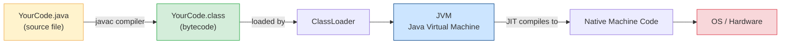

---

### A1.3 JDK, JRE, JVM — The Three Terms Explained

#### JDK — Java Development Kit

This is what **you install as a developer** to write Java code.

It contains:

- `javac` — the compiler that converts `.java` to `.class`
- `java` — the launcher that runs `.class` files on the JVM
- `javadoc`, `jar`, `jdb` and many other tools
- The **JRE** (included inside JDK)
- The standard library (collections, I/O, networking, etc.)

Node.js equivalent: Think of JDK as Node.js + npm + your TypeScript compiler bundled together.

#### JRE — Java Runtime Environment

This is what **end users need to run a Java application**.

It contains:

- The JVM
- The standard runtime libraries
- Does NOT contain `javac` (the compiler)

Node.js equivalent: Think of JRE as just the Node.js runtime without npm or the ability to transpile TypeScript.

> In modern Java (JDK 11+), the JRE is no longer distributed separately. You always install the JDK. But understanding the distinction matters conceptually.

#### JVM — Java Virtual Machine

This is the **actual engine** that runs your bytecode.

It is:

- Platform-specific (each OS has its own JVM impl)
- Responsible for memory management, garbage collection, thread management
- Where JIT (Just-In-Time) compilation happens

Node.js equivalent: The JVM is closest to the V8 engine, but it also handles memory like Node's process memory model, and Java gives you much more control over threading.

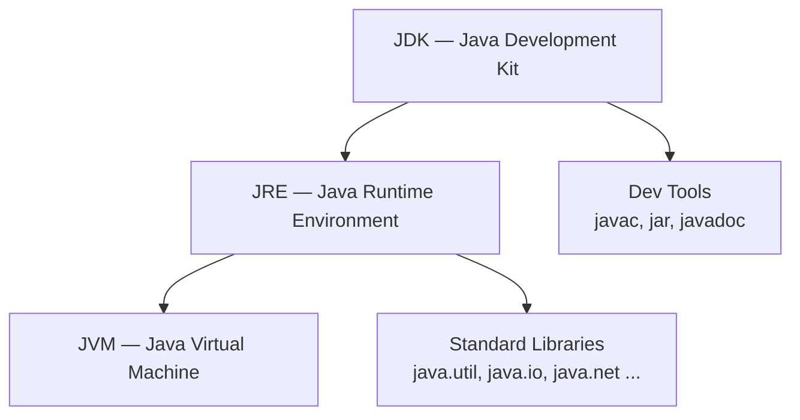

---

### A1.4 What is Bytecode?

When you compile a `.java` file, the output is a `.class` file containing **bytecode** — not native machine code, not source code.

Bytecode is an intermediate representation:

- Human-unreadable binary format
- Platform-independent
- Understood only by the JVM

This is why the Java slogan is **"Write Once, Run Anywhere"**. You compile once to bytecode, and any machine with a JVM can run it — Windows, Linux, macOS, cloud containers.

Node.js equivalent: There is no true equivalent. Node.js ships source or transpiled JS everywhere. Java ships `.jar` files (zipped `.class` files) which are portable.

---

### A1.5 What Happens Inside the JVM at Runtime?

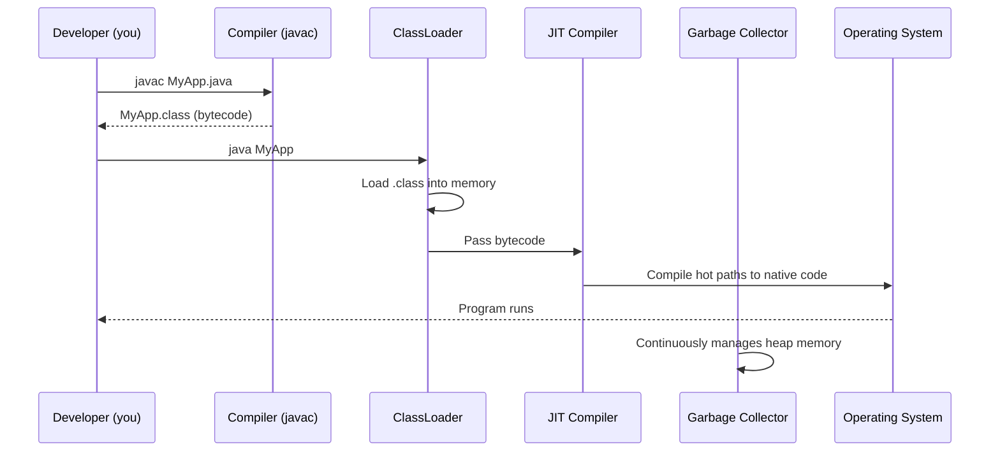

Three important JVM subsystems:

**ClassLoader**
Loads `.class` files into JVM memory at runtime. It handles:

- Bootstrap loading (core Java classes like `String`, `Object`)
- Application loading (your classes)

**JIT Compiler (Just-In-Time)**
The JVM doesn't interpret bytecode line by line forever. It detects "hot" code (methods called frequently) and compiles them to native machine code for much faster execution. This is why Java performance improves after warmup.

**Garbage Collector (GC)**
Java manages memory automatically. You don't `free()` memory like C, and you don't have to manage object lifecycle manually. The GC reclaims unreachable objects.

Node.js comparison: Node.js also has a GC (V8's mark-and-sweep). Java gives you more control via GC tuning flags and different GC strategies (G1GC, ZGC, Shenandoah).

---

### A1.6 JVM Memory Layout

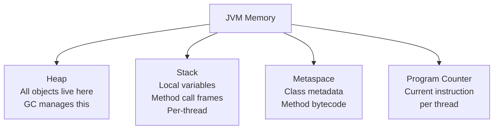

You don't need to manage this manually, but as you go deeper into Spring Boot you'll see:

- Memory settings: `-Xmx512m -Xms256m` (max/initial heap size)
- GC logs to diagnose memory issues
- `OutOfMemoryError` when heap is exhausted

---

### A1.7 First Java Program — Seeing the Flow in Action

```java
// File: Hello.java
public class Hello {
    public static void main(String[] args) {
        System.out.println("Hello from Java!");
    }
}
```

Compile and run manually (terminal):

```bash
# Compile — produces Hello.class
javac Hello.java

# Run — loads Hello.class into JVM
java Hello

# Output:
# Hello from Java!
```

What happened:

1. `javac Hello.java` — compiler checks syntax, types, and produces bytecode
2. `java Hello` — JVM loads `Hello.class`, finds the `main` method, runs it
3. `System.out.println(...)` — calls JVM's I/O subsystem to write to stdout

Node.js parallel:

```bash
# Node.js version (no compile step for plain JS)
node hello.js
```

```javascript
// hello.js
console.log("Hello from Node!");
```

The difference: any syntax/type error in Java is caught by `javac` before the program runs. In Node.js (plain JS), errors only appear at runtime.

---

### A1.8 Java Versions and LTS

| Version | Key Features                                     | Status                             |
| ------- | ------------------------------------------------ | ---------------------------------- |
| Java 8  | Lambdas, Streams, Optional                       | Old but still common in enterprise |
| Java 11 | `var`, HTTP client, no JRE separately            | LTS — very common                  |
| Java 17 | Records, sealed classes, better switch           | LTS — current standard             |
| Java 21 | Virtual threads (Project Loom), pattern matching | LTS — latest                       |

**Recommendation:** Use Java 17 or 21 for new projects. Spring Boot 3.x requires Java 17+.

Node.js parallel: Like moving from Node 12 → 18 → 20 LTS.

---

### A1.9 How Spring Boot Fits the JVM Picture

When you run a Spring Boot application:

```bash
java -jar myapp.jar
```

What happens:

1. JVM starts
2. Spring Boot's `main()` is called → `SpringApplication.run(...)`
3. Spring IoC container initializes, loads beans
4. Embedded Tomcat (or Jetty/Undertow) starts → HTTP server ready
5. Your app is live

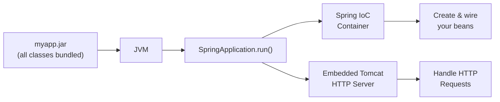

Node.js parallel: Like running `node server.js` where Express bootstraps, creates a middleware chain, and starts listening on a port — except Spring Boot auto-configures most of this from your classpath dependencies.

---

### A1.10 Mini Exercise

**Do this yourself:**

1. Install JDK 17: https://adoptium.net
2. Verify installation:
   ```bash
   java -version
   javac -version
   ```
3. Create `Hello.java` with the code from section 7.
4. Compile with `javac Hello.java`
5. Open the generated `Hello.class` in a hex editor or run:
   ```bash
   javap -c Hello.class
   ```
   You'll see the bytecode instructions — this is what the JVM actually executes.
6. Run with `java Hello` and confirm the output.

**Bonus:** Try introducing a syntax error (remove a semicolon) and re-run `javac`. Note the exact error message and line number — compare this to getting a surprise runtime error in JavaScript.

---

### A1.11 Quick Quiz

1. **What does `javac` produce?**

   - A) Native machine code
   - B) Bytecode in a `.class` file ✅
   - C) An executable `.exe` file
   - D) A `.jar` file directly

2. **Which tool do you need to RUN (not compile) a Java program on a server?**

   - A) JDK
   - B) JRE / JVM ✅
   - C) IDE
   - D) Maven

3. **Why can the same `.class` file run on Windows, Linux, and macOS?**

   - A) Java uses native code per platform
   - B) The JVM is platform-specific and abstracts the differences ✅
   - C) All OSes interpret `.class` files natively
   - D) Java programs are compiled separately for each OS

4. **What is the JIT compiler responsible for?**

   - A) Compiling `.java` source to bytecode
   - B) Converting frequently-run bytecode to native machine code at runtime ✅
   - C) Managing memory allocation
   - D) Loading classes from disk

5. **In Spring Boot, what starts the JVM?**
   - A) The browser
   - B) Tomcat launching first, then JVM
   - C) `java -jar myapp.jar` which launches JVM and then Spring ✅
   - D) Maven at build time

---

### A1.12 Common Mistakes & Debugging Tips

| Mistake                                  | What Happens                                                                | Fix                                                                     |
| ---------------------------------------- | --------------------------------------------------------------------------- | ----------------------------------------------------------------------- |
| Running `java Hello.java` (with `.java`) | `Error: Could not find or load main class Hello.java`                       | Use `java Hello` (no extension) after compiling                         |
| Forgetting to compile after editing      | Old behaviour runs, new code ignored                                        | Always `javac` before `java` (IDEs do this automatically)               |
| Wrong Java version installed             | `UnsupportedClassVersionError` at runtime                                   | Match JDK version: compile and run with same JDK; check `java -version` |
| `JAVA_HOME` not set                      | Build tools (Maven/Gradle) fail                                             | Set `JAVA_HOME` env variable to JDK directory                           |
| Class name ≠ file name                   | `javac` error: class X is public, should be declared in a file named X.java | Java enforces: `public class Foo` must be in `Foo.java`                 |

**How to read Java stack traces (you'll see these constantly):**

```
Exception in thread "main" java.lang.NullPointerException
    at com.example.MyService.process(MyService.java:42)   ← line 42 in MyService.java
    at com.example.Main.main(Main.java:10)                ← called from Main.java line 10
```

Read from top (what failed) downwards (how you got there). Most useful line is usually the first line inside YOUR code package (`com.example.*`).

---

### A1.13 Summary

> **What to remember from A1:**

| Concept     | One-line summary                                         |
| ----------- | -------------------------------------------------------- |
| JDK         | Everything you need to write + compile + run Java        |
| JRE         | Only what's needed to run (no compiler)                  |
| JVM         | The engine that runs bytecode; platform-specific         |
| Bytecode    | Compiled output of `.java`; not machine code, not source |
| `javac`     | Compiler: converts `.java` → `.class`                    |
| `java`      | Launcher: starts JVM and runs `.class`                   |
| JIT         | JVM optimisation: hot code → native code at runtime      |
| GC          | Automatic memory management inside JVM                   |
| Spring Boot | Runs as a standard `java -jar` process on the JVM        |

**Key mindset shift from Node.js:**

- Java has a mandatory compile step that catches many errors early
- "Write Once, Run Anywhere" means bytecode is portable across platforms
- The JVM is a sophisticated runtime — not just an interpreter

---

\*Next: **A2 — Java Project Structure, Packages, and Classpath\***
_Just say `A2` when you're ready!_

> [↑ Back to Index](#master-table-of-contents)

---

## A2. Java Project Structure, Packages & Classpath

> **Goal:** Understand how Java code is physically organized on disk, how the JVM finds it, and how a real Spring Boot project is laid out — before writing any significant code.
> Coming from Node.js, where a folder with a `package.json` and some `.js` files is enough to start, Java's structure feels formal at first. It actually solves real problems at scale.

---

### A2.1 How Java Projects Are Organized

In Node.js you might have:

```
my-app/
  src/
    routes/
    services/
  package.json
  index.js
```

In Java (with Maven), the structure is more prescribed:

```
my-app/
  src/
    main/
      java/          ← your Java source files
      resources/     ← config files, SQL scripts, templates
    test/
      java/          ← test source files
      resources/     ← test-specific config
  pom.xml            ← build descriptor (like package.json)
  target/            ← compiled output (like dist/ or build/)
```

This convention is followed by almost every Java project in the world.
Build tools (Maven, Gradle) depend on it. IDEs (IntelliJ, VS Code with Java extensions) understand it automatically.

**Why the strict layout matters:**

- Tools auto-discover source, resources, tests without configuration
- `src/main` vs `src/test` cleanly separates production and test code
- `target/` is always gitignored — it is regenerated on each build

---

### A2.2 Packages — Java's Module System

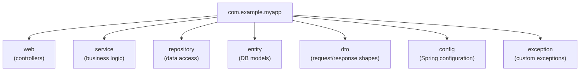

A **package** is Java's namespace mechanism. It:

- Groups related classes together
- Prevents naming conflicts (two libraries can both have a class called `User` if they're in different packages)
- Controls visibility (the `protected` and package-private access modifiers work across packages)
- Maps directly to folder structure on disk

**Package naming convention:**
Reversed domain name + project name + layer

```
com.yourcompany.projectname.layername
```

Examples from your workspace:

```
com.prash.curdpractice.controller
com.prash.curdpractice.service
com.prash.curdpractice.entity
com.prash.curdpractice.expections
```

**Declaring a package** — the first line of every Java file:

```java
package com.example.myapp.service;

public class UserService {
    // ...
}
```

**On disk, this file lives at:**

```
src/main/java/com/example/myapp/service/UserService.java
```

The folder path **must match** the package declaration. If they don't match, the compiler will error.

Node.js equivalent: Packages are similar to directory-based module namespacing in Node, except Java enforces the folder-to-package mapping at compile time. There is no `require` or `import` from a relative path — you import by fully-qualified class name.

---

### A2.3 The `import` Statement

To use a class from another package, you import it at the top of your file:

```java
package com.example.myapp.controller;

import com.example.myapp.service.UserService;   // import your own class
import org.springframework.web.bind.annotation.RestController;  // import Spring
import java.util.List;  // import from Java standard library

@RestController
public class UserController {
    private final UserService userService;
    // ...
}
```

Key rules:

- Classes in the **same package** don't need to be imported
- `java.lang.*` (String, Integer, System, etc.) is automatically imported
- Everything else needs an explicit `import`
- Wildcard imports (`import java.util.*`) work but are discouraged — be explicit

Node.js comparison:
| Node.js | Java |
|---------|------|
| `const UserService = require('./service/UserService')` | `import com.example.myapp.service.UserService;` |
| `import UserService from './service/UserService'` | Same Java import above |
| `const { List } = require('lodash')` | `import java.util.List;` |

The critical difference: Java imports **by fully-qualified class name**, not by file path. The JVM uses the classpath (not relative paths) to find classes.

---

### A2.4 Classpath — How the JVM Finds Your Classes

The **classpath** is a list of locations where the JVM looks for `.class` files.

Think of it as the Java equivalent of Node's `node_modules` resolution, but more explicit.

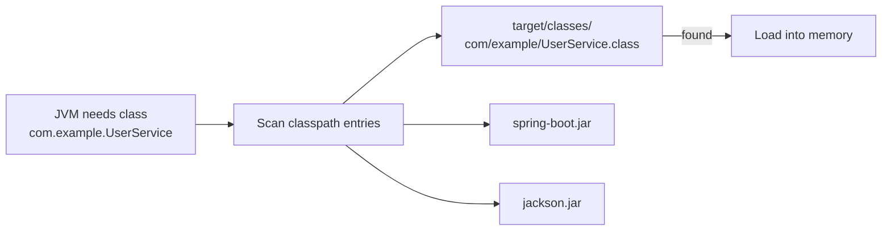

Classpath entries can be:

- A directory: `target/classes/`
- A `.jar` file: `spring-web-6.0.jar`
- A wildcard directory: `lib/*` (all jars in that folder)

**You almost never set the classpath manually** in modern projects. Maven or Gradle manage it. But understanding it helps when debugging:

- `ClassNotFoundException` — class not on classpath (missing dependency)
- `NoClassDefFoundError` — class was there at compile time, missing at runtime

Setting classpath manually (just to understand, not something you do daily):

```bash
# Compile with a dependency jar on the classpath
javac -cp mylib.jar MyApp.java

# Run with classpath including your output dir and dependency
java -cp target/classes:mylib.jar com.example.MyApp
```

---

### A2.5 Standard Maven Project Layout

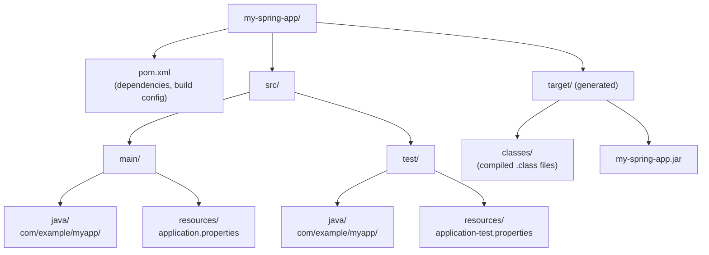

**`pom.xml` — the heart of a Maven project:**

```xml
<project>
    <groupId>com.example</groupId>      <!-- like npm scope: @example -->
    <artifactId>my-spring-app</artifactId>  <!-- like package name -->
    <version>1.0.0</version>
    <packaging>jar</packaging>

    <parent>
        <!-- Spring Boot parent provides default versions for all starters -->
        <groupId>org.springframework.boot</groupId>
        <artifactId>spring-boot-starter-parent</artifactId>
        <version>3.2.0</version>
    </parent>

    <dependencies>
        <!-- Like npm install express -->
        <dependency>
            <groupId>org.springframework.boot</groupId>
            <artifactId>spring-boot-starter-web</artifactId>
        </dependency>
    </dependencies>
</project>
```

Node.js comparison:
| `package.json` | `pom.xml` |
|---|---|
| `name` | `artifactId` |
| `version` | `version` |
| `dependencies` | `<dependencies>` |
| `devDependencies` | `<scope>test</scope>` dependencies |
| `scripts.start` | `spring-boot:run` Maven goal |
| `npm install` | `mvn dependency:resolve` |
| `npm run build` | `mvn package` |

---

### A2.6 What Is a JAR File?

A **JAR** (Java ARchive) is a ZIP file containing:

- Compiled `.class` files
- Resources (properties, templates)
- A `META-INF/MANIFEST.MF` file describing the archive

```bash
# Build a runnable Spring Boot JAR
mvn package

# What's inside (JAR is just a ZIP)
unzip -l target/my-spring-app.jar | head -30

# Run it
java -jar target/my-spring-app.jar
```

A Spring Boot **fat JAR** (also called an executable JAR or über-JAR) is special:

- It includes your compiled classes
- AND all dependency JARs embedded inside it
- The JVM can run it standalone with no other setup

Node.js comparison: Think of a fat JAR like a Docker image or a bundled Node app (e.g., output from `pkg` or `nexe`) — a single self-contained deliverable.

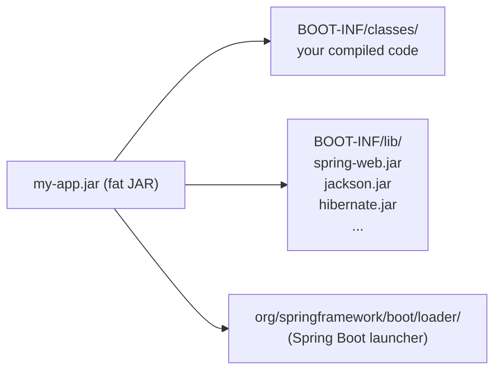

---

### A2.7 Spring Boot Project Layout in Practice

The recommended Spring Boot package structure for a real app:

```
src/main/java/com/example/myapp/
│
├── MyAppApplication.java          ← @SpringBootApplication — main entry point
│
├── controller/
│   └── UserController.java        ← @RestController, HTTP endpoints
│
├── service/
│   ├── UserService.java           ← interface (contract)
│   └── UserServiceImpl.java       ← implementation
│
├── repository/
│   └── UserRepository.java        ← extends JpaRepository
│
├── entity/
│   └── User.java                  ← @Entity, maps to DB table
│
├── dto/
│   ├── UserRequestDto.java        ← what client sends in
│   └── UserResponseDto.java       ← what you send back
│
├── exception/
│   ├── UserNotFoundException.java
│   └── GlobalExceptionHandler.java
│
└── config/
    └── SecurityConfig.java        ← Spring Security, CORS, etc.

src/main/resources/
├── application.properties         ← DB URL, port, log level, etc.
├── application-dev.properties     ← dev environment overrides
└── application-prod.properties    ← prod environment overrides
```

These are the same patterns used in examples throughout this guide:

- `com.prash.curdpractice` — controller, entity, exceptions
- `com.prash.Employee` — controller, service, dao, entity

---

### A2.8 Node.js vs Java Project Structure Comparison

| Concept          | Node.js / Express                     | Java / Spring Boot                                    |
| ---------------- | ------------------------------------- | ----------------------------------------------------- |
| Entry point      | `index.js` / `server.js`              | `MyAppApplication.java` with `main()`                 |
| Route handlers   | `routes/userRoutes.js`                | `controller/UserController.java`                      |
| Business logic   | `services/userService.js`             | `service/UserServiceImpl.java`                        |
| DB access        | `models/User.js` (Sequelize/Mongoose) | `repository/UserRepository.java` + `entity/User.java` |
| Config           | `.env` / `config.js`                  | `application.properties` / `application.yml`          |
| Dependencies     | `package.json`                        | `pom.xml`                                             |
| Install deps     | `npm install`                         | `mvn install` or `./mvnw install`                     |
| Run dev          | `npm run dev` / `nodemon`             | `./mvnw spring-boot:run`                              |
| Build output     | `dist/` (if bundled)                  | `target/myapp.jar`                                    |
| Test files       | `__tests__/` / `*.spec.js`            | `src/test/java/`                                      |
| Type definitions | TypeScript `.d.ts`                    | Java classes are inherently typed                     |

---

### A2.9 Mini Exercise

**Do this yourself:**

1. Create a new Spring Boot project or use any existing one, e.g. a project called `Employee-jpa`:
2. Navigate to `src/main/java/` and look at the folder hierarchy — notice how it maps to the package names.
3. Open `EmployeeApplication.java` and check the `package` declaration at the top.
4. Open `EmployeeController.java` — check its package, and look at the `import` statements. Which packages is it importing from?
5. Open `pom.xml` — find:
   - The `groupId`, `artifactId`, and `version`
   - The `spring-boot-starter-web` dependency
   - The `spring-boot-starter-data-jpa` dependency
6. **Bonus:** Run `./mvnw package` from the project root. Find the `.jar` file in `target/`. Try running it with `java -jar`.

---

### A2.10 Quick Quiz

1. **In Java, what does a `package` declaration at the top of a file tell the compiler?**

   - A) The version of Java to use
   - B) The namespace this class belongs to, which must match its folder path ✅
   - C) Which classes this file can access
   - D) The entry point method

2. **You see `ClassNotFoundException` at runtime. What's the most likely cause?**

   - A) A syntax error in your code
   - B) A class is missing from the classpath — likely a missing dependency ✅
   - C) The JVM crashed
   - D) The wrong Java version

3. **What is a Spring Boot fat JAR?**

   - A) A JAR with only your application classes
   - B) A JAR containing your classes AND all dependency JARs embedded inside it ✅
   - C) A JAR that requires a separate Tomcat server
   - D) A Docker container

4. **Where do you declare project dependencies in a Maven project?**

   - A) `settings.xml`
   - B) `build.gradle`
   - C) `pom.xml` ✅
   - D) `application.properties`

5. **In the Spring Boot project layout, where should your HTTP endpoint handlers live?**
   - A) `src/main/resources/`
   - B) `src/main/java/.../service/`
   - C) `src/main/java/.../controller/` ✅
   - D) `src/test/java/`

---

### A2.11 Common Mistakes & Debugging Tips

| Mistake                                                     | What Happens                                          | Fix                                                                                                       |
| ----------------------------------------------------------- | ----------------------------------------------------- | --------------------------------------------------------------------------------------------------------- |
| Package declaration doesn't match folder path               | `javac` error or IDE shows red underlines everywhere  | Make sure `package com.example.foo` is in `src/main/java/com/example/foo/YourClass.java`                  |
| Missing `import` for a class                                | `cannot find symbol` compile error                    | Add the import; your IDE can do this automatically with `Alt+Enter` / `⌥ Enter`                           |
| Wildcard import (`import java.util.*`) hiding a name clash  | Wrong class used silently                             | Use explicit imports; avoid wildcards                                                                     |
| Editing files in `target/` directly                         | Changes overwritten on next build                     | Always edit in `src/`; `target/` is build output                                                          |
| Running `mvn` without JDK set                               | `JAVA_HOME` errors or `javac not found`               | Set `JAVA_HOME` env variable and ensure `java` is on your `PATH`                                          |
| Two classes with the same simple name in different packages | Import ambiguity error                                | Use one fully-qualified name: `java.util.Date date = new java.util.Date();`                               |
| Forgetting `./mvnw` is the Maven wrapper                    | `command not found: mvn` even without Maven installed | Use `./mvnw` (included in Spring Initializr projects); it downloads the right Maven version automatically |

**Reading a `cannot find symbol` error:**

```
error: cannot find symbol
    UserService service = new UserService();
    ^
  symbol:   class UserService
  location: class com.example.controller.UserController
```

This means either:

- You forgot to `import com.example.service.UserService;`
- The class doesn't exist yet
- There's a typo in the class name

---

### A2.12 Summary

> **What to remember from A2:**

| Concept              | One-line summary                                                   |
| -------------------- | ------------------------------------------------------------------ |
| Package              | Namespace for a class; must match folder path on disk              |
| `import`             | Brings a class from another package into scope; never by file path |
| Classpath            | Where the JVM searches for `.class` files and JARs                 |
| `src/main/java`      | All your Java source code lives here                               |
| `src/main/resources` | Config files (`application.properties`, SQL, templates)            |
| `src/test/java`      | Test code, completely separate from production code                |
| `pom.xml`            | Maven's `package.json` — declares dependencies and build config    |
| JAR                  | A ZIP of compiled classes; fat JAR includes all dependencies       |
| `target/`            | Build output — always gitignored, never edit directly              |
| `./mvnw`             | Maven wrapper script included in every Spring Initializr project   |

**Key mindset shift from Node.js:**

- Java has no relative path imports — you import by fully-qualified class name
- The folder structure is not optional — package names must match directory layout
- One build artifact (JAR) is self-contained and portable across environments
- `pom.xml` is more verbose than `package.json` but far more powerful for large projects

---

\*Next: **A3 — Variables, Types, Type Casting, Primitives vs Wrappers\***
_Just say `A3` when you're ready!_

> [↑ Back to Index](#master-table-of-contents)

---

## A3. Variables, Types, Casting, Primitives vs Wrappers

> **Goal:** Understand Java's strict type system — the foundation of everything else.
> In JavaScript you have one `number` type and dynamic variables. Java has 8 primitive types, object references, explicit casting, and a wrapper class for each primitive.

---

### A3.1 Primitive Types

Java has exactly **8 primitive types** built into the language. They are not objects — they live on the stack, not the heap.

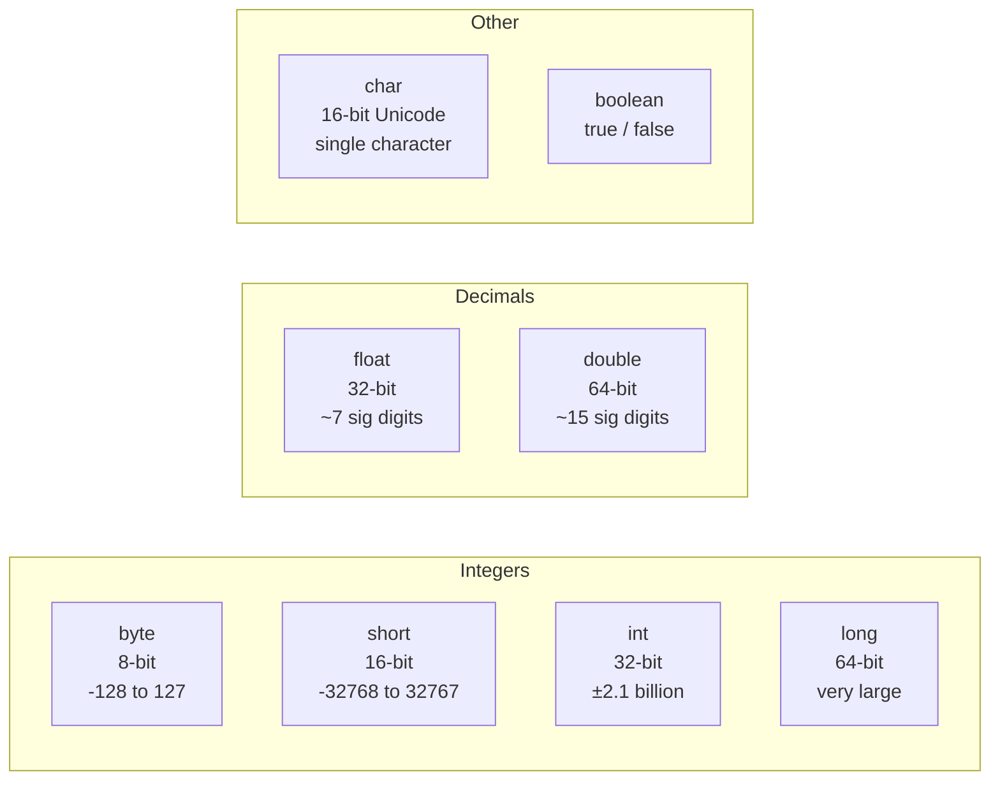

```java
byte    b = 100;
short   s = 30000;
int     i = 2_000_000;       // underscores allowed for readability
long    l = 9_000_000_000L;  // L suffix required for long literals
float   f = 3.14f;           // f suffix required
double  d = 3.14159265;      // default decimal type
char    c = 'A';             // single quotes for char
boolean flag = true;
```

Node.js comparison:

- JS `number` covers both `int` and `double` — Java separates them
- JS `BigInt` is closest to Java `long`
- JS `boolean` → Java `boolean` (same concept, different default handling of nullability)

---

**When to use which primitive — decision guide:**

| You need...                                                                 | Use                            | Why                                             |
| --------------------------------------------------------------------------- | ------------------------------ | ----------------------------------------------- |
| Whole numbers in everyday code (age, count, index)                          | `int`                          | Default integer type; fits most values          |
| Whole numbers that can exceed ±2.1 billion (file size, timestamps as epoch) | `long`                         | Larger range; suffix literals with `L`          |
| Decimal math where precision matters (money calculations)                   | **Neither** — use `BigDecimal` | `double` has floating-point rounding errors     |
| Decimal math where approximate precision is fine (physics, graphics)        | `double`                       | Default decimal type; more precise than `float` |
| Memory is extremely tight (large arrays of small values)                    | `byte` or `short`              | Rarely needed in application code               |
| Single text character                                                       | `char`                         | But `String` is almost always better            |
| Flags / toggles                                                             | `boolean`                      | Clearest intent                                 |

**Practical rule for integers:** Use `int` by default. Switch to `long` only when values can exceed ~2.1 billion (e.g., database IDs in high-scale systems, file sizes in bytes, millisecond timestamps).

**Practical rule for decimals:** Use `double` by default. **Never use `float` or `double` for money** — use `BigDecimal`:

```java
// WRONG — floating-point rounding error
double price = 0.1 + 0.2;  // 0.30000000000000004

// CORRECT for money
BigDecimal price = new BigDecimal("0.10").add(new BigDecimal("0.20")); // 0.30
```

**Default values** (for class fields, NOT local variables):

| Type                           | Default    |
| ------------------------------ | ---------- |
| `int`, `long`, `short`, `byte` | `0`        |
| `float`, `double`              | `0.0`      |
| `char`                         | `'\u0000'` |
| `boolean`                      | `false`    |
| Any reference type             | `null`     |

> Local variables have **no default** — you must initialise them before use or the compiler errors.

---

### A3.2 Reference Types

Everything that is not a primitive is a **reference type** — it stores a reference (pointer) to an object on the heap.

```java
String name = "Prashant";   // reference to a String object
int[]  nums = {1, 2, 3};    // reference to an array object
List<String> list = new ArrayList<>();  // reference to ArrayList
```

Key difference from primitives:

- Can be `null`
- Compared with `.equals()` for logical equality, not `==`
- Allocated on the heap, garbage collected

```java
String a = new String("hello");
String b = new String("hello");

System.out.println(a == b);        // false — different objects in memory
System.out.println(a.equals(b));   // true  — same content
```

---

### A3.3 Type Casting

**Widening (implicit)** — safe, no data loss, automatic:

```java
int i = 42;
long l = i;       // int → long: automatic
double d = i;     // int → double: automatic
```

**Narrowing (explicit)** — may lose data, requires cast operator:

```java
double pi = 3.14159;
int truncated = (int) pi;   // explicit cast — result: 3 (decimal dropped)

long bigNum = 123456789012L;
int small = (int) bigNum;   // may overflow and give wrong result
```

**Numeric promotion** — be aware of this:

```java
byte a = 10;
byte b = 20;
// byte c = a + b;   // COMPILE ERROR — arithmetic promotes to int
int c = a + b;       // correct
```

**String conversions:**

```java
// int → String
String s1 = String.valueOf(42);
String s2 = Integer.toString(42);
String s3 = "" + 42;           // works but less readable

// String → int
int n = Integer.parseInt("42");
double d = Double.parseDouble("3.14");
```

---

### A3.4 Wrapper Classes

Every primitive has a corresponding **wrapper class** — an object version of that primitive.

| Primitive | Wrapper Class |
| --------- | ------------- |
| `int`     | `Integer`     |
| `long`    | `Long`        |
| `double`  | `Double`      |
| `float`   | `Float`       |
| `boolean` | `Boolean`     |
| `char`    | `Character`   |
| `byte`    | `Byte`        |
| `short`   | `Short`       |

**Why wrappers exist:**

- Collections only work with objects: `List<Integer>`, not `List<int>`
- Useful static utility methods: `Integer.parseInt()`, `Integer.MAX_VALUE`
- Can represent `null` (primitive cannot)

---

**When to use primitive vs wrapper — decision guide:**

| Situation                                            | Use                       | Why                                          |
| ---------------------------------------------------- | ------------------------- | -------------------------------------------- |
| Local variable, method parameter, arithmetic         | `int`, `double`, etc.     | Faster, no boxing overhead, cannot be null   |
| Collection element: `List<?>`, `Map<?, ?>`, `Set<?>` | `Integer`, `Double`, etc. | Collections only accept objects              |
| Entity field that can be absent/unknown              | `Integer` (wrapper)       | Can be `null` to mean "not set"              |
| Entity field that always has a value                 | `int` (primitive)         | Prevents unintentional null                  |
| Generic type parameter: `<T>`                        | Wrapper                   | Java generics only work with reference types |
| Optional: `Optional<?>`                              | Wrapper                   | `Optional<int>` is invalid                   |

**Critical real-world scenario:** In a Spring Boot `@Entity`:

```java
@Entity
public class Product {
    // Use primitive — a product ALWAYS has a price (0.0 is valid)
    private double basePrice;

    // Use wrapper — a discount might not be set yet
    private Integer discountPercent;  // null = no discount configured
}
```

**Pitfall — NullPointerException from unboxing:**

```java
Integer boxed = null;
int primitive = boxed;  // NullPointerException at runtime!

// This also causes NPE:
Integer count = getCountFromDB();  // might return null
if (count > 0) {  // NPE if count is null — unboxing null
    process(count);
}

// Safe version:
if (count != null && count > 0) { ... }
// Or use Optional<Integer> from the repository
```

```java
List<Integer> list = new ArrayList<>();
list.add(42);          // autoboxing: int → Integer automatically

int val = list.get(0); // unboxing: Integer → int automatically
```

**Pitfall — NullPointerException from unboxing:**

```java
Integer boxed = null;
int primitive = boxed;  // NullPointerException at runtime!
```

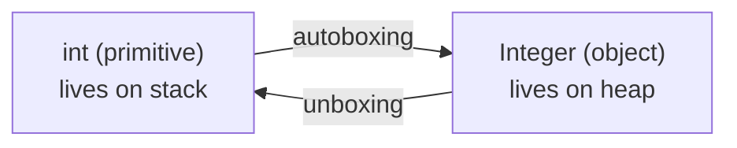

---

### A3.5 The `var` Keyword (Java 10+)

Since Java 10, you can use `var` for local variable type inference — the compiler infers the type from the right side:

```java
var name = "Prashant";      // inferred as String
var count = 42;             // inferred as int
var list = new ArrayList<String>();  // inferred as ArrayList<String>
```

`var` is NOT dynamic like JavaScript `let/const`. The type is still fixed at compile time — you just let the compiler figure it out.

```java
var x = 10;
x = "hello";   // COMPILE ERROR — x is int, cannot assign String
```

Use `var` to reduce verbosity, not everywhere. Avoid when the type isn't obvious from the right side.

---

### A3.6 Quick Quiz

1. **What is the default value of an `int` class field?** `0` ✅

2. **Why can't you use `List<int>` in Java?**

   - Collections require objects; `int` is a primitive. Use `List<Integer>` ✅

3. **What happens when you cast `double d = 3.99` to `int`?**

   - `3` — decimal part is truncated, NOT rounded ✅

4. **What is autoboxing?**

   - Automatic conversion from primitive (`int`) to wrapper (`Integer`) ✅

5. **Is `var` in Java dynamic typing like JavaScript?**
   - No — type is still fixed at compile time, just inferred from the initializer ✅

---

### A3.7 Summary

| Concept         | One-line summary                                           |
| --------------- | ---------------------------------------------------------- |
| Primitives      | 8 built-in types; live on stack; cannot be null            |
| Reference types | Everything else; live on heap; can be null                 |
| Widening cast   | Automatic; safe; no data loss                              |
| Narrowing cast  | Explicit `(type)` required; may lose data                  |
| Wrapper classes | Object version of each primitive; needed for collections   |
| Autoboxing      | Java auto-converts between primitive and wrapper           |
| `var`           | Type inference for local variables; still statically typed |

**Example — Widening and Narrowing Casting:**

```java
public class TypeCasting {
    public static void main(String[] args) {
        int a = 27;
        int b = a;       // copy
        long c = a;      // widening — int → long (automatic)

        float d = 5.6f;
        double e = d;    // widening — float → double (automatic)

        // narrowing — must cast explicitly
        double pi = 3.14;
        int piInt = (int) pi;   // → 3 (decimal truncated)

        System.out.println(a);   // 27
        System.out.println(c);   // 27
        System.out.println(e);   // 5.599999... (floating point)
        System.out.println(piInt); // 3
    }
}
```

**Example — BoolAndChar.java (char, Unicode, chained assignment):**

```java
public class BoolAndChar {
    public static void main(String[] args) {
        char x = 'X';      // char literal
        char y = 65;       // char from int (ASCII 65 = 'A')
        System.out.println("x = " + x + " and y = " + y);   // x = X and y = A
        System.out.println("x as int = " + (int) x);         // x as int = 88
        // chained assignment — all variables get the same value
        int a, b, c;
        System.out.println(a = b = c = 1); // prints 1
    }
}
```

**Example — Scanner Input (AddNumbers.java):**

```java
import java.util.Scanner;

public class AddNumbers {
    public static void main(String[] args) {
        Scanner in = new Scanner(System.in);
        System.out.println("Enter 2 numbers:");
        double a = in.nextDouble();
        double b = in.nextDouble();
        System.out.println("Sum of " + a + " and " + b + " = " + (a + b));
        in.close();
    }
}
```

**Example — Math with mixed types (AddIntAndFloatNum.java):**

```java
import java.util.Scanner;

public class AddIntAndFloatNum {
    public static void main(String[] args) {
        Scanner in = new Scanner(System.in);
        int numOne = in.nextInt();
        float numTwo = in.nextFloat();
        // int + float → float automatically (widening)
        float sum = numOne + numTwo;
        System.out.println(sum);
    }
}
```

**Example — Operators: SecondsToMinutes.java (division + modulo):**

```java
import java.util.Scanner;

public class SecondsToMinutes {
    public static void main(String[] args) {
        Scanner in = new Scanner(System.in);
        System.out.println("Enter Seconds:");
        int sec = in.nextInt();
        int min    = sec / 60;   // integer division — drops remainder
        int remSec = sec % 60;   // modulo — remainder after division
        System.out.println("Minutes: " + min);
        System.out.println("Remaining Seconds: " + remSec);
    }
}
```

**Example — Compound operators (Compound.java):**

```java
public class Compound {
    public static void main(String[] args) {
        int val = 3;
        val += 3.5;             // compound assignment — auto-narrowing: val = 3 + 3 = 6 (truncated)
        System.out.println(val); // 6
        char c = '\u0041';       // Unicode escape for 'A'
        System.out.println(c);   // A
    }
}
```

**Example — AreaOfTriangle.java (Math library):**

```java
import java.util.Scanner;

public class AreaOfTriangle {
    public static void main(String[] args) {
        Scanner in = new Scanner(System.in);
        System.out.println("Enter 3 sides of Triangle:");
        float a = in.nextFloat(), b = in.nextFloat(), c = in.nextFloat();
        float s = (a + b + c) / 2;    // semi-perimeter
        // Heron's formula — Math.sqrt returns double
        System.out.println("Area: " + Math.sqrt(s * (s-a) * (s-b) * (s-c)));
    }
}
```

> [↑ Back to Index](#master-table-of-contents)

---

## A4. Strings, Immutability, StringBuilder

> **Goal:** Understand how Java handles text — which looks familiar but has important differences in memory and mutability.

---

### A4.1 String Basics

```java
String name = "Prashant";           // string literal — from string pool
String name2 = new String("Prashant"); // new object on heap (avoid this)

int len = name.length();            // 8
char first = name.charAt(0);        // 'P'
String upper = name.toUpperCase();  // "PRASHANT"
boolean starts = name.startsWith("Pra"); // true
```

**String is a class**, not a primitive — but it has special syntax support (double quotes).

---

### A4.2 Immutability

**Strings in Java are immutable** — once created, the content never changes. Every "modification" creates a new object.

```java
String s = "hello";
s = s.toUpperCase();   // s now points to a NEW String "HELLO"
                       // original "hello" is abandoned (eligible for GC)
```

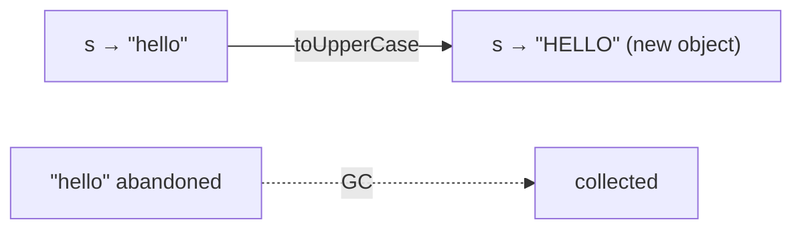

**Why immutability matters:**

- Thread-safe by default — multiple threads can read same String safely
- Enables the String Pool — JVM can share identical string literals
- Predictable — calling a method never mutates the original

**String Pool:**

```java
String a = "hello";
String b = "hello";
System.out.println(a == b);   // true — same object from pool!

String c = new String("hello");
System.out.println(a == c);   // false — different object
System.out.println(a.equals(c)); // true — same content
```

> **Rule:** Always compare Strings with `.equals()`, never `==`.

---

### A4.3 Common String Methods

```java
String s = "  Hello, World!  ";

s.trim()                    // "Hello, World!"  — remove leading/trailing spaces
s.strip()                   // same, Unicode-aware (Java 11+, prefer this)
s.toLowerCase()             // "  hello, world!  "
s.toUpperCase()             // "  HELLO, WORLD!  "
s.contains("World")         // true
s.replace("World", "Java")  // "  Hello, Java!  "
s.split(", ")               // ["  Hello", "World!  "]
s.substring(2, 7)           // "Hello"
s.indexOf("World")          // 9
s.isEmpty()                 // false
s.isBlank()                 // false (Java 11+: checks whitespace-only too)
s.startsWith("  H")        // true
s.endsWith("!  ")           // true

// String.join — like JS array.join
String joined = String.join(", ", "a", "b", "c");  // "a, b, c"

// repeat (Java 11+)
"ab".repeat(3)              // "ababab"
```

---

### A4.4 StringBuilder — Mutable String Building

When you need to build strings in a loop or from many parts, use `StringBuilder`:

```java
// BAD — creates a new String object in every iteration
String result = "";
for (int i = 0; i < 1000; i++) {
    result += i;    // creates 1000 intermediate String objects
}

// GOOD — StringBuilder mutates in place
StringBuilder sb = new StringBuilder();
for (int i = 0; i < 1000; i++) {
    sb.append(i);
}
String result = sb.toString();
```

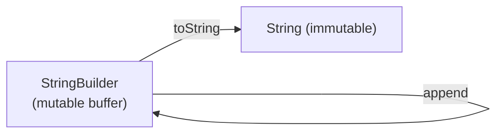

Common `StringBuilder` methods:

```java
StringBuilder sb = new StringBuilder("Hello");
sb.append(", World");    // "Hello, World"
sb.insert(5, "!");       // "Hello!, World"
sb.delete(5, 6);         // "Hello, World"
sb.reverse();            // "dlroW ,olleH"
sb.length();             // current length
sb.toString();           // convert to String
```

Node.js comparison:

- JS strings are also immutable — template literals (`${}`) or `Array.join()` solve the same problem
- Java's `StringBuilder` is equivalent to pushing to an array then joining

---

### A4.5 String.format and Text Blocks

```java
// String.format — like printf
String msg = String.format("Hello, %s! You are %d years old.", "Prashant", 25);

// String.formatted() — Java 15+ (cleaner)
String msg2 = "Hello, %s! You are %d years old.".formatted("Prashant", 25);

// Text Blocks — Java 15+ (like JS template literals)
String json = """
        {
          "name": "Prashant",
          "age": 25
        }
        """;
```

| Format specifier | Meaning                     |
| ---------------- | --------------------------- |
| `%s`             | String                      |
| `%d`             | Integer                     |
| `%f`             | Float/Double                |
| `%.2f`           | Float with 2 decimal places |
| `%n`             | Newline                     |
| `%b`             | Boolean                     |

---

### A4.6 Quick Quiz

1. **Why should you use `.equals()` instead of `==` to compare Strings?** — `==` compares references (memory addresses); `.equals()` compares content ✅
2. **What does immutability mean for String?** — Once created, the character sequence never changes; operations return new strings ✅
3. **When should you use `StringBuilder` instead of `+`?** — When concatenating in a loop or building from many parts — avoids creating many intermediate objects ✅
4. **What is the String Pool?** — JVM cache of string literals; same literal value reuses the same object ✅

---

### A4.7 Summary

| Concept         | One-line summary                                            |
| --------------- | ----------------------------------------------------------- |
| `String`        | Immutable, from pool when literal; compare with `.equals()` |
| Immutability    | Operations return new strings; original unchanged           |
| `StringBuilder` | Mutable buffer; use for building strings efficiently        |
| `String.format` | printf-style formatting                                     |
| Text blocks     | Multi-line strings with `"""` (Java 15+)                    |

**Example — Strings.java:**

```java
public class Strings {
    public static void main(String[] a) {
        // String is a class — stored in the String Pool
        // Immutable — every operation creates a new String
        String name = "Prashant";
        System.out.println("hello " + name);        // concatenation
        System.out.println(name.hashCode());        // pool hash
        System.out.println(name.charAt(1));         // 'r'
        System.out.println(name.concat(" Mudhiraj")); // new string

        // Mutable String — use when building inside a loop
        // StringBuffer  = thread-safe (synchronized)
        // StringBuilder = NOT thread-safe (faster for single-threaded)
        StringBuffer sb = new StringBuffer("Prashant");
        sb.append(" Chevula");
        System.out.println(sb);  // Prashant Chevula
    }
}
```

**Example — AllStringMethods.java (complete String method reference):**

```java
public class AllStringMethods {
    public static void main(String[] args) {
        String name = "Prashant";
        String lastName = " Mudhiraj";

        // concat — returns new String (original unchanged)
        System.out.println(name.concat(lastName));  // Prashant Mudhiraj
        System.out.println(name);                   // Prashant (unchanged)

        // replace — returns new String
        String newName = name.replace("a", "ant");
        System.out.println(newName); // Prantshantnt
        System.out.println(name);    // Prashant (unchanged)

        // equals vs == — ALWAYS use .equals() for content comparison
        String name2 = new String("Prashant");      // different object
        System.out.println(name.equals(name2));     // true (content same)
        System.out.println(name == name2);          // false (different objects)

        System.out.println(name2.indexOf('r'));     // 2 (first occurrence)
        System.out.println(name2.charAt(3));        // 's'
        System.out.println(name.substring(3, 7));   // "shan"

        // split — returns String array
        String s1 = "Prashant#started#Learning";
        String[] words = s1.split("#");
        for (Object word : words) System.out.print(word + " "); // Prashant started Learning
        System.out.println();

        // trim — removes leading/trailing whitespace
        String s2 = "   Mudhiraj.     ".trim();
        System.out.println(s2); // Mudhiraj.

        // StringBuilder — mutable, efficient for building strings
        StringBuilder s4 = new StringBuilder("Java Programming");
        s4.append(" classes");
        s4.reverse();
        System.out.println(s4); // sessalc gnimmargorP avaJ
    }
}
```

> [↑ Back to Index](#master-table-of-contents)

---

## A5. Operators, Control Flow, Loops, Switch

> **Goal:** Cover Java syntax for decision-making and iteration — very familiar from JS, with a few differences.

---

### A5.1 Operators

```java
// Arithmetic
int a = 10 + 3;   // 13
int b = 10 - 3;   // 7
int c = 10 * 3;   // 30
int d = 10 / 3;   // 3  (integer division — truncates!)
int e = 10 % 3;   // 1  (modulo)

// Watch out:
double result = 10 / 3;       // 3.0 — both operands are int, division is int
double correct = 10.0 / 3;    // 3.333... — at least one must be double

// Compound assignment
int x = 5;
x += 3;   // x = 8
x -= 2;   // x = 6
x *= 4;   // x = 24
x /= 6;   // x = 4
x %= 3;   // x = 1

// Increment/Decrement
x++;   // post-increment
++x;   // pre-increment
x--;   // post-decrement

// Comparison
x == 5     // equality (use .equals() for objects!)
x != 5     // not equal
x > 5      // greater than
x >= 5     // greater than or equal
x < 5
x <= 5

// Logical
true && false   // false — AND
true || false   // true  — OR
!true           // false — NOT

// Ternary
String label = (x > 0) ? "positive" : "non-positive";

// Bitwise (less common in application code)
x & 3    // bitwise AND
x | 3    // bitwise OR
x ^ 3    // bitwise XOR
x << 1   // left shift (multiply by 2)
x >> 1   // right shift (divide by 2)
```

---

### A5.2 if / else

```java
int score = 85;

if (score >= 90) {
    System.out.println("A grade");
} else if (score >= 80) {
    System.out.println("B grade");   // this runs
} else if (score >= 70) {
    System.out.println("C grade");
} else {
    System.out.println("Below C");
}
```

Same as JavaScript — no surprises here.

---

### A5.3 Switch Expressions (Classic and Modern)

**Classic switch (Java 1+):**

```java
int day = 3;
switch (day) {
    case 1:
        System.out.println("Monday");
        break;   // MUST include break or it falls through!
    case 2:
        System.out.println("Tuesday");
        break;
    case 3:
        System.out.println("Wednesday");
        break;
    default:
        System.out.println("Other");
}
```

**Switch expression (Java 14+) — preferred:**

```java
// Arrow syntax — no fall-through, no break needed
String dayName = switch (day) {
    case 1 -> "Monday";
    case 2 -> "Tuesday";
    case 3 -> "Wednesday";
    case 4, 5 -> "Thu or Fri";    // multiple labels
    default -> "Weekend";
};
```

Node.js comparison: Java's modern `switch` expressions are cleaner than JS `switch` statements. The `->` syntax eliminates the classic fall-through gotcha.

---

### A5.4 Loops

```java
// for loop
for (int i = 0; i < 5; i++) {
    System.out.println(i);   // 0,1,2,3,4
}

// while loop
int count = 0;
while (count < 5) {
    System.out.println(count++);
}

// do-while — runs at least once
int n = 0;
do {
    System.out.println(n++);
} while (n < 3);

// break and continue work like JS
for (int i = 0; i < 10; i++) {
    if (i == 5) break;      // stop loop
    if (i % 2 == 0) continue; // skip even numbers
    System.out.println(i);  // prints 1, 3
}
```

---

**When to use which loop — decision guide:**

| Situation                                                    | Best loop                               | Why                                               |
| ------------------------------------------------------------ | --------------------------------------- | ------------------------------------------------- |
| Known number of iterations (index-based)                     | `for (int i = 0; i < n; i++)`           | Clear intent; counter is part of the syntax       |
| Iterating all elements of a collection or array              | `for (T item : collection)` (for-each)  | Most readable; no index management                |
| Keep looping until a condition becomes false (unknown count) | `while`                                 | Reads as "while this is true, keep going"         |
| Execute at least once, then check condition                  | `do-while`                              | User input retry, menu systems                    |
| Transforming / filtering a collection                        | Stream API (`filter`, `map`)            | Functional style; returns new data                |
| Need the index while iterating                               | `for (int i = 0; i < list.size(); i++)` | for-each doesn't give you the index               |
| Removing elements while iterating                            | `Iterator` with `.remove()`             | for-each throws `ConcurrentModificationException` |

**When NOT to use certain loops:**

```java
// DON'T use classic for when iterating a whole collection — use for-each
for (int i = 0; i < names.size(); i++) {   // verbose
    System.out.println(names.get(i));
}
// DO this instead
for (String name : names) {                 // clean
    System.out.println(name);
}

// DON'T use while when count is known — it hides the intent
int i = 0;
while (i < 10) { ...; i++; }  // this is just a disguised for loop

// DO use while for truly conditional loops
while (!queue.isEmpty()) {
    processItem(queue.poll());
}

// DO-WHILE real use case: prompt user until valid input
String input;
do {
    input = scanner.nextLine();
} while (input.isBlank());  // always ask at least once
```

---

### A5.5 Enhanced For-Each Loop

The most common loop in Java application code:

```java
List<String> names = List.of("Prashant", "Rahul", "Anil");

for (String name : names) {
    System.out.println(name);
}

// arrays too
int[] nums = {1, 2, 3, 4, 5};
for (int num : nums) {
    System.out.println(num);
}
```

Node.js comparison: `for (const name of names)` — almost identical.

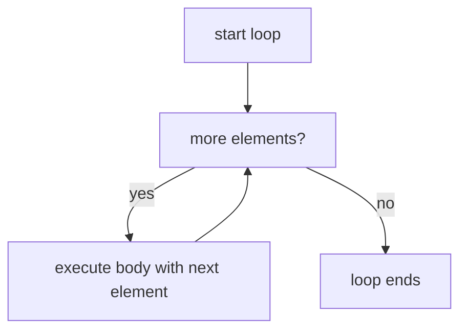

---

### A5.6 Quick Quiz

1. **What does `10 / 3` produce in Java?** — `3` (integer division, not `3.333...`) ✅
2. **What is the main risk with classic `switch` statements?** — Fall-through: forgetting `break` executes all following cases ✅
3. **What is the Java equivalent of JS `for...of` loop?** — Enhanced for-each: `for (Type item : collection)` ✅
4. **How is `x++` different from `++x`?** — `x++` returns old value then increments; `++x` increments then returns new value ✅

---

### A5.7 Summary

| Concept           | Java                            | JS equivalent            |
| ----------------- | ------------------------------- | ------------------------ |
| Integer division  | `10 / 3 = 3`                    | `Math.floor(10/3)`       |
| Ternary           | `cond ? a : b`                  | Same                     |
| for-each          | `for (T x : collection)`        | `for (const x of array)` |
| Modern switch     | `switch (x) { case 1 -> "a"; }` | No direct equivalent     |
| `&&`, `\|\|`, `!` | Same as JS                      | Same                     |

**Example — ConditionalStatements.java:**

```java
public class ConditionalStatements {
    public static void main(String[] args) {
        int x = 1;

        // if / else if / else
        if (x >= 9) {
            System.out.println("Executed if block");
        } else if (x == 8) {
            System.out.println("Executed else if block");
        } else {
            System.out.println("Executed else block"); // ← prints this
        }

        // Ternary operator
        String result = x % 2 == 0 ? "Even" : "Odd";
        System.out.println(result); // Odd

        // Switch (classic)
        switch (x) {
            case 1:  System.out.println("Case 1"); break;
            case 2:  System.out.println("Case 2"); break;
            default: break;
        }
    }
}
```

**Example — Loops.java:**

```java
public class Loops {
    public static void main(String[] args) {
        // while loop
        int i = 0;
        while (i < 5) {
            System.out.println("while: " + i);
            i++;
        }

        // do-while — runs body at least once
        int j = 0;
        do {
            System.out.println("do-while: " + j);
            j++;
        } while (j < 3);

        // for loop
        for (int k = 0; k < 4; k++) {
            System.out.println("for: " + k);
        }
    }
}
```

**Example — NestedIf.java (dangling else — tricky!):**

```java
public class NestedIf {
    public static void main(String[] args) {
        int i = 10, j = 6, k = 2;
        // Tricky! The else binds to the NEAREST if (inner if), not the outer if
        if (i > j)
            if (i > k)
                System.out.println('A');   // prints A
        else                               // ← this else belongs to (i > k), NOT to (i > j)
            System.out.println('B');
        // Always use braces {} to avoid this ambiguity
    }
}
```

> [↑ Back to Index](#master-table-of-contents)

---

## A6. Methods, Overloading, Varargs

> **Goal:** Understand how Java defines and calls reusable code blocks — "functions" in Java are always methods belonging to a class.

---

### A6.1 Method Anatomy

```java
//    access  return  name     parameters
public  int  add(int a, int b) {
    return a + b;    // must return int (or compiler errors)
}

// void = no return value (like JS function returning undefined)
public void printGreeting(String name) {
    System.out.println("Hello, " + name);
}

// static method — belongs to class, not instance
public static double circleArea(double radius) {
    return Math.PI * radius * radius;
}
```

Every part of the signature matters:

- **Access modifier** (`public`, `private`, etc.) — who can call this
- **Return type** — what comes back (`void` = nothing)
- **Method name** — camelCase by convention
- **Parameters** — typed; cannot be omitted or freely reordered

Node.js comparison:

```javascript
// JS — no return type declaration
function add(a, b) {
  return a + b;
}

// TS — closer to Java
function add(a: number, b: number): number {
  return a + b;
}
```

---

### A6.2 Method Overloading

**Overloading** = multiple methods with the same name but different parameter types or counts (NOT return type alone):

```java
class Calculator {
    int add(int a, int b)       { return a + b; }
    double add(double a, double b) { return a + b; }
    int add(int a, int b, int c) { return a + b + c; }
    // double add(int a, int b)  // ERROR — same params as first, only return type differs
}

Calculator calc = new Calculator();
calc.add(1, 2);        // calls int version
calc.add(1.0, 2.0);    // calls double version
calc.add(1, 2, 3);     // calls 3-arg version
```

The compiler picks the right version at **compile time** based on the argument types. This is called **static dispatch**.

---

**When to overload vs use a different method name:**

Overloading is appropriate when all versions of the method are doing **conceptually the same thing** just with different input types or different levels of detail:

```java
// GOOD overloading — all versions do the "same thing"
log(String message)                     // basic log
log(String message, LogLevel level)     // log with level
log(String message, Throwable cause)    // log with exception

// BAD overloading — these do different things; name them differently
save(User user)       // saves to DB
save(File file)       // saves to disk — confusing! use saveToFile() instead
```

**When to prefer overloading:**

- Different parameter types for the same operation (`print(int)`, `print(double)`, `print(String)`)
- Optional parameters — Java has no default parameter values like JS, so overloading fills the gap
- Builder-like convenience variants: `LocalDate.of(year, month, day)`, `LocalDate.of(year, Month.MARCH, day)`

**When NOT to overload:**

- When the operations are semantically different — use distinct names
- When it would confuse callers about which version gets called
- When you just want optional parameters with complex logic — use a Builder pattern instead

**Practical Spring Boot example — overloading for convenience:**

```java
@Service
public class EmailService {
    // Full version
    public void sendEmail(String to, String subject, String body, boolean isHtml) { ... }

    // Convenience overloads — build on the full version
    public void sendEmail(String to, String subject, String body) {
        sendEmail(to, subject, body, false);  // plain text default
    }

    public void sendWelcomeEmail(String to) {
        sendEmail(to, "Welcome!", "Thanks for signing up.", true);
    }
}
```

---

### A6.3 Varargs

Varargs lets you pass a variable number of arguments of the same type:

```java
public int sum(int... numbers) {
    int total = 0;
    for (int n : numbers) total += n;
    return total;
}

sum(1, 2)          // 3
sum(1, 2, 3)       // 6
sum(1, 2, 3, 4, 5) // 15
sum()              // 0 — zero args also valid
```

Inside the method, `numbers` is just an array. Rules:

- Varargs must be the **last** parameter
- Only one varargs parameter per method
- You can pass an array directly: `sum(new int[]{1, 2, 3})`

---

### A6.4 Pass By Value

Java is **always pass by value** — but for objects, the value is the reference.

```java
void doubleIt(int x) {
    x = x * 2;   // only affects local copy
}

int num = 5;
doubleIt(num);
System.out.println(num);  // still 5 — primitive was copied

// For objects — the reference is copied, but you CAN mutate the object through it
void addItem(List<String> list) {
    list.add("new item");  // mutates the SAME object
}

List<String> myList = new ArrayList<>();
addItem(myList);
System.out.println(myList.size());  // 1 — list was mutated
```

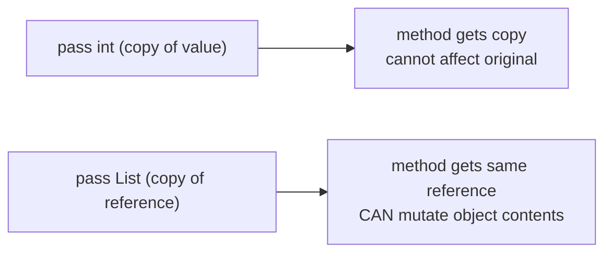

---

### A6.5 Quick Quiz

1. **Can two methods have the same name and same parameters but different return types?** — No, that's not valid overloading ✅
2. **What does `void` mean?** — The method returns nothing ✅
3. **In `sum(int... numbers)`, what type is `numbers` inside the method?** — `int[]` (an array) ✅
4. **If you pass an `int` to a method and change it inside, does the original change?** — No — primitives are passed by value (copied) ✅

---

### A6.6 Summary

| Concept       | One-line summary                                                       |
| ------------- | ---------------------------------------------------------------------- |
| Method        | Named block of code with typed parameters and return type              |
| `void`        | Method that returns nothing                                            |
| Overloading   | Same name, different parameter types/count — compiler picks right one  |
| Varargs `...` | Accept variable # of args; receiver sees an array                      |
| Pass by value | Primitives copied; objects: reference copied but object can be mutated |

**Example — Varargs.java (variable number of arguments):**

```java
public class Varargs {
    // String... creates an array: n is String[] inside the method
    // Can accept 0, 1, or many arguments
    public static void names(String... n) {
        for (String val : n) System.out.print(val + " ");
        System.out.println();
    }

    public static void main(String[] args) {
        names("Prashant");                        // 1 arg
        names("Prashant1", "Prashant2");          // 2 args
        names("Prashant1", "Prashant2", "Prashant3"); // 3 args
        // all valid — same method signature
    }
}
```

**Example — Arrays (Basics.java) — pass by reference vs pass by value:**

```java
import java.util.Arrays;

public class ArrayBasics {
    public static void main(String[] args) {
        int[] a = {2, 4, 6, 8, 10};

        // Arrays utility methods
        System.out.println(Arrays.toString(a));             // [2, 4, 6, 8, 10]
        System.out.println(Arrays.binarySearch(a, 8));      // 3 (index)
        System.out.println(Arrays.toString(
            Arrays.copyOfRange(a, 1, 4)));                  // [4, 6, 8]

        // Passing array to method — the REFERENCE is passed
        // Modifying array inside method changes original!
        for (int i = 0; i < a.length; i++) modifyByReference(a, i);
        System.out.println(Arrays.toString(a));             // [4, 8, 12, 16, 20]
    }

    // Primitives passed to method get COPIED — original never changes
    // public static void modify(int m) { m = m * 2; } // no effect on original

    // Arrays are objects — reference passed — modifies original
    public static void modifyByReference(int[] arr, int index) {
        arr[index] = arr[index] * 2;
    }
}
```

**Example — Multidimensional Arrays (Multidimentional.java):**

```java
import java.util.Arrays;
import java.util.Scanner;

public class Multidimensional {
    public static void main(String[] args) {
        int[][] a = new int[3][3];   // 3x3 2D array
        Scanner in = new Scanner(System.in);

        // fill via nested loops
        for (int i = 0; i < a.length; i++) {
            for (int j = 0; j < a[i].length; j++) {
                a[i][j] = in.nextInt();
            }
            System.out.println(Arrays.toString(a[i])); // print each row
        }
    }
}
```

**Example — Runtime Array Assignment (RuntimeAssignment.java):**

```java
import java.util.Scanner;

public class RuntimeAssignment {
    public static void main(String[] args) {
        Scanner input = new Scanner(System.in);
        int[] a = new int[5];   // size fixed at declaration

        for (int i = 0; i < a.length; i++) a[i] = input.nextInt();
        System.out.println("--------------");
        for (int val : a) System.out.println(val);
    }
}
```

> [↑ Back to Index](#master-table-of-contents)

---

## A7. Classes & Objects, Constructors, this, static

> **Goal:** Master Java's core OOP building blocks — classes as blueprints and objects as instances.

---

### A7.1 Classes and Objects

```java
// Class = blueprint
public class User {
    // Fields (state)
    private String name;
    private int age;

    // Constructor
    public User(String name, int age) {
        this.name = name;
        this.age = age;
    }

    // Method (behaviour)
    public String greet() {
        return "Hi, I'm " + name + " and I'm " + age;
    }

    // Getters
    public String getName() { return name; }
    public int getAge()     { return age; }
}

// Object = instance
User user1 = new User("Prashant", 25);
User user2 = new User("Rahul", 30);

System.out.println(user1.greet());  // "Hi, I'm Prashant and I'm 25"
System.out.println(user2.getName()); // "Rahul"
```

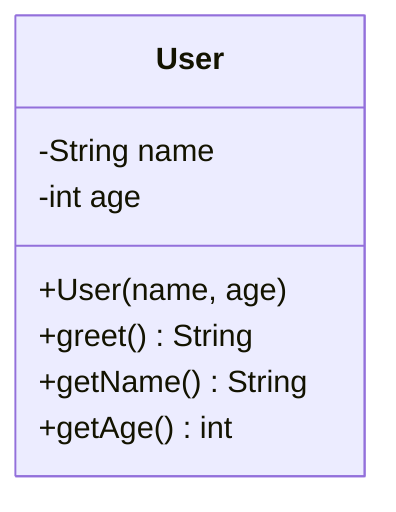

---

### A7.2 Constructors

A constructor is a special method called when creating an object with `new`:

```java
public class Product {
    private String name;
    private double price;

    // Default constructor (no args)
    public Product() {
        this.name = "Unknown";
        this.price = 0.0;
    }

    // Parameterized constructor
    public Product(String name, double price) {
        this.name = name;
        this.price = price;
    }

    // Constructor calling another constructor with this()
    public Product(String name) {
        this(name, 0.0);   // delegates to the 2-arg constructor
    }
}
```

Rules:

- Same name as the class
- No return type (not even `void`)
- If you define no constructor, Java provides a default no-arg one
- If you define any constructor, the default disappears

---

### A7.3 The `this` Keyword

`this` refers to the current object instance:

```java
public class Employee {
    private String name;

    public Employee(String name) {
        this.name = name;   // this.name = field; name = parameter
    }

    public void printSelf() {
        System.out.println(this);  // prints object's toString()
    }

    public Employee withName(String name) {
        this.name = name;
        return this;         // method chaining pattern
    }
}
```

Node.js comparison: Exactly like `this` in a class method in JavaScript — refers to the current instance.

---

### A7.4 The `static` Keyword

`static` means the member belongs to the **class**, not an instance:

```java
public class MathUtils {
    // static field — shared across ALL instances
    public static final double PI = 3.14159;

    // static method — call without creating an object
    public static int square(int n) {
        return n * n;
    }

    // instance method — needs an object
    public double computeArea(double radius) {
        return PI * radius * radius;
    }
}

// Usage
int result = MathUtils.square(5);    // 25 — no object needed
double area = MathUtils.PI * 4;      // access static field directly
```

**When to use static:**

- Utility methods that don't need instance state (`Math.abs()`, `Collections.sort()`)
- Constants: `public static final String VERSION = "1.0"`
- Factory methods: `LocalDate.of(2020, 1, 1)`

**What NOT to do with static in Spring Boot:**

- Don't store mutable state in static fields in singleton beans — multiple requests share it → race conditions

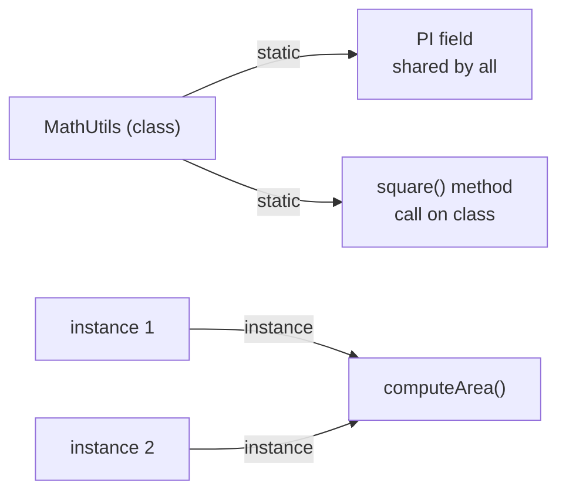

---

### A7.5 Records (Java 16+)

Records are a concise way to create immutable data-holder classes — like TypeScript interfaces with guaranteed immutability:

```java
// Before records — lots of boilerplate
public class Point {
    private final int x;
    private final int y;
    public Point(int x, int y) { this.x = x; this.y = y; }
    public int x() { return x; }
    public int y() { return y; }
    // plus equals, hashCode, toString...
}

// With records — one line
public record Point(int x, int y) {}

// Usage
Point p = new Point(3, 4);
System.out.println(p.x());       // 3
System.out.println(p);           // Point[x=3, y=4] — toString auto-generated
```

Records are great for DTOs in Spring Boot.

---

### A7.6 Quick Quiz

1. **What happens if you define a parameterized constructor but no default constructor?** — `new MyClass()` (no-arg) will fail to compile ✅
2. **What does `this.name = name` do in a constructor?** — Assigns the parameter `name` to the instance field `name` ✅
3. **Can a `static` method access instance fields?** — No — static methods have no `this` reference ✅
4. **What are Java records useful for?** — Concise, immutable data carriers; auto-generates constructor, getters, equals, hashCode, toString ✅

---

### A7.7 Summary

| Concept     | One-line summary                                  |
| ----------- | ------------------------------------------------- |
| Class       | Blueprint/template for objects                    |
| Object      | Instance of a class, created with `new`           |
| Constructor | Special method for initialization; no return type |
| `this`      | Reference to current instance                     |
| `static`    | Belongs to class, not instance; no `this`         |
| Record      | Concise immutable data class (Java 16+)           |

**Example — Oops.java (Classes & Objects):**

```java
class Computer {
    int a;
    public String playMusic() { return "Click here to play Music!!"; }
    public String greeting()  { return "Hello World"; }
    public int add(int num1, int num2) {
        System.out.println("in add");
        return num1 + num2;
    }
    public int increment(int increaseBy) {
        a += increaseBy;
        return a;
    }
}

// Method overloading — same name, different parameter types
class Calculator {
    public int    add(int n1, int n2, int n3)    { return n1 + n2 + n3; }
    public int    add(int n1, int n2)            { return n1 + n2; }
    public double add(double n1, double n2)      { return n1 + n2; }
}

public class Oops {
    public static void main(String[] args) {
        Computer computer = new Computer();
        int result = computer.add(4, 5);
        System.out.println(result);                // 9
        System.out.println(computer.increment(5)); // 5
        System.out.println(computer.playMusic());  // Click here to play Music!!
    }
}
```

**Example — ClassRef.java (Method References & Streams):**

```java
import java.util.*;

class Student {
    private Integer age = 0;
    private String name;

    public Student(String name) { this.name = name; }
    public Integer getAge()     { return age; }
    public String  getName()    { return name; }
    public void    setAge(Integer age)   { this.age = age; }
    public void    setName(String name)  { this.name = name; }

    @Override
    public String toString() { return name + " " + age; }
}

public class ClassRef {
    public static void main(String[] args) {
        List<String> names = Arrays.asList("Prashant", "Ramesh", "Person1");

        // Student::new is a constructor method reference
        List<Student> students = names.stream()
                                      .map(Student::new)
                                      .toList();
        System.out.println(students); // [Prashant 0, Ramesh 0, Person1 0]
    }
}
```

**Example — oot/Example1.java (class with setter, two objects):**

```java
class HumanBeing {
    double height, weight;
    String name;

    void setData(String name, double height, double weight) {
        this.name = name; this.height = height; this.weight = weight;
    }
    void eat()  { System.out.println(this.name + " is Eating!!"); }
    void walk() { System.out.println(this.name + " is Walking!!"); }
}

public class Example1 {
    public static void main(String[] args) {
        HumanBeing prashant = new HumanBeing();
        prashant.setData("Prashant", 5.9, 65.2);
        prashant.eat();  prashant.walk();
        System.out.println("Height " + prashant.height);

        HumanBeing ramesh = new HumanBeing();
        ramesh.setData("Ramesh", 5.2, 75);
        ramesh.eat();  ramesh.walk();
    }
}
```

**Example — oot/Example2.java (zero-arg + parameterized constructors):**

```java
class HumanBeing1 {
    double height, weight;
    String name;

    // Zero-arg constructor — provides default values
    public HumanBeing1() {
        this.height = 1; this.name = "Test"; this.weight = 1;
    }

    // Parameterized constructor — caller provides values
    public HumanBeing1(String name, double height, double weight) {
        this.name = name; this.height = height; this.weight = weight;
    }

    void eat()  { System.out.println(name + " is Eating!!"); }
    void walk() { System.out.println(name + " is Walking!!"); }
}

public class Example2 {
    public static void main(String[] args) {
        HumanBeing1 prashant = new HumanBeing1("Prashant", 5.9, 65.2);
        prashant.eat();  prashant.walk();
        System.out.println("Height " + prashant.height);
    }
}
```

**Example — oot/StaticExample.java (instance vs static fields):**

```java
class Monkey {
    int a;          // instance field — each object gets its own copy
    static int b;   // static field — SHARED across ALL instances

    void increment()        { a++; }            // affects this object only
    static void incrementStatic() { b++; }      // affects shared class variable
    void display() { System.out.println("a : " + a); }
}

public class StaticExample {
    public static void main(String[] args) {
        Monkey m1 = new Monkey();
        m1.increment(); m1.display(); // a : 1

        Monkey m2 = new Monkey();
        m2.increment(); m2.display(); // a : 1 (independent)

        Monkey.incrementStatic(); System.out.println(Monkey.b); // 1
        Monkey.incrementStatic(); System.out.println(Monkey.b); // 2 (shared!)
    }
}
```

**Example — oot/StackEx.java (custom Stack implementation):**

```java
import java.util.Arrays;

class Stack {
    int top;
    int[] array;

    Stack() { top = -1; array = new int[5]; }

    boolean isStackEmpty() { return (top == -1); }
    boolean isStackFull()  { return (top == array.length); }

    void push(int val) {
        if (!isStackFull()) array[++top] = val;
    }
    void pop() {
        if (!isStackEmpty()) top--;
    }
    void display() { System.out.println(top + " " + Arrays.toString(array)); }
}

public class StackEx {
    public static void main(String[] args) {
        Stack s = new Stack();
        s.display();
        System.out.println(s.isStackEmpty()); // true
        System.out.println(s.isStackFull());  // false
    }
}
```

> [↑ Back to Index](#master-table-of-contents)

---

## A8. Encapsulation, Inheritance, Polymorphism, Abstraction

> **Goal:** Master the four pillars of OOP in Java — these appear constantly in Spring Boot code.

---

### A8.1 Encapsulation

Hide internal state; expose controlled access through methods:

```java
public class BankAccount {
    private double balance;  // hidden — cannot access directly from outside

    public void deposit(double amount) {
        if (amount > 0) balance += amount;   // validation allowed here
    }

    public boolean withdraw(double amount) {
        if (amount > 0 && balance >= amount) {
            balance -= amount;
            return true;
        }
        return false;
    }

    public double getBalance() { return balance; }  // read-only access
}

BankAccount acc = new BankAccount();
acc.deposit(1000);
// acc.balance = -9999;  // COMPILE ERROR — private field
acc.withdraw(200);
System.out.println(acc.getBalance()); // 800.0
```

**Why:** Forces all state changes through validated methods. Protects invariants.

---

### A8.2 Inheritance

A subclass **inherits** fields and methods from its superclass:

```java
// Parent
public class Animal {
    protected String name;

    public Animal(String name) { this.name = name; }

    public void eat() {
        System.out.println(name + " is eating.");
    }
}

// Child
public class Dog extends Animal {
    public Dog(String name) {
        super(name);   // call parent constructor
    }

    public void bark() {
        System.out.println(name + " says Woof!");
    }
}

Dog d = new Dog("Rex");
d.eat();    // inherited from Animal
d.bark();   // defined in Dog
```

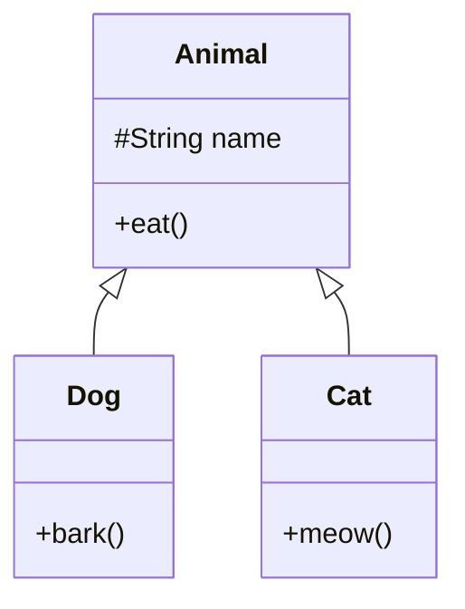

**Rules:**

- Java allows only **single inheritance** (one parent class)
- `super` refers to the parent class
- `super(...)` calls the parent constructor
- Use `@Override` when overriding a parent method

---

**Inheritance vs Composition — when to use each:**

This is one of the most important design decisions in OOP. A famous principle says: **"Favour composition over inheritance"**.

**Inheritance** (`extends`) = "IS-A" relationship:

- A `Dog` IS AN `Animal` ✅
- A `SavingsAccount` IS A `BankAccount` ✅
- A `UserController` IS A `BaseController` (shared template) ✅

**Composition** = "HAS-A" relationship (holding a reference to another object):

- A `Car` HAS AN `Engine` ✅ (a car is not an engine)
- A `UserService` HAS A `UserRepository` ✅ (service is not a repository)
- An `EmailSender` HAS A `TemplateEngine` ✅

**When to use Inheritance:**

```java
// Genuine IS-A relationship AND you want polymorphism
abstract class HttpFilter {
    abstract void doFilter(HttpRequest req, HttpResponse res);
}
class AuthFilter extends HttpFilter { ... }   // AuthFilter IS AN HttpFilter
class LoggingFilter extends HttpFilter { ... }
```

**When to use Composition instead:**

```java
// WRONG: UserService IS-NOT a UserRepository
class UserService extends UserRepository { ... }  // DON'T DO THIS

// CORRECT: UserService HAS-A UserRepository (composition via DI)
class UserService {
    private final UserRepository userRepo;  // injected

    public UserService(UserRepository userRepo) {
        this.userRepo = userRepo;
    }
}
```

**The practical test:** Ask "does this relationship make sense in every direction?" If you can say "A Dog is an Animal" AND "every Animal operation makes sense for Dog", inheritance is probably right. If it feels forced, use composition.

In Spring Boot, **composition via dependency injection (DI)** is used 95% of the time. Inheritance is mainly used for:

- Abstract base controllers or services with shared template logic
- Exception class hierarchies
- Spring's own internal framework classes (which you extend: e.g. `WebSecurityConfigurerAdapter`)

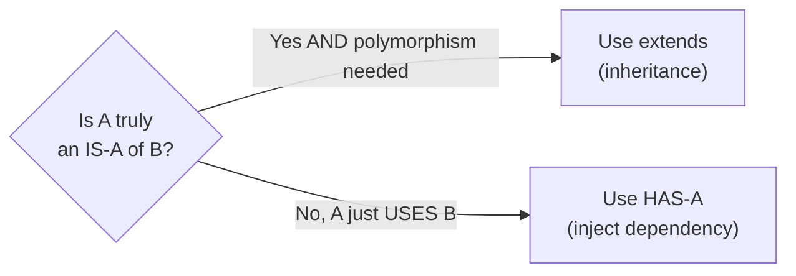

---

### A8.3 Polymorphism

One reference type, many implementations:

```java
Animal a1 = new Dog("Rex");   // Animal reference, Dog object
Animal a2 = new Cat("Whiskers");

a1.eat();   // Dog's eat (if overridden), or Animal's eat
a2.eat();   // Cat's eat (if overridden)

// Process any Animal uniformly
List<Animal> animals = List.of(new Dog("Rex"), new Cat("Whiskers"));
for (Animal animal : animals) {
    animal.eat();   // right method called at runtime — dynamic dispatch
}
```

**Method Overriding (runtime polymorphism):**

```java
public class Dog extends Animal {
    @Override
    public void eat() {
        System.out.println(name + " chomps food.");  // overrides parent
    }
}
```

**Instanceof check:**

```java
Animal a = new Dog("Rex");
if (a instanceof Dog dog) {   // Java 16+ pattern matching
    dog.bark();
}
```

Node.js comparison: JavaScript prototype chain achieves polymorphism; Java class hierarchy is more explicit and compiler-verified.

---

### A8.4 Abstraction

Hide complexity, expose only essentials:

```java
// Abstract class — cannot be instantiated directly
public abstract class Shape {
    abstract double area();     // must be implemented by subclasses
    abstract double perimeter();

    public void printInfo() {   // concrete method — shared behaviour
        System.out.printf("Area: %.2f, Perimeter: %.2f%n", area(), perimeter());
    }
}

public class Circle extends Shape {
    private double radius;
    public Circle(double r) { this.radius = r; }

    @Override public double area()      { return Math.PI * radius * radius; }
    @Override public double perimeter() { return 2 * Math.PI * radius; }
}

Shape s = new Circle(5);
s.printInfo();  // Area: 78.54, Perimeter: 31.42
```

---

### A8.5 Quick Quiz

1. **What access modifier should fields typically have?** — `private` ✅
2. **What keyword calls the parent class constructor?** — `super()` ✅
3. **What is runtime polymorphism?** — The JVM decides at runtime which overridden method to call based on the actual object type ✅
4. **Can you instantiate an abstract class directly?** — No — must subclass and implement all abstract methods ✅

---

### A8.6 Summary

| Pillar        | Key mechanism                  | One-line                             |
| ------------- | ------------------------------ | ------------------------------------ |
| Encapsulation | `private` + getters/setters    | Hide state, control access           |
| Inheritance   | `extends`                      | Subclass reuses superclass behaviour |
| Polymorphism  | `@Override` + parent reference | One type, many behaviours            |
| Abstraction   | `abstract class`, interfaces   | Define "what", hide "how"            |

**Example — Abstraction.java:**

```java
// Abstract class — partial implementation, cannot be instantiated directly
abstract class Car {
    public abstract void drive();      // must be overridden
    public void playMusic() {
        System.out.println("play music"); // shared implementation
    }
}

class Wagnor extends Car {
    @Override
    public void drive() {
        System.out.println("Driving...");
    }
}

public class Abstraction {
    public static void main(String[] args) {
        Car obj = new Wagnor();   // polymorphism — parent reference
        obj.drive();              // Driving...
        obj.playMusic();          // play music
    }
}
```

**Example — Inheritance & Polymorphism (Example1.java):**

```java
class Base {
    int a;
    Base()       { a = 6; }
    Base(int a)  { this.a = a; }
    void display() { System.out.println(a); }
}

class Derived1 extends Base {
    int b;
    Derived1() { a = super.a; b = 7; }                // access parent field
    Derived1(int a, int b) { super(a); this.b = b; }  // call parent constructor
    @Override void display() { System.out.println(a + " " + b); }
}

class Derived2 extends Derived1 {
    int c;
    Derived2() { a = 1; b = 7; c = 8; }
    @Override void display() { System.out.println(a + " " + b + " " + c); }
}

public class Example1 {
    public static void main(String[] args) {
        Derived2 obj3 = new Derived2();
        obj3.display(); // 1 7 8
    }
}
```

**Example — oot/inheritAndPoly/Example2.java (runtime polymorphism + abstract class):**

```java
// Runtime polymorphism: abstract class with abstract method
abstract class Shape {
    int a = 20;
    abstract void draw();          // every subclass MUST implement
    void display() { System.out.println("hello world!"); }
}

class Circle    extends Shape { @Override void draw() { System.out.println("Circle"); } }
class Rectangle extends Shape { @Override void draw() { System.out.println("Rectangle"); } }
class Rhombus   extends Shape { @Override void draw() { System.out.println("Rhombus"); } }

public class Example2 {
    public static void main(String[] args) {
        Shape c = new Circle();     // upcasting — Shape ref holds Circle object
        Shape r = new Rectangle();
        Shape rh = new Rhombus();

        c.display();                // inherited concrete method — "hello world!"
        System.out.println(c.a);   // inherited field — 20

        Shape[] shapes = {c, r, rh};
        for (Shape shape : shapes) {
            shape.draw();  // dynamic dispatch — JVM picks the actual type at runtime
        }
        // Output: Circle / Rectangle / Rhombus

        System.out.println(rh instanceof Shape); // true
    }
}
```

**Example — oot/inheritAndPoly/ObjectMethod.java (Object class methods):**

```java
class Monkey { int a; }

public class ObjectMethod {
    public static void main(String[] args) {
        Monkey m1 = new Monkey();
        Monkey m2 = new Monkey();
        Monkey m3 = m1;  // m3 points to the SAME object as m1

        System.out.println(m1.equals(m3)); // true  — same reference
        System.out.println(m1.equals(m2)); // false — different objects
        System.out.println(m2.equals(m3)); // false

        System.out.println(m1.getClass());  // class oot.inheritAndPoly.Monkey
        System.out.println(m1.hashCode());  // identity hash (memory-based)
        System.out.println(m1.toString());  // oot.inheritAndPoly.Monkey@<hashcode>
        // Override equals/hashCode when you need value-based equality
    }
}
```

> [↑ Back to Index](#master-table-of-contents)

---

## A9. Interfaces vs Abstract Classes

> **Goal:** Know the difference and when to use each — critical for Spring Boot design.

---

### A9.1 Interface

An interface defines a **contract** — what methods an implementing class must provide:

```java
public interface PaymentProcessor {
    boolean process(double amount);    // abstract by default
    String getProviderName();

    // Default method (Java 8+) — has implementation, can be overridden
    default String formatAmount(double amount) {
        return String.format("$%.2f", amount);
    }

    // Static method (Java 8+) — belongs to interface
    static PaymentProcessor noOp() {
        return amount -> true;
    }
}

// Implementation
public class StripeProcessor implements PaymentProcessor {
    @Override
    public boolean process(double amount) { /* call Stripe API */ return true; }

    @Override
    public String getProviderName() { return "Stripe"; }
}
```

**Key interface rules:**

- All fields are implicitly `public static final`
- All methods are implicitly `public`
- A class can implements **multiple** interfaces
- Java 8+: can have `default` and `static` methods

---

### A9.2 Abstract Class

An abstract class is a **partially implemented class** used as a base:

```java
public abstract class BaseRepository<T, ID> {
    // Shared, implemented logic
    protected void logOperation(String op) {
        System.out.println("Operation: " + op);
    }

    // Must be implemented by subclasses
    public abstract T findById(ID id);
    public abstract void save(T entity);
    public abstract void delete(ID id);
}

public class UserRepository extends BaseRepository<User, Long> {
    @Override public User findById(Long id) { /* DB query */ return null; }
    @Override public void save(User u) { /* DB insert */ }
    @Override public void delete(Long id) { /* DB delete */ }
}
```

---

### A9.3 When to Use Which

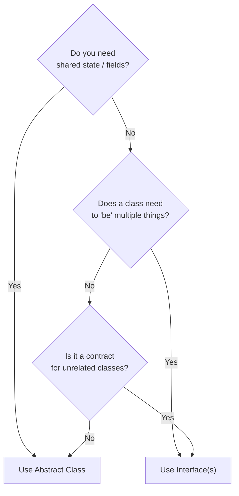

| Feature                | Interface                     | Abstract Class             |
| ---------------------- | ----------------------------- | -------------------------- |
| Multiple inheritance   | ✅ A class can implement many | ❌ Only one `extends`      |
| Constructors           | ❌ None                       | ✅ Yes                     |
| Instance fields        | ❌ Only constants             | ✅ Yes                     |
| Partial implementation | ✅ `default` methods          | ✅ Any methods             |
| Best for               | Contracts / capabilities      | Shared base implementation |

**In Spring Boot — interfaces are everywhere:**

- `JpaRepository` — interface
- `UserDetailsService` — interface
- Service interfaces (`UserService`) with `UserServiceImpl` impl

---

### A9.4 Functional Interfaces

A **functional interface** has exactly one abstract method — can be used with lambdas:

```java
@FunctionalInterface
public interface Transformer<T, R> {
    R transform(T input);
}

// Lambda implements the single abstract method
Transformer<String, Integer> strlen = s -> s.length();
System.out.println(strlen.transform("hello")); // 5

// Built-in functional interfaces (java.util.function)
Predicate<String>   isEmpty = String::isEmpty;
Function<String, Integer> toInt = Integer::parseInt;
Consumer<String>    printer = System.out::println;
Supplier<String>    greeting = () -> "Hello!";
```

---

### A9.5 Quick Quiz

1. **Can a class implement multiple interfaces?** — Yes ✅
2. **Can a class extend multiple abstract classes?** — No — single inheritance only ✅
3. **What makes a functional interface?** — Exactly one abstract method; enables lambda expressions ✅
4. **In Spring Boot, `JpaRepository` is an interface. Why not an abstract class?** — Because your repository class may need to extend other things; also Spring generates the implementation at runtime ✅

---

### A9.6 Summary

| Concept              | One-line summary                                                     |
| -------------------- | -------------------------------------------------------------------- |
| Interface            | Contract only; multiple implements; no instance state                |
| Abstract class       | Partial implementation; single extends; can have fields              |
| `default` method     | Interface method with body; classes can override                     |
| Functional interface | One abstract method; enables lambdas                                 |
| Spring usage         | Services and repos use interfaces for loose coupling and testability |

**Example — InterfaceDemo.java (multiple interface implementation):**

```java
// interface → interface = extends
// class → interface = implements
// class → class = extends

interface A {
    int a = 10;         // implicitly public static final
    String area = "HYD";
    void show();        // implicitly public abstract
    void config();
}

interface X { void run(); }
interface Y extends X { void check(); }

class B implements A, Y {
    @Override public void show()   { System.out.println("in class show"); }
    @Override public void config() { System.out.println("in class config"); }
    @Override public void run()    { System.out.println("in class run"); }
    @Override public void check()  { System.out.println("in class check"); }
}

public class InterfaceDemo {
    public static void main(String[] args) {
        A obj = new B();
        obj.show();             // in class show
        obj.config();           // in class config
        ((Y) obj).run();        // in class run
        ((Y) obj).check();      // in class check
        System.out.println(A.a + " " + A.area); // 10 HYD
    }
}
```

**Example — InterfaceTypes.java (functional interface + lambda):**

```java
@FunctionalInterface  // exactly one abstract method → enables lambdas
interface Calculator {
    int calc(int i, int j, String op);
}

public class InterfaceTypes {
    public static void main(String[] args) {
        // Lambda implements the functional interface — no class needed
        Calculator obj = (i, j, op) -> {
            int res = 0;
            switch (op) {
                case "add" -> res = i + j;
                case "sub" -> res = i - j;
            }
            return res;
        };
        System.out.println(obj.calc(1, 2, "sub")); // -1
        System.out.println(obj.calc(3, 4, "add")); // 7
    }
}
```

**Example — oot/Interface/Implementation.java (implementing multiple interfaces + abstract class):**

```java
abstract class E { abstract void sound(); }
interface A     { void hello(); }
interface B     { void greet(); }

// class can implement MULTIPLE interfaces — no diamond problem
class C implements A, B {
    public void hello() { System.out.println("Hello"); }
    public void greet() { System.out.println("Greetings"); }
}

// can extend abstract class AND implement interface at the same time
class D extends E implements A {
    public void hello() { System.out.println("Hello from A"); }
    public void sound() { System.out.println("Making sound from abstract"); }
}

public class Implementation {
    public static void main(String[] args) {
        C obj1 = new C(); obj1.hello(); obj1.greet();
        D obj2 = new D(); obj2.sound();
    }
}
```

**Example — oot/Interface/DiamondCaseProblem.java (why multiple class inheritance is banned):**

```java
class A  {}
class B extends A {}
class C extends A {}
// Java FORBIDS: class D extends B, C  ← diamond problem
// If both B and C override a method from A, which version does D inherit?
// Solution: use interfaces (can implement many; compiler forces explicit override)
```

**Example — oot/Interface/ExampleOfComparable.java (Comparable for custom sort):**

```java
import java.util.Arrays;

class Number implements Comparable<Number> {
    int v;
    public Number(int v) { this.v = v; }

    @Override
    public int compareTo(Number o) {
        return this.v - o.v;     // positive → this is larger; negative → this is smaller
    }

    @Override public String toString() { return String.valueOf(v); }
}

public class ExampleOfComparable {
    public static void main(String[] args) {
        Number[] a = {new Number(10), new Number(3), new Number(12), new Number(5)};
        Arrays.sort(a);                      // uses compareTo
        System.out.println(Arrays.toString(a)); // [3, 5, 10, 12]
    }
}
```

**Example — oot/Interface/ExampleOfComparable2.java (sort by height descending):**

```java
import java.util.Arrays;

class Human implements Comparable<Human> {
    String name; Double height, weight;
    public Human(String name, Double height, Double weight) {
        this.name = name; this.height = height; this.weight = weight;
    }
    @Override
    public int compareTo(Human a) {
        if (a.height > this.height) return -1;  // descending — taller first
        if (a.height < this.height) return  1;
        return 0;
    }
    @Override public String toString() {
        return "Human{name='" + name + "', height=" + height + "}";
    }
}

public class ExampleOfComparable2 {
    public static void main(String[] args) {
        Human[] humans = {
            new Human("Prashant",5.5,60.2), new Human("Bhavani",5.0,40.0),
            new Human("Alivelu",4.9,65.2), new Human("Raju",5.0,58.4)
        };
        Arrays.sort(humans);  // natural ordering via compareTo
        System.out.println(Arrays.toString(humans)); // tallest first
    }
}
```

**Example — oot/Interface/ExampleOfCloneable.java (deep copy via Cloneable):**

```java
class Test { int x; }

class Human implements Cloneable {
    String name, gender;
    Test t = new Test();
    public Human(String name, String gender) { this.name = name; this.gender = gender; }

    @Override
    public Object clone() throws CloneNotSupportedException {
        Human h = (Human) super.clone();  // shallow copy of Human
        h.t = new Test();                 // deep copy: create NEW Test — independent from original
        return h;
    }
}

public class ExampleOfCloneable {
    public static void main(String[] args) throws CloneNotSupportedException {
        Human prashant = new Human("Prashant", "Male");
        prashant.t.x = 100;

        Human clone = (Human) prashant.clone();
        clone.t.x = 200;  // changes clone's Test, NOT prashant's Test

        System.out.println(prashant.t.x); // 100 — unchanged (deep copy worked)
        System.out.println(clone.t.x);    // 200
    }
}
```

> [↑ Back to Index](#master-table-of-contents)

---

## A10. Access Modifiers

> **Goal:** Understand who can see what — critical for encapsulation and Spring Bean visibility.

---

### A10.1 The Four Modifiers

```java
public class AccessDemo {
    public    String pubField    = "anyone";          // accessible everywhere
    protected String protField   = "package + subs";  // package + subclasses
              String defField    = "package only";    // no keyword = package-private
    private   String privField   = "this class only"; // most restrictive
}
```

---

### A10.2 Visibility Table

| Modifier            | Same class | Same package | Subclass (other pkg) | Anywhere |
| ------------------- | ---------- | ------------ | -------------------- | -------- |
| `public`            | ✅         | ✅           | ✅                   | ✅       |
| `protected`         | ✅         | ✅           | ✅                   | ❌       |
| _(package-private)_ | ✅         | ✅           | ❌                   | ❌       |
| `private`           | ✅         | ❌           | ❌                   | ❌       |

```mermaid
flowchart LR
    Private["private<br/>most restrictive"] --> Default["package-private<br/>(no keyword)"]
    Default --> Protected["protected"]
    Protected --> Public["public<br/>most permissive"]
```

---

### A10.3 Best Practices

```java
public class UserService {
    // Fields: always private
    private final UserRepository userRepo;

    // Constructor: public (Spring needs to inject)
    public UserService(UserRepository userRepo) {
        this.userRepo = userRepo;
    }

    // Public API: intended for other layers
    public User findUser(Long id) { return userRepo.findById(id).orElseThrow(); }

    // Internal helper: private — no one else should call this
    private void validateUser(User user) { /* ... */ }
}
```

**Guidelines:**

- Fields → `private` (always)
- Public API methods → `public`
- Internal helpers → `private`
- Inheritance entry points → `protected`
- Avoid package-private unless intentional (useful for test access)

**Spring Boot note:** Spring can inject `private` constructors via reflection, but the conventional approach is `public` constructors for injectable beans.

---

### A10.4 Quick Quiz

1. **What is the default access level when no modifier is specified?** — Package-private ✅
2. **Can a `private` method be overridden in a subclass?** — No — not visible to subclass ✅
3. **What modifier lets subclasses in other packages access a method but keeps it from unrelated classes?** — `protected` ✅
4. **What access level should class fields almost always be?** — `private` ✅

---

### A10.5 Summary

| Modifier    | Visibility                |
| ----------- | ------------------------- |
| `public`    | Entire application        |
| `protected` | Same package + subclasses |
| _(none)_    | Same package only         |
| `private`   | Same class only           |

**Rule of thumb:** Start with `private`. Widen only when necessary.

**Example — oot/accessmodifiers/Student.java (public vs private members):**

```java
public class Student {
    public int rollNo = 101;     // accessible from any class

    public Student() { rollNo = 102; }

    public void printRollNumber() {
        System.out.println(rollNo);  // accessible everywhere
    }

    private void abc() {
        printRollNumber();           // private — only callable from WITHIN Student
        System.out.println(rollNo);
    }

    public static void main(String[] args) {
        Student s = new Student();
        s.abc();  // works — called from same class
    }
}
```

**Example — oot/accessmodifiers/Car.java (cross-class access):**

```java
public class Car {
    public static void main(String[] args) {
        Student s = new Student();
        s.printRollNumber();      // ✔ public method — accessible
        System.out.println(s.rollNo); // ✔ public field — accessible
        // s.abc();              // ✘ private method — COMPILE ERROR
    }
}

// A class whose constructor AND methods are ALL private — inaccessible from outside
class Test1 {
    private int x = 101;
    private Test1() { x = 102; }
    private void printRollNumber() { System.out.println(x); }
    // You can't even instantiate this from another class!
}
```

> [↑ Back to Index](#master-table-of-contents)

---

## A11. Exceptions — Checked vs Unchecked, Custom Exceptions

> **Goal:** Handle errors the Java way, including Spring Boot's exception-to-HTTP-response pattern.

---

### A11.1 Exception Hierarchy

```mermaid
flowchart TD
    Throwable --> Error["Error<br/>(JVM-level, don't catch)"]
    Throwable --> Exception
    Exception --> Checked["Checked Exceptions<br/>(IOException, SQLException)<br/>Compiler forces handling"]
    Exception --> RuntimeException["RuntimeException<br/>(unchecked)<br/>NullPointerException<br/>IllegalArgumentException<br/>IndexOutOfBoundsException"]
```

---

### A11.2 try / catch / finally

```java
try {
    String text = readFile("data.txt");   // might throw IOException
    int num = Integer.parseInt(text);     // might throw NumberFormatException
    System.out.println(num);
} catch (IOException e) {
    System.err.println("Could not read file: " + e.getMessage());
} catch (NumberFormatException e) {
    System.err.println("File content is not a number");
} catch (IOException | IllegalArgumentException e) {
    // multi-catch (Java 7+) — handle multiple types same way
} finally {
    // ALWAYS runs — cleanup here (close connections, etc.)
    System.out.println("Done");
}
```

**Try-with-resources (Java 7+)** — auto-closes resources:

```java
// OLD — manual close, easy to forget
FileReader reader = new FileReader("file.txt");
try {
    // use reader
} finally {
    reader.close();
}

// NEW — AutoCloseable resources closed automatically
try (FileReader reader = new FileReader("file.txt")) {
    // use reader
}   // reader.close() called automatically, even if exception thrown
```

---

### A11.3 Checked vs Unchecked

**Checked** — compiler FORCES you to handle them:

```java
// Must either catch or declare with throws
public void readFile(String path) throws IOException {
    FileReader reader = new FileReader(path);  // IOException is checked
}

// Or catch it
public void readFile(String path) {
    try {
        FileReader reader = new FileReader(path);
    } catch (IOException e) {
        throw new RuntimeException("Failed to read file", e);  // wrap and rethrow
    }
}
```

**Unchecked (RuntimeException)** — No forced handling:

```java
// These throw at runtime; no compile-time requirement to catch
String s = null;
s.length();          // NullPointerException

int[] arr = {1};
arr[5];              // ArrayIndexOutOfBoundsException

int x = Integer.parseInt("abc");  // NumberFormatException
```

**In Spring Boot — prefer unchecked:**
Most Spring Boot applications use `RuntimeException` subclasses. The framework's global exception handler translates them to HTTP responses.

---

### A11.4 Custom Exceptions

```java
// Custom unchecked exception
public class UserNotFoundException extends RuntimeException {
    public UserNotFoundException(Long id) {
        super("User not found with id: " + id);
    }
}

// Custom checked exception
public class PaymentFailedException extends Exception {
    private final String errorCode;

    public PaymentFailedException(String errorCode, String message) {
        super(message);
        this.errorCode = errorCode;
    }

    public String getErrorCode() { return errorCode; }
}
```

---

### A11.5 Spring Boot — Global Exception Handling

```java
@RestControllerAdvice  // applies to all @RestController classes
public class GlobalExceptionHandler {

    @ExceptionHandler(UserNotFoundException.class)
    @ResponseStatus(HttpStatus.NOT_FOUND)
    public ErrorResponse handleNotFound(UserNotFoundException ex) {
        return new ErrorResponse(404, ex.getMessage());
    }

    @ExceptionHandler(Exception.class)
    @ResponseStatus(HttpStatus.INTERNAL_SERVER_ERROR)
    public ErrorResponse handleGeneral(Exception ex) {
        return new ErrorResponse(500, "Internal server error");
    }
}
```

This is the Spring equivalent of Express's error-handling middleware:

```javascript
// Express
app.use((err, req, res, next) => {
  res.status(err.status || 500).json({ error: err.message });
});
```

**Example — Exceptions.java (checked, unchecked, custom):**

```java
// Custom checked exception
class MyException extends Exception {
    public MyException(String message) { super(message); }
}

class A1 {
    // throws = declares this might throw a checked exception
    public void show() throws ClassNotFoundException {
        Class.forName("Hello"); // class doesn't exist → throws
    }
}

public class Exceptions {
    public static void main(String[] args) {
        int[] arr = new int[5];

        A1 obj = new A1();
        try {
            obj.show();
        } catch (ClassNotFoundException e) {
            System.out.println(e.getMessage()); // Hello
        }

        try {
            // throw new ArithmeticException("hey hello");
            // throw new MyException("custom Exception");
            System.out.println(arr[5]); // index 5 doesn't exist
        }
        catch (ArithmeticException e) {
            System.err.println("Catch ArithmeticException --- " + e);
        }
        catch (ArrayIndexOutOfBoundsException e) {
            System.err.println("Catch ArrayIndexOutOfBoundsException --- " + e);
        }
        catch (Exception e) {
            System.err.println("Catch Exception --- " + e); // catch-all
        }

        System.out.println(2 + 2); // 4 — always runs
    }
}
```

**Example — GlobalExceptionHandler.java (Spring @ControllerAdvice):**

```java
package com.prash.curdpractice.expections;

import org.springframework.http.HttpStatus;
import org.springframework.http.ResponseEntity;
import org.springframework.web.bind.annotation.ControllerAdvice;
import org.springframework.web.bind.annotation.ExceptionHandler;

@ControllerAdvice
public class GlobalExceptionHandler {

    // Handle specific StudentNotFoundException → 404
    @ExceptionHandler
    public ResponseEntity<StudentErrorResponse> handleException(StudentNotFoundException exc) {
        StudentErrorResponse error = new StudentErrorResponse();
        error.setStatusCode(HttpStatus.NOT_FOUND.value());
        error.setErrorMessage(exc.getMessage());
        error.setTimestamp(System.currentTimeMillis());
        return new ResponseEntity<>(error, HttpStatus.NOT_FOUND);
    }

    // Catch-all for any other Exception → 400
    @ExceptionHandler
    public ResponseEntity<StudentErrorResponse> handleException(Exception exc) {
        StudentErrorResponse error = new StudentErrorResponse();
        error.setStatusCode(HttpStatus.BAD_REQUEST.value());
        error.setErrorMessage(exc.getMessage());
        error.setTimestamp(System.currentTimeMillis());
        return new ResponseEntity<>(error, HttpStatus.BAD_REQUEST);
    }
}
```

**Example — exceptions/Example1.java (custom checked exception + Scanner):**

```java
import java.util.Scanner;

// 1. Define custom exception by extending Exception
class MyException extends Exception {
    String error;
    public MyException(String e) { this.error = e; }

    @Override
    public String getMessage() { return this.error; }
}

public class Example1 {
    public static void main(String[] args) {
        try {
            Scanner in = new Scanner(System.in);
            int x = in.nextInt();
            // 2. Throw custom exception based on business rule
            if (x != 2) {
                throw new MyException("Sorry, please try again");
            }
            System.out.println("Hurry, you guessed it right!");
        } catch (MyException e) {
            // 3. Catch and handle — e.getMessage() returns our custom message
            System.out.println("Error: " + e.getMessage());
        }
        // No need for finally here — no resources to close (Scanner wraps System.in)
    }
}
```

---

### A11.6 Quick Quiz

1. **What is the difference between checked and unchecked exceptions?** — Checked: compiler forces handling/declaration. Unchecked (`RuntimeException`): no compile requirement ✅
2. **When does the `finally` block NOT run?** — Only if `System.exit()` is called or JVM crashes ✅
3. **What is try-with-resources for?** — Auto-closing resources (files, DB connections) even if an exception occurs ✅
4. **Why do Spring Boot apps prefer unchecked exceptions?** — `@ControllerAdvice` handles them globally; checked exceptions would scatter `throws` declarations across the codebase ✅

---

### A11.7 Summary

| Concept             | One-line summary                                       |
| ------------------- | ------------------------------------------------------ |
| Checked exception   | Compiler forces you to handle or declare with `throws` |
| Unchecked exception | `RuntimeException` subclass; no forced handling        |
| `finally`           | Always runs; use for cleanup                           |
| try-with-resources  | Auto-closes `AutoCloseable` resources                  |
| Custom exception    | Extend `RuntimeException` for domain errors            |
| `@ControllerAdvice` | Spring's global exception → HTTP response translator   |

> [↑ Back to Index](#master-table-of-contents)

---

## A12. Collections — List / Set / Map, Generics, Iterators

> **Goal:** Understand Java's collection framework — the most-used part of Java in Spring Boot apps.

---

### A12.1 Collection Hierarchy

```mermaid
flowchart TD
    Iterable --> Collection
    Collection --> List["List<br/>(ordered, duplicates OK)"]
    Collection --> Set["Set<br/>(unique elements)"]
    Collection --> Queue["Queue<br/>(FIFO processing)"]
    List --> ArrayList
    List --> LinkedList
    Set --> HashSet
    Set --> LinkedHashSet
    Set --> TreeSet["TreeSet<br/>(sorted)"]
    Map["Map<br/>(key-value, separate hierarchy)"] --> HashMap
    Map --> LinkedHashMap["LinkedHashMap<br/>(insertion-ordered)"]
    Map --> TreeMap["TreeMap<br/>(sorted by key)"]
```

---

### A12.2 List

```java
// ArrayList — fast random access, slower insert/delete in middle
List<String> names = new ArrayList<>();
names.add("Prashant");
names.add("Rahul");
names.add("Anil");

names.get(0);              // "Prashant"
names.size();              // 3
names.contains("Rahul");   // true
names.remove("Anil");      // remove by value
names.remove(0);           // remove by index
names.set(0, "Suresh");    // replace at index

// Immutable list (Java 9+)
List<String> fixed = List.of("a", "b", "c");  // cannot add/remove

// Mutable copy of immutable
List<String> mutable = new ArrayList<>(List.of("a", "b", "c"));

// Sort
Collections.sort(names);
names.sort(Comparator.naturalOrder());
names.sort(Comparator.reverseOrder());
```

---

**`ArrayList` vs `LinkedList` — when to use which:**

| Operation                | `ArrayList`               | `LinkedList`                     |
| ------------------------ | ------------------------- | -------------------------------- |
| Get by index (`get(5)`)  | ✅ O(1) — fast            | ❌ O(n) — slow                   |
| Add to end (`add(item)`) | ✅ O(1) amortized         | ✅ O(1)                          |
| Add/remove in middle     | ❌ O(n) — shifts elements | ✅ O(1) — just relinks           |
| Memory                   | Less overhead             | More (stores prev/next pointers) |
| Iteration (for-each)     | ✅ Cache-friendly         | ✅ Fine                          |

**Decision guide:**

```
90% of cases → just use ArrayList
Need frequent insertions/deletions at beginning/middle → LinkedList
Need a queue/deque structure → LinkedList (implements Deque)
```

In Spring Boot application code: `ArrayList` is almost always what you want. `LinkedList` is mainly used when implementing queues or when you have a clear need for O(1) insertions at arbitrary positions.

```java
// Use ArrayList for API response lists, query results
List<UserDto> users = new ArrayList<>();

// Use LinkedList as a queue
Deque<Task> taskQueue = new LinkedList<>();
taskQueue.addLast(task);     // enqueue
Task next = taskQueue.pollFirst();  // dequeue
```

---

### A12.3 Set

```java
Set<String> unique = new HashSet<>();
unique.add("apple");
unique.add("banana");
unique.add("apple");    // ignored — duplicate

unique.size();          // 2
unique.contains("banana"); // true

// LinkedHashSet — maintains insertion order
Set<String> ordered = new LinkedHashSet<>();

// TreeSet — sorted alphabetically
Set<String> sorted = new TreeSet<>();
```

Node.js comparison: Like JS `Set`, but typed and with more implementations.

---

**When to use which Set implementation:**

| Situation                                    | Use                             | Why                                                |
| -------------------------------------------- | ------------------------------- | -------------------------------------------------- |
| Just need uniqueness, don't care about order | `HashSet`                       | Fastest — O(1) add/contains/remove                 |
| Need uniqueness AND preserve insertion order | `LinkedHashSet`                 | Slightly slower than HashSet but ordered           |
| Need uniqueness AND sorted order             | `TreeSet`                       | Elements sorted by natural order or a `Comparator` |
| Thread-safe set in concurrent code           | `ConcurrentHashMap.newKeySet()` | Safe for multi-threaded access                     |

**When to use a Set vs List:**

- Set = you care about **uniqueness** (tags on a post, permissions, country codes)
- List = you care about **order** and allow duplicates (results list, shopping cart items)

```java
// Use Set to eliminate duplicates from a List
List<String> withDups = List.of("a", "b", "a", "c", "b");
Set<String> unique = new LinkedHashSet<>(withDups); // preserves order
// ["a", "b", "c"]

// Use TreeSet when results must be alphabetically sorted
Set<String> categories = new TreeSet<>(productRepo.findAllCategories());
// automatically sorted — no explicit sort() needed

// Checking membership — Set is O(1), List.contains() is O(n)
Set<String> allowedRoles = Set.of("ADMIN", "MANAGER");
if (allowedRoles.contains(user.getRole())) { ... }  // fast lookup
```

---

### A12.4 Map

```java
Map<String, Integer> scores = new HashMap<>();
scores.put("Prashant", 95);
scores.put("Rahul", 87);
scores.put("Prashant", 98);    // replaces existing value

scores.get("Rahul");           // 87
scores.getOrDefault("Anil", 0); // 0 — key not found, return default
scores.containsKey("Rahul");   // true
scores.size();                 // 2 — keys are unique

// Iterate map
for (Map.Entry<String, Integer> entry : scores.entrySet()) {
    System.out.println(entry.getKey() + " = " + entry.getValue());
}

// Java 8+ forEach
scores.forEach((key, val) -> System.out.println(key + ": " + val));

// putIfAbsent, computeIfAbsent
scores.putIfAbsent("Anil", 75);
scores.computeIfAbsent("Newuser", k -> k.length() * 10);
```

Node.js comparison: Like JS `Map` or plain object `{}` — use Java `Map` for typed key-value storage.

---

**When to use which Map implementation:**

| Situation                                                 | Use                                   | Why                                        |
| --------------------------------------------------------- | ------------------------------------- | ------------------------------------------ |
| General-purpose key-value store                           | `HashMap`                             | Fastest — O(1) get/put; no ordering        |
| Need keys in insertion order (e.g. building ordered JSON) | `LinkedHashMap`                       | Slightly slower; maintains insertion order |
| Need keys sorted alphabetically/numerically               | `TreeMap`                             | Keys always sorted; O(log n) operations    |
| Counting occurrences                                      | `HashMap<T, Integer>`                 | Use `getOrDefault` or `merge`              |
| Multi-valued map (one key → many values)                  | `Map<K, List<V>>` or Guava `Multimap` | Group items by a category                  |
| Thread-safe map for concurrent access                     | `ConcurrentHashMap`                   | Safe for multiple threads reading/writing  |

**Practical patterns:**

```java
// Counting word frequencies — HashMap
Map<String, Integer> freq = new HashMap<>();
for (String word : words) {
    freq.merge(word, 1, Integer::sum);  // cleaner than getOrDefault + put
}

// Caching — LinkedHashMap with access-order eviction (simple LRU cache)
Map<String, User> cache = new LinkedHashMap<>(16, 0.75f, true) {
    protected boolean removeEldestEntry(Map.Entry e) {
        return size() > 100;  // evict when over 100 entries
    }
};

// Enum → handler mapping — avoid long if/else chains
Map<UserStatus, StatusHandler> handlers = Map.of(
    UserStatus.ACTIVE,   new ActiveHandler(),
    UserStatus.BANNED,   new BannedHandler(),
    UserStatus.PENDING,  new PendingHandler()
);
handlers.get(user.getStatus()).handle(user);  // clean dispatch

// Grouping — equivalent to groupBy in SQL
Map<String, List<Order>> ordersByStatus = orders.stream()
    .collect(Collectors.groupingBy(Order::getStatus));
```

**`HashMap` vs `Hashtable` (legacy):** Never use `Hashtable` — it's a legacy class. Use `ConcurrentHashMap` if you need thread safety.

---

### A12.5 Generics

Generics enable type-safe containers and methods:

```java
// Without generics (old way — avoid)
List raw = new ArrayList();
raw.add("hello");
raw.add(42);
String s = (String) raw.get(1);  // ClassCastException at runtime!

// With generics — type checked at compile time
List<String> typed = new ArrayList<>();
typed.add("hello");
// typed.add(42);  // COMPILE ERROR
String s2 = typed.get(0);  // no cast needed
```

**Generic method:**

```java
public <T> T getFirst(List<T> list) {
    return list.isEmpty() ? null : list.get(0);
}

String first = getFirst(List.of("a", "b"));  // returns String
Integer num  = getFirst(List.of(1, 2, 3));    // returns Integer
```

**Bounded generics:**

```java
// T must be a Number or subclass
public <T extends Number> double sum(List<T> list) {
    return list.stream().mapToDouble(Number::doubleValue).sum();
}
```

---

### A12.6 Iterators

```java
List<String> items = new ArrayList<>(List.of("a", "b", "c"));

// Enhanced for (most common)
for (String item : items) { System.out.println(item); }

// Iterator — needed when removing during iteration
Iterator<String> it = items.iterator();
while (it.hasNext()) {
    String item = it.next();
    if (item.equals("b")) it.remove();  // safe removal during iteration
}

// ListIterator — bidirectional
ListIterator<String> lit = items.listIterator();
while (lit.hasNext()) { System.out.println(lit.next()); }
while (lit.hasPrevious()) { System.out.println(lit.previous()); }
```

---

**When to use which iteration approach:**

| Situation                            | Use                                     | Why                                      |
| ------------------------------------ | --------------------------------------- | ---------------------------------------- |
| Simply read all elements in order    | `for (T x : collection)`                | Cleanest, most readable                  |
| Transform/filter into a new list     | `stream().filter().map().toList()`      | Functional; expressive; immutable result |
| Need the index while reading         | `for (int i = 0; i < list.size(); i++)` | for-each gives no index                  |
| Remove elements while iterating      | `Iterator` + `it.remove()`              | Only safe in-place removal method        |
| Add/replace elements while iterating | `ListIterator`                          | Can call `lit.set()` and `lit.add()`     |
| Parallel processing of large dataset | `parallelStream()`                      | Uses multiple CPU cores                  |

**The ConcurrentModificationException pitfall:**

```java
List<String> names = new ArrayList<>(List.of("Alice", "Bob", "Charlie"));

// WRONG — throws ConcurrentModificationException
for (String name : names) {
    if (name.startsWith("A")) {
        names.remove(name);  // modifying the list during for-each iteration
    }
}

// CORRECT — Option 1: Iterator
Iterator<String> it = names.iterator();
while (it.hasNext()) {
    if (it.next().startsWith("A")) it.remove();  // safe
}

// CORRECT — Option 2: Stream (creates new list, original unchanged)
List<String> filtered = names.stream()
    .filter(n -> !n.startsWith("A"))
    .toList();

// CORRECT — Option 3: removeIf (Java 8+, cleanest)
names.removeIf(n -> n.startsWith("A"));
```

---

### A12.7 Quick Quiz

1. **What does `List.of()` return — mutable or immutable?** — Immutable ✅
2. **Why can't you modify a collection while iterating with for-each?** — `ConcurrentModificationException` — use `Iterator.remove()` instead ✅
3. **What is the difference between `HashMap` and `LinkedHashMap`?** — `HashMap` has no order guarantee; `LinkedHashMap` maintains insertion order ✅
4. **Why does `HashSet` not allow duplicates?** — Uses `hashCode()` and `equals()` to detect duplicates ✅

---

### A12.8 Summary

| Type   | Implementation  | Characteristics                 |
| ------ | --------------- | ------------------------------- |
| `List` | `ArrayList`     | Ordered, indexed, duplicates OK |
| `Set`  | `HashSet`       | Unique, unordered               |
| `Set`  | `TreeSet`       | Unique, sorted                  |
| `Map`  | `HashMap`       | Key-value, unordered            |
| `Map`  | `LinkedHashMap` | Key-value, insertion-ordered    |

**Example — CollectionApi.java:**

```java
import java.util.*;

public class CollectionApi {
    public static void main(String[] args) {
        // List — ordered, allows duplicates, index-accessible
        List<Integer> nums = new ArrayList<>();
        nums.add(1); nums.add(3); nums.add(2); nums.add(20); nums.add(3);
        System.out.println(nums.get(3));     // 20
        System.out.println(nums.indexOf(20)); // 3

        // Set — unique elements (HashSet = unordered, TreeSet = sorted)
        Set<Integer> uniqueNums = new HashSet<>(nums);
        // uniqueNums = [1, 2, 3, 20] — no duplicate 3

        // Iterator
        Iterator<Integer> iter = nums.iterator();
        while (iter.hasNext()) { System.out.println(iter.next()); }

        // for-each (preferred)
        for (int a : nums) { System.out.println(a); }

        // Map — key-value pairs
        Map<String, String> data = new HashMap<>();
        data.put("key1", "Prashant");
        data.put("key2", "Ramesh");
        data.put("key3", "Prashant");

        for (String key : data.keySet()) {
            System.out.println(key + " → " + data.get(key));
        }
    }
}
```

**Example — DataStructures/ArrayListSorting1.java (Comparable + Collections.sort):**

```java
import java.util.*;

// Implement Comparable to define the "natural ordering" for this class
class HumanBeing implements Comparable<HumanBeing> {
    int age; String profession, name;

    public HumanBeing(String name, String profession, int age) {
        this.age = age; this.profession = profession; this.name = name;
    }

    // compareTo defines sort order: negative = this before other, positive = this after
    @Override
    public int compareTo(HumanBeing h) {
        if (age > h.age) return 1;
        if (age < h.age) return -1;
        return 0;
    }

    @Override public String toString() {
        return "HumanBeing [age=" + age + ", profession=" + profession + ", name=" + name + "]";
    }
}

public class ArrayListSorting1 {
    public static void main(String[] args) {
        ArrayList<HumanBeing> data = new ArrayList<>();
        data.add(new HumanBeing("Prashant", "Developer", 25));
        data.add(new HumanBeing("Raju",     "Manager",   35));
        data.add(new HumanBeing("Alivelu",  "Designer",  22));

        Collections.sort(data);   // uses HumanBeing.compareTo → sorted by age ascending
        System.out.println(data);
    }
}
```

**Example — DataStructures/ArrayListSorting2.java (Comparator + TreeSet + HashSet with equals/hashCode):**

```java
import java.util.*;

class HumanBeing1 implements Comparable<HumanBeing1> {
    int age; String profession, name;

    public HumanBeing1(String name, String profession, int age) {
        this.age = age; this.profession = profession; this.name = name;
    }

    // Natural order by age (for TreeSet)
    @Override public int compareTo(HumanBeing1 h) {
        if (age > h.age) return 1;
        if (age < h.age) return -1;
        return 0;
    }

    // equals + hashCode based on profession → HashSet treats same-profession as duplicates
    @Override public boolean equals(Object h) {
        return getProfession().equals(((HumanBeing1) h).getProfession());
    }
    @Override public int hashCode() { return getProfession().hashCode(); }

    public String getProfession() { return profession; }
    @Override public String toString() { return name; }
}

// Inner Comparator class: sort by profession alphabetically (alternative ordering)
class ProfessionComparator implements Comparator<HumanBeing1> {
    @Override
    public int compare(HumanBeing1 one, HumanBeing1 two) {
        return one.getProfession().compareTo(two.getProfession());
    }
}

public class ArrayListSorting2 {
    public static void main(String[] args) {
        ArrayList<HumanBeing1> data = new ArrayList<>();
        data.add(new HumanBeing1("Prashant", "Developer", 25));
        data.add(new HumanBeing1("Raju",     "Manager",   35));
        data.add(new HumanBeing1("Alivelu",  "Developer", 22)); // same profession as Prashant

        // Sort by profession using external Comparator
        Collections.sort(data, new ProfessionComparator());
        System.out.println(data);  // sorted by profession alphabetically

        // TreeSet: uses compareTo (age) → sorted, unique by age
        TreeSet<HumanBeing1> treeSet = new TreeSet<>(data);
        System.out.println(treeSet);

        // HashSet: uses equals/hashCode (profession) → Alivelu & Prashant = same profession → only 2 elements
        HashSet<HumanBeing1> hashSet = new HashSet<>(data);
        System.out.println(hashSet); // 2 elements: one Developer + one Manager
    }
}
```

> [↑ Back to Index](#master-table-of-contents)

---

## A13. Streams API and Lambdas

> **Goal:** Write functional-style data processing in Java — the closest Java gets to JS array methods.

---

### A13.1 Lambda Syntax

A lambda is a concise way to express an anonymous function:

```java
// Full anonymous class (old way)
Comparator<String> comp1 = new Comparator<String>() {
    @Override
    public int compare(String a, String b) { return a.compareTo(b); }
};

// Lambda (clean)
Comparator<String> comp2 = (a, b) -> a.compareTo(b);

// Method reference (cleanest when method already exists)
Comparator<String> comp3 = String::compareTo;
```

Lambda variants:

```java
// No params
Runnable r = () -> System.out.println("Hello");

// One param — parentheses optional
Consumer<String> print = s -> System.out.println(s);

// Multiple params
BiFunction<Integer, Integer, Integer> add = (a, b) -> a + b;

// Multi-line body needs return
Function<String, Integer> parse = s -> {
    int result = Integer.parseInt(s);
    return result * 2;
};
```

---

**When to use lambda vs method reference vs anonymous class:**

**Method reference** is the cleanest when an existing method already does exactly what you need — it's just a shorthand for a lambda that calls exactly one method:

```java
// These are all equivalent — use the most readable form

// Lambda — explicit but verbose
names.stream().map(s -> s.toLowerCase()).toList();
names.forEach(s -> System.out.println(s));

// Method reference — cleaner when the lambda just calls one method
names.stream().map(String::toLowerCase).toList();
names.forEach(System.out::println);
```

**Four kinds of method references:**

| Kind                         | Syntax                | Lambda equivalent          |
| ---------------------------- | --------------------- | -------------------------- |
| Static method                | `Integer::parseInt`   | `s -> Integer.parseInt(s)` |
| Instance method of a type    | `String::toLowerCase` | `s -> s.toLowerCase()`     |
| Instance method of an object | `printer::print`      | `s -> printer.print(s)`    |
| Constructor                  | `User::new`           | `() -> new User()`         |

**Decision guide:**

```
Lambda body calls exactly one method → try method reference
Lambda body has logic (multiple lines, conditions) → use lambda
Need to capture complex local state → use lambda
Pre-Java 8 compatibility or complex interface → anonymous class (rare)
```

**Anonymous class** is rarely needed in modern Java. Use it only when:

- The interface has more than one method (not functional) — but then it's not a lambda context anyway
- You need to extend a class with overrides (not just implement an interface)

```java
// Modern code — prefer lambda
Comparator<User> byAge = (u1, u2) -> Integer.compare(u1.getAge(), u2.getAge());
// Even cleaner with method reference
Comparator<User> byAge = Comparator.comparingInt(User::getAge);

// Old-style (only when you need an anonymous class — very rare now)
Comparator<User> byAge = new Comparator<User>() {
    @Override
    public int compare(User u1, User u2) {
        return Integer.compare(u1.getAge(), u2.getAge());
    }
};
```

---

### A13.2 Stream Pipeline

A Stream is a sequence of elements supporting sequential and parallel operations:

```mermaid
flowchart LR
    Source["Collection / Array<br/>/ IO"] -->|stream()| Intermediate["Intermediate ops<br/>filter, map, sorted<br/>(lazy)"]
    Intermediate --> Terminal["Terminal op<br/>collect, reduce,<br/>forEach, count<br/>(triggers execution)"]
    Terminal --> Result["Result"]
```

```java
List<Integer> numbers = List.of(1, 2, 3, 4, 5, 6, 7, 8, 9, 10);

List<Integer> result = numbers.stream()      // create stream
    .filter(n -> n % 2 == 0)               // keep evens: [2,4,6,8,10]
    .map(n -> n * n)                        // square: [4,16,36,64,100]
    .filter(n -> n > 20)                    // keep > 20: [36,64,100]
    .sorted()                               // sort: [36,64,100]
    .collect(Collectors.toList());          // collect to List

// Java 16+ — cleaner terminal
List<Integer> result2 = numbers.stream()
    .filter(n -> n % 2 == 0)
    .map(n -> n * n)
    .toList();  // immutable List
```

---

### A13.3 Common Stream Operations

```java
List<String> names = List.of("Prashant", "Rahul", "Anil", "Suresh", "Priya");

// filter — keep matching elements
names.stream().filter(n -> n.startsWith("P")).toList()
// ["Prashant", "Priya"]

// map — transform each element
names.stream().map(String::toLowerCase).toList()
// ["prashant", "rahul", "anil", "suresh", "priya"]

// sorted
names.stream().sorted().toList()
// alphabetical

// distinct — remove duplicates
List.of("a","b","a").stream().distinct().toList()  // ["a","b"]

// limit / skip — pagination-like
names.stream().skip(2).limit(2).toList()  // ["Anil", "Suresh"]

// forEach — terminal, no return
names.stream().forEach(System.out::println);

// count
long count = names.stream().filter(n -> n.length() > 4).count();  // 3

// findFirst / findAny
Optional<String> first = names.stream().filter(n -> n.startsWith("R")).findFirst();

// anyMatch / allMatch / noneMatch
boolean anyP = names.stream().anyMatch(n -> n.startsWith("P"));  // true
boolean allShort = names.stream().allMatch(n -> n.length() < 10); // true

// min / max
Optional<String> shortest = names.stream().min(Comparator.comparingInt(String::length));

// reduce — fold into single value
int sum = List.of(1,2,3,4,5).stream().reduce(0, Integer::sum);  // 15

// flatMap — flatten nested collections
List<List<Integer>> nested = List.of(List.of(1,2), List.of(3,4));
List<Integer> flat = nested.stream().flatMap(Collection::stream).toList();
// [1, 2, 3, 4]
```

---

### A13.4 Collectors

```java
import java.util.stream.Collectors;

List<String> names = List.of("Prashant", "Rahul", "Anil", "Priya");

// collect to List
List<String> list = names.stream().collect(Collectors.toList());

// collect to Set
Set<String> set = names.stream().collect(Collectors.toSet());

// join strings
String joined = names.stream().collect(Collectors.joining(", "));
// "Prashant, Rahul, Anil, Priya"

// group by first letter
Map<Character, List<String>> grouped = names.stream()
    .collect(Collectors.groupingBy(n -> n.charAt(0)));
// {P=[Prashant, Priya], R=[Rahul], A=[Anil]}

// count by category
Map<Character, Long> counts = names.stream()
    .collect(Collectors.groupingBy(n -> n.charAt(0), Collectors.counting()));

// partition into two groups (predicate)
Map<Boolean, List<String>> partitioned = names.stream()
    .collect(Collectors.partitioningBy(n -> n.length() > 4));
```

---

### A13.5 JS → Java Streams Comparison

| JavaScript             | Java Streams              |
| ---------------------- | ------------------------- |
| `arr.filter(fn)`       | `.filter(fn)`             |
| `arr.map(fn)`          | `.map(fn)`                |
| `arr.reduce(fn, init)` | `.reduce(init, fn)`       |
| `arr.find(fn)`         | `.filter(fn).findFirst()` |
| `arr.some(fn)`         | `.anyMatch(fn)`           |
| `arr.every(fn)`        | `.allMatch(fn)`           |
| `arr.flat()`           | `.flatMap(...)`           |
| `arr.length`           | `.count()` (terminal)     |
| `arr.forEach(fn)`      | `.forEach(fn)`            |
| `[...new Set(arr)]`    | `.distinct().toList()`    |

---

### A13.6 Quick Quiz

1. **Are stream operations executed immediately?** — No — intermediate ops are lazy; execution happens when a terminal op is called ✅
2. **Can you reuse a Stream after a terminal operation?** — No — streams are single-use ✅
3. **What is the difference between `map` and `flatMap`?** — `map`: one-to-one transform; `flatMap`: one-to-many, flattens nested structures ✅
4. **What does `Collectors.groupingBy` return?** — A `Map` where keys are group values and values are `List`s of matching elements ✅

---

### A13.7 Summary

| Operation   | Type         | Purpose                           |
| ----------- | ------------ | --------------------------------- |
| `filter`    | Intermediate | Keep elements matching predicate  |
| `map`       | Intermediate | Transform each element            |
| `flatMap`   | Intermediate | Transform + flatten               |
| `sorted`    | Intermediate | Sort elements                     |
| `distinct`  | Intermediate | Remove duplicates                 |
| `collect`   | Terminal     | Gather into collection            |
| `forEach`   | Terminal     | Side-effect for each element      |
| `count`     | Terminal     | Count elements                    |
| `reduce`    | Terminal     | Fold to single value              |
| `findFirst` | Terminal     | First matching element (Optional) |

**Example — StreamsExample.java (filter, map, reduce, parallel streams):**

```java
import java.util.*;

public class StreamsExample {
    public static void main(String[] args) {
        List<Integer> nums = Arrays.asList(1, 2, 3, 4, 5);

        // filter + map + reduce in one pipeline
        int result = nums.stream()
                         .filter(n -> n % 2 == 0)   // keep even: [2, 4]
                         .map(n -> n * 2)             // double: [4, 8]
                         .reduce(0, (c, e) -> c + e); // sum: 12
        System.out.println(result); // 12

        // Parallel stream — uses ForkJoinPool for large datasets
        int size = 10_100;
        List<Integer> bigList = new ArrayList<>();
        Random ran = new Random();
        for (int i = 0; i < size; i++) bigList.add(ran.nextInt(100));

        int seqSum = bigList.stream()
                            .map(n -> n * 2).mapToInt(i -> i).sum();

        int parSum = bigList.parallelStream()  // splits work across CPU cores
                            .map(n -> n * 2).mapToInt(i -> i).sum();

        System.out.println("Sequential: " + seqSum);
        System.out.println("Parallel:   " + parSum); // same result, often faster
    }
}
```

**Example — Streams/Main.java (IntStream vs Stream\<Integer\>):**

```java
import java.util.Arrays;
import java.util.stream.IntStream;
import java.util.stream.Stream;

public class Main {
    public static void main(String[] args) {
        int[] primitiveArray = {1, 2, 3, 4};
        Integer[] objectArray = {1, 2, 3, 4};

        // Arrays.stream on int[] → IntStream (primitive stream, no boxing)
        IntStream intStream = Arrays.stream(primitiveArray);
        intStream.forEach(System.out::println);

        // Stream.of on Integer[] → Stream<Integer> (boxed)
        Stream<Integer> integerStream = Stream.of(objectArray);
        integerStream.forEach(System.out::println);
    }
}
```

> [↑ Back to Index](#master-table-of-contents)

---

## A14. Optional & Null Handling

> **Goal:** Write null-safe code without littering it with null checks — a common Java 8+ pattern seen everywhere in Spring Boot.

---

### A14.1 The Null Problem

```java
// Classic null explosion
User user = userRepo.findById(id);  // might return null
String city = user.getAddress().getCity();  // NullPointerException if any is null
```

`NullPointerException` was called "The Billion Dollar Mistake" by its creator.

---

**When to use Optional vs when NOT to:**

`Optional` was designed specifically for **method return types** that might not produce a value. It signals to callers: "this might be absent — you must handle it."

```
✅ Use Optional as a return type when a value might legitimately be absent
❌ Do NOT use Optional for method parameters
❌ Do NOT use Optional for class fields
❌ Do NOT use Optional in collections (List<Optional<T>> is wrong)
```

**When to return `Optional` vs throw an exception:**

| Situation                                        | Return                            | Why                                           |
| ------------------------------------------------ | --------------------------------- | --------------------------------------------- |
| "Nothing found" is a normal, expected outcome    | `Optional.empty()`                | Caller should decide what to do               |
| Data not found is always an error in your domain | Throw `ResourceNotFoundException` | No valid reason to continue                   |
| Method that searches by an optional filter       | `Optional<User>`                  | Clearly communicates "may not exist"          |
| Required lookup (findById in a service layer)    | `.orElseThrow(...)`               | Convert Optional to exception at the boundary |

```java
// REPOSITORY — returns Optional (finding by ID might find nothing)
public Optional<User> findById(Long id) { ... }

// SERVICE — decides the policy: "not found = error in my domain"
public User getUser(Long id) {
    return userRepo.findById(id)
        .orElseThrow(() -> new UserNotFoundException(id));
}

// CONTROLLER — gets the User (exception handled globally)
@GetMapping("/{id}")
public UserDto getUser(@PathVariable Long id) {
    return toDto(userService.getUser(id));  // clean — no Optional here
}
```

**The cascade rule:** Optional should be created at the boundary (repository/data layer), consumed and resolved (to a value or exception) at the service layer. Controllers and downstream code should rarely see `Optional`. This keeps the happy path clean.

**What NOT to do with Optional:**

---

### A14.2 Optional Basics

`Optional<T>` is a container that may or may not hold a value:

```java
// Creating
Optional<String> present = Optional.of("Prashant");    // has value
Optional<String> empty   = Optional.empty();           // no value
Optional<String> maybe   = Optional.ofNullable(null);  // safely wraps null

// Checking
present.isPresent();   // true
empty.isPresent();     // false
present.isEmpty();     // false (Java 11+)

// Getting value
present.get();                          // "Prashant" — throws if empty!
present.orElse("default");             // "Prashant"
empty.orElse("default");               // "default"
empty.orElseGet(() -> computeDefault()); // lazy default
empty.orElseThrow();                    // throws NoSuchElementException
empty.orElseThrow(() -> new UserNotFoundException(1L)); // custom exception
```

---

### A14.3 Common Patterns

**Chaining with Optional (instead of nested null checks):**

```java
// Without Optional — nested null checks
if (user != null && user.getAddress() != null && user.getAddress().getCity() != null) {
    String city = user.getAddress().getCity();
}

// With Optional — fluent chain
String city = Optional.ofNullable(user)
    .map(User::getAddress)
    .map(Address::getCity)
    .orElse("Unknown");
```

**In Spring Boot repositories (Spring Data returns Optional):**

```java
// Repository returns Optional<User>
Optional<User> optUser = userRepo.findById(id);

// Pattern 1: orElseThrow
User user = userRepo.findById(id)
    .orElseThrow(() -> new UserNotFoundException(id));

// Pattern 2: ifPresent
userRepo.findById(id).ifPresent(user -> sendEmail(user));

// Pattern 3: map to another value
String name = userRepo.findById(id)
    .map(User::getName)
    .orElse("Guest");
```

**What NOT to do with Optional:**

```java
// BAD — defeats the purpose
Optional<String> opt = Optional.ofNullable(value);
if (opt.isPresent()) {
    String s = opt.get();  // this is just a verbose null check
}

// GOOD — use map/orElse/ifPresent
opt.ifPresent(s -> process(s));
String s = opt.map(String::toUpperCase).orElse("NONE");
```

---

### A14.4 Quick Quiz

1. **What does `Optional.of(null)` do?** — Throws `NullPointerException` — use `Optional.ofNullable(null)` for nullable values ✅
2. **When should you call `Optional.get()` directly?** — Only when you've already checked `isPresent()` — prefer `orElse`, `orElseThrow` ✅
3. **In Spring Data JPA, why do `findById()` methods return `Optional`?** — The entity might not exist; Optional makes the caller handle the missing case explicitly ✅

---

### A14.5 Summary

| Method                   | Purpose                              |
| ------------------------ | ------------------------------------ |
| `Optional.of(v)`         | Wrap non-null value                  |
| `Optional.ofNullable(v)` | Wrap value that might be null        |
| `Optional.empty()`       | Empty Optional                       |
| `orElse(default)`        | Get value or return default          |
| `orElseThrow(...)`       | Get value or throw exception         |
| `map(fn)`                | Transform value if present           |
| `ifPresent(fn)`          | Run action if value present          |
| `filter(pred)`           | Keep value only if predicate matches |

> [↑ Back to Index](#master-table-of-contents)

---

## A15. Date / Time API

> **Goal:** Use Java's modern `java.time` API confidently — the old `Date`/`Calendar` classes are legacy.

---

### A15.1 java.time Overview

Java 8 introduced `java.time` — a comprehensive, immutable date/time library:

```mermaid
flowchart LR
    LocalDate["LocalDate<br/>date only<br/>2024-01-15"]
    LocalTime["LocalTime<br/>time only<br/>14:30:00"]
    LocalDateTime["LocalDateTime<br/>date + time<br/>(no timezone)"]
    ZonedDateTime["ZonedDateTime<br/>date + time + zone"]
    Instant["Instant<br/>timestamp<br/>(UTC epoch)"]
    Duration["Duration<br/>time-based amount<br/>2 hours 30 mins"]
    Period["Period<br/>date-based amount<br/>3 years 2 months"]
```

---

**When to use which date/time class — the most important decision:**

| Situation                                                              | Use                          | Why                                        |
| ---------------------------------------------------------------------- | ---------------------------- | ------------------------------------------ |
| Date of birth, calendar date, holiday                                  | `LocalDate`                  | No time or timezone involved               |
| Business hours, opening time, time of day                              | `LocalTime`                  | Time only, no date                         |
| Scheduled meeting, appointment in ONE timezone                         | `LocalDateTime`              | Date + time, no timezone conversion needed |
| Storing a moment that must survive timezone conversion (DB, API, logs) | `ZonedDateTime` or `Instant` | Unambiguous point in time                  |
| Machine timestamps, audit logs, created_at/updated_at                  | `Instant`                    | UTC epoch; timezone-neutral                |
| Time elapsed (2 hours 30 minutes)                                      | `Duration`                   | Time-based gap                             |
| Age or date range (3 years, 2 months)                                  | `Period`                     | Date-based gap                             |

**The key insight — LocalDateTime vs Instant:**

`LocalDateTime` does NOT know about timezones:

```java
LocalDateTime meeting = LocalDateTime.of(2026, 3, 26, 10, 30);
// "10:30 on March 26" — but in WHICH timezone? IST? UTC? EST?
// If I send this to someone in a different timezone, it's ambiguous.
```

`Instant` is unambiguous — it's a single point on the timeline:

```java
Instant timestamp = Instant.now();  // e.g. 2026-03-26T05:00:00Z (UTC)
// Everyone in the world sees the same moment; client converts to local display
```

**Practical Spring Boot table — what to use for each scenario:**

```java
// Birthday, subscription expiry date → LocalDate
@Column
private LocalDate dateOfBirth;

// Store audit timestamp → Instant (Hibernate stores as TIMESTAMP WITH TIMEZONE)
@CreationTimestamp
@Column(updatable = false)
private Instant createdAt;

// Meeting in known timezone → ZonedDateTime
ZonedDateTime istMeeting = ZonedDateTime.of(2026, 3, 26, 10, 30, 0, 0,
    ZoneId.of("Asia/Kolkata"));

// API response: use LocalDate for date-only, ISO string for timestamps
// "2026-03-26"            → LocalDate.toString() → ISO-8601 date
// "2026-03-26T10:30:00Z"  → Instant.toString()   → ISO-8601 with UTC
```

**Rule of thumb:** In Spring Boot database entities, prefer `Instant` for anything that is a "timestamp" (created_at, updated_at, last_login). Prefer `LocalDate` for calendar dates. Only use `LocalDateTime` when you know for certain the app operates in a single timezone and no cross-timezone logic is needed.

---

### A15.2 LocalDate, LocalTime, LocalDateTime

```java
import java.time.*;

// LocalDate — date without time or timezone
LocalDate today = LocalDate.now();              // 2026-03-26
LocalDate birthday = LocalDate.of(1995, 6, 15); // 1995-06-15
LocalDate parsed = LocalDate.parse("2024-01-15"); // from ISO string

today.getYear();         // 2026
today.getMonth();        // MARCH
today.getMonthValue();   // 3
today.getDayOfMonth();   // 26
today.getDayOfWeek();    // THURSDAY
today.plusDays(7);       // 7 days from now (returns new object — immutable!)
today.minusMonths(1);    // 1 month ago
today.isBefore(birthday); // false

// LocalTime — time without date
LocalTime now = LocalTime.now();          // 14:30:45.123
LocalTime noon = LocalTime.of(12, 0, 0); // 12:00:00
now.getHour();    // 14
now.getMinute();  // 30
now.plusHours(2); // 16:30:45.123

// LocalDateTime — date + time, no timezone
LocalDateTime dt = LocalDateTime.now();
LocalDateTime meeting = LocalDateTime.of(2026, 3, 26, 10, 30);
dt.toLocalDate();   // extract LocalDate
dt.toLocalTime();   // extract LocalTime
```

---

### A15.3 ZonedDateTime and Instant

```java
// ZonedDateTime — for timezone-aware operations
ZonedDateTime zonedNow = ZonedDateTime.now();                          // system timezone
ZonedDateTime ist = ZonedDateTime.now(ZoneId.of("Asia/Kolkata"));     // IST
ZonedDateTime utc = ZonedDateTime.now(ZoneId.of("UTC"));

// Convert between timezones
ZonedDateTime inNY = ist.withZoneSameInstant(ZoneId.of("America/New_York"));

// Instant — machine timestamp (epoch milliseconds)
Instant now = Instant.now();       // 2026-03-26T10:30:00Z
long epoch = now.toEpochMilli();   // milliseconds since Unix epoch
Instant fromEpoch = Instant.ofEpochMilli(epoch);

// Convert
ZonedDateTime zdt = instant.atZone(ZoneId.of("Asia/Kolkata"));
Instant back = zdt.toInstant();
```

---

### A15.4 Formatting and Parsing

```java
import java.time.format.DateTimeFormatter;

LocalDateTime dt = LocalDateTime.of(2026, 3, 26, 10, 30);

// Format
DateTimeFormatter formatter = DateTimeFormatter.ofPattern("dd/MM/yyyy HH:mm");
String formatted = dt.format(formatter);  // "26/03/2026 10:30"

// Parse from custom format
LocalDateTime parsed = LocalDateTime.parse("26/03/2026 10:30", formatter);

// Common predefined formats
dt.format(DateTimeFormatter.ISO_LOCAL_DATE_TIME);  // "2026-03-26T10:30:00"
LocalDate.now().format(DateTimeFormatter.ISO_LOCAL_DATE);  // "2026-03-26"
```

**Duration and Period:**

```java
// Duration — time-based
Duration twoHours = Duration.ofHours(2);
Duration gap = Duration.between(LocalTime.of(9,0), LocalTime.of(11,30));
gap.toMinutes();  // 150

// Period — date-based
Period threeMonths = Period.ofMonths(3);
Period age = Period.between(LocalDate.of(1995, 6, 15), LocalDate.now());
age.getYears();   // 30
```

---

### A15.5 Quick Quiz

1. **What is the difference between `LocalDateTime` and `ZonedDateTime`?** — `LocalDateTime` has no timezone; `ZonedDateTime` includes timezone info ✅
2. **Can you modify a `LocalDate` with `plusDays()`?** — No — `java.time` objects are immutable; it returns a new object ✅
3. **What class represents a machine timestamp (UTC epoch)?** — `Instant` ✅
4. **What was wrong with the old `java.util.Date` class?** — Mutable, poor API design, timezone handling was confusing — replaced by `java.time` ✅

---

### A15.6 Summary

| Class               | Use for                                 |
| ------------------- | --------------------------------------- |
| `LocalDate`         | Date only (no time, no zone)            |
| `LocalTime`         | Time only                               |
| `LocalDateTime`     | Date + time (no zone)                   |
| `ZonedDateTime`     | Date + time + timezone                  |
| `Instant`           | Machine timestamp (UTC)                 |
| `Duration`          | Time-based amount (hours, mins)         |
| `Period`            | Date-based amount (years, months, days) |
| `DateTimeFormatter` | Format/parse date-time strings          |

> [↑ Back to Index](#master-table-of-contents)

---

## A16. Concurrency — Threads, Executors, CompletableFuture

> **Goal:** Understand Java's concurrency model — very different from Node.js's single-threaded event loop.

---

### A16.1 Thread Model Comparison

```mermaid
flowchart LR
    subgraph NodeJS["Node.js Model"]
        EL["Single Event Loop<br/>Thread"] --> Q["Non-blocking I/O<br/>via callbacks / promises"]
        Q --> EL
    end
    subgraph Java["Java Model"]
        T1["Thread 1"] --> Work1["Work"]
        T2["Thread 2"] --> Work2["Work"]
        T3["Thread 3"] --> Work3["Work"]
        Shared["Shared Memory<br/>(heap)"]
        T1 & T2 & T3 --- Shared
    end
```

Node.js: single thread + event loop handles concurrency via async I/O.
Java: multiple threads sharing the same heap — concurrency is explicit.

---

### A16.2 Creating Threads

```java
// Method 1: Extending Thread
class MyThread extends Thread {
    @Override
    public void run() {
        System.out.println("Running in: " + Thread.currentThread().getName());
    }
}
new MyThread().start();

// Method 2: Implementing Runnable (preferred — no inheritance used up)
Runnable task = () -> System.out.println("Task in: " + Thread.currentThread().getName());
Thread t = new Thread(task);
t.start();

// Basic thread control
Thread.sleep(1000);           // pause current thread 1 second
t.join();                     // wait for thread t to finish
t.setName("worker-thread");
t.isDaemon();                 // daemon = background thread
```

---

### A16.3 ExecutorService — Thread Pools (Preferred)

Don't create raw threads in Spring Boot. Use `ExecutorService`:

```java
import java.util.concurrent.*;

// Fixed thread pool — always N threads
ExecutorService pool = Executors.newFixedThreadPool(4);

// Submit tasks
pool.submit(() -> processOrder(orderId));
pool.submit(() -> sendEmail(userId));

// With return value (Future)
Future<String> result = pool.submit(() -> {
    Thread.sleep(2000);
    return "computed result";
});

String value = result.get();  // blocks until done — or use CompletableFuture

// Shutdown gracefully
pool.shutdown();               // no new tasks, waits for running tasks
pool.awaitTermination(30, TimeUnit.SECONDS);
```

---

**When to use which ExecutorService type:**

| Type                   | `Executors.new...`          | When to use                                                                                                             |
| ---------------------- | --------------------------- | ----------------------------------------------------------------------------------------------------------------------- |
| Fixed thread pool      | `newFixedThreadPool(n)`     | Known, bounded concurrency (HTTP client calls, DB operations). Use when you want to limit simultaneous operations to N. |
| Cached thread pool     | `newCachedThreadPool()`     | Short-lived, bursty tasks. Creates new threads as needed, reuses idle ones. Risk: unbounded growth under high load.     |
| Single thread executor | `newSingleThreadExecutor()` | Sequential background processing. All tasks run one-at-a-time in order. Good for ordered event processing.              |
| Scheduled executor     | `newScheduledThreadPool(n)` | Cron-like scheduled tasks (run every 5 minutes). In Spring, prefer `@Scheduled` instead.                                |
| ForkJoinPool           | `ForkJoinPool.commonPool()` | CPU-bound parallel processing (used by parallel streams).                                                               |

**Decision guide:**

```
CPU-bound tasks (data crunching, complex calculations)
  → small pool, size = number of CPU cores: Runtime.getRuntime().availableProcessors()

I/O-bound tasks (HTTP calls, DB queries — thread sits and waits)
  → larger pool (10–50) since threads spend most time waiting

Spring Boot @Async background work
  → Configure a TaskExecutor bean with fixed pool

Simple scheduled job (every 5 min)
  → Use @Scheduled (Spring handles the thread pool)
```

```java
// Spring Boot — configure a sensible async executor
@Configuration
@EnableAsync
public class AsyncConfig {
    @Bean
    public TaskExecutor asyncExecutor() {
        ThreadPoolTaskExecutor executor = new ThreadPoolTaskExecutor();
        executor.setCorePoolSize(5);
        executor.setMaxPoolSize(10);
        executor.setQueueCapacity(100);
        executor.setThreadNamePrefix("async-");
        executor.initialize();
        return executor;
    }
}
```

---

### A16.4 CompletableFuture — Async/Non-blocking

`CompletableFuture` is Java's answer to JavaScript Promises:

```java
import java.util.concurrent.CompletableFuture;

// Basic async task
CompletableFuture<String> future = CompletableFuture.supplyAsync(() -> {
    // runs in ForkJoinPool (background thread)
    return fetchUserFromDB(userId);
});

// Chain operations — like .then() in JS
CompletableFuture<String> result = CompletableFuture
    .supplyAsync(() -> fetchUser(userId))              // async: fetch
    .thenApply(user -> user.toUpperCase())             // transform result
    .thenApply(name -> "Hello, " + name)              // chain transform
    .exceptionally(ex -> "Error: " + ex.getMessage()); // handle errors

// Get result (blocks current thread — avoid in production, use thenAccept)
String value = result.get();

// Non-blocking consumption
result.thenAccept(val -> System.out.println(val));

// Combine multiple futures
CompletableFuture<String> userFuture = CompletableFuture.supplyAsync(() -> fetchUser(id));
CompletableFuture<String> orderFuture = CompletableFuture.supplyAsync(() -> fetchOrders(id));

CompletableFuture.allOf(userFuture, orderFuture).thenRun(() -> {
    String user = userFuture.join();
    String orders = orderFuture.join();
    System.out.println(user + " | " + orders);
});
```

**JS vs Java async comparison:**
| JavaScript | Java |
|-----------|------|
| `Promise` | `CompletableFuture<T>` |
| `.then(fn)` | `.thenApply(fn)` |
| `.then(fn)` void | `.thenAccept(fn)` |
| `.catch(fn)` | `.exceptionally(fn)` |
| `Promise.all([...])` | `CompletableFuture.allOf(...)` |
| `async/await` | `.get()` (blocking) or `join()` |

---

### A16.5 Synchronization and Thread Safety

```java
// Synchronized method — only one thread at a time
public synchronized void increment() {
    count++;
}

// Synchronized block — finer-grained lock
public void increment() {
    synchronized (this) {
        count++;
    }
}

// Atomic classes — lock-free thread-safe operations
AtomicInteger atomicCount = new AtomicInteger(0);
atomicCount.incrementAndGet();   // thread-safe increment
atomicCount.compareAndSet(5, 6); // atomic CAS operation

// Thread-safe collections
ConcurrentHashMap<String, Integer> map = new ConcurrentHashMap<>();
CopyOnWriteArrayList<String> list = new CopyOnWriteArrayList<>();
```

---

**When to use which thread-safety mechanism:**

| Mechanism                      | When to use                                                      | When NOT to use                                                |
| ------------------------------ | ---------------------------------------------------------------- | -------------------------------------------------------------- |
| `synchronized` method          | Simple, coarse-grained lock on one method                        | When performance matters — holds a lock even for reads         |
| `synchronized` block           | Finer control — lock only the critical section                   | When you need non-blocking reads                               |
| `AtomicInteger` / `AtomicLong` | Single-variable counter or flag updates                          | When you need to update multiple variables atomically          |
| `AtomicReference<T>`           | Lock-free update of a single object reference                    | Complex multi-step updates                                     |
| `ReentrantLock`                | Advanced locking (try-lock, timed lock, fairness)                | Simple cases where `synchronized` is sufficient                |
| `ConcurrentHashMap`            | Shared map read/written by multiple threads                      | Small maps used only within one thread                         |
| `CopyOnWriteArrayList`         | Mostly-read, rarely-modified shared list                         | Frequent writes — copying the list on every write is expensive |
| `volatile` keyword             | Single flag/variable that is written by one thread, read by many | Complex compound operations (not atomic!)                      |

**In practice — the layered decision:**

```
1. Can I avoid shared mutable state entirely? (immutability, local variables)
   → YES → best option; no synchronization needed

2. Is it a single counter or flag?
   → YES → use AtomicInteger / AtomicBoolean / AtomicReference

3. Is it a shared Map that many threads access?
   → YES → ConcurrentHashMap

4. Is it more complex shared state?
   → YES → synchronized block on a private lock object

5. Need timeout, try-lock, or fairness?
   → YES → ReentrantLock
```

**Practical example — shared request counter:**

```java
// BAD — not thread-safe
private int requestCount = 0;
public void handleRequest() { requestCount++; }  // read-modify-write is NOT atomic

// GOOD — AtomicInteger for a single counter
private final AtomicInteger requestCount = new AtomicInteger(0);
public void handleRequest() { requestCount.incrementAndGet(); }

// GOOD — ConcurrentHashMap for per-endpoint counters
private final ConcurrentHashMap<String, AtomicInteger> endpointCounts = new ConcurrentHashMap<>();
public void handleRequest(String endpoint) {
    endpointCounts.computeIfAbsent(endpoint, k -> new AtomicInteger(0))
                  .incrementAndGet();
}
```

**In Spring Boot:** You rarely need manual synchronization because Spring beans are singletons but Spring manages the request threads via Tomcat. Problems arise only when you store mutable state in a singleton bean's instance fields — avoid that, and use stateless service classes instead.

---

### A16.6 In Spring Boot Context

Spring Boot manages its own thread pool (Tomcat's). Your `@RestController` methods run in Tomcat threads by default. You rarely create raw threads, but you will:

- Use `@Async` for background tasks
- Use `CompletableFuture` for non-blocking service calls
- Configure `TaskExecutor` beans for async processing

```java
@Service
public class EmailService {
    @Async  // runs in a separate thread pool
    public CompletableFuture<Void> sendEmail(String to, String subject) {
        // ...expensive email operation
        return CompletableFuture.completedFuture(null);
    }
}
```

---

### A16.7 Quick Quiz

1. **What is the difference between `start()` and `run()` on a Thread?** — `start()` creates a new thread and calls `run()` in it; calling `run()` directly executes in the current thread ✅
2. **Why prefer `ExecutorService` over raw `new Thread()`?** — Thread pools reuse threads; creating threads is expensive; pool limits concurrency ✅
3. **What is `CompletableFuture.allOf()` equivalent to in JavaScript?** — `Promise.all([...])` ✅
4. **What is a race condition?** — Two threads access shared state simultaneously; outcome depends on timing — prevent with synchronization or atomic classes ✅

---

### A16.8 Summary

| Concept             | One-line summary                                                                                                                            |
| ------------------- | ------------------------------------------------------------------------------------------------------------------------------------------- |
| `Thread`            | OS-level execution unit; Java supports multi-threading natively                                                                             |
| `ExecutorService`   | Managed thread pool; preferred over raw Thread creation                                                                                     |
| `Future`            | Handle to an async computation result (blocks on `.get()`)                                                                                  |
| `CompletableFuture` | Non-blocking async chain; Java's equivalent of Promise                                                                                      |
| `synchronized`      | Lock ensuring only one thread executes a block at a time                                                                                    |
| `AtomicInteger`     | Lock-free thread-safe counter                                                                                                               |
| `@Async`            | Spring annotation to run a method in a background thread                                                                                    |
| `@EnableScheduling` | Class-level annotation on a `@Configuration` class that activates Spring's task scheduler so `@Scheduled` methods are detected and executed |

**Example — Threads.java (Thread creation — Runnable vs extend Thread):**

```java
// Prefer Runnable over extending Thread — keeps class hierarchy flexible
class A implements Runnable {
    @Override
    public void run() {
        for (int i = 0; i < 50; i++) System.out.println("Hey " + i);
    }
}

class B implements Runnable {
    @Override
    public void run() {
        for (int i = 0; i < 50; i++) System.out.println("Hello " + i);
    }
}

public class Threads {
    public static void main(String[] args) {
        Thread t1 = new Thread(new A());
        Thread t2 = new Thread(new B());
        Thread t3 = new Thread(() -> System.out.println("Lambda thread!")); // Runnable lambda

        t1.start(); // JVM decides scheduling — output interleaved
        t2.start();
        t3.start();
    }
}
```

**Example — RaceCondition.java (synchronized to prevent race condition):**

```java
class Counter {
    private int count = 0;

    // synchronized — only one thread executes this at a time
    public synchronized void increment() { count++; }
    public int getCount() { return count; }
}

public class RaceCondition {
    public static void main(String[] args) throws InterruptedException {
        Counter counter = new Counter();

        Thread thread1 = new Thread(() -> {
            for (int i = 0; i < 1000; i++) counter.increment();
        });
        Thread thread2 = new Thread(() -> {
            for (int i = 0; i < 1000; i++) counter.increment();
        });

        thread1.start();
        thread2.start();
        thread1.join(); // wait for t1 to finish before checking result
        thread2.join();

        System.out.println("Final count: " + counter.getCount()); // Always 2000 with synchronized
    }
}
```

**Example — ThreadDemo1.java (Thread properties):**

```java
public class ThreadDemo1 {
    public static void main(String[] args) {
        Thread t = new Thread();
        System.out.println("Current thread: " + t); // Thread[Thread-0,5,main]

        t.setName("Prashant Thread");
        System.out.println("After rename: " + t); // Thread[Prashant Thread,5,main]

        try {
            for (int i = 0; i < 5; i++) {
                System.out.println(i);
                Thread.sleep(1000); // pause 1 second between prints
            }
        } catch (InterruptedException e) {
            System.out.println("Main thread interrupted");
        }
    }
}
```

**Example — Threads/ThreadDemo2.java (Runnable interface approach):**

```java
// Preferred approach: implement Runnable, pass to Thread constructor
class NewThread implements Runnable {
    Thread t;
    public NewThread() {
        t = new Thread(this, "Prashant");  // name the thread
        System.out.println("Child Thread: " + t);
        t.start();  // spawns new thread → calls run()
    }

    @Override
    public void run() {
        try {
            for (int i = 0; i < 5; i++) {
                System.out.println("Child Thread: " + i);
                Thread.sleep(1000);  // pause 1 second
            }
        } catch (InterruptedException e) {
            System.out.println("Child Thread interrupted");
        }
        System.out.println("Child Thread exiting");
    }
}

public class ThreadDemo2 {
    public static void main(String[] args) {
        new NewThread();   // starts child thread
        try {
            for (int i = 0; i < 5; i++) {
                System.out.println("Main Thread: " + i);
                Thread.sleep(1000);  // main thread also sleeps
            }
        } catch (InterruptedException e) {
            System.out.println("Main Thread interrupted");
        }
        System.out.println("Main Thread exiting");
        // Both main and child print concurrently — order not guaranteed
    }
}
```

**Example — Threads/ThreadDemo3.java (extends Thread approach):**

```java
// Alternative: extend Thread class directly
class NewThread extends Thread {
    public NewThread() {
        super("Prashant");  // set thread name via Thread constructor
        System.out.println("Child Thread: " + this);
        start();            // calls run() — no need to create separate Thread obj
    }

    @Override
    public void run() {
        try {
            for (int i = 0; i < 5; i++) {
                System.out.println("Child Thread: " + i);
                Thread.sleep(1000);
            }
        } catch (InterruptedException e) {
            System.out.println("Child Thread interrupted");
        }
        System.out.println("Child Thread exiting");
    }
}

public class ThreadDemo3 {
    public static void main(String[] args) {
        NewThread myThread = new NewThread();
        // Runnable preferred over extends Thread — Java's single inheritance
        // means extending Thread prevents extending any other class
    }
}
```

**Example — Threads/ThreadDemo4.java (multiple threads + isAlive() + join()):**

```java
class NewThread implements Runnable {
    String threadName; Thread t;
    public NewThread(String n) {
        threadName = n;
        t = new Thread(this, threadName);
        System.out.println("New Thread: " + t);
        t.start();
    }
    @Override public void run() {
        try { for (int i = 0; i < 5; i++) {
            System.out.println("Child Thread " + threadName + " " + i);
            Thread.sleep(1000);
        }} catch (InterruptedException e) { System.out.println("interrupted"); }
        System.out.println("Child Thread exiting");
    }
}

public class ThreadDemo4 {
    public static void main(String[] args) {
        NewThread t1 = new NewThread("Prashant");
        NewThread t2 = new NewThread("Bhavani");
        NewThread t3 = new NewThread("Alivelu");
        NewThread t4 = new NewThread("Raju");

        // Check if threads are still running
        System.out.println("t1 alive? " + t1.t.isAlive());
        System.out.println("t2 alive? " + t2.t.isAlive());

        try {
            // join() — main thread WAITS here until each child finishes
            t4.t.join(); t3.t.join(); t2.t.join(); t1.t.join();
        } catch (InterruptedException e) { System.out.println("Main interrupted"); }

        // After all joins, main thread continues — all child threads are done
        System.out.println("t1 alive? " + t1.t.isAlive()); // false
        System.out.println("Main Thread exiting");
    }
}
```

**Example — Threads/ThreadDemo5.java (synchronized — prevents interleaved output):**

```java
class CallMe {
    // synchronized = only ONE thread can execute this method at a time
    public synchronized void call(String msg) {
        System.out.print("[ " + msg);
        try { Thread.sleep(1000); } catch (InterruptedException e) { e.printStackTrace(); }
        System.out.println(" ]");
        // Without synchronized: output from 3 threads would be interleaved
        // With synchronized: each call completes before next thread enters
    }
}

class Caller implements Runnable {
    Thread t; CallMe target; String msg;
    public Caller(CallMe targ, String m) {
        msg = m; target = targ;
        t = new Thread(this); t.start();
    }
    @Override public void run() { target.call(msg); }
}

public class ThreadDemo5 {
    public static void main(String[] args) {
        CallMe cm = new CallMe();
        // All 3 callers share THE SAME CallMe object
        // synchronized lock is on 'cm' — only one Caller at a time
        Caller c1 = new Caller(cm, "Prashant");
        Caller c2 = new Caller(cm, "Raju");
        Caller c3 = new Caller(cm, "Alivelu");

        try { c1.t.join(); c2.t.join(); c3.t.join(); }
        catch (InterruptedException e) { System.out.println("Main interrupted"); }
        // Output (in some order): [ Prashant ] [ Raju ] [ Alivelu ] — never interleaved
    }
}
```

---

### A16 Bonus — Java Serialization (Object Persistence)

Serialization converts an object to a byte stream so it can be **saved to disk or sent over a network**. Deserialization reads it back.

```mermaid
flowchart LR
    A[Java Object] -->|ObjectOutputStream| B[Byte Stream / File]
    B -->|ObjectInputStream| C[Java Object restored]
```

**Key rules:**

- Class must implement `java.io.Serializable` (marker interface — no methods)
- `transient` fields are skipped (passwords, secrets)
- `static` fields are not serialized (they belong to the class, not the instance)

**Example — Imp/SerializationAndDeserialazation.java:**

```java
import java.io.*;

class Test implements Serializable {
    public int a;
    public String b;
    public Test(int a, String b) { this.a = a; this.b = b; }
}

public class SerializationDemo {
    public static void main(String[] args) {
        Test obj1 = new Test(1, "Prashant");
        String filename = "file.ser";

        // --- SERIALIZE: write object to file ---
        try (FileOutputStream fos = new FileOutputStream(filename);
             ObjectOutputStream out = new ObjectOutputStream(fos)) {
            out.writeObject(obj1);
            System.out.println("File serialized!");
        } catch (IOException e) {
            System.out.println("IOException: " + e.getMessage());
        }

        // --- DESERIALIZE: read object from file ---
        try (FileInputStream fis = new FileInputStream(filename);
             ObjectInputStream in = new ObjectInputStream(fis)) {
            Test obj2 = (Test) in.readObject();   // cast back to original type
            System.out.println("File deserialized!");
            System.out.println(obj2.a);   // 1
            System.out.println(obj2.b);   // Prashant
        } catch (IOException | ClassNotFoundException e) {
            System.out.println("Error: " + e.getMessage());
        }
    }
}
```

| Concept              | Detail                                               |
| -------------------- | ---------------------------------------------------- |
| `Serializable`       | Marker interface — enables serialization             |
| `ObjectOutputStream` | Wraps `FileOutputStream`; writes Java objects        |
| `ObjectInputStream`  | Wraps `FileInputStream`; reads Java objects          |
| `transient`          | Mark fields to SKIP during serialization             |
| `serialVersionUID`   | Version ID; mismatch causes `InvalidClassException`  |
| Use case             | HTTP session persistence, JMS messages, RMI, caching |

> [↑ Back to Index](#master-table-of-contents)

---

## A17. Build Tools — Maven vs Gradle

> **Goal:** Understand Maven and Gradle — you'll use one of these every day in Java development.

---

### A17.1 Why Build Tools?

In Node.js, `npm` or `yarn` handles:

- Dependency management (`package.json`)
- Running scripts (`npm run build`)
- Publishing packages

In Java, **Maven** or **Gradle** handle:

- Dependency management (download from Maven Central)
- Compilation (`javac`)
- Testing (`junit`)
- Packaging (`.jar` assembly)
- Running plugins (`spring-boot:run`)

---

### A17.2 Maven — Structure and Lifecycle

Maven uses **convention over configuration** — fixed lifecycle phases:

```mermaid
flowchart LR
    validate --> compile --> test --> package --> verify --> install --> deploy
```

| Phase      | What it does                               |
| ---------- | ------------------------------------------ |
| `validate` | Check project structure                    |
| `compile`  | `javac` — compile source                   |
| `test`     | Run unit tests                             |
| `package`  | Create `.jar`                              |
| `install`  | Put JAR in local `~/.m2` repo              |
| `deploy`   | Upload to remote repo (Nexus, Artifactory) |

**Common commands:**

```bash
./mvnw compile              # compile only
./mvnw test                 # compile + run tests
./mvnw package              # compile + test + package into JAR
./mvnw package -DskipTests  # package without tests
./mvnw spring-boot:run      # run Spring Boot app in dev mode
./mvnw dependency:tree      # show all dependencies
./mvnw clean                # delete target/ directory
./mvnw clean package        # clean and rebuild
```

**pom.xml — dependency scopes:**

```xml
<dependencies>
    <!-- compile scope — available everywhere (default) -->
    <dependency>
        <groupId>org.springframework.boot</groupId>
        <artifactId>spring-boot-starter-web</artifactId>
    </dependency>

    <!-- test scope — only in tests (like devDependency in npm) -->
    <dependency>
        <groupId>org.springframework.boot</groupId>
        <artifactId>spring-boot-starter-test</artifactId>
        <scope>test</scope>
    </dependency>

    <!-- runtime scope — in classpath at runtime, not at compile time -->
    <dependency>
        <groupId>com.mysql</groupId>
        <artifactId>mysql-connector-j</artifactId>
        <scope>runtime</scope>
    </dependency>
</dependencies>
```

---

### A17.3 Gradle — Flexible Build Tool

Gradle uses **Groovy** or **Kotlin DSL** instead of XML. More flexible than Maven:

```kotlin
// build.gradle.kts (Kotlin DSL — recommended)
plugins {
    id("org.springframework.boot") version "3.2.0"
    id("io.spring.dependency-management") version "1.1.0"
    kotlin("jvm") version "1.9.0"
}

dependencies {
    implementation("org.springframework.boot:spring-boot-starter-web")
    implementation("org.springframework.boot:spring-boot-starter-data-jpa")
    runtimeOnly("com.mysql:mysql-connector-j")
    testImplementation("org.springframework.boot:spring-boot-starter-test")
}
```

**Common Gradle commands:**

```bash
./gradlew build              # compile + test + package
./gradlew test               # run tests
./gradlew bootRun            # run Spring Boot app
./gradlew dependencies       # show dependency tree
./gradlew clean build        # clean and rebuild
```

---

### A17.4 Maven vs Gradle Comparison

| Feature                   | Maven           | Gradle                               |
| ------------------------- | --------------- | ------------------------------------ |
| Config format             | XML (`pom.xml`) | Groovy/Kotlin DSL                    |
| Build speed               | Slower          | Faster (incremental builds, caching) |
| Learning curve            | Easy/standard   | More flexible, steeper               |
| Ecosystem                 | Huge, universal | Growing, dominant in Android         |
| Spring Boot default       | Either          | Either                               |
| Enforces conventions      | Strict          | Flexible                             |
| Recommended for beginners | ✅ Maven        | Gradle once comfortable              |

---

### A17.5 Maven Wrapper

Spring Initializr includes a **Maven wrapper** (`mvnw`) so you don't need Maven installed:

```bash
# Uses the right Maven version automatically
./mvnw clean package

# On Windows
mvnw.cmd clean package
```

The wrapper downloads Maven if not present, using version pinned in `.mvn/wrapper/maven-wrapper.properties`. This ensures everyone on the team uses the same build tool version — like `nvm` for Node.

---

### A17.6 Quick Quiz

1. **What is the difference between `compile` and `test` scope in Maven?** — `compile` scope dependencies are available everywhere; `test` scope only in test code ✅
2. **What does `./mvnw clean package` do?** — Deletes `target/`, compiles, runs tests, packages into JAR ✅
3. **Why use `./mvnw` instead of `mvn`?** — Maven wrapper uses the project's pinned Maven version without requiring Maven to be installed globally ✅
4. **In Spring Initializr, where do you add a new dependency afterward?** — In `pom.xml` under `<dependencies>` (Maven) or `build.gradle.kts` under `dependencies {}` (Gradle) ✅

---

### A17.7 Summary

| Concept          | One-line summary                                              |
| ---------------- | ------------------------------------------------------------- |
| Maven            | XML-based build tool; standard lifecycle; Spring Boot default |
| Gradle           | DSL-based; faster; more flexible; popular in Android          |
| `pom.xml`        | Maven's `package.json` — declares deps, build config          |
| Maven lifecycle  | validate → compile → test → package → install → deploy        |
| `./mvnw`         | Maven wrapper — no global Maven needed                        |
| Maven Central    | The npm registry for Java                                     |
| Dependency scope | `compile`, `test`, `runtime`, `provided`                      |

> [↑ Back to Index](#master-table-of-contents)

---

## A Series — Complete! 🎉

You've now covered all 17 Java Foundation topics:

```mermaid
flowchart TD
    A1["A1 JVM/JRE/JDK"] --> A2["A2 Project Structure"]
    A2 --> A3["A3 Types & Variables"]
    A3 --> A4["A4 Strings"]
    A4 --> A5["A5 Control Flow"]
    A5 --> A6["A6 Methods"]
    A6 --> A7["A7 Classes & Objects"]
    A7 --> A8["A8 OOP Pillars"]
    A8 --> A9["A9 Interfaces"]
    A9 --> A10["A10 Access Modifiers"]
    A10 --> A11["A11 Exceptions"]
    A11 --> A12["A12 Collections"]
    A12 --> A13["A13 Streams & Lambdas"]
    A13 --> A14["A14 Optional"]
    A14 --> A15["A15 Date/Time"]
    A15 --> A16["A16 Concurrency"]
    A16 --> A17["A17 Build Tools"]
    A17 --> B1["Ready for B — Spring Boot!"]
```

**Next: Say `B1` to start the Spring Boot series!**

> [↑ Back to Index](#master-table-of-contents)

---

## B1. Why Spring? Spring vs Spring Boot

> **Goal:** Understand what problem Spring solves and why it became the dominant Java backend framework — before touching a single annotation.

---

### B1.1 The Problem Spring Solves

Before Spring (early 2000s), building a Java web app meant writing enormous amounts of **infrastructure code** just to connect objects together:

```java
// Without Spring — you wired everything manually
public class UserController {
    private UserService userService;
    private EmailService emailService;

    public UserController() {
        // YOU are responsible for creating every dependency
        UserRepository repo = new JdbcUserRepository(getDataSource());
        EmailClient emailClient = new SmtpEmailClient("smtp.example.com", 587);
        this.emailService = new EmailServiceImpl(emailClient);
        this.userService = new UserServiceImpl(repo, emailService);
    }

    private DataSource getDataSource() {
        // configure JDBC connection pool manually...
        HikariConfig config = new HikariConfig();
        config.setJdbcUrl("jdbc:mysql://localhost/mydb");
        // ...
    }
}
```

Problems with this:

- **Tight coupling** — `UserController` knows HOW to build every dependency
- **Hard to test** — can't swap `JdbcUserRepository` for a mock in unit tests
- **Duplicated wiring** — every class that needs `UserService` must build its dependency tree
- **Configuration scattered** in dozens of files

**Spring's answer:** Let the framework build and wire your objects. You declare what you need; Spring provides it.

---

### B1.2 Spring Framework — Core Concepts

Spring is built on three pillars:

```mermaid
flowchart TD
    Spring["Spring Framework"]
    Spring --> IOC["IoC Container<br/>Manages object creation<br/>and lifecycle"]
    Spring --> DI["Dependency Injection<br/>Wires dependencies<br/>automatically"]
    Spring --> AOP["AOP - Aspect-Oriented Programming<br/>Cross-cutting concerns<br/>(logging, transactions, security)"]
    IOC --> Beans["Beans<br/>(Spring-managed objects)"]
    DI --> Wiring["Constructor / Setter<br/>/ Field Injection"]
    AOP --> TX["@Transactional"]
    AOP --> SEC["@PreAuthorize"]
    AOP --> LOG["@Around logging"]
```

**IoC — Inversion of Control:**

- Traditionally: your code calls a library to get objects
- IoC: the framework calls your code and hands you what you asked for
- "Don't call us, we'll call you" — Hollywood Principle

**Dependency Injection:**

- Spring creates objects and passes their dependencies to them
- You declare what you need (via constructor parameters or annotations)
- Spring figures out the complete dependency graph and builds it

**The result:** Classes are loosely coupled, easily testable, and don't know about each other's internals.

---

### B1.3 Spring Boot — What It Adds

Spring Framework is powerful but had a reputation for **XML configuration hell**:

```xml
<!-- Classic Spring XML — hundreds of lines like this -->
<bean id="dataSource" class="com.zaxxer.hikari.HikariDataSource">
    <property name="jdbcUrl" value="jdbc:mysql://localhost/mydb"/>
    <property name="username" value="root"/>
</bean>
<bean id="entityManagerFactory" class="org.springframework.orm.jpa.LocalContainerEntityManagerFactoryBean">
    <property name="dataSource" ref="dataSource"/>
    <!-- ... many more lines ... -->
</bean>
```

**Spring Boot (2014+) solved this with three ideas:**

| Spring Boot Feature      | What it does                                                             |
| ------------------------ | ------------------------------------------------------------------------ |
| **Auto-Configuration**   | Detects what's on your classpath and configures it automatically         |
| **Starters**             | Curated dependency bundles — add one dependency, get everything you need |
| **Embedded Server**      | Ships with Tomcat/Jetty built in — no separate server installation       |
| **Opinionated Defaults** | Sensible defaults out of the box; override only what you need            |

```mermaid
flowchart LR
    Before["Spring Framework alone<br/>→ 200+ lines of XML config<br/>→ Deploy WAR to Tomcat<br/>→ manage classpath manually"]
    After["Spring Boot<br/>→ 3 lines in application.properties<br/>→ java -jar app.jar<br/>→ starters manage versions"]
    Before -->|Spring Boot| After
```

**Node.js analogy:**

- Spring Framework alone = Node.js + manually configuring Express + body-parser + helmet + CORS + Mongoose + every piece separately
- Spring Boot = NestJS — an opinionated framework that wires everything for you with sensible defaults

---

### B1.4 Spring Framework vs Spring Boot vs Spring MVC

These terms confuse beginners — here's the clear distinction:

| Term                 | What it is                                                        | Relationship                    |
| -------------------- | ----------------------------------------------------------------- | ------------------------------- |
| **Spring Framework** | The core IoC/DI container + AOP + data access abstractions        | The foundation                  |
| **Spring MVC**       | The web layer inside Spring Framework — handles HTTP, @Controller | A module of Spring Framework    |
| **Spring Boot**      | An opinionated wrapper that auto-configures Spring Framework      | Sits on top of Spring Framework |
| **Spring Data**      | Repository abstractions (JPA, MongoDB, Redis...)                  | A Spring ecosystem project      |
| **Spring Security**  | Authentication + authorisation                                    | A Spring ecosystem project      |

You always write **Spring Boot apps** — they use Spring MVC for the web layer, Spring Data for DB access, Spring Security for auth. All of these are part of the **Spring ecosystem**.

---

### B1.5 Spring Ecosystem Overview

```mermaid
flowchart TD
    Boot["Spring Boot<br/>(auto-config + starters)"]
    Boot --> MVC["Spring MVC<br/>(@Controller, @RestController)"]
    Boot --> Data["Spring Data<br/>(JPA, MongoDB, Redis)"]
    Boot --> Security["Spring Security<br/>(Auth, JWT, OAuth2)"]
    Boot --> Batch["Spring Batch<br/>(bulk data processing)"]
    Boot --> Cloud["Spring Cloud<br/>(microservices, service discovery)"]
    Boot --> Actuator["Spring Actuator<br/>(health, metrics, info)"]
```

For a typical REST API backend, you'll use:

- Spring Boot (the wrapper)
- Spring MVC (HTTP layer)
- Spring Data JPA (database)
- Spring Security (authentication)
- Spring Actuator (monitoring)

---

### B1.6 Node.js/Express vs Spring Boot Comparison

| Concept         | Express / NestJS               | Spring Boot                                |
| --------------- | ------------------------------ | ------------------------------------------ |
| Request routing | `app.get('/users', handler)`   | `@GetMapping("/users")`                    |
| Middleware      | `app.use(fn)`                  | Filter, Interceptor, `@Aspect`             |
| DI container    | NestJS providers / InversifyJS | Spring IoC container                       |
| ORM             | Sequelize, TypeORM, Prisma     | Spring Data JPA + Hibernate                |
| Validation      | Joi, class-validator           | Hibernate Validator (`@NotNull`, `@Valid`) |
| Config          | `.env` + dotenv                | `application.properties` + `@Value`        |
| Error handling  | Express error middleware       | `@RestControllerAdvice`                    |
| Server          | Express listens on port        | Embedded Tomcat                            |
| Start command   | `node index.js`                | `java -jar app.jar`                        |
| Hot reload      | nodemon                        | Spring Boot DevTools                       |

---

### B1.7 Quick Quiz

1. **What is the main difference between Spring Framework and Spring Boot?** — Spring Framework is the core container; Spring Boot adds auto-configuration, starters, and embedded server to remove boilerplate ✅
2. **What does IoC (Inversion of Control) mean?** — The framework creates and wires objects; you declare what you need, Spring provides it ✅
3. **What is a Spring Starter?** — A curated Maven dependency that pulls in everything needed for a feature (e.g. `spring-boot-starter-web` gives you Spring MVC + Tomcat + Jackson) ✅
4. **What is `@SpringBootApplication`?** — A composite annotation combining `@Configuration`, `@EnableAutoConfiguration`, and `@ComponentScan` ✅

---

### B1.8 Summary

| Concept            | One-line summary                                              |
| ------------------ | ------------------------------------------------------------- |
| Spring Framework   | IoC + DI framework; eliminates manual wiring                  |
| Spring Boot        | Auto-configures Spring; embedded server; opinionated defaults |
| Spring MVC         | Web layer — handles HTTP requests and routing                 |
| IoC                | Framework builds and manages your objects                     |
| DI                 | Dependencies are injected, not created by the class itself    |
| Starters           | One dependency = full feature stack, version-managed          |
| Auto-configuration | Spring detects classpath and configures beans automatically   |

> [↑ Back to Index](#master-table-of-contents)

---

## B2. Boot Project Setup — Starters, Auto-Configuration, application.properties

> **Goal:** Know how to create, understand, and configure a Spring Boot project from scratch.

---

### B2.1 Creating a Project with Spring Initializr

The fastest way to start: **https://start.spring.io**

Choose:

- **Project:** Maven
- **Language:** Java
- **Spring Boot:** 3.x (latest stable)
- **Packaging:** Jar
- **Java:** 17 or 21
- **Dependencies:** Spring Web, Spring Data JPA, MySQL Driver, Lombok, Validation

Download and unzip — you have a complete project ready to run.

**From the terminal with curl (or use the IDE Spring Initializr plugin):**

```bash
# Download a project with Web + JPA + MySQL + Lombok
curl https://start.spring.io/starter.zip \
  -d dependencies=web,data-jpa,mysql,lombok,validation \
  -d type=maven-project \
  -d language=java \
  -d bootVersion=3.2.0 \
  -d baseDir=my-app \
  -o my-app.zip
unzip my-app.zip && cd my-app
./mvnw spring-boot:run
```

---

### B2.2 Spring Boot Starters — What They Are

A **starter** is a single Maven dependency that transitively pulls in everything you need for a feature. You never have to manually list 20 sub-dependencies and worry about version compatibility.

```xml
<!-- pom.xml — adding a starter -->
<dependency>
    <groupId>org.springframework.boot</groupId>
    <artifactId>spring-boot-starter-web</artifactId>
    <!-- No version needed — parent BOM manages all versions -->
</dependency>
```

**What `spring-boot-starter-web` actually gives you:**

- Spring MVC (request routing, `@RestController`)
- Embedded Tomcat (no separate server needed)
- Jackson (JSON serialise/deserialise)
- Validation (Hibernate Validator)

**Common starters and what they do:**

| Starter                          | Gives you                                 |
| -------------------------------- | ----------------------------------------- |
| `spring-boot-starter-web`        | Spring MVC + Embedded Tomcat + Jackson    |
| `spring-boot-starter-data-jpa`   | Hibernate + Spring Data repositories      |
| `spring-boot-starter-security`   | Spring Security (auth + filter chain)     |
| `spring-boot-starter-validation` | Bean Validation (`@NotNull`, `@Email`...) |
| `spring-boot-starter-test`       | JUnit 5 + Mockito + AssertJ + MockMvc     |
| `spring-boot-starter-actuator`   | Health checks, metrics endpoints          |
| `spring-boot-starter-mail`       | JavaMail for sending emails               |
| `spring-boot-starter-cache`      | Spring Cache abstraction                  |
| `spring-boot-starter-aop`        | Aspect-Oriented Programming               |

---

### B2.3 Auto-Configuration — How Spring Wires Itself

Auto-configuration is the magic behind Spring Boot. When you add a starter, Spring Boot:

1. Detects which libraries are on the classpath
2. Creates sensible default beans for them
3. Backs off if you define your own (so you can always override)

```mermaid
flowchart TD
    Classpath["Classpath scan on startup"]
    Classpath -->|"mysql-connector.jar found"| DB["Create DataSource bean<br/>(using application.properties)"]
    Classpath -->|"hibernate.jar found"| JPA["Create EntityManagerFactory<br/>TransactionManager"]
    Classpath -->|"jackson.jar found"| JSON["Configure ObjectMapper<br/>for JSON conversion"]
    Classpath -->|"tomcat-embed.jar found"| Server["Start embedded Tomcat<br/>on port 8080"]
    Override["You define your own DataSource @Bean"]
    Override -->|"Spring backs off"| DB
```

**How to see what was auto-configured:**

```bash
# Run with debug to see auto-configuration report
java -jar app.jar --debug
# Or add to application.properties:
# debug=true
```

This prints:

```
============================
CONDITIONS EVALUATION REPORT
============================
Positive matches:
   DataSourceAutoConfiguration matched:
      - @ConditionalOnClass found required classes 'javax.sql.DataSource'...
   HibernateJpaAutoConfiguration matched:
      - @ConditionalOnBean (types: javax.sql.DataSource) found...
```

**The key annotation: `@Conditional`**
Auto-config beans are annotated with conditions:

- `@ConditionalOnClass` — only if a certain class is on classpath
- `@ConditionalOnMissingBean` — only if you haven't defined your own bean
- `@ConditionalOnProperty` — only if a property is set to a specific value

---

### B2.4 application.properties vs application.yml

Both do exactly the same thing — choose one and be consistent. Most teams prefer YAML.

```properties
# application.properties — flat key=value
spring.datasource.url=jdbc:mysql://localhost:3306/mydb
spring.datasource.username=root
spring.datasource.password=secret
spring.jpa.hibernate.ddl-auto=update
spring.jpa.show-sql=true
server.port=8080
```

```yaml
# application.yml — hierarchical, less repetition
spring:
  datasource:
    url: jdbc:mysql://localhost:3306/mydb
    username: root
    password: secret
  jpa:
    hibernate:
      ddl-auto: update
    show-sql: true
server:
  port: 8080
```

**When to use which:**

- YAML: preferred for complex configurations with nested keys — cleaner
- Properties: preferred for simple flat configs and when tools don't support YAML
- Spring Boot supports both — never mix in the same project

---

### B2.5 Common Configuration Properties

```yaml
spring:
  application:
    name: my-service # used in logs and service discovery

  datasource:
    url: jdbc:mysql://localhost:3306/mydb
    username: root
    password: ${DB_PASSWORD} # reads from env var DB_PASSWORD
    hikari:
      maximum-pool-size: 10 # connection pool size

  jpa:
    hibernate:
      ddl-auto: none # none | validate | update | create | create-drop
    show-sql: false # log SQL queries (true in dev, false in prod)
    open-in-view: false # disable OSIV anti-pattern

  jackson:
    serialization:
      write-dates-as-timestamps: false # ISO-8601 date strings

server:
  port: 8080

logging:
  level:
    com.example.myapp: DEBUG # your package = DEBUG
    org.hibernate.SQL: DEBUG # see SQL
    root: INFO # everything else = INFO
```

**`spring.jpa.hibernate.ddl-auto` — the most important JPA property:**

| Value         | What it does                                  | When to use                       |
| ------------- | --------------------------------------------- | --------------------------------- |
| `none`        | No schema changes                             | Production (use Flyway/Liquibase) |
| `validate`    | Validate schema matches entities; fail if not | Production safety check           |
| `update`      | ALTER TABLE to sync schema                    | Development                       |
| `create`      | Drop + recreate schema on every start         | Testing                           |
| `create-drop` | Create on start, drop on shutdown             | Unit tests                        |

---

### B2.6 The Main Application Class

Every Spring Boot app has exactly one entry point:

```java
package com.example.myapp;

import org.springframework.boot.SpringApplication;
import org.springframework.boot.autoconfigure.SpringBootApplication;

@SpringBootApplication   // = @Configuration + @EnableAutoConfiguration + @ComponentScan
public class MyAppApplication {

    public static void main(String[] args) {
        SpringApplication.run(MyAppApplication.class, args);
        // 1. Creates the Spring application context
        // 2. Runs auto-configuration
        // 3. Starts embedded Tomcat
        // 4. Application is live
    }
}
```

`@SpringBootApplication` is a composite of three annotations:

- `@Configuration` — this class declares Spring beans
- `@EnableAutoConfiguration` — trigger auto-configuration
- `@ComponentScan` — scan this package and sub-packages for `@Component`, `@Service`, `@Repository`, `@Controller`

> **Important:** All your classes must be in the same package as or sub-packages of `MyAppApplication`. Otherwise `@ComponentScan` won't find them.

```
com.example.myapp/
├── MyAppApplication.java     ← root package
├── controller/               ← found by @ComponentScan ✅
├── service/                  ← found by @ComponentScan ✅
└── repository/               ← found by @ComponentScan ✅

com.other.package/
└── SomeService.java          ← NOT found ❌ (different root)
```

---

### B2.7 Quick Quiz

1. **What does `spring-boot-starter-web` include?** — Spring MVC + embedded Tomcat + Jackson + Validation ✅
2. **What is auto-configuration?** — Spring Boot detects classpath and creates sensible beans automatically; backs off if you define your own ✅
3. **What does `ddl-auto=update` do in development?** — Automatically alters DB schema to match entities — convenient in dev, dangerous in production ✅
4. **Why must all classes be under the same root package as `@SpringBootApplication`?** — Because `@ComponentScan` scans that package and its sub-packages; classes outside won't be discovered ✅

---

### B2.8 Summary

| Concept                  | One-line summary                                                            |
| ------------------------ | --------------------------------------------------------------------------- |
| Spring Initializr        | Web UI to generate a project skeleton with chosen dependencies              |
| Starter                  | One dependency that brings a full feature stack                             |
| Auto-configuration       | Spring creates beans based on classpath; backs off if you override          |
| `application.yml`        | The central configuration file; use env vars (`${VAR}`) for secrets         |
| `@SpringBootApplication` | Single annotation that enables auto-config + component scan + configuration |
| `ddl-auto=none`          | Always in production; use Flyway/Liquibase for schema management            |

**Example — SpringBootDemoApplication.java:**

```java
package com.prash.app;

import org.springframework.boot.SpringApplication;
import org.springframework.boot.autoconfigure.SpringBootApplication;
import org.springframework.context.ApplicationContext;

@SpringBootApplication  // = @Configuration + @EnableAutoConfiguration + @ComponentScan
public class SpringBootDemoApplication {

    public static void main(String[] args) {
        // SpringApplication.run() starts the embedded Tomcat + builds ApplicationContext
        ApplicationContext context = SpringApplication.run(SpringBootDemoApplication.class, args);

        // You can manually fetch beans from the context (rare — normally use DI)
        Programmer obj = context.getBean(Programmer.class);
        obj.code();
    }
}
```

> [↑ Back to Index](#master-table-of-contents)

---

## B3. Dependency Injection — IoC, Beans, @Component/@Service/@Repository

> **Goal:** Understand DI deeply — why it exists, how Spring implements it, and how to use it correctly every day.

---

### B3.1 The Problem DI Solves

The core problem without DI:

```java
// WITHOUT DI — tight coupling
public class OrderService {
    private final PaymentService paymentService;
    private final InventoryService inventoryService;

    public OrderService() {
        // OrderService must KNOW HOW to build its dependencies
        this.paymentService = new StripePaymentService(
            new HttpClient(), new StripeConfig("sk_live_xxx"));
        this.inventoryService = new InventoryServiceImpl(
            new JdbcInventoryRepository(dataSource));
    }
    // To test OrderService, you MUST have a real Stripe connection and real DB
}
```

Problems:

- Can't replace `StripePaymentService` with a mock in tests
- Can't switch payment providers without changing `OrderService`
- Changing a dependency's constructor breaks all its consumers

**WITH DI — loose coupling:**

```java
public class OrderService {
    private final PaymentService paymentService;
    private final InventoryService inventoryService;

    // Constructor injection — Spring provides what's needed
    public OrderService(PaymentService paymentService, InventoryService inventoryService) {
        this.paymentService = paymentService;
        this.inventoryService = inventoryService;
    }
    // To test: pass a mock! OrderService doesn't care which implementation it gets.
}
```

---

### B3.2 Inversion of Control (IoC)

**Traditional control flow:**

```
YourCode → creates → Dependencies → creates → Their dependencies ...
You control the whole graph.
```

**IoC:**

```
Spring Container → creates → Dependencies → injects into → YourCode
The framework controls object creation.
```

The IoC container is the brain of Spring. It:

1. Scans for classes annotated with `@Component`, `@Service`, `@Repository`, `@Controller`
2. Creates instances (beans) of those classes
3. Resolves their dependencies
4. Injects dependencies via constructors or fields
5. Manages the lifecycle (initialise, destroy)

---

### B3.3 The Spring IoC Container

```mermaid
flowchart TD
    Scan["@ComponentScan scans packages"]
    Scan --> Find["Finds @Component, @Service,<br/>@Repository, @Controller"]
    Find --> Create["Creates instances (beans)<br/>in the ApplicationContext"]
    Create --> Resolve["Resolves dependencies<br/>(constructor params)"]
    Resolve --> Inject["Injects dependencies<br/>where needed"]
    Inject --> Ready["Application ready"]

    AC["ApplicationContext<br/>(the IoC container)"]
    AC --- Create
```

```java
// You can access the container directly if needed (rarely necessary)
@SpringBootApplication
public class MyApp {
    public static void main(String[] args) {
        ApplicationContext ctx = SpringApplication.run(MyApp.class, args);

        // Get a bean manually
        UserService userService = ctx.getBean(UserService.class);
    }
}
```

---

### B3.4 Stereotype Annotations — When to Use Which

All four annotations tell Spring "manage this class as a bean" but they carry different **semantic meaning** and some have additional behaviour:

| Annotation        | Layer                | Extra behaviour                                                                      |
| ----------------- | -------------------- | ------------------------------------------------------------------------------------ |
| `@Component`      | Generic — any bean   | Just registers as a bean                                                             |
| `@Service`        | Business logic layer | No extra behaviour; communicates intent                                              |
| `@Repository`     | Data access layer    | **Exception translation** — converts DB exceptions to Spring's `DataAccessException` |
| `@Controller`     | Web layer            | Marks class for Spring MVC request handling                                          |
| `@RestController` | Web layer (REST)     | `@Controller` + `@ResponseBody` — returns JSON/XML directly                          |

```java
// Service layer — business logic
@Service
public class UserServiceImpl implements UserService {
    private final UserRepository userRepo;
    public UserServiceImpl(UserRepository userRepo) { this.userRepo = userRepo; }
}

// Repository / DAO layer — database access
@Repository
public class UserRepositoryCustomImpl {
    // Use @Repository so JDBC exceptions become Spring DataAccessException
}

// When to just use @Component:
// - Utility beans that don't fit any layer
// - Scheduled job beans
// - Custom validators, event listeners
@Component
public class StartupRunner implements CommandLineRunner {
    @Override
    public void run(String... args) { System.out.println("App started!"); }
}
```

**Decision guide — which stereotype to use:**

```
Is this class handling HTTP requests?          → @Controller / @RestController
Is this class implementing business rules?     → @Service
Is this class accessing a database/external store? → @Repository
Does it not fit any of the above?             → @Component
```

---

### B3.5 Three Ways to Inject Dependencies

**1. Constructor Injection (recommended — always use this):**

```java
@Service
public class UserService {
    private final UserRepository userRepo;  // final — cannot be changed after construction
    private final EmailService emailService;

    // Spring calls this constructor and injects the beans
    public UserService(UserRepository userRepo, EmailService emailService) {
        this.userRepo = userRepo;
        this.emailService = emailService;
    }
}
```

**2. Setter Injection (use only for optional dependencies):**

```java
@Service
public class ReportService {
    private NotificationService notificationService;  // optional

    @Autowired(required = false)  // won't fail if no NotificationService bean exists
    public void setNotificationService(NotificationService ns) {
        this.notificationService = ns;
    }
}
```

**3. Field Injection (avoid — only in tests if needed):**

```java
@Service
public class UserService {
    @Autowired  // NOT recommended — use constructor injection
    private UserRepository userRepo;
    // Problems: cannot be final, harder to test, hides dependencies
}
```

**Why constructor injection is best:**

| Factor                          | Constructor ✅                      | Field `@Autowired` ❌   |
| ------------------------------- | ----------------------------------- | ----------------------- |
| `final` fields                  | ✅ Yes — immutable                  | ❌ No                   |
| Testable without Spring         | ✅ Just `new UserService(mockRepo)` | ❌ Need Spring context  |
| No circular dependency surprise | ✅ Fails fast at startup            | ❌ Fails at runtime     |
| Explicit dependencies           | ✅ Visible in constructor signature | ❌ Hidden in class body |
| Lombok reduces boilerplate      | ✅ `@RequiredArgsConstructor`       | —                       |

**With Lombok — zero boilerplate:**

```java
@Service
@RequiredArgsConstructor  // generates constructor for all final fields
public class UserService {
    private final UserRepository userRepo;
    private final EmailService emailService;
    // constructor auto-generated — no need to write it
}
```

---

### B3.6 Bean Scopes

By default, every Spring bean is a **singleton** — one instance shared across the entire application.

| Scope       | Annotation            | One instance per...      | When to use                      |
| ----------- | --------------------- | ------------------------ | -------------------------------- |
| `singleton` | (default)             | Application              | Stateless services, repositories |
| `prototype` | `@Scope("prototype")` | Each inject/getBean call | Stateful objects, heavy objects  |
| `request`   | `@RequestScope`       | HTTP request             | Request-specific state           |
| `session`   | `@SessionScope`       | HTTP session             | User session data                |

```java
// Singleton (default) — same instance every time
@Service  // singleton automatically
public class UserService { ... }

// Prototype — new instance each time
@Component
@Scope("prototype")
public class ReportBuilder { ... }

// Request scope — new instance per HTTP request
@Component
@RequestScope
public class RequestContext {
    private String correlationId;
}
```

**Critical: singleton beans must be stateless**

```java
// DANGEROUS — mutable state in singleton
@Service
public class OrderService {
    private Order currentOrder;  // BAD: 1000 requests share this ONE instance

    public void processOrder(Order order) {
        this.currentOrder = order;  // race condition! threads overwrite each other
    }
}

// CORRECT — all state as local variables or method parameters
@Service
public class OrderService {
    public void processOrder(Order order) {
        // order is a local variable — each thread's stack is separate
        double total = calculateTotal(order);
        save(order);
    }
}
```

---

### B3.7 Quick Quiz

1. **Why is constructor injection preferred over field `@Autowired`?** — Constructor injection makes dependencies explicit, allows `final` fields, and lets you test without Spring by passing mocks directly ✅
2. **What is the difference between `@Service` and `@Repository`?** — `@Repository` adds exception translation (converts DB exceptions to Spring's `DataAccessException`); `@Service` is semantic only ✅
3. **What does `@ComponentScan` do?** — Scans the specified package and sub-packages for stereotype-annotated classes and registers them as beans ✅
4. **Why must singleton beans be stateless?** — One instance is shared across all requests/threads; mutable instance state causes race conditions ✅

---

### B3.8 Summary

| Concept                  | One-line summary                                                                                                         |
| ------------------------ | ------------------------------------------------------------------------------------------------------------------------ |
| IoC                      | Spring builds and manages your objects — you declare needs, it provides                                                  |
| DI                       | Dependencies are injected into your class, not created inside it                                                         |
| `@Component`             | Generic bean for any class Spring should manage                                                                          |
| `@Service`               | Semantic marker for business logic layer                                                                                 |
| `@Repository`            | Data layer + DB exception translation                                                                                    |
| Constructor injection    | Always preferred — explicit, final, testable                                                                             |
| `@Qualifier("beanName")` | Disambiguate when multiple beans of same type exist — select the specific one to inject                                  |
| `@PropertySource`        | Load an additional `.properties` file into Spring's `Environment` (e.g. `@PropertySource("classpath:extra.properties")`) |
| Singleton scope          | Default; one shared instance; MUST be stateless                                                                          |

**Example — EmployeeService.java (Service interface for loose coupling):**

```java
package com.prash.Employee.service;

import com.prash.Employee.entity.Employee;
import java.util.List;
import java.util.Optional;

// Interface defined in the service layer — controller depends on this
// not on the concrete implementation (loose coupling + testability)
public interface EmployeeService {
    List<Employee> findAll();
    Optional<Employee> findById(int empId);
    Employee save(Employee employee);
    Employee deleteById(int empId);
}
// The concrete class (EmployeeServiceImpl) implements this interface
// and is annotated @Service — Spring injects it automatically
```

> [↑ Back to Index](#master-table-of-contents)

---

## B4. Configuration — @Configuration, @Bean, Profiles

> **Goal:** Know how to configure Spring beans programmatically and manage environment-specific settings.

---

### B4.1 @Configuration and @Bean

`@Configuration` marks a class as a **source of bean definitions**. Methods annotated with `@Bean` produce beans managed by Spring:

```java
@Configuration
public class AppConfig {

    // This method's return value becomes a Spring-managed bean
    @Bean
    public PasswordEncoder passwordEncoder() {
        return new BCryptPasswordEncoder(12);  // 12 = bcrypt strength
    }

    @Bean
    public RestTemplate restTemplate() {
        RestTemplate template = new RestTemplate();
        template.setConnectTimeout(Duration.ofSeconds(5));
        return template;
    }

    // Beans can depend on each other — Spring calls the method for you
    @Bean
    public UserService userService(UserRepository repo, PasswordEncoder encoder) {
        return new UserServiceImpl(repo, encoder);
    }
}
```

---

### B4.2 When @Bean vs @Component

This is one of the most common questions for beginners:

| Use `@Component` / `@Service`                      | Use `@Bean` in `@Configuration`                                     |
| -------------------------------------------------- | ------------------------------------------------------------------- |
| You own the class source code                      | You're configuring a **third-party** class you can't annotate       |
| Simple registration is enough                      | You need **custom construction logic**                              |
| Spring can instantiate it with default constructor | You need to call a builder, factory method, or pass arguments       |
| Standard Spring beans                              | Framework objects like `DataSource`, `ObjectMapper`, `RestTemplate` |

```java
// Use @Component — your own class, simple
@Service
public class UserService { ... }

// Use @Bean — BCryptPasswordEncoder is a Spring class you didn't write
@Bean
public PasswordEncoder passwordEncoder() {
    return new BCryptPasswordEncoder(12);
}

// Use @Bean — custom RestTemplate with timeout configuration
@Bean
public RestTemplate restTemplate(RestTemplateBuilder builder) {
    return builder
        .connectTimeout(Duration.ofSeconds(3))
        .readTimeout(Duration.ofSeconds(10))
        .build();
}

// Use @Bean — ObjectMapper with custom serialisation settings
@Bean
public ObjectMapper objectMapper() {
    return new ObjectMapper()
        .registerModule(new JavaTimeModule())
        .disable(SerializationFeature.WRITE_DATES_AS_TIMESTAMPS);
}
```

---

### B4.3 @Value — Injecting Properties

Inject individual property values from `application.properties` or environment variables:

```yaml
# application.yml
app:
  name: MyApp
  email:
    from: noreply@example.com
    max-retry: 3
    timeout-seconds: 30
payment:
  stripe:
    api-key: ${STRIPE_API_KEY} # reads from environment variable
```

```java
@Service
public class EmailService {

    @Value("${app.email.from}")
    private String fromEmail;

    @Value("${app.email.max-retry:2}")  // default value is 2 if not set
    private int maxRetry;

    @Value("${app.email.timeout-seconds}")
    private int timeoutSeconds;

    @Value("${payment.stripe.api-key}")
    private String stripeApiKey;  // injected from env var
}
```

**When to use `@Value` vs `@ConfigurationProperties` (next section):**

- `@Value`: single, simple properties
- `@ConfigurationProperties`: groups of related properties (more than 3–4 from same prefix)

---

### B4.4 @ConfigurationProperties — Type-Safe Config

Bind an entire group of properties to a typed Java object:

```yaml
# application.yml
app:
  email:
    from: noreply@example.com
    max-retry: 3
    timeout: 30s
    smtp-host: smtp.example.com
    smtp-port: 587
```

```java
// The properties class
@ConfigurationProperties(prefix = "app.email")
@Component   // or use @EnableConfigurationProperties on a @Configuration class
public class EmailProperties {
    private String from;
    private int maxRetry;
    private Duration timeout;   // automatically converts "30s" to Duration
    private String smtpHost;
    private int smtpPort;

    // Getters and setters (or use @Data / @Getter @Setter from Lombok)
    public String getFrom() { return from; }
    public void setFrom(String from) { this.from = from; }
    // ...
}

// Usage — inject like any other bean
@Service
@RequiredArgsConstructor
public class EmailService {
    private final EmailProperties emailProps;

    public void sendEmail() {
        String host = emailProps.getSmtpHost();
        int retries = emailProps.getMaxRetry();
    }
}
```

**Benefits of `@ConfigurationProperties` over `@Value`:**

- Type-safe — if you typo a property name, IDE catches it
- Supports complex types (`Duration`, `List`, `Map`, nested objects)
- Can validate with `@Validated` + Bean Validation annotations
- IDE supports autocomplete for your custom properties

```java
// Validated config
@ConfigurationProperties(prefix = "app.email")
@Validated
@Component
public class EmailProperties {
    @NotBlank
    private String from;

    @Min(1) @Max(10)
    private int maxRetry = 3;
}
```

---

### B4.5 Spring Profiles — Environment-Specific Config

Profiles let you have different configuration for different environments without changing code:

```
src/main/resources/
├── application.yml          ← base config (all environments)
├── application-dev.yml      ← overrides for development
├── application-staging.yml  ← overrides for staging
└── application-prod.yml     ← overrides for production
```

```yaml
# application.yml (base)
spring:
  application:
    name: my-service
server:
  port: 8080

---
# application-dev.yml
spring:
  datasource:
    url: jdbc:h2:mem:testdb # in-memory H2 for dev
  jpa:
    show-sql: true
logging:
  level:
    com.example: DEBUG

---
# application-prod.yml
spring:
  datasource:
    url: jdbc:mysql://${DB_HOST}:3306/${DB_NAME}
    username: ${DB_USER}
    password: ${DB_PASSWORD}
  jpa:
    show-sql: false
logging:
  level:
    root: WARN
```

**Activating a profile:**

```bash
# Command line
java -jar app.jar --spring.profiles.active=prod

# Environment variable (12-factor app style)
export SPRING_PROFILES_ACTIVE=prod

# application.yml (for local dev only)
spring:
  profiles:
    active: dev  # never commit prod here!
```

**Profile-specific beans:**

```java
@Configuration
public class StorageConfig {

    @Bean
    @Profile("dev")  // only active when profile is "dev"
    public StorageService localStorageService() {
        return new LocalFileStorageService("/tmp/uploads");
    }

    @Bean
    @Profile("prod")  // only active in production
    public StorageService s3StorageService(AmazonS3 s3) {
        return new S3StorageService(s3, "my-bucket");
    }
}
```

---

### B4.6 Quick Quiz

1. **When should you use `@Bean` instead of `@Component`?** — When registering a third-party class you don't own, or when you need custom construction logic ✅
2. **What is `@ConfigurationProperties` better than `@Value` for?** — Grouping related properties into a typed object with IDE autocomplete, validation, and complex types ✅
3. **How do you activate a profile in production?** — Set `SPRING_PROFILES_ACTIVE=prod` environment variable or `--spring.profiles.active=prod` JVM argument ✅
4. **Why should you never hard-code secrets in `application.yml`?** — Configuration files are committed to source control; use environment variables (`${SECRET_KEY}`) instead ✅

---

### B4.7 Summary

| Concept                    | One-line summary                                                                      |
| -------------------------- | ------------------------------------------------------------------------------------- |
| `@Configuration`           | Declares a class as a source of `@Bean` definitions                                   |
| `@Bean`                    | Method that produces a Spring-managed bean; use for 3rd-party or custom-built objects |
| `@Value`                   | Inject a single property from config into a field                                     |
| `@ConfigurationProperties` | Bind a group of properties to a typed class; type-safe, IDE-friendly                  |
| Spring Profiles            | Environment-specific config (dev/staging/prod); activate via env var                  |
| `${ENV_VAR}`               | Reference environment variables in YAML for secrets                                   |

> [↑ Back to Index](#master-table-of-contents)

---

## B5. Web Layer — @RestController, @RequestMapping, HTTP Methods

> **Goal:** Build REST endpoints correctly — including path variables, query params, request/response body, and status codes.

---

### B5.1 @RestController and @Controller

```java
// @Controller — returns VIEW names (for server-rendered HTML with Thymeleaf)
@Controller
public class PageController {
    @GetMapping("/home")
    public String home(Model model) {
        model.addAttribute("user", "Prashant");
        return "home";   // resolves to templates/home.html
    }
}

// @RestController — returns data (JSON/XML) directly
// = @Controller + @ResponseBody on every method
@RestController
public class UserController {
    @GetMapping("/users")
    public List<UserDto> getUsers() {
        return List.of(...);   // serialised to JSON automatically by Jackson
    }
}
```

**When to use which:**

- Building a REST API (JSON)? → `@RestController` (99% of modern Spring Boot apps)
- Building server-rendered web pages with Thymeleaf? → `@Controller`

---

### B5.2 @RequestMapping and Method-Specific Shortcuts

```java
@RestController
@RequestMapping("/api/v1/users")   // base path for all methods in this controller
public class UserController {

    // GET /api/v1/users
    @GetMapping
    public List<UserDto> getAllUsers() { ... }

    // GET /api/v1/users/{id}
    @GetMapping("/{id}")
    public UserDto getUser(@PathVariable Long id) { ... }

    // POST /api/v1/users
    @PostMapping
    public ResponseEntity<UserDto> createUser(@RequestBody @Valid CreateUserRequest req) { ... }

    // PUT /api/v1/users/{id}
    @PutMapping("/{id}")
    public UserDto updateUser(@PathVariable Long id, @RequestBody @Valid UpdateUserRequest req) { ... }

    // DELETE /api/v1/users/{id}
    @DeleteMapping("/{id}")
    public ResponseEntity<Void> deleteUser(@PathVariable Long id) { ... }

    // PATCH /api/v1/users/{id}/status
    @PatchMapping("/{id}/status")
    public UserDto updateStatus(@PathVariable Long id, @RequestParam String status) { ... }
}
```

**HTTP method semantics:**

| Method   | Purpose                     | Request Body           | Idempotent |
| -------- | --------------------------- | ---------------------- | ---------- |
| `GET`    | Read resource               | ❌ None                | ✅ Yes     |
| `POST`   | Create resource             | ✅ Full entity         | ❌ No      |
| `PUT`    | Replace resource completely | ✅ Full entity         | ✅ Yes     |
| `PATCH`  | Partial update              | ✅ Changed fields only | May be     |
| `DELETE` | Remove resource             | ❌ Usually none        | ✅ Yes     |

---

### B5.3 Path Variables and Query Params

```java
@RestController
@RequestMapping("/api/v1")
public class ProductController {

    // Path variable — part of the URL path: /products/42
    @GetMapping("/products/{id}")
    public ProductDto getProduct(@PathVariable Long id) { ... }

    // Multiple path variables: /categories/electronics/products/42
    @GetMapping("/categories/{category}/products/{id}")
    public ProductDto getProduct(
        @PathVariable String category,
        @PathVariable Long id) { ... }

    // Query parameters — after the ?: /products?page=0&size=10&sort=name
    @GetMapping("/products")
    public Page<ProductDto> getProducts(
        @RequestParam(defaultValue = "0") int page,
        @RequestParam(defaultValue = "10") int size,
        @RequestParam(defaultValue = "id") String sort,
        @RequestParam(required = false) String search) { ... }

    // Request header
    @GetMapping("/me")
    public UserDto getCurrentUser(
        @RequestHeader("X-User-Id") Long userId) { ... }
}
```

**When to use path variable vs query param:**

| Use case                            | Use                                     |
| ----------------------------------- | --------------------------------------- |
| Identify a specific resource        | Path variable: `/users/42`              |
| Filter, sort, paginate a collection | Query param: `/users?role=ADMIN&page=0` |
| Optional filter criteria            | Query param (with `required = false`)   |
| Action on a sub-resource            | Path: `/orders/5/items/3`               |

---

### B5.4 Request Body and Response Body

```java
// Request DTO — what the client sends
public record CreateUserRequest(
    @NotBlank String name,
    @Email String email,
    @NotBlank String password
) {}

// Response DTO — what you send back (NEVER the entity directly)
public record UserDto(
    Long id,
    String name,
    String email,
    LocalDate createdAt
) {}

@RestController
@RequestMapping("/api/v1/users")
@RequiredArgsConstructor
public class UserController {
    private final UserService userService;

    @PostMapping
    public ResponseEntity<UserDto> createUser(
            @RequestBody @Valid CreateUserRequest request) {
        // @RequestBody: Jackson deserialises JSON body to CreateUserRequest
        // @Valid: triggers Bean Validation on the request object
        UserDto created = userService.createUser(request);
        return ResponseEntity.status(HttpStatus.CREATED).body(created);
    }
}
```

Jackson handles JSON ↔ Java conversion automatically when `spring-boot-starter-web` is on your classpath. You just annotate the parameter with `@RequestBody`.

---

### B5.5 ResponseEntity — Full HTTP Control

`ResponseEntity<T>` lets you control the HTTP status code, headers, and body precisely:

```java
@GetMapping("/{id}")
public ResponseEntity<UserDto> getUser(@PathVariable Long id) {
    return userService.findUser(id)
        .map(user -> ResponseEntity.ok(user))   // 200 OK with body
        .orElse(ResponseEntity.notFound().build());  // 404 No body
}

@PostMapping
public ResponseEntity<UserDto> createUser(@RequestBody @Valid CreateUserRequest req) {
    UserDto created = userService.createUser(req);
    URI location = URI.create("/api/v1/users/" + created.id());

    return ResponseEntity
        .created(location)          // 201 Created
        .header("X-User-Id", created.id().toString())  // custom header
        .body(created);
}

@DeleteMapping("/{id}")
public ResponseEntity<Void> deleteUser(@PathVariable Long id) {
    userService.deleteUser(id);
    return ResponseEntity.noContent().build();   // 204 No Content
}
```

**Common HTTP status codes:**

| Status                      | When to use                                       |
| --------------------------- | ------------------------------------------------- |
| `200 OK`                    | Successful GET, PUT, PATCH                        |
| `201 Created`               | Successful POST that creates a resource           |
| `204 No Content`            | Successful DELETE or action with no response body |
| `400 Bad Request`           | Client sent invalid data (validation failed)      |
| `401 Unauthorized`          | Not authenticated                                 |
| `403 Forbidden`             | Authenticated but not authorised                  |
| `404 Not Found`             | Resource doesn't exist                            |
| `409 Conflict`              | Duplicate resource (e.g. email already exists)    |
| `500 Internal Server Error` | Unexpected server error                           |

---

### B5.6 When to Use What

```mermaid
flowchart TD
    Endpoint["New endpoint"]
    Endpoint --> Q1{"Reading data?"}
    Q1 -->|Yes| GET["@GetMapping<br/>Return 200 OK"]
    Q1 -->|No| Q2{"Creating new resource?"}
    Q2 -->|Yes| POST["@PostMapping<br/>Return 201 Created<br/>+ Location header"]
    Q2 -->|No| Q3{"Replacing entire resource?"}
    Q3 -->|Yes| PUT["@PutMapping<br/>Return 200 OK"]
    Q3 -->|No| Q4{"Partial update?"}
    Q4 -->|Yes| PATCH["@PatchMapping<br/>Return 200 OK"]
    Q4 -->|No| DELETE["@DeleteMapping<br/>Return 204 No Content"]
```

---

### B5.7 Quick Quiz

1. **What is the difference between `@Controller` and `@RestController`?** — `@RestController` adds `@ResponseBody` to every method, so the return value is serialised to JSON/XML instead of resolving a view template ✅
2. **When should you use a query parameter vs a path variable?** — Path variable: identifies a specific resource (`/users/42`). Query param: filters, sorts, or paginates a collection (`/users?role=ADMIN`) ✅
3. **What HTTP status should a successful POST that creates a resource return?** — `201 Created`, ideally with a `Location` header pointing to the new resource ✅
4. **What does `@RequestBody` do?** — Tells Spring to deserialise the incoming HTTP request body (JSON) into the annotated Java object using Jackson ✅

---

### B5.8 Summary

| Annotation                          | Purpose                                                        |
| ----------------------------------- | -------------------------------------------------------------- |
| `@RestController`                   | Marks class as REST controller; all methods return data (JSON) |
| `@RequestMapping`                   | Base URL path for the controller                               |
| `@GetMapping` / `@PostMapping` etc. | Method-specific request mappings                               |
| `@PathVariable`                     | Extract value from URL path segment                            |
| `@RequestParam`                     | Extract query string parameter                                 |
| `@RequestBody`                      | Deserialise JSON request body to a Java object                 |
| `ResponseEntity<T>`                 | Full control over HTTP status, headers, and body               |

**Example — StudentController.java:**

```java
package com.prash.curdpractice.controller;

import com.prash.curdpractice.entity.Student;
import com.prash.curdpractice.expections.StudentNotFoundException;
import jakarta.annotation.PostConstruct;
import org.springframework.web.bind.annotation.*;
import java.util.*;

@RestController
@RequestMapping("/api")
public class StudentController {

    private List<Student> students;

    @PostConstruct  // runs once after the bean is created — load initial data
    // @PreDestroy   // runs just before the bean is removed from the context — use for cleanup
    //                // e.g. closing connections, flushing buffers, releasing resources
    // @SuppressWarnings("unchecked") // silences a specific compiler warning; use sparingly
    public void loadData() {
        students = new ArrayList<>();
        students.add(new Student(1, "Prashant", "Chevula",  "prash@gmail.com"));
        students.add(new Student(2, "Bhavani",  "Chevula",  "Bhavi@gmail.com"));
        students.add(new Student(3, "Alivelu",  "Chevula",  "Alivelu@gmail.com"));
    }

    @GetMapping("students")
    public List<Student> getAllStudents() {
        return students;   // Spring auto-serialises to JSON array
    }

    @GetMapping("students/{studentId}")
    public Student getStudentById(@PathVariable int studentId) {
        if (studentId > students.size() || studentId < 0) {
            throw new StudentNotFoundException("Student id not found: " + studentId);
            // GlobalExceptionHandler catches this and returns 404
        }
        return students.get(studentId);
    }
}
```

> [↑ Back to Index](#master-table-of-contents)

---

## B6. Request Lifecycle — Filters, Interceptors, Controllers

> **Goal:** Understand the full journey of an HTTP request through Spring Boot so you know exactly where to place cross-cutting logic.

---

### B6.1 The Full Request Journey

```mermaid
flowchart LR
    Client["Client<br/>(Browser / API)"]
    Client -->|HTTP Request| Tomcat["Embedded Tomcat<br/>(Servlet Container)"]
    Tomcat --> Filter1["Filter 1<br/>(e.g. CORS)"]
    Filter1 --> Filter2["Filter 2<br/>(e.g. Logging)"]
    Filter2 --> Filter3["Filter 3<br/>(e.g. Auth Token)"]
    Filter3 --> DS["DispatcherServlet<br/>(Spring MVC front controller)"]
    DS --> Interceptor["HandlerInterceptor<br/>preHandle()"]
    Interceptor --> Controller["@RestController<br/>method executes"]
    Controller --> Service["@Service"]
    Service --> Repo["@Repository"]
    Repo --> DB[(Database)]
    DB --> Repo
    Repo --> Service
    Service --> Controller
    Controller --> InterceptorPost["HandlerInterceptor<br/>postHandle()"]
    InterceptorPost --> DS2["DispatcherServlet<br/>(writes response)"]
    DS2 --> FilterPost["Filters (response path)"]
    FilterPost --> Client2["Client receives response"]
```

Key layers:

1. **Servlet Filters** — run before Spring sees the request; closest to the network
2. **DispatcherServlet** — Spring MVC's front controller; routes to the right handler
3. **HandlerInterceptors** — run before/after the controller within Spring's context
4. **Controller** — your business endpoint
5. **ExceptionHandler** (`@ControllerAdvice`) — catches uncaught exceptions anywhere in the chain

---

### B6.2 Servlet Filters

Filters operate at the **Servlet level** — before Spring MVC processes the request. They can read and modify the raw `HttpServletRequest` and `HttpServletResponse`.

```java
@Component
@Order(1)   // lower number = runs first
public class RequestLoggingFilter extends OncePerRequestFilter {

    private static final Logger log = LoggerFactory.getLogger(RequestLoggingFilter.class);

    @Override
    protected void doFilterInternal(HttpServletRequest request,
                                    HttpServletResponse response,
                                    FilterChain filterChain)
            throws ServletException, IOException {

        String requestId = UUID.randomUUID().toString().substring(0, 8);
        long start = System.currentTimeMillis();

        // Before passing to next filter/controller
        MDC.put("requestId", requestId);
        response.setHeader("X-Request-Id", requestId);

        log.info("→ {} {}", request.getMethod(), request.getRequestURI());

        try {
            filterChain.doFilter(request, response);  // MUST call this
        } finally {
            long elapsed = System.currentTimeMillis() - start;
            log.info("← {} {} {}ms", request.getMethod(),
                request.getRequestURI(), elapsed);
            MDC.clear();
        }
    }
}
```

**`OncePerRequestFilter`** is the right base class — guarantees the filter executes exactly once per request even across request dispatches.

---

### B6.3 Spring HandlerInterceptors

Interceptors operate **inside Spring's context** — they have access to the handler method, model, and Spring beans:

```java
@Component
public class AuthInterceptor implements HandlerInterceptor {

    private final TokenService tokenService;

    public AuthInterceptor(TokenService tokenService) {
        this.tokenService = tokenService;
    }

    // Runs BEFORE the controller method
    @Override
    public boolean preHandle(HttpServletRequest request,
                             HttpServletResponse response,
                             Object handler) throws Exception {
        String token = request.getHeader("Authorization");
        if (token == null || !tokenService.isValid(token)) {
            response.setStatus(HttpServletResponse.SC_UNAUTHORIZED);
            return false;  // stop — don't call the controller
        }
        return true;  // continue — call the controller
    }

    // Runs AFTER the controller method, BEFORE writing the response
    @Override
    public void postHandle(HttpServletRequest request,
                           HttpServletResponse response,
                           Object handler,
                           ModelAndView modelAndView) {
        // Can add headers, modify model
    }

    // Runs AFTER the response is committed (even if exception occurred)
    @Override
    public void afterCompletion(HttpServletRequest request,
                                HttpServletResponse response,
                                Object handler, Exception ex) {
        // Cleanup — close resources, log completion
    }
}

// Register the interceptor
@Configuration
public class WebConfig implements WebMvcConfigurer {
    private final AuthInterceptor authInterceptor;

    @Override
    public void addInterceptors(InterceptorRegistry registry) {
        registry.addInterceptor(authInterceptor)
            .addPathPatterns("/api/**")           // apply to all API routes
            .excludePathPatterns("/api/auth/**"); // except auth endpoints
    }
}
```

---

### B6.4 Filter vs Interceptor — When to Use Which

| Concern                   | Filter                                                      | Interceptor                                         |
| ------------------------- | ----------------------------------------------------------- | --------------------------------------------------- |
| **Runs before**           | Spring sees the request at all                              | DispatcherServlet routes it                         |
| **Access to**             | Raw `HttpServletRequest/Response`                           | Handler method metadata, Spring context             |
| **Can read request body** | Yes (but only once — use `ContentCachingRequestWrapper`)    | Yes (body already read by Jackson)                  |
| **Can stop the request**  | Yes — don't call `filterChain.doFilter()`                   | Yes — return `false` from `preHandle()`             |
| **Best for**              | CORS, request ID, request/response logging, compression     | Auth checks, per-handler permissions, audit logging |
| **Spring context access** | Limited (no easy access to Spring beans without workaround) | Full Spring context available                       |
| **Exception handling**    | Must handle own exceptions                                  | `@ExceptionHandler` catches exceptions              |

**When to use a Filter:**

- CORS configuration (though `@CrossOrigin` or `WebMvcConfigurer` is easier)
- Request/response body logging (must wrap with `ContentCachingRequestWrapper`)
- Adding correlation/request IDs
- Rate limiting at the raw HTTP level
- Security filters (Spring Security uses filters internally)

**When to use an Interceptor:**

- Business-level auth/permission checks tied to specific endpoints
- Auditing which endpoints a user accessed
- Setting request-scoped data (current user) for the controller

**Node.js comparison:**

| Concept                 | Express/NestJS           | Spring Boot                       |
| ----------------------- | ------------------------ | --------------------------------- |
| `app.use(middleware)`   | Filter                   | `OncePerRequestFilter`            |
| NestJS Guard            | Interceptor `preHandle`  | `HandlerInterceptor.preHandle()`  |
| NestJS Interceptor      | Interceptor `postHandle` | `HandlerInterceptor.postHandle()` |
| NestJS Exception Filter | `@ExceptionHandler`      | `@RestControllerAdvice`           |

---

### B6.5 Quick Quiz

1. **What is the order of execution: Filter → Controller → Interceptor, or Filter → Interceptor → Controller?** — Filter → Interceptor (`preHandle`) → Controller → Interceptor (`postHandle`) ✅
2. **Why use `OncePerRequestFilter` instead of implementing `Filter` directly?** — Guarantees the filter body runs exactly once per request, avoiding duplicate execution on internal forwards ✅
3. **Can a Filter access Spring beans?** — Yes, via `@Component` on the Filter — Spring manages it and can inject beans into its constructor ✅
4. **When would you use a Filter over an Interceptor for authentication?** — When you need to intercept before Spring Security or before the DispatcherServlet; Spring Security itself uses filters ✅

---

### B6.6 Summary

| Component           | Runs          | Access                        | Best for                                |
| ------------------- | ------------- | ----------------------------- | --------------------------------------- |
| Servlet Filter      | Before Spring | Raw request/response          | CORS, request IDs, logging, compression |
| HandlerInterceptor  | Inside Spring | Handler method + Spring beans | Auth checks, per-route audit            |
| `@ExceptionHandler` | On exception  | Exception + request           | Convert exceptions to HTTP responses    |
| Controller          | At routing    | Request params + body         | Endpoint logic                          |

> [↑ Back to Index](#master-table-of-contents)

---

## B7. Validation — @Valid, Bean Validation, Custom Validators

> **Goal:** Validate all incoming data at the API boundary — never trust user input.

---

### B7.1 Why Validate at All

Validation is a **security and data integrity** concern. Without it:

- Users can send negative prices, blank names, invalid emails
- SQL injections or unexpected payloads can reach your service layer
- Garbage data gets persisted to the database

The right place to validate: **at the entry point** (controller) — before business logic runs. This follows the "fail fast" principle.

---

### B7.2 Bean Validation Annotations

Spring Boot uses **Hibernate Validator** (the reference implementation of Jakarta Bean Validation). Add `spring-boot-starter-validation` to your pom.xml:

```xml
<dependency>
    <groupId>org.springframework.boot</groupId>
    <artifactId>spring-boot-starter-validation</artifactId>
</dependency>
```

```java
public class CreateUserRequest {

    @NotBlank(message = "Name is required")           // not null AND not whitespace
    @Size(min = 2, max = 50, message = "Name must be 2–50 characters")
    private String name;

    @NotBlank
    @Email(message = "Invalid email format")          // valid email format
    private String email;

    @NotBlank
    @Size(min = 8, message = "Password must be at least 8 characters")
    @Pattern(regexp = ".*[A-Z].*", message = "Password must contain an uppercase letter")
    private String password;

    @NotNull(message = "Age is required")
    @Min(value = 18, message = "Must be 18 or older")
    @Max(value = 120, message = "Invalid age")
    private Integer age;

    @NotNull
    @Future(message = "Subscription end date must be in the future")
    private LocalDate subscriptionEnd;

    @Valid  // cascade validation to nested objects
    @NotNull
    private AddressRequest address;
}

public class AddressRequest {
    @NotBlank private String street;
    @NotBlank private String city;
    @NotBlank @Size(min = 5, max = 10) private String zipCode;
}
```

**Common validation annotations:**

| Annotation                      | Validates                                   |
| ------------------------------- | ------------------------------------------- |
| `@NotNull`                      | Value is not null (can be blank string)     |
| `@NotBlank`                     | String is not null AND not empty/whitespace |
| `@NotEmpty`                     | Collection/String is not null AND not empty |
| `@Size(min, max)`               | String length or Collection size            |
| `@Min` / `@Max`                 | Numeric range                               |
| `@Email`                        | Valid email format                          |
| `@Pattern(regexp)`              | Matches a regex                             |
| `@Future` / `@Past`             | Date in future/past                         |
| `@Positive` / `@PositiveOrZero` | Number > 0 or >= 0                          |
| `@Valid`                        | Cascade validation to nested object         |

---

### B7.3 @Valid in Controllers

Trigger validation by adding `@Valid` to the `@RequestBody` parameter:

```java
@RestController
@RequestMapping("/api/v1/users")
@RequiredArgsConstructor
public class UserController {
    private final UserService userService;

    @PostMapping
    public ResponseEntity<UserDto> createUser(
            @RequestBody @Valid CreateUserRequest request) {
        // If validation fails, MethodArgumentNotValidException is thrown BEFORE
        // this method body executes. Your @RestControllerAdvice handles it.
        UserDto created = userService.createUser(request);
        return ResponseEntity.status(201).body(created);
    }

    // Validate path variables and query params with @Validated on the class
    @GetMapping
    public List<UserDto> getUsers(
            @RequestParam @Min(0) int page,
            @RequestParam @Min(1) @Max(100) int size) { ... }
}

// For path/query param validation, add @Validated to the controller class:
@RestController
@Validated   // enables validation on method parameters (path vars, query params)
@RequestMapping("/api/v1/users")
public class UserController { ... }
```

---

### B7.4 Custom Validators

When built-in annotations aren't enough, create your own:

```java
// 1. Create the annotation
@Target({ElementType.FIELD, ElementType.PARAMETER})
@Retention(RetentionPolicy.RUNTIME)
@Constraint(validatedBy = PhoneNumberValidator.class)
public @interface ValidPhoneNumber {
    String message() default "Invalid phone number format";
    Class<?>[] groups() default {};
    Class<? extends Payload>[] payload() default {};
}

// 2. Create the validator implementation
public class PhoneNumberValidator implements ConstraintValidator<ValidPhoneNumber, String> {

    private static final Pattern PHONE_PATTERN =
        Pattern.compile("^\\+?[1-9]\\d{9,14}$");

    @Override
    public boolean isValid(String value, ConstraintValidatorContext context) {
        if (value == null) return true;  // let @NotNull handle null check
        return PHONE_PATTERN.matcher(value).matches();
    }
}

// 3. Use it
public class CreateUserRequest {
    @ValidPhoneNumber
    private String phoneNumber;
}
```

**Class-level validator (cross-field validation):**

```java
// Validate that password and confirmPassword match
@Target(ElementType.TYPE)
@Retention(RetentionPolicy.RUNTIME)
@Constraint(validatedBy = PasswordMatchValidator.class)
public @interface PasswordMatch {
    String message() default "Passwords do not match";
    Class<?>[] groups() default {};
    Class<? extends Payload>[] payload() default {};
}

public class PasswordMatchValidator implements ConstraintValidator<PasswordMatch, CreateUserRequest> {
    @Override
    public boolean isValid(CreateUserRequest req, ConstraintValidatorContext ctx) {
        return req.getPassword() != null &&
               req.getPassword().equals(req.getConfirmPassword());
    }
}

@PasswordMatch   // annotate the class, not a field
public class CreateUserRequest {
    private String password;
    private String confirmPassword;
}
```

---

### B7.5 Where to Validate — Layers Guide

| Layer                     | Validate?    | What                                                                          |
| ------------------------- | ------------ | ----------------------------------------------------------------------------- |
| **Controller** (`@Valid`) | ✅ Always    | Format, required fields, size, patterns — input shape                         |
| **Service**               | ✅ Sometimes | Business rules: "user email must be unique", "cannot order out-of-stock item" |
| **Repository/Entity**     | ✅ DB-level  | Unique constraints, FK constraints — last line of defence                     |
| **Frontend/Client**       | ✅ UX only   | For UX only — never rely on it as security                                    |

**Never skip controller-level validation** — service methods may be called from multiple places (REST, scheduler, messaging). Validate inputs wherever they enter your system.

---

### B7.6 Quick Quiz

1. **What is the difference between `@NotNull` and `@NotBlank`?** — `@NotNull` rejects null; `@NotBlank` rejects null, empty string, and whitespace-only strings ✅
2. **What exception is thrown when `@Valid` fails?** — `MethodArgumentNotValidException` (for `@RequestBody`) and `ConstraintViolationException` (for method params with `@Validated`) ✅
3. **When should you validate in the service layer vs the controller layer?** — Controller: input format; Service: business rules (uniqueness, domain constraints) ✅
4. **What does `@Valid` on a nested object field do?** — It cascades validation into the nested object's fields ✅

---

### B7.7 Summary

| Concept             | One-line summary                                                        |
| ------------------- | ----------------------------------------------------------------------- |
| Bean Validation     | Standard Java validation API; Hibernate Validator is the implementation |
| `@Valid`            | Trigger validation on `@RequestBody` or nested objects                  |
| `@Validated`        | Enable validation on method params (path variables, query params)       |
| `@NotBlank`         | The most common string validator (not null + not whitespace)            |
| Custom validator    | Annotation + `ConstraintValidator` implementation                       |
| Validation layering | Controller: format; Service: business rules; DB: constraints            |

> [↑ Back to Index](#master-table-of-contents)

---

## B8. DTOs, Mapping, Why Not Expose Entities

> **Goal:** Understand why JPA entities and API responses must be separate, and how to map between them cleanly.

---

### B8.1 What are DTOs

A **DTO (Data Transfer Object)** is a simple object whose only job is to carry data between layers or across an API boundary. It is NOT the same as a JPA entity.

```
Client          ↔      Controller         ↔      Service        ↔     Database
        DTO (request)         DTO → Entity         Entity → DTO        Entity
```

DTOs have:

- Only the fields the client should see (or send)
- No JPA annotations (`@Entity`, `@Column`, `@OneToMany`)
- No lazy-loading relationships
- No bidirectional relationship cycles
- Validation annotations (`@NotBlank`, `@Email`) for request DTOs

---

### B8.2 Why Not Expose JPA Entities Directly

**Problem 1: Jackson serialises everything — including LAZY collections:**

```java
@Entity
public class User {
    @OneToMany(fetch = FetchType.LAZY)
    private List<Order> orders;  // not loaded yet — a proxy
}

// If you return User from a @RestController:
// Jackson tries to serialise 'orders' → triggers lazy load →
// "No session" error (Hibernate session closed after the method returned)
// This is the "LazyInitializationException" — one of the most common Spring Boot bugs
```

**Problem 2: Over-exposure of sensitive data:**

```java
@Entity
public class User {
    private String passwordHash;  // you definitely don't want this in the API response
    private String internalAdminNotes;
    private List<AuditLog> auditLogs;  // internal data
}
// If you expose the entity, ALL of this goes to the client
```

**Problem 3: Bidirectional serialisation loop:**

```java
@Entity
public class Order {
    @ManyToOne
    private User user;   // Order → User
}
@Entity
public class User {
    @OneToMany
    private List<Order> orders;  // User → Order → User → Order → ... StackOverflow!
}
```

**The rule:** Never use JPA entities as `@RequestBody` or `@ResponseBody` in a controller.

---

### B8.3 Manual Mapping

The simplest approach — a mapper method or class:

```java
// Request DTO
public record CreateUserRequest(
    @NotBlank String name,
    @Email String email,
    @NotBlank String password
) {}

// Response DTO
public record UserDto(
    Long id,
    String name,
    String email,
    String role,
    LocalDate createdAt
) {}

// Mapper — a @Component that converts between entity and DTO
@Component
public class UserMapper {

    public User toEntity(CreateUserRequest req) {
        User user = new User();
        user.setName(req.name());
        user.setEmail(req.email());
        // password hashing happens in service, not mapper
        return user;
    }

    public UserDto toDto(User user) {
        return new UserDto(
            user.getId(),
            user.getName(),
            user.getEmail(),
            user.getRole().name(),
            user.getCreatedAt()
        );
    }

    public List<UserDto> toDtoList(List<User> users) {
        return users.stream().map(this::toDto).toList();
    }
}
```

---

### B8.4 MapStruct — Code-Generated Mapping

For large projects, manual mapping is tedious. **MapStruct** generates the mapping code at compile time:

```xml
<dependency>
    <groupId>org.mapstruct</groupId>
    <artifactId>mapstruct</artifactId>
    <version>1.5.5.Final</version>
</dependency>
<dependency>
    <groupId>org.mapstruct</groupId>
    <artifactId>mapstruct-processor</artifactId>
    <version>1.5.5.Final</version>
    <scope>provided</scope>
</dependency>
```

```java
@Mapper(componentModel = "spring")   // generated class is a Spring @Component
public interface UserMapper {

    // Simple — same field names: MapStruct figures it out
    UserDto toDto(User user);

    // Different names: map explicitly
    @Mapping(source = "role", target = "userRole")
    @Mapping(source = "createdAt", target = "registrationDate")
    UserDto toDtoWithCustomNames(User user);

    // Ignore a field
    @Mapping(target = "passwordHash", ignore = true)
    User toEntity(CreateUserRequest request);

    List<UserDto> toDtoList(List<User> users);
}

// MapStruct generates the implementation automatically at compile time.
// You inject it like any other bean:
@Service
@RequiredArgsConstructor
public class UserService {
    private final UserMapper userMapper;

    public UserDto getUser(Long id) {
        User user = userRepo.findById(id).orElseThrow();
        return userMapper.toDto(user);  // generated code handles all mappings
    }
}
```

**Manual mapping vs MapStruct — when to use which:**

| Situation                           | Use                                                       |
| ----------------------------------- | --------------------------------------------------------- |
| Simple project, few entities        | Manual mapping — no extra dependency                      |
| 10+ entities with complex mappings  | MapStruct — eliminates boilerplate                        |
| Non-trivial conversion logic        | Manual mapper method, call from MapStruct `@AfterMapping` |
| Need full control over what happens | Manual                                                    |

---

### B8.5 Records as DTOs (Java 16+)

Records are the cleanest way to write DTOs — immutable, concise, auto-generates `equals`, `hashCode`, `toString`:

```java
// Request DTOs (with validation)
public record CreateProductRequest(
    @NotBlank String name,
    @NotBlank String description,
    @Positive double price,
    @Min(0) int stockQuantity
) {}

// Response DTOs (clean, no validation needed)
public record ProductDto(
    Long id,
    String name,
    double price,
    boolean inStock
) {}

// Nested DTOs
public record OrderDto(
    Long id,
    UserDto customer,
    List<OrderItemDto> items,
    double totalAmount,
    String status,
    Instant placedAt
) {}
```

Records cannot have mutable state, which is exactly what you want for DTOs — once created from the entity, they don't change.

---

### B8.6 Quick Quiz

1. **Why should you never return a JPA entity from a REST controller?** — Entities can trigger lazy-load exceptions, expose sensitive fields, cause serialisation loops, and couple your API to your DB schema ✅
2. **What are three problems with exposing entities directly?** — LazyInitializationException, sensitive field exposure, bidirectional relationship JSON loop ✅
3. **When should you use MapStruct over manual mapping?** — When you have many entities with repetitive mappings; MapStruct generates compile-time code from your interface ✅
4. **Why are records ideal for DTOs?** — Immutable, compact syntax, auto-generates equals/hashCode/toString, constructor with all fields ✅

---

### B8.7 Summary

| Concept                             | One-line summary                                                                |
| ----------------------------------- | ------------------------------------------------------------------------------- |
| DTO                                 | Data-only object for API input/output — separate from entities                  |
| Entity                              | JPA-managed object mapped to DB; never expose directly                          |
| Manual mapping                      | Simple `toDto(entity)` / `toEntity(dto)` methods                                |
| MapStruct                           | Annotation-based code generator for mapping; zero runtime overhead              |
| Record DTO                          | Compact immutable DTO (Java 16+) — ideal for response objects                   |
| `@Valid` on request DTO             | Validates incoming data before it reaches the service                           |
| `@JsonProperty("field_name")`       | Map a Java field to a different JSON key name (e.g. `snake_case` ↔ `camelCase`) |
| `@JsonIgnore`                       | Exclude a field from JSON serialisation AND deserialisation (e.g. passwords)    |
| `@JsonInclude(NON_NULL)`            | Skip `null` fields in JSON output — cleaner API responses                       |
| `@JsonFormat(pattern="yyyy-MM-dd")` | Control date/time formatting in JSON (e.g. `"2026-01-15"` instead of epoch ms)  |

> [↑ Back to Index](#master-table-of-contents)

---

## B9. Error Handling — @ControllerAdvice, Standardized Error Responses

> **Goal:** Handle all exceptions globally and return consistent, informative error responses.

---

### B9.1 The Problem with Unhandled Exceptions

Without a global exception handler, Spring returns a generic whitepage error or a stack trace as JSON — which is both insecure and unhelpful:

```json
// Default Spring error (ugly and leaks implementation details)
{
  "timestamp": "2026-03-26T10:30:00.000+00:00",
  "status": 500,
  "error": "Internal Server Error",
  "path": "/api/users/99"
}
// or worse — the full stack trace in production!
```

You want consistent, structured error responses across the entire API:

```json
{
  "status": 404,
  "error": "NOT_FOUND",
  "message": "User not found with id: 99",
  "path": "/api/v1/users/99",
  "timestamp": "2026-03-26T10:30:00Z"
}
```

---

### B9.2 @RestControllerAdvice

`@RestControllerAdvice` is a global exception handler that applies to all `@RestController` classes:

```java
@RestControllerAdvice
@Slf4j  // Lombok logger
public class GlobalExceptionHandler {

    // Handle custom domain exceptions
    @ExceptionHandler(ResourceNotFoundException.class)
    @ResponseStatus(HttpStatus.NOT_FOUND)
    public ErrorResponse handleNotFound(ResourceNotFoundException ex,
                                        HttpServletRequest request) {
        log.warn("Resource not found: {}", ex.getMessage());
        return ErrorResponse.of(404, "NOT_FOUND", ex.getMessage(), request.getRequestURI());
    }

    @ExceptionHandler(DuplicateResourceException.class)
    @ResponseStatus(HttpStatus.CONFLICT)
    public ErrorResponse handleDuplicate(DuplicateResourceException ex,
                                         HttpServletRequest request) {
        return ErrorResponse.of(409, "CONFLICT", ex.getMessage(), request.getRequestURI());
    }

    @ExceptionHandler(AccessDeniedException.class)
    @ResponseStatus(HttpStatus.FORBIDDEN)
    public ErrorResponse handleForbidden(AccessDeniedException ex,
                                          HttpServletRequest request) {
        return ErrorResponse.of(403, "FORBIDDEN", "Access denied", request.getRequestURI());
    }

    // Catch-all — log full stack trace but don't expose it
    @ExceptionHandler(Exception.class)
    @ResponseStatus(HttpStatus.INTERNAL_SERVER_ERROR)
    public ErrorResponse handleUnexpected(Exception ex, HttpServletRequest request) {
        log.error("Unexpected error at {}", request.getRequestURI(), ex);
        return ErrorResponse.of(500, "INTERNAL_SERVER_ERROR",
            "An unexpected error occurred", request.getRequestURI());
    }
}
```

---

### B9.3 Standardized Error Response Body

Define one error response record that all handlers return:

```java
public record ErrorResponse(
    int status,
    String error,
    String message,
    String path,
    Instant timestamp
) {
    // Factory method — clean creation
    public static ErrorResponse of(int status, String error,
                                   String message, String path) {
        return new ErrorResponse(status, error, message, path, Instant.now());
    }
}
```

This gives every client a predictable shape to parse:

```json
{
  "status": 404,
  "error": "NOT_FOUND",
  "message": "User not found with id: 99",
  "path": "/api/v1/users/99",
  "timestamp": "2026-03-26T10:30:00.123Z"
}
```

---

### B9.4 Handling Validation Errors

When `@Valid` fails, Spring throws `MethodArgumentNotValidException`. Handle it to return all validation errors:

```java
@ExceptionHandler(MethodArgumentNotValidException.class)
@ResponseStatus(HttpStatus.BAD_REQUEST)
public ValidationErrorResponse handleValidationErrors(
        MethodArgumentNotValidException ex,
        HttpServletRequest request) {

    // Collect all field errors
    Map<String, String> fieldErrors = ex.getBindingResult()
        .getFieldErrors()
        .stream()
        .collect(Collectors.toMap(
            FieldError::getField,
            fe -> fe.getDefaultMessage() != null ? fe.getDefaultMessage() : "Invalid value",
            (msg1, msg2) -> msg1  // if same field has multiple errors, keep first
        ));

    return new ValidationErrorResponse(
        400,
        "VALIDATION_FAILED",
        "Request validation failed",
        request.getRequestURI(),
        Instant.now(),
        fieldErrors
    );
}

public record ValidationErrorResponse(
    int status,
    String error,
    String message,
    String path,
    Instant timestamp,
    Map<String, String> fieldErrors    // field name → error message
) {}
```

Client receives:

```json
{
  "status": 400,
  "error": "VALIDATION_FAILED",
  "message": "Request validation failed",
  "path": "/api/v1/users",
  "timestamp": "2026-03-26T10:30:00Z",
  "fieldErrors": {
    "email": "Invalid email format",
    "password": "Password must be at least 8 characters",
    "age": "Must be 18 or older"
  }
}
```

---

### B9.5 Custom Exception Hierarchy

Build a hierarchy so handlers can be broad or specific:

```java
// Base exception for all domain errors
public abstract class AppException extends RuntimeException {
    private final HttpStatus status;
    private final String errorCode;

    protected AppException(HttpStatus status, String errorCode, String message) {
        super(message);
        this.status = status;
        this.errorCode = errorCode;
    }

    public HttpStatus getStatus() { return status; }
    public String getErrorCode() { return errorCode; }
}

// Specific exceptions
public class ResourceNotFoundException extends AppException {
    public ResourceNotFoundException(String resource, Object id) {
        super(HttpStatus.NOT_FOUND, "NOT_FOUND",
              resource + " not found with id: " + id);
    }
}

public class DuplicateResourceException extends AppException {
    public DuplicateResourceException(String resource, String field, Object value) {
        super(HttpStatus.CONFLICT, "CONFLICT",
              resource + " with " + field + " '" + value + "' already exists");
    }
}

public class BusinessException extends AppException {
    public BusinessException(String message) {
        super(HttpStatus.UNPROCESSABLE_ENTITY, "BUSINESS_ERROR", message);
    }
}

// One handler for all AppException subclasses
@ExceptionHandler(AppException.class)
public ResponseEntity<ErrorResponse> handleAppException(AppException ex,
                                                         HttpServletRequest request) {
    ErrorResponse body = ErrorResponse.of(
        ex.getStatus().value(), ex.getErrorCode(), ex.getMessage(),
        request.getRequestURI()
    );
    return ResponseEntity.status(ex.getStatus()).body(body);
}
```

**Usage in service layer:**

```java
public User getUser(Long id) {
    return userRepo.findById(id)
        .orElseThrow(() -> new ResourceNotFoundException("User", id));
}

public void createUser(CreateUserRequest req) {
    if (userRepo.existsByEmail(req.email())) {
        throw new DuplicateResourceException("User", "email", req.email());
    }
    // ...
}
```

---

### B9.6 Quick Quiz

1. **What is `@RestControllerAdvice`?** — A global exception handler that applies to all `@RestController` classes; methods annotated with `@ExceptionHandler` catch specific exception types ✅
2. **What exception does `@Valid` throw when validation fails?** — `MethodArgumentNotValidException` ✅
3. **Why should the catch-all handler log the full stack trace but not include it in the response?** — Logging gives you debug info; exposing the stack trace in the response leaks implementation details and is a security risk ✅
4. **Why build a custom exception hierarchy?** — Centralise HTTP status + error code logic; one `@ExceptionHandler(AppException.class)` can handle all domain exceptions ✅

---

### B9.7 Summary

| Concept                   | One-line summary                                                     |
| ------------------------- | -------------------------------------------------------------------- |
| `@RestControllerAdvice`   | Global exception handler for all REST controllers                    |
| `@ExceptionHandler`       | Method that handles a specific exception type                        |
| `ErrorResponse` record    | Consistent API error shape: status, error, message, path, timestamp  |
| Validation error handling | Catch `MethodArgumentNotValidException`, extract field errors        |
| Exception hierarchy       | Abstract base `AppException` → specific exceptions with status codes |

> [↑ Back to Index](#master-table-of-contents)

---

## B10. Logging — SLF4J, Log Levels, Structured Logging

> **Goal:** Log what matters, at the right level, and trace requests across your application.

---

### B10.1 Logging Libraries in Java

Java has multiple logging frameworks — here's how they relate:

```mermaid
flowchart TD
    SLF4J["SLF4J<br/>(API — what you code against)"]
    SLF4J --> Logback["Logback<br/>(default in Spring Boot)"]
    SLF4J --> Log4j2["Log4j2<br/>(alternative)"]
    SLF4J --> JUL["java.util.logging<br/>(legacy)"]
    SpringBoot["Spring Boot"] -->|includes| Logback
    SpringBoot -->|API| SLF4J
```

**You always code against the SLF4J API** — which backend (Logback, Log4j2) is used is a deployment detail. This means you can switch logging backends without changing any code.

Spring Boot includes Logback by default — you don't need any extra dependency.

---

### B10.2 SLF4J Basics

```java
import org.slf4j.Logger;
import org.slf4j.LoggerFactory;

@Service
public class UserService {

    // One logger per class — use the class as the category
    private static final Logger log = LoggerFactory.getLogger(UserService.class);

    // With Lombok — even simpler
    // @Slf4j on the class gives you `log` automatically
}

@Service
@Slf4j  // Lombok — generates: private static final Logger log = ...
public class UserService {

    public UserDto getUser(Long id) {
        log.debug("Fetching user with id: {}", id);   // {} = placeholder, lazy evaluation

        User user = userRepo.findById(id)
            .orElseThrow(() -> {
                log.warn("User not found: id={}", id);
                return new ResourceNotFoundException("User", id);
            });

        log.info("User fetched successfully: id={}, email={}", user.getId(), user.getEmail());
        return userMapper.toDto(user);
    }

    public void processPayment(Long userId, double amount) {
        log.info("Processing payment: userId={}, amount={}", userId, amount);
        try {
            paymentGateway.charge(userId, amount);
            log.info("Payment successful: userId={}", userId);
        } catch (PaymentException e) {
            log.error("Payment failed: userId={}, amount={}, error={}",
                userId, amount, e.getMessage(), e);  // last param = throwable → prints stack trace
        }
    }
}
```

**Why `{}` placeholders instead of string concatenation:**

```java
// SLOW — string concatenated even if DEBUG is disabled
log.debug("User: " + user.getId() + " name: " + user.getName());

// FAST — string only built if DEBUG level is active
log.debug("User: {} name: {}", user.getId(), user.getName());
```

---

### B10.3 Log Levels — When to Use Which

| Level   | When to use                          | Examples                                                             |
| ------- | ------------------------------------ | -------------------------------------------------------------------- |
| `TRACE` | Extremely detailed — rarely used     | Loop iteration values, every method entry/exit                       |
| `DEBUG` | Development diagnostic detail        | Query parameters, object state, intermediate results                 |
| `INFO`  | Important application events         | Request received, service started, user logged in, payment processed |
| `WARN`  | Unexpected but recoverable situation | Retry attempt, deprecated API used, invalid config with fallback     |
| `ERROR` | Serious problem that needs attention | Exception caught, payment failed, DB connection lost                 |

**Decision guide:**

```
Will I want this in production logs to diagnose a live issue? → INFO or WARN
Is this only useful when debugging a specific problem?       → DEBUG
Is it exceptional and someone should be alerted?            → ERROR
Would I embarrass myself if this appeared in a log review?  → don't log it
```

**What NEVER to log:**

- Passwords, tokens, API keys
- Credit card numbers, PII (personally identifiable information)
- Full request/response bodies in production (may contain sensitive data)

```java
// WRONG — security breach
log.info("User login: email={}, password={}", email, password);

// CORRECT — log email, never password
log.info("Login attempt: email={}", email);
```

---

### B10.4 Configuring Logging in Spring Boot

```yaml
# application.yml
logging:
  level:
    root: INFO # everything defaults to INFO
    com.example.myapp: DEBUG # your package → DEBUG in dev
    com.example.myapp.security: WARN # security pkg → WARN (less noise)
    org.hibernate.SQL: DEBUG # see SQL queries
    org.hibernate.type.descriptor.sql: TRACE # see SQL bind parameters

  pattern:
    console: "%d{HH:mm:ss.SSS} [%thread] %-5level %logger{36} - %msg%n"

  file:
    name: logs/application.log
```

**Log levels per environment:**

```yaml
# application-dev.yml
logging:
  level:
    com.example: DEBUG
    org.hibernate.SQL: DEBUG

# application-prod.yml
logging:
  level:
    root: WARN
    com.example: INFO
    org.hibernate.SQL: WARN  # no SQL in production logs
```

---

### B10.5 Correlation IDs for Request Tracing

When you have multiple log lines from the same request, you need a way to link them together. **MDC (Mapped Diagnostic Context)** attaches key-value pairs to the current thread's log context:

```java
// Filter that sets a correlation ID for every request
@Component
@Order(Ordered.HIGHEST_PRECEDENCE)
public class CorrelationIdFilter extends OncePerRequestFilter {

    private static final String CORRELATION_HEADER = "X-Correlation-Id";
    private static final String MDC_KEY = "correlationId";

    @Override
    protected void doFilterInternal(HttpServletRequest request,
                                    HttpServletResponse response,
                                    FilterChain filterChain)
            throws ServletException, IOException {

        String correlationId = request.getHeader(CORRELATION_HEADER);
        if (correlationId == null || correlationId.isBlank()) {
            correlationId = UUID.randomUUID().toString().substring(0, 8);
        }

        MDC.put(MDC_KEY, correlationId);
        response.setHeader(CORRELATION_HEADER, correlationId);

        try {
            filterChain.doFilter(request, response);
        } finally {
            MDC.clear();   // MUST clear — Tomcat reuses threads
        }
    }
}
```

Include the MDC value in the log pattern:

```yaml
logging:
  pattern:
    console: "%d{HH:mm:ss} [%X{correlationId}] %-5level %logger{30} - %msg%n"
```

Now all log lines from the same request share the same ID:

```
10:30:01 [a1b2c3d4] INFO  UserController    - GET /api/v1/users/42
10:30:01 [a1b2c3d4] DEBUG UserService       - Fetching user with id: 42
10:30:01 [a1b2c3d4] DEBUG UserRepository    - SELECT * FROM users WHERE id = 42
10:30:01 [a1b2c3d4] INFO  UserService       - User fetched: id=42
```

Without correlation IDs, logs from 100 concurrent requests are interleaved and impossible to trace.

---

### B10.6 Quick Quiz

1. **Why code against SLF4J instead of Logback directly?** — SLF4J is an abstraction; you can switch the actual logging backend (Logback, Log4j2) without changing any application code ✅
2. **Why use `{}` placeholders instead of string concatenation in log statements?** — Lazy evaluation: the string is only built if that log level is active, avoiding unnecessary object creation ✅
3. **When should you use `ERROR` vs `WARN`?** — `ERROR`: something failed that needs immediate attention. `WARN`: unexpected but the system recovered or has a fallback ✅
4. **What is MDC used for?** — Attaching request-scoped metadata (like a correlation ID) to the current thread so it appears in every log line for that request ✅

---

### B10.7 Summary

| Concept                | One-line summary                                                                   |
| ---------------------- | ---------------------------------------------------------------------------------- |
| SLF4J                  | Logging API abstraction; always code against this, not Logback directly            |
| `@Slf4j`               | Lombok annotation that auto-generates the `log` logger field                       |
| `@Builder`             | Lombok — generates a fluent builder: `User.builder().name("x").email("y").build()` |
| Log levels             | TRACE < DEBUG < INFO < WARN < ERROR — match level to significance                  |
| `{}` placeholders      | Lazy string building — no concatenation unless that level is active                |
| MDC                    | Attach correlation IDs to threads so all request logs are linkable                 |
| Per-package log levels | `com.example.myapp: DEBUG`, `root: INFO` — fine-grained control                    |

> [↑ Back to Index](#master-table-of-contents)

---

## B Series — Complete! 🎉

All 10 Spring Boot Fundamentals topics covered:

```mermaid
flowchart TD
    B1["B1 Why Spring / Spring Boot"] --> B2["B2 Project Setup & Config"]
    B2 --> B3["B3 Dependency Injection"]
    B3 --> B4["B4 @Configuration & Profiles"]
    B4 --> B5["B5 REST Controllers"]
    B5 --> B6["B6 Request Lifecycle"]
    B6 --> B7["B7 Validation"]
    B7 --> B8["B8 DTOs & Mapping"]
    B8 --> B9["B9 Error Handling"]
    B9 --> B10["B10 Logging"]
    B10 --> C1["Ready for C — Data Access / JPA!"]
```

> [↑ Back to Index](#master-table-of-contents)

---

## C1. JDBC vs JPA vs Hibernate

> **Goal:** Understand the three layers of data access in Java and know exactly when to reach for each one.
> As a Node.js developer you've likely used raw `pg` / `mysql2` (like JDBC) or an ORM like `Prisma`/`TypeORM` (like JPA/Hibernate). Java's stack maps directly to those concepts.

---

### C1.1 The Abstraction Ladder

```
Your Spring Boot App
        │
  ┌─────▼──────────────────────────────────┐
  │   Spring Data JPA  (highest abstraction)│  ← 90% of the time
  │   Repositories, query methods, @Query  │
  └─────┬──────────────────────────────────┘
        │
  ┌─────▼──────────────────────────────────┐
  │   JPA API  (javax.persistence / jakarta)│  ← EntityManager, JPQL
  │   Standard specification (interface)   │
  └─────┬──────────────────────────────────┘
        │
  ┌─────▼──────────────────────────────────┐
  │   Hibernate  (JPA implementation)      │  ← default in Spring Boot
  │   ORM — maps Java objects ↔ DB rows    │
  └─────┬──────────────────────────────────┘
        │
  ┌─────▼──────────────────────────────────┐
  │   JDBC  (lowest abstraction)           │  ← raw SQL, ResultSet
  │   java.sql.Connection, PreparedStatement│
  └─────────────────────────────────────────┘
        │
  ┌─────▼──────────────────────────────────┐
  │   Database Driver  (PostgreSQL, MySQL…)│
  └─────────────────────────────────────────┘
```

---

### C1.2 JDBC — Low-Level SQL in Java

JDBC = **Java Database Connectivity**. It's the raw driver API — you write SQL, manage `Connection`, handle `ResultSet`, map columns to fields manually. It's what every higher layer sits on top of.

**Node.js equivalent:** `pg` (node-postgres) or `mysql2` with raw queries.

```java
// Maven dependency (usually included transitively, but explicit for jdbc-only work):
// spring-boot-starter-jdbc

@Repository
public class ProductJdbcRepository {

    private final JdbcTemplate jdbc;

    public ProductJdbcRepository(JdbcTemplate jdbc) {
        this.jdbc = jdbc;
    }

    // Read — maps each row to a Product manually
    public List<Product> findAll() {
        return jdbc.query(
            "SELECT id, name, price FROM products",
            (rs, rowNum) -> new Product(
                rs.getLong("id"),
                rs.getString("name"),
                rs.getBigDecimal("price")
            )
        );
    }

    // Write
    public void save(Product p) {
        jdbc.update(
            "INSERT INTO products (name, price) VALUES (?, ?)",
            p.getName(), p.getPrice()
        );
    }
}
```

**`JdbcTemplate`** is Spring's thin wrapper over raw JDBC — it eliminates boilerplate (opening/closing connections, exception conversion) while keeping full SQL control.

---

### C1.3 JPA — The Standard API

JPA = **Jakarta Persistence API** (was `javax.persistence`, now `jakarta.persistence` in Spring Boot 3+). It defines the **standard interface** for ORM — `@Entity`, `@Id`, `EntityManager`, JPQL. It's a _specification_, not an implementation.

**Node.js equivalent:** TypeORM decorators (`@Entity`, `@Column`) — the annotation style is similar.

```java
// JPA entity — Java class that maps to a DB table
@Entity
@Table(name = "products")
public class Product {

    @Id
    @GeneratedValue(strategy = GenerationType.IDENTITY)
    private Long id;

    @Column(nullable = false, length = 200)
    private String name;

    private BigDecimal price;

    // constructors, getters, setters...
}
```

Using `EntityManager` directly (low-level JPA):

```java
@Repository
public class ProductJpaRepository {

    @PersistenceContext
    private EntityManager em;

    public Product findById(Long id) {
        return em.find(Product.class, id);
    }

    @Transactional
    public void save(Product p) {
        em.persist(p);
    }

    public List<Product> findAll() {
        return em.createQuery("SELECT p FROM Product p", Product.class)
                 .getResultList();
    }
}
```

---

### C1.4 Hibernate — The ORM Implementation

Hibernate is the most popular **JPA implementation**. When Spring Boot auto-configures JPA, it uses Hibernate under the hood. Hibernate adds on top of the JPA spec:

- **Dirty checking** — automatically detects changes to managed entities and flushes to DB
- **First-level cache** — entities are cached per session (prevents duplicate DB hits within one transaction)
- **Second-level cache** — optional shared cache across sessions
- **HQL** — Hibernate Query Language (superset of JPQL)
- **Schema generation** — `ddl-auto` settings (`create`, `update`, `validate`, `none`)

You rarely interact with Hibernate APIs directly in Spring Boot — you use JPA annotations and Spring Data JPA handles the rest.

---

### C1.5 When to Use Which

| Scenario                                      | Use                                       | Why                                                 |
| --------------------------------------------- | ----------------------------------------- | --------------------------------------------------- |
| Simple CRUD on 1–2 tables                     | **Spring Data JPA**                       | Zero boilerplate, query method naming, type-safe    |
| Complex domain with many relationships        | **Spring Data JPA + JPA annotations**     | Let Hibernate manage associations and lifecycle     |
| Complex analytics / reporting queries         | **JdbcTemplate or @NativeQuery**          | SQL gives you full control, JOINs, window functions |
| Bulk operations (update 1M rows)              | **@Modifying @Query** or **JdbcTemplate** | ORM per-entity processing is too slow for bulk      |
| Working with legacy / non-ORM-friendly schema | **JdbcTemplate**                          | Avoids fighting Hibernate's mapping requirements    |
| Performance-critical path                     | **JdbcTemplate** or native query          | Zero ORM overhead                                   |
| You need transactions + multiple tables       | **JPA + @Transactional**                  | Hibernate tracks all entities in one transaction    |

> **Rule of thumb:** Start with Spring Data JPA. Drop to JdbcTemplate or `@Query(nativeQuery=true)` when you hit a query that can't be expressed cleanly in JPQL or when you need bulk operations.

---

### C1.6 Quick Quiz

1. What is the relationship between JPA and Hibernate?
2. Name two advantages of JdbcTemplate over raw JDBC.
3. When would you choose JdbcTemplate over Spring Data JPA?
4. What is "dirty checking" in Hibernate?

**Answers:**

1. ✅ JPA is the specification (interface); Hibernate is the implementation of that spec.
2. ✅ Automatic connection management, and exception translation to Spring's `DataAccessException` hierarchy.
3. ✅ Complex analytics queries, bulk operations, legacy schemas, or performance-critical paths.
4. ✅ Hibernate automatically detects changes to managed entities within a transaction and generates UPDATE SQL on flush — you don't explicitly call `save()` for entities already in the persistence context.

---

### C1.7 Summary

| Concept             | Purpose                                              | Abstraction Level |
| ------------------- | ---------------------------------------------------- | ----------------- |
| JDBC / JdbcTemplate | Raw SQL, full control                                | Low               |
| JPA API             | Standard ORM spec (annotations, JPQL)                | Medium            |
| Hibernate           | Default JPA implementation, adds caching/dirty-check | Medium (provider) |
| Spring Data JPA     | Repositories, query methods, pagination              | High              |

```mermaid
flowchart TD
    App["Your Application Code"]
    SDJ["Spring Data JPA\nRepositories + Query Methods"]
    JPA["JPA API\nEntityManager + JPQL"]
    Hibernate["Hibernate\nORM — Java Objects ↔ DB Rows"]
    JDBC["JDBC / JdbcTemplate\nRaw SQL + ResultSet"]
    Driver["DB Driver\nPostgreSQL / MySQL"]
    DB[("Database")]
    App -->|"90% of the time"| SDJ
    App -->|"custom JPQL"| JPA
    App -->|"bulk DML / raw SQL"| JDBC
    SDJ --> JPA
    JPA --> Hibernate
    Hibernate --> JDBC
    JDBC --> Driver
    Driver --> DB
```

> [↑ Back to Index](#master-table-of-contents)

---

## C2. Entities, Relationships — OneToMany / ManyToOne / ManyToMany

> **Goal:** Model your database schema as Java objects. Understand all relationship types, cascade options, and ownership — the most important (and most confusing) part of JPA.
> **Node.js equivalent:** TypeORM `@OneToMany`, `@ManyToOne`, `@JoinColumn` decorators — very similar concepts.

---

### C2.1 @Entity Anatomy

```java
@Entity                         // marks this class as a JPA-managed entity
@Table(name = "employees")      // optional — defaults to class name lowercased
public class Employee {

    @Id                         // primary key
    @GeneratedValue(strategy = GenerationType.IDENTITY)  // DB auto-increment
    private Long id;

    @Column(name = "first_name", nullable = false, length = 100)
    private String firstName;

    @Column(unique = true)
    private String email;

    @Column(name = "created_at", updatable = false)
    private LocalDateTime createdAt;

    @PrePersist                 // lifecycle callback — runs before INSERT
    protected void onCreate() {
        this.createdAt = LocalDateTime.now();
    }

    // Lombok @Getter @Setter @NoArgsConstructor @AllArgsConstructor
    // OR manual getters/setters
}
```

**JPA Entity Rules:**

- Must have a no-arg constructor (can be `protected`)
- Must have an `@Id` field
- Fields must not be `final`
- Entity class must not be `final`

---

### C2.2 Primary Keys & Generation Strategies

```java
// Strategy 1: IDENTITY — DB auto-increment (MySQL, PostgreSQL SERIAL)
@GeneratedValue(strategy = GenerationType.IDENTITY)

// Strategy 2: SEQUENCE — uses a DB sequence object (PostgreSQL default is this)
@GeneratedValue(strategy = GenerationType.SEQUENCE,
                generator = "employee_seq")
@SequenceGenerator(name = "employee_seq",
                   sequenceName = "employee_sequence",
                   allocationSize = 50)  // pre-allocates 50 IDs to reduce DB roundtrips

// Strategy 3: UUID — application-generated, no DB roundtrip needed
@Id
@GeneratedValue(strategy = GenerationType.UUID)
private UUID id;

// Strategy 4: TABLE — uses a dedicated pk_table (legacy, avoid)
```

| Strategy            | Best For                             | Trade-off                       |
| ------------------- | ------------------------------------ | ------------------------------- |
| `IDENTITY`          | MySQL, simple setups                 | Can't batch inserts efficiently |
| `SEQUENCE`          | PostgreSQL, high-throughput          | Requires sequence object in DB  |
| `UUID`              | Distributed systems, no ID collision | Larger index, random ordering   |
| Manual (`@Id` only) | Natural keys (ISO codes, etc.)       | You manage uniqueness           |

---

### C2.3 @OneToMany & @ManyToOne

The most common relationship: one **Department** has many **Employees**.

**Bidirectional (recommended for navigation from both sides):**

```java
// --- Parent side: Department ---
@Entity
public class Department {

    @Id @GeneratedValue(strategy = GenerationType.IDENTITY)
    private Long id;

    private String name;

    // mappedBy = field name in Employee that owns the FK
    @OneToMany(mappedBy = "department", cascade = CascadeType.ALL,
               orphanRemoval = true, fetch = FetchType.LAZY)
    private List<Employee> employees = new ArrayList<>();

    // Helper method to keep both sides in sync
    public void addEmployee(Employee e) {
        employees.add(e);
        e.setDepartment(this);
    }

    public void removeEmployee(Employee e) {
        employees.remove(e);
        e.setDepartment(null);
    }
}

// --- Child side: Employee (owns the FK column) ---
@Entity
public class Employee {

    @Id @GeneratedValue(strategy = GenerationType.IDENTITY)
    private Long id;

    private String name;

    // @ManyToOne always owns the FK
    @ManyToOne(fetch = FetchType.LAZY)
    @JoinColumn(name = "department_id")  // FK column in employees table
    private Department department;
}
```

**The Ownership Rule:**

- The side with `@JoinColumn` **owns** the foreign key → it controls INSERT/UPDATE of the FK column
- The side with `mappedBy` is the **inverse** — it's just a navigation pointer, not a column
- Always add bidirectional helper methods (`addEmployee`, `removeEmployee`) to keep the object graph consistent

**Unidirectional @ManyToOne (simpler):**

```java
// Just the child side, no collection on parent
@ManyToOne(fetch = FetchType.LAZY)
@JoinColumn(name = "department_id")
private Department department;
```

---

### C2.4 @ManyToMany

Example: `Student` ↔ `Course` (many students in a course, one student in many courses).

```java
@Entity
public class Student {

    @Id @GeneratedValue(strategy = GenerationType.IDENTITY)
    private Long id;

    private String name;

    // Owner side — defines the join table
    @ManyToMany(cascade = {CascadeType.PERSIST, CascadeType.MERGE})
    @JoinTable(
        name = "student_courses",                    // join table name
        joinColumns = @JoinColumn(name = "student_id"),
        inverseJoinColumns = @JoinColumn(name = "course_id")
    )
    private Set<Course> courses = new HashSet<>();

    public void enroll(Course c) {
        courses.add(c);
        c.getStudents().add(this);
    }
}

@Entity
public class Course {

    @Id @GeneratedValue(strategy = GenerationType.IDENTITY)
    private Long id;

    private String title;

    @ManyToMany(mappedBy = "courses")   // inverse side
    private Set<Student> students = new HashSet<>();
}
```

> **Important:** Use `Set` not `List` for `@ManyToMany` — Hibernate uses `IN` clause with Lists which can cause `HHH90003004` warning and Cartesian product issues.

**When the join table needs extra columns** (e.g. `enrollment_date`), promote it to a real entity:

```java
// Instead of @ManyToMany, create an Enrollment entity
@Entity
public class Enrollment {
    @Id @GeneratedValue(strategy = GenerationType.IDENTITY)
    private Long id;

    @ManyToOne @JoinColumn(name = "student_id")
    private Student student;

    @ManyToOne @JoinColumn(name = "course_id")
    private Course course;

    private LocalDate enrollmentDate;
    private String grade;
}
```

---

### C2.5 Cascade Types

When you do something to the parent entity, what happens to the children?

| CascadeType | Effect                            | Use When                                       |
| ----------- | --------------------------------- | ---------------------------------------------- |
| `PERSIST`   | Save parent → save children       | Creating parent with children together         |
| `MERGE`     | Update parent → update children   | Updating detached entities                     |
| `REMOVE`    | Delete parent → delete children   | Parent owns children (e.g. Order → OrderItems) |
| `REFRESH`   | Refresh parent → refresh children | Rarely needed explicitly                       |
| `DETACH`    | Detach parent → detach children   | Rarely needed explicitly                       |
| `ALL`       | All of the above                  | Strong ownership (parent owns child lifecycle) |

```java
// Department owns its employees — use ALL + orphanRemoval
@OneToMany(mappedBy = "department", cascade = CascadeType.ALL, orphanRemoval = true)
private List<Employee> employees;

// Order owns its items — use ALL + orphanRemoval
@OneToMany(mappedBy = "order", cascade = CascadeType.ALL, orphanRemoval = true)
private List<OrderItem> items;

// Post references a shared Author — use PERSIST + MERGE only, NOT REMOVE
@ManyToOne(cascade = {CascadeType.PERSIST, CascadeType.MERGE})
private Author author;
```

**`orphanRemoval = true`**: When you remove a child from the parent's collection, Hibernate automatically DELETEs that child from the DB. Without it, the child becomes an orphan (FK set to NULL).

---

### C2.6 When to Use Which Relationship

| Scenario                                                      | Mapping                                                               | Notes                                                        |
| ------------------------------------------------------------- | --------------------------------------------------------------------- | ------------------------------------------------------------ |
| Order has many line items; items can't exist without order    | `@OneToMany` + `cascade=ALL` + `orphanRemoval=true`                   | Strong ownership, child lifecycle tied to parent             |
| Employee belongs to Department; Department has many Employees | `@ManyToOne` on Employee + `@OneToMany(mappedBy=)` on Department      | Standard bidirectional; add helper methods                   |
| Many-to-many without extra data (tags on posts)               | `@ManyToMany` + `@JoinTable`                                          | Use `Set`, avoid `List`                                      |
| Many-to-many WITH extra columns (enrollment date, grade)      | Promote to entity + two `@ManyToOne`                                  | Always cleaner and more flexible                             |
| Shared/referenced entity (Author shared across Posts)         | `@ManyToOne` with only `PERSIST`/`MERGE` cascade — **never `REMOVE`** | Don't cascade delete to shared entities                      |
| Simple reference to lookup/code table                         | `@ManyToOne(fetch=LAZY)`                                              | Avoid `EAGER` — lazy is default for `@ManyToOne` in JPA spec |
| One entity has one "detail" record                            | `@OneToOne` + `@JoinColumn` on child                                  | Use for table splitting patterns                             |

> **Golden Rule:** Only cascade `REMOVE` when the child **cannot exist without the parent** (composition, not association).

---

### C2.7 Quick Quiz

1. In a bidirectional `@OneToMany`/`@ManyToOne`, which side owns the FK column?
2. What is `orphanRemoval = true`?
3. Why use `Set` instead of `List` for `@ManyToMany`?
4. When should you NOT use `cascade = CascadeType.REMOVE`?

**Answers:**

1. ✅ The `@ManyToOne` side — it has `@JoinColumn` and physically holds the FK.
2. ✅ When a child is removed from the parent's collection, Hibernate automatically deletes the orphaned child from the DB.
3. ✅ Hibernate's handling of `@ManyToMany` with `List` can produce Cartesian products and the `HHH90003004` warning. `Set` is semantically correct (no duplicates) and avoids these issues.
4. ✅ When the child entity is shared by multiple parents (e.g., `Author` shared by many `Posts`) — deleting one Post should NOT delete the Author.

---

### C2.8 Summary

| Annotation                       | Relationship               | Owns FK?                   |
| -------------------------------- | -------------------------- | -------------------------- |
| `@ManyToOne`                     | Many entities → One entity | ✅ Yes (has `@JoinColumn`) |
| `@OneToMany(mappedBy=)`          | One entity → Many entities | ❌ No (inverse side)       |
| `@ManyToMany` (owner)            | Many ↔ Many                | ✅ Defines join table      |
| `@ManyToMany(mappedBy=)`         | Many ↔ Many (inverse)      | ❌ No                      |
| `@OneToOne` (with `@JoinColumn`) | One ↔ One                  | ✅ Yes                     |

```mermaid
classDiagram
    class Department {
        +Long id
        +String name
        +List~Employee~ employees
    }
    class Employee {
        +Long id
        +String firstName
        +String lastName
        +Department department
    }
    class Project {
        +Long id
        +String title
        +Set~Employee~ employees
    }
    Department "1" --> "N" Employee : @OneToMany / @ManyToOne
    Employee "N" --> "N" Project : @ManyToMany
```

---

### C2.9 Advanced Entity Annotations

**`@MappedSuperclass` — shared base fields without a table:**

```java
// NOT an entity itself — no table. Subclasses inherit its mapped fields.
@MappedSuperclass
public abstract class BaseEntity {
    @Id
    @GeneratedValue(strategy = GenerationType.IDENTITY)
    private Long id;

    @Column(updatable = false)
    private LocalDateTime createdAt;

    private LocalDateTime updatedAt;

    @PrePersist
    protected void onCreate()  { createdAt = LocalDateTime.now(); }

    @PreUpdate
    protected void onUpdate()  { updatedAt = LocalDateTime.now(); }
}

// Each subclass gets its own table with the inherited columns
@Entity @Table(name = "users")
public class User extends BaseEntity { String email; }

@Entity @Table(name = "orders")
public class Order extends BaseEntity { BigDecimal total; }
```

**JPA Auditing — `@EnableJpaAuditing`, `@CreatedDate`, `@LastModifiedDate`, `@CreatedBy`, `@LastModifiedBy`:**

```java
// 1. Enable auditing on your main config or main class
@SpringBootApplication
@EnableJpaAuditing(auditorAwareRef = "auditorProvider")
public class MyApp { ... }

// 2. Provide the current user for @CreatedBy / @LastModifiedBy
@Component
public class AuditorProvider implements AuditorAware<String> {
    @Override
    public Optional<String> getCurrentAuditor() {
        return SecurityContextHolder.getContext()
            .getAuthentication() != null
            ? Optional.of(SecurityContextHolder.getContext().getAuthentication().getName())
            : Optional.of("system");
    }
}

// 3. Use audit annotations on the entity (often in @MappedSuperclass)
@MappedSuperclass
@EntityListeners(AuditingEntityListener.class)  // activates JPA auditing for this class
public abstract class Auditable {
    @CreatedDate
    @Column(updatable = false)
    private LocalDateTime createdAt;

    @LastModifiedDate
    private LocalDateTime updatedAt;

    @CreatedBy
    @Column(updatable = false)
    private String createdBy;

    @LastModifiedBy
    private String updatedBy;
}

// 4. Entity extends the auditable base
@Entity
public class Product extends Auditable {
    @Id @GeneratedValue private Long id;
    private String name;
}
```

**`@Temporal` — map legacy `java.util.Date` to the correct SQL type:**

```java
// Only needed for java.util.Date / Calendar (NOT java.time classes)
@Temporal(TemporalType.TIMESTAMP)  // TIMESTAMP, DATE, or TIME
private Date createdAt;
// Prefer java.time.LocalDateTime (no @Temporal needed) in new code
```

**`@Version` — optimistic locking:**

```java
@Entity
public class Product {
    @Id @GeneratedValue private Long id;
    private String name;
    private BigDecimal price;

    @Version  // Hibernate increments this on every UPDATE
    private Integer version;
    // If two transactions read version=5 and both try to update,
    // the second one gets OptimisticLockException (no overwrite)
}
```

**`@Lock` — pessimistic locking in repository:**

```java
@Repository
public interface ProductRepository extends JpaRepository<Product, Long> {
    // Acquires a DB-level write lock when fetched
    @Lock(LockModeType.PESSIMISTIC_WRITE)
    @Query("SELECT p FROM Product p WHERE p.id = :id")
    Optional<Product> findByIdForUpdate(@Param("id") Long id);
}
// Use for inventory decrement, seat reservation — prevents concurrent modification
```

**`@DynamicInsert` / `@DynamicUpdate` — only include changed columns in SQL:**

```java
@Entity
@DynamicInsert  // INSERT only includes non-null columns (skips defaults)
@DynamicUpdate  // UPDATE only includes changed columns (not all columns)
public class Product {
    @Id @GeneratedValue private Long id;
    private String name;
    private BigDecimal price;
    private Boolean active = true;  // DB has DEFAULT TRUE — @DynamicInsert skips it
}
// Reduces SQL payload; useful for wide tables with many nullable/default columns
```

**`@Formula` — computed/virtual column (read-only SQL expression):**

```java
@Entity
public class Order {
    @Id @GeneratedValue private Long id;
    private int quantity;
    private BigDecimal unitPrice;

    @Formula("quantity * unit_price")  // SQL expression — evaluated by DB on SELECT
    private BigDecimal totalPrice;     // no column in table; read-only
}
// Useful for aggregated/computed values — not a real column
```

> [↑ Back to Index](#master-table-of-contents)

---

## C3. Fetch Types, N+1 Problem, Pagination

> **Goal:** Understand the #1 most common JPA performance problem (N+1), how to detect it, and how to fix it. Also master pagination — returning large datasets in pages.
> This section is critical for production Spring Boot applications.

---

### C3.1 EAGER vs LAZY Fetching

**Fetch type** controls when Hibernate loads related entities from the database.

```java
// LAZY — load related entity only when you ACCESS the field
@OneToMany(mappedBy = "department", fetch = FetchType.LAZY)
private List<Employee> employees;

// EAGER — load related entity immediately in the same query
@ManyToOne(fetch = FetchType.EAGER)
private Department department;
```

**JPA defaults (memorize these):**
| Annotation | Default Fetch Type |
|---|---|
| `@ManyToOne` | `EAGER` ❌ (change to LAZY!) |
| `@OneToOne` | `EAGER` ❌ (change to LAZY!) |
| `@OneToMany` | `LAZY` ✅ |
| `@ManyToMany` | `LAZY` ✅ |

> **Override the defaults:** Always explicitly set `fetch = FetchType.LAZY` on `@ManyToOne` and `@OneToOne`. The default `EAGER` is a performance trap.

```java
// Correct pattern
@ManyToOne(fetch = FetchType.LAZY)
@JoinColumn(name = "department_id")
private Department department;
```

---

### C3.2 The N+1 Problem — In Depth

The N+1 problem is when loading N entities triggers N additional queries to load their associations — **1 query to load the list + N queries for each entity's relationship**.

**Example setup:**

```java
// 10 departments, each with employees
@Entity public class Department {
    @OneToMany(mappedBy = "department", fetch = FetchType.LAZY)
    private List<Employee> employees;
}
```

**Triggering N+1 (bad code):**

```java
// Service method
public void printAllDepartmentEmployees() {
    List<Department> departments = departmentRepo.findAll();
    // ↑ Query 1: SELECT * FROM departments  (returns 10 departments)

    for (Department d : departments) {
        System.out.println(d.getEmployees().size());
        // ↑ Each call to getEmployees() triggers a NEW query!
        // Query 2: SELECT * FROM employees WHERE department_id = 1
        // Query 3: SELECT * FROM employees WHERE department_id = 2
        // ...
        // Query 11: SELECT * FROM employees WHERE department_id = 10
    }
    // TOTAL: 1 + 10 = 11 queries for 10 departments
    // With 100 departments: 101 queries!
}
```

**How to detect N+1:**

```yaml
# application.yml — enable SQL logging to see the problem
spring:
  jpa:
    show-sql: true
    properties:
      hibernate:
        format_sql: true

logging:
  level:
    org.hibernate.SQL: DEBUG
    org.hibernate.orm.jdbc.bind: TRACE # shows bind parameters
```

When you see 50+ SELECT statements for what should be one operation — you have N+1.

---

### C3.3 Solutions: JOIN FETCH & @EntityGraph

**Solution 1: JOIN FETCH in JPQL**

```java
@Repository
public interface DepartmentRepository extends JpaRepository<Department, Long> {

    // JOIN FETCH loads departments AND their employees in ONE query
    @Query("SELECT DISTINCT d FROM Department d LEFT JOIN FETCH d.employees")
    List<Department> findAllWithEmployees();
}
```

Generated SQL: `SELECT DISTINCT d.*, e.* FROM departments d LEFT JOIN employees e ON e.department_id = d.id`
→ **1 query instead of N+1**

> Use `DISTINCT` when you have a `@OneToMany` JOIN FETCH — without it you get duplicate parent rows.

**Solution 2: @EntityGraph**

```java
@Repository
public interface DepartmentRepository extends JpaRepository<Department, Long> {

    // EntityGraph tells Hibernate to JOIN FETCH "employees" on this method
    @EntityGraph(attributePaths = {"employees"})
    @Query("SELECT d FROM Department d")
    List<Department> findAllWithEmployees();

    // You can also apply EntityGraph to the built-in findAll
    @EntityGraph(attributePaths = {"employees"})
    List<Department> findAll();
}
```

**Solution 3: @NamedEntityGraph on the entity**

```java
@Entity
@NamedEntityGraph(
    name = "Department.withEmployees",
    attributeNodes = @NamedAttributeNode("employees")
)
public class Department { ... }

// Repository
@EntityGraph("Department.withEmployees")
List<Department> findAll();
```

**Comparing the solutions:**

| Solution                    | Pros               | Cons                              | Use When                                |
| --------------------------- | ------------------ | --------------------------------- | --------------------------------------- |
| `JOIN FETCH` in `@Query`    | Explicit, powerful | Verbose, must write JPQL          | Complex queries with multiple JOINs     |
| `@EntityGraph`              | Clean, reusable    | Less obvious in repo interface    | Standard repository methods (+findById) |
| `FetchType.EAGER` on entity | Simple             | Always fetches, causes other N+1s | Almost never — dangerous                |

---

### C3.4 Pagination with Pageable & Page\<T\>

**Never load all records from a table into memory.** Use `Pageable` for database-level pagination.

**Repository:**

```java
@Repository
public interface EmployeeRepository extends JpaRepository<Employee, Long> {

    // Spring Data auto-generates: SELECT * FROM employees LIMIT ? OFFSET ?
    Page<Employee> findAll(Pageable pageable);

    // Filtered pagination
    Page<Employee> findByDepartmentId(Long deptId, Pageable pageable);

    // Search with pagination
    Page<Employee> findByNameContainingIgnoreCase(String name, Pageable pageable);
}
```

**Service:**

```java
@Service
@RequiredArgsConstructor
public class EmployeeService {

    private final EmployeeRepository repo;
    private final EmployeeMapper mapper;

    public Page<EmployeeDto> getEmployees(int page, int size, String sortBy) {
        Pageable pageable = PageRequest.of(
            page,                          // 0-indexed page number
            size,                          // page size
            Sort.by(Sort.Direction.ASC, sortBy)  // sort field
        );
        return repo.findAll(pageable).map(mapper::toDto);
    }
}
```

**Controller:**

```java
@GetMapping("/employees")
public ResponseEntity<Page<EmployeeDto>> list(
    @RequestParam(defaultValue = "0") int page,
    @RequestParam(defaultValue = "20") int size,
    @RequestParam(defaultValue = "id") String sort
) {
    return ResponseEntity.ok(employeeService.getEmployees(page, size, sort));
}
```

**Response structure from `Page<T>`:**

```json
{
  "content": [...],
  "pageable": {
    "pageNumber": 0,
    "pageSize": 20,
    "sort": { "sorted": true, "orders": [{ "property": "id", "direction": "ASC" }] }
  },
  "totalElements": 250,
  "totalPages": 13,
  "last": false,
  "first": true,
  "numberOfElements": 20
}
```

**`Slice<T>` vs `Page<T>`:**

```java
// Page<T> — executes COUNT query to get totalElements (needed for pagination UI)
Page<Employee> findAll(Pageable pageable);

// Slice<T> — no COUNT query, just knows if there's a next page (for infinite scroll)
Slice<Employee> findAll(Pageable pageable);
```

---

### C3.5 When to Use Which Fetch Strategy

| Scenario                                                      | Strategy                                       | Reason                                    |
| ------------------------------------------------------------- | ---------------------------------------------- | ----------------------------------------- |
| Loading a list of entities that always show relationship data | `JOIN FETCH` or `@EntityGraph`                 | Prevent N+1 at the query level            |
| Loading a single entity by ID and sometimes need relationship | `LAZY` + access within transaction             | Only fetches when actually used           |
| `@ManyToOne` / `@OneToOne` (always override default!)         | `fetch = FetchType.LAZY`                       | JPA's default EAGER is a performance trap |
| `@OneToMany` / `@ManyToMany`                                  | `fetch = FetchType.LAZY` (already the default) | Large collections should never be EAGER   |
| Large table (10k+ rows)                                       | `Pageable` + `Page<T>`                         | Never load all rows into memory           |
| Infinite scroll / cursor-based                                | `Slice<T>`                                     | Avoids COUNT query overhead               |
| Dashboard with counts/aggregates                              | `@Query` with `COUNT` / `GROUP BY` JPQL        | Don't load entities just to count         |

> **The core rule:** Default everything to `LAZY`. Only override to EAGER when profiling proves it's needed. Use `JOIN FETCH` or `@EntityGraph` for the specific queries that need related data.

---

### C3.6 Quick Quiz

1. What are the JPA default fetch types for `@ManyToOne` and `@OneToMany`?
2. Describe the N+1 problem in one sentence.
3. What is the difference between `Page<T>` and `Slice<T>`?
4. Why must you use `DISTINCT` with `JOIN FETCH` on a `@OneToMany`?

**Answers:**

1. ✅ `@ManyToOne` → `EAGER` (bad default, always override to LAZY); `@OneToMany` → `LAZY` (correct default).
2. ✅ Loading N parent entities triggers N additional queries to load their related collections — 1 query + N queries = N+1 total.
3. ✅ `Page<T>` executes a COUNT query to provide `totalElements` and `totalPages` (for UI pagination). `Slice<T>` skips the COUNT and only knows if a next page exists (better for infinite scroll).
4. ✅ A `JOIN` with a `@OneToMany` creates duplicate rows for each parent (one per child) — `DISTINCT` in JPQL tells Hibernate to deduplicate the parent list.

---

### C3.7 Summary

| Topic             | Key Takeaway                                                                |
| ----------------- | --------------------------------------------------------------------------- |
| LAZY vs EAGER     | Default everything to LAZY; EAGER is almost always a mistake                |
| N+1 Problem       | 1 query for list + N queries for each row's relationship                    |
| Fix: JOIN FETCH   | `@Query("SELECT DISTINCT d FROM Department d LEFT JOIN FETCH d.employees")` |
| Fix: @EntityGraph | `@EntityGraph(attributePaths = {"employees"})` on repo method               |
| Pagination        | `JpaRepository` + `Pageable` → `Page<T>` with limit/offset SQL              |
| Slice vs Page     | `Slice` = no COUNT (infinite scroll); `Page` = with COUNT (numbered pages)  |

```mermaid
sequenceDiagram
    participant App
    participant DB
    note over App,DB: ❌ N+1 Problem (3 departments → 4 queries)
    App->>DB: SELECT * FROM department
    DB-->>App: [Dept A, Dept B, Dept C]
    App->>DB: SELECT * FROM employee WHERE dept_id=1
    App->>DB: SELECT * FROM employee WHERE dept_id=2
    App->>DB: SELECT * FROM employee WHERE dept_id=3
    note over App,DB: ✅ Fix: JOIN FETCH (1 query total)
    App->>DB: SELECT d,e FROM Department d LEFT JOIN FETCH d.employees
    DB-->>App: All departments + employees in one query
```

> [↑ Back to Index](#master-table-of-contents)

---

## C4. Repositories — Spring Data JPA, Query Methods, @Query

> **Goal:** Master the Spring Data JPA repository pattern — the highest-level, most productive abstraction for database access.
> **Node.js equivalent:** TypeORM's `Repository<T>` or Prisma's model client — auto-generated queries from method names/decorators.

---

### C4.1 Repository Hierarchy

```
<<interface>>
    Repository<T, ID>          ← marker interface, no methods
         │
    CrudRepository<T, ID>      ← save, findById, findAll, delete, count, exists
         │
    PagingAndSortingRepository ← findAll(Pageable), findAll(Sort)
         │
    JpaRepository<T, ID>       ← flush, saveAll, findAllById + everything above
         │
  YourCustomRepository<T, ID>  ← extends JpaRepository — your interface
```

**Use `JpaRepository<T, ID>` for all Spring Boot + JPA projects.** It's the richest interface.

```java
@Repository
public interface EmployeeRepository extends JpaRepository<Employee, Long> {
    // Spring Data generates the implementation at runtime — you write nothing else
}
```

This gives you these methods for free:

```java
repo.findById(1L);                    // Optional<Employee>
repo.findAll();                       // List<Employee>
repo.findAll(Sort.by("name"));        // sorted
repo.findAll(PageRequest.of(0, 20)); // paginated Page<Employee>
repo.save(employee);                  // INSERT or UPDATE (merge)
repo.saveAll(List.of(e1, e2));        // batch save
repo.deleteById(1L);                  // DELETE
repo.existsById(1L);                  // boolean
repo.count();                         // long
```

---

### C4.2 Query Method Naming

Spring Data JPA generates SQL from method names. This is called **derived queries**.

```java
public interface EmployeeRepository extends JpaRepository<Employee, Long> {

    // findBy<Field> → WHERE clause
    List<Employee> findByName(String name);

    // Comparison operators
    List<Employee> findBySalaryGreaterThan(BigDecimal amount);
    List<Employee> findBySalaryBetween(BigDecimal min, BigDecimal max);
    List<Employee> findByCreatedAtAfter(LocalDateTime date);

    // String matching
    List<Employee> findByNameContaining(String keyword);           // LIKE %keyword%
    List<Employee> findByNameStartingWith(String prefix);          // LIKE prefix%
    List<Employee> findByNameIgnoreCase(String name);              // LOWER(name)

    // AND / OR
    List<Employee> findByDepartmentIdAndActive(Long deptId, boolean active);
    List<Employee> findByNameOrEmail(String name, String email);

    // Null checks
    List<Employee> findByManagerIsNull();
    List<Employee> findByManagerIsNotNull();

    // OrderBy
    List<Employee> findByDepartmentIdOrderBySalaryDesc(Long deptId);

    // Count / Exists
    long countByDepartmentId(Long deptId);
    boolean existsByEmail(String email);

    // Top / First (limit)
    Optional<Employee> findFirstByOrderBySalaryDesc();   // highest-paid
    List<Employee> findTop5ByDepartmentId(Long deptId); // first 5

    // Pagination + filtering
    Page<Employee> findByDepartmentId(Long deptId, Pageable pageable);
}
```

**Query method keywords reference:**

| Keyword         | SQL                 |
| --------------- | ------------------- |
| `findBy`        | `SELECT ... WHERE`  |
| `And`           | `AND`               |
| `Or`            | `OR`                |
| `GreaterThan`   | `>`                 |
| `LessThan`      | `<`                 |
| `Between`       | `BETWEEN ? AND ?`   |
| `Like`          | `LIKE ?`            |
| `Containing`    | `LIKE %?%`          |
| `StartingWith`  | `LIKE ?%`           |
| `EndingWith`    | `LIKE %?`           |
| `IgnoreCase`    | `LOWER() = LOWER()` |
| `IsNull`        | `IS NULL`           |
| `IsNotNull`     | `IS NOT NULL`       |
| `OrderBy`       | `ORDER BY`          |
| `Top` / `First` | `LIMIT`             |
| `Distinct`      | `DISTINCT`          |

---

### C4.3 @Query — JPQL & Native SQL

When the method name becomes too long or the query is complex, use `@Query` with JPQL or native SQL.

**JPQL (object-oriented SQL — uses class/field names, not table/column names):**

```java
public interface EmployeeRepository extends JpaRepository<Employee, Long> {

    // Named parameters
    @Query("SELECT e FROM Employee e WHERE e.department.name = :deptName AND e.salary > :minSalary")
    List<Employee> findByDeptAndMinSalary(@Param("deptName") String deptName,
                                          @Param("minSalary") BigDecimal minSalary);

    // JOIN FETCH to prevent N+1
    @Query("SELECT DISTINCT e FROM Employee e LEFT JOIN FETCH e.skills WHERE e.department.id = :deptId")
    List<Employee> findWithSkillsByDept(@Param("deptId") Long deptId);

    // Aggregate / subquery
    @Query("SELECT e FROM Employee e WHERE e.salary = (SELECT MAX(e2.salary) FROM Employee e2)")
    Optional<Employee> findHighestPaid();

    // DTO projection with constructor expression
    @Query("SELECT new com.example.dto.EmployeeSummary(e.id, e.name, e.salary) FROM Employee e")
    List<EmployeeSummary> findSummaries();
}
```

**Native SQL (when you need DB-specific syntax):**

```java
// nativeQuery = true → use table/column names, SQL syntax
@Query(value = "SELECT * FROM employees WHERE YEAR(hire_date) = :year",
       nativeQuery = true)
List<Employee> findHiredInYear(@Param("year") int year);

// Native with pagination — must provide countQuery
@Query(value = "SELECT * FROM employees WHERE department_id = :deptId",
       countQuery = "SELECT COUNT(*) FROM employees WHERE department_id = :deptId",
       nativeQuery = true)
Page<Employee> findByDeptNative(@Param("deptId") Long deptId, Pageable pageable);
```

---

### C4.4 @Modifying for DML

Use `@Modifying` for UPDATE and DELETE queries (anything that changes data but isn't via entity lifecycle).

```java
// Bulk UPDATE — much faster than loading all entities and saving each
@Modifying
@Query("UPDATE Employee e SET e.salary = e.salary * :factor WHERE e.department.id = :deptId")
@Transactional  // DML queries must run in a transaction
int raiseSalaryByDept(@Param("deptId") Long deptId, @Param("factor") BigDecimal factor);

// Bulk DELETE
@Modifying
@Query("DELETE FROM Employee e WHERE e.active = false AND e.lastLoginDate < :cutoff")
@Transactional
int deleteInactiveUsers(@Param("cutoff") LocalDateTime cutoff);

// clearAutomatically — clears persistence context after update
// (so subsequent queries see the updated data)
@Modifying(clearAutomatically = true, flushAutomatically = true)
@Query("UPDATE Employee e SET e.active = false WHERE e.id IN :ids")
@Transactional
void deactivateEmployees(@Param("ids") List<Long> ids);
```

> **Key:** Without `clearAutomatically = true`, the persistence context (1st-level cache) may serve stale data after a bulk update. Always set it for `@Modifying` queries.

**`@QueryHints` \u2014 pass performance hints to Hibernate:**

```java
import org.hibernate.annotations.QueryHints;

@Repository
public interface ProductRepository extends JpaRepository<Product, Long> {

    // Read-only query hint — Hibernate skips dirty-checking for these results
    @QueryHints(value = {
        @QueryHint(name = QueryHints.READ_ONLY, value = "true"),
        @QueryHint(name = QueryHints.FETCH_SIZE, value = "50")
    })
    @Query("SELECT p FROM Product p WHERE p.active = true")
    List<Product> findAllActive();

    // Cache hint — Hibernate second-level cache
    @QueryHints(@QueryHint(name = QueryHints.CACHEABLE, value = "true"))
    @Query("SELECT p FROM Product p WHERE p.id = :id")
    Optional<Product> findByIdCacheable(@Param("id") Long id);
}
// @QueryHints do NOT affect SQL — they are hints to the JPA provider (Hibernate)
// READ_ONLY saves memory by skipping entity state snapshots (dirty-check overhead)
```

---

### C4.5 Projections — Interface & DTO

Loading a full entity when you only need 2 fields wastes memory and bandwidth. Use projections.

**Interface projection (Spring Data generates the proxy):**

```java
// Define only the fields you need
public interface EmployeeName {
    String getName();
    String getEmail();
}

// Repository returns the projection
List<EmployeeName> findByDepartmentId(Long deptId);

// Usage in service
List<EmployeeName> names = repo.findByDepartmentId(1L);
names.forEach(n -> System.out.println(n.getName() + " - " + n.getEmail()));
```

**Class/DTO projection with constructor in @Query:**

```java
// DTO record
public record EmployeeSummary(Long id, String name, BigDecimal salary) {}

// Repository with constructor expression
@Query("SELECT new com.example.dto.EmployeeSummary(e.id, e.name, e.salary) FROM Employee e WHERE e.department.id = :deptId")
List<EmployeeSummary> findSummaryByDept(@Param("deptId") Long deptId);
```

---

### C4.6 When to Use Which Query Approach

| Scenario                                         | Use                                          | Why                                   |
| ------------------------------------------------ | -------------------------------------------- | ------------------------------------- |
| Simple, common lookups (findBy field)            | **Derived query method**                     | Zero boilerplate, readable            |
| Complex filter with 3+ conditions                | **@Query JPQL**                              | Method name gets unreadable           |
| Need JOIN FETCH to prevent N+1                   | **@Query JPQL with JOIN FETCH**              | JPQL JOINs + FETCH in one             |
| DB-specific SQL (window functions, JSON columns) | **@Query nativeQuery=true**                  | JPQL can't express DB-specific syntax |
| Bulk UPDATE/DELETE (1000+ rows)                  | **@Modifying @Query**                        | ORM per-entity is too slow            |
| Only need a few columns from entity              | **Interface projection or DTO projection**   | Less memory, faster transfer          |
| Dynamic query (filters vary at runtime)          | **JpaSpecificationExecutor + Specification** | Type-safe dynamic WHERE clauses       |
| Extremely complex reporting query                | **JdbcTemplate**                             | No ORM overhead; full SQL power       |

---

### C4.7 Quick Quiz

1. What does `JpaRepository` give you over `CrudRepository`?
2. What does `findByNameContainingIgnoreCase(String s)` generate as SQL?
3. When must you add `@Transactional` to a `@Modifying` query?
4. What is an interface projection?

**Answers:**

1. ✅ Flush, saveAll batch, findAllById, and inherits `PagingAndSortingRepository` (pagination + sorting) on top of basic CRUD.
2. ✅ `WHERE LOWER(name) LIKE LOWER(CONCAT('%', ?, '%'))` — contains check that's case-insensitive.
3. ✅ Always — `@Modifying` queries are DML (UPDATE/DELETE) and require an active transaction.
4. ✅ An interface with getter methods matching entity fields — Spring Data generates a proxy at runtime that reads only those columns from the DB, reducing data transfer.

---

### C4.8 Summary

| Approach              | Best For                                                           | Boilerplate |
| --------------------- | ------------------------------------------------------------------ | ----------- |
| Derived query methods | Simple field-based lookups                                         | None        |
| `@Query` JPQL         | Complex JPQL, JOINs, subqueries                                    | Minimal     |
| `@Query` native SQL   | DB-specific syntax, window functions                               | Minimal     |
| `@Modifying`          | Bulk UPDATE/DELETE                                                 | Minimal     |
| `@QueryHints`         | Performance hints to Hibernate (e.g. read-only, fetch size, cache) | Minimal     |
| Interface projections | Read fewer columns without DTO class                               | Very low    |
| `Specification`       | Dynamic runtime filter conditions                                  | Medium      |

```mermaid
flowchart TD
    R["Repository&lt;T,ID&gt;\nmarker interface"]
    CR["CrudRepository\nsave() findById() delete() count()"]
    PSR["PagingAndSortingRepository\nfindAll(Pageable) findAll(Sort)"]
    JPR["JpaRepository\nflush() saveAllAndFlush() deleteAllInBatch()"]
    YR["YourProductRepository\n@Query / derived query methods"]
    R --> CR --> PSR --> JPR --> YR
```

> [↑ Back to Index](#master-table-of-contents)

---

## C5. Transactions — @Transactional, Isolation, Propagation

> **Goal:** Master Spring's transaction management. Understand when `@Transactional` is needed, what isolation levels prevent which data anomalies, and which propagation type to choose.
> **Node.js equivalent:** `sequelize.transaction()`, `Prisma.$transaction()` — Spring's `@Transactional` does the same but declaratively via annotation.

---

### C5.1 What is a Transaction?

A transaction is a unit of work that either **fully succeeds** or **fully rolls back** — the ACID properties:

| Property        | Meaning                                                  |
| --------------- | -------------------------------------------------------- |
| **A**tomicity   | All-or-nothing — either all operations commit or none do |
| **C**onsistency | DB moves from one valid state to another                 |
| **I**solation   | Concurrent transactions don't interfere with each other  |
| **D**urability  | Committed changes survive crashes                        |

**Without transactions:**

```java
// DANGER: if step 3 throws, the money was deducted but never credited
accountRepo.debit(fromAccount, amount);   // step 1 — committed immediately
accountRepo.credit(toAccount, amount);    // step 2 — committed immediately
auditRepo.log(transfer);                 // step 3 — might fail after step 1+2
```

**With transactions:**

```java
@Transactional  // all 3 steps in ONE transaction — commit or rollback together
public void transfer(Long from, Long to, BigDecimal amount) {
    accountRepo.debit(from, amount);
    accountRepo.credit(to, amount);
    auditRepo.log(new Transfer(from, to, amount));
}
```

---

### C5.2 @Transactional in Spring

```java
// On a service method — most common usage
@Service
public class OrderService {

    @Transactional                      // wraps the method in a transaction
    public Order createOrder(CreateOrderRequest request) {
        Order order = orderRepo.save(new Order(request));
        inventoryService.reserveItems(order.getItems());  // must be in same transaction
        paymentService.charge(order.getTotal());          // all or nothing
        return order;
    }

    @Transactional(readOnly = true)     // read-only: no flush, Hibernate optimizations
    public Order getOrder(Long id) {
        return orderRepo.findById(id).orElseThrow(() -> new ResourceNotFoundException(...));
    }
}
```

**`readOnly = true` benefits:**

- Hibernate skips dirty checking (no need to compare snapshot vs current state)
- DB drivers/replicas can route to read replicas
- Performance improvement for read-heavy methods

**Class-level `@Transactional`:**

```java
@Service
@Transactional(readOnly = true)    // all methods default to read-only
public class ProductService {

    public List<Product> findAll() { ... }   // inherits readOnly = true

    @Transactional                          // overrides to read-write for this method
    public Product create(CreateProductRequest req) { ... }
}
```

---

### C5.3 Propagation Types

Propagation controls what happens when a `@Transactional` method calls another `@Transactional` method.

```
REQUIRED (default):
  Method A (TX) → calls → Method B (@Transactional REQUIRED)
  B joins A's existing transaction — same commit/rollback

REQUIRES_NEW:
  Method A (TX) → calls → Method B (@Transactional REQUIRES_NEW)
  B suspends A's TX, starts a NEW TX, commits/rolls back independently
  A resumes its own TX after B

NESTED:
  Same as REQUIRED but B creates a SAVEPOINT within A's TX
  If B rolls back, only to the savepoint — A can still continue

NOT_SUPPORTED:
  Method runs without any transaction — suspends existing TX

NEVER:
  Method must NOT be called within a transaction — throws if one exists

MANDATORY:
  Method MUST be called within an existing transaction — throws if none
```

```java
@Service
public class NotificationService {

    // REQUIRES_NEW: even if the caller rolls back, notifications are logged
    @Transactional(propagation = Propagation.REQUIRES_NEW)
    public void logNotification(String message) {
        notificationRepo.save(new Notification(message));
    }
}

@Service
public class OrderService {

    @Transactional
    public void placeOrder(Order order) {
        orderRepo.save(order);
        try {
            notificationService.logNotification("Order placed: " + order.getId());
            // NotificationService uses REQUIRES_NEW → logs in its OWN TX
        } catch (Exception e) {
            // Notification failure doesn't roll back the order
        }
        // order TX commits independently
    }
}
```

---

### C5.4 Isolation Levels

Isolation level controls how much a transaction is isolated from concurrent transactions. Higher isolation = more consistency but less concurrency (more locking).

**The anomalies isolation levels protect against:**

| Anomaly                 | Description                                                                                               |
| ----------------------- | --------------------------------------------------------------------------------------------------------- |
| **Dirty Read**          | Read uncommitted data from another TX that might roll back                                                |
| **Non-repeatable Read** | Read same row twice in one TX, get different values (another TX committed a change)                       |
| **Phantom Read**        | Query for a set of rows twice in one TX, second read returns different rows (another TX inserted/deleted) |

| Isolation Level                     | Dirty Read   | Non-repeatable Read | Phantom Read | Use Case                                          |
| ----------------------------------- | ------------ | ------------------- | ------------ | ------------------------------------------------- |
| `READ_UNCOMMITTED`                  | Possible ❌  | Possible ❌         | Possible ❌  | Analytics on stale data is OK                     |
| `READ_COMMITTED` (most DBs default) | ❌ Prevented | Possible            | Possible     | Most OLTP workloads                               |
| `REPEATABLE_READ` (MySQL default)   | ❌           | ❌ Prevented        | Possible     | Financial reads that must see consistent snapshot |
| `SERIALIZABLE`                      | ❌           | ❌                  | ❌ Prevented | Strictest; rarely used due to lock contention     |

```java
// Setting isolation level
@Transactional(isolation = Isolation.READ_COMMITTED)
public List<Account> getAccountBalances() { ... }

@Transactional(isolation = Isolation.SERIALIZABLE)
public void criticalFinancialOperation() { ... }

// Default is usually READ_COMMITTED (depends on DB)
@Transactional  // uses DB default
public void normalOperation() { ... }
```

---

### C5.5 Rollback Rules

By default, Spring rolls back on **unchecked exceptions** (`RuntimeException`) and **Errors**, but NOT on **checked exceptions** (`Exception` subclasses that aren't `RuntimeException`).

```java
// Default behavior
@Transactional
public void doWork() throws IOException {
    repo.save(entity);
    throw new IOException("IO problem");  // CHECKED — does NOT rollback by default!
}

// Customize with rollbackFor
@Transactional(rollbackFor = {Exception.class})  // rollback on ANY exception
public void doWork() throws IOException { ... }

@Transactional(rollbackFor = {PaymentException.class, InventoryException.class})
public void processOrder() { ... }

// Exclude specific exceptions from rollback
@Transactional(noRollbackFor = {ValidationException.class})
public void doWorkButDontRollbackOnValidation() { ... }
```

> **Best practice:** Use unchecked exceptions (`RuntimeException` subclasses) for application errors. This way `@Transactional` rolls back automatically without configuration.

---

### C5.6 Common Pitfalls

**Pitfall 1: Self-invocation bypass**

```java
@Service
public class OrderService {

    @Transactional
    public void outer() {
        inner();  // ❌ WRONG: calls inner() directly, bypasses proxy
    }

    @Transactional(propagation = Propagation.REQUIRES_NEW)
    public void inner() {
        // This @Transactional has NO EFFECT when called from same class!
        // Spring's @Transactional works via a proxy — calling within the same bean skips the proxy
    }
}
```

**Fix:** Extract `inner()` to a separate Spring bean (service), or inject the proxy via `@Lazy` self-injection.

**Pitfall 2: @Transactional on private methods**

```java
@Transactional       // ❌ IGNORED — proxy can't intercept private methods
private void doWork() { ... }

@Transactional       // ✅ Works — public, Spring can proxy it
public void doWork() { ... }
```

**Pitfall 3: LazyInitializationException outside transaction**

```java
Department dept = deptRepo.findById(1L).get();  // transaction ends here

dept.getEmployees().size();  // ❌ LazyInitializationException!
// employees is LAZY, and there's no open session/transaction anymore
```

**Fix:** Use `@Transactional` on the service method that accesses the lazy collection, or use `JOIN FETCH` in the query.

---

### C5.7 When to Use Which Isolation/Propagation

| Scenario                                                  | Propagation                   | Isolation                             |
| --------------------------------------------------------- | ----------------------------- | ------------------------------------- |
| Standard service method (default)                         | `REQUIRED`                    | DB default (usually `READ_COMMITTED`) |
| Read-only query method                                    | `REQUIRED` + `readOnly=true`  | DB default                            |
| Audit/log that must persist even on caller rollback       | `REQUIRES_NEW`                | DB default                            |
| Nested operation with savepoint                           | `NESTED`                      | DB default                            |
| Utility method that must be called within a TX            | `MANDATORY`                   | —                                     |
| Cache warmer / batch job (no TX needed)                   | `NOT_SUPPORTED`               | —                                     |
| Financial: show consistent snapshot across multiple reads | `REQUIRED`                    | `REPEATABLE_READ`                     |
| Strict correctness (inventory reservation)                | `REQUIRED`                    | `SERIALIZABLE` (with caution)         |
| Reporting / analytics (stale data OK)                     | `NOT_SUPPORTED` or `REQUIRED` | `READ_UNCOMMITTED`                    |

---

### C5.8 Quick Quiz

1. What does `@Transactional(readOnly = true)` do?
2. Which propagation type creates a completely independent transaction?
3. Does Spring `@Transactional` rollback on checked exceptions by default?
4. Why does calling a `@Transactional` method from within the same class not work?

**Answers:**

1. ✅ Tells Hibernate to skip dirty checking and allows the JDBC driver to route to read replicas — a performance optimization for read-only operations.
2. ✅ `REQUIRES_NEW` — suspends the current TX and starts a fresh independent one.
3. ✅ No — only `RuntimeException` (unchecked) and `Error` trigger automatic rollback. Use `rollbackFor = Exception.class` for checked exceptions.
4. ✅ Spring `@Transactional` works via a proxy — when you call `this.method()` internally, you bypass the proxy and the annotation has no effect.

---

### C5.9 Summary

| Concept           | Key Point                                                 |
| ----------------- | --------------------------------------------------------- |
| `@Transactional`  | Wraps method in a commit/rollback boundary                |
| `readOnly = true` | Skip dirty check, route to read replica                   |
| `REQUIRED`        | Join existing TX or start new one (default)               |
| `REQUIRES_NEW`    | Always start new TX (independent commit)                  |
| `READ_COMMITTED`  | DB default — prevents dirty reads                         |
| `REPEATABLE_READ` | Prevents non-repeatable reads (consistent snapshot)       |
| `SERIALIZABLE`    | Full isolation — all anomalies prevented (costly)         |
| `rollbackFor`     | Add checked exceptions to rollback trigger                |
| Self-invocation   | Bypasses proxy — move `@Transactional` to a separate bean |

```mermaid
flowchart TD
    Call["Call @Transactional method"]
    Exists{"Active TX exists?"}
    Call --> Exists
    Exists -->|"REQUIRED (default)"| Join["Join existing TX\nor start a new one"]
    Exists -->|"REQUIRES_NEW"| Suspend["Suspend current TX\nstart independent TX"]
    Exists -->|"MANDATORY"| Err1["❌ Throw exception\n(TX required)"]
    Exists -->|"NEVER"| Err2["❌ Throw exception\n(TX must not exist)"]
    Join --> End["Commit / Rollback"]
    Suspend --> End2["Independent Commit / Rollback"]
```

> [↑ Back to Index](#master-table-of-contents)

---

## C6. DB Migrations — Flyway or Liquibase

> **Goal:** Manage database schema changes in a controlled, versioned, team-friendly way.
> **Node.js equivalent:** Prisma migrations (`prisma migrate dev`), TypeORM migrations, Knex migrations — same concept, Spring has two mature options.

---

### C6.1 Why Migrations?

**The Problem Without Migrations:**

```yaml
# You have in application.yml:
spring.jpa.hibernate.ddl-auto: update
```

This means Hibernate will auto-modify your schema based on entity changes. This is:

- ❌ Unpredictable in production (it might ALTER, might not)
- ❌ Can't be reviewed in code review
- ❌ Can't be rolled back
- ❌ Doesn't add data (seed data, lookup tables)
- ❌ Can cause data loss on column renames

**With Migrations:**

- ✅ Explicit SQL scripts that run in order
- ✅ Tracked — knows which have already run
- ✅ Version-controlled with your code
- ✅ Reviewable in PRs
- ✅ Reproducible: new dev gets exact schema by running all migrations
- ✅ Rollback scripts possible

---

### C6.2 Flyway — Setup & Conventions

**Add dependency:**

```xml
<dependency>
    <groupId>org.flywaydb</groupId>
    <artifactId>flyway-core</artifactId>
</dependency>
<!-- For MySQL: -->
<dependency>
    <groupId>org.flywaydb</groupId>
    <artifactId>flyway-mysql</artifactId>
</dependency>
```

**application.yml:**

```yaml
spring:
  flyway:
    enabled: true
    locations: classpath:db/migration # where to find .sql files
    baseline-on-migrate: true # for existing DBs with no flyway history
  jpa:
    hibernate:
      ddl-auto: validate # let Flyway manage schema; Hibernate just validates
```

**Directory structure:**

```
src/
  main/
    resources/
      db/
        migration/
          V1__create_employees_table.sql
          V2__add_department_table.sql
          V3__add_salary_column.sql
          V4__create_indexes.sql
          R__seed_departments.sql         # Repeatable migration
```

**Naming convention (critical — must follow exactly):**

```
V{version}__{description}.sql
│           ││
│           │└── Double underscore (required)
│           └─── Description (underscores for spaces)
└────────────── V for versioned, R for repeatable
```

**Example migrations:**

```sql
-- V1__create_employees_table.sql
CREATE TABLE employees (
    id          BIGINT       PRIMARY KEY AUTO_INCREMENT,
    first_name  VARCHAR(100) NOT NULL,
    last_name   VARCHAR(100) NOT NULL,
    email       VARCHAR(200) NOT NULL UNIQUE,
    hire_date   DATE         NOT NULL,
    created_at  TIMESTAMP    DEFAULT CURRENT_TIMESTAMP
);

-- V2__create_departments_table.sql
CREATE TABLE departments (
    id   BIGINT       PRIMARY KEY AUTO_INCREMENT,
    name VARCHAR(100) NOT NULL UNIQUE
);

ALTER TABLE employees ADD COLUMN department_id BIGINT;
ALTER TABLE employees ADD CONSTRAINT fk_employee_dept
    FOREIGN KEY (department_id) REFERENCES departments(id);

-- V3__add_salary_to_employees.sql
ALTER TABLE employees ADD COLUMN salary DECIMAL(15, 2);

-- V4__create_performance_indexes.sql
CREATE INDEX idx_employees_email ON employees(email);
CREATE INDEX idx_employees_dept ON employees(department_id);
```

**Flyway `flyway_schema_history` table:**
When Flyway runs, it creates a `flyway_schema_history` table:

```
version | description         | checksum   | installed_on        | success
--------|---------------------|------------|---------------------|--------
1       | create employees    | 123456789  | 2024-01-15 10:00:00 | true
2       | create departments  | 987654321  | 2024-01-15 10:00:01 | true
```

Scripts with `success=true` are **never re-run**. This is how Flyway knows what's already applied.

---

### C6.3 Versioned vs Repeatable Migrations

| Type           | Prefix   | Re-runs?                    | Use For                                    |
| -------------- | -------- | --------------------------- | ------------------------------------------ |
| **Versioned**  | `V{n}__` | Never (tracked by checksum) | Schema changes (CREATE TABLE, ALTER, DROP) |
| **Repeatable** | `R__`    | Yes, when checksum changes  | Views, stored procedures, seed data        |

```sql
-- R__seed_lookup_data.sql (repeatable — re-runs whenever its content changes)
-- Safe to re-run because it uses INSERT IGNORE / ON CONFLICT
INSERT INTO roles (id, name) VALUES (1, 'ADMIN')   ON DUPLICATE KEY UPDATE name = VALUES(name);
INSERT INTO roles (id, name) VALUES (2, 'USER')    ON DUPLICATE KEY UPDATE name = VALUES(name);
INSERT INTO roles (id, name) VALUES (3, 'MANAGER') ON DUPLICATE KEY UPDATE name = VALUES(name);
```

> **Never modify a versioned migration (`V{n}__*.sql`) after it has been applied** — Flyway stores its checksum. Modifying it causes a `FlywayException: Checksum mismatch`. If you need to change something, create a new versioned migration.

---

### C6.4 Liquibase Basics

Liquibase is more feature-rich than Flyway — supports XML, YAML, JSON, or SQL changelog formats, fine-grained rollback, and database-agnostic syntax.

**application.yml:**

```yaml
spring:
  liquibase:
    enabled: true
    change-log: classpath:db/changelog/db.changelog-master.yaml
```

**db.changelog-master.yaml:**

```yaml
databaseChangeLog:
  - include:
      file: db/changelog/changes/001-create-employees.yaml
  - include:
      file: db/changelog/changes/002-add-department.yaml
```

**001-create-employees.yaml:**

```yaml
databaseChangeLog:
  - changeSet:
      id: 001
      author: prash
      changes:
        - createTable:
            tableName: employees
            columns:
              - column:
                  name: id
                  type: BIGINT
                  autoIncrement: true
                  constraints:
                    primaryKey: true
              - column:
                  name: email
                  type: VARCHAR(200)
                  constraints:
                    nullable: false
                    unique: true
      rollback:
        - dropTable:
            tableName: employees
```

---

### C6.5 Flyway vs Liquibase Decision Guide

| Factor                        | Flyway                            | Liquibase                            |
| ----------------------------- | --------------------------------- | ------------------------------------ |
| **Learning curve**            | Low — SQL files, simple naming    | Higher — changelog XML/YAML          |
| **SQL format**                | Plain SQL (easy to write/review)  | XML, YAML, JSON, or SQL              |
| **Rollback**                  | Manual (write rollback migration) | Built-in rollback per changeset      |
| **DB-agnostic syntax**        | No — you write DB-specific SQL    | Yes — abstracts SQL across DBs       |
| **Popularity in Spring Boot** | Very common                       | Less common but more powerful        |
| **Team SQL review**           | ✅ Easy — just SQL files in PRs   | Harder — YAML/XML syntax             |
| **Multi-DB support**          | Needs separate SQL per DB         | Same changelog works on multiple DBs |

**When to use Flyway:**

- Your team knows SQL
- Single DB engine (e.g., always PostgreSQL)
- You want simplicity and easy PR reviews
- Most common choice for new Spring Boot projects

**When to use Liquibase:**

- You need formal rollback support per changeset
- App must support multiple DB engines (Oracle, SQL Server, PostgreSQL)
- Enterprise environments with strict change management

> **Recommendation:** Start with **Flyway** for most projects. Only switch to Liquibase if you genuinely need multi-DB support or built-in rollback.

---

### C6.6 Quick Quiz

1. Why is `ddl-auto: update` dangerous in production?
2. What happens if you modify one of Flyway's already-applied `V__*.sql` files?
3. What is a repeatable migration (`R__`)? When do you use it?
4. What table does Flyway create to track migration history?

**Answers:**

1. ✅ It is unpredictable — Hibernate may or may not alter the schema, can lose data on column renames, can't be reviewed or rolled back.
2. ✅ `FlywayException: Checksum mismatch` — Flyway detects the file has changed and refuses to start. Never modify applied migrations; create a new `V{n+1}__` migration instead.
3. ✅ A repeatable migration (`R__description.sql`) re-runs every time its content (checksum) changes. Use for DDL that's safe to re-run: views, stored procedures, seed/lookup data.
4. ✅ `flyway_schema_history` — stores version, description, checksum, and success status for each migration.

---

### C6.7 Summary

| Topic                 | Key Takeaway                                                 |
| --------------------- | ------------------------------------------------------------ |
| Why migrations        | Version-controlled, reproducible, reviewable schema changes  |
| `ddl-auto: validate`  | Use with migrations — Hibernate validates but doesn't modify |
| Flyway naming         | `V{n}__description.sql` — double underscore, version prefix  |
| Never modify applied  | Changing a `V__` file after apply → `FlywayException`        |
| Repeatable migrations | `R__description.sql` — re-runs when checksum changes         |
| Flyway vs Liquibase   | Flyway = simpler + SQL; Liquibase = rollback + multi-DB      |

```mermaid
flowchart LR
    Dev["Developer writes\nV2__add_column.sql"]
    Git["Git repo\ndb/migration/"]
    Start["App starts"]
    History{"flyway_schema_history\nchecked"}
    Skip["Already applied\n→ Skip"]
    Apply["New file\n→ Execute SQL"]
    Record["Record checksum\nin flyway_schema_history"]
    Done["App ready"]
    Dev --> Git --> Start --> History
    History -->|"Applied"| Skip --> Done
    History -->|"New"| Apply --> Record --> Done
```

> [↑ Back to Index](#master-table-of-contents)

---

## C7. Testing — @DataJpaTest, H2, Testcontainers

> **Goal:** Test your data access layer with confidence. Know when to use lightweight H2 tests vs. full Testcontainers with a real database.
> **Node.js equivalent:** Jest with an in-memory SQLite DB, or `jest-testcontainers` with a real Postgres container.

---

### C7.1 @DataJpaTest

`@DataJpaTest` is a Spring Test slice annotation that bootstraps only the JPA layer — no web layer, no services, no full application context. It's fast and focused.

**What `@DataJpaTest` configures automatically:**

- Scans `@Entity` classes and `@Repository` interfaces
- Configures an in-memory H2 database (unless overridden)
- Wraps each test in a transaction that rolls back after the test
- Does NOT load `@Service`, `@Controller`, `@Component`

```java
@DataJpaTest
class EmployeeRepositoryTest {

    @Autowired
    private EmployeeRepository employeeRepo;

    @Autowired
    private TestEntityManager entityManager;  // helper for test data setup

    @Test
    void findByEmail_whenEmailExists_returnsEmployee() {
        // GIVEN — insert test data via TestEntityManager
        Employee emp = new Employee();
        emp.setFirstName("Alice");
        emp.setEmail("alice@example.com");
        entityManager.persistAndFlush(emp);

        // WHEN
        Optional<Employee> found = employeeRepo.findByEmail("alice@example.com");

        // THEN
        assertThat(found).isPresent();
        assertThat(found.get().getFirstName()).isEqualTo("Alice");
    }

    @Test
    void findByDepartmentId_returnsOnlyMatchingEmployees() {
        Department dept = entityManager.persistAndFlush(new Department("Engineering"));

        Employee e1 = new Employee("Bob", "bob@test.com", dept);
        Employee e2 = new Employee("Carol", "carol@test.com", dept);
        Employee e3 = new Employee("Dave", "dave@test.com", null);  // different dept
        entityManager.persistAndFlush(e1);
        entityManager.persistAndFlush(e2);
        entityManager.persistAndFlush(e3);
        entityManager.clear();  // clear persistence context so findBy actually queries DB

        // WHEN
        List<Employee> result = employeeRepo.findByDepartmentId(dept.getId());

        // THEN
        assertThat(result).hasSize(2);
        assertThat(result).extracting(Employee::getEmail)
                          .containsExactlyInAnyOrder("bob@test.com", "carol@test.com");
    }
}
```

---

### C7.2 H2 In-Memory Database

H2 is the default database for `@DataJpaTest`. It runs entirely in memory — no installation needed.

**application.properties for tests (in `src/test/resources`):**

```yaml
# src/test/resources/application.yml
spring:
  datasource:
    url: jdbc:h2:mem:testdb;MODE=PostgreSQL;DB_CLOSE_DELAY=-1
    driver-class-name: org.h2.Driver
    username: sa
    password:
  jpa:
    hibernate:
      ddl-auto: create-drop # H2: recreate schema per test run
    database-platform: org.hibernate.dialect.H2Dialect
  h2:
    console:
      enabled: true # access H2 console at /h2-console during tests
```

**H2 limitations to know:**

- H2 is NOT identical to PostgreSQL or MySQL — some SQL dialects differ
- `MODE=PostgreSQL` helps but doesn't cover all edge cases
- Native queries using DB-specific SQL will fail in H2
- Functions like `NOW()`, `CURRENT_TIMESTAMP`, JSON functions may behave differently

> For queries that use DB-specific syntax or functions, use **Testcontainers** instead.

---

### C7.3 Testcontainers — Real DB Testing

Testcontainers starts a real Docker container with your actual database (PostgreSQL, MySQL, MongoDB, etc.) for tests. This ensures 100% compatibility — what passes in tests will pass in production.

**Dependency:**

```xml
<dependency>
    <groupId>org.testcontainers</groupId>
    <artifactId>junit-jupiter</artifactId>
    <scope>test</scope>
</dependency>
<dependency>
    <groupId>org.testcontainers</groupId>
    <artifactId>postgresql</artifactId>
    <scope>test</scope>
</dependency>
<!-- Or for MySQL: -->
<dependency>
    <groupId>org.testcontainers</groupId>
    <artifactId>mysql</artifactId>
    <scope>test</scope>
</dependency>
```

**Test with Testcontainers (Spring Boot 3.1+ — auto-configuration approach):**

```java
@DataJpaTest
@AutoConfigureTestDatabase(replace = AutoConfigureTestDatabase.Replace.NONE)  // don't replace with H2
@Testcontainers
class EmployeeRepositoryContainerTest {

    @Container
    static PostgreSQLContainer<?> postgres = new PostgreSQLContainer<>("postgres:16")
            .withDatabaseName("testdb")
            .withUsername("test")
            .withPassword("test")
            .withReuse(true);  // reuse container across test classes (faster)

    @DynamicPropertySource
    static void configureProperties(DynamicPropertyRegistry registry) {
        registry.add("spring.datasource.url", postgres::getJdbcUrl);
        registry.add("spring.datasource.username", postgres::getUsername);
        registry.add("spring.datasource.password", postgres::getPassword);
    }

    @Autowired
    private EmployeeRepository employeeRepo;

    @Test
    void findWithJsonColumn_usingPostgresSpecificSyntax() {
        // This test uses PostgreSQL-specific JSON functions
        // Would fail on H2 — Testcontainers gives you real Postgres
        List<Employee> result = employeeRepo.findByMetadataField("department", "Engineering");
        assertThat(result).isNotEmpty();
    }
}
```

**Spring Boot 3.1+ ServiceConnection (even simpler):**

```java
@DataJpaTest
@AutoConfigureTestDatabase(replace = Replace.NONE)
class SimpleContainerTest {

    @Bean
    @ServiceConnection
    static PostgreSQLContainer<?> postgres() {
        return new PostgreSQLContainer<>("postgres:16");
    }
    // Spring Boot auto-configures datasource from the container — no @DynamicPropertySource needed
}
```

---

### C7.4 When to Use Which Testing Approach

| Scenario                                         | Use                                | Why                                                     |
| ------------------------------------------------ | ---------------------------------- | ------------------------------------------------------- |
| Testing JPQL query methods                       | `@DataJpaTest` + H2                | Fast, no Docker needed, sufficient for standard queries |
| Testing paginated repository                     | `@DataJpaTest` + H2                | Pagination is standard, H2 supports it                  |
| Testing native SQL with Postgres-specific syntax | `@DataJpaTest` + Testcontainers    | H2 can't run Postgres-specific SQL                      |
| Testing Flyway migrations                        | Testcontainers                     | H2 won't run all your SQL migrations correctly          |
| Integration test (controller + service + repo)   | `@SpringBootTest` + Testcontainers | Full stack test needs real DB                           |
| Testing stored procedures / window functions     | Testcontainers                     | H2 doesn't support these                                |
| CI pipeline — fast feedback                      | `@DataJpaTest` + H2                | Seconds per test, no Docker needed                      |
| CI pipeline — full confidence before deploy      | Testcontainers                     | Minutes but 100% accurate                               |

**Test isolation strategies:**

```java
// Option 1: @Transactional on test class — auto-rollback after each test
@DataJpaTest  // already includes @Transactional — data is rolled back per test

// Option 2: @Sql to load specific data for a test
@Test
@Sql("/test-data/employees.sql")  // runs before the test
@Sql(scripts = "/test-data/cleanup.sql", executionPhase = Sql.ExecutionPhase.AFTER_TEST_METHOD)
void someTest() { ... }

// Option 3: @DirtiesContext — recreate ApplicationContext after test (expensive, avoid)
@DirtiesContext  // only if test modifies shared Spring state
```

---

### C7.5 Quick Quiz

1. What Spring layer does `@DataJpaTest` NOT load?
2. Why is `entityManager.clear()` called in some `@DataJpaTest` tests?
3. When must you use Testcontainers instead of H2?
4. What does `@AutoConfigureTestDatabase(replace = Replace.NONE)` do?

**Answers:**

1. ✅ Web layer (`@Controller`, `@RestController`) and service layer (`@Service`, `@Component`) — only entities and repositories are loaded.
2. ✅ To clear the first-level Hibernate cache (persistence context), forcing the next `findBy...()` call to actually hit the database rather than returning the cached in-memory object.
3. ✅ When using DB-specific native SQL, window functions, stored procedures, JSON operations, or testing Flyway migrations — H2 can't replicate these accurately.
4. ✅ It tells Spring not to replace the configured datasource with H2 — necessary when using Testcontainers so the real container's datasource is used.

---

### C7.6 Summary

| Approach                           | Speed    | Accuracy   | Use For                                     |
| ---------------------------------- | -------- | ---------- | ------------------------------------------- |
| `@DataJpaTest` + H2                | ⚡ Fast  | Medium     | JPQL queries, derived methods, pagination   |
| `@DataJpaTest` + Testcontainers    | Moderate | ✅ High    | DB-specific SQL, migrations, JSON functions |
| `@SpringBootTest` + Testcontainers | Slow     | ✅ Highest | Full stack integration tests                |

```mermaid
flowchart TD
    Need{"What to test?"}
    Q1["Repository queries\nJPQL / derived methods"]
    Q2["DB-specific SQL\nmigrations / JSON ops"]
    Q3["Full stack\nService + Controller + DB"]
    H2["@DataJpaTest + H2\n⚡ Fastest — no Docker"]
    TC1["@DataJpaTest + Testcontainers\n🐳 Real DB — accurate SQL"]
    TC2["@SpringBootTest + Testcontainers\n🐳 Full integration test"]
    Need --> Q1 --> H2
    Need --> Q2 --> TC1
    Need --> Q3 --> TC2
```

---

```mermaid
flowchart TD
    C1["C1: JDBC vs JPA vs Hibernate"] --> C2["C2: Entities & Relationships"]
    C2 --> C3["C3: Fetch Types & N+1"]
    C3 --> C4["C4: Repositories"]
    C4 --> C5["C5: Transactions"]
    C5 --> C6["C6: DB Migrations"]
    C6 --> C7["C7: Testing"]
    C7 --> D1["Ready for D — Security!"]
```

**C Series Complete ✅** — You can now model your domain, query efficiently, manage transactions correctly, migrate schemas safely, and test your data layer.

**Next: Say `D` to start the Security & Auth series!**

> [↑ Back to Index](#master-table-of-contents)

---

## D1. Spring Security Fundamentals, Filter Chain

> **Goal:** Understand how Spring Security works under the hood — the filter chain, security context, and how to configure it with the modern Lambda DSL.
> **Node.js equivalent:** `passport.js` middleware chain, or Express middleware pipelines. Spring Security is like a highly structured, pre-built version of that — but integrated deeply into the framework.

---

### D1.1 Why Spring Security?

Adding authentication and authorisation from scratch is hard and error-prone. Spring Security gives you:

- ✅ A configurable filter chain that intercepts every request
- ✅ Password hashing (BCrypt)
- ✅ Session management or stateless JWT
- ✅ CSRF, CORS, and secure headers out of the box
- ✅ Method-level security (`@PreAuthorize`)
- ✅ OAuth2 / OpenID Connect integration

**What happens if you add `spring-boot-starter-security` with zero config:**

- Every endpoint is secured (returns 401 without credentials)
- A default user `user` with a random password (printed to console) is created
- A login form is generated at `/login`

```xml
<dependency>
    <groupId>org.springframework.boot</groupId>
    <artifactId>spring-boot-starter-security</artifactId>
</dependency>
```

---

### D1.2 Security Filter Chain

Spring Security inserts a chain of **servlet filters** before your controllers. Every HTTP request passes through them in order:

```
HTTP Request
    │
    ▼
┌─────────────────────────────────────────────────────┐
│              Spring Security Filter Chain            │
│                                                      │
│  1. SecurityContextPersistenceFilter                 │
│     └── Loads SecurityContext from session/JWT       │
│  2. UsernamePasswordAuthenticationFilter             │
│     └── Handles /login form POST                     │
│  3. BearerTokenAuthenticationFilter  (JWT)           │
│     └── Extracts & validates Bearer token            │
│  4. ExceptionTranslationFilter                       │
│     └── Converts AuthenticationException → 401/403  │
│  5. FilterSecurityInterceptor                        │
│     └── Checks if user has required role/authority   │
└─────────────────────────────────────────────────────┘
    │
    ▼
DispatcherServlet → Controller
```

Each filter can:

- Allow the request through (call `filterChain.doFilter()`)
- Block it (return 401/403 immediately)
- Populate the `SecurityContext` with the authenticated user

---

### D1.3 SecurityContext & Authentication Object

The **`SecurityContext`** holds the currently authenticated user for the duration of the request. It's stored in a `ThreadLocal` — so it's automatically per-request in Spring's blocking servlet model.

```java
// Anywhere in your code — get the current user
Authentication auth = SecurityContextHolder.getContext().getAuthentication();

String username = auth.getName();                    // "john.doe"
Collection<?> authorities = auth.getAuthorities();   // [ROLE_USER, ROLE_ADMIN]
boolean authenticated = auth.isAuthenticated();      // true

// Get the UserDetails object
UserDetails userDetails = (UserDetails) auth.getPrincipal();
```

**The Authentication object hierarchy:**

```
Authentication (interface)
    │
    ├── UsernamePasswordAuthenticationToken  ← username/password login
    ├── JwtAuthenticationToken               ← JWT-based auth
    └── OAuth2AuthenticationToken            ← OAuth2 login
```

---

### D1.4 SecurityFilterChain Configuration (Lambda DSL)

In Spring Security 6 (Spring Boot 3), the old `WebSecurityConfigurerAdapter` is removed. The modern approach uses a `@Bean` that returns a `SecurityFilterChain`.

```java
@Configuration
@EnableWebSecurity
public class SecurityConfig {

    @Bean
    public SecurityFilterChain filterChain(HttpSecurity http) throws Exception {
        http
            // 1. Disable CSRF for stateless REST APIs (re-enable for form-based apps)
            .csrf(csrf -> csrf.disable())

            // 2. Session policy — STATELESS for JWT, IF_REQUIRED for session-based
            .sessionManagement(session ->
                session.sessionCreationPolicy(SessionCreationPolicy.STATELESS))

            // 3. Authorization rules — order matters (most specific first)
            .authorizeHttpRequests(auth -> auth
                .requestMatchers("/api/auth/**").permitAll()       // public endpoints
                .requestMatchers("/api/admin/**").hasRole("ADMIN") // admin only
                .requestMatchers(HttpMethod.GET, "/api/products/**").permitAll() // public reads
                .anyRequest().authenticated()                       // everything else needs login
            )

            // 4. Add custom JWT filter before Spring's username/password filter
            .addFilterBefore(jwtAuthFilter, UsernamePasswordAuthenticationFilter.class)

            // 5. Exception handling
            .exceptionHandling(ex -> ex
                .authenticationEntryPoint((req, res, e) ->
                    res.sendError(HttpServletResponse.SC_UNAUTHORIZED, "Unauthorized"))
                .accessDeniedHandler((req, res, e) ->
                    res.sendError(HttpServletResponse.SC_FORBIDDEN, "Forbidden"))
            );

        return http.build();
    }

    // AuthenticationManager bean — needed for login endpoint
    @Bean
    public AuthenticationManager authenticationManager(
            AuthenticationConfiguration config) throws Exception {
        return config.getAuthenticationManager();
    }

    // Password encoder — always inject as a bean, never instantiate inline
    @Bean
    public PasswordEncoder passwordEncoder() {
        return new BCryptPasswordEncoder();
    }
}
```

---

### D1.5 When to Use Which Security Pattern

| Scenario                                      | Approach                            | Why                                                      |
| --------------------------------------------- | ----------------------------------- | -------------------------------------------------------- |
| REST API consumed by mobile/SPA               | **Stateless JWT**                   | No server-side session; scalable; client holds the token |
| Traditional web app with server-rendered HTML | **Session-based (form login)**      | Browser manages session cookie automatically             |
| Microservices calling each other              | **JWT / OAuth2 client credentials** | Service-to-service auth without user context             |
| Third-party login (Google, GitHub)            | **OAuth2 / OIDC**                   | Delegate auth to external provider                       |
| Internal admin tool                           | **Basic Auth or form login**        | Simplicity over scalability                              |
| Public API with rate limiting                 | **API Key as custom filter**        | Lightweight, no user concept needed                      |

---

### D1.6 Quick Quiz

1. What class has replaced `WebSecurityConfigurerAdapter` in Spring Security 6?
2. What does `SessionCreationPolicy.STATELESS` do?
3. Where is the authenticated user stored during a request?
4. What is the order of `authorizeHttpRequests` rules?

**Answers:**

1. ✅ No class — you define a `SecurityFilterChain` `@Bean` directly with `HttpSecurity` lambda DSL.
2. ✅ Spring Security never creates or uses an HTTP session — perfect for stateless JWT APIs.
3. ✅ In `SecurityContextHolder` (backed by a `ThreadLocal`) — accessible via `SecurityContextHolder.getContext().getAuthentication()`.
4. ✅ First match wins — put most specific rules (exact paths, specific roles) before broad ones (`anyRequest().authenticated()`).

---

### D1.7 Summary

| Concept                     | Key Point                                                                         |
| --------------------------- | --------------------------------------------------------------------------------- |
| Filter Chain                | Every request passes through ordered security filters before reaching controllers |
| `SecurityContext`           | Holds the `Authentication` object (current user) for the thread                   |
| `SecurityFilterChain` @Bean | Modern way to configure security (replaces `WebSecurityConfigurerAdapter`)        |
| `permitAll()`               | Public endpoint — no auth required                                                |
| `authenticated()`           | Any logged-in user                                                                |
| `hasRole("ADMIN")`          | Specific role required                                                            |
| `STATELESS` session         | No server-side session — used with JWT                                            |

```mermaid
flowchart TD
    Req["HTTP Request"]
    F1["SecurityContextPersistenceFilter\nLoad SecurityContext from session/token"]
    F2["JwtAuthFilter\nExtract + Validate Bearer token"]
    F3["ExceptionTranslationFilter\nConvert auth errors → 401/403"]
    F4["FilterSecurityInterceptor\nCheck roles and authorities"]
    DS["DispatcherServlet → @RestController"]
    Req --> F1 --> F2 --> F3 --> F4 --> DS
    F2 -->|"❌ Invalid token"| E1["❌ 401 Unauthorized"]
    F4 -->|"❌ Insufficient role"| E2["❌ 403 Forbidden"]
```

> [↑ Back to Index](#master-table-of-contents)

---

## D2. JWT Authentication (Stateless)

> **Goal:** Implement full JWT-based authentication — token generation on login, validation on every request, and the refresh token pattern.
> **Node.js equivalent:** `jsonwebtoken` library + a middleware that calls `jwt.verify()` on the Authorization header. Spring's implementation is the same concept, structured as a filter.

---

### D2.1 What Is JWT?

A **JSON Web Token** is a self-contained, signed token that proves identity without querying a database on every request.

**Structure:** `header.payload.signature`

```
eyJhbGciOiJIUzI1NiIsInR5cCI6IkpXVCJ9   ← Base64(header)
.
eyJzdWIiOiJqb2huQGV4YW1wbGUuY29tIiwi  ← Base64(payload: claims)
.
SflKxwRJSMeKKF2QT4fwpMeJf36POk6yJV    ← HMAC signature
```

**Payload claims:**

```json
{
  "sub": "john@example.com",
  "iat": 1711440000,
  "exp": 1711443600,
  "roles": ["ROLE_USER"],
  "userId": 42
}
```

**Security model:**

- Server signs the token with a secret key (or private key for RS256)
- Client sends token in `Authorization: Bearer <token>` header
- Server verifies the signature — if valid, trusts the claims without DB lookup
- Tokens are stateless — server holds no session state

---

### D2.2 JWT Filter Implementation

**Dependencies:**

```xml
<dependency>
    <groupId>io.jsonwebtoken</groupId>
    <artifactId>jjwt-api</artifactId>
    <version>0.12.5</version>
</dependency>
<dependency>
    <groupId>io.jsonwebtoken</groupId>
    <artifactId>jjwt-impl</artifactId>
    <version>0.12.5</version>
    <scope>runtime</scope>
</dependency>
<dependency>
    <groupId>io.jsonwebtoken</groupId>
    <artifactId>jjwt-jackson</artifactId>
    <version>0.12.5</version>
    <scope>runtime</scope>
</dependency>
```

**JWT Utility Service:**

```java
@Service
public class JwtService {

    @Value("${app.jwt.secret}")                        // 256-bit secret in application.yml
    private String secretKey;

    @Value("${app.jwt.expiration-ms:3600000}")         // 1 hour default
    private long expirationMs;

    private SecretKey getSigningKey() {
        return Keys.hmacShaKeyFor(Decoders.BASE64.decode(secretKey));
    }

    // Generate token
    public String generateToken(UserDetails userDetails) {
        return Jwts.builder()
                .subject(userDetails.getUsername())
                .issuedAt(new Date())
                .expiration(new Date(System.currentTimeMillis() + expirationMs))
                .claim("roles", userDetails.getAuthorities().stream()
                        .map(GrantedAuthority::getAuthority).toList())
                .signWith(getSigningKey())
                .compact();
    }

    // Extract username from token
    public String extractUsername(String token) {
        return extractClaim(token, Claims::getSubject);
    }

    // Check validity
    public boolean isTokenValid(String token, UserDetails userDetails) {
        final String username = extractUsername(token);
        return username.equals(userDetails.getUsername()) && !isTokenExpired(token);
    }

    private boolean isTokenExpired(String token) {
        return extractClaim(token, Claims::getExpiration).before(new Date());
    }

    private <T> T extractClaim(String token, Function<Claims, T> claimsResolver) {
        Claims claims = Jwts.parser()
                .verifyWith(getSigningKey())
                .build()
                .parseSignedClaims(token)
                .getPayload();
        return claimsResolver.apply(claims);
    }
}
```

**JWT Filter:**

```java
@Component
@RequiredArgsConstructor
public class JwtAuthFilter extends OncePerRequestFilter {

    private final JwtService jwtService;
    private final UserDetailsService userDetailsService;

    @Override
    protected void doFilterInternal(HttpServletRequest request,
                                    HttpServletResponse response,
                                    FilterChain filterChain)
            throws ServletException, IOException {

        final String authHeader = request.getHeader("Authorization");

        // Skip if no Bearer token
        if (authHeader == null || !authHeader.startsWith("Bearer ")) {
            filterChain.doFilter(request, response);
            return;
        }

        final String jwt = authHeader.substring(7);   // strip "Bearer "
        final String username;

        try {
            username = jwtService.extractUsername(jwt);
        } catch (JwtException e) {
            // Invalid token — don't set authentication, let Spring return 401
            filterChain.doFilter(request, response);
            return;
        }

        // Only authenticate if not already authenticated
        if (username != null && SecurityContextHolder.getContext().getAuthentication() == null) {
            UserDetails userDetails = userDetailsService.loadUserByUsername(username);

            if (jwtService.isTokenValid(jwt, userDetails)) {
                UsernamePasswordAuthenticationToken authToken =
                    new UsernamePasswordAuthenticationToken(
                        userDetails,
                        null,
                        userDetails.getAuthorities()
                    );
                authToken.setDetails(new WebAuthenticationDetailsSource().buildDetails(request));
                SecurityContextHolder.getContext().setAuthentication(authToken);
            }
        }

        filterChain.doFilter(request, response);
    }
}
```

**application.yml:**

```yaml
app:
  jwt:
    # Generate a 256-bit Base64 secret: openssl rand -base64 32
    secret: dGhpcyBpcyBhIHZlcnkgc2VjdXJlIHNlY3JldCBrZXkgZm9yIEpXVA==
    expiration-ms: 3600000 # 1 hour
```

> **Security:** Never hard-code the secret in source code. Use environment variables in production: `APP_JWT_SECRET=...`

---

### D2.3 Token Issuance — Login Endpoint

```java
// DTOs
public record LoginRequest(String username, String password) {}
public record AuthResponse(String accessToken, String refreshToken, long expiresIn) {}

// Auth Controller
@RestController
@RequestMapping("/api/auth")
@RequiredArgsConstructor
public class AuthController {

    private final AuthenticationManager authManager;
    private final JwtService jwtService;
    private final UserDetailsService userDetailsService;
    private final RefreshTokenService refreshTokenService;

    @PostMapping("/login")
    public ResponseEntity<AuthResponse> login(@RequestBody @Valid LoginRequest req) {
        // 1. Authenticate (throws BadCredentialsException if wrong password)
        authManager.authenticate(
            new UsernamePasswordAuthenticationToken(req.username(), req.password())
        );

        // 2. Load user and generate tokens
        UserDetails user = userDetailsService.loadUserByUsername(req.username());
        String accessToken = jwtService.generateToken(user);
        String refreshToken = refreshTokenService.createRefreshToken(req.username());

        return ResponseEntity.ok(new AuthResponse(accessToken, refreshToken, 3600));
    }
}
```

---

### D2.4 Refresh Token Strategy

Access tokens are short-lived (15 min – 1 hour). Refresh tokens are long-lived (7–30 days) and stored in the database to allow revocation.

```java
@Entity
public class RefreshToken {
    @Id @GeneratedValue(strategy = GenerationType.IDENTITY)
    private Long id;

    private String token;           // UUID
    private String username;
    private Instant expiresAt;
    private boolean revoked;
}

@Service
@RequiredArgsConstructor
@Transactional
public class RefreshTokenService {

    private final RefreshTokenRepository repo;
    private final JwtService jwtService;
    private final UserDetailsService userDetailsService;

    @Value("${app.jwt.refresh-expiration-ms:604800000}")  // 7 days
    private long refreshExpirationMs;

    public String createRefreshToken(String username) {
        // Revoke existing tokens for this user (single-session policy)
        repo.revokeAllByUsername(username);

        RefreshToken token = new RefreshToken();
        token.setToken(UUID.randomUUID().toString());
        token.setUsername(username);
        token.setExpiresAt(Instant.now().plusMillis(refreshExpirationMs));
        repo.save(token);
        return token.getToken();
    }

    public AuthResponse refresh(String refreshTokenValue) {
        RefreshToken stored = repo.findByToken(refreshTokenValue)
            .orElseThrow(() -> new AppException("Invalid refresh token"));

        if (stored.isRevoked() || stored.getExpiresAt().isBefore(Instant.now())) {
            throw new AppException("Refresh token expired or revoked");
        }

        UserDetails user = userDetailsService.loadUserByUsername(stored.getUsername());
        String newAccessToken = jwtService.generateToken(user);
        String newRefreshToken = createRefreshToken(stored.getUsername()); // rotate

        return new AuthResponse(newAccessToken, newRefreshToken, 3600);
    }
}
```

---

### D2.5 When to Use JWT vs Sessions

| Factor                | JWT (Stateless)                                     | Sessions (Stateful)                                   |
| --------------------- | --------------------------------------------------- | ----------------------------------------------------- |
| **Scalability**       | ✅ Easy — no shared state between servers           | Needs sticky sessions or shared session store (Redis) |
| **Revocation**        | ❌ Hard — token valid until expiry (need blocklist) | ✅ Easy — delete session from store                   |
| **Storage (client)**  | `localStorage` (XSS risk) or `HttpOnly` cookie      | `HttpOnly` cookie (secure)                            |
| **Microservices**     | ✅ Token carries claims — no DB lookup needed       | Shares session store across services                  |
| **Mobile / SPA**      | ✅ Natural — Bearer token in header                 | Possible but more complex                             |
| **Compliance (GDPR)** | Token hard to invalidate immediately                | ✅ Instant invalidation on logout                     |

> **Best Practice for JWT:** Short access token (15–60 min) + long refresh token (stored in DB for revocation). `HttpOnly` cookie for refresh token. `Authorization: Bearer` for access token.

---

### D2.6 Quick Quiz

1. What are the three parts of a JWT?
2. Why should the JWT secret never be in source code?
3. What is a refresh token and why is it stored in the database?
4. What HTTP header carries a JWT in an API request?

**Answers:**

1. ✅ Header (algorithm), Payload (claims), Signature — separated by dots, Base64-encoded.
2. ✅ If the secret leaks (e.g., via GitHub), attackers can forge valid tokens for any user.
3. ✅ A long-lived token used to get new access tokens without re-login. Stored in DB so it can be revoked (logout, compromised account).
4. ✅ `Authorization: Bearer <token>`

---

### D2.7 Summary

| Component               | Purpose                                                    |
| ----------------------- | ---------------------------------------------------------- |
| `JwtService`            | Generate + validate + parse tokens                         |
| `JwtAuthFilter`         | Extract token from header, validate, set `SecurityContext` |
| `AuthController /login` | Authenticate credentials, return access + refresh tokens   |
| `RefreshTokenService`   | Store/rotate/revoke long-lived refresh tokens              |
| Short access token      | 15–60 min — stateless verification                         |
| Long refresh token      | 7–30 days — stored in DB, revocable                        |

```mermaid
sequenceDiagram
    participant Client
    participant Spring
    participant DB
    note over Client,Spring: Login — obtain tokens
    Client->>Spring: POST /auth/login {username, password}
    Spring->>DB: Load UserDetails by username
    DB-->>Spring: User + hashed password
    Spring->>Spring: BCrypt.matches(rawPw, hash) ✅
    Spring-->>Client: {accessToken, refreshToken}
    note over Client,Spring: Protected request
    Client->>Spring: GET /api/data Authorization: Bearer accessToken
    Spring->>Spring: JwtAuthFilter validates token
    Spring->>Spring: Set Authentication in SecurityContext
    Spring-->>Client: 200 OK + response data
```

> [↑ Back to Index](#master-table-of-contents)

---

## D3. Role-Based Access Control (RBAC)

> **Goal:** Control what authenticated users can do — which endpoints and which operations are allowed based on their role.
> **Node.js equivalent:** A middleware like `if (req.user.role !== 'ADMIN') return res.status(403).send()` — Spring provides the same declaratively.

---

### D3.1 Roles vs Authorities

Spring Security distinguishes two concepts:

| Concept       | Prefix        | Example                       | Used In                                         |
| ------------- | ------------- | ----------------------------- | ----------------------------------------------- |
| **Role**      | `ROLE_`       | `ROLE_ADMIN`, `ROLE_USER`     | `hasRole("ADMIN")` — Spring adds `ROLE_` prefix |
| **Authority** | none (custom) | `product:read`, `user:delete` | `hasAuthority("product:read")` — exact match    |

```java
// UserDetails returning roles
@Override
public Collection<? extends GrantedAuthority> getAuthorities() {
    return user.getRoles().stream()
        .map(role -> new SimpleGrantedAuthority("ROLE_" + role.getName()))
        .toList();
}

// Or with fine-grained authorities
@Override
public Collection<? extends GrantedAuthority> getAuthorities() {
    return user.getPermissions().stream()
        .map(perm -> new SimpleGrantedAuthority(perm.getName()))  // "product:create"
        .toList();
}
```

---

### D3.2 Method Security — @PreAuthorize

Enable with `@EnableMethodSecurity` on your config class:

```java
@Configuration
@EnableWebSecurity
@EnableMethodSecurity(prePostEnabled = true)  // enables @PreAuthorize, @PostAuthorize (Spring Security 5.6+)
// Legacy (pre-Spring Security 5.6):
// @EnableGlobalMethodSecurity(prePostEnabled = true, securedEnabled = true)
public class SecurityConfig { ... }
```

Using `@PreAuthorize` on service methods:

```java
@Service
public class ProductService {

    // Role check
    @PreAuthorize("hasRole('ADMIN')")
    public void deleteProduct(Long id) { ... }

    // Authority check
    @PreAuthorize("hasAuthority('product:create')")
    public Product createProduct(CreateProductRequest req) { ... }

    // Multiple roles (OR)
    @PreAuthorize("hasAnyRole('ADMIN', 'MANAGER')")
    public void approveOrder(Long orderId) { ... }

    // Access to method arguments (SpEL)
    @PreAuthorize("hasRole('ADMIN') or #userId == authentication.name")
    public User getUser(String userId) { ... }

    // @PostAuthorize — check AFTER method runs (filter return value)
    @PostAuthorize("returnObject.owner == authentication.name")
    public Document getDocument(Long id) { ... }
}
```

**`@PreFilter` and `@PostFilter` for collections:**

```java
// Filter input list — only process items belonging to current user
@PreFilter("filterObject.owner == authentication.name")
public void deleteDocuments(List<Document> docs) { ... }

// Filter output list — only return items current user can see
@PostFilter("filterObject.owner == authentication.name")
public List<Document> getAllDocuments() { ... }
```

---

### D3.3 URL-Level Authorization

Configured in `SecurityFilterChain`:

```java
.authorizeHttpRequests(auth -> auth
    // Public endpoints
    .requestMatchers("/api/auth/**").permitAll()
    .requestMatchers(HttpMethod.GET, "/api/products/**").permitAll()
    .requestMatchers("/actuator/health").permitAll()

    // Role-based
    .requestMatchers("/api/admin/**").hasRole("ADMIN")
    .requestMatchers(HttpMethod.DELETE, "/api/**").hasRole("ADMIN")
    .requestMatchers(HttpMethod.POST, "/api/products").hasAnyRole("ADMIN", "MANAGER")

    // Authority-based
    .requestMatchers("/api/reports/**").hasAuthority("report:read")

    // Access to own resources (SpEL)
    .requestMatchers("/api/users/{userId}/**")
        .access(new WebExpressionAuthorizationManager(
            "#userId == authentication.name or hasRole('ADMIN')"))

    // Catch-all — must be last
    .anyRequest().authenticated()
)
```

---

### D3.4 Getting the Current User in a Controller

```java
@RestController
@RequestMapping("/api/users")
public class UserController {

    // Option 1: @AuthenticationPrincipal — inject directly (recommended)
    @GetMapping("/me")
    public ResponseEntity<UserDto> getCurrentUser(
            @AuthenticationPrincipal UserDetails userDetails) {
        return ResponseEntity.ok(userService.getByUsername(userDetails.getUsername()));
    }

    // Option 2: SecurityContextHolder — programmatic access
    @GetMapping("/me/v2")
    public ResponseEntity<UserDto> getCurrentUserV2() {
        Authentication auth = SecurityContextHolder.getContext().getAuthentication();
        String username = auth.getName();
        return ResponseEntity.ok(userService.getByUsername(username));
    }
}
```

---

### D3.5 When to Use Which Authorization Strategy

| Scenario                                               | Use                                                          | Why                                     |
| ------------------------------------------------------ | ------------------------------------------------------------ | --------------------------------------- |
| Simple role check on URL pattern                       | URL-level `hasRole()` in `SecurityFilterChain`               | Centralized config, easy to review      |
| Business logic guards ("only owner can delete")        | `@PreAuthorize` on service method                            | Keeps auth logic with the business rule |
| Fine-grained permissions (product:create, user:delete) | `hasAuthority()` + authority table in DB                     | More flexible than hard-coded roles     |
| Hierarchical roles (ADMIN > MANAGER > USER)            | `RoleHierarchyImpl` bean                                     | Avoids listing all roles in every check |
| Resource ownership checks                              | `@PreAuthorize("#userId == authentication.name")` SpEL       | Declarative, avoids manual checks       |
| Admin panel access                                     | URL prefix `hasRole("ADMIN")` + method-level `@PreAuthorize` | Defense in depth — two layers           |

---

### D3.6 Quick Quiz

1. What is the difference between `hasRole("ADMIN")` and `hasAuthority("ROLE_ADMIN")`?
2. What annotation enables `@PreAuthorize`?
3. When would you use `@PostAuthorize` instead of `@PreAuthorize`?
4. What does `#userId == authentication.name` mean in a SpEL expression?

**Answers:**

1. ✅ They are equivalent — `hasRole("ADMIN")` automatically prepends `ROLE_`, so it checks for `ROLE_ADMIN`. `hasAuthority("ROLE_ADMIN")` does an exact match.
2. ✅ `@EnableMethodSecurity(prePostEnabled = true)` on a `@Configuration` class.
3. ✅ When you need to inspect the return value of the method — e.g., check that the returned object belongs to the current user before sending it.
4. ✅ SpEL accesses the `userId` method parameter (`#userId`) and compares it to the current user's `name` from the `Authentication` object — ensures a user can only access their own resource.

---

### D3.7 Summary

| Mechanism                  | Scope                    | Use For                         |
| -------------------------- | ------------------------ | ------------------------------- |
| URL-level `hasRole()`      | HTTP request routing     | Broad endpoint protection       |
| `@PreAuthorize`            | Service/method level     | Business rule guards            |
| `@PostAuthorize`           | Method return value      | Ownership check on fetched data |
| `hasAuthority()`           | Fine-grained permissions | Feature-level access control    |
| `@AuthenticationPrincipal` | Controller param         | Inject current user cleanly     |

```mermaid
flowchart TD
    Req["Authenticated Request"]
    URL{"URL-level rule?\nauthorizeHttpRequests"}
    Method{"@PreAuthorize\nSpEL expression?"}
    Allow["✅ Execute method"]
    Deny["❌ 403 Forbidden"]
    Req --> URL
    URL -->|"permitAll()"| Allow
    URL -->|"hasRole() matches"| Method
    URL -->|"anyRequest().authenticated() — denied"| Deny
    Method -->|"expression true"| Allow
    Method -->|"expression false"| Deny
```

> [↑ Back to Index](#master-table-of-contents)

---

## D4. CORS, CSRF, Secure Headers

> **Goal:** Understand the browser security mechanisms Spring Security handles, and know exactly when to enable or disable each.

---

### D4.1 CORS Configuration

**CORS (Cross-Origin Resource Sharing)** — browsers block requests from one origin (`app.example.com`) to another (`api.example.com`) unless the server explicitly allows it.

**Node.js equivalent:** `cors()` npm middleware.

```java
@Configuration
@EnableWebSecurity
public class SecurityConfig {

    @Bean
    public SecurityFilterChain filterChain(HttpSecurity http) throws Exception {
        http.cors(cors -> cors.configurationSource(corsConfigurationSource()))
            // ...
        return http.build();
    }

    @Bean
    public CorsConfigurationSource corsConfigurationSource() {
        CorsConfiguration config = new CorsConfiguration();

        config.setAllowedOrigins(List.of(
            "https://app.example.com",
            "https://admin.example.com"
        ));
        // OR for dev (never use * in production with credentials):
        // config.setAllowedOriginPatterns(List.of("http://localhost:*"));

        config.setAllowedMethods(List.of("GET", "POST", "PUT", "PATCH", "DELETE", "OPTIONS"));
        config.setAllowedHeaders(List.of("Authorization", "Content-Type", "X-Requested-With"));
        config.setExposedHeaders(List.of("X-Total-Count", "X-Correlation-Id"));
        config.setAllowCredentials(true);   // required for cookies / Authorization header
        config.setMaxAge(3600L);            // preflight cache duration (seconds)

        UrlBasedCorsConfigurationSource source = new UrlBasedCorsConfigurationSource();
        source.registerCorsConfiguration("/api/**", config);
        return source;
    }
}
```

**Common CORS mistakes:**

```java
// ❌ WRONG — * with allowCredentials=true is rejected by browsers
config.setAllowedOrigins(List.of("*"));
config.setAllowCredentials(true);  // this combination throws an error

// ✅ CORRECT for dev
config.setAllowedOriginPatterns(List.of("*")); // pattern vs exact origin
config.setAllowCredentials(true);
```

---

### D4.2 CSRF — When to Enable/Disable

**CSRF (Cross-Site Request Forgery)** — an attacker tricks a user's browser into making an unwanted request to your server using the user's existing session cookie.

| App Type                                    | CSRF           | Why                                                                                      |
| ------------------------------------------- | -------------- | ---------------------------------------------------------------------------------------- |
| **REST API with JWT**                       | ❌ **Disable** | JWT in `Authorization` header is not sent by browsers automatically — CSRF doesn't apply |
| **Traditional form-based (session cookie)** | ✅ **Enable**  | Browsers auto-send session cookies — CSRF can forge requests                             |

```java
// Stateless REST API — disable CSRF
http.csrf(csrf -> csrf.disable())

// Form-based / session app — keep CSRF enabled (default)
// Spring Security provides a CSRF token mechanism automatically
// For SPAs, use CookieCsrfTokenRepository:
http.csrf(csrf -> csrf
    .csrfTokenRepository(CookieCsrfTokenRepository.withHttpOnlyFalse())
    // Allows JavaScript to read the XSRF-TOKEN cookie and send it back as a header
)
```

**Why CSRF doesn't affect JWT APIs:**

- CSRF exploits the fact that browsers auto-attach cookies
- JWT is in the `Authorization: Bearer` header — the browser never sends this automatically on cross-site requests
- The attacker's fake page cannot read the JWT from memory (due to same-origin policy)

---

### D4.3 Secure HTTP Headers

Spring Security automatically adds security headers. You can customize them:

```java
http.headers(headers -> headers

    // Prevent clickjacking (embedding in iframes)
    .frameOptions(frame -> frame.deny())               // X-Frame-Options: DENY

    // Force HTTPS (HSTS)
    .httpStrictTransportSecurity(hsts -> hsts
        .maxAgeInSeconds(31536000)    // 1 year
        .includeSubDomains(true)
        .preload(true)
    )

    // Content-Type sniffing protection
    .contentTypeOptions(Customizer.withDefaults())     // X-Content-Type-Options: nosniff

    // Content Security Policy — controls what resources the browser can load
    .contentSecurityPolicy(csp -> csp
        .policyDirectives("default-src 'self'; script-src 'self'; object-src 'none'")
    )

    // Referrer policy
    .referrerPolicy(referrer -> referrer
        .policy(ReferrerPolicyHeaderWriter.ReferrerPolicy.STRICT_ORIGIN_WHEN_CROSS_ORIGIN)
    )
)
```

**Headers Spring Security adds by default:**

| Header                      | Value                             | Protects Against                |
| --------------------------- | --------------------------------- | ------------------------------- |
| `X-Content-Type-Options`    | `nosniff`                         | MIME-type sniffing attacks      |
| `X-Frame-Options`           | `DENY`                            | Clickjacking                    |
| `X-XSS-Protection`          | `0` (disabled in modern browsers) | Legacy XSS filter               |
| `Cache-Control`             | `no-cache, no-store`              | Caching authenticated responses |
| `Strict-Transport-Security` | (if HTTPS)                        | Forces HTTPS                    |

---

### D4.4 When to Use What

| Configuration     | Stateless REST API           | Session-based Web App                 |
| ----------------- | ---------------------------- | ------------------------------------- |
| CSRF              | ❌ Disable                   | ✅ Enable                             |
| CORS              | ✅ Configure allowed origins | ✅ Configure allowed origins          |
| Secure headers    | ✅ Keep defaults + add CSP   | ✅ Keep defaults + add CSP            |
| HSTS              | ✅ Enable in production      | ✅ Enable in production               |
| `X-Frame-Options` | `DENY` or `SAMEORIGIN`       | `SAMEORIGIN` if embedding own iframes |

---

### D4.5 Quick Quiz

1. Why is CSRF disabled for JWT REST APIs?
2. What is the danger of `allowedOrigins("*")` combined with `allowCredentials(true)`?
3. What does `X-Frame-Options: DENY` protect against?
4. What does HSTS do?

**Answers:**

1. ✅ JWT is sent in the `Authorization` header — browsers never include it automatically in cross-site requests. CSRF attacks exploit automatic cookie sending, which doesn't apply here.
2. ✅ Browsers reject this configuration — `*` wildcard with credentials is not allowed by the CORS spec. Use `allowedOriginPatterns` instead.
3. ✅ Clickjacking — prevents your page from being embedded in an `<iframe>` on another site where an attacker could trick users into clicking hidden UI.
4. ✅ HTTP Strict Transport Security — instructs browsers to only connect to your domain over HTTPS, even if a user types `http://`. Prevents SSL-stripping attacks.

---

### D4.6 Summary

| Topic             | Key Takeaway                                                                    |
| ----------------- | ------------------------------------------------------------------------------- |
| CORS              | Configure `allowedOrigins` explicitly; never `*` with credentials in production |
| CSRF              | Disable for JWT REST APIs; enable for session/cookie-based apps                 |
| `X-Frame-Options` | Prevents clickjacking — default is DENY                                         |
| HSTS              | Forces HTTPS — enable in production                                             |
| CSP               | Content Security Policy — restrict what resources the browser loads             |

```mermaid
sequenceDiagram
    participant Browser
    participant Spring
    note over Browser,Spring: Cross-Origin Preflight (OPTIONS)
    Browser->>Spring: OPTIONS /api/products Origin: https://myapp.com
    Spring->>Spring: Check CorsConfigurationSource
    Spring-->>Browser: 200 OK Access-Control-Allow-Origin: https://myapp.com
    note over Browser,Spring: Actual Request
    Browser->>Spring: POST /api/products Origin: https://myapp.com + body
    Spring-->>Browser: 201 Created Access-Control-Allow-Origin: https://myapp.com
```

> [↑ Back to Index](#master-table-of-contents)

---

## D5. Password Hashing (BCrypt)

> **Goal:** Securely store and verify user passwords. Never store plain text or reversible encryption — always one-way hashing with a salt.
> **Node.js equivalent:** `bcrypt` npm package — identical concept, Spring wraps the same BCrypt algorithm.

---

### D5.1 BCryptPasswordEncoder

BCrypt is an adaptive password hashing algorithm that:

- Includes a random **salt** automatically (prevents rainbow table attacks)
- Has a configurable **cost factor** (work factor) — makes it slower to brute-force
- Produces a different hash every time, even for the same password

```java
// Configuration bean (from SecurityConfig)
@Bean
public PasswordEncoder passwordEncoder() {
    return new BCryptPasswordEncoder(12);  // cost factor 12 (default is 10)
    // Cost 10 = ~100ms per hash, Cost 12 = ~400ms per hash
    // Higher cost = more secure but slower — 10-12 is the sweet spot
}
```

**Usage:**

```java
@Service
@RequiredArgsConstructor
public class UserService {

    private final UserRepository userRepo;
    private final PasswordEncoder passwordEncoder;

    // Registration — hash before storing
    public User registerUser(RegisterRequest req) {
        if (userRepo.existsByEmail(req.email())) {
            throw new DuplicateResourceException("Email already in use");
        }

        User user = new User();
        user.setEmail(req.email());
        user.setPasswordHash(passwordEncoder.encode(req.password()));  // always hash
        user.setRoles(Set.of(Role.USER));
        return userRepo.save(user);
    }

    // Password change — verify old, hash new
    public void changePassword(String username, String oldPassword, String newPassword) {
        User user = userRepo.findByEmail(username).orElseThrow();

        if (!passwordEncoder.matches(oldPassword, user.getPasswordHash())) {
            throw new BadCredentialsException("Incorrect current password");
        }

        user.setPasswordHash(passwordEncoder.encode(newPassword));
        userRepo.save(user);
    }
}
```

**Key methods:**

```java
passwordEncoder.encode("myPassword123")          // → "$2a$12$abc...xyz" (60-char hash)
passwordEncoder.matches("myPassword123", hash)   // → true/false
passwordEncoder.upgradeEncoding(hash)            // → true if hash should be re-encoded
```

> **Security rules:**
>
> - ❌ Never store plain-text passwords
> - ❌ Never use MD5 or SHA-1 for passwords (too fast to brute-force)
> - ❌ Never log passwords, even encoded ones
> - ✅ Always use `passwordEncoder.matches()` — never compare strings directly
> - ✅ Use cost factor 10–12; increase as hardware gets faster

---

### D5.2 UserDetailsService Implementation

`UserDetailsService` is the interface Spring Security calls to load user details during authentication.

```java
@Service
@RequiredArgsConstructor
public class CustomUserDetailsService implements UserDetailsService {

    private final UserRepository userRepo;

    @Override
    public UserDetails loadUserByUsername(String email) throws UsernameNotFoundException {
        User user = userRepo.findByEmail(email)
            .orElseThrow(() -> new UsernameNotFoundException(
                "User not found: " + email  // safe — this message is not sent to client
            ));

        return org.springframework.security.core.userdetails.User.builder()
            .username(user.getEmail())
            .password(user.getPasswordHash())    // already hashed — Spring compares with BCrypt
            .roles(user.getRoles().stream()
                .map(Role::getName)
                .toArray(String[]::new))
            .accountExpired(false)
            .accountLocked(user.isLocked())
            .credentialsExpired(false)
            .disabled(!user.isEnabled())
            .build();
    }
}
```

**Or implement `UserDetails` directly on your entity:**

```java
@Entity
@Table(name = "users")
public class User implements UserDetails {

    @Id @GeneratedValue(strategy = GenerationType.IDENTITY)
    private Long id;

    @Column(unique = true)
    private String email;

    private String passwordHash;

    @ElementCollection(fetch = FetchType.EAGER)
    private Set<String> roles = new HashSet<>();

    private boolean enabled = true;
    private boolean locked = false;

    @Override public String getUsername() { return email; }
    @Override public String getPassword() { return passwordHash; }

    @Override
    public Collection<? extends GrantedAuthority> getAuthorities() {
        return roles.stream()
            .map(r -> new SimpleGrantedAuthority("ROLE_" + r))
            .toList();
    }

    @Override public boolean isAccountNonExpired()     { return true; }
    @Override public boolean isAccountNonLocked()      { return !locked; }
    @Override public boolean isCredentialsNonExpired() { return true; }
    @Override public boolean isEnabled()               { return enabled; }
}
```

---

### D5.3 Quick Quiz

1. Why does BCrypt produce a different hash each time for the same password?
2. What does the cost factor control in BCrypt?
3. Why must you use `passwordEncoder.matches()` instead of `.equals()`?
4. What is `UserDetailsService` used for by Spring Security?

**Answers:**

1. ✅ BCrypt generates a random salt for each hash and embeds it in the output — the salt makes each hash unique even for identical inputs.
2. ✅ The number of computational iterations (2^cost) — higher cost means slower hashing, making brute-force attacks more expensive.
3. ✅ BCrypt hashes are intentionally different each time; string equality would always return `false`. `matches()` extracts the salt from the stored hash and re-hashes the input to compare correctly.
4. ✅ Spring Security calls `loadUserByUsername()` during authentication to retrieve the user's `UserDetails` (password hash, roles, account status) for credential verification.

---

### D5.4 Summary

| Concept              | Key Point                                                         |
| -------------------- | ----------------------------------------------------------------- |
| BCrypt               | Adaptive, salted one-way hash — the standard for password storage |
| Cost factor          | `10`–`12` — balance security vs. response time                    |
| `encode()`           | Hash a plain-text password                                        |
| `matches()`          | Verify plain-text against stored hash                             |
| `UserDetailsService` | Interface Spring calls to load user by username                   |
| Salt                 | Random value embedded in hash — prevents rainbow table attacks    |

```mermaid
flowchart LR
    Plain["Plain text password\nsecret123"]
    Salt["Random salt\n(auto-generated each time)"]
    BCrypt["BCrypt algorithm\ncost factor 10–12\n~100ms intentionally slow"]
    Hash["Stored hash\n$2a$12$abc...xyz"]
    Verify["matches(plain, hash)\ntrue or false"]
    Plain --> BCrypt
    Salt --> BCrypt
    BCrypt --> Hash
    Plain --> Verify
    Hash --> Verify
```

> [↑ Back to Index](#master-table-of-contents)

---

## D6. OAuth2 Basics (High-Level)

> **Goal:** Understand how OAuth2 works conceptually and how Spring Boot acts as an OAuth2 Resource Server (validating tokens from an external auth provider).
> **Node.js equivalent:** `passport-oauth2`, verifying JWTs from Auth0/Keycloak in Express middleware.

---

### D6.1 OAuth2 Flow Overview

OAuth2 is a **delegation protocol** — a user grants a third-party app access to their data on another service, without sharing their password.

**The four roles:**
| Role | Description | Example |
|---|---|---|
| **Resource Owner** | The user who owns the data | You (the person logging in) |
| **Client** | The app requesting access | Your Spring Boot frontend app |
| **Authorization Server** | Issues tokens after authenticating the user | Keycloak, Auth0, Google, Okta |
| **Resource Server** | API that holds the protected data | Your Spring Boot REST API |

**Authorization Code Flow (most common for web apps):**

```
User           Client App          Auth Server         Resource Server
  │                │                   │                     │
  │─── Login ────►│                   │                     │
  │                │─── Redirect ─────►│                     │
  │                │                   │                     │
  │◄────── Auth page (login form) ─────│                     │
  │─── Credentials ──────────────────►│                     │
  │                │                   │                     │
  │                │◄─── Auth Code ────│                     │
  │                │                   │                     │
  │                │─── Code + Secret ►│                     │
  │                │◄─── Access Token ─│                     │
  │                │                   │                     │
  │                │────── Bearer Token ──────────────────►│
  │                │◄───── Protected Resource ─────────────│
```

**The grant types:**

| Grant Type                  | Use Case                                                    |
| --------------------------- | ----------------------------------------------------------- |
| `Authorization Code`        | Web apps / SPAs — user logs in via browser redirect         |
| `Authorization Code + PKCE` | Mobile apps / SPAs — no client secret                       |
| `Client Credentials`        | Machine-to-machine (no user) — microservice-to-microservice |
| `Refresh Token`             | Get new access token without re-login                       |

---

### D6.2 Spring OAuth2 Resource Server

Your Spring Boot API acts as a **Resource Server** — it validates Bearer tokens issued by an external Authorization Server (Keycloak, Auth0, Okta, etc.).

**Dependency:**

```xml
<dependency>
    <groupId>org.springframework.boot</groupId>
    <artifactId>spring-boot-starter-oauth2-resource-server</artifactId>
</dependency>
```

**application.yml — JWT validation via JWKS:**

```yaml
spring:
  security:
    oauth2:
      resourceserver:
        jwt:
          # Public key endpoint of Auth Server — Spring fetches public keys automatically
          jwk-set-uri: https://your-auth-server.com/realms/myrealm/protocol/openid-connect/certs
          # OR for hardcoded issuer validation:
          issuer-uri: https://your-auth-server.com/realms/myrealm
```

**SecurityConfig for Resource Server:**

```java
@Configuration
@EnableWebSecurity
public class SecurityConfig {

    @Bean
    public SecurityFilterChain filterChain(HttpSecurity http) throws Exception {
        http
            .csrf(csrf -> csrf.disable())
            .sessionManagement(session ->
                session.sessionCreationPolicy(SessionCreationPolicy.STATELESS))
            .authorizeHttpRequests(auth -> auth
                .requestMatchers("/api/public/**").permitAll()
                .anyRequest().authenticated()
            )
            // Enable JWT validation from Authorization Server
            .oauth2ResourceServer(oauth2 ->
                oauth2.jwt(jwt -> jwt.jwtAuthenticationConverter(jwtAuthConverter()))
            );

        return http.build();
    }

    @Bean
    public JwtAuthenticationConverter jwtAuthConverter() {
        JwtGrantedAuthoritiesConverter authoritiesConverter =
            new JwtGrantedAuthoritiesConverter();
        // Map "roles" claim from token to Spring GrantedAuthority
        authoritiesConverter.setAuthoritiesClaimName("roles");
        authoritiesConverter.setAuthorityPrefix("ROLE_");

        JwtAuthenticationConverter converter = new JwtAuthenticationConverter();
        converter.setJwtGrantedAuthoritiesConverter(authoritiesConverter);
        return converter;
    }
}
```

**Accessing JWT claims in a controller:**

```java
@GetMapping("/me")
public ResponseEntity<Map<String, Object>> getCurrentUser(
        @AuthenticationPrincipal Jwt jwt) {
    return ResponseEntity.ok(Map.of(
        "subject", jwt.getSubject(),
        "email",   jwt.getClaimAsString("email"),
        "roles",   jwt.getClaimAsStringList("roles")
    ));
}
```

---

### D6.3 Self-Hosted Auth Server: Keycloak

For production systems, **Keycloak** is the most popular open-source choice:

```yaml
# Keycloak resource server config
spring:
  security:
    oauth2:
      resourceserver:
        jwt:
          jwk-set-uri: http://localhost:8080/realms/myrealm/protocol/openid-connect/certs
```

```bash
# Quick start with Docker
docker run -p 8080:8080 \
  -e KC_BOOTSTRAP_ADMIN_USERNAME=admin \
  -e KC_BOOTSTRAP_ADMIN_PASSWORD=admin \
  quay.io/keycloak/keycloak:24.0 start-dev
```

---

### D6.4 When to Use Which OAuth2 Grant

| Scenario                           | Grant Type                  | Notes                                  |
| ---------------------------------- | --------------------------- | -------------------------------------- |
| User logs into web app via browser | Authorization Code          | With PKCE for SPAs                     |
| Mobile app login                   | Authorization Code + PKCE   | No client secret possible on device    |
| Microservice calls another service | Client Credentials          | No user context needed                 |
| Refresh expired access token       | Refresh Token               | After initial Authorization Code flow  |
| Simple internal tool               | Password Grant (deprecated) | Avoid — use Authorization Code instead |

---

### D6.5 Quick Quiz

1. What are the four roles in OAuth2?
2. What is the difference between an Authorization Server and a Resource Server?
3. What is PKCE and why is it needed for SPAs?
4. Which grant type is used for machine-to-machine (no user)?

**Answers:**

1. ✅ Resource Owner (user), Client (app), Authorization Server (issues tokens), Resource Server (holds protected data).
2. ✅ Authorization Server authenticates users and issues tokens. Resource Server validates tokens and serves protected API responses.
3. ✅ Proof Key for Code Exchange — prevents authorization code interception attacks in public clients (SPAs, mobile) that can't securely store a client secret.
4. ✅ Client Credentials — the app authenticates with its own `client_id` + `client_secret`, no user involved.

---

### D6.6 Summary

| Concept                 | Key Point                                                              |
| ----------------------- | ---------------------------------------------------------------------- |
| OAuth2                  | Delegation framework — grants limited access without sharing passwords |
| Authorization Code      | Standard user-login flow via browser redirect                          |
| Client Credentials      | Service-to-service, no user                                            |
| Resource Server         | Your API — validates tokens from Auth Server                           |
| `jwk-set-uri`           | Public key endpoint — Spring auto-validates JWT signatures             |
| Keycloak / Auth0 / Okta | External auth servers — manage users, tokens, roles                    |

```mermaid
sequenceDiagram
    participant User
    participant App as Your App (Client)
    participant Auth as Auth Server (Keycloak)
    participant API as Resource Server (Spring Boot API)
    User->>App: Click "Login"
    App->>Auth: Redirect to /authorize?response_type=code
    Auth->>User: Login form
    User->>Auth: Credentials
    Auth-->>App: Authorization Code
    App->>Auth: POST /token (code + client_secret)
    Auth-->>App: access_token + refresh_token
    App->>API: GET /api/data Bearer access_token
    API->>Auth: Fetch JWK public keys (cached)
    API->>API: Validate JWT signature
    API-->>App: 200 OK + data
```

---

```mermaid
flowchart TD
    D1["D1: Spring Security & Filter Chain"] --> D2["D2: JWT Authentication"]
    D2 --> D3["D3: RBAC & Authorization"]
    D3 --> D4["D4: CORS, CSRF, Secure Headers"]
    D4 --> D5["D5: Password Hashing BCrypt"]
    D5 --> D6["D6: OAuth2 Basics"]
    D6 --> E1["Ready for E — Testing & Quality!"]
```

**D Series Complete ✅** — You can now secure your Spring Boot APIs end to end: authentication, authorisation, token management, secure headers, and OAuth2.

**Next: Say `E` to start the Testing & Quality series!**

> [↑ Back to Index](#master-table-of-contents)

---

## E1. Unit Testing with JUnit + Mockito

> **Goal:** Write fast, isolated unit tests for your service and utility classes. Test one unit of behaviour at a time with zero Spring context.
> **Node.js equivalent:** Jest with `jest.fn()` / `jest.spyOn()` — JUnit 5 + Mockito is the exact Java equivalent.

---

### E1.1 JUnit 5 Annotations

JUnit 5 (Jupiter) is the standard test framework in Spring Boot 3.x. It is included via `spring-boot-starter-test`.

```java
import org.junit.jupiter.api.*;
import static org.assertj.core.api.Assertions.*;

@DisplayName("ProductService — Unit Tests")
class ProductServiceTest {

    // Runs once before all tests in this class (must be static)
    @BeforeAll
    static void globalSetup() { ... }

    // Runs before each test method
    @BeforeEach
    void setUp() { ... }

    // Runs after each test method
    @AfterEach
    void tearDown() { ... }

    // Runs once after all tests (must be static)
    @AfterAll
    static void globalCleanup() { ... }

    @Test
    @DisplayName("should return product when ID exists")
    void getProduct_whenExists_returnsProduct() { ... }

    @Test
    @Disabled("Temporarily disabled — pending fix in PRJ-123")
    void skippedTest() { ... }

    // Repeats the test 3 times (useful for flaky/random behaviour)
    @RepeatedTest(3)
    void repeatedTest() { ... }

    // Expected exception
    @Test
    void getProduct_whenNotFound_throwsException() {
        assertThatThrownBy(() -> productService.getById(999L))
            .isInstanceOf(ResourceNotFoundException.class)
            .hasMessageContaining("999");
    }

    // Timeout
    @Test
    @Timeout(2)   // fails if the test takes more than 2 seconds
    void shouldCompleteWithinTwoSeconds() { ... }
}
```

**JUnit 5 key annotations at a glance:**

| Annotation                   | Purpose                                      |
| ---------------------------- | -------------------------------------------- |
| `@Test`                      | Marks a test method                          |
| `@BeforeEach` / `@AfterEach` | Run before/after each test                   |
| `@BeforeAll` / `@AfterAll`   | Run once per class (static)                  |
| `@DisplayName`               | Human-readable test name                     |
| `@Disabled`                  | Skip test (with reason)                      |
| `@Nested`                    | Nested test class for grouping related tests |
| `@Tag`                       | Categorize tests (`@Tag("integration")`)     |
| `@Timeout`                   | Fail if exceeds duration                     |
| `@RepeatedTest`              | Run N times                                  |
| `@ParameterizedTest`         | Run with multiple inputs                     |

---

### E1.2 Mockito — Mocking Dependencies

Mockito creates **test doubles** — fake implementations of dependencies so you can test a class in isolation without hitting real databases or services.

```java
@ExtendWith(MockitoExtension.class)   // activates Mockito without Spring
@DisplayName("ProductService — Unit Tests")
class ProductServiceTest {

    @Mock
    private ProductRepository productRepo;   // fake repo — no DB needed

    @Mock
    private ProductMapper productMapper;

    @InjectMocks
    private ProductService productService;   // system under test — mocks injected automatically

    @Test
    @DisplayName("getById — returns DTO when product exists")
    void getById_whenExists_returnsDto() {
        // GIVEN — set up mock behaviour
        Product product = new Product(1L, "Laptop", new BigDecimal("999.99"));
        ProductDto dto = new ProductDto(1L, "Laptop", new BigDecimal("999.99"));

        when(productRepo.findById(1L)).thenReturn(Optional.of(product));
        when(productMapper.toDto(product)).thenReturn(dto);

        // WHEN — call the method under test
        ProductDto result = productService.getById(1L);

        // THEN — assert the result
        assertThat(result.id()).isEqualTo(1L);
        assertThat(result.name()).isEqualTo("Laptop");

        // Verify the mock was called with correct args
        verify(productRepo).findById(1L);
        verify(productMapper).toDto(product);
    }

    @Test
    @DisplayName("getById — throws ResourceNotFoundException when not found")
    void getById_whenNotFound_throwsException() {
        // GIVEN
        when(productRepo.findById(99L)).thenReturn(Optional.empty());

        // WHEN / THEN
        assertThatThrownBy(() -> productService.getById(99L))
            .isInstanceOf(ResourceNotFoundException.class)
            .hasMessageContaining("99");

        verify(productRepo).findById(99L);
        verifyNoMoreInteractions(productMapper);  // mapper never called
    }

    @Test
    @DisplayName("create — saves and returns new product DTO")
    void create_validRequest_savesAndReturnsDto() {
        // GIVEN
        CreateProductRequest req = new CreateProductRequest("Laptop", new BigDecimal("999.99"));
        Product saved = new Product(1L, "Laptop", new BigDecimal("999.99"));
        ProductDto dto = new ProductDto(1L, "Laptop", new BigDecimal("999.99"));

        when(productRepo.existsByName("Laptop")).thenReturn(false);
        when(productRepo.save(any(Product.class))).thenReturn(saved);
        when(productMapper.toDto(saved)).thenReturn(dto);

        // WHEN
        ProductDto result = productService.create(req);

        // THEN
        assertThat(result.id()).isNotNull();
        verify(productRepo).save(any(Product.class));
    }
}
```

**Essential Mockito methods:**

```java
// Stubbing (defining behaviour)
when(mock.method(arg)).thenReturn(value);
when(mock.method(arg)).thenThrow(new RuntimeException("error"));
when(mock.method(any())).thenAnswer(inv -> inv.getArgument(0));  // return first arg
doNothing().when(mock).voidMethod();      // for void methods
doThrow(new Exception()).when(mock).voidMethod();

// Argument matchers
when(repo.findById(anyLong())).thenReturn(Optional.empty());
when(repo.findByName(eq("exact"))).thenReturn(Optional.empty());
when(repo.findAll(any(Pageable.class))).thenReturn(Page.empty());

// Verification
verify(mock).method(arg);                  // called exactly once
verify(mock, times(3)).method(arg);        // called exactly 3 times
verify(mock, never()).method(arg);         // never called
verify(mock, atLeastOnce()).method(arg);   // called 1+ times
verifyNoInteractions(mock);               // mock was never touched
verifyNoMoreInteractions(mock);           // no calls beyond what was verified

// Capture arguments for deep assertion
ArgumentCaptor<Product> captor = ArgumentCaptor.forClass(Product.class);
verify(repo).save(captor.capture());
Product savedProduct = captor.getValue();
assertThat(savedProduct.getName()).isEqualTo("Laptop");
```

---

### E1.3 AssertJ Assertions

AssertJ provides fluent, readable assertions — much better than plain JUnit assertions.

```java
import static org.assertj.core.api.Assertions.*;

// Basic
assertThat(value).isEqualTo(expected);
assertThat(value).isNotNull();
assertThat(value).isNull();
assertThat(value).isTrue();
assertThat(bool).isFalse();

// Numbers
assertThat(price).isGreaterThan(BigDecimal.ZERO);
assertThat(count).isBetween(1, 100);
assertThat(result).isCloseTo(3.14, within(0.01));

// Strings
assertThat(name).isEqualTo("Alice");
assertThat(email).contains("@");
assertThat(message).startsWith("Error:");
assertThat(code).hasSize(6);
assertThat(str).isBlank();
assertThat(str).isNotBlank();

// Collections
assertThat(list).hasSize(3);
assertThat(list).isEmpty();
assertThat(list).isNotEmpty();
assertThat(list).contains("item1", "item2");
assertThat(list).containsExactly("a", "b", "c");            // exact order
assertThat(list).containsExactlyInAnyOrder("b", "a", "c");  // any order
assertThat(list).doesNotContain("bad");
assertThat(list).allMatch(item -> item.isActive());
assertThat(list).noneMatch(item -> item.isDeleted());
assertThat(list).extracting(Product::getName)
                .containsExactlyInAnyOrder("Laptop", "Phone");

// Exceptions
assertThatThrownBy(() -> service.doSomething(null))
    .isInstanceOf(IllegalArgumentException.class)
    .hasMessage("Argument must not be null")
    .hasMessageContaining("null");

// Optional
assertThat(optional).isPresent();
assertThat(optional).isEmpty();
assertThat(optional).hasValue(expectedValue);

// Soft assertions — collect all failures before reporting
assertSoftly(softly -> {
    softly.assertThat(product.getName()).isEqualTo("Laptop");
    softly.assertThat(product.getPrice()).isGreaterThan(BigDecimal.ZERO);
    softly.assertThat(product.getId()).isNotNull();
});
```

---

### E1.4 Parameterized Tests

Run the same test logic with multiple input sets — eliminates duplicated test methods.

```java
@ParameterizedTest
@ValueSource(strings = {"", "  ", "\t", "<br/>"})
@DisplayName("createProduct — rejects blank names")
void create_blankName_throwsException(String blankName) {
    assertThatThrownBy(() -> productService.create(new CreateProductRequest(blankName, BigDecimal.ONE)))
        .isInstanceOf(IllegalArgumentException.class);
}

@ParameterizedTest
@CsvSource({
    "LAPTOP,  999.99, Electronics",
    "SHIRT,   29.99,  Clothing",
    "COFFEE,  14.99,  Food"
})
void create_validInputs_categorizedCorrectly(String name, BigDecimal price, String expectedCategory) {
    // ...
}

@ParameterizedTest
@MethodSource("invalidPriceProvider")
void create_invalidPrice_throwsException(BigDecimal price) {
    assertThatThrownBy(() -> productService.create(new CreateProductRequest("Test", price)))
        .isInstanceOf(IllegalArgumentException.class);
}

// Method source — static factory providing test arguments
static Stream<Arguments> invalidPriceProvider() {
    return Stream.of(
        Arguments.of(BigDecimal.ZERO),
        Arguments.of(new BigDecimal("-1")),
        Arguments.of(new BigDecimal("-999.99"))
    );
}

@ParameterizedTest
@EnumSource(value = OrderStatus.class, names = {"CANCELLED", "REFUNDED"})
void processOrder_terminalStatus_throwsException(OrderStatus status) {
    // ...
}
```

---

### E1.5 When to Use Unit Tests

| Test Type                                             | Speed           | Isolation               | Use For                                                    |
| ----------------------------------------------------- | --------------- | ----------------------- | ---------------------------------------------------------- |
| **Unit test** (`@ExtendWith(MockitoExtension.class)`) | ⚡ Milliseconds | 100% — mocks everything | Service logic, business rules, utility methods, validators |
| **Integration test**                                  | Seconds–minutes | Partial                 | Database interaction, HTTP layer, Spring context wiring    |

**Write unit tests for:**

- All service methods — happy path + every error branch
- Custom validators (`ConstraintValidator` implementations)
- Utility/helper classes
- Business rules and calculations
- Mapper logic (if non-trivial)

**Don't write unit tests for:**

- Simple getters/setters
- Spring infrastructure (it's already tested by Spring team)
- Simple repository calls with no logic (test those with `@DataJpaTest`)

---

### E1.6 Quick Quiz

1. What is the difference between `@Mock` and `@InjectMocks`?
2. What does `ArgumentCaptor` do?
3. Why use `assertSoftly` instead of multiple `assertThat` calls?
4. When should you use `@ParameterizedTest`?

**Answers:**

1. ✅ `@Mock` creates a fake (mocked) instance of a class. `@InjectMocks` creates a real instance of the class under test and injects the mocks into it.
2. ✅ It captures the argument passed to a mock method call so you can make assertions on it — e.g., verify the exact `Product` object that was passed to `repo.save()`.
3. ✅ With multiple `assertThat` calls, the test stops at the first failure. `assertSoftly` runs all assertions and reports all failures together.
4. ✅ When the same test logic should run with multiple inputs — avoids duplicating test methods and makes the test suite more thorough with minimal code.

---

### E1.7 Summary

| Tool                                          | Purpose                                                                                                       |
| --------------------------------------------- | ------------------------------------------------------------------------------------------------------------- |
| JUnit 5                                       | Test runner — `@Test`, `@BeforeEach`, `@DisplayName`, lifecycle                                               |
| `@ExtendWith(MockitoExtension.class)`         | Activate Mockito without Spring context                                                                       |
| `@Mock`                                       | Create a fake dependency                                                                                      |
| `@InjectMocks`                                | Create the real class and inject mocks                                                                        |
| `when().thenReturn()`                         | Define mock behaviour                                                                                         |
| `verify()`                                    | Assert a mock method was called                                                                               |
| `ArgumentCaptor`                              | Capture and inspect arguments passed to mocks                                                                 |
| `@Captor`                                     | Declare an `ArgumentCaptor` as a field — Mockito injects it; equivalent to `ArgumentCaptor.forClass(X.class)` |
| `@MockitoSettings(strictness = STRICT_STUBS)` | Class-level setting; fails the test if mocks are set up but never called — catches dead stub bugs             |
| AssertJ                                       | Fluent, readable assertions (`assertThat()`)                                                                  |
| `@ParameterizedTest`                          | Same test with multiple inputs                                                                                |

```mermaid
flowchart TD
    Test["@Test method"]
    Arrange["Arrange\nwhen(repo.findById(1L)).thenReturn(Optional.of(product))"]
    Act["Act\nProductDto result = service.getById(1L)"]
    Assert["Assert\nassertThat(result.name()).isEqualTo(expected)"]
    Verify["Verify\nverify(repo, times(1)).findById(1L)"]
    Test --> Arrange --> Act --> Assert --> Verify
```

> [↑ Back to Index](#master-table-of-contents)

---

## E2. Integration Tests with @SpringBootTest

> **Goal:** Test multiple layers together with a real (or near-real) Spring context — verifying that beans wire together correctly and the full request/response cycle works.
> **Node.js equivalent:** Supertest with a running Express app, testing full HTTP request → handler → database → response.

---

### E2.1 @SpringBootTest Modes

`@SpringBootTest` bootstraps the full Spring `ApplicationContext`. You can control how much of the app it brings up:

```java
// Mode 1: Full context, no web server (default — fastest)
@SpringBootTest
class ProductServiceIntegrationTest { ... }

// Mode 2: Full context + embedded servlet (Tomcat on random port)
@SpringBootTest(webEnvironment = SpringBootTest.WebEnvironment.RANDOM_PORT)
class ProductApiIntegrationTest { ... }

// Mode 3: Full context + mock MVC layer (no real HTTP)
@SpringBootTest(webEnvironment = SpringBootTest.WebEnvironment.MOCK)
@AutoConfigureMockMvc
class ProductApiMockTest { ... }

// Mode 4: Test only specific beans (no full context)
@SpringBootTest(classes = {ProductService.class, ProductMapper.class})
class ProductServiceSmallTest { ... }
```

**Choosing the mode:**

| Mode                               | Speed  | Use When                                          |
| ---------------------------------- | ------ | ------------------------------------------------- |
| `NONE` (default)                   | Fast   | Testing services, beans, no HTTP                  |
| `MOCK` + `@AutoConfigureMockMvc`   | Medium | Testing full MVC stack without real Tomcat        |
| `RANDOM_PORT` + `TestRestTemplate` | Slower | Testing real HTTP (filters, servlet, actual port) |
| `DEFINED_PORT`                     | Slower | Specific port needed (rare)                       |

---

### E2.2 TestRestTemplate — Full HTTP Integration Test

```java
@SpringBootTest(webEnvironment = SpringBootTest.WebEnvironment.RANDOM_PORT)
@AutoConfigureTestDatabase(replace = AutoConfigureTestDatabase.Replace.NONE)
@Testcontainers
class ProductApiIntegrationTest {

    @Container
    static PostgreSQLContainer<?> postgres = new PostgreSQLContainer<>("postgres:16")
            .withReuse(true);

    @DynamicPropertySource
    static void configureProperties(DynamicPropertyRegistry registry) {
        registry.add("spring.datasource.url", postgres::getJdbcUrl);
        registry.add("spring.datasource.username", postgres::getUsername);
        registry.add("spring.datasource.password", postgres::getPassword);
    }

    @Autowired
    private TestRestTemplate restTemplate;

    @Autowired
    private ProductRepository productRepo;

    @LocalServerPort
    private int port;

    @BeforeEach
    void setUp() {
        productRepo.deleteAll();
    }

    @Test
    void createProduct_validRequest_returns201() {
        // GIVEN
        var request = new CreateProductRequest("Laptop", new BigDecimal("999.99"));

        // WHEN — real HTTP POST
        ResponseEntity<ProductDto> response = restTemplate.postForEntity(
            "/api/products",
            request,
            ProductDto.class
        );

        // THEN
        assertThat(response.getStatusCode()).isEqualTo(HttpStatus.CREATED);
        assertThat(response.getBody()).isNotNull();
        assertThat(response.getBody().name()).isEqualTo("Laptop");
        assertThat(productRepo.count()).isEqualTo(1);
    }

    @Test
    void getProduct_whenNotFound_returns404() {
        ResponseEntity<String> response = restTemplate.getForEntity(
            "/api/products/9999",
            String.class
        );
        assertThat(response.getStatusCode()).isEqualTo(HttpStatus.NOT_FOUND);
    }

    // Testing secured endpoints — set JWT header
    @Test
    void securedEndpoint_withoutToken_returns401() {
        ResponseEntity<String> response = restTemplate.getForEntity(
            "/api/admin/products",
            String.class
        );
        assertThat(response.getStatusCode()).isEqualTo(HttpStatus.UNAUTHORIZED);
    }

    @Test
    void securedEndpoint_withAdminToken_returns200() {
        String adminToken = generateAdminJwt();  // helper method
        HttpHeaders headers = new HttpHeaders();
        headers.setBearerAuth(adminToken);
        HttpEntity<Void> entity = new HttpEntity<>(headers);

        ResponseEntity<List> response = restTemplate.exchange(
            "/api/admin/products",
            HttpMethod.GET,
            entity,
            List.class
        );
        assertThat(response.getStatusCode()).isEqualTo(HttpStatus.OK);
    }
}
```

---

### E2.3 @Sql & @Transactional in Tests

**`@Sql` — load predefined SQL data before a test:**

```java
@Test
@Sql("/test-data/products.sql")   // runs before this test
void findAll_withExistingData_returnsList() {
    List<ProductDto> products = productService.findAll();
    assertThat(products).hasSize(3);
}

// Cleanup after test
@Test
@Sql(scripts = "/test-data/products.sql")
@Sql(scripts = "/test-data/cleanup.sql",
     executionPhase = Sql.ExecutionPhase.AFTER_TEST_METHOD)
void testWithCleanup() { ... }

// Class-level — applies to all tests in the class
@SpringBootTest
@Sql("/test-data/seed.sql")
class ProductServiceIntegrationTest { ... }
```

**`/src/test/resources/test-data/products.sql`:**

```sql
INSERT INTO categories (id, name) VALUES (1, 'Electronics');
INSERT INTO products (id, name, price, category_id) VALUES
    (1, 'Laptop',  999.99, 1),
    (2, 'Phone',   599.99, 1),
    (3, 'Headset', 149.99, 1);
```

**`@Transactional` on integration tests:**

```java
@SpringBootTest
@Transactional   // each test method is wrapped in a transaction that rolls back after
class OrderServiceIntegrationTest {

    @Autowired private OrderService orderService;
    @Autowired private OrderRepository orderRepo;

    @Test
    void createOrder_savesToDatabase() {
        orderService.createOrder(validRequest());
        assertThat(orderRepo.count()).isEqualTo(1);
        // Transaction is ROLLED BACK after this test — DB stays clean for next test
    }
}
```

> **Caution:** `@Transactional` on `@SpringBootTest` with `RANDOM_PORT` does NOT work — HTTP requests run in their own thread/transaction, so the test transaction doesn't wrap them.

---

### E2.4 Quick Quiz

1. What is the difference between `RANDOM_PORT` and `MOCK` web environment?
2. When does `@Transactional` NOT work correctly on integration tests?
3. What does `@Sql` do in a test?
4. Why use Testcontainers over H2 for integration tests?

**Answers:**

1. ✅ `RANDOM_PORT` starts a real embedded Tomcat on a random port — HTTP requests go through the full servlet stack. `MOCK` uses a mock MVC layer — no real HTTP, faster, but doesn't test servlet filters.
2. ✅ When `webEnvironment = RANDOM_PORT` — HTTP requests run in a different thread from the test, so the test's `@Transactional` doesn't wrap those requests.
3. ✅ It runs a SQL script before (or after) the test method — useful for seeding test data without Java code.
4. ✅ Testcontainers uses a real database — native SQL dialects, functions, and constraints work exactly as in production. H2 has compatibility gaps.

---

### E2.5 Summary

| Tool                                                | Use Case                                                                                                                             |
| --------------------------------------------------- | ------------------------------------------------------------------------------------------------------------------------------------ |
| `@SpringBootTest` (no web)                          | Service-layer integration with real Spring context                                                                                   |
| `@SpringBootTest(RANDOM_PORT)` + `TestRestTemplate` | Full HTTP integration test with real Tomcat                                                                                          |
| `@SpringBootTest(MOCK)` + `@AutoConfigureMockMvc`   | MVC layer test without real HTTP                                                                                                     |
| `@Sql`                                              | Load SQL test data declaratively                                                                                                     |
| `@Transactional` on test                            | Auto-rollback per test (avoid with RANDOM_PORT)                                                                                      |
| Testcontainers                                      | Real database in Docker for accurate DB tests                                                                                        |
| `@TestConfiguration`                                | Defines test-only `@Bean`s that override or supplement production beans — only scanned when explicitly imported                      |
| `@TestPropertySource(properties={"key=val"})`       | Override specific properties for a test class without a file — e.g. disable security or point to test URLs                           |
| `@SpringJUnitConfig(Config.class)`                  | Combines `@ExtendWith(SpringExtension.class)` + `@ContextConfiguration` — shorter way to load a Spring context in JUnit 5 unit tests |

```mermaid
flowchart TD
    Test["@SpringBootTest"]
    M1["MOCK (default)\nNo real server\n+ @AutoConfigureMockMvc"]
    M2["RANDOM_PORT\nReal Tomcat server\n+ TestRestTemplate"]
    M3["NONE\nNo web layer\nService tests only"]
    DB1["H2 in-memory\n(fast, no Docker)"]
    DB2["Testcontainers\n(real DB in Docker)"]
    Test --> M1 & M2 & M3
    M1 & M2 --> DB1
    M1 & M2 --> DB2
```

> [↑ Back to Index](#master-table-of-contents)

---

## E3. Controller Tests with MockMvc

> **Goal:** Test your REST controllers in isolation — without starting a real server, but with the full Spring MVC processing (serialization, validation, exception handling, security).
> **Node.js equivalent:** Supertest with a mocked service layer.

---

### E3.1 @WebMvcTest Setup

`@WebMvcTest` is a slice test — only loads the web layer (controllers, filters, advice, security). Services and repositories are NOT loaded — you must mock them.

```java
@WebMvcTest(ProductController.class)   // only loads ProductController + MVC config
class ProductControllerTest {

    @Autowired
    private MockMvc mockMvc;

    @Autowired
    private ObjectMapper objectMapper;   // for JSON serialization

    @MockBean   // Spring-managed mock (not @Mock — Spring context needs it)
    private ProductService productService;

    @MockBean
    private JwtService jwtService;       // mock security components too

    // ...
}
```

**`@MockBean` vs `@Mock`:**
| | `@Mock` (Mockito) | `@MockBean` (Spring) |
|---|---|---|
| **Context** | No Spring — `@ExtendWith(MockitoExtension.class)` | Spring context — `@WebMvcTest`, `@SpringBootTest` |
| **Usage** | `@InjectMocks` unit tests | Spring-managed beans in slice tests |
| **Replaces** | — | Real bean in the Spring context |

---

### E3.2 MockMvc Request/Response Assertions

```java
@Test
@DisplayName("GET /api/products/{id} — returns 200 with product")
void getProduct_whenExists_returns200() throws Exception {
    // GIVEN
    ProductDto dto = new ProductDto(1L, "Laptop", new BigDecimal("999.99"));
    when(productService.getById(1L)).thenReturn(dto);

    // WHEN + THEN
    mockMvc.perform(get("/api/products/1")
            .contentType(MediaType.APPLICATION_JSON))
        .andExpect(status().isOk())
        .andExpect(content().contentType(MediaType.APPLICATION_JSON))
        .andExpect(jsonPath("$.id").value(1))
        .andExpect(jsonPath("$.name").value("Laptop"))
        .andExpect(jsonPath("$.price").value(999.99));
}

@Test
@DisplayName("GET /api/products/{id} — returns 404 when not found")
void getProduct_whenNotFound_returns404() throws Exception {
    when(productService.getById(999L))
        .thenThrow(new ResourceNotFoundException("Product", 999L));

    mockMvc.perform(get("/api/products/999"))
        .andExpect(status().isNotFound())
        .andExpect(jsonPath("$.status").value(404))
        .andExpect(jsonPath("$.message").value(containsString("999")));
}

@Test
@DisplayName("POST /api/products — creates product and returns 201")
void createProduct_validRequest_returns201() throws Exception {
    // GIVEN
    var request = new CreateProductRequest("Laptop", new BigDecimal("999.99"));
    var response = new ProductDto(1L, "Laptop", new BigDecimal("999.99"));
    when(productService.create(any())).thenReturn(response);

    // WHEN + THEN
    mockMvc.perform(post("/api/products")
            .contentType(MediaType.APPLICATION_JSON)
            .content(objectMapper.writeValueAsString(request)))
        .andExpect(status().isCreated())
        .andExpect(header().string("Location", containsString("/api/products/1")))
        .andExpect(jsonPath("$.id").value(1));
}

@Test
@DisplayName("POST /api/products — returns 400 when name is blank")
void createProduct_blankName_returns400() throws Exception {
    var invalidRequest = new CreateProductRequest("", new BigDecimal("999.99"));

    mockMvc.perform(post("/api/products")
            .contentType(MediaType.APPLICATION_JSON)
            .content(objectMapper.writeValueAsString(invalidRequest)))
        .andExpect(status().isBadRequest())
        .andExpect(jsonPath("$.fieldErrors.name").exists());
}

@Test
@DisplayName("GET /api/products — returns paginated list")
void listProducts_returnsPaginatedList() throws Exception {
    var page = new PageImpl<>(List.of(
        new ProductDto(1L, "Laptop", new BigDecimal("999.99"))
    ), PageRequest.of(0, 20), 1);

    when(productService.findAll(any(Pageable.class))).thenReturn(page);

    mockMvc.perform(get("/api/products")
            .param("page", "0")
            .param("size", "20"))
        .andExpect(status().isOk())
        .andExpect(jsonPath("$.content").isArray())
        .andExpect(jsonPath("$.content", hasSize(1)))
        .andExpect(jsonPath("$.totalElements").value(1));
}
```

**Common MockMvc matchers:**

```java
// HTTP Status
.andExpect(status().isOk())           // 200
.andExpect(status().isCreated())      // 201
.andExpect(status().isNoContent())    // 204
.andExpect(status().isBadRequest())   // 400
.andExpect(status().isUnauthorized()) // 401
.andExpect(status().isForbidden())    // 403
.andExpect(status().isNotFound())     // 404

// Headers
.andExpect(header().string("Content-Type", "application/json"))
.andExpect(header().exists("Location"))

// Body — JSONPath
.andExpect(jsonPath("$.fieldName").value("expected"))
.andExpect(jsonPath("$.nested.field").value(42))
.andExpect(jsonPath("$.list").isArray())
.andExpect(jsonPath("$.list", hasSize(3)))
.andExpect(jsonPath("$.list[0].name").value("first"))

// Body — exact JSON string
.andExpect(content().json("""
    {"id": 1, "name": "Laptop"}
    """))

// Debug — print request/response to console
.andDo(print())
```

---

### E3.3 Testing Security in MockMvc

```java
@WebMvcTest(ProductController.class)
@Import(SecurityConfig.class)   // import your security config
class ProductControllerSecurityTest {

    @Autowired private MockMvc mockMvc;
    @MockBean  private ProductService productService;
    @MockBean  private JwtService jwtService;
    @MockBean  private CustomUserDetailsService userDetailsService;

    @Test
    @DisplayName("Secured endpoint — 401 without token")
    void securedEndpoint_withoutToken_returns401() throws Exception {
        mockMvc.perform(get("/api/admin/products"))
            .andExpect(status().isUnauthorized());
    }

    @Test
    @DisplayName("Secured endpoint — 403 with USER role (needs ADMIN)")
    @WithMockUser(roles = "USER")   // inject a mock authenticated user
    void securedEndpoint_withUserRole_returns403() throws Exception {
        mockMvc.perform(get("/api/admin/products"))
            .andExpect(status().isForbidden());
    }

    @Test
    @DisplayName("Secured endpoint — 200 with ADMIN role")
    @WithMockUser(roles = "ADMIN")
    void securedEndpoint_withAdminRole_returns200() throws Exception {
        when(productService.findAll(any())).thenReturn(Page.empty());
        mockMvc.perform(get("/api/admin/products"))
            .andExpect(status().isOk());
    }

    // Custom user principal
    @Test
    @WithMockUser(username = "alice@example.com", roles = {"USER"})
    void getCurrentUser_returnsAuthenticatedUser() throws Exception {
        mockMvc.perform(get("/api/users/me"))
            .andExpect(status().isOk())
            .andExpect(jsonPath("$.email").value("alice@example.com"));
    }
}
```

**`spring-security-test` provides:**

- `@WithMockUser` — inject a mock authenticated user with username/roles
- `@WithAnonymousUser` — explicitly test unauthenticated state
- `@WithUserDetails` — load user from your `UserDetailsService`
- `SecurityMockMvcRequestPostProcessors.jwt()` — inject a real JWT `Authentication`

```java
// Injecting a JWT token via SecurityMockMvcRequestPostProcessors
import static org.springframework.security.test.web.servlet.request.SecurityMockMvcRequestPostProcessors.jwt;

@Test
void withRealJwt_canAccessEndpoint() throws Exception {
    mockMvc.perform(get("/api/products")
            .with(jwt().authorities(new SimpleGrantedAuthority("ROLE_USER"))))
        .andExpect(status().isOk());
}
```

---

### E3.4 When to Use @WebMvcTest vs @SpringBootTest

| Factor                 | `@WebMvcTest`                                                | `@SpringBootTest(MOCK)`        |
| ---------------------- | ------------------------------------------------------------ | ------------------------------ |
| **What loads**         | Only web layer (controller, filters, security)               | Full application context       |
| **Speed**              | ⚡ Fast                                                      | Slower                         |
| **Dependencies**       | Must `@MockBean` all services                                | Real services are wired        |
| **Use for**            | Controller logic, validation, HTTP mapping, security rules   | Full request-to-DB integration |
| **Validation testing** | ✅ `@Valid` works — MethodArgumentNotValidException produced | ✅ Also works                  |
| **Security testing**   | ✅ With `@Import(SecurityConfig.class)`                      | ✅ Full security context       |

---

### E3.5 Quick Quiz

1. What is the difference between `@Mock` and `@MockBean`?
2. What does `@WebMvcTest` NOT load?
3. How do you inject a mock authenticated user in a MockMvc test?
4. What does `.andDo(print())` do?

**Answers:**

1. ✅ `@Mock` is a plain Mockito mock — no Spring context. `@MockBean` creates a Mockito mock AND registers it in the Spring application context, replacing the real bean.
2. ✅ It does NOT load `@Service`, `@Repository`, or `@Component` beans — only the web layer. You must `@MockBean` all service dependencies.
3. ✅ Use `@WithMockUser(roles = "ADMIN")` annotation from `spring-security-test`, or `.with(jwt())` request post-processor for JWT-based security.
4. ✅ Prints the full request and response details to the console — useful for debugging failing tests.

---

### E3.6 Summary

| Concept               | Key Point                                              |
| --------------------- | ------------------------------------------------------ |
| `@WebMvcTest`         | Slice test — loads only web layer; fast; mock services |
| `MockMvc`             | Simulates HTTP without real server                     |
| `@MockBean`           | Spring-aware mock — replaces bean in context           |
| `jsonPath("$.field")` | Assert on JSON response fields                         |
| `@WithMockUser`       | Inject mock authenticated user                         |
| `.with(jwt())`        | Inject JWT authentication in request                   |
| `.andDo(print())`     | Debug: print request/response                          |

```mermaid
flowchart LR
    Test["@WebMvcTest test"]
    MVC["MockMvc\n.perform(get(...))"]
    Sec["Security Filters\n@WithMockUser / .with(jwt())"]
    DS["DispatcherServlet"]
    Ctrl["Real @Controller\nValidation + ExceptionHandler"]
    Svc["@MockBean Service\nwhen().thenReturn()"]
    Assert["Result Assertions\n.andExpect(status().isOk())\n.andExpect(jsonPath(...))"]
    Test --> MVC --> Sec --> DS --> Ctrl --> Svc
    Ctrl --> Assert
```

> [↑ Back to Index](#master-table-of-contents)

---

## E4. Test Pyramid + Best Practices

> **Goal:** Understand the right balance of test types, naming conventions, and what to avoid — building a sustainable, fast, and reliable test suite.

---

### E4.1 The Test Pyramid

```
              /\
             /  \
            / E2E\       ← Few — slow, fragile, full browser/API
           /──────\
          / Integr.\     ← Some — @SpringBootTest, @DataJpaTest, Testcontainers
         /──────────\
        / Unit Tests \   ← Many — @ExtendWith(MockitoExtension), fast, isolated
       /______________\
```

| Level           | Count       | Speed   | Cost      | Tools                                         |
| --------------- | ----------- | ------- | --------- | --------------------------------------------- |
| **Unit**        | Most (~70%) | ⚡ ms   | Cheapest  | JUnit 5 + Mockito                             |
| **Integration** | Some (~20%) | Seconds | Medium    | @SpringBootTest, @DataJpaTest, Testcontainers |
| **E2E**         | Few (~10%)  | Minutes | Expensive | REST API calls against running app            |

**The core principle:** Push coverage down to the lowest (cheapest, fastest) level possible. Test business logic in unit tests. Test wiring in integration tests. Test critical user flows in E2E.

---

### E4.2 Test Naming Conventions

Good test names are documentation. When a test fails, the name tells you exactly what broke.

**Pattern: `methodName_scenario_expectedBehaviour`**

```java
// ✅ Good names — tell a story
void getProduct_whenIdExists_returnsProductDto()
void createProduct_whenNameIsBlank_throwsValidationException()
void createProduct_whenEmailAlreadyExists_throwsDuplicateException()
void placeOrder_whenInventoryInsufficient_throwsOutOfStockException()
void transfer_whenSenderHasInsufficientFunds_throwsBusinessException()

// ❌ Bad names — tell you nothing
void testGet()
void test1()
void shouldWork()
void getProductTest()
```

Use `@DisplayName` for human-readable names in test reports:

```java
@Nested
@DisplayName("ProductService — create()")
class CreateProductTests {

    @Test
    @DisplayName("returns saved product DTO given valid request")
    void validRequest_returnsDto() { ... }

    @Test
    @DisplayName("throws DuplicateResourceException when name already exists")
    void duplicateName_throwsException() { ... }
}
```

---

### E4.3 Test Structure — Arrange / Act / Assert (AAA)

Every test should follow the AAA pattern:

```java
@Test
void createOrder_validRequest_savesAndReturnsOrder() {
    // ARRANGE (Given) — set up prerequisites
    var request = new CreateOrderRequest(customerId, List.of(new OrderItem(productId, 2)));
    when(customerRepo.findById(customerId)).thenReturn(Optional.of(customer));
    when(productRepo.findById(productId)).thenReturn(Optional.of(product));
    when(orderRepo.save(any())).thenAnswer(inv -> inv.getArgument(0));

    // ACT (When) — execute the code under test
    OrderDto result = orderService.createOrder(request);

    // ASSERT (Then) — verify the outcome
    assertThat(result).isNotNull();
    assertThat(result.customerId()).isEqualTo(customerId);
    assertThat(result.status()).isEqualTo(OrderStatus.PENDING);
    verify(orderRepo).save(any(Order.class));
}
```

---

### E4.4 What NOT to Test

| Don't test                               | Why                                                 |
| ---------------------------------------- | --------------------------------------------------- |
| Simple getters/setters                   | Zero logic — testing them adds noise                |
| Spring framework itself                  | Already tested by the Spring team                   |
| Plain `@Repository` with no custom logic | Test via `@DataJpaTest` if at all                   |
| Private methods directly                 | Test them through the public method that calls them |
| Third-party library code                 | Assume it works — mock it                           |
| Configuration classes with no logic      | Spring wires them — tested by integration test      |
| Generated code (MapStruct, Lombok)       | Not your code                                       |

---

### E4.5 Test Isolation Best Practices

```java
// ✅ Each test is independent — no shared mutable state
@BeforeEach
void setUp() {
    // Reset state before each test — don't rely on previous test state
    productRepo.deleteAll();
    // OR: mockito resets mocks automatically with @ExtendWith(MockitoExtension.class)
}

// ✅ Use builders/fixtures for test data — single source of truth
class TestFixtures {
    public static Product aProduct() {
        return Product.builder()
            .name("Test Laptop")
            .price(new BigDecimal("999.99"))
            .build();
    }

    public static CreateProductRequest aCreateProductRequest() {
        return new CreateProductRequest("Test Laptop", new BigDecimal("999.99"));
    }
}

// Usage
Product product = TestFixtures.aProduct();

// ✅ Don't share state between tests via instance variables set in @Test
// ❌ Avoid this pattern:
private Product sharedProduct;  // if one test modifies this, others break

// ✅ One assertion focus per test
@Test
void getProduct_whenFound_returnsCorrectName() {
    assertThat(result.getName()).isEqualTo("Laptop");
    // Not: also assert price, id, category, etc. in same test
}
```

---

### E4.6 Test Coverage — What Matters

```yaml
# application.yml for test — or jacoco plugin in pom.xml
# Maven JaCoCo plugin for coverage reporting:
```

```xml
<!-- pom.xml -->
<plugin>
    <groupId>org.jacoco</groupId>
    <artifactId>jacoco-maven-plugin</artifactId>
    <version>0.8.11</version>
    <executions>
        <execution>
            <goals><goal>prepare-agent</goal></goals>
        </execution>
        <execution>
            <id>report</id>
            <phase>test</phase>
            <goals><goal>report</goal></goals>
        </execution>
    </executions>
</plugin>
```

**Coverage targets that actually matter:**

| Layer            | Coverage Goal | Why                            |
| ---------------- | ------------- | ------------------------------ |
| Service layer    | **80–90%**    | Most business logic lives here |
| Controller layer | **70–80%**    | Test via `@WebMvcTest`         |
| Repository layer | **60–70%**    | Test via `@DataJpaTest`        |
| Utility/helper   | **90%+**      | Pure functions — easy to test  |
| Entity/DTO       | Not required  | No logic                       |

> **Warning:** 100% coverage is not the goal. A test that exists only to hit a line — with no meaningful assertion — is worse than no test. Coverage measures _quantity_ of lines hit, not _quality_ of assertions.

---

### E4.7 Running Tests Efficiently

```bash
# Run all tests
./mvnw test

# Run specific test class
./mvnw test -Dtest=ProductServiceTest

# Run specific method
./mvnw test -Dtest=ProductServiceTest#getById_whenExists_returnsDto

# Run tests by tag
./mvnw test -Dgroups=unit
./mvnw test -Dgroups=integration

# Skip tests (during dev, use sparingly)
./mvnw install -DskipTests

# Run tests in parallel (faster for large suites)
# junit-platform.properties in src/test/resources:
# junit.jupiter.execution.parallel.enabled=true
# junit.jupiter.execution.parallel.mode.default=concurrent
```

---

### E4.8 Quick Quiz

1. What percentage of tests should be unit tests according to the test pyramid?
2. What naming pattern is recommended for test methods?
3. Why should you not test private methods directly?
4. What does code coverage measure, and what is its limitation?

**Answers:**

1. ✅ ~70% — the base of the pyramid. They are the fastest and cheapest, so you should have the most of them.
2. ✅ `methodName_scenario_expectedBehaviour` — e.g., `createProduct_whenNameIsBlank_throwsValidationException`.
3. ✅ Private methods are implementation details. Test them through the public method that invokes them. If a private method is complex enough to warrant its own test, it's a sign it should be extracted to a separate class.
4. ✅ Coverage measures which lines of code were executed during tests. Its limitation is that 100% coverage doesn't mean 100% correctness — a test can execute a line without asserting anything meaningful about its behaviour.

---

### E4.9 Summary

| Topic          | Key Takeaway                                               |
| -------------- | ---------------------------------------------------------- |
| Test pyramid   | Many unit → some integration → few E2E                     |
| Test naming    | `methodName_scenario_expectedBehaviour`                    |
| AAA pattern    | Arrange (setup) / Act (call) / Assert (verify)             |
| Test isolation | Each test is independent; use `@BeforeEach` to reset state |
| Coverage       | 80–90% on service layer; don't chase 100% blindly          |
| What to skip   | Getters/setters, Spring framework, generated code          |

```mermaid
flowchart TD
    E2E["E2E Tests — Few\nFull API / browser tests\nSlowest — highest confidence"]
    INT["Integration Tests — Some\n@SpringBootTest @DataJpaTest\nTestcontainers — real infra"]
    UNIT["Unit Tests — Many\nJUnit + Mockito — no Spring\nFastest — most granular"]
    E2E --> INT --> UNIT
    style UNIT fill:#d4edda,color:#000
    style INT fill:#fff3cd,color:#000
    style E2E fill:#f8d7da,color:#000
```

---

```mermaid
flowchart TD
    E1["E1: Unit Tests — JUnit + Mockito"] --> E2["E2: Integration Tests — @SpringBootTest"]
    E2 --> E3["E3: Controller Tests — MockMvc"]
    E3 --> E4["E4: Test Pyramid + Best Practices"]
    E4 --> F1["Ready for F — Production Readiness!"]
```

**E Series Complete ✅** — You can now write a fast, reliable, well-structured test suite covering unit, integration, and controller layers.

**Next: Say `F` to start the Production Readiness series!**

> [↑ Back to Index](#master-table-of-contents)

---

## F1. Configuration Management — Profiles, Env Vars

> **Goal:** Manage configuration safely across environments (dev, staging, prod) without changing code — and keep secrets out of source control.
> **Node.js equivalent:** `dotenv`, `NODE_ENV`, `config` npm package — Spring Boot's profiles and externalized config are the same concept, more structured.

---

### F1.1 Profile-Based Config (Recap + Advanced)

Spring Boot profiles let you have separate config per environment. The application loads in this order (later overrides earlier):

```
1. application.yml (base config — all environments)
2. application-{profile}.yml (profile-specific overrides)
3. Environment variables
4. System properties (-Dkey=value)
5. Command-line arguments (--key=value)
```

**File structure:**

```
src/main/resources/
  application.yml              ← shared defaults
  application-dev.yml          ← development overrides
  application-staging.yml      ← staging overrides
  application-prod.yml         ← production overrides
```

**application.yml (base):**

```yaml
spring:
  application:
    name: my-service

server:
  port: 8080

logging:
  level:
    root: INFO
    com.example: DEBUG

app:
  pagination:
    default-page-size: 20
    max-page-size: 100
```

**application-dev.yml:**

```yaml
spring:
  datasource:
    url: jdbc:postgresql://localhost:5432/mydb_dev
    username: dev_user
    password: dev_pass
  jpa:
    show-sql: true
    hibernate:
      ddl-auto: validate

logging:
  level:
    com.example: DEBUG
    org.hibernate.SQL: DEBUG
```

**application-prod.yml:**

```yaml
spring:
  datasource:
    url: ${DB_URL} # read from environment variable
    username: ${DB_USERNAME}
    password: ${DB_PASSWORD}
  jpa:
    show-sql: false
    hibernate:
      ddl-auto: validate # NEVER use create/update in prod

logging:
  level:
    root: WARN
    com.example: INFO
```

**Activating profiles:**

```bash
# Via environment variable (recommended for prod)
export SPRING_PROFILES_ACTIVE=prod

# Via command line
java -jar app.jar --spring.profiles.active=prod

# Via system property
java -Dspring.profiles.active=staging -jar app.jar

# Via application.yml (for default — useful for dev)
spring:
  profiles:
    active: dev
```

**Multiple profiles at once:**

```bash
# Load both common and regional config
SPRING_PROFILES_ACTIVE=prod,us-east
```

---

### F1.2 Environment Variables & Secrets

**Never store production secrets in `application-prod.yml` checked into git.** Use environment variables.

**Spring Boot auto-binds env vars:**

```bash
# Env var naming: SNAKE_UPPER_CASE → spring.datasource.url (Spring relaxed binding)
export SPRING_DATASOURCE_URL=jdbc:postgresql://prod-db:5432/mydb
export SPRING_DATASOURCE_USERNAME=app_user
export SPRING_DATASOURCE_PASSWORD=super_secret_password
export APP_JWT_SECRET=base64encodedSecret==
```

**Referencing in YAML with defaults:**

```yaml
spring:
  datasource:
    url: ${DB_URL:jdbc:postgresql://localhost:5432/mydb} # fallback for dev
    username: ${DB_USERNAME:dev_user}
    password: ${DB_PASSWORD:dev_pass}

app:
  jwt:
    secret: ${JWT_SECRET} # no fallback — fails fast if missing in prod
    expiration-ms: ${JWT_EXPIRY_MS:3600000}
```

**Fail fast on missing required config:**

```java
@ConfigurationProperties(prefix = "app.payment")
@Validated
public record PaymentConfig(
    @NotBlank String apiKey,             // fails startup if APP_PAYMENT_API_KEY not set
    @NotBlank String webhookSecret,
    @Min(1) @Max(30) int retryAttempts
) {}
```

**Local development with `.env` file (not built into Spring — use `spring-dotenv`):**

```xml
<dependency>
    <groupId>me.paulschwarz</groupId>
    <artifactId>spring-dotenv</artifactId>
    <version>4.0.0</version>
</dependency>
```

```bash
# .env (add to .gitignore!)
DB_PASSWORD=local_only_password
JWT_SECRET=local_only_secret
```

---

### F1.3 Config Server Basics

For microservices, **Spring Cloud Config Server** centralises configuration — all services pull their config from one place.

```
Config Server (Git-backed)
    │
    ├── my-service/application.yml
    ├── my-service/application-prod.yml
    └── another-service/application.yml
         ↑
    All services pull config from here on startup
```

**Config Client in your service:**

```xml
<dependency>
    <groupId>org.springframework.cloud</groupId>
    <artifactId>spring-cloud-starter-config</artifactId>
</dependency>
```

```yaml
# src/main/resources/application.yml
spring:
  config:
    import: optional:configserver:http://config-server:8888
  application:
    name: my-service
  profiles:
    active: prod
```

> **For single-service apps:** Profiles + environment variables is sufficient. Config Server adds complexity only worth it for 3+ microservices.

---

### F1.4 When to Use What

| Scenario                                    | Approach                                                |
| ------------------------------------------- | ------------------------------------------------------- |
| Different DB URLs per environment           | Profile-specific `application-{env}.yml`                |
| Secrets (passwords, API keys)               | Environment variables — never in files                  |
| Required config that must fail fast         | `@ConfigurationProperties` + `@Validated` + `@NotBlank` |
| Sharing config across multiple services     | Spring Cloud Config Server                              |
| Local dev without setting env vars manually | `.env` file + `spring-dotenv`                           |
| Feature flags                               | `@ConditionalOnProperty` or profile-specific beans      |

---

### F1.5 Quick Quiz

1. What is the order of Spring Boot configuration precedence (highest to lowest)?
2. Why should production secrets not be in `application-prod.yml`?
3. How do you make Spring Boot fail at startup if a required env var is missing?
4. What does `${DB_URL:jdbc:postgresql://localhost:5432/mydb}` mean?

**Answers:**

1. ✅ Command-line args > System properties > Environment variables > Profile-specific yaml > `application.yml`. Later sources override earlier ones.
2. ✅ `application-prod.yml` is typically committed to version control — secrets in source code can be leaked through repository access, history, or accidental sharing.
3. ✅ Use `@ConfigurationProperties` with `@Validated` and `@NotBlank` / `@NotNull` on the field — Spring fails startup with a descriptive error if the value is missing.
4. ✅ It reads the `DB_URL` environment variable; if not set, it falls back to `jdbc:postgresql://localhost:5432/mydb` as the default value.

---

### F1.6 Summary

| Topic               | Key Takeaway                                                           |
| ------------------- | ---------------------------------------------------------------------- |
| Profiles            | `application-{env}.yml` — activated by `SPRING_PROFILES_ACTIVE`        |
| Env vars            | Override any config; `SPRING_DATASOURCE_URL` → `spring.datasource.url` |
| `${VAR:default}`    | Env var with fallback default value                                    |
| `@Validated` config | Fail fast at startup if required config is missing                     |
| Secrets in prod     | Always from env vars / secrets manager — never in files                |
| Config Server       | For 3+ microservices needing centralised config                        |

```mermaid
flowchart TD
    B["application.yml\nBase config (all environments)"]
    P["application-prod.yml\nProfile-specific overrides"]
    E["Environment Variables\nSPRING_DATASOURCE_URL"]
    C["Command-line args\n--server.port=9090"]
    Final["Final effective configuration\nlast source wins"]
    B -->|"lower priority"| P
    P -->|"lower priority"| E
    E -->|"lower priority"| C
    C -->|"highest priority"| Final
```

> [↑ Back to Index](#master-table-of-contents)

---

## F2. Actuator Health Checks + Metrics

> **Goal:** Expose health, info, and metrics endpoints for your running application — essential for Kubernetes liveness/readiness probes, monitoring dashboards, and alerting.
> **Node.js equivalent:** A `/health` endpoint you'd write manually, or `prom-client` for metrics. Spring Boot Actuator gives you all of this automatically.

---

### F2.1 Spring Boot Actuator Setup

```xml
<dependency>
    <groupId>org.springframework.boot</groupId>
    <artifactId>spring-boot-starter-actuator</artifactId>
</dependency>
```

**application.yml:**

```yaml
management:
  endpoints:
    web:
      exposure:
        include: health, info, metrics, prometheus, env, loggers
        # OR expose all (not recommended for public APIs):
        # include: "*"
      base-path: /actuator # default path prefix
  endpoint:
    health:
      show-details: when-authorized # hide details from unauthenticated requests
      show-components: always
    info:
      enabled: true
  info:
    env:
      enabled: true # expose info.* properties
    git:
      enabled: true # expose git commit info (needs git-commit-id plugin)
    build:
      enabled: true # expose build info from META-INF/build-info.properties
```

**Key endpoints:**

| Endpoint         | URL                                 | Purpose                                        |
| ---------------- | ----------------------------------- | ---------------------------------------------- |
| `health`         | `/actuator/health`                  | App health — UP/DOWN + components              |
| `info`           | `/actuator/info`                    | App version, git commit, build info            |
| `metrics`        | `/actuator/metrics`                 | Available metric names                         |
| `metrics/{name}` | `/actuator/metrics/jvm.memory.used` | Specific metric value                          |
| `prometheus`     | `/actuator/prometheus`              | Prometheus scrape endpoint                     |
| `loggers`        | `/actuator/loggers`                 | View/change log levels at runtime              |
| `env`            | `/actuator/env`                     | Environment properties (sensitive — restrict!) |
| `threaddump`     | `/actuator/threaddump`              | JVM thread dump                                |
| `heapdump`       | `/actuator/heapdump`                | JVM heap dump (large file)                     |
| `shutdown`       | `/actuator/shutdown`                | Graceful shutdown (disabled by default)        |

**Health response:**

```json
{
  "status": "UP",
  "components": {
    "db": {
      "status": "UP",
      "details": { "database": "PostgreSQL", "validationQuery": "isValid()" }
    },
    "diskSpace": {
      "status": "UP",
      "details": { "total": 256000000000, "free": 120000000000 }
    },
    "redis": { "status": "UP" }
  }
}
```

---

### F2.2 Custom Health Indicators

Write custom health checks for your application's dependencies:

```java
@Component
public class PaymentGatewayHealthIndicator implements HealthIndicator {

    private final PaymentGatewayClient client;

    public PaymentGatewayHealthIndicator(PaymentGatewayClient client) {
        this.client = client;
    }

    @Override
    public Health health() {
        try {
            boolean reachable = client.ping();
            if (reachable) {
                return Health.up()
                    .withDetail("gateway", "Stripe")
                    .withDetail("latencyMs", client.getLastPingMs())
                    .build();
            }
            return Health.down()
                .withDetail("gateway", "Stripe")
                .withDetail("reason", "Ping failed")
                .build();
        } catch (Exception e) {
            return Health.down()
                .withDetail("error", e.getMessage())
                .build();
        }
    }
}
```

**Kubernetes liveness and readiness probes:**

```yaml
# application.yml
management:
  endpoint:
    health:
      probes:
        enabled: true # enables /actuator/health/liveness and /actuator/health/readiness
  health:
    livenessstate:
      enabled: true
    readinessstate:
      enabled: true
```

```yaml
# Kubernetes deployment.yaml
livenessProbe:
  httpGet:
    path: /actuator/health/liveness
    port: 8080
  initialDelaySeconds: 30
  periodSeconds: 10

readinessProbe:
  httpGet:
    path: /actuator/health/readiness
    port: 8080
  initialDelaySeconds: 15
  periodSeconds: 5
```

---

### F2.3 Exposing Metrics to Prometheus

**Micrometer** is the metrics facade in Spring Boot — like SLF4J but for metrics.

```xml
<!-- Prometheus registry -->
<dependency>
    <groupId>io.micrometer</groupId>
    <artifactId>micrometer-registry-prometheus</artifactId>
</dependency>
```

**Built-in metrics (automatic):**

- JVM: `jvm.memory.used`, `jvm.gc.pause`, `jvm.threads.live`
- HTTP: `http.server.requests` (count, sum, max per endpoint + status)
- HikariCP: `hikaricp.connections.active`, `hikaricp.connections.pending`
- Cache: `cache.gets`, `cache.puts`, `cache.evictions`
- Tomcat: `tomcat.threads.busy`, `tomcat.connections.active`

**Custom metrics:**

```java
@Service
@RequiredArgsConstructor
public class OrderService {

    private final MeterRegistry meterRegistry;
    private final Counter ordersCreated;
    private final Timer orderProcessingTime;

    public OrderService(MeterRegistry registry) {
        this.meterRegistry = registry;

        // Counter — counts events
        this.ordersCreated = Counter.builder("orders.created.total")
            .description("Total number of orders created")
            .tag("env", "prod")
            .register(registry);

        // Timer — measures duration
        this.orderProcessingTime = Timer.builder("orders.processing.duration")
            .description("Time to process an order")
            .register(registry);
    }

    public OrderDto createOrder(CreateOrderRequest req) {
        return orderProcessingTime.record(() -> {
            // ... business logic ...
            ordersCreated.increment();
            return orderMapper.toDto(savedOrder);
        });
    }
}
```

**Gauge, Distribution Summary:**

```java
// Gauge — tracks a current value (queue size, active users, etc.)
Gauge.builder("queue.size", queue, Queue::size)
    .description("Current order queue size")
    .register(meterRegistry);

// Distribution summary — tracks value distribution (request sizes)
DistributionSummary.builder("request.payload.size")
    .baseUnit("bytes")
    .register(meterRegistry);
```

**Prometheus scrape config:**

```yaml
# prometheus.yml
scrape_configs:
  - job_name: "spring-boot-app"
    metrics_path: "/actuator/prometheus"
    static_configs:
      - targets: ["app-host:8080"]
    scrape_interval: 15s
```

---

### F2.4 Securing Actuator Endpoints

Never expose sensitive actuator endpoints publicly:

```java
@Configuration
public class ActuatorSecurityConfig {

    @Bean
    public SecurityFilterChain actuatorFilterChain(HttpSecurity http) throws Exception {
        http
            .securityMatcher("/actuator/**")
            .authorizeHttpRequests(auth -> auth
                // Public — needed for Kubernetes probes (no auth on probe traffic)
                .requestMatchers("/actuator/health/liveness").permitAll()
                .requestMatchers("/actuator/health/readiness").permitAll()
                .requestMatchers("/actuator/prometheus").hasIpAddress("10.0.0.0/8") // internal only
                // Everything else — admin only
                .anyRequest().hasRole("ADMIN")
            )
            .httpBasic(Customizer.withDefaults());
        return http.build();
    }
}
```

---

### F2.5 Quick Quiz

1. What are the two Kubernetes health probe endpoints Spring Boot Actuator provides?
2. What is Micrometer's role in Spring Boot?
3. Why should `/actuator/env` be restricted?
4. What is the difference between a Counter and a Gauge in Micrometer?

**Answers:**

1. ✅ `/actuator/health/liveness` (is the app alive?) and `/actuator/health/readiness` (is the app ready to serve traffic?).
2. ✅ Micrometer is the metrics facade — it provides a vendor-neutral API (`Counter`, `Timer`, `Gauge`) that can export to any monitoring system (Prometheus, Datadog, CloudWatch) by swapping the registry dependency.
3. ✅ `/actuator/env` exposes all environment properties including database URLs, API keys, and other sensitive config values that could be read by attackers.
4. ✅ Counter — monotonically increasing value (counts events like orders created, errors). Gauge — tracks a current point-in-time value that can go up or down (queue depth, active connections).

---

### F2.6 Summary

| Topic                                       | Key Takeaway                                                                      |
| ------------------------------------------- | --------------------------------------------------------------------------------- |
| Actuator                                    | Auto-exposes health, metrics, info endpoints — add `spring-boot-starter-actuator` |
| `management.endpoints.web.exposure.include` | Control which endpoints are accessible                                            |
| Custom `HealthIndicator`                    | Check external dependencies (payment gateway, S3, etc.)                           |
| Liveness / Readiness                        | `/actuator/health/liveness` + `/actuator/health/readiness` for K8s                |
| Micrometer                                  | Metrics facade — `Counter`, `Timer`, `Gauge` registered to `MeterRegistry`        |
| Prometheus                                  | Add `micrometer-registry-prometheus` → `/actuator/prometheus` scrape endpoint     |
| Secure actuator                             | Restrict env, heapdump, shutdown to admin/internal networks                       |

```mermaid
flowchart LR
    App["Spring Boot App\n/actuator"]
    H["/health\nliveness + readiness\nDB, Redis, custom checks"]
    M["/metrics\nJVM + HTTP + custom\nMicrometer counters"]
    P["/prometheus\nPrometheus scrape\nformat"]
    I["/info\napp version, git\nbuild info"]
    E["/env\nconfiguration props"]
    L["/loggers\nchange log level\nat runtime"]
    App --> H & M & P & I & E & L
```

> [↑ Back to Index](#master-table-of-contents)

---

## F3. Observability Basics — Logs, Metrics, Tracing

> **Goal:** Achieve full observability — the ability to understand system behaviour from its outputs. The three pillars: Logs, Metrics, Traces.
> **Node.js equivalent:** Winston + Prometheus client + OpenTelemetry SDK — Spring Boot has first-class support for all three via Micrometer Tracing.

---

### F3.1 Structured Logging (JSON)

In production, logs should be JSON — machine-readable, indexable by Elasticsearch/Loki/Splunk.

**Dependency:**

```xml
<!-- Logback JSON encoder (Logstash format) -->
<dependency>
    <groupId>net.logstash.logback</groupId>
    <artifactId>logstash-logback-encoder</artifactId>
    <version>7.4</version>
</dependency>
```

**logback-spring.xml:**

```xml
<?xml version="1.0" encoding="UTF-8"?>
<configuration>
    <springProfile name="prod">
        <appender name="JSON_CONSOLE" class="ch.qos.logback.core.ConsoleAppender">
            <encoder class="net.logstash.logback.encoder.LogstashEncoder">
                <includeMdcKeyName>traceId</includeMdcKeyName>
                <includeMdcKeyName>spanId</includeMdcKeyName>
                <includeMdcKeyName>correlationId</includeMdcKeyName>
                <includeMdcKeyName>userId</includeMdcKeyName>
            </encoder>
        </appender>
        <root level="INFO">
            <appender-ref ref="JSON_CONSOLE"/>
        </root>
    </springProfile>

    <springProfile name="dev">
        <appender name="CONSOLE" class="ch.qos.logback.core.ConsoleAppender">
            <encoder>
                <pattern>%d{HH:mm:ss.SSS} [%thread] %-5level %logger{36} - %msg%n</pattern>
            </encoder>
        </appender>
        <root level="DEBUG">
            <appender-ref ref="CONSOLE"/>
        </root>
    </springProfile>
</configuration>
```

**JSON log output in production:**

```json
{
  "@timestamp": "2024-03-26T10:15:30.123Z",
  "level": "INFO",
  "logger_name": "com.example.service.OrderService",
  "message": "Order created successfully",
  "traceId": "64d6c8f2a1b2c3d4",
  "spanId": "a1b2c3d4e5f6",
  "correlationId": "req-abc-123",
  "userId": "42",
  "thread_name": "nio-8080-exec-1",
  "orderId": 1001,
  "amount": 99.99
}
```

**Adding structured context to logs:**

```java
@Service
@Slf4j
public class OrderService {

    public OrderDto createOrder(CreateOrderRequest req) {
        // Use structured logging with key-value pairs
        log.info("Creating order for customer {}", req.customerId());

        OrderDto order = doCreateOrder(req);

        // Log with structured fields using Logback markers or MDC
        MDC.put("orderId", String.valueOf(order.id()));
        log.info("Order created successfully, amount={}", order.totalAmount());
        MDC.remove("orderId");

        return order;
    }
}
```

---

### F3.2 Micrometer Tracing (Brave/OpenTelemetry)

Distributed tracing tracks a request as it flows through multiple services — each operation is a **span**, and all spans in one request share a **trace ID**.

```
Client Request
    │
    ├── Trace ID: abc123
    │
    ├── Span 1: HTTP POST /api/orders (100ms total)
    │    ├── Span 2: DB INSERT orders (10ms)
    │    ├── Span 3: HTTP call to inventory-service (30ms)
    │    │    └── Span 4: DB SELECT stock (5ms)
    │    └── Span 5: Publish to Kafka (2ms)
```

**Dependencies (Spring Boot 3 + OpenTelemetry):**

```xml
<dependency>
    <groupId>io.micrometer</groupId>
    <artifactId>micrometer-tracing-bridge-otel</artifactId>
</dependency>
<dependency>
    <groupId>io.opentelemetry</groupId>
    <artifactId>opentelemetry-exporter-otlp</artifactId>
</dependency>
```

**application.yml:**

```yaml
management:
  tracing:
    sampling:
      probability: 1.0 # 1.0 = 100% of requests traced (use 0.1 in high-traffic prod)
  otlp:
    tracing:
      endpoint: http://otel-collector:4318/v1/traces

logging:
  pattern:
    level: "%5p [${spring.application.name:},%X{traceId:-},%X{spanId:-}]"
    # Adds traceId and spanId to every log line automatically
```

**Spring Boot 3 auto-instruments:**

- All HTTP requests (inbound + outbound via `RestTemplate`/`WebClient`)
- All Spring Data JPA repository calls
- Scheduled tasks (`@Scheduled`)
- Message listeners (Kafka, RabbitMQ)

**Log output with trace IDs automatically:**

```
INFO [my-service,64d6c8f2a1b2c3d4,a1b2c3d4e5f6] OrderService - Order created
INFO [my-service,64d6c8f2a1b2c3d4,b2c3d4e5f6a1] InventoryService - Stock reserved
```

**Creating custom spans:**

```java
@Service
@RequiredArgsConstructor
public class ReportService {

    private final Tracer tracer;

    public byte[] generateReport(Long reportId) {
        Span span = tracer.nextSpan().name("report.generate").start();
        try (Tracer.SpanInScope ws = tracer.withSpan(span)) {
            span.tag("reportId", String.valueOf(reportId));
            span.tag("reportType", "MONTHLY");
            return doGenerateReport(reportId);
        } catch (Exception e) {
            span.error(e);
            throw e;
        } finally {
            span.end();
        }
    }
}
```

---

### F3.3 Correlation IDs (Recap + Production Pattern)

Covered in B10 — here's the production-grade version combining MDC + Micrometer Tracing:

```java
@Component
@Order(Ordered.HIGHEST_PRECEDENCE)
public class CorrelationIdFilter extends OncePerRequestFilter {

    private static final String CORRELATION_ID_HEADER = "X-Correlation-Id";
    private static final String CORRELATION_ID_MDC_KEY = "correlationId";

    @Override
    protected void doFilterInternal(HttpServletRequest req,
                                    HttpServletResponse res,
                                    FilterChain chain) throws ServletException, IOException {
        String correlationId = Optional.ofNullable(req.getHeader(CORRELATION_ID_HEADER))
            .filter(h -> !h.isBlank())
            .orElse(UUID.randomUUID().toString());

        MDC.put(CORRELATION_ID_MDC_KEY, correlationId);
        res.setHeader(CORRELATION_ID_HEADER, correlationId);   // echo back to client

        try {
            chain.doFilter(req, res);
        } finally {
            MDC.clear();  // critical — ThreadLocal cleanup
        }
    }
}
```

**The full observability stack:**

```
Logs ──────────────► Loki / Elasticsearch ──► Grafana Dashboard
                                                    │
Metrics ──────────► Prometheus ──────────────────► Grafana Dashboard
                                                    │
Traces ────────────► Tempo / Jaeger / Zipkin ─────► Grafana Dashboard
                              ↑
                    All linked by Trace ID
```

---

### F3.4 Quick Quiz

1. What are the three pillars of observability?
2. Why should production logs be in JSON format?
3. What is a trace ID and how is it used across services?
4. What does `sampling.probability: 0.1` mean for tracing?

**Answers:**

1. ✅ Logs (what happened), Metrics (how much/how fast), Traces (where time was spent across the call chain).
2. ✅ JSON logs are machine-parseable — log aggregation platforms (Elasticsearch, Loki, Splunk) can index and query specific fields instead of parsing text with regex.
3. ✅ A trace ID is a unique identifier assigned to a request at entry and propagated to all downstream services via HTTP headers (e.g., `traceparent`). It lets you correlate all log entries and spans belonging to one request across multiple services.
4. ✅ Only 10% of requests are traced — reduces overhead in high-traffic systems. The remaining 90% are still logged and metered, just not traced.

---

### F3.5 Summary

| Pillar              | Tool                               | Spring Integration                           |
| ------------------- | ---------------------------------- | -------------------------------------------- |
| **Logs**            | SLF4J + Logback                    | `@Slf4j`, `logback-spring.xml`, MDC          |
| **Metrics**         | Micrometer + Prometheus            | `MeterRegistry`, `/actuator/prometheus`      |
| **Traces**          | Micrometer Tracing + OpenTelemetry | Auto-instrumented; `Tracer` for custom spans |
| **Structured logs** | `logstash-logback-encoder`         | JSON output with trace/span IDs              |
| **Correlation ID**  | MDC in `OncePerRequestFilter`      | Links logs to a specific request             |

```mermaid
flowchart TD
    Req["HTTP Request"]
    Logs["Logs\nSLF4J + Logback\nJSON via logstash-encoder\nStored in Loki"]
    Metrics["Metrics\nMicrometer + Prometheus\nCounter Timer Gauge\nVisualized in Grafana"]
    Traces["Traces\nMicrometer Tracing + OTel\ntraceId + spanId\nStored in Tempo"]
    Grafana["Grafana\nUnified dashboard\nLogs + Metrics + Traces"]
    Req --> Logs & Metrics & Traces
    Logs & Metrics & Traces --> Grafana
```

> [↑ Back to Index](#master-table-of-contents)

---

## F4. Performance Basics — Connection Pools, Caching

> **Goal:** Understand the two most impactful performance levers in Spring Boot applications — database connection pooling and application-level caching.
> **Node.js equivalent:** `pg-pool` for connection pooling; `node-cache` / Redis client for caching.

---

### F4.1 HikariCP Connection Pool

Every database operation needs a connection. Creating a new TCP connection per request is expensive (~100ms). A **connection pool** maintains a set of pre-created connections and reuses them.

Spring Boot auto-configures **HikariCP** (the fastest Java connection pool) when you add `spring-boot-starter-data-jpa`.

**application.yml — tuning HikariCP:**

```yaml
spring:
  datasource:
    url: jdbc:postgresql://localhost:5432/mydb
    username: ${DB_USERNAME}
    password: ${DB_PASSWORD}
    hikari:
      # Core sizing
      maximum-pool-size: 20 # max connections in pool (default: 10)
      minimum-idle: 5 # min connections kept alive (default = maximum-pool-size)

      # Timeout settings
      connection-timeout: 30000 # max time to wait for a connection (ms) — default 30s
      idle-timeout: 600000 # how long idle connections are kept (ms) — default 10m
      max-lifetime: 1800000 # max lifetime of a connection (ms) — default 30m
      keepalive-time: 60000 # ping idle connections to keep them alive (ms)

      # Pool name (shows in metrics/logs)
      pool-name: MyAppHikariPool

      # Connection validation
      connection-test-query: SELECT 1 # for drivers that don't support isValid()
```

**How to size `maximum-pool-size`:**

```
Formula: max_connections = (core_count * 2) + effective_spindle_count
For most apps: 10–20 connections per instance is sufficient

Problems from TOO FEW connections:
- High connection-wait time → slow requests
- `SQLTransientConnectionException: Connection is not available`

Problems from TOO MANY connections:
- DB runs out of connections (PostgreSQL default max: 100)
- Memory pressure on DB server
- Context switching overhead
```

**Monitoring pool metrics:**

```yaml
management:
  metrics:
    enable:
      hikaricp: true
# Access via: /actuator/metrics/hikaricp.connections.active
# Key metrics:
# hikaricp.connections.active   — in-use connections
# hikaricp.connections.idle     — available connections
# hikaricp.connections.pending  — threads waiting for a connection
# hikaricp.connections.timeout.total — connection acquisition timeouts
```

---

### F4.2 Spring Cache Abstraction

Spring's cache abstraction adds caching via annotations — you can swap the underlying store (in-memory, Redis, Caffeine) without changing code.

**Add dependency — Caffeine (in-memory, recommended for single instances):**

```xml
<dependency>
    <groupId>com.github.ben-manes.caffeine</groupId>
    <artifactId>caffeine</artifactId>
</dependency>
<dependency>
    <groupId>org.springframework.boot</groupId>
    <artifactId>spring-boot-starter-cache</artifactId>
</dependency>
```

**Enable caching:**

```java
@SpringBootApplication
@EnableCaching
public class MyApplication { ... }
```

**application.yml — Caffeine config:**

```yaml
spring:
  cache:
    type: caffeine
    caffeine:
      spec: maximumSize=500,expireAfterWrite=600s # 10 min TTL, max 500 entries
    cache-names:
      - products
      - categories
      - users
```

**Using cache annotations:**

```java
@Service
@RequiredArgsConstructor
public class ProductService {

    private final ProductRepository repo;
    private final ProductMapper mapper;

    // @Cacheable — cache the result; skip method if cache hit
    @Cacheable(value = "products", key = "#id")
    public ProductDto getById(Long id) {
        log.debug("Cache MISS — loading product {} from DB", id);
        return repo.findById(id)
            .map(mapper::toDto)
            .orElseThrow(() -> new ResourceNotFoundException("Product", id));
    }

    // Cache list with condition
    @Cacheable(value = "products", key = "'all:page:' + #pageable.pageNumber",
               condition = "#pageable.pageNumber < 5")   // only cache first 5 pages
    public Page<ProductDto> findAll(Pageable pageable) {
        return repo.findAll(pageable).map(mapper::toDto);
    }

    // @CachePut — always execute method AND update cache
    @CachePut(value = "products", key = "#result.id")
    public ProductDto create(CreateProductRequest req) {
        Product saved = repo.save(mapper.toEntity(req));
        return mapper.toDto(saved);
    }

    // @CacheEvict — remove from cache on update/delete
    @CacheEvict(value = "products", key = "#id")
    public ProductDto update(Long id, UpdateProductRequest req) {
        // ... update logic ...
    }

    // Evict multiple caches
    @Caching(evict = {
        @CacheEvict(value = "products", key = "#id"),
        @CacheEvict(value = "products", allEntries = true)  // clear entire cache
    })
    public void delete(Long id) {
        repo.deleteById(id);
    }

    // @CacheEvict on ALL entries — useful after bulk operations
    @CacheEvict(value = "products", allEntries = true)
    @Scheduled(fixedDelay = 3600000)   // clear cache every hour
    public void clearProductCache() {
        log.info("Product cache cleared");
    }
}
```

---

### F4.3 Redis as Cache (Distributed)

For multi-instance deployments, use Redis — all instances share the same cache.

```xml
<dependency>
    <groupId>org.springframework.boot</groupId>
    <artifactId>spring-boot-starter-data-redis</artifactId>
</dependency>
```

```yaml
spring:
  cache:
    type: redis
    redis:
      time-to-live: 600000 # 10 minutes (ms)
      cache-null-values: false
  data:
    redis:
      host: ${REDIS_HOST:localhost}
      port: ${REDIS_PORT:6379}
      password: ${REDIS_PASSWORD:}
      timeout: 2000ms
      lettuce:
        pool:
          max-active: 16
          max-idle: 8
```

**Redis config with custom serialization:**

```java
@Configuration
@EnableCaching
public class CacheConfig {
```

**`@RedisHash` — store a Java object as a Redis hash (Spring Data Redis):**

```java
import org.springframework.data.redis.core.RedisHash;
import org.springframework.data.redis.core.index.Indexed;

@RedisHash(value = "sessions", timeToLive = 1800)  // key prefix + TTL in seconds
public class UserSession {
    @Id private String sessionId;      // used as the Redis key
    @Indexed private String username;  // creates a secondary index in Redis
    private String role;
    private LocalDateTime loginAt;
}

// Repository — Spring Data generates Redis CRUD automatically
public interface UserSessionRepository
        extends CrudRepository<UserSession, String> {
    Optional<UserSession> findByUsername(String username); // uses @Indexed
}
// Difference from @Cacheable:
// @Cacheable = cache return values of methods
// @RedisHash = model a full entity that lives in Redis as primary store
```

```java
    @Bean
    public RedisCacheManager cacheManager(RedisConnectionFactory factory) {
        RedisCacheConfiguration config = RedisCacheConfiguration.defaultCacheConfig()
            .entryTtl(Duration.ofMinutes(10))
            .serializeKeysWith(
                RedisSerializationContext.SerializationPair.fromSerializer(new StringRedisSerializer()))
            .serializeValuesWith(
                RedisSerializationContext.SerializationPair.fromSerializer(
                    new GenericJackson2JsonRedisSerializer()))
            .disableCachingNullValues();

        return RedisCacheManager.builder(factory)
            .cacheDefaults(config)
            .withCacheConfiguration("products", config.entryTtl(Duration.ofMinutes(30)))
            .withCacheConfiguration("users",    config.entryTtl(Duration.ofHours(1)))
            .build();
    }
}
```

---

### F4.4 Cache Eviction Strategies

| Strategy             | Annotation                                    | When                                       |
| -------------------- | --------------------------------------------- | ------------------------------------------ |
| **On update**        | `@CachePut` on update method                  | Keep cache fresh after single update       |
| **On delete**        | `@CacheEvict` on delete method                | Remove stale entry immediately             |
| **TTL expiry**       | `expireAfterWrite` in config                  | Simple; eventual consistency acceptable    |
| **Manual scheduled** | `@CacheEvict(allEntries=true)` + `@Scheduled` | Periodic full refresh for read-heavy lists |
| **Conditional**      | `condition` / `unless` in `@Cacheable`        | Don't cache null results or error states   |

**Cache stampede prevention:**

```java
// Problem: when a popular cache entry expires, ALL threads hit DB simultaneously
// Solution: use Caffeine's refreshAfterWrite (async refresh) instead of expireAfterWrite

spring:
  cache:
    caffeine:
      spec: maximumSize=500,refreshAfterWrite=300s,expireAfterWrite=600s
      # Refreshes async after 5 min; expires after 10 min (serves stale during refresh)
```

---

### F4.5 When to Use What

| Scenario                                                 | Approach                           | Why                                                           |
| -------------------------------------------------------- | ---------------------------------- | ------------------------------------------------------------- |
| Single app instance, in-memory cache                     | **Caffeine**                       | Zero infrastructure, fastest                                  |
| Multiple instances / microservices                       | **Redis**                          | Shared cache across all nodes                                 |
| Static/rarely-changing data (countries list, categories) | **Long TTL cache** (minutes–hours) | Perfect fit for caching                                       |
| Frequently updated data (stock price, inventory)         | **Short TTL or no cache**          | Cache invalidation too complex                                |
| User-specific data                                       | **Cache key includes userId**      | Prevent serving another user's data                           |
| DB connection pool sizing                                | Start with **10–20 connections**   | Measure `hikaricp.connections.pending` — increase if non-zero |
| Slow query optimization                                  | **DB index first, cache second**   | Caching a bad query hides the real problem                    |

---

### F4.6 Quick Quiz

1. What problem does a connection pool solve?
2. What is the difference between `@Cacheable` and `@CachePut`?
3. When should you use Redis cache instead of Caffeine?
4. What is a cache stampede and how do you prevent it?

**Answers:**

1. ✅ Creating a new DB connection per request is expensive (~100ms). A pool pre-creates connections and reuses them, reducing connection overhead to near-zero.
2. ✅ `@Cacheable` checks the cache first — if a hit, the method is skipped. `@CachePut` always executes the method AND updates the cache with the result (used for write operations).
3. ✅ When you have multiple application instances — Caffeine is in-memory (per-instance), so each instance has its own cache. Redis is shared across all instances.
4. ✅ When a popular cache entry expires, many concurrent threads all miss the cache and hit the DB at once (thundering herd). Prevent with `refreshAfterWrite` (serves stale while async-refreshing) or distributed locks.

---

### F4.7 Summary

| Topic               | Key Takeaway                                                               |
| ------------------- | -------------------------------------------------------------------------- |
| HikariCP            | Auto-configured; tune `maximum-pool-size` (start at 10–20)                 |
| `connecton-timeout` | Time to wait for a pool connection — raise above 30s only if needed        |
| Caffeine            | In-memory cache — single instance; config via `spec` string                |
| Redis               | Distributed cache — multi-instance; configure TTL per cache name           |
| `@Cacheable`        | Return from cache if present; else execute + store                         |
| `@CachePut`         | Always execute + update cache                                              |
| `@CacheEvict`       | Remove from cache on update/delete                                         |
| Cache key design    | Include all discriminating inputs; include `userId` for user-specific data |

```mermaid
flowchart TD
    Call["@Cacheable method called\ngetProduct(id=42)"]
    Check{"Cache contains\nkey = 42?"}
    Hit["✅ Return cached value\n(no DB call)"]
    Miss["❌ Cache miss\nExecute method + query DB"]
    Store["Store result in cache\n(key=42, TTL=1h)"]
    Return["Return to caller"]
    Call --> Check
    Check -->|"Hit"| Hit --> Return
    Check -->|"Miss"| Miss --> Store --> Return
```

> [↑ Back to Index](#master-table-of-contents)

---

## F5. Packaging & Running — JAR, Docker Basics

> **Goal:** Package your Spring Boot application into a deployable artifact and containerize it. This is the final step before deploying to any cloud or server.
> **Node.js equivalent:** `npm run build` → Docker image. Spring Boot's equivalent is `./mvnw package` → fat JAR → Docker image.

---

### F5.1 Fat JAR / Uber JAR

Spring Boot's Maven plugin packages your application as a **self-contained executable JAR** — it includes your code, all dependencies, AND an embedded Tomcat server.

```bash
# Build the fat JAR
./mvnw clean package -DskipTests

# Run it anywhere with Java 17+
java -jar target/my-service-1.0.0.jar

# Override config at runtime
java -jar target/my-service-1.0.0.jar \
  --spring.profiles.active=prod \
  --server.port=9090 \
  --spring.datasource.url=jdbc:postgresql://prod-db/mydb

# With JVM tuning (for containers)
java -XX:MaxRAMPercentage=75.0 \
     -XX:+UseContainerSupport \
     -jar target/my-service-1.0.0.jar
```

**pom.xml — Spring Boot Maven Plugin:**

```xml
<build>
    <plugins>
        <plugin>
            <groupId>org.springframework.boot</groupId>
            <artifactId>spring-boot-maven-plugin</artifactId>
            <configuration>
                <!-- Exclude dev tools from the JAR -->
                <excludes>
                    <exclude>
                        <groupId>org.springframework.boot</groupId>
                        <artifactId>spring-boot-devtools</artifactId>
                    </exclude>
                </excludes>
                <!-- Layered JAR for better Docker caching -->
                <layers>
                    <enabled>true</enabled>
                </layers>
            </configuration>
        </plugin>
    </plugins>
</build>
```

**Build info (exposed via `/actuator/info`):**

```xml
<plugin>
    <groupId>org.springframework.boot</groupId>
    <artifactId>spring-boot-maven-plugin</artifactId>
    <executions>
        <execution>
            <goals>
                <goal>build-info</goal>   <!-- creates META-INF/build-info.properties -->
            </goals>
        </execution>
    </executions>
</plugin>
```

---

### F5.2 Dockerfile for Spring Boot

**Simple Dockerfile (good for getting started):**

```dockerfile
FROM eclipse-temurin:21-jre-jammy

WORKDIR /app

# Add a non-root user for security
RUN addgroup --system spring && adduser --system spring --ingroup spring
USER spring:spring

COPY target/my-service-1.0.0.jar app.jar

EXPOSE 8080

ENTRYPOINT ["java", \
  "-XX:MaxRAMPercentage=75.0", \
  "-XX:+UseContainerSupport", \
  "-jar", "app.jar"]
```

```bash
# Build and run
docker build -t my-service:1.0.0 .
docker run -p 8080:8080 \
  -e SPRING_PROFILES_ACTIVE=prod \
  -e DB_URL=jdbc:postgresql://db:5432/mydb \
  -e DB_USERNAME=app \
  -e DB_PASSWORD=secret \
  my-service:1.0.0
```

---

### F5.3 Multi-Stage Docker Build

Multi-stage builds compile and package inside Docker — only the JRE runtime ends up in the final image, making it smaller and more secure.

```dockerfile
# ── Stage 1: Build ────────────────────────────────────────────────
FROM eclipse-temurin:21-jdk-jammy AS builder

WORKDIR /workspace

# Cache Maven dependencies (cache invalidates only when pom.xml changes)
COPY .mvn/ .mvn/
COPY mvnw pom.xml ./
RUN ./mvnw dependency:resolve -q

# Copy source and build
COPY src/ ./src/
RUN ./mvnw clean package -DskipTests -q

# Extract layered JAR for better caching
RUN java -Djarmode=layertools -jar target/*.jar extract --destination /workspace/extracted

# ── Stage 2: Runtime ──────────────────────────────────────────────
FROM eclipse-temurin:21-jre-jammy

WORKDIR /app

# Security: non-root user
RUN addgroup --system spring && adduser --system spring --ingroup spring
USER spring:spring

# Copy layered JAR layers (ordered by how often they change)
COPY --from=builder /workspace/extracted/dependencies/          ./
COPY --from=builder /workspace/extracted/spring-boot-loader/    ./
COPY --from=builder /workspace/extracted/snapshot-dependencies/ ./
COPY --from=builder /workspace/extracted/application/           ./

EXPOSE 8080

# Health check for Docker (separate from Actuator — used by docker run / compose)
HEALTHCHECK --interval=30s --timeout=3s --start-period=30s \
  CMD curl -f http://localhost:8080/actuator/health || exit 1

ENTRYPOINT ["java", \
  "-XX:MaxRAMPercentage=75.0", \
  "-XX:+UseContainerSupport", \
  "-Djava.security.egd=file:/dev/./urandom", \
  "org.springframework.boot.loader.launch.JarLauncher"]
```

**Why layered JARs?** Docker caches each `COPY` layer. Since dependencies change less often than application code, splitting them into separate layers means rebuilds only re-copy the changed layers — much faster CI builds.

---

### F5.4 Docker Compose for Local Development

```yaml
# docker-compose.yml
version: "3.9"

services:
  app:
    build: .
    ports:
      - "8080:8080"
    environment:
      SPRING_PROFILES_ACTIVE: dev
      SPRING_DATASOURCE_URL: jdbc:postgresql://db:5432/mydb
      SPRING_DATASOURCE_USERNAME: dev_user
      SPRING_DATASOURCE_PASSWORD: dev_pass
      SPRING_DATA_REDIS_HOST: redis
    depends_on:
      db:
        condition: service_healthy
      redis:
        condition: service_started
    restart: unless-stopped

  db:
    image: postgres:16-alpine
    environment:
      POSTGRES_DB: mydb
      POSTGRES_USER: dev_user
      POSTGRES_PASSWORD: dev_pass
    ports:
      - "5432:5432"
    volumes:
      - postgres_data:/var/lib/postgresql/data
    healthcheck:
      test: ["CMD-SHELL", "pg_isready -U dev_user -d mydb"]
      interval: 10s
      timeout: 5s
      retries: 5

  redis:
    image: redis:7-alpine
    ports:
      - "6379:6379"

volumes:
  postgres_data:
```

```bash
# Start everything
docker compose up -d

# View logs
docker compose logs -f app

# Stop and remove containers
docker compose down

# Stop and remove containers + volumes (wipes DB data)
docker compose down -v
```

---

### F5.5 JVM Flags for Containers

```bash
# Critical for containers — without these, JVM reads host machine RAM, not container limit
-XX:+UseContainerSupport          # enables container-aware memory detection (default in Java 11+)
-XX:MaxRAMPercentage=75.0         # use 75% of container's memory limit for the heap
-XX:InitialRAMPercentage=50.0     # start with 50% of container memory

# GC tuning (Java 17+ default GC is G1GC — good for most workloads)
-XX:+UseG1GC                      # explicit G1 GC (already default)
-XX:MaxGCPauseMillis=200          # target max GC pause time

# Faster startup (Spring Boot 3 + Spring AOT)
-XX:TieredStopAtLevel=1           # interpret-only mode during startup (trades throughput for startup)

# Random entropy (avoids slow startup in containers)
-Djava.security.egd=file:/dev/./urandom
```

---

### F5.6 Quick Quiz

1. What is a "fat JAR" and why is it useful?
2. What is the benefit of a multi-stage Docker build?
3. Why use `-XX:+UseContainerSupport` in containers?
4. Why are layered JARs better for Docker builds?

**Answers:**

1. ✅ A fat (uber) JAR includes your code, all dependencies, and an embedded server in a single file — you only need `java -jar app.jar` to run it, no separate Tomcat needed.
2. ✅ The build stage uses a full JDK image (large), but only the JRE runtime stage ends up in the final image — smaller image size, smaller attack surface, faster pulls.
3. ✅ Without it, the JVM reads the host machine's total RAM instead of the container's memory limit — causing the heap to be sized for the host (e.g., 64 GB) when the container only has 512 MB, leading to OOM kills.
4. ✅ Docker caches each image layer. Splitting the JAR into dependency layers (rarely change) and application layers (change on every build) means only the changed layers are rebuilt — drastically faster CI.

---

### F5.7 Summary

| Topic               | Key Takeaway                                                  |
| ------------------- | ------------------------------------------------------------- |
| Fat JAR             | `./mvnw package` → self-contained JAR with embedded Tomcat    |
| `java -jar app.jar` | Run with env var overrides — `--spring.profiles.active=prod`  |
| Simple Dockerfile   | `FROM eclipse-temurin:21-jre` + non-root user + `ENTRYPOINT`  |
| Multi-stage build   | JDK to compile, JRE to run — smaller + more secure image      |
| Layered JAR         | Dependencies layer cached separately — faster Docker rebuilds |
| JVM in containers   | `-XX:+UseContainerSupport -XX:MaxRAMPercentage=75.0`          |
| Docker Compose      | Local dev with DB + Redis + App together                      |

```mermaid
flowchart TD
    Source["Source Code"]
    MVN["./mvnw package\nJDK 21 compile + test"]
    JAR["Fat JAR — app.jar\ncode + deps + embedded Tomcat"]
    Extract["Layered JAR extraction"]
    L1["Layer 1: JRE base image\neclipse-temurin:21-jre"]
    L2["Layer 2: dependencies\ncached — rarely changes"]
    L3["Layer 3: snapshot-dependencies"]
    L4["Layer 4: application code\nrebuilt each push"]
    Image["Docker Image\nnon-root user + ENTRYPOINT"]
    Source --> MVN --> JAR --> Extract
    Extract --> L2 & L3 & L4
    L1 & L2 & L3 & L4 --> Image
```

---

```mermaid
flowchart TD
    F1["F1: Config Management & Profiles"] --> F2["F2: Actuator & Metrics"]
    F2 --> F3["F3: Observability — Logs, Metrics, Traces"]
    F3 --> F4["F4: Connection Pools & Caching"]
    F4 --> F5["F5: Packaging & Docker"]
    F5 --> G1["Ready for G — Architecture Patterns!"]
```

**F Series Complete ✅** — Your application is now production-ready: externalized config, health checks, observability, performance tuning, and containerized deployment.

**Next: Say `G` to start the Architecture Patterns series (the final series)!**

> [↑ Back to Index](#master-table-of-contents)

---

## G1. Layered Architecture — Controller / Service / Repository

> **Goal:** Understand the canonical Spring Boot application structure — three layers with clear responsibilities and strict dependency direction. This is the architecture 90% of Spring Boot apps use.
> **Node.js equivalent:** Express router → service → Prisma/TypeORM repository. Same concept, same reasons.

---

### G1.1 Layers and Their Responsibilities

```
┌─────────────────────────────────────────┐
│           API / Presentation Layer       │
│  @RestController, @RequestMapping        │
│  ─ Accepts HTTP requests                 │
│  ─ Validates input (@Valid)              │
│  ─ Calls service with request DTO        │
│  ─ Returns response DTO + HTTP status    │
│  ─ Should have ZERO business logic       │
└────────────────────┬────────────────────┘
                     │ calls (with DTOs)
┌────────────────────▼────────────────────┐
│           Service / Business Layer       │
│  @Service, @Transactional               │
│  ─ Contains ALL business logic           │
│  ─ Orchestrates multiple repositories   │
│  ─ Enforces business rules              │
│  ─ Maps between DTOs and entities        │
│  ─ Owns transaction boundaries           │
└────────────────────┬────────────────────┘
                     │ calls (with entities/primitives)
┌────────────────────▼────────────────────┐
│         Data Access / Repository Layer   │
│  @Repository, JpaRepository<T,ID>       │
│  ─ Database queries only                 │
│  ─ No business logic                     │
│  ─ Returns entities or projections       │
│  ─ Transaction-aware (participates)      │
└────────────────────┬────────────────────┘
                     │ SQL
              ┌──────▼──────┐
              │   Database   │
              └─────────────┘
```

---

### G1.2 Dependency Direction Rule

**Dependencies only flow downward — never upward, never sideways across features.**

```
Controller  →  Service  →  Repository
    ✅ Controller can call Service
    ✅ Service can call Repository
    ❌ Repository must NEVER call Service
    ❌ Service must NEVER call Controller
    ❌ OrderService should not directly call UserRepository
        (it should call UserService instead)
```

**Why this matters:**

- Testability — each layer can be tested by mocking the layer below
- Separation of concerns — finding a bug narrows to one layer
- Replaceability — swap Hibernate for JDBC without touching controllers

---

### G1.3 What Each Layer Contains

**Controller — only routing and translation:**

```java
@RestController
@RequestMapping("/api/products")
@RequiredArgsConstructor
public class ProductController {

    private final ProductService productService;   // only dependency: the service below

    @GetMapping("/{id}")
    public ResponseEntity<ProductDto> getById(@PathVariable Long id) {
        return ResponseEntity.ok(productService.getById(id));
        // No business logic here — just call service and return
    }

    @PostMapping
    public ResponseEntity<ProductDto> create(@RequestBody @Valid CreateProductRequest req) {
        ProductDto created = productService.create(req);
        URI location = URI.create("/api/products/" + created.id());
        return ResponseEntity.created(location).body(created);
    }

    @DeleteMapping("/{id}")
    @PreAuthorize("hasRole('ADMIN')")
    public ResponseEntity<Void> delete(@PathVariable Long id) {
        productService.delete(id);
        return ResponseEntity.noContent().build();
    }
}
```

**Service — all business logic:**

```java
@Service
@RequiredArgsConstructor
@Transactional(readOnly = true)
public class ProductService {

    private final ProductRepository productRepo;
    private final CategoryRepository categoryRepo;
    private final ProductMapper mapper;

    public ProductDto getById(Long id) {
        return productRepo.findById(id)
            .map(mapper::toDto)
            .orElseThrow(() -> new ResourceNotFoundException("Product", id));
    }

    @Transactional
    public ProductDto create(CreateProductRequest req) {
        // Business rule: name must be unique
        if (productRepo.existsByName(req.name())) {
            throw new DuplicateResourceException("Product name already exists: " + req.name());
        }

        // Business rule: category must exist
        Category category = categoryRepo.findById(req.categoryId())
            .orElseThrow(() -> new ResourceNotFoundException("Category", req.categoryId()));

        Product product = mapper.toEntity(req);
        product.setCategory(category);
        product.setCreatedAt(LocalDateTime.now());

        return mapper.toDto(productRepo.save(product));
    }

    @Transactional
    public void delete(Long id) {
        Product product = productRepo.findById(id)
            .orElseThrow(() -> new ResourceNotFoundException("Product", id));

        // Business rule: can't delete product with active orders
        if (orderRepo.existsByProductIdAndStatusNot(id, OrderStatus.COMPLETED)) {
            throw new BusinessException("Cannot delete product with active orders");
        }

        productRepo.delete(product);
    }
}
```

**Repository — data access only:**

```java
@Repository
public interface ProductRepository extends JpaRepository<Product, Long> {

    boolean existsByName(String name);

    Page<Product> findByCategoryId(Long categoryId, Pageable pageable);

    @Query("SELECT p FROM Product p WHERE p.price BETWEEN :min AND :max AND p.active = true")
    List<Product> findActiveInPriceRange(@Param("min") BigDecimal min,
                                          @Param("max") BigDecimal max);
    // No business logic — just data access
}
```

---

### G1.4 When to Use Which Layer

| Concern                                         | Layer                                       | Why                                          |
| ----------------------------------------------- | ------------------------------------------- | -------------------------------------------- |
| HTTP request parsing, response formatting       | Controller                                  | HTTP is a presentation concern               |
| Input validation format (`@NotBlank`, `@Email`) | Controller (`@Valid`)                       | Format validation belongs at the boundary    |
| Business rule validation ("user must be 18+")   | Service                                     | Business logic                               |
| Database queries                                | Repository                                  | Data access only                             |
| Transaction boundaries                          | Service (`@Transactional`)                  | Business operations define transaction scope |
| Calling external APIs                           | Service                                     | Business orchestration                       |
| Mapping entity ↔ DTO                            | Service or dedicated Mapper                 | Not the controller's concern                 |
| Security authorization check                    | Security layer + `@PreAuthorize` on Service | Cross-cutting concern                        |

---

### G1.5 Quick Quiz

1. What should a controller method never contain?
2. Where do transaction boundaries belong?
3. Can a Repository call a Service?
4. Which layer owns the mapping between DTO and Entity?

**Answers:**

1. ✅ Business logic — a controller should only parse the request, call the service, and format the response.
2. ✅ In the Service layer — `@Transactional` on service methods defines the business operation boundary.
3. ✅ No — repositories are at the bottom of the dependency chain. They can only be called by services or other repositories.
4. ✅ Service layer (or a dedicated `@Component` mapper class like MapStruct) — not the controller, not the repository.

---

### G1.6 Summary

| Layer                | Annotation                      | Responsibility                                   |
| -------------------- | ------------------------------- | ------------------------------------------------ |
| Controller           | `@RestController`               | HTTP mapping, input parsing, response formatting |
| Service              | `@Service` + `@Transactional`   | Business logic, orchestration, transaction scope |
| Repository           | `@Repository` / `JpaRepository` | Database queries only                            |
| Dependency direction | ↓ only                          | Controller → Service → Repository                |

```mermaid
flowchart TD
    Client["HTTP Client"]
    Controller["@RestController\nController Layer\nRequest DTO in — Response DTO out"]
    Service["@Service + @Transactional\nService Layer\nBusiness logic — orchestrates operations"]
    Repository["@Repository\nRepository Layer\nJPA queries only"]
    DB[("Database")]
    Client --> Controller
    Controller -->|"request DTO"| Service
    Service -->|"entity / primitives"| Repository
    Repository --> DB
    DB --> Repository
    Repository -->|"entity"| Service
    Service -->|"response DTO"| Controller
    Controller --> Client
```

> [↑ Back to Index](#master-table-of-contents)

---

## G2. Clean Architecture / Hexagonal (Overview)

> **Goal:** Understand Clean Architecture and Hexagonal Architecture concepts — how they differ from plain layered architecture and when they're worth the added structure.
> This is an advanced pattern used when your domain logic needs to be kept completely independent of frameworks and infrastructure.

---

### G2.1 The Problem with Plain Layered Architecture

In plain layered architecture, your business logic often ends up depending on JPA entities or Spring annotations directly:

```java
// ❌ Service directly depends on JPA entity and Spring Data interface
@Service
public class OrderService {
    private final OrderRepository repo;           // JPA-specific
    public Order createOrder(Order order) {       // JPA Entity leaks into business logic
        return repo.save(order);                  // JPA-specific
    }
}
```

If you wanted to swap PostgreSQL for MongoDB, or Spring Data for JDBC, the service breaks — because it knows about the infrastructure.

---

### G2.2 Ports & Adapters Concept

Hexagonal Architecture (Ports & Adapters) keeps the **domain** (business logic) at the centre, with adapters connecting it to the outside world.

```
                    ┌──────────────────────────────────┐
  HTTP request      │           APPLICATION             │
  ──────────►  ┌────┤  ┌─────────────────────────────┐ ├────┐  ── DB ──►
  (REST Adapter)│   │  │        DOMAIN CORE           │ │   │  (JPA Adapter)
                │   │  │   (Pure Java — no Spring,    │ │   │
  Tests ──────► │   │  │    no JPA, no HTTP)          │ │   │  ── Kafka ──►
  (also adapter)└────┤  └─────────────────────────────┘ ├────┘  (Kafka Adapter)
                    │                                    │
                    │   Ports = interfaces defined       │
                    │   by the domain                    │
                    └──────────────────────────────────┘
```

**Key concepts:**

- **Domain** — pure Java business logic; no framework dependencies
- **Port** — an interface defined BY the domain (what it needs)
- **Adapter** — an implementation of a port (connects domain to the outside world)
- **Inbound adapter** — drives the domain (REST controller, CLI, message consumer)
- **Outbound adapter** — driven by the domain (JPA repository, email service, S3 client)

---

### G2.3 How It Maps to Spring Boot

```
Traditional Layered          Hexagonal / Clean
─────────────────────────    ──────────────────────────────────
Controller                   Inbound Adapter (REST)
Service                      Application Service (Use Case)
                             ↓ calls ↓
                             Domain Model + Domain Services
                             ↓ via Port (interface) ↓
Repository interface         Outbound Port (interface in domain)
Repository impl              Outbound Adapter (JPA implementation)
```

**Concrete example:**

```java
// ─── Domain Layer (no Spring, no JPA) ─────────────────────────
public class Order {                    // Pure Java domain entity — not a JPA @Entity
    private OrderId id;
    private CustomerId customerId;
    private List<OrderLine> lines;
    private OrderStatus status;

    public void confirm() {             // business method with domain logic
        if (this.status != OrderStatus.DRAFT) {
            throw new InvalidOrderStateException("Only DRAFT orders can be confirmed");
        }
        this.status = OrderStatus.CONFIRMED;
    }
}

// Outbound Port — defined in domain, implemented by infrastructure
public interface OrderRepository {      // this interface lives in the DOMAIN package
    Optional<Order> findById(OrderId id);
    Order save(Order order);
}

// ─── Application Layer (Use Cases) ────────────────────────────
@Service
public class ConfirmOrderUseCase {

    private final OrderRepository orderRepo;    // depends on PORT (interface), not adapter

    public ConfirmOrderUseCase(OrderRepository orderRepo) {
        this.orderRepo = orderRepo;
    }

    public void execute(OrderId orderId) {
        Order order = orderRepo.findById(orderId)
            .orElseThrow(() -> new OrderNotFoundException(orderId));
        order.confirm();                         // business logic is in the domain object
        orderRepo.save(order);
    }
}

// ─── Infrastructure Layer (Adapters) ──────────────────────────
@Repository
public class JpaOrderAdapter implements OrderRepository {   // implements the DOMAIN interface

    private final JpaOrderEntityRepository jpaRepo;          // Spring Data JPA repo
    private final OrderJpaMapper mapper;

    @Override
    public Optional<Order> findById(OrderId id) {
        return jpaRepo.findById(id.value()).map(mapper::toDomain);
    }

    @Override
    public Order save(Order order) {
        OrderJpaEntity entity = mapper.toEntity(order);
        return mapper.toDomain(jpaRepo.save(entity));
    }
}

// ─── Inbound Adapter (Controller) ─────────────────────────────
@RestController
@RequestMapping("/api/orders")
public class OrderController {

    private final ConfirmOrderUseCase confirmOrderUseCase;   // depends on USE CASE

    @PostMapping("/{id}/confirm")
    public ResponseEntity<Void> confirm(@PathVariable String id) {
        confirmOrderUseCase.execute(new OrderId(id));
        return ResponseEntity.ok().build();
    }
}
```

---

### G2.4 Package Structure for Hexagonal

```
src/main/java/com/example/
├── domain/                          ← Domain layer — pure Java, zero framework
│   ├── model/
│   │   ├── Order.java
│   │   ├── OrderLine.java
│   │   └── OrderStatus.java
│   ├── port/
│   │   ├── in/                      ← Inbound ports (use case interfaces)
│   │   │   └── ConfirmOrderPort.java
│   │   └── out/                     ← Outbound ports (what domain needs)
│   │       └── OrderRepository.java
│   └── service/
│       └── OrderDomainService.java   ← Domain services (multi-entity logic)
│
├── application/                     ← Use cases (orchestrate domain)
│   └── usecase/
│       └── ConfirmOrderUseCase.java
│
└── adapter/                         ← Infrastructure adapters
    ├── in/
    │   └── rest/
    │       └── OrderController.java  ← Inbound: REST
    └── out/
        ├── persistence/
        │   ├── JpaOrderAdapter.java  ← Outbound: DB
        │   ├── OrderJpaEntity.java
        │   └── JpaOrderEntityRepository.java
        └── messaging/
            └── KafkaOrderAdapter.java ← Outbound: messaging
```

---

### G2.5 When to Use Hexagonal vs Plain Layered

| Factor                    | Plain Layered                    | Hexagonal / Clean                          |
| ------------------------- | -------------------------------- | ------------------------------------------ |
| **Team size**             | 1–5 developers                   | 5+ developers                              |
| **Domain complexity**     | Simple CRUD                      | Rich business rules, complex domain        |
| **Longevity**             | Short-lived / prototype          | Long-lived product (3+ years)              |
| **Infra swap likelihood** | Unlikely                         | Possibly (Oracle → Postgres, REST → gRPC)  |
| **Testability goal**      | Unit tests with mocks sufficient | Pure domain tests with zero Spring context |
| **Setup cost**            | Low                              | Medium-high (more files, more abstraction) |

> **For most Spring Boot applications — plain layered architecture is the right choice.** Only move to Hexagonal when the domain is genuinely complex and the team is large enough to benefit from the added structure.

---

### G2.6 Quick Quiz

1. What is a "Port" in Hexagonal Architecture?
2. What does the domain layer in Clean Architecture depend on?
3. Why is a JPA `@Entity` not ideal as a domain object in Hexagonal Architecture?
4. What is the main advantage of Hexagonal Architecture over plain layered?

**Answers:**

1. ✅ An interface defined by the domain — it describes what the domain needs (e.g., `OrderRepository`) without specifying how it's implemented. The implementation is in the adapter.
2. ✅ Nothing external — the domain layer has zero dependencies on Spring, JPA, HTTP, or any framework. It's pure Java.
3. ✅ JPA `@Entity` objects have framework annotations (`@Id`, `@Column`, `@OneToMany`) and are tightly coupled to Hibernate's lifecycle — they're an infrastructure concern, not a pure domain concept.
4. ✅ The domain is completely isolated from infrastructure — you can test all business logic with zero Spring context, and you can swap databases, APIs, or messaging systems by writing a new adapter without touching the domain.

---

### G2.7 Summary

| Concept          | Description                                               |
| ---------------- | --------------------------------------------------------- |
| Domain           | Pure Java business logic — zero framework dependencies    |
| Port             | Interface defined by the domain (describes a need)        |
| Inbound Adapter  | Calls the domain (REST controller, CLI, message consumer) |
| Outbound Adapter | Implements a port (JPA repository, email client, S3)      |
| Use Case         | Application service orchestrating the domain              |
| When to use      | Complex domain, large team, long-lived product            |

```mermaid
flowchart TD
    REST["Inbound Adapter\n@RestController"]
    MSG["Inbound Adapter\nMessage Consumer"]
    UC["Application Use Case\norchestrates domain"]
    Domain["Domain Core\nPure Java — no frameworks\nEntities + Business Rules"]
    Port["Outbound Port\ninterface defined BY domain"]
    JPA["Outbound Adapter\nJPA Implementation"]
    Email["Outbound Adapter\nEmail / S3 / Kafka"]
    REST -->|"calls"| UC
    MSG -->|"calls"| UC
    UC -->|"calls"| Domain
    Domain -->|"via port interface"| Port
    Port --> JPA & Email
    style Domain fill:#d4edda,color:#000
    style Port fill:#fff3cd,color:#000
```

> [↑ Back to Index](#master-table-of-contents)

---

## G3. Common Spring Project Structure

> **Goal:** See concrete, battle-tested project structure options for Spring Boot — from simple to feature-based. Know which to choose for your project size.

---

### G3.1 Layer-Based Structure (Traditional)

Organizes by technical layer — all controllers together, all services together.

```
src/main/java/com/example/myapp/
├── MyApplication.java
├── controller/
│   ├── ProductController.java
│   ├── OrderController.java
│   └── UserController.java
├── service/
│   ├── ProductService.java
│   ├── OrderService.java
│   └── UserService.java
├── repository/
│   ├── ProductRepository.java
│   ├── OrderRepository.java
│   └── UserRepository.java
├── entity/
│   ├── Product.java
│   ├── Order.java
│   └── User.java
├── dto/
│   ├── request/
│   │   ├── CreateProductRequest.java
│   │   └── CreateOrderRequest.java
│   └── response/
│       ├── ProductDto.java
│       └── OrderDto.java
├── mapper/
│   ├── ProductMapper.java
│   └── OrderMapper.java
├── exception/
│   ├── ResourceNotFoundException.java
│   ├── BusinessException.java
│   └── GlobalExceptionHandler.java
├── security/
│   ├── SecurityConfig.java
│   ├── JwtService.java
│   └── JwtAuthFilter.java
└── config/
    ├── CacheConfig.java
    └── CorrelationIdFilter.java
```

**Pros:** Simple, familiar, easy for beginners
**Cons:** As the app grows, each layer has dozens of files — hard to navigate; changes to "Product" feature require touching 4 directories

**Best for:** Small apps (< 10 domain entities), teams new to Spring Boot

---

### G3.2 Feature-Based Structure (Recommended for Medium+ Projects)

Organizes by business domain/feature — everything related to `product` lives together.

```
src/main/java/com/example/myapp/
├── MyApplication.java
│
├── product/                         ← Feature module: Product
│   ├── ProductController.java
│   ├── ProductService.java
│   ├── ProductRepository.java
│   ├── Product.java                 ← Entity
│   ├── ProductDto.java
│   ├── CreateProductRequest.java
│   └── ProductMapper.java
│
├── order/                           ← Feature module: Order
│   ├── OrderController.java
│   ├── OrderService.java
│   ├── OrderRepository.java
│   ├── Order.java
│   ├── OrderLine.java
│   ├── OrderDto.java
│   └── OrderMapper.java
│
├── user/                            ← Feature module: User
│   ├── UserController.java
│   ├── UserService.java
│   ├── UserRepository.java
│   ├── User.java
│   ├── UserDto.java
│   └── RegisterRequest.java
│
├── shared/                          ← Cross-cutting: shared by all features
│   ├── exception/
│   │   ├── AppException.java
│   │   ├── ResourceNotFoundException.java
│   │   └── GlobalExceptionHandler.java
│   ├── security/
│   │   ├── SecurityConfig.java
│   │   ├── JwtService.java
│   │   └── JwtAuthFilter.java
│   └── config/
│       ├── CacheConfig.java
│       └── CorrelationIdFilter.java
```

**Pros:** High cohesion — all product code in one place; easy to onboard a dev to one feature; scales well
**Cons:** Cross-feature dependencies require care (e.g., Order referencing Product entity)

**Best for:** Medium to large apps (5+ domain entities), teams of 3+

---

### G3.3 Recommended Full Structure for a Real App

```
src/
├── main/
│   ├── java/com/example/myapp/
│   │   ├── MyApplication.java
│   │   ├── product/
│   │   │   ├── api/                 ← Controller + request/response DTOs
│   │   │   │   ├── ProductController.java
│   │   │   │   ├── CreateProductRequest.java
│   │   │   │   └── ProductResponse.java
│   │   │   ├── domain/              ← Entity + business logic
│   │   │   │   ├── Product.java
│   │   │   │   └── ProductStatus.java
│   │   │   ├── service/             ← Business logic
│   │   │   │   └── ProductService.java
│   │   │   ├── repository/          ← Data access
│   │   │   │   └── ProductRepository.java
│   │   │   └── mapper/              ← Entity ↔ DTO mapping
│   │   │       └── ProductMapper.java
│   │   └── shared/
│   │       ├── exception/
│   │       ├── security/
│   │       └── config/
│   └── resources/
│       ├── application.yml
│       ├── application-dev.yml
│       ├── application-prod.yml
│       ├── db/migration/            ← Flyway SQL files
│       │   ├── V1__init.sql
│       │   └── V2__add_products.sql
│       └── logback-spring.xml
└── test/
    ├── java/com/example/myapp/
    │   ├── product/
    │   │   ├── ProductServiceTest.java       ← Unit test
    │   │   ├── ProductControllerTest.java    ← @WebMvcTest
    │   │   └── ProductRepositoryTest.java    ← @DataJpaTest
    │   └── integration/
    │       └── ProductApiIntegrationTest.java ← @SpringBootTest
    └── resources/
        ├── application.yml                   ← Test config (H2 or Testcontainers)
        └── test-data/
            └── products.sql
```

---

### G3.4 Quick Quiz

1. What is the main difference between layer-based and feature-based structure?
2. Where should global exception handlers and security config live in a feature-based layout?
3. For a team of 5 building a 20-entity app, which structure is recommended?

**Answers:**

1. ✅ Layer-based groups by technical role (all controllers, all services). Feature-based groups by business domain (everything about product, everything about order). Feature-based scales better as the app grows.
2. ✅ In a `shared/` (or `common/`) package — these are cross-cutting concerns that don't belong to any single feature.
3. ✅ Feature-based — with 20 entities, layer-based directories become unwieldy. Feature-based keeps related code together and allows parallel development.

---

### G3.5 Summary

| Structure             | Best For               | Trade-off                                          |
| --------------------- | ---------------------- | -------------------------------------------------- |
| Layer-based           | Small apps, learners   | Simple but doesn't scale                           |
| Feature-based         | Medium–large apps      | Slightly more directories but much better cohesion |
| Shared/common package | Cross-cutting concerns | Always needed in either structure                  |

```mermaid
flowchart TD
    Q{"Project size?"}
    Small["Small\nfew entities\n1–2 devs"]
    Large["Medium / Large\n5+ entities\n3+ devs"]
    Layer["Layer-based structure\ncontroller/ service/ repository/\nAll features mixed per layer"]
    Feature["Feature-based structure\nproduct/ order/ user/ shared/\nAll feature code together"]
    Q -->|"small"| Small --> Layer
    Q -->|"medium-large"| Large --> Feature
```

> [↑ Back to Index](#master-table-of-contents)

---

## G4. API Versioning Strategies

> **Goal:** Know how to version your API so existing clients aren't broken when you make changes — and know the trade-offs of each approach.
> **Node.js equivalent:** Express router with `/v1/...` vs `Accept: application/vnd.api.v2+json` headers — same strategies exist.

---

### G4.1 URL Versioning

The version is part of the URL path. Most common and most explicit.

```java
// Version 1
@RestController
@RequestMapping("/api/v1/products")
public class ProductControllerV1 {

    @GetMapping("/{id}")
    public ResponseEntity<ProductDtoV1> getById(@PathVariable Long id) {
        return ResponseEntity.ok(productService.getByIdV1(id));
    }
}

// Version 2 — new response shape
@RestController
@RequestMapping("/api/v2/products")
public class ProductControllerV2 {

    @GetMapping("/{id}")
    public ResponseEntity<ProductDtoV2> getById(@PathVariable Long id) {
        return ResponseEntity.ok(productService.getByIdV2(id));
    }
}
```

**URL structure:**

```
GET /api/v1/products/1   → ProductDtoV1 { id, name, price }
GET /api/v2/products/1   → ProductDtoV2 { id, name, price, currency, category }
```

**Pros:** ✅ Visible in URL, easy to test in browser, easy to cache, simple to understand
**Cons:** ❌ Duplicates routes, URL should represent a resource not its version

---

### G4.2 Header Versioning

Version is passed in a custom request header or the `Accept` header.

```java
@RestController
@RequestMapping("/api/products")
public class ProductController {

    // Header versioning — X-API-Version: 1
    @GetMapping(value = "/{id}", headers = "X-API-Version=1")
    public ResponseEntity<ProductDtoV1> getByIdV1(@PathVariable Long id) {
        return ResponseEntity.ok(productService.getByIdV1(id));
    }

    @GetMapping(value = "/{id}", headers = "X-API-Version=2")
    public ResponseEntity<ProductDtoV2> getByIdV2(@PathVariable Long id) {
        return ResponseEntity.ok(productService.getByIdV2(id));
    }

    // Content negotiation — Accept: application/vnd.myapi.v2+json
    @GetMapping(value = "/{id}", produces = "application/vnd.myapi.v1+json")
    public ResponseEntity<ProductDtoV1> getByIdContentV1(@PathVariable Long id) {
        return ResponseEntity.ok(productService.getByIdV1(id));
    }

    @GetMapping(value = "/{id}", produces = "application/vnd.myapi.v2+json")
    public ResponseEntity<ProductDtoV2> getByIdContentV2(@PathVariable Long id) {
        return ResponseEntity.ok(productService.getByIdV2(id));
    }
}
```

**Pros:** ✅ Clean URLs, RESTful purist approach, cacheable (with Vary header)
**Cons:** ❌ Not visible in browser URL, harder to test, easy to forget in cURL/Postman

---

### G4.3 Request Parameter Versioning

Version as a query parameter — simple but least preferred.

```java
@GetMapping(value = "/{id}", params = "version=1")
public ResponseEntity<ProductDtoV1> getByIdV1(@PathVariable Long id) { ... }

@GetMapping(value = "/{id}", params = "version=2")
public ResponseEntity<ProductDtoV2> getByIdV2(@PathVariable Long id) { ... }
```

```
GET /api/products/1?version=1
GET /api/products/1?version=2
```

**Pros:** ✅ Easy to test, visible in URL
**Cons:** ❌ Query params are for filtering/pagination, not API versioning; breaks REST conventions

---

### G4.4 Shared Service with Version-Aware DTOs

Keep one service, version only the controller and DTOs:

```java
// Shared service — business logic is the same
@Service
public class ProductService {
    public Product getById(Long id) { ... }
}

// V1 controller maps to simple DTO
@RestController
@RequestMapping("/api/v1/products")
class ProductControllerV1 {
    private final ProductService service;
    private final ProductMapperV1 mapper;

    @GetMapping("/{id}")
    public ProductDtoV1 get(@PathVariable Long id) {
        return mapper.toV1Dto(service.getById(id));
    }
}

// V2 controller maps to richer DTO
@RestController
@RequestMapping("/api/v2/products")
class ProductControllerV2 {
    private final ProductService service;
    private final ProductMapperV2 mapper;

    @GetMapping("/{id}")
    public ProductDtoV2 get(@PathVariable Long id) {
        return mapper.toV2Dto(service.getById(id));
    }
}
```

---

### G4.5 When to Use Which Versioning Strategy

| Strategy                    | Use When                                          | Avoid When                                       |
| --------------------------- | ------------------------------------------------- | ------------------------------------------------ |
| **URL versioning** (`/v1/`) | Public API, multiple clients, long support window | REST purists object to version in URL            |
| **Header versioning**       | Internal APIs, clients you control                | Public APIs (hard to discover)                   |
| **Content negotiation**     | Fully REST-compliant API                          | Most real teams (too complex for little benefit) |
| **Query param**             | Quick prototypes                                  | Production APIs                                  |
| **No versioning**           | Internal APIs with a single client you control    | Any public API                                   |

> **Recommendation:** Use URL versioning (`/v1/`, `/v2/`) for most projects. It's the most widely understood, easiest to test, and simplest to document. The "URL should be pure" argument is theoretical — pragmatically, URL versioning is the industry standard for public APIs (GitHub, Stripe, Twilio all use it).

---

### G4.6 API Deprecation Strategy

```java
// Mark endpoint as deprecated
@Deprecated
@GetMapping("/v1/products/{id}")
@ApiResponse(responseCode = "200",
             headers = @Header(name = "Deprecation",
                               description = "This endpoint is deprecated. Use /v2/products/{id}"))
public ResponseEntity<ProductDtoV1> getByIdV1(@PathVariable Long id) {
    HttpHeaders headers = new HttpHeaders();
    headers.add("Deprecation", "true");
    headers.add("Sunset", "2025-12-31");                      // when it stops working
    headers.add("Link", "</api/v2/products/{id}>; rel=successor-version");
    return ResponseEntity.ok().headers(headers).body(productService.getByIdV1(id));
}
```

---

### G4.7 Quick Quiz

1. What is the main advantage of URL versioning over header versioning?
2. What HTTP response headers should a deprecated endpoint return?
3. Where should version-specific business logic live?
4. Which global companies use URL versioning in their APIs?

**Answers:**

1. ✅ It's visible in the URL — easy to test in a browser or cURL, easy to bookmark, easy to document, works transparently with all HTTP clients.
2. ✅ `Deprecation: true`, `Sunset: <date>` (when it will be removed), `Link: <successor-url>; rel=successor-version`.
3. ✅ Ideally nowhere — the service layer stays version-agnostic, and only DTOs and mappers differ per version. If the business logic genuinely changes, consider keeping both version implementations in the service.
4. ✅ Stripe (`/v1/`), GitHub (`/v3/`), Twilio, Sendgrid, Shopify — URL versioning is the industry standard.

---

### G4.8 Summary

| Approach            | URL                       | Test-friendly | REST-compliant  |
| ------------------- | ------------------------- | ------------- | --------------- |
| URL versioning      | `/api/v1/products`        | ✅ Easiest    | Debated         |
| Header versioning   | `/api/products` + header  | Harder        | ✅ Yes          |
| Content negotiation | `/api/products` + Accept  | Hardest       | ✅ Most RESTful |
| Query param         | `/api/products?version=1` | ✅ Easy       | ❌ No           |

```mermaid
flowchart TD
    Q{"API versioning\nstrategy?"}
    PubAPI["Public API\nmultiple clients\nyou don't control"]
    IntAPI["Internal API\nclient = own frontend\nor microservice"]
    URL["URL versioning\n/api/v1/ /api/v2/\n✅ Recommended—Stripe GitHub Twilio"]
    Header["Header versioning\nX-API-Version or Accept type\nCleaner URL harder to test"]
    None["No versioning\nsingle controlled client"]
    Q -->|"public"| PubAPI --> URL
    Q -->|"internal"| IntAPI --> Header
    Q -->|"single consumer"| None
```

> [↑ Back to Index](#master-table-of-contents)

---

## G5. API Documentation — OpenAPI / Swagger

> **Goal:** Auto-generate interactive API documentation from your Spring Boot code — zero manual maintenance, always in sync with the code.
> **Node.js equivalent:** `swagger-jsdoc` + `swagger-ui-express` or NestJS's `@nestjs/swagger`. SpringDoc is the Java equivalent — even simpler.

---

### G5.1 SpringDoc OpenAPI Setup

```xml
<dependency>
    <groupId>org.springdoc</groupId>
    <artifactId>springdoc-openapi-starter-webmvc-ui</artifactId>
    <version>2.4.0</version>
</dependency>
```

**application.yml:**

```yaml
springdoc:
  api-docs:
    path: /api-docs # JSON spec at /api-docs
  swagger-ui:
    path: /swagger-ui.html # Interactive UI at /swagger-ui.html
    operations-sorter: alpha # sort endpoints alphabetically
    tags-sorter: alpha
    display-request-duration: true
  show-actuator: false # don't document actuator endpoints
```

**After adding the dependency:** Open `http://localhost:8080/swagger-ui.html` → you get a full interactive UI automatically from your existing `@RestController` classes — zero annotations needed.

---

### G5.2 Global API Info

```java
@Configuration
public class OpenApiConfig {

    @Bean
    public OpenAPI openAPI() {
        return new OpenAPI()
            .info(new Info()
                .title("Product Service API")
                .description("RESTful API for managing products and categories")
                .version("2.0.0")
                .contact(new Contact()
                    .name("Platform Team")
                    .email("platform@example.com"))
                .license(new License()
                    .name("Apache 2.0")
                    .url("https://www.apache.org/licenses/LICENSE-2.0")))
            .addSecurityItem(new SecurityRequirement().addList("BearerAuth"))
            .components(new Components()
                .addSecuritySchemes("BearerAuth",
                    new SecurityScheme()
                        .type(SecurityScheme.Type.HTTP)
                        .scheme("bearer")
                        .bearerFormat("JWT")
                        .description("Enter JWT token (without 'Bearer ' prefix)")));
    }
}
```

---

### G5.3 Annotating Controllers

SpringDoc works with zero annotations — but these improve the generated docs:

```java
@RestController
@RequestMapping("/api/v1/products")
@Tag(name = "Products", description = "Product management endpoints")  // groups endpoints
@RequiredArgsConstructor
public class ProductController {

    private final ProductService productService;

    @Operation(
        summary = "Get product by ID",
        description = "Returns a single product. Returns 404 if not found."
    )
    @ApiResponses({
        @ApiResponse(responseCode = "200", description = "Product found",
            content = @Content(schema = @Schema(implementation = ProductDto.class))),
        @ApiResponse(responseCode = "404", description = "Product not found",
            content = @Content(schema = @Schema(implementation = ErrorResponse.class))),
        @ApiResponse(responseCode = "401", description = "Unauthorized — missing or invalid token")
    })
    @GetMapping("/{id}")
    public ResponseEntity<ProductDto> getById(
            @Parameter(description = "Product ID", example = "42", required = true)
            @PathVariable Long id) {
        return ResponseEntity.ok(productService.getById(id));
    }

    @Operation(summary = "Create a new product")
    @ApiResponse(responseCode = "201", description = "Product created")
    @ApiResponse(responseCode = "400", description = "Validation failed")
    @ApiResponse(responseCode = "409", description = "Product name already exists")
    @PostMapping
    public ResponseEntity<ProductDto> create(
            @io.swagger.v3.oas.annotations.parameters.RequestBody(
                description = "Product data",
                required = true,
                content = @Content(schema = @Schema(implementation = CreateProductRequest.class)))
            @RequestBody @Valid CreateProductRequest req) {
        ProductDto created = productService.create(req);
        return ResponseEntity.created(URI.create("/api/v1/products/" + created.id())).body(created);
    }

    @Operation(summary = "List products with pagination")
    @GetMapping
    public ResponseEntity<Page<ProductDto>> list(
            @Parameter(description = "Page number (0-based)", example = "0")
            @RequestParam(defaultValue = "0") int page,
            @Parameter(description = "Page size", example = "20")
            @RequestParam(defaultValue = "20") int size,
            @Parameter(description = "Sort field", example = "name")
            @RequestParam(defaultValue = "id") String sort) {
        return ResponseEntity.ok(productService.findAll(PageRequest.of(page, size, Sort.by(sort))));
    }

    @Operation(summary = "Delete product", security = @SecurityRequirement(name = "BearerAuth"))
    @ApiResponse(responseCode = "204", description = "Product deleted")
    @ApiResponse(responseCode = "403", description = "Requires ADMIN role")
    @DeleteMapping("/{id}")
    @PreAuthorize("hasRole('ADMIN')")
    public ResponseEntity<Void> delete(@PathVariable Long id) {
        productService.delete(id);
        return ResponseEntity.noContent().build();
    }
}
```

**Annotating DTOs/records:**

```java
@Schema(description = "Product data transfer object")
public record ProductDto(
    @Schema(description = "Product ID", example = "42")
    Long id,

    @Schema(description = "Product name", example = "Laptop Pro 15")
    String name,

    @Schema(description = "Price in USD", example = "999.99")
    BigDecimal price,

    @Schema(description = "Product status", allowableValues = {"ACTIVE", "INACTIVE"})
    String status
) {}

@Schema(description = "Request body to create a product")
public record CreateProductRequest(
    @Schema(description = "Product name — must be unique", example = "Laptop Pro 15", required = true)
    @NotBlank @Size(min = 2, max = 200)
    String name,

    @Schema(description = "Price in USD", example = "999.99", minimum = "0.01")
    @NotNull @DecimalMin("0.01")
    BigDecimal price,

    @Schema(description = "Category ID", example = "5")
    @NotNull
    Long categoryId
) {}
```

---

### G5.4 Grouping Endpoints (Multiple APIs)

Separate your public API from admin API in the UI:

```java
@Configuration
public class OpenApiConfig {

    @Bean
    public GroupedOpenApi publicApi() {
        return GroupedOpenApi.builder()
            .group("public")
            .displayName("Public API")
            .pathsToMatch("/api/v1/**")
            .pathsToExclude("/api/v1/admin/**")
            .build();
    }

    @Bean
    public GroupedOpenApi adminApi() {
        return GroupedOpenApi.builder()
            .group("admin")
            .displayName("Admin API")
            .pathsToMatch("/api/v1/admin/**", "/api/v2/**")
            .build();
    }
}
```

---

### G5.5 Security Integration

Expose the Authorize button in Swagger UI for JWT testing:

```java
// In OpenApiConfig (already shown in G5.2)
// The SecurityScheme + SecurityRequirement makes the Authorize button appear in Swagger UI
// Users can paste a JWT and all requests will include Authorization: Bearer <token>
```

**Securing Swagger UI itself in production:**

```yaml
# application-prod.yml — hide Swagger in production
springdoc:
  api-docs:
    enabled: false
  swagger-ui:
    enabled: false

# OR:
springdoc:
  swagger-ui:
    enabled: ${SWAGGER_ENABLED:false}  # default false; enable with env var for internal access
```

---

### G5.6 Generating API Client Code

The OpenAPI spec at `/api-docs` can be used to auto-generate client code:

```bash
# Generate TypeScript client for your frontend
npx @openapitools/openapi-generator-cli generate \
  -i http://localhost:8080/api-docs \
  -g typescript-axios \
  -o ./frontend/src/api/generated

# Generate Java client (for microservice consumers)
openapi-generator generate \
  -i http://localhost:8080/api-docs \
  -g java \
  --library resttemplate \
  -o ./generated-client

# Download spec to file for CI
curl http://localhost:8080/api-docs -o api-spec.json
```

---

### G5.7 Quick Quiz

1. What URL does SpringDoc serve the Swagger UI on by default?
2. What annotation groups multiple controller endpoints under one section in Swagger UI?
3. How do you add JWT authentication support to the Swagger UI?
4. Why should you disable Swagger UI in production by default?

**Answers:**

1. ✅ `/swagger-ui.html` (and the JSON spec at `/v3/api-docs` by default, configurable via `springdoc.api-docs.path`).
2. ✅ `@Tag(name = "Products", description = "...")` on the controller class — all endpoints in that controller appear under the "Products" section.
3. ✅ Define a `SecurityScheme` of type `HTTP` with scheme `bearer` in the `OpenAPI` bean, and add `SecurityRequirement` — this adds the Authorize button where users can enter a JWT token.
4. ✅ Swagger UI exposes your full API contract — endpoint names, request/response shapes, authentication requirements. This information helps attackers plan attacks. Disable or restrict access behind authentication in production.

---

### G5.8 Summary

| Topic                                 | Key Takeaway                                                |
| ------------------------------------- | ----------------------------------------------------------- |
| `springdoc-openapi-starter-webmvc-ui` | Auto-generates Swagger UI + JSON spec from your controllers |
| `/swagger-ui.html`                    | Interactive UI — test endpoints directly in browser         |
| `/api-docs`                           | Machine-readable OpenAPI JSON spec                          |
| `@Tag`                                | Groups controller endpoints in the UI                       |
| `@Operation`                          | Describes an endpoint (summary, description)                |
| `@ApiResponse`                        | Documents possible HTTP responses                           |
| `@Schema`                             | Documents DTO fields with descriptions and examples         |
| JWT in Swagger                        | `SecurityScheme` + `SecurityRequirement` → Authorize button |
| Disable in prod                       | `springdoc.swagger-ui.enabled: false` or env var            |

```mermaid
flowchart LR
    Code["@RestController\n@Tag @Operation\n@ApiResponse @Schema"]
    SpringDoc["springdoc-openapi\nautoscans Spring beans"]
    Spec["/api-docs\nOpenAPI JSON spec"]
    UI["/swagger-ui.html\nInteractive browser UI\nAuthorize + Test endpoints"]
    Gen["openapi-generator\nAuto-generate client code\n(TypeScript / Java / Python)"]
    Code --> SpringDoc --> Spec
    Spec --> UI
    Spec --> Gen
```

---

```mermaid
flowchart TD
    G1["G1: Layered Architecture"] --> G2["G2: Clean / Hexagonal Architecture"]
    G2 --> G3["G3: Project Structure"]
    G3 --> G4["G4: API Versioning"]
    G4 --> G5["G5: OpenAPI / Swagger"]
    G5 --> H1["H1: Kafka — Topics / Producers / Consumers"]
    H1 --> DONE["🎉 Guide Complete!"]
```

> [↑ Back to Index](#master-table-of-contents)

---

## H1. Apache Kafka with Spring Boot — Topics, Producers, Consumers

> **Goal:** Understand how Kafka fits into Spring Boot, create topics programmatically, produce messages with `KafkaTemplate`, and consume them with `@KafkaListener`. Know how to handle errors, serialize JSON, and test.
> **Node.js equivalent:** `kafkajs` producer/consumer — Spring Kafka is the Spring-managed wrapper.

---

### H1.1 What is Kafka and Why Use It?

Kafka is a **distributed event streaming platform**. Instead of service A calling service B directly (tight coupling), A publishes a message to a **topic**, and B (or many Bs) consume it asynchronously.

```mermaid
flowchart LR
    P["Producer\nOrderService"] -->|"publish event"| T["Kafka Topic\norder-created"]
    T -->|"consume"| C1["Consumer\nEmailService"]
    T -->|"consume"| C2["Consumer\nInventoryService"]
    T -->|"consume"| C3["Consumer\nAnalyticsService"]
```

**Key concepts:**

| Concept            | Description                                                                                           |
| ------------------ | ----------------------------------------------------------------------------------------------------- |
| **Topic**          | Named stream of records (like a DB table, but append-only)                                            |
| **Partition**      | A topic is split into partitions for parallel processing                                              |
| **Offset**         | Position of a message within a partition (monotonically increasing)                                   |
| **Producer**       | Publishes messages to a topic                                                                         |
| **Consumer**       | Reads messages from a topic                                                                           |
| **Consumer Group** | Set of consumers sharing the work — each partition assigned to one consumer in the group              |
| **Broker**         | A Kafka server node                                                                                   |
| **Retention**      | How long messages are kept (default 7 days) — unlike queues, Kafka retains messages after consumption |

**When to use Kafka:**

- Decoupling microservices (order placed → notify email, update inventory, log analytics — independently)
- Event sourcing and audit logs
- Real-time data pipelines
- Fan-out to multiple consumers from one event
- High-throughput event streaming (millions of messages/sec)

**When NOT to use Kafka:**

- Simple request/reply (use REST or gRPC — Kafka is async, not request/response)
- Small apps with few events (overhead not worth it — use in-memory events or a simple queue)

---

### H1.2 Dependency & Setup

**Maven dependency:**

```xml
<dependency>
    <groupId>org.springframework.kafka</groupId>
    <artifactId>spring-kafka</artifactId>
    <!-- version managed by Spring Boot BOM -->
</dependency>
```

**application.yml — minimal configuration:**

```yaml
spring:
  kafka:
    bootstrap-servers: localhost:9092 # comma-separated for multiple brokers

    # Producer config
    producer:
      key-serializer: org.apache.kafka.common.serialization.StringSerializer
      value-serializer: org.springframework.kafka.support.serializer.JsonSerializer
      acks: all # wait for all replicas to acknowledge (safest)
      retries: 3
      properties:
        enable.idempotence: true # exactly-once delivery per partition

    # Consumer config
    consumer:
      group-id: my-service-group
      auto-offset-reset: earliest # start from beginning if no committed offset
      key-deserializer: org.apache.kafka.common.serialization.StringDeserializer
      value-deserializer: org.springframework.kafka.support.serializer.JsonDeserializer
      properties:
        spring.json.trusted.packages: "com.example.events" # whitelist event packages
      enable-auto-commit: false # manual commit for reliability

    # Listener config
    listener:
      ack-mode: MANUAL_IMMEDIATE # acknowledge only after successful processing
      concurrency: 3 # 3 consumer threads (match partition count)
```

**Docker Compose for local Kafka (KRaft mode — no Zookeeper):**

```yaml
services:
  kafka:
    image: confluentinc/cp-kafka:7.6.0
    ports:
      - "9092:9092"
    environment:
      KAFKA_NODE_ID: 1
      KAFKA_LISTENER_SECURITY_PROTOCOL_MAP: CONTROLLER:PLAINTEXT,PLAINTEXT:PLAINTEXT
      KAFKA_ADVERTISED_LISTENERS: PLAINTEXT://localhost:9092
      KAFKA_PROCESS_ROLES: broker,controller
      KAFKA_CONTROLLER_QUORUM_VOTERS: 1@kafka:29093
      KAFKA_LISTENERS: PLAINTEXT://0.0.0.0:9092,CONTROLLER://kafka:29093
      KAFKA_INTER_BROKER_LISTENER_NAME: PLAINTEXT
      KAFKA_CONTROLLER_LISTENER_NAMES: CONTROLLER
      KAFKA_OFFSETS_TOPIC_REPLICATION_FACTOR: 1
      CLUSTER_ID: "MkU3OEVBNTcwNTJENDM2Qk"
```

---

### H1.3 Topic Configuration

**Option 1 — Auto-create (development only):**

```yaml
spring:
  kafka:
    admin:
      auto-create: true # Kafka broker must also have auto.create.topics.enable=true
```

**Option 2 — Programmatic topic creation (recommended):**

```java
import org.apache.kafka.clients.admin.NewTopic;
import org.springframework.kafka.config.TopicBuilder;

@Configuration
public class KafkaTopicConfig {

    // Standard topic — 3 partitions, 1 replica
    @Bean
    public NewTopic orderCreatedTopic() {
        return TopicBuilder
            .name("order-created")
            .partitions(3)      // 3 partitions = up to 3 parallel consumers per group
            .replicas(1)        // 1 replica (use 3 in production for HA)
            .build();
    }

    // Topic with custom retention (72 hours)
    @Bean
    public NewTopic auditLogTopic() {
        return TopicBuilder
            .name("audit-log")
            .partitions(6)
            .replicas(3)
            .config("retention.ms", String.valueOf(72 * 60 * 60 * 1000L))
            .config("cleanup.policy", "delete")
            .build();
    }

    // Compacted topic — only keep the latest record per key (entity state)
    @Bean
    public NewTopic userProfileTopic() {
        return TopicBuilder
            .name("user-profile")
            .partitions(3)
            .replicas(1)
            .compact()          // retention policy = compact
            .build();
    }

    // Dead Letter Topics — created explicitly so they exist before first failure
    @Bean
    public NewTopic orderCreatedDlt() {
        return TopicBuilder.name("order-created.DLT").partitions(1).replicas(1).build();
    }
}
// Spring Boot's KafkaAdmin bean (auto-configured) detects all NewTopic @Beans
// and creates them at startup if they don't already exist
```

---

### H1.4 Event / Message Classes

```java
// Event published when an order is created — immutable record is ideal
public record OrderCreatedEvent(
    String orderId,
    String customerId,
    BigDecimal totalAmount,
    List<String> productIds,
    LocalDateTime createdAt
) {}

// Event for inventory update
public record InventoryUpdateEvent(
    String productId,
    int quantityDelta,    // positive = restock, negative = sold
    String reason
) {}
```

> **Rule:** Events should be **immutable, self-contained, and versioned**. Never put JPA entities in Kafka messages — use dedicated event classes (DTOs).

---

### H1.5 Producer — KafkaTemplate

`KafkaTemplate` is the main Spring Kafka bean for sending messages (like `RestTemplate` for HTTP).

```java
@Service
@Slf4j
@RequiredArgsConstructor
public class OrderService {

    private final KafkaTemplate<String, OrderCreatedEvent> kafkaTemplate;
    private final OrderRepository orderRepo;

    private static final String TOPIC = "order-created";

    @Transactional
    public Order createOrder(CreateOrderRequest req) {
        Order order = orderRepo.save(new Order(req));

        // Fire and forget — async (non-blocking)
        kafkaTemplate.send(TOPIC,
            order.getId().toString(),               // key — routes to same partition for same order
            new OrderCreatedEvent(
                order.getId().toString(),
                order.getCustomerId(),
                order.getTotal(),
                order.getProductIds(),
                order.getCreatedAt())
        );

        return order;
    }

    // With success/failure callback
    public void sendWithCallback(OrderCreatedEvent event) {
        kafkaTemplate.send(TOPIC, event.orderId(), event)
            .whenComplete((result, ex) -> {
                if (ex != null) {
                    log.error("Failed to send order event: {}", ex.getMessage());
                } else {
                    log.info("Order event sent — topic={}, partition={}, offset={}",
                        result.getRecordMetadata().topic(),
                        result.getRecordMetadata().partition(),
                        result.getRecordMetadata().offset());
                }
            });
    }

    // Sending with custom headers
    public void sendWithHeaders(OrderCreatedEvent event) {
        ProducerRecord<String, OrderCreatedEvent> record =
            new ProducerRecord<>(TOPIC, null, event.orderId(), event);
        record.headers().add("eventType", "ORDER_CREATED".getBytes());
        record.headers().add("version",   "1".getBytes());
        kafkaTemplate.send(record);
    }

    // -----------------------------------------------------------------
    // BATCH SEND — dispatch multiple events in one go (producer side)
    // Kafka batches are handled at the socket level by the producer;
    // KafkaTemplate.send() is called per message but they are flushed
    // together in the same network round-trip when batch.size / linger.ms hit.
    // -----------------------------------------------------------------
    public void sendBatch(List<Order> orders) {
        List<CompletableFuture<SendResult<String, OrderCreatedEvent>>> futures =
            orders.stream()
                .map(order -> kafkaTemplate.send(
                    TOPIC,
                    order.getId().toString(),
                    new OrderCreatedEvent(
                        order.getId().toString(),
                        order.getCustomerId(),
                        order.getTotal(),
                        order.getProductIds(),
                        order.getCreatedAt())))
                .toList();

        // Wait for ALL messages to be acknowledged before returning
        CompletableFuture.allOf(futures.toArray(new CompletableFuture[0]))
            .whenComplete((v, ex) -> {
                if (ex != null) log.error("Batch send failed: {}", ex.getMessage());
                else            log.info("Batch of {} events sent successfully", orders.size());
            });
    }

    // Force-flush — useful in tests or when linger.ms > 0 and you can't wait
    public void sendAndFlush(OrderCreatedEvent event) {
        kafkaTemplate.send(TOPIC, event.orderId(), event);
        kafkaTemplate.flush();   // blocks until producer buffer is flushed to broker
    }
}
```

**application.yml producer tuning for batching:**

```yaml
spring:
  kafka:
    producer:
      properties:
        batch.size: 65536 # buffer up to 64 KB per partition before sending
        linger.ms: 5 # wait up to 5 ms to fill the batch before flushing
        buffer.memory: 33554432 # total producer memory buffer (32 MB)
        compression.type: snappy # compress batches — halves network/disk usage
```

---

### H1.6 Consumer — @KafkaListener

```java
@Service
@Slf4j
@RequiredArgsConstructor
public class OrderEventConsumer {

    private final EmailService emailService;
    private final InventoryService inventoryService;

    // Basic listener — Spring deserializes JSON → OrderCreatedEvent automatically
    @KafkaListener(topics = "order-created", groupId = "email-service-group")
    public void handleOrderCreated(@Payload OrderCreatedEvent event) {
        log.info("Received order event: orderId={}", event.orderId());
        emailService.sendOrderConfirmation(event);
    }

    // With manual acknowledgment
    @KafkaListener(topics = "order-created", groupId = "inventory-service-group")
    public void handleForInventory(@Payload OrderCreatedEvent event, Acknowledgment ack) {
        try {
            inventoryService.deductStock(event);
            ack.acknowledge();   // commit offset ONLY after successful processing
        } catch (Exception ex) {
            log.error("Failed to process inventory for orderId={}: {}",
                event.orderId(), ex.getMessage());
            // NOT acknowledging — message will be redelivered (retry)
        }
    }

    // Access full ConsumerRecord — partition, offset, headers
    @KafkaListener(topics = "order-created", groupId = "audit-group")
    public void handleWithMetadata(ConsumerRecord<String, OrderCreatedEvent> record) {
        log.info("topic={}, partition={}, offset={}, key={}",
            record.topic(), record.partition(), record.offset(), record.key());
        String eventType = new String(record.headers().lastHeader("eventType").value());
        log.info("eventType={}", eventType);
    }

    // Bind a specific header directly
    @KafkaListener(topics = "order-created", groupId = "analytics-group")
    public void handleWithHeader(
            @Payload OrderCreatedEvent event,
            @Header("eventType") String eventType) {
        log.info("Processing event type: {}", eventType);
    }

    // Listen to specific partitions only
    @KafkaListener(
        topicPartitions = @TopicPartition(topic = "order-created", partitions = {"0", "1"}),
        groupId = "priority-group"
    )
    public void handlePriorityPartitions(@Payload OrderCreatedEvent event) { /* ... */ }

    // ---------------------------------------------------------------
    // BATCH CONSUMER — variant 1: List<T> — simple, just the values
    // Requires batchKafkaListenerContainerFactory (configured below)
    // ---------------------------------------------------------------
    @KafkaListener(
        topics = "order-created",
        groupId = "batch-group",
        containerFactory = "batchKafkaListenerContainerFactory"
    )
    public void handleBatch(List<OrderCreatedEvent> events) {
        log.info("Received batch of {} events", events.size());
        inventoryService.deductStockBatch(events);
        // auto-committed after method returns (if ack-mode = BATCH)
    }

    // ---------------------------------------------------------------
    // BATCH CONSUMER — variant 2: List<ConsumerRecord<K,V>>
    // Full per-message metadata: partition, offset, headers, key
    // ---------------------------------------------------------------
    @KafkaListener(
        topics = "order-created",
        groupId = "batch-audit-group",
        containerFactory = "batchKafkaListenerContainerFactory"
    )
    public void handleBatchWithMetadata(
            List<ConsumerRecord<String, OrderCreatedEvent>> records) {
        for (ConsumerRecord<String, OrderCreatedEvent> record : records) {
            log.info("partition={}, offset={}, key={}, event={}",
                record.partition(), record.offset(),
                record.key(), record.value().orderId());
        }
        // process all, then Spring commits the whole batch's offsets at once
    }

    // ---------------------------------------------------------------
    // BATCH CONSUMER — variant 3: manual Acknowledgment (MANUAL_IMMEDIATE)
    // Commit per message inside the batch for fine-grained control
    // ---------------------------------------------------------------
    @KafkaListener(
        topics = "order-created",
        groupId = "batch-manual-group",
        containerFactory = "batchManualAckContainerFactory"
    )
    public void handleBatchManualAck(
            List<ConsumerRecord<String, OrderCreatedEvent>> records,
            Acknowledgment ack) {
        for (ConsumerRecord<String, OrderCreatedEvent> record : records) {
            try {
                inventoryService.deductStock(record.value());
            } catch (Exception ex) {
                log.error("Failed at offset={}, skipping: {}", record.offset(), ex.getMessage());
                // decide: skip and continue, or stop processing here
            }
        }
        // Acknowledge the ENTIRE batch at the end
        // Kafka offsets are committed up to the highest offset in the batch
        ack.acknowledge();
    }

    // ---------------------------------------------------------------
    // BATCH CONSUMER — variant 4: ConsumerRecords<K,V>
    // Groups records by partition — useful when partition-aware processing needed
    // ---------------------------------------------------------------
    @KafkaListener(
        topics = "order-created",
        groupId = "batch-partition-group",
        containerFactory = "batchKafkaListenerContainerFactory"
    )
    public void handleBatchByPartition(
            ConsumerRecords<String, OrderCreatedEvent> records) {
        records.partitions().forEach(partition -> {
            List<ConsumerRecord<String, OrderCreatedEvent>> partitionRecords =
                records.records(partition);
            log.info("Partition {} has {} records",
                partition.partition(), partitionRecords.size());
            partitionRecords.forEach(r -> inventoryService.deductStock(r.value()));
        });
    }
}
```

**Batch listener container factory beans:**

```java
@Configuration
public class KafkaBatchConfig {

    @Autowired private ConsumerFactory<String, Object> consumerFactory;

    // Factory for auto-ack batch listeners (variants 1, 2, 4)
    @Bean
    public ConcurrentKafkaListenerContainerFactory<String, Object>
    batchKafkaListenerContainerFactory() {
        var factory = new ConcurrentKafkaListenerContainerFactory<String, Object>();
        factory.setConsumerFactory(consumerFactory);
        factory.setBatchListener(true);                              // enable batch mode
        factory.getContainerProperties().setAckMode(
            ContainerProperties.AckMode.BATCH);                     // commit after each batch
        factory.getContainerProperties().setPollTimeout(3000);      // ms to poll Kafka per cycle
        factory.setConcurrency(3);
        return factory;
    }

    // Factory for manual-ack batch listeners (variant 3)
    @Bean
    public ConcurrentKafkaListenerContainerFactory<String, Object>
    batchManualAckContainerFactory() {
        var factory = new ConcurrentKafkaListenerContainerFactory<String, Object>();
        factory.setConsumerFactory(consumerFactory);
        factory.setBatchListener(true);
        factory.getContainerProperties().setAckMode(
            ContainerProperties.AckMode.MANUAL_IMMEDIATE);          // manual ack required
        factory.setConcurrency(3);
        return factory;
    }
}
```

````

---

### H1.7 Error Handling — Retry + Dead Letter Topic

```java
@Configuration
public class KafkaErrorHandlingConfig {

    @Bean
    public DefaultErrorHandler errorHandler(KafkaTemplate<String, Object> kafkaTemplate) {
        // Failed messages go to <topic>.DLT automatically
        DeadLetterPublishingRecoverer recoverer =
            new DeadLetterPublishingRecoverer(kafkaTemplate);

        // Retry 3 times, 1-second fixed delay, then publish to DLT
        FixedBackOff backOff = new FixedBackOff(1000L, 3L);

        DefaultErrorHandler handler = new DefaultErrorHandler(recoverer, backOff);

        // Do NOT retry these — bad data won't be fixed by retrying
        handler.addNotRetryableExceptions(
            IllegalArgumentException.class,
            NullPointerException.class
        );

        return handler;
    }

    @Bean
    public ConcurrentKafkaListenerContainerFactory<String, Object>
    kafkaListenerContainerFactory(
            ConsumerFactory<String, Object> cf,
            DefaultErrorHandler errorHandler) {
        var factory = new ConcurrentKafkaListenerContainerFactory<String, Object>();
        factory.setConsumerFactory(cf);
        factory.setCommonErrorHandler(errorHandler);
        factory.setConcurrency(3);
        return factory;
    }
}

// Monitor the DLT — alert, log to incident table, manual remediation
@KafkaListener(topics = "order-created.DLT", groupId = "dlt-monitor-group")
public void handleDlt(
        @Payload byte[] message,
        @Header(KafkaHeaders.RECEIVED_TOPIC) String topic,
        @Header(KafkaHeaders.EXCEPTION_MESSAGE) String errorMsg) {
    log.error("DLT message from topic={}, error={}", topic, errorMsg);
    // alert ops team / write to incident table
}
````

---

### H1.8 Consumer Groups & Partition Assignment

```
Topic: order-created  (3 partitions: P0, P1, P2)

Group A — 3 consumers (ideal):       Group A — 2 consumers:    Group A — 4 consumers:
  Consumer-1 → P0                      Consumer-1 → P0, P1        Consumer-1 → P0
  Consumer-2 → P1                      Consumer-2 → P2            Consumer-2 → P1
  Consumer-3 → P2 ← 1:1 match                                     Consumer-3 → P2
                                                                   Consumer-4 → idle (wasted)

Fan-out (multiple independent groups):
  order-created topic
    ├── email-service-group      → EmailService gets ALL messages
    ├── inventory-group          → InventoryService gets ALL messages (independently)
    └── analytics-group          → AnalyticsService gets ALL messages (independently)
```

**Rule:** `concurrency` = number of partitions (or a divisor). Each thread handles one partition.

---

### H1.9 Testing — @EmbeddedKafka

```xml
<dependency>
    <groupId>org.springframework.kafka</groupId>
    <artifactId>spring-kafka-test</artifactId>
    <scope>test</scope>
</dependency>
```

```java
@SpringBootTest
@EmbeddedKafka(
    partitions = 1,
    topics = {"order-created", "order-created.DLT"}
)
@TestPropertySource(properties = "spring.kafka.bootstrap-servers=${spring.embedded.kafka.brokers}")
class OrderEventConsumerIT {

    @Autowired private KafkaTemplate<String, OrderCreatedEvent> kafkaTemplate;
    @SpyBean  private EmailService emailService;   // spy on real bean

    @Test
    void whenOrderEventPublished_emailServiceIsCalled() throws Exception {
        OrderCreatedEvent event = new OrderCreatedEvent(
            "ord-1", "cust-1", new BigDecimal("99.99"),
            List.of("prod-1"), LocalDateTime.now());

        // Publish
        kafkaTemplate.send("order-created", "ord-1", event).get(5, TimeUnit.SECONDS);

        // Wait for async consumer to process (Awaitility)
        await().atMost(Duration.ofSeconds(10))
               .untilAsserted(() ->
                   verify(emailService).sendOrderConfirmation(any()));
    }
}
```

---

### H1.10 Quick Quiz

1. **What is the difference between a Kafka topic and a queue?**
2. **What happens when a consumer throws an exception without a DLT configured?**
3. **Why should `concurrency` match the number of partitions?**
4. **What does `auto-offset-reset: earliest` mean?**
5. **What is a consumer group and why is `groupId` important?**

**Answers:**

1. ✅ A queue deletes a message after consumption. A Kafka topic retains messages for all consumer groups — multiple independent groups each read the full stream.
2. ✅ Spring Kafka retries using the configured back-off. After retries are exhausted, the offset is seeked forward (message skipped). Without a DLT, failed messages are silently lost in production.
3. ✅ Each partition is assigned to exactly one consumer in a group. More threads than partitions = idle threads. Fewer = one thread handles multiple partitions (bottleneck). 1:1 is optimal.
4. ✅ When a consumer group has no committed offset (first start or reset), start reading from the very beginning of the topic. `latest` skips all existing messages and starts from new ones only.
5. ✅ A consumer group is a set of consumers sharing partition work. Two services with different `groupId`s both receive all messages independently (fan-out pattern).

---

### H1.11 Summary

| Concept                                 | Key Takeaway                                                                                                    |
| --------------------------------------- | --------------------------------------------------------------------------------------------------------------- |
| `NewTopic` + `TopicBuilder`             | Declare topics as `@Bean`s — `KafkaAdmin` creates them at startup                                               |
| Producer                                | `KafkaTemplate.send(topic, key, value)` — async, returns `CompletableFuture`                                    |
| Producer batch                          | Call `.send()` per message in a loop; futures collected then `allOf()` awaited; tune `batch.size` + `linger.ms` |
| Consumer — single                       | `@KafkaListener` — one method call per Kafka record; auto or manual `Acknowledgment`                            |
| Consumer — batch `List<T>`              | `setBatchListener(true)` + `List<OrderCreatedEvent>` param; simplest batch form                                 |
| Consumer — batch `List<ConsumerRecord>` | Full metadata per message (partition, offset, headers) inside batch                                             |
| Consumer — batch manual ack             | `List<ConsumerRecord>` + `Acknowledgment` param; `ack.acknowledge()` after loop                                 |
| Consumer — `ConsumerRecords`            | Partition-aware batch; iterate `records.partitions()` then `records.records(partition)`                         |
| Key selection                           | Use entity ID as key — guarantees ordering for the same entity within a partition                               |
| Acknowledgment                          | `MANUAL_IMMEDIATE` + `ack.acknowledge()` for at-least-once reliability                                          |
| Error handling                          | `DefaultErrorHandler` + `DeadLetterPublishingRecoverer` — retry then DLT                                        |
| Fan-out                                 | Multiple consumer groups each independently receive all messages                                                |
| Testing                                 | `@EmbeddedKafka` — in-process broker, no Docker needed                                                          |
| Partitions                              | Match `concurrency` to partition count for maximum throughput                                                   |

```mermaid
flowchart TD
    Prod["OrderService\nKafkaTemplate.send()"] -->|"JSON + key"| Topic["Topic: order-created\n3 partitions"]
    Topic --> P0["Partition 0"]
    Topic --> P1["Partition 1"]
    Topic --> P2["Partition 2"]
    P0 & P1 & P2 --> CG1["Consumer Group: email-service\n3 threads — one per partition"]
    P0 & P1 & P2 --> CG2["Consumer Group: inventory-service\nindependent — gets all messages"]
    CG1 -->|"failed message"| DLT["order-created.DLT\nDead Letter Topic"]
```

> [↑ Back to Index](#master-table-of-contents)

---

## H2. HTTP Clients — WebClient, RestClient, RestTemplate

> **Goal:** Call external REST APIs from your Spring Boot service. Know the modern (`WebClient`, `RestClient`) and legacy (`RestTemplate`) options and when to use each.

---

### H2.1 Overview — Which Client to Use?

| Client         | Spring Version | Style                   | Use When                                                                  |
| -------------- | -------------- | ----------------------- | ------------------------------------------------------------------------- |
| `RestTemplate` | Spring 3+      | Blocking/sync           | Legacy codebases — **deprecated** since Spring 5.0                        |
| `WebClient`    | Spring 5+      | Non-blocking (reactive) | High-concurrency, streaming, WebFlux apps                                 |
| `RestClient`   | Spring 6.1+    | Blocking/sync (fluent)  | **Recommended for new blocking apps** — modern API, no reactor dependency |
| `OpenFeign`    | Spring Cloud   | Declarative interface   | Microservices — auto-generated client from interface                      |

---

### H2.2 RestClient (Spring 6.1+ — Recommended)

```xml
<!-- Included with spring-boot-starter-web, no extra dep needed -->
```

```java
@Configuration
public class HttpClientConfig {

    @Bean
    public RestClient restClient(RestClient.Builder builder) {
        return builder
            .baseUrl("https://api.example.com")
            .defaultHeader(HttpHeaders.CONTENT_TYPE, MediaType.APPLICATION_JSON_VALUE)
            .defaultHeader(HttpHeaders.ACCEPT, MediaType.APPLICATION_JSON_VALUE)
            .requestInterceptor((request, body, execution) -> {
                request.getHeaders().add("X-Api-Key", "secret");
                return execution.execute(request, body);
            })
            .build();
    }
}

@Service
@RequiredArgsConstructor
public class ProductApiClient {

    private final RestClient restClient;

    // GET — single resource
    public ProductDto getProduct(Long id) {
        return restClient.get()
            .uri("/products/{id}", id)
            .retrieve()
            .body(ProductDto.class);
    }

    // GET — list (ParameterizedTypeReference for generics)
    public List<ProductDto> getAllProducts() {
        return restClient.get()
            .uri("/products")
            .retrieve()
            .body(new ParameterizedTypeReference<List<ProductDto>>() {});
    }

    // GET with query params
    public List<ProductDto> searchProducts(String name, int page) {
        return restClient.get()
            .uri(u -> u.path("/products")
                       .queryParam("name", name)
                       .queryParam("page", page)
                       .build())
            .retrieve()
            .body(new ParameterizedTypeReference<>() {});
    }

    // POST
    public ProductDto createProduct(CreateProductRequest req) {
        return restClient.post()
            .uri("/products")
            .body(req)
            .retrieve()
            .body(ProductDto.class);
    }

    // PUT
    public ProductDto updateProduct(Long id, UpdateProductRequest req) {
        return restClient.put()
            .uri("/products/{id}", id)
            .body(req)
            .retrieve()
            .body(ProductDto.class);
    }

    // DELETE
    public void deleteProduct(Long id) {
        restClient.delete()
            .uri("/products/{id}", id)
            .retrieve()
            .toBodilessEntity();
    }

    // Error handling — onStatus
    public ProductDto getProductSafe(Long id) {
        return restClient.get()
            .uri("/products/{id}", id)
            .retrieve()
            .onStatus(HttpStatusCode::is4xxClientError, (request, response) -> {
                throw new ExternalApiException("Product not found: " + id);
            })
            .onStatus(HttpStatusCode::is5xxServerError, (request, response) -> {
                throw new ExternalApiException("External API error: " + response.getStatusCode());
            })
            .body(ProductDto.class);
    }
}
```

---

### H2.3 WebClient (Non-blocking — WebFlux / High Concurrency)

```xml
<dependency>
    <groupId>org.springframework.boot</groupId>
    <artifactId>spring-boot-starter-webflux</artifactId>
</dependency>
```

```java
@Configuration
public class WebClientConfig {

    @Bean
    public WebClient webClient(WebClient.Builder builder) {
        return builder
            .baseUrl("https://api.example.com")
            .defaultHeader(HttpHeaders.CONTENT_TYPE, MediaType.APPLICATION_JSON_VALUE)
            .filter(ExchangeFilterFunctions.basicAuthentication("user", "pass"))
            .codecs(c -> c.defaultCodecs().maxInMemorySize(2 * 1024 * 1024)) // 2MB buffer
            .build();
    }
}

@Service
@RequiredArgsConstructor
public class ProductWebClient {

    private final WebClient webClient;

    // GET — blocking (use in non-reactive Spring MVC)
    public ProductDto getProduct(Long id) {
        return webClient.get()
            .uri("/products/{id}", id)
            .retrieve()
            .bodyToMono(ProductDto.class)
            .block();   // block() — subscribe and wait; avoid in reactive pipelines
    }

    // GET — reactive (use in WebFlux)
    public Mono<ProductDto> getProductReactive(Long id) {
        return webClient.get()
            .uri("/products/{id}", id)
            .retrieve()
            .onStatus(HttpStatusCode::is4xxClientError,
                r -> Mono.error(new ExternalApiException("Not found")))
            .bodyToMono(ProductDto.class);
    }

    // GET — list as Flux (stream of items)
    public Flux<ProductDto> getAllProductsReactive() {
        return webClient.get()
            .uri("/products")
            .retrieve()
            .bodyToFlux(ProductDto.class);
    }

    // POST
    public Mono<ProductDto> createProduct(CreateProductRequest req) {
        return webClient.post()
            .uri("/products")
            .bodyValue(req)
            .retrieve()
            .bodyToMono(ProductDto.class);
    }

    // Parallel calls — zip two requests
    public Mono<CombinedDto> getCombined(Long productId, Long userId) {
        Mono<ProductDto> product = getProductReactive(productId);
        Mono<UserDto>    user    = getUserReactive(userId);
        return Mono.zip(product, user,
            (p, u) -> new CombinedDto(p, u));  // both called in parallel
    }
}
```

---

### H2.4 RestTemplate (Legacy — avoid in new code)

```java
@Bean
public RestTemplate restTemplate(RestTemplateBuilder builder) {
    return builder
        .rootUri("https://api.example.com")
        .connectTimeout(Duration.ofSeconds(5))
        .readTimeout(Duration.ofSeconds(10))
        .build();
}

// Usage
ProductDto product = restTemplate.getForObject("/products/{id}", ProductDto.class, 42L);
ResponseEntity<ProductDto> resp = restTemplate.getForEntity("/products/{id}", ProductDto.class, 42L);
restTemplate.postForObject("/products", request, ProductDto.class);
restTemplate.exchange("/products/{id}", HttpMethod.PUT, new HttpEntity<>(req), ProductDto.class, 42L);
```

---

### H2.5 Summary

| Scenario                                     | Use                                         |
| -------------------------------------------- | ------------------------------------------- |
| New blocking REST service (Spring Boot 3.2+) | **`RestClient`**                            |
| High concurrency, non-blocking, WebFlux      | **`WebClient`**                             |
| Parallel external calls in reactive pipeline | `WebClient` + `Mono.zip()`                  |
| Legacy codebase already using it             | `RestTemplate` (functional, but deprecated) |
| Microservice-to-microservice (declarative)   | `OpenFeign` (Spring Cloud)                  |

---

> [↑ Back to Index](#master-table-of-contents)

---

## H3. @Async, Worker Threads & ThreadPoolTaskExecutor

> **Goal:** Run methods in background threads without blocking the caller. Configure thread pools for safe, observable async processing. Understand virtual threads (Java 21+).

---

### H3.1 @Async — Spring Managed Background Tasks

```java
// 1. Enable on a @Configuration class
@Configuration
@EnableAsync
public class AsyncConfig {

    // 2. Define a named thread pool (if not defined, Spring uses SimpleAsyncTaskExecutor
    //    which creates a NEW thread per call — unsafe in production)
    @Bean(name = "emailExecutor")
    public TaskExecutor emailExecutor() {
        ThreadPoolTaskExecutor exec = new ThreadPoolTaskExecutor();
        exec.setCorePoolSize(4);         // threads always alive
        exec.setMaxPoolSize(10);         // burst capacity
        exec.setQueueCapacity(50);       // tasks wait here if all threads busy
        exec.setKeepAliveSeconds(60);    // idle threads above core die after 60s
        exec.setThreadNamePrefix("email-");
        exec.setWaitForTasksToCompleteOnShutdown(true);  // graceful shutdown
        exec.setAwaitTerminationSeconds(30);
        exec.initialize();
        return exec;
    }

    @Bean(name = "reportExecutor")
    public TaskExecutor reportExecutor() {
        ThreadPoolTaskExecutor exec = new ThreadPoolTaskExecutor();
        exec.setCorePoolSize(2);
        exec.setMaxPoolSize(5);
        exec.setQueueCapacity(20);
        exec.setThreadNamePrefix("report-");
        exec.initialize();
        return exec;
    }
}

// 3. Mark service methods @Async — they run in the named pool
@Service
@Slf4j
public class NotificationService {

    // Void — fire and forget
    @Async("emailExecutor")
    public void sendWelcomeEmail(String email) {
        log.info("Sending email on thread: {}", Thread.currentThread().getName());
        // ... send email (blocks the worker thread, NOT the caller)
    }

    // With return value — CompletableFuture lets caller track completion
    @Async("reportExecutor")
    public CompletableFuture<Report> generateReport(Long orderId) {
        Report report = reportService.build(orderId);  // slow operation
        return CompletableFuture.completedFuture(report);
    }
}
```

**Calling async methods:**

```java
@Service
@RequiredArgsConstructor
@Slf4j
public class OrderService {

    private final NotificationService notificationService;
    private final OrderRepository orderRepo;

    public Order placeOrder(CreateOrderRequest req) {
        Order order = orderRepo.save(new Order(req));

        // Fire and forget — returns immediately, email sent in background
        notificationService.sendWelcomeEmail(req.getEmail());

        // Get a handle to check result later (non-blocking)
        CompletableFuture<Report> reportFuture =
            notificationService.generateReport(order.getId());

        // ... do other work ...

        // Block only when you actually need the result
        Report report = reportFuture.join();

        return order;
    }
}
```

---

### H3.2 Worker Thread Pool — Sizing Guide

```
CPU-bound tasks (complex calculations, data crunching):
  → corePoolSize = Runtime.getRuntime().availableProcessors()   (e.g. 8 on 8-core machine)
  → maxPoolSize  = corePoolSize × 2

I/O-bound tasks (HTTP calls, DB queries, email — thread mostly waits):
  → corePoolSize = 10–20
  → maxPoolSize  = 50–100
  → queueCapacity = 200–500

Mixed workload (typical Spring Boot service):
  → Have SEPARATE pools per concern (emailExecutor, reportExecutor, kafkaExecutor)
  → Never share one pool for CPU-bound and I/O-bound tasks
```

**What happens when the queue fills up:**

```
Tasks arrive → core threads busy → queue fills → max threads spin up →
queue still full → RejectedExecutionException (by default)

Configure a policy:
exec.setRejectedExecutionHandler(new ThreadPoolExecutor.CallerRunsPolicy());
// CallerRunsPolicy → caller thread runs the task (back-pressure, no loss)
// AbortPolicy     → throw RejectedExecutionException (default)
// DiscardPolicy   → silently drop the task (dangerous — data loss)
```

---

### H3.3 Virtual Threads (Java 21+ / Project Loom)

Virtual threads are **lightweight threads** managed by the JVM (not the OS). You can create millions of them. They block like platform threads but don't waste OS resources while waiting.

```java
// Enable virtual threads for all @Async and Tomcat threads — ONE LINE
// application.yml
spring:
  threads:
    virtual:
      enabled: true   # Spring Boot 3.2+ — uses virtual threads for Tomcat + @Async
```

```java
// Or configure explicitly for @Async executor
@Bean
public AsyncTaskExecutor virtualThreadExecutor() {
    return new TaskExecutorAdapter(Executors.newVirtualThreadPerTaskExecutor());
}

// On Java 21 — virtual thread per task; no pool needed
// Each @Async call gets its own virtual thread — essentially unlimited concurrency
// Great for I/O-bound tasks; NOT beneficial for CPU-bound (still limited by CPU cores)
```

**Platform thread vs Virtual thread:**

```
Platform thread (OS thread):
  - ~1MB stack memory each
  - JVM creates ~thousands before OOM
  - Blocking in thread = OS thread blocked (expensive)

Virtual thread:
  - ~few KB memory each
  - JVM creates millions easily
  - Blocking in virtual thread = JVM suspends it, parks platform thread, resumes when unblocked
  - Perfect for I/O-bound Spring Boot services
```

---

### H3.4 @Async Pitfalls

| Pitfall                          | Problem                                                           | Fix                                           |
| -------------------------------- | ----------------------------------------------------------------- | --------------------------------------------- |
| `@Async` on private method       | Spring AOP can't intercept — runs synchronously                   | Must be `public`                              |
| Calling `@Async` from same class | Self-invocation bypasses proxy                                    | Inject `self` or move to another bean         |
| No named executor                | Spring uses `SimpleAsyncTaskExecutor` — creates unlimited threads | Always define a `ThreadPoolTaskExecutor` bean |
| Uncaught exception in async      | Silently swallowed                                                | Implement `AsyncUncaughtExceptionHandler`     |

```java
// Catch async exceptions globally
@Configuration
public class AsyncConfig implements AsyncConfigurer {

    @Override
    public AsyncUncaughtExceptionHandler getAsyncUncaughtExceptionHandler() {
        return (ex, method, params) ->
            log.error("Async error in method={}: {}", method.getName(), ex.getMessage(), ex);
    }
}
```

---

> [↑ Back to Index](#master-table-of-contents)

---

## H4. @Scheduled — Cron Jobs & Periodic Tasks

> **Goal:** Run recurring background tasks — cache refresh, report generation, data cleanup — on a fixed schedule.

---

### H4.1 Setup

```java
@SpringBootApplication
@EnableScheduling   // activates @Scheduled method detection
public class MyApp { ... }
```

### H4.2 Scheduling Options

```java
@Component
@Slf4j
public class ScheduledTasks {

    // Fixed delay — N ms AFTER the previous execution finishes
    @Scheduled(fixedDelay = 5000)
    public void cleanupTempFiles() {
        log.info("Cleanup running on: {}", Thread.currentThread().getName());
        // runs 5 seconds after previous run completes
    }

    // Fixed rate — every N ms regardless of how long execution takes
    // WARNING: if task takes longer than interval, executions pile up
    @Scheduled(fixedRate = 60_000)
    public void refreshCache() {
        cacheService.refresh();  // runs every 60 seconds
    }

    // Initial delay — wait before first execution
    @Scheduled(fixedRate = 30_000, initialDelay = 10_000)
    public void heartbeat() {
        log.info("Heartbeat");  // first run 10s after startup, then every 30s
    }

    // Cron expression — ultimate scheduling control
    @Scheduled(cron = "0 0 2 * * *")      // every day at 02:00
    public void dailyReport() { ... }

    @Scheduled(cron = "0 0/15 * * * *")   // every 15 minutes
    public void pollExternalApi() { ... }

    @Scheduled(cron = "0 0 9 * * MON-FRI") // 9am weekdays only
    public void sendDailyDigest() { ... }

    @Scheduled(cron = "0 0 0 1 * *")       // first day of every month at midnight
    public void monthlyBilling() { ... }

    // Cron from config — don't hardcode in production
    @Scheduled(cron = "${app.jobs.report-cron:0 0 2 * * *}")
    public void configurableJob() { ... }
}
```

**Cron format:** `second minute hour day-of-month month day-of-week`

```
"0 0 2 * * *"      → second=0, minute=0, hour=2, every day, every month, every weekday
"0 30 8 ? * MON"   → 08:30 every Monday
"0 0/5 * * * ?"    → every 5 minutes
"0 0 12 L * ?"     → last day of month at noon
```

### H4.3 Thread Pool for Scheduled Tasks

By default Spring uses a **single-threaded** scheduler — tasks run serially. Configure a pool:

```java
@Configuration
public class SchedulingConfig implements SchedulingConfigurer {

    @Override
    public void configureTasks(ScheduledTaskRegistrar registrar) {
        ThreadPoolTaskScheduler scheduler = new ThreadPoolTaskScheduler();
        scheduler.setPoolSize(5);                   // 5 threads — tasks run in parallel
        scheduler.setThreadNamePrefix("scheduler-");
        scheduler.setWaitForTasksToCompleteOnShutdown(true);
        scheduler.setAwaitTerminationSeconds(30);
        scheduler.initialize();
        registrar.setTaskScheduler(scheduler);
    }
}
```

### H4.4 Dynamic Scheduling (programmatic)

```java
@Service
@RequiredArgsConstructor
public class DynamicJobService {

    private final TaskScheduler taskScheduler;
    private ScheduledFuture<?> scheduledFuture;

    public void startJob(String cronExpression) {
        scheduledFuture = taskScheduler.schedule(
            this::doWork,
            new CronTrigger(cronExpression));
    }

    public void stopJob() {
        if (scheduledFuture != null) scheduledFuture.cancel(false);
    }

    private void doWork() { log.info("Dynamic job running"); }
}
```

---

> [↑ Back to Index](#master-table-of-contents)

---

## H5. File Upload & Download — MultipartFile, Streaming

> **Goal:** Accept file uploads from clients and serve file downloads — images, PDFs, CSVs.

---

### H5.1 File Upload

**application.yml:**

```yaml
spring:
  servlet:
    multipart:
      max-file-size: 10MB
      max-request-size: 15MB
      enabled: true
```

**Controller:**

```java
@RestController
@RequestMapping("/api/files")
@RequiredArgsConstructor
@Slf4j
public class FileController {

    private final FileStorageService fileStorageService;

    // Single file upload
    @PostMapping("/upload")
    public ResponseEntity<FileUploadResponse> uploadFile(
            @RequestParam("file") MultipartFile file) {

        if (file.isEmpty()) {
            throw new IllegalArgumentException("File must not be empty");
        }

        log.info("Uploading file: name={}, size={}, type={}",
            file.getOriginalFilename(), file.getSize(), file.getContentType());

        String storedName = fileStorageService.store(file);
        return ResponseEntity.ok(new FileUploadResponse(storedName, file.getSize()));
    }

    // Multiple files
    @PostMapping("/upload-multiple")
    public ResponseEntity<List<FileUploadResponse>> uploadMultiple(
            @RequestParam("files") List<MultipartFile> files) {
        return ResponseEntity.ok(
            files.stream()
                 .map(fileStorageService::store)
                 .map(name -> new FileUploadResponse(name, 0))
                 .toList()
        );
    }

    // Upload with metadata in same request (multipart/form-data)
    @PostMapping("/upload-with-metadata")
    public ResponseEntity<FileUploadResponse> uploadWithMeta(
            @RequestParam("file") MultipartFile file,
            @RequestParam("description") String description,
            @RequestParam("category") String category) {
        String storedName = fileStorageService.storeWithMeta(file, description, category);
        return ResponseEntity.ok(new FileUploadResponse(storedName, file.getSize()));
    }
}
```

**FileStorageService — saving to disk:**

```java
@Service
@Slf4j
public class FileStorageService {

    private final Path uploadDir;

    public FileStorageService(@Value("${app.upload-dir:uploads}") String uploadDir) {
        this.uploadDir = Paths.get(uploadDir).toAbsolutePath().normalize();
        try {
            Files.createDirectories(this.uploadDir);
        } catch (IOException e) {
            throw new RuntimeException("Cannot create upload directory", e);
        }
    }

    public String store(MultipartFile file) {
        String originalName = StringUtils.cleanPath(file.getOriginalFilename());

        // Security: prevent path traversal attack
        if (originalName.contains("..")) {
            throw new IllegalArgumentException("Invalid filename: " + originalName);
        }

        // Generate unique name to prevent collisions
        String extension = getExtension(originalName);
        String storedName = UUID.randomUUID() + "." + extension;
        Path targetPath = uploadDir.resolve(storedName);

        try {
            Files.copy(file.getInputStream(), targetPath, StandardCopyOption.REPLACE_EXISTING);
            log.info("Stored file: {}", storedName);
            return storedName;
        } catch (IOException e) {
            throw new RuntimeException("Failed to store file: " + originalName, e);
        }
    }

    public Resource loadAsResource(String filename) {
        try {
            Path filePath = uploadDir.resolve(filename).normalize();
            Resource resource = new UrlResource(filePath.toUri());
            if (!resource.exists() || !resource.isReadable()) {
                throw new RuntimeException("File not found: " + filename);
            }
            return resource;
        } catch (MalformedURLException e) {
            throw new RuntimeException("Invalid file path: " + filename, e);
        }
    }

    private String getExtension(String filename) {
        int idx = filename.lastIndexOf('.');
        return idx > 0 ? filename.substring(idx + 1) : "bin";
    }
}
```

---

### H5.2 File Download

```java
// Download — small file (loads into memory)
@GetMapping("/download/{filename:.+}")
public ResponseEntity<Resource> downloadFile(@PathVariable String filename) {
    Resource resource = fileStorageService.loadAsResource(filename);
    String contentType = determineContentType(filename);

    return ResponseEntity.ok()
        .contentType(MediaType.parseMediaType(contentType))
        .header(HttpHeaders.CONTENT_DISPOSITION,
            "attachment; filename=\"" + resource.getFilename() + "\"")
        .body(resource);
}

// Streaming download — large files (no full load into memory)
@GetMapping("/stream/{filename:.+}")
public void streamFile(
        @PathVariable String filename,
        HttpServletResponse response) throws IOException {
    Resource resource = fileStorageService.loadAsResource(filename);
    response.setContentType(MediaType.APPLICATION_OCTET_STREAM_VALUE);
    response.setHeader(HttpHeaders.CONTENT_DISPOSITION,
        "attachment; filename=\"" + filename + "\"");

    try (InputStream in = resource.getInputStream();
         OutputStream out = response.getOutputStream()) {
        StreamUtils.copy(in, out);   // chunks — never loads whole file into heap
    }
}

// Inline display — view PDF/image in browser instead of downloading
@GetMapping("/view/{filename:.+}")
public ResponseEntity<Resource> viewFile(@PathVariable String filename) {
    Resource resource = fileStorageService.loadAsResource(filename);
    return ResponseEntity.ok()
        .contentType(MediaType.APPLICATION_PDF)
        .header(HttpHeaders.CONTENT_DISPOSITION, "inline; filename=\"" + filename + "\"")
        .body(resource);
}

private String determineContentType(String filename) {
    if (filename.endsWith(".pdf"))  return "application/pdf";
    if (filename.endsWith(".png"))  return "image/png";
    if (filename.endsWith(".jpg"))  return "image/jpeg";
    if (filename.endsWith(".csv"))  return "text/csv";
    return "application/octet-stream";
}
```

---

> [↑ Back to Index](#master-table-of-contents)

---

## H6. Spring Email — JavaMailSender, Templates

> **Goal:** Send transactional emails (welcome, password reset, invoice) from Spring Boot.

---

### H6.1 Setup

```xml
<dependency>
    <groupId>org.springframework.boot</groupId>
    <artifactId>spring-boot-starter-mail</artifactId>
</dependency>
<!-- For HTML templates with Thymeleaf -->
<dependency>
    <groupId>org.springframework.boot</groupId>
    <artifactId>spring-boot-starter-thymeleaf</artifactId>
</dependency>
```

```yaml
spring:
  mail:
    host: smtp.gmail.com
    port: 587
    username: ${MAIL_USERNAME}
    password: ${MAIL_PASSWORD} # use App Password for Gmail, not account password
    properties:
      mail:
        smtp:
          auth: true
          starttls:
            enable: true
            required: true
        transport:
          protocol: smtp
```

### H6.2 Sending Email

```java
@Service
@RequiredArgsConstructor
@Slf4j
public class EmailService {

    private final JavaMailSender mailSender;
    private final TemplateEngine templateEngine;  // Thymeleaf

    @Value("${spring.mail.username}")
    private String fromEmail;

    // Plain text email
    public void sendSimple(String to, String subject, String text) {
        SimpleMailMessage message = new SimpleMailMessage();
        message.setFrom(fromEmail);
        message.setTo(to);
        message.setSubject(subject);
        message.setText(text);
        mailSender.send(message);
        log.info("Plain email sent to: {}", to);
    }

    // HTML email with Thymeleaf template
    public void sendHtml(String to, String subject, String templateName,
                         Map<String, Object> variables) throws MessagingException {
        Context context = new Context(Locale.ENGLISH);
        context.setVariables(variables);
        String htmlContent = templateEngine.process(templateName, context);

        MimeMessage mimeMessage = mailSender.createMimeMessage();
        MimeMessageHelper helper = new MimeMessageHelper(mimeMessage, true, "UTF-8");
        helper.setFrom(fromEmail);
        helper.setTo(to);
        helper.setSubject(subject);
        helper.setText(htmlContent, true);  // true = isHtml
        mailSender.send(mimeMessage);
        log.info("HTML email sent to: {}", to);
    }

    // Email with attachment
    public void sendWithAttachment(String to, String subject, String text,
                                   String attachmentName, byte[] attachmentData)
            throws MessagingException {
        MimeMessage mimeMessage = mailSender.createMimeMessage();
        MimeMessageHelper helper = new MimeMessageHelper(mimeMessage, true);
        helper.setFrom(fromEmail);
        helper.setTo(to);
        helper.setSubject(subject);
        helper.setText(text);
        helper.addAttachment(attachmentName,
            new ByteArrayResource(attachmentData));
        mailSender.send(mimeMessage);
    }

    // Welcome email — specific business method
    @Async("emailExecutor")   // send async so register endpoint doesn't wait
    public void sendWelcomeEmail(String to, String username) {
        try {
            Map<String, Object> vars = Map.of(
                "username", username,
                "appName", "MyApp",
                "loginUrl", "https://myapp.com/login"
            );
            sendHtml(to, "Welcome to MyApp!", "emails/welcome", vars);
        } catch (MessagingException e) {
            log.error("Failed to send welcome email to {}: {}", to, e.getMessage());
        }
    }

    // Password reset
    @Async("emailExecutor")
    public void sendPasswordReset(String to, String token) {
        try {
            Map<String, Object> vars = Map.of(
                "resetLink", "https://myapp.com/reset?token=" + token,
                "expiryMinutes", 15
            );
            sendHtml(to, "Reset your password", "emails/password-reset", vars);
        } catch (MessagingException e) {
            log.error("Failed to send password reset to {}: {}", to, e.getMessage());
        }
    }
}
```

**Thymeleaf template** (`resources/templates/emails/welcome.html`):

```html
<!DOCTYPE html>
<html xmlns:th="http://www.thymeleaf.org">
  <body>
    <h1>Welcome, <span th:text="${username}">User</span>!</h1>
    <p>Thanks for joining <span th:text="${appName}">App</span>.</p>
    <a th:href="${loginUrl}">Login now</a>
  </body>
</html>
```

---

> [↑ Back to Index](#master-table-of-contents)

---

## H7. DB Connection Pool — HikariCP Deep Dive

> **Goal:** Understand how HikariCP manages database connections, tune it correctly, and diagnose connection pool problems.

---

### H7.1 How Connection Pooling Works

```
Without pool:                    With HikariCP:
  Request → open DB conn           Request → borrow conn from pool
  → execute SQL                    → execute SQL
  → close DB conn                  → return conn to pool (not closed!)
  (TCP handshake + auth = 50ms)    (reuse = ~0ms overhead)
```

```mermaid
flowchart LR
    App["Spring Boot App\n(many threads)"] -->|"borrow"| Pool["HikariCP Pool\n10 connections"]
    Pool -->|"return"| App
    Pool <-->|"persistent TCP"| DB["PostgreSQL / MySQL"]
```

### H7.2 Configuration

```yaml
spring:
  datasource:
    url: jdbc:postgresql://localhost:5432/mydb
    username: ${DB_USER}
    password: ${DB_PASS}
    driver-class-name: org.postgresql.Driver

    hikari:
      # Core pool sizing
      minimum-idle: 5 # connections kept alive when idle (default = maximumPoolSize)
      maximum-pool-size: 10 # max simultaneous DB connections (start here, tune up)
      # Rule: max-pool-size = (number_of_cores × 2) + effective_spindle_count
      # For PostgreSQL: usually 10 is a good start per app instance

      # Timeouts
      connection-timeout: 30000 # ms to wait for a connection from pool before exception
      idle-timeout: 600000 # ms idle connection stays before being removed (10 min)
      max-lifetime: 1800000 # ms max connection lives before forced replacement (30 min)
      keepalive-time: 60000 # ms between keepalive pings to DB (prevents firewall drops)

      # Performance
      auto-commit: false # Spring @Transactional manages commits — disable auto
      connection-test-query: SELECT 1 # validation query (PostgreSQL doesn't need this)
      pool-name: HikariPool-MyApp # name appears in logs and JMX

      # Data source properties
      data-source-properties:
        cachePrepStmts: true # PostgreSQL: cache prepared statements
        prepStmtCacheSize: 250 # number of cached statements per connection
        prepStmtCacheSqlLimit: 2048 # max SQL length cached
        useServerPrepStmts: true # use server-side prepared statements
```

### H7.3 Pool Sizing — The Formula

```
Too few connections → threads queue up → slow response → timeouts
Too many connections → DB overwhelmed → worse performance than fewer connections

PostgreSQL recommendation (from PgBouncer docs):
  max_pool_size = (CPU_cores × 2) + disk_spindles

For a 4-core DB server with SSD:
  max_pool_size = (4 × 2) + 1 = 9 → round to 10

For multiple app instances (e.g. 3 pods in K8s):
  total DB connections = instances × max_pool_size = 3 × 10 = 30
  → Make sure PostgreSQL max_connections > 30 (default is 100)
```

### H7.4 Diagnosing Connection Pool Problems

**Symptom: `Connection is not available, request timed out after 30000ms`**

```
Causes:
  1. Pool exhausted — too many slow queries hold connections
  2. max-pool-size too small for the load
  3. DB server overloaded / too slow
  4. Connection leak — code acquires but never releases

Fixes:
  - Increase pool size (incrementally)
  - Find slow queries via slow query log
  - Check for unclosed EntityManagers / @Transactional missing
  - Expose Hikari metrics:
```

```yaml
management:
  endpoints:
    web:
      exposure:
        include: health, metrics
```

```java
// Check pool metrics at runtime
// GET /actuator/metrics/hikaricp.connections.active
// GET /actuator/metrics/hikaricp.connections.pending
// GET /actuator/metrics/hikaricp.connections.timeout
```

**Detect connection leaks:**

```yaml
spring:
  datasource:
    hikari:
      leak-detection-threshold: 2000 # log warning if connection held > 2 seconds
```

### H7.5 Multiple Data Sources

```java
@Configuration
public class DataSourceConfig {

    @Bean @Primary
    @ConfigurationProperties("spring.datasource.primary")
    public DataSource primaryDataSource() {
        return DataSourceBuilder.create().type(HikariDataSource.class).build();
    }

    @Bean
    @ConfigurationProperties("spring.datasource.readonly")
    public DataSource readOnlyDataSource() {
        return DataSourceBuilder.create().type(HikariDataSource.class).build();
    }
}
```

```yaml
spring:
  datasource:
    primary:
      url: jdbc:postgresql://primary-db:5432/mydb
      hikari:
        maximum-pool-size: 10
    readonly:
      url: jdbc:postgresql://replica-db:5432/mydb
      hikari:
        maximum-pool-size: 20 # more connections for read-heavy replica
```

---

> [↑ Back to Index](#master-table-of-contents)

---

## H8. External Connections — SFTP, SMSC/SMPP, FTP, TCP Sockets

> **Goal:** Integrate with legacy enterprise systems — file transfer via SFTP/FTP, SMS gateways via SMSC/SMPP, and raw TCP connections.

---

### H8.1 SFTP — File Transfer (JSch / Apache MINA SSHD)

```xml
<!-- JSch — most common SFTP library in Spring -->
<dependency>
    <groupId>com.github.mwiede</groupId>
    <artifactId>jsch</artifactId>
    <version>0.2.16</version>
</dependency>
<!-- OR Spring Integration SFTP -->
<dependency>
    <groupId>org.springframework.integration</groupId>
    <artifactId>spring-integration-sftp</artifactId>
</dependency>
```

**SFTP config:**

```yaml
sftp:
  host: sftp.example.com
  port: 22
  username: ${SFTP_USER}
  password: ${SFTP_PASS} # or use private key
  private-key-path: ${SFTP_KEY_PATH:}
  remote-dir: /incoming
  local-dir: /tmp/downloads
  known-hosts-file: ${user.home}/.ssh/known_hosts
  timeout: 30000
```

**SFTP service using JSch:**

```java
@Service
@Slf4j
public class SftpService {

    @Value("${sftp.host}") private String host;
    @Value("${sftp.port}") private int port;
    @Value("${sftp.username}") private String username;
    @Value("${sftp.password}") private String password;
    @Value("${sftp.timeout}") private int timeout;

    private JSch jSch = new JSch();

    private ChannelSftp openChannel() throws JSchException {
        Session session = jSch.getSession(username, host, port);
        session.setPassword(password);
        // In production: use known_hosts or strict host key checking
        session.setConfig("StrictHostKeyChecking", "no");
        session.connect(timeout);
        ChannelSftp channel = (ChannelSftp) session.openChannel("sftp");
        channel.connect();
        return channel;
    }

    // Upload a file
    public void upload(String localFilePath, String remoteFilePath) {
        ChannelSftp channel = null;
        try {
            channel = openChannel();
            channel.put(localFilePath, remoteFilePath,
                ChannelSftp.OVERWRITE);
            log.info("Uploaded {} → {}", localFilePath, remoteFilePath);
        } catch (JSchException | SftpException e) {
            throw new RuntimeException("SFTP upload failed: " + e.getMessage(), e);
        } finally {
            closeChannel(channel);
        }
    }

    // Upload from InputStream (no temp file needed)
    public void uploadStream(InputStream inputStream, String remotePath) {
        ChannelSftp channel = null;
        try {
            channel = openChannel();
            channel.put(inputStream, remotePath, ChannelSftp.OVERWRITE);
            log.info("Uploaded stream → {}", remotePath);
        } catch (JSchException | SftpException e) {
            throw new RuntimeException("SFTP stream upload failed", e);
        } finally {
            closeChannel(channel);
        }
    }

    // Download a file
    public void download(String remotePath, String localPath) {
        ChannelSftp channel = null;
        try {
            channel = openChannel();
            channel.get(remotePath, localPath);
            log.info("Downloaded {} → {}", remotePath, localPath);
        } catch (JSchException | SftpException e) {
            throw new RuntimeException("SFTP download failed", e);
        } finally {
            closeChannel(channel);
        }
    }

    // Download to InputStream
    public InputStream downloadStream(String remotePath) {
        ChannelSftp channel = null;
        try {
            channel = openChannel();
            return channel.get(remotePath);
        } catch (JSchException | SftpException e) {
            throw new RuntimeException("SFTP stream download failed", e);
        } finally {
            closeChannel(channel);
        }
    }

    // List remote directory
    public List<String> listFiles(String remoteDir) {
        ChannelSftp channel = null;
        try {
            channel = openChannel();
            return channel.ls(remoteDir).stream()
                .map(entry -> ((ChannelSftp.LsEntry) entry).getFilename())
                .filter(name -> !name.equals(".") && !name.equals(".."))
                .toList();
        } catch (JSchException | SftpException e) {
            throw new RuntimeException("SFTP list failed", e);
        } finally {
            closeChannel(channel);
        }
    }

    // Delete remote file
    public void delete(String remotePath) {
        ChannelSftp channel = null;
        try {
            channel = openChannel();
            channel.rm(remotePath);
            log.info("Deleted remote file: {}", remotePath);
        } catch (JSchException | SftpException e) {
            throw new RuntimeException("SFTP delete failed", e);
        } finally {
            closeChannel(channel);
        }
    }

    private void closeChannel(ChannelSftp channel) {
        if (channel != null) {
            try { channel.getSession().disconnect(); }
            catch (JSchException ignored) {}
            channel.disconnect();
        }
    }
}
```

**Scheduled SFTP poller — pick up files every 5 minutes:**

```java
@Component
@RequiredArgsConstructor
@Slf4j
public class SftpPoller {

    private final SftpService sftpService;
    private final FileProcessingService processingService;

    @Value("${sftp.remote-dir}") private String remoteDir;

    @Scheduled(fixedDelay = 300_000)   // 5 minutes
    public void pollAndProcess() {
        List<String> files = sftpService.listFiles(remoteDir);
        log.info("Found {} files in SFTP: {}", files.size(), remoteDir);

        for (String filename : files) {
            try {
                InputStream content = sftpService.downloadStream(remoteDir + "/" + filename);
                processingService.process(filename, content);
                sftpService.delete(remoteDir + "/" + filename);  // move/delete after processing
                log.info("Processed and removed: {}", filename);
            } catch (Exception ex) {
                log.error("Failed to process SFTP file {}: {}", filename, ex.getMessage());
                // leave file in place — will retry next poll
            }
        }
    }
}
```

---

### H8.2 SMSC / SMPP — SMS Gateway

SMPP (Short Message Peer-to-Peer) is the protocol for sending SMS via telco SMSCs. Use the `cloudhopper-smpp` library.

```xml
<dependency>
    <groupId>com.cloudhopper</groupId>
    <artifactId>ch-smpp</artifactId>
    <version>5.1.0-116</version>
</dependency>
```

```yaml
smsc:
  host: smsc.provider.com
  port: 2775
  system-id: ${SMSC_USER}
  password: ${SMSC_PASS}
  system-type: ""
  ton: 0 # Type of Number: 0=Unknown, 1=International, 5=Alphanumeric
  npi: 0 # Numbering Plan Indicator
  enquire-link-interval: 30000 # keepalive interval ms
```

```java
@Service
@Slf4j
public class SmppService implements DisposableBean {

    private SmppSession session;

    @Value("${smsc.host}") private String host;
    @Value("${smsc.port}") private int port;
    @Value("${smsc.system-id}") private String systemId;
    @Value("${smsc.password}") private String password;

    @PostConstruct
    public void connect() throws Exception {
        SmppSessionConfiguration config = new SmppSessionConfiguration();
        config.setHost(host);
        config.setPort(port);
        config.setSystemId(systemId);
        config.setPassword(password);
        config.setType(SmppBindType.TRANSCEIVER);
        config.setConnectTimeout(10000);
        config.setRequestExpiryTimeout(30000);

        DefaultSmppClient client = new DefaultSmppClient();
        session = client.bind(config, new DefaultSmppSessionHandler() {
            @Override
            public void fireChannelUnexpectedlyClosed() {
                log.error("SMSC connection closed unexpectedly — attempting reconnect");
                // implement reconnection logic
            }
        });
        log.info("Connected to SMSC: {}:{}", host, port);
    }

    // Send a single SMS
    public void sendSms(String from, String to, String message) throws Exception {
        if (session == null || !session.isBound()) {
            throw new IllegalStateException("SMSC session not connected");
        }

        SubmitSm request = new SubmitSm();
        request.setSourceAddress(new Address((byte) 0, (byte) 0, from));
        request.setDestAddress(new Address((byte) 1, (byte) 1, to));  // 1,1 = International
        request.setShortMessage(CharsetUtil.encode(message, CharsetUtil.CHARSET_GSM));

        // For long messages (>160 chars) — split into multipart
        if (message.length() > 160) {
            sendLongSms(from, to, message);
            return;
        }

        SubmitSmResp response = session.submit(request, 10000);
        log.info("SMS sent to={}, messageId={}", to, response.getMessageId());
    }

    // Long SMS — delivered as concatenated multipart
    private void sendLongSms(String from, String to, String message) throws Exception {
        byte[] encodedMsg = CharsetUtil.encode(message, CharsetUtil.CHARSET_UTF_8);
        int maxLen = 134;  // 140 bytes per part, 6 bytes for UDH header
        int parts = (int) Math.ceil((double) encodedMsg.length / maxLen);
        byte refNum = (byte) (Math.random() * 255);

        for (int i = 0; i < parts; i++) {
            int from_ = i * maxLen;
            int to_   = Math.min(from_ + maxLen, encodedMsg.length);
            byte[] part = Arrays.copyOfRange(encodedMsg, from_, to_);

            // UDH header for concatenated SMS
            byte[] udh = {0x05, 0x00, 0x03, refNum, (byte) parts, (byte) (i + 1)};
            byte[] pdu = new byte[udh.length + part.length];
            System.arraycopy(udh, 0, pdu, 0, udh.length);
            System.arraycopy(part, 0, pdu, udh.length, part.length);

            SubmitSm request = new SubmitSm();
            request.setSourceAddress(new Address((byte) 0, (byte) 0, from));
            request.setDestAddress(new Address((byte) 1, (byte) 1, to));
            request.setDataCoding((byte) 0x08);  // UCS2 encoding
            request.setEsmClass(SmppConstants.ESM_CLASS_UDHI_MASK);
            request.setShortMessage(pdu);
            session.submit(request, 10000);
        }
        log.info("Long SMS sent in {} parts to={}", parts, to);
    }

    @Override
    public void destroy() {
        if (session != null && session.isBound()) {
            session.unbind(5000);
            session.close();
            log.info("SMSC session closed");
        }
    }
}
```

---

### H8.3 FTP — Legacy File Transfer (Apache Commons Net)

```xml
<dependency>
    <groupId>commons-net</groupId>
    <artifactId>commons-net</artifactId>
    <version>3.10.0</version>
</dependency>
```

```java
@Service
@Slf4j
public class FtpService {

    @Value("${ftp.host}") private String host;
    @Value("${ftp.port:21}") private int port;
    @Value("${ftp.username}") private String username;
    @Value("${ftp.password}") private String password;

    private FTPClient connect() throws IOException {
        FTPClient client = new FTPClient();
        client.connect(host, port);
        int reply = client.getReplyCode();
        if (!FTPReply.isPositiveCompletion(reply)) {
            client.disconnect();
            throw new IOException("FTP server refused connection: " + reply);
        }
        client.login(username, password);
        client.enterLocalPassiveMode();   // PASV — works behind firewalls
        client.setFileType(FTP.BINARY_FILE_TYPE);
        return client;
    }

    public void upload(String localPath, String remotePath) throws IOException {
        FTPClient client = connect();
        try (InputStream in = new FileInputStream(localPath)) {
            boolean success = client.storeFile(remotePath, in);
            if (!success) throw new IOException("FTP upload failed: " + remotePath);
            log.info("Uploaded {} → {}", localPath, remotePath);
        } finally {
            client.logout();
            client.disconnect();
        }
    }

    public void download(String remotePath, String localPath) throws IOException {
        FTPClient client = connect();
        try (OutputStream out = new FileOutputStream(localPath)) {
            boolean success = client.retrieveFile(remotePath, out);
            if (!success) throw new IOException("FTP download failed: " + remotePath);
            log.info("Downloaded {} → {}", remotePath, localPath);
        } finally {
            client.logout();
            client.disconnect();
        }
    }

    public List<String> listFiles(String remoteDir) throws IOException {
        FTPClient client = connect();
        try {
            FTPFile[] files = client.listFiles(remoteDir);
            return Arrays.stream(files)
                .filter(FTPFile::isFile)
                .map(FTPFile::getName)
                .toList();
        } finally {
            client.logout();
            client.disconnect();
        }
    }
}
```

---

### H8.4 Raw TCP Socket Connection

For legacy proprietary protocols (POS terminals, SWIFT, ISO 8583, etc.):

```java
@Service
@Slf4j
public class TcpSocketService implements DisposableBean {

    private Socket socket;
    private BufferedReader reader;
    private PrintWriter writer;

    @Value("${tcp.host}") private String host;
    @Value("${tcp.port}") private int port;
    @Value("${tcp.timeout:10000}") private int timeout;

    @PostConstruct
    public void connect() throws IOException {
        socket = new Socket();
        socket.connect(new InetSocketAddress(host, port), timeout);
        socket.setSoTimeout(timeout);
        socket.setKeepAlive(true);
        reader = new BufferedReader(new InputStreamReader(socket.getInputStream(), StandardCharsets.UTF_8));
        writer = new PrintWriter(new OutputStreamWriter(socket.getOutputStream(), StandardCharsets.UTF_8), true);
        log.info("TCP connected to {}:{}", host, port);
    }

    // Send message and wait for response (synchronous)
    public synchronized String sendAndReceive(String message) throws IOException {
        writer.println(message);
        String response = reader.readLine();
        log.debug("TCP send={}, recv={}", message, response);
        return response;
    }

    // Send raw bytes (binary protocol)
    public synchronized byte[] sendBytes(byte[] data) throws IOException {
        socket.getOutputStream().write(data);
        socket.getOutputStream().flush();
        byte[] buffer = new byte[4096];
        int bytesRead = socket.getInputStream().read(buffer);
        return Arrays.copyOf(buffer, bytesRead);
    }

    @Override
    public void destroy() throws IOException {
        if (socket != null && !socket.isClosed()) {
            socket.close();
            log.info("TCP socket closed");
        }
    }
}
```

**Reconnection with Spring Retry:**

```java
@Retryable(
    retryFor = IOException.class,
    maxAttempts = 3,
    backoff = @Backoff(delay = 2000, multiplier = 2)
)
public String sendWithRetry(String message) throws IOException {
    return tcpSocketService.sendAndReceive(message);
}
```

---

### H8.5 Connection Summary

| Protocol      | Library                            | Spring Integration                  | Use Case                              |
| ------------- | ---------------------------------- | ----------------------------------- | ------------------------------------- |
| **SFTP**      | `jsch` / `spring-integration-sftp` | `@Scheduled` poller or event-driven | Secure file exchange with partners    |
| **FTP**       | `commons-net:3+`                   | `@Scheduled` poller                 | Legacy partner file drop              |
| **SMSC/SMPP** | `cloudhopper-smpp`                 | `@PostConstruct` persistent session | SMS sending via telco gateway         |
| **Raw TCP**   | `java.net.Socket`                  | `@PostConstruct` + `DisposableBean` | Proprietary protocols (ISO 8583, POS) |
| **HTTP REST** | `RestClient` / `WebClient`         | Direct bean injection               | Modern service-to-service             |
| **SOAP/WS**   | `spring-ws` / `jaxws-ri`           | `@WebServiceClient`                 | Legacy SOAP services                  |

**Common pattern for all persistent connections:**

```java
@PostConstruct           // connect on startup
DisposableBean.destroy() // disconnect on shutdown
@Retryable               // reconnect on failure
@Scheduled               // keepalive ping
```

---

## 🎉 Complete Guide — You Made It!

You have now covered the full journey from Java basics to production-grade Spring Boot:

| Series                           | Topics                                                                                                                                 |
| -------------------------------- | -------------------------------------------------------------------------------------------------------------------------------------- |
| **A — Java Foundations**         | JVM, types, OOP, collections, streams, concurrency, build tools                                                                        |
| **B — Spring Boot Fundamentals** | DI, web layer, validation, DTOs, error handling, logging                                                                               |
| **C — Data Access**              | JPA, entities, N+1, repositories, transactions, migrations, JPA tests                                                                  |
| **D — Security**                 | Filter chain, JWT, RBAC, CORS/CSRF, BCrypt, OAuth2                                                                                     |
| **E — Testing**                  | Unit tests, integration tests, MockMvc, test pyramid                                                                                   |
| **F — Production**               | Config, Actuator, observability, connection pools, caching, Docker                                                                     |
| **G — Architecture**             | Layered, hexagonal, project structure, versioning, OpenAPI                                                                             |
| **H — Integration & Messaging**  | Kafka, WebClient/RestClient, @Async/worker threads, @Scheduled, File Upload/Download, JavaMailSender, HikariCP pool, SFTP/SMSC/FTP/TCP |

**What to do next:**

1. 🏗️ Build a full project using everything from this guide (e.g., a product catalogue REST API with JWT, JPA, Flyway, Docker)
2. 🧪 Write tests for every service method
3. 📊 Add Actuator + Prometheus + Grafana observability
4. 🔐 Implement JWT auth end to end
5. 📚 Deep dive into Spring Cloud for microservices (Config Server, Eureka, API Gateway)
