# JavaScript — Comprehensive Study Handbook

> **Generated from project codebase analysis**
> Covers all JavaScript concepts found in the repository along with foundational topics needed for deep understanding and interview preparation.

---

## Table of Contents

**Phase 1 — How JavaScript Works**

1. [JavaScript Execution Model](#1-javascript-execution-model)
2. [Execution Context & Call Stack](#2-execution-context--call-stack)
3. [Hoisting](#3-hoisting)
4. [Scope — Lexical Scope, Scope Chain & Block Scope](#4-scope--lexical-scope-scope-chain--block-scope)
5. [Variable Declarations — var, let, const](#5-variable-declarations--var-let-const)

**Phase 2 — Functions & Core Patterns**

6. [Functions — First-Class Citizens](#6-functions--first-class-citizens)
7. [Arrow Functions vs Regular Functions — Deep Dive](#7-arrow-functions-vs-regular-functions--deep-dive)
8. [The `this` Keyword](#8-the-this-keyword)
9. [Closures](#9-closures)
10. [Higher-Order Functions & Functional Programming](#10-higher-order-functions--functional-programming)
11. [Function Currying & Memoization](#11-function-currying--memoization)

**Phase 3 — Objects & Prototypes**

12. [Prototypes & Inheritance](#12-prototypes--inheritance)
13. [Property Descriptors & Object Immutability](#13-property-descriptors--object-immutability)
14. [Object Methods](#14-object-methods)

**Phase 4 — Built-in Data Types & Methods**

15. [Array Methods — map, filter, reduce & More](#15-array-methods--map-filter-reduce--more)
16. [String Methods](#16-string-methods)
17. [Iterators & the `for...of` Loop](#17-iterators--the-forof-loop)
18. [Typed Arrays & Buffers](#18-typed-arrays--buffers)

**Phase 5 — ES6+ & Modules**

19. [ES6+ Features — Spread, Rest, Destructuring & More](#19-es6-features--spread-rest-destructuring--more)
20. [Template Literals & Tagged Templates](#20-template-literals--tagged-templates)
21. [ES Modules](#21-es-modules)

**Phase 6 — Asynchronous JavaScript**

22. [Callbacks & Callback Hell](#22-callbacks--callback-hell)
23. [Promises](#23-promises)
24. [Promise Internals — Deep Dive](#24-promise-internals--deep-dive)
25. [Promise Combinators — all, allSettled, race, any](#25-promise-combinators--all-allsettled-race-any)
26. [Async / Await](#26-async--await)
27. [The Event Loop](#27-the-event-loop)
28. [Node.js Event Loop — Deep Dive](#28-nodejs-event-loop--deep-dive)
29. [Async Pitfalls & Production Patterns](#29-async-pitfalls--production-patterns)

---

# Phase 1 — How JavaScript Works

---

## 1. JavaScript Execution Model

JavaScript is a **single-threaded, synchronous** language at its core. This means the engine processes one instruction at a time, in the order they appear. There is no native multi-threading — the engine maintains a single call stack that handles one function execution at a time. If a function takes a long time to run, it blocks everything else.

However, JavaScript achieves concurrency through an **event-driven, non-blocking architecture**. The runtime environment (browser or Node.js) provides Web APIs, timers, and I/O facilities that operate outside the main thread. When asynchronous work completes, its callback is placed into a task queue and eventually picked up by the **event loop**, which checks whether the call stack is empty before pushing the next task.

This design means "asynchronous" in JavaScript does not mean "parallel." Async operations are deferred, not run on separate threads (with the exception of worker threads or the libuv thread pool in Node.js for certain I/O).

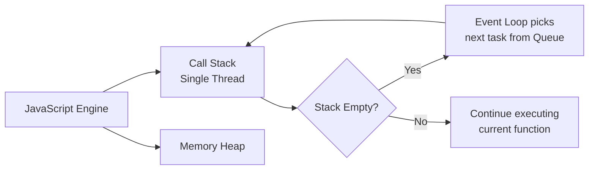

### Interview Questions — Execution Model

1. **Why is JavaScript called single-threaded?** — It has one call stack and processes one operation at a time. Concurrency is achieved through the event loop, not additional threads.
2. **If JavaScript is single-threaded, how does it handle async operations?** — Async tasks are delegated to the environment (browser APIs / libuv). When they complete, their callbacks enter a task queue and the event loop pushes them to the call stack when it is free.
3. **What is the difference between synchronous and asynchronous code execution in JavaScript?** — Synchronous code is executed line-by-line on the call stack. Asynchronous code is deferred, executing its callback only when the main stack is clear.
4. **What would happen if a synchronous function takes 10 seconds to run?** — It would block the entire thread, freezing the UI in a browser or preventing other requests in Node.js.

[↑ Back to Index](#table-of-contents)

---

## 2. Execution Context & Call Stack

Every time JavaScript code runs, it executes inside an **Execution Context**. The very first one created is the **Global Execution Context (GEC)**. Each function invocation creates a new **Function Execution Context (FEC)**, and these are managed by the **Call Stack**.

An execution context has two phases:

**Phase 1 — Memory Creation (Creation Phase):** The engine scans the code and allocates memory. Variables declared with `var` are stored with value `undefined`. Function declarations are stored in full (the entire function body). Variables declared with `let` and `const` are allocated but remain in the Temporal Dead Zone.

**Phase 2 — Code Execution:** The engine runs the code line by line. Variable values are assigned, functions are invoked, and expressions are evaluated. When a function is called, a brand new execution context is created with its own memory and code components, and it is pushed onto the call stack.

The **Call Stack** follows LIFO (Last In, First Out). When a function completes, its execution context is popped off. When the entire program finishes, the Global Execution Context is also removed.

### From the Repository — `ExecutionContext.js`

```js
var n = 2;

function square(num) {
    var ans = num * num;
    return ans;
}

var square2 = square(n);
var square4 = square(4);

console.log(square2, square4); // 4 16
```

**Step-by-step walkthrough:**

1. **GEC Creation Phase:** `n = undefined`, `square = fn{}`, `square2 = undefined`, `square4 = undefined`.
2. **GEC Execution:** `n = 2`. Then `square(n)` is invoked — a new FEC is pushed onto the stack.
3. **FEC for `square(2)`:** Creation — `num = undefined`, `ans = undefined`. Execution — `num = 2`, `ans = 4`, return `4`. FEC is popped.
4. **Back to GEC:** `square2 = 4`. Then `square(4)` is invoked — another FEC is pushed.
5. **FEC for `square(4)`:** `num = 4`, `ans = 16`, return `16`. FEC is popped.
6. **GEC continues:** `square4 = 16`. `console.log(4, 16)`. GEC is popped.

**JS object snapshot — what the engine holds in memory at each phase:**

```js
// ── GEC: Creation Phase (BEFORE any code runs) ────────────────────
// Engine scans the code, allocates memory — no code has executed yet
{
    n:       undefined,  // var → hoisted, value is undefined
    square:  [Function], // function declaration → FULLY hoisted with body
    square2: undefined,  // var → hoisted, value is undefined
    square4: undefined,  // var → hoisted, value is undefined
}

// ── GEC: Execution Phase — runs line by line ──────────────────────
// After `var n = 2`:
{ n: 2, square: [Function], square2: undefined, square4: undefined }

// `square(n)` is called → new FEC pushed onto the call stack:
{
    // FEC for square(2) — Creation Phase
    num: undefined,  // parameter treated like var
    ans: undefined,  // var → hoisted inside the function
}
// FEC Execution: num=2, ans=4, return 4 → FEC popped

// Back in GEC — after square(n) returns:
{ n: 2, square: [Function], square2: 4, square4: undefined }

// `square(4)` is called → second FEC pushed:
{
    // FEC for square(4) — after execution
    num: 4,
    ans: 16,  // return 16 → FEC popped
}

// GEC final state before program ends:
{ n: 2, square: [Function], square2: 4, square4: 16 }
```

**The call stack at each stage:**

```
[Step 1]  STACK: [ GEC ]                     → creation phase
[Step 2]  STACK: [ GEC ]                     → GEC execution starts
[Step 3]  STACK: [ GEC, FEC(square(2)) ]     → square called
[Step 4]  STACK: [ GEC ]                     → square(2) returned 4
[Step 5]  STACK: [ GEC, FEC(square(4)) ]     → square called again
[Step 6]  STACK: [ GEC ]                     → square(4) returned 16
[Step 7]  STACK: []                          → GEC popped, program ends
```

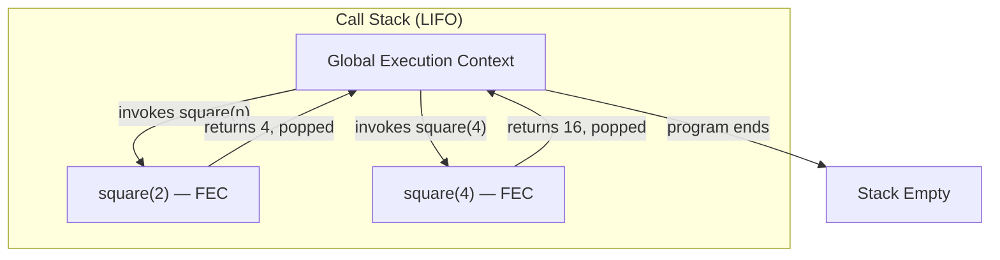

### Interview Questions — Execution Context

1. **What are the two phases of an execution context?** — Memory Creation Phase (variable and function declarations are stored) and Code Execution Phase (code runs line by line).
2. **What happens when a function is invoked?** — A new Function Execution Context is created, pushed onto the call stack, executed, and then popped off when the function returns.
3. **What is stored in the memory component during the creation phase?** — `var` variables store `undefined`, function declarations store the entire function body, and `let`/`const` are placed in the TDZ.
4. **What causes a stack overflow?** — Infinite or excessively deep recursion where function contexts keep being pushed without ever returning.
5. **Name alternative terms for the Call Stack.** — Execution Context Stack, Program Stack, Control Stack, Runtime Stack, Machine Stack.

[↑ Back to Index](#table-of-contents)

---

## 3. Hoisting

Hoisting is JavaScript's behavior of processing declarations during the **memory creation phase** before any code is executed. This means variables and function declarations are "moved to the top" of their scope conceptually — you can reference them before the line where they appear in the source code.

However, hoisting works differently for different declaration types:

- **`var` declarations** are hoisted and initialized with `undefined`. Accessing a `var` before its assignment line returns `undefined`, not an error.
- **Function declarations** are fully hoisted — both the name and the entire body are available before the declaration line.
- **`let` and `const`** are hoisted but are **not initialized**. They exist in a **Temporal Dead Zone (TDZ)** from the start of the block until the declaration is reached. Accessing them in the TDZ throws a `ReferenceError`.

The **Temporal Dead Zone** is the period between entering a scope and the variable being declared/initialized. It exists to enforce better coding practices and catch bugs where variables are used before they have meaningful values.

### From the Repository — `Hoisting.js`

```js
// getName(); // "Hello World undefined"
// console.log(x); // undefined
// console.log(getName); // [Function: getName]

var x = 7;

function getName() {
    console.log("Hello World", z); // Hello World, undefined
}

getName(); // Hello World undefined
console.log(x); // 7
var z = 1;
```

In this example, calling `getName()` before its declaration works perfectly because function declarations are fully hoisted. Accessing `x` before `var x = 7` would yield `undefined` because `var` is hoisted with that placeholder value. The variable `z` inside `getName` is also `undefined` when `getName` is called before `var z = 1` is executed.

**Memory snapshot — the two phases in action:**

```js
// ── Creation Phase: engine scans ALL code BEFORE running any of it ─
{
    x:       undefined,   // var → name hoisted, value placeholder = undefined
    z:       undefined,   // var → name hoisted, value placeholder = undefined
    getName: [Function],  // function declaration → ENTIRE body stored here
}
// Note: the ASSIGNMENT `x = 7` and `z = 1` have NOT happened yet.
// Only the names exist, all var names hold undefined.

// ── Execution Phase: runs line by line ──────────────────────────────
// Line 5: var x = 7
{ x: 7, z: undefined, getName: [Function] }

// Line 7-9: function getName() { ... }  → already in memory, SKIPPED

// Line 11: getName()  → called here, z is still undefined!
//   Inside getName: console.log("Hello World", z) → "Hello World undefined"

// Line 12: console.log(x) → 7  (x was assigned on line 5)
{ x: 7, z: undefined, getName: [Function] }

// Line 13: var z = 1
{ x: 7, z: 1, getName: [Function] }
// Too late — getName() already ran when z was undefined
```

**Hoisting rules summarized as memory states:**

```js
// Before any line runs — what `var` vs `let/const` vs function look like:

// var:
var score = 100;
// Creation phase: score = undefined   ← immediately accessible
// Execution phase: score = 100

// let / const:
let name = "Prashant";
// Creation phase: name = [TDZ]        ← exists but BLOCKS access
// Execution phase: name = "Prashant"

// function declaration:
function greet() {
    return "hi";
}
// Creation phase: greet = [Function]  ← FULL body hoisted
// Execution phase: nothing to do, already set

// function expression (var):
var sayHi = function () {
    return "hi";
};
// Creation phase: sayHi = undefined   ← only the var name hoisted
// Execution phase: sayHi = [Function] ← assigned at this line
```

### Interview Questions — Hoisting

1. **What is hoisting?** — The mechanism where variable and function declarations are placed in memory during the creation phase, making them accessible before their source-code position.
2. **What is the Temporal Dead Zone?** — The period between scope entry and variable declaration for `let`/`const`, during which access throws a `ReferenceError`.
3. **Why does `console.log(x)` print `undefined` before a `var x = 5` line?** — Because `var x` is hoisted and initialized to `undefined` during the creation phase; the assignment `= 5` happens only during execution.
4. **Can you access a `let` variable before its declaration?** — No. It throws a `ReferenceError` because it is in the Temporal Dead Zone.
5. **Are function expressions hoisted?** — The variable name is hoisted (if `var`), but its value is `undefined` — so calling it throws `TypeError: not a function`.

[↑ Back to Index](#table-of-contents)

---

## 4. Scope — Lexical Scope, Scope Chain & Block Scope

**Scope** defines where a variable can be accessed in your code. JavaScript has four types of scope: **global scope**, **function scope**, **block scope** (introduced with ES6), and **module scope**.

---

### Global Scope

Variables declared outside any function or block live in the global scope. In a browser they become properties of `window`; in Node.js they attach to `global`. Every function and block can read and write global variables through the scope chain.

```js
var globalVar = "I am global";

function show() {
    console.log(globalVar); // accessible — found via scope chain
}
show();
console.log(globalVar); // accessible everywhere
```

---

### Function Scope

Every function creates its own scope. Variables declared with `var` inside a function are **function-scoped** — they exist only within that function and are invisible outside it, even if the function is called from a different place. Each function call creates a fresh, independent scope.

```js
function outer() {
    var x = 10; // function-scoped to outer

    function inner() {
        var y = 20; // function-scoped to inner
        console.log(x); // 10 — inner can see outer's variables (lexical scope)
        console.log(y); // 20
    }

    inner();
    console.log(x); // 10
    // console.log(y); // ReferenceError — y is not visible here
}

outer();
// console.log(x); // ReferenceError — x is not visible outside outer
```

Key rule: **`var` ignores blocks but respects function boundaries.** A `var` declared inside an `if` or `for` leaks out to the enclosing function (or global), but it cannot escape the function it lives in.

```js
function test() {
    if (true) {
        var leaked = "I leak out of the if block";
        let blocked = "I stay inside the block";
    }
    console.log(leaked); // "I leak out of the if block" — var leaked out
    // console.log(blocked); // ReferenceError — let did not leak
}
test();
// console.log(leaked); // ReferenceError — var cannot escape the function
```

---

### Lexical Scope (Static Scope)

**Lexical scope** means that the scope of a variable is determined by **where it is written in the source code**, not by where or how the function is called at runtime. JavaScript resolves variable names at author-time (lexically), not at call-time (dynamically).

The word "lexical" refers to the text/source — the JavaScript engine looks at the physical nesting of functions in the code to decide what each function can access.

```js
var name = "Global";

function outer() {
    var name = "Outer"; // shadows global name inside outer

    function inner() {
        // inner is LEXICALLY inside outer — it sees outer's `name`, not global's
        console.log(name); // "Outer" — lexical scope, not call-site scope
    }

    inner();
}

outer(); // "Outer"
```

**Why call-site doesn't matter — the key insight:**

```js
var value = "global";

function getValue() {
    return value; // closed over the LEXICAL scope where it was defined
}

function run() {
    var value = "local"; // this does NOT affect getValue
    console.log(getValue()); // "global" — lexical scope wins
}

run(); // "global"
```

Even though `getValue()` is called from inside `run()` (which has its own `value`), `getValue` still sees `"global"` because its scope was established where it was **written** — at the top level — not where it was called.

**Lexical scope is the foundation of closures.** When an inner function is returned and called elsewhere, it carries its lexical scope with it — that's what makes closures possible.

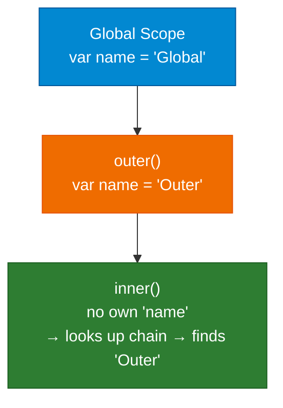

---

### Scope Chain

When a variable is accessed, JavaScript performs a **scope chain lookup**: it first checks the current (local) scope, then the parent scope, then the grandparent scope, and so on up to the global scope. If the variable is not found anywhere in the chain, a `ReferenceError` is thrown.

The scope chain is **fixed at definition time** — it follows the lexical nesting of the source code.

**Scope chain as a JS object snapshot:**

```js
var globalX  = "G";
function outer() {
    var outerX = "O";
    function inner() {
        var innerX = "I";
        console.log(innerX);  // "I"  → own scope
        console.log(outerX);  // "O"  → outer's scope
        console.log(globalX); // "G"  → global scope
    }
    inner();
}
outer();

// The scope chain that `inner` sees at definition time:
// inner scope object:
{
    innerX: "I",
    // [[Scope]] (outer environment):
    parent: {
        outerX: "O",
        // [[Scope]] (global environment):
        parent: {
            globalX: "G",
            outer: [Function],
            parent: null  // end of chain
        }
    }
}

// When inner tries to access `outerX`:
// 1. Check inner's own scope    → outerX NOT found
// 2. Check parent (outer)       → outerX FOUND = "O"  ✅  stop

// When inner tries to access `z` (doesn't exist anywhere):
// 1. Check inner's own scope    → NOT found
// 2. Check outer's scope        → NOT found
// 3. Check global scope         → NOT found
// 4. parent = null              → STOP → ReferenceError: z is not defined
```

**Block scope** applies to variables declared with `let` and `const` inside any block delimited by curly braces `{}` — `if`, `for`, `while`, or standalone blocks. These variables are only accessible within that block. Variables declared with `var` ignore block boundaries and are scoped to the enclosing function or the global scope.

---

### Shadowing & Illegal Shadowing

**Shadowing** occurs when a variable declared in an inner scope has the same name as one in an outer scope. The inner variable "shadows" the outer one within that block. However, **illegal shadowing** happens when you try to shadow a `let` variable with a `var` in the same function scope — this causes a `SyntaxError`.

```js
let x = 1;
{
    let x = 2; // ✅ legal — let shadowing let inside a block
    console.log(x); // 2
}

function test() {
    var x = 3; // ✅ legal — var inside a function that shadows outer let
}

{
    var x = 4; // ❌ SyntaxError: Illegal shadowing — var cannot shadow let in same scope
}
```

---

### From the Repository — `ScopeChain.js`

```js
function a() {
    c();
    function c() {
        console.log(b); // 10 — found via scope chain (global)
    }
}

var b = 10;
a();
```

Here, `c()` is nested inside `a()`. When `c()` tries to access `b`, it looks in its own scope (not found), then in `a()`'s scope (not found), then in the global scope (found: `b = 10`). This is the scope chain in action.

### From the Repository — `BlockScope.js`

```js
var a = "hello 1";
let b = "not overridden";
{
    let a = "hello 1"; // shadows outer 'a' within this block only
    let b = "hello 2"; // shadows outer 'b' within this block
    {
        let a = "Hi";
        console.log(a, b); // "Hi" "hello 2"
    }
}

{
    var a = 10; // overwrites global var a (var is not block-scoped)
    let b = 20; // block-scoped, does not affect outer b
    const c = 30;
}

console.log(a); // 10  (var was overwritten)
console.log(b); // "not overridden"  (let was block-scoped)
// console.log(c); // ReferenceError
```

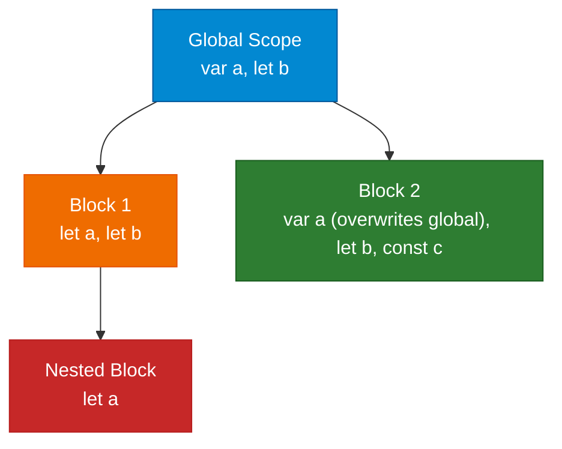

### Interview Questions — Scope

1. **What is lexical scope?** — Scope determined by the physical location of code in the source. Inner functions can access outer function variables because they are lexically enclosed — not because of where the function is called.
2. **Does the call site affect lexical scope?** — No. JavaScript uses static (lexical) scope. The scope chain is fixed at definition time. Even if a function is called from a different context, it still sees variables from where it was written.
3. **What is function scope?** — Variables declared with `var` inside a function are scoped to that function. They are visible throughout the whole function but invisible outside it.
4. **Why does `var` leak out of `if` blocks but not functions?** — Because `var` is function-scoped, not block-scoped. It ignores `{}` blocks unless those blocks are function bodies.
5. **Explain the scope chain.** — The series of nested scopes that JavaScript traverses (local → parent → grandparent → global) when looking up a variable. It follows the lexical nesting of the source code.
6. **What is the difference between function scope and block scope?** — `var` creates function-scoped variables (visible throughout the function). `let`/`const` create block-scoped variables (visible only within `{}`).
7. **What is variable shadowing?** — When a variable in an inner scope has the same name as one in an outer scope, the inner one takes precedence within that scope.
8. **What is illegal shadowing?** — Attempting to shadow a `let` with a `var` in the same enclosing scope, which causes a `SyntaxError`. Shadowing `let` with `let` or with `var` inside a function body is allowed.

[↑ Back to Index](#table-of-contents)

---

## 5. Variable Declarations — var, let, const

JavaScript provides three keywords to declare variables: `var`, `let`, and `const`. They differ in three key dimensions — **scope**, **hoisting behavior**, and **reassignment rules**. Understanding these differences is fundamental to writing predictable JavaScript.

---

### `var` — The Old Way

`var` was the only way to declare variables before ES6 (2015). It is **function-scoped** — a `var` lives inside the nearest enclosing function, or in the global scope if declared outside any function. It completely ignores block boundaries (`if`, `for`, `while`, `{}`).

`var` is **hoisted** to the top of its function scope and automatically initialized to `undefined` during the memory creation phase. This means you can reference a `var` variable before its declaration line without an error — you just get `undefined`.

`var` also allows **redeclaration** in the same scope without any error, which makes it easy to accidentally overwrite a variable.

```js
function example() {
    console.log(x); // undefined — hoisted but not yet assigned
    var x = 10;
    console.log(x); // 10

    if (true) {
        var x = 99; // SAME variable — var ignores the block
    }
    console.log(x); // 99 — overwritten inside the if block!
}
example();
```

This leaking behavior is a common source of bugs, which is why `var` is avoided in modern code.

---

### `let` — Block-Scoped and TDZ-Protected

`let` was introduced in ES6 to fix the problems with `var`. It is **block-scoped** — a `let` variable exists only within the `{}` block where it is declared. It cannot leak out of `if`, `for`, or any other block.

`let` is also **hoisted**, but unlike `var`, it is NOT initialized. Instead, it sits in the **Temporal Dead Zone (TDZ)** from the start of its block until the declaration line is reached. Accessing it in the TDZ throws a `ReferenceError`.

`let` does NOT allow redeclaration in the same scope, but it does allow reassignment.

```js
{
    // TDZ starts here for `y`
    // console.log(y); // ReferenceError: Cannot access 'y' before initialization
    let y = 5; // TDZ ends — y is now initialized
    console.log(y); // 5
    y = 10; // ✅ reassignment allowed
    console.log(y); // 10
}
// console.log(y); // ReferenceError — y is block-scoped

// No redeclaration:
let a = 1;
// let a = 2; // SyntaxError: Identifier 'a' has already been declared
```

---

### `const` — Immutable Binding

`const` shares all the block-scoping and TDZ behavior of `let`. The key difference is that a `const` binding **cannot be reassigned** after initialization — and it **must be initialized** at the time of declaration.

Important distinction: `const` makes the **binding** (the variable itself) immutable, not the **value**. If the value is an object or array, its contents can still be mutated.

```js
const PI = 3.14159;
// PI = 3; // TypeError: Assignment to constant variable

// const without initialization is a SyntaxError:
// const x; // SyntaxError: Missing initializer in const declaration

// const with objects — binding is locked, contents are not:
const user = { name: "Prashant", age: 25 };
user.age = 26; // ✅ mutating the object is fine
user.city = "Hyderabad"; // ✅ adding a property is fine
// user = {};        // ❌ TypeError — reassigning the binding is not allowed
console.log(user); // { name: 'Prashant', age: 26, city: 'Hyderabad' }
```

---

### Comparison Table

| Feature            | `var`                               | `let`                          | `const`                        |
| ------------------ | ----------------------------------- | ------------------------------ | ------------------------------ |
| Scope              | Function                            | Block                          | Block                          |
| Hoisted?           | ✅ Yes (initialized to `undefined`) | ✅ Yes (TDZ — not initialized) | ✅ Yes (TDZ — not initialized) |
| Reassignable?      | ✅ Yes                              | ✅ Yes                         | ❌ No                          |
| Redeclarable?      | ✅ Yes                              | ❌ No                          | ❌ No                          |
| Requires init?     | ❌ No                               | ❌ No                          | ✅ Yes                         |
| Leaks from blocks? | ✅ Yes                              | ❌ No                          | ❌ No                          |

---

### The Temporal Dead Zone — Visualized

The TDZ is not about hoisting being absent for `let`/`const` — they ARE hoisted. The engine knows about them from the start. But they are put in an "uninitialized" state until their declaration line is executed. Any access before that line is an error.

```js
{
    // ← TDZ for `name` begins here (engine knows it exists but blocks access)
    // console.log(name); // ReferenceError: Cannot access 'name' before initialization
    console.log(typeof name); // ReferenceError — even typeof is blocked in TDZ
    let name = "Prashant"; // ← TDZ ends here
    console.log(name); // "Prashant"
}
```

> Note: `typeof` normally never throws — it returns `"undefined"` for undeclared variables. But inside the TDZ, even `typeof` throws a `ReferenceError`, proving the engine knows the variable exists.

**TDZ as a memory state — visualized:**

```js
// ── Block enters scope ────────────────────────────────────────────
// Engine knows about `name` and `PI` from this point.
// But they are UNINITIALIZED — any access throws immediately.
{
    name: [TDZ],  // ← engine allocated the slot but it is EMPTY
    PI:   [TDZ],  // ← same — exists but is not initialized yet
}

// Trying to access in TDZ:
console.log(name);  // ❌ ReferenceError: Cannot access 'name' before initialization
typeof name;        // ❌ ReferenceError — even typeof throws here!
                    // (proof: engine KNOWS name exists — not "undeclared",
                    //  just not yet initialized)

const PI = 3.14;   // ← TDZ for PI ends here
let name = "Prashant"; // ← TDZ for name ends here

// memory after declarations:
{
    name: "Prashant",  // ✅ now initialized
    PI:   3.14,        // ✅ now initialized and const (cannot be reassigned)
}
```

**Side-by-side: `var` vs `let` — same code, different behavior:**

```js
// With var — no TDZ, immediately accessible as undefined:
console.log(a); // undefined  ← NO error, var was hoisted + initialized
var a = 5;
console.log(a); // 5

// With let — TDZ protects the zone before declaration:
console.log(b); // ❌ ReferenceError  ← TDZ is active
let b = 5;
console.log(b); // 5

// The error message TELLS you the difference:
// var undeclared: "x is not defined"      ← engine does NOT know x
// let TDZ:        "Cannot access 'b' before initialization"  ← engine KNOWS b, just blocked
```

---

### From the Repository — `FunctionsAndVarEnv.js`

```js
var x = 1;
a();
b();

console.log(x); // 1 — Global Scope

function a() {
    var x = 10;
    console.log(x); // 10 — function scope
}

function b() {
    var x = 100;
    console.log(x); // 100 — function scope
}

const xarrfn = () => {
    console.log(x); // 1 — scope chain picks from global
};

xarrfn();
```

Each function has its own `var x`, which is function-scoped and independent. The arrow function `xarrfn` has no local `x`, so the scope chain resolves to the global `x = 1`.

### Interview Questions — Variable Declarations

1. **What are the differences between `var`, `let`, and `const`?** — `var` is function-scoped and hoisted with `undefined`; `let` is block-scoped and in the TDZ; `const` is like `let` but cannot be reassigned.
2. **Can you mutate a `const` object?** — Yes. `const` prevents reassignment of the variable binding, not mutation of the value. `const obj = {}; obj.x = 1;` is valid.
3. **Why should you avoid `var` in modern code?** — It leads to scope leaks (not block-scoped), allows redeclaration, and makes hoisting behavior confusing.
4. **What happens if you use `let` before its declaration?** — A `ReferenceError` because of the Temporal Dead Zone.

[↑ Back to Index](#table-of-contents)

---

# Phase 2 — Functions & Core Patterns

---

## 6. Functions — First-Class Citizens

### What Does "First-Class" Mean?

In JavaScript, functions are **first-class citizens** — they are treated like any other value. This means a function can be:

- Assigned to a variable: `const fn = function() {}`
- Passed as an argument to another function (callback)
- Returned from another function (higher-order function / closure)
- Stored in an array or object
- Have properties and methods attached to it

This is possible because under the hood, **every function is an object** in JavaScript. Functions have a special internal `[[Call]]` slot that makes them executable, but they are still objects — they have a `prototype` property, they can hold key-value pairs, and they inherit from `Function.prototype`.

```js
function greet() {
    return "hello";
}

greet.language = "English"; // functions can have properties
greet.describe = function () {
    return "A greeting function";
};

console.log(greet.language); // "English"
console.log(greet.name); // "greet" — built-in name property
console.log(greet.length); // 0 — number of declared parameters
console.log(typeof greet); // "function"
console.log(greet instanceof Object); // true — functions are objects
```

---

### Ways to Define Functions

**1. Function Declaration (Statement)**
Defined with the `function` keyword at the statement level. Fully hoisted — the engine stores the entire function body in memory during the creation phase, so it can be called before its line in the source.

```js
greet(); // ✅ works — fully hoisted
function greet() {
    console.log("hello");
}
```

**2. Function Expression**
A function assigned to a variable. The variable is hoisted (as `undefined` if `var`), but the function value is not assigned until execution reaches that line. Calling it before that line throws a `TypeError`.

```js
// sayHi(); // ❌ TypeError: sayHi is not a function (var hoisted as undefined)
var sayHi = function () {
    console.log("hi");
};
sayHi(); // ✅ works after the assignment line
```

**3. Named Function Expression**
A function expression with an internal name. The name is only accessible inside the function itself (useful for recursion and better stack traces). Outside the function, only the variable name is used.

```js
const factorial = function fact(n) {
    return n <= 1 ? 1 : n * fact(n - 1); // `fact` is accessible inside
};
console.log(factorial(5)); // 120
// console.log(fact); // ReferenceError — not accessible outside
```

**4. Arrow Function**
A concise ES6 syntax introduced in ES6. Has no own `this`, no `arguments` object, cannot be a constructor, and has no `prototype` property. Covered in depth in Section 7.

```js
// Concise body — implicit return (no braces, no `return` keyword)
const double = (n) => n * 2;
console.log(double(5)); // 10

// Single parameter — parentheses optional
const square = (n) => n * n;
console.log(square(4)); // 16

// No parameters — empty parentheses required
const greet = () => "Hello!";
console.log(greet()); // "Hello!"

// Block body — explicit return needed
const add = (a, b) => {
    const sum = a + b;
    return sum;
};
console.log(add(3, 4)); // 7

// Returning an object literal — wrap in parentheses to avoid ambiguity
const makeUser = (name, age) => ({ name, age });
console.log(makeUser("Prashant", 25)); // { name: "Prashant", age: 25 }

// Arrow functions in array methods
const nums = [1, 2, 3, 4, 5];
const doubled = nums.map((n) => n * 2); // [2, 4, 6, 8, 10]
const evens = nums.filter((n) => n % 2 === 0); // [2, 4]
const total = nums.reduce((acc, n) => acc + n, 0); // 15
```

**5. IIFE (Immediately Invoked Function Expression)**
A function that is defined and called in the same expression. Creates its own scope, which was the pre-ES6 way to avoid polluting the global scope.

```js
const result = (function () {
    const private = "I am isolated";
    return private.toUpperCase();
})(); // called immediately

console.log(result); // "I AM ISOLATED"
// console.log(private); // ReferenceError — not accessible
```

---

### Parameters vs Arguments

**Parameters** are the named placeholders in the function definition. **Arguments** are the actual values passed at call time. JavaScript does not enforce that the number of arguments matches parameters — extra arguments are ignored, missing ones become `undefined`.

```js
function add(a, b) {
    // a, b are PARAMETERS
    console.log(arguments); // Arguments object — available in regular functions
    return a + b;
}

add(3, 5); // 3 and 5 are ARGUMENTS → returns 8
add(3); // b is undefined → returns NaN
add(3, 5, 9); // 9 is extra — ignored, but visible in `arguments`
```

**Default parameters** (ES6) let you provide fallback values:

```js
function greet(name = "World") {
    return `Hello, ${name}!`;
}
console.log(greet()); // "Hello, World!"
console.log(greet("Prashant")); // "Hello, Prashant!"
```

---

### From the Repository — `FirstClassFunctions.js`

```js
function fn() {
    console.log(this);
    console.log(this.x);
}
fn.x = 10; // Functions can have properties!

console.log(fn.apply(fn));

// Function Statement (Declaration)
function a(param1, param2 = 0) {
    console.log("a");
}

// Function Expression
let b = function () {
    console.log("b");
};

// Named Function Expression
let c = function c1() {
    console.log("c1");
};

// First-class: passing function as argument, returning function
function fun1(cb) {
    return cb;
}

function cb() {
    console.log("Im cb");
}

fun1(cb)(); // "Im cb"
```

Notice how `fn.x = 10` attaches a property to a function — possible because functions are objects. The pattern `fun1(cb)()` demonstrates passing a function reference and then immediately invoking the returned value.

### Interview Questions — Functions

1. **What does it mean for functions to be first-class citizens?** — Functions can be assigned to variables, passed as arguments, returned from other functions, and have properties — they are treated like any other value.
2. **What is the difference between a function declaration and a function expression?** — Declarations are fully hoisted (callable before their line). Expressions are assigned to variables and follow the hoisting rules of that variable.
3. **What are the key differences between arrow functions and regular functions?** — Arrow functions have no own `this` (lexical), no `arguments` object, cannot be used with `new`, and have a concise syntax.
4. **Can you add properties to a function?** — Yes, functions are objects and can have properties and methods added to them.
5. **What is an IIFE?** — An Immediately Invoked Function Expression is a function that runs as soon as it is defined. It creates its own scope, useful for avoiding global pollution: `(function() { /* code */ })()`.
6. **What is the difference between parameters and arguments?** — Parameters are the variable names listed in the function definition. Arguments are the actual values passed when the function is called.

[↑ Back to Index](#table-of-contents)

---

## 7. Arrow Functions vs Regular Functions — Deep Dive

Arrow functions are not just shorter syntax — they have fundamentally different behavior in several key areas.

### Syntax Comparison

```js
// Regular function
function greet(name) {
    return `Hello, ${name}!`;
}

// Arrow function — concise body (implicit return)
const greet = (name) => `Hello, ${name}!`;

// Arrow function — block body (explicit return needed)
const greet = (name) => {
    return `Hello, ${name}!`;
};
```

### Key Differences

| Feature                      |      Regular Function       |             Arrow Function              |
| ---------------------------- | :-------------------------: | :-------------------------------------: |
| `this` binding               | Dynamic (depends on caller) | Lexical (inherits from enclosing scope) |
| `arguments` object           |        ✅ Available         |  ❌ Not available (use rest `...args`)  |
| Can be a constructor (`new`) |           ✅ Yes            |        ❌ No — throws TypeError         |
| Has `prototype` property     |           ✅ Yes            |                  ❌ No                  |
| Hoisted                      | ✅ (function declarations)  |        ❌ (treated as variable)         |
| `super` binding              |           Dynamic           |                 Lexical                 |
| `new.target`                 |          Available          |              Not available              |

### `this` — The Critical Difference

```js
const obj = {
    name: "Prashant",

    // Regular function — `this` is the calling object
    regularGreet: function () {
        console.log(this.name); // "Prashant"
    },

    // Arrow function — `this` is inherited from where the object was defined
    arrowGreet: () => {
        console.log(this.name); // undefined (inherits outer `this`)
    },

    // Common pattern: arrow inside method preserves `this`
    delayedGreet: function () {
        setTimeout(() => {
            console.log(this.name); // "Prashant" — arrow inherits from delayedGreet
        }, 100);
    },

    // Problem: regular function in setTimeout loses `this`
    brokenGreet: function () {
        setTimeout(function () {
            console.log(this.name); // undefined — `this` is global/undefined
        }, 100);
    },
};
```

### No `arguments` Object

```js
function regular() {
    console.log(arguments); // [1, 2, 3] — Arguments object
}
regular(1, 2, 3);

const arrow = (...args) => {
    // console.log(arguments); // ReferenceError — not available!
    console.log(args); // [1, 2, 3] — use rest parameters instead
};
arrow(1, 2, 3);
```

### Cannot Be Used as Constructor

```js
function Person(name) {
    this.name = name;
}
const p = new Person("Alice"); // ✅ Works

const Animal = (name) => {
    this.name = name;
};
// const a = new Animal("Dog"); // ❌ TypeError: Animal is not a constructor
```

Arrow functions don't have a `prototype` property and cannot be used with `new`. This is because they don't have their own `this` — `new` has no way to bind a newly created object to them.

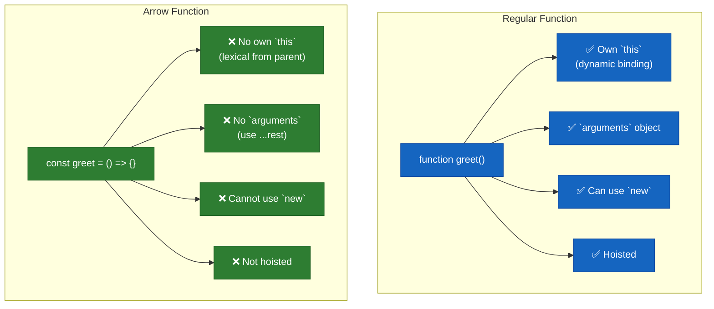

### When to Use Which

| Scenario                                    | Use                                                          |
| ------------------------------------------- | ------------------------------------------------------------ |
| Object methods                              | Regular function (needs its own `this`)                      |
| `addEventListener` callbacks                | Regular function (to access `event.currentTarget` as `this`) |
| `setTimeout`/`setInterval` inside methods   | Arrow function (to preserve outer `this`)                    |
| Array callbacks (`map`, `filter`, `reduce`) | Arrow function (concise, doesn't need own `this`)            |
| Constructors                                | Regular function or class                                    |
| Short utility functions                     | Arrow function                                               |

### Interview Questions — Arrow vs Regular

1. **What is the main difference between arrow and regular functions?** — Arrow functions don't have their own `this`, `arguments`, `super`, or `new.target`. They inherit `this` lexically from the enclosing scope.
2. **Can arrow functions be used as constructors?** — No. They throw a TypeError with `new` because they lack a `prototype` property and cannot bind `this`.
3. **Why use an arrow function inside `setTimeout`?** — To preserve the `this` of the enclosing method. A regular function would have its own `this` (global or undefined).
4. **How do you access arguments in an arrow function?** — Using rest parameters `(...args)` since arrow functions don't have the `arguments` object.

[↑ Back to Index](#table-of-contents)

---

## 8. The `this` Keyword

### What Is `this`?

`this` is a special keyword that is automatically set by JavaScript every time a function is invoked. It refers to the **context object** — the object that "owns" or is associated with the current execution.

Unlike most other languages (Java, C#) where `this` always refers to the current class instance, **JavaScript's `this` is dynamic** — it is determined entirely by how the function is called, not where it is written (except in arrow functions, which use lexical `this`).

Think of `this` as an invisible extra argument that JavaScript passes into every regular function call. The value of that argument depends on the call pattern.

---

### The Four Binding Rules (Priority Order)

Whenever you see a function call, ask yourself: **how is it being called?** There are exactly four patterns, and they have a strict priority order:

### 8.1 `new` Binding (Highest Priority)

When a function is called with the `new` keyword, JavaScript performs these steps automatically:

1. Creates a brand new empty object `{}`
2. Sets the new object's `__proto__` to `Constructor.prototype`
3. Sets `this` inside the function to the new object
4. Executes the function body
5. Returns the new object (unless the function explicitly returns a different object)

```js
function Person(name, age) {
    this.name = name; // `this` = the newly created object
    this.age = age;
}
const p = new Person("Prashant", 25);
console.log(p.name); // "Prashant"
console.log(p.age); // 25
```

### 8.2 Explicit Binding — `call`, `apply`, `bind`

You can **force** `this` to be whatever object you choose using these three methods. All three let you borrow a function and run it in a different context.

- **`call(thisArg, arg1, arg2, ...)`** — Invokes the function immediately. Arguments passed as comma-separated values.
- **`apply(thisArg, [argsArray])`** — Invokes immediately. Arguments passed as a single array — useful when you already have arguments in an array.
- **`bind(thisArg, arg1, ...)`** — Does NOT invoke immediately. Returns a **new function** with `this` permanently locked to `thisArg`. The original function is unchanged.

```js
function introduce(city, country) {
    console.log(`${this.name} from ${city}, ${country}`);
}

const dev = { name: "Prashant" };

introduce.call(dev, "Hyderabad", "India"); // "Prashant from Hyderabad, India"
introduce.apply(dev, ["Hyderabad", "India"]); // same result, array syntax

const boundFn = introduce.bind(dev, "Hyderabad"); // lock `this` + first arg
boundFn("India"); // "Prashant from Hyderabad, India" — called later
```

### 8.3 Implicit Binding

When a function is called as a **method of an object** using dot notation (`obj.method()`), `this` refers to the object to the left of the dot at the time of the call.

```js
const user = {
    name: "Prashant",
    greet() {
        console.log(`Hello, I am ${this.name}`);
    },
};
user.greet(); // "Hello, I am Prashant" — `this` = user
```

**Implicit binding is lost when you extract the method:**

```js
const greet = user.greet; // just copying the function reference
greet(); // "Hello, I am undefined" — `this` = global (default binding takes over!)
```

This "binding loss" is one of the most common `this`-related bugs. The fix is to use `.bind()` or an arrow function wrapper.

**The 3 most common ways `this` gets lost — each with a fix:**

```js
const user = {
    name: "Prashant",
    greet() {
        return `Hi, I am ${this.name}`;
    },
};

// ── Bug 1: Assigning a method to a variable ─────────────────────────
const fn = user.greet; // detached from `user` — just a plain function now
fn(); // "Hi, I am undefined"  ❌  (default binding)
// Fix: bind `this` permanently
const boundFn = user.greet.bind(user);
boundFn(); // "Hi, I am Prashant"  ✅

// ── Bug 2: Passing a method as a callback ────────────────────────────
setTimeout(user.greet, 0); // "Hi, I am undefined"  ❌
// Fix 1: wrap in arrow (preserves call context)
setTimeout(() => user.greet(), 0); // "Hi, I am Prashant"  ✅
// Fix 2: bind
setTimeout(user.greet.bind(user), 0); // ✅

// ── Bug 3: Regular function inside a method ───────────────────────────
const app = {
    title: "MyApp",
    buttons: ["OK", "Cancel"],
    render() {
        // ❌ regular function — `this` is NOT the app object
        this.buttons.forEach(function (btn) {
            console.log(this.title + " - " + btn); // "undefined - OK"
        });

        // ✅ arrow function — inherits `this` from render() = app
        this.buttons.forEach((btn) => {
            console.log(this.title + " - " + btn); // "MyApp - OK"
        });
    },
};
app.render();
```

**`call` vs `apply` vs `bind` — side-by-side decision guide:**

```js
function introduce(city, country) {
    return `${this.name} lives in ${city}, ${country}`;
}
const dev = { name: "Prashant" };

// call — invoke NOW, args one by one
console.log(introduce.call(dev, "Hyderabad", "India"));

// apply — invoke NOW, args as array (useful when args already in an array)
const location = ["Hyderabad", "India"];
console.log(introduce.apply(dev, location));

// bind — DON'T invoke now, returns a new function with `this` locked
const myIntro = introduce.bind(dev, "Hyderabad"); // city pre-filled
console.log(myIntro("India")); // call it later
console.log(myIntro("India")); // reuse as many times as needed

// Rule of thumb:
// Need to call now?      → call / apply
// Need to call later?    → bind
// Args as array?         → apply (or call with spread: fn.call(ctx, ...arr))
```

When none of the above patterns apply — the function is called as a plain standalone function — `this` defaults to:

- The **global object** (`window` in browser, `global` in Node.js) in non-strict mode
- **`undefined`** in strict mode (`'use strict'`)

```js
function whoAmI() {
    console.log(this); // global object (or undefined in strict mode)
}
whoAmI(); // called standalone → default binding
```

---

### Arrow Functions and `this`

Arrow functions are different — they do **not** have their own `this`. Instead, they capture `this` from their **lexical enclosing scope** at the time they are defined. This is called **lexical `this`**.

This makes arrow functions ideal for callbacks and `setTimeout` inside methods, where you want to preserve the outer `this`:

```js
const timer = {
    name: "countdown",
    start() {
        // Arrow function inherits `this` from start() — which is `timer`
        setTimeout(() => {
            console.log(this.name); // "countdown" ✅
        }, 1000);

        // Regular function would lose `this`:
        setTimeout(function () {
            console.log(this.name); // undefined ❌ (default binding)
        }, 1000);
    },
};
timer.start();
```

---

### From the Repository — `__this.js`

```js
// Default Binding
function show() {
    console.log(this); // global object (non-strict) / undefined (strict)
}

// Implicit Binding
const user = {
    name: "Prashant",
    say() {
        console.log(this.name); // "Prashant"
    },
};
user.say();

// Explicit Binding
let customer1 = { firstName: "Prashant", lastName: "Chevula" };
let customer2 = { firstName: "Raju", lastName: "Chevula" };

let printFullName = function (hometown) {
    console.log(this.firstName + " " + this.lastName + " " + hometown);
};

printFullName.call(customer1, "Hyderabad"); // call — comma-separated args
printFullName.apply(customer1, ["Hyderabad"]); // apply — array of args
let printMyName = printFullName.bind(customer2, "Hyderabad");
printMyName(); // bind — returns new function

// new Binding
function User(name) {
    this.name = name;
}
User.prototype.sayName = function () {
    console.log(this.name);
};
const u1 = new User("Prashant");
u1.sayName(); // "Prashant"
```

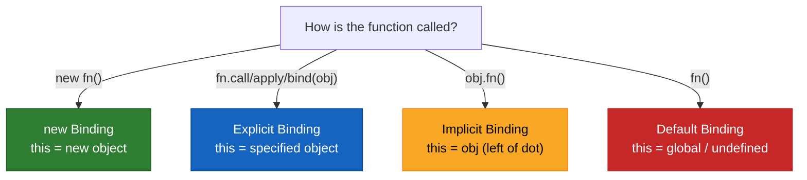

### Interview Questions — `this`

1. **What determines the value of `this` in JavaScript?** — The call site — how the function is invoked, not where it is defined (except for arrow functions).
2. **What is the priority order of `this` binding rules?** — `new` > `bind`/`call`/`apply` > implicit (object dot) > default (standalone call).
3. **What is the difference between `call`, `apply`, and `bind`?** — `call` and `apply` invoke the function immediately (`call` takes comma-separated args, `apply` takes an array). `bind` returns a new function with `this` permanently set.
4. **What happens to `this` when you extract a method from an object?** — The implicit binding is lost. `const fn = obj.method; fn();` uses default binding, not implicit.
5. **How does `this` work in arrow functions?** — Arrow functions have no own `this`. They inherit `this` from the enclosing lexical scope at definition time.
6. **What does the `new` keyword do internally?** — Creates a new empty object, sets `this` to that object, links the object's prototype to the constructor's `prototype`, executes the function body, and returns the object.

[↑ Back to Index](#table-of-contents)

---

## 9. Closures

A **closure** is the combination of a function bundled together with references to its **lexical environment** (the variables that were in scope when the function was created). When a function is returned from another function, it "remembers" the variables from its birthplace even after the outer function has finished executing.

Closures exist because of three properties of JavaScript:

1. Functions are **first-class** — they can be returned and passed around.
2. Functions retain a reference to their **lexical scope**.
3. Variables captured by a closure live on the **heap**, not the stack, so they survive beyond the outer function's lifetime.

Closures are used for **data hiding / encapsulation**, **module patterns**, **memoization**, **event handlers**, **iterators**, and anywhere private state is needed without classes.

### From the Repository — `Closures.js`

```js
// Counter using closure — data encapsulation
function counter(x) {
    let counter = 0;
    return {
        increment() {
            return (counter = counter + (x || 1));
        },
        decrement() {
            return (counter = counter - (x || 1));
        },
    };
}

const counter1 = counter(1);
console.log(counter1.increment()); // 1
console.log(counter1.increment()); // 2
console.log(counter1.decrement()); // 1
console.log(counter1.increment()); // 2

const counter2 = counter(2);
console.log(counter2.increment()); // 2
console.log(counter2.decrement()); // 0
console.log(counter2.increment()); // 2
console.log(counter2.increment()); // 4
```

Each call to `counter()` creates a **separate** closure with its own `counter` variable. `counter1` and `counter2` do not share state. The `counter` variable is not accessible from outside — it is truly private.

### From the Repository — `Closures.js` (Garbage Collection)

```js
function outer() {
    let a = 1;
    let b = 2; // garbage collected — not referenced by the returned function

    return function () {
        console.log(a);
    };
}
```

Modern engines like V8 optimize closures: variables that are captured are kept, but unreferenced variables (like `b` here) are garbage collected even though they were in the same scope.

### The Classic `setTimeout` + `var` Problem — `setTimeOut_Closure.js`

```js
function x() {
    for (var i = 0; i < 5; i++) {
        // Problem: var is function-scoped, so all callbacks share the same i
        // Fix: IIFE creates a new scope for each iteration
        ((i) => {
            setTimeout(function () {
                console.log(i); // 0, 1, 2, 3, 4
            }, 1000 * i);
        })(i);
    }
    console.log("Hey I'm here, Catch me if you can!");
}
x();
```

Without the IIFE wrapper, all `setTimeout` callbacks would close over the same `var i`, which would be `5` by the time they execute. The IIFE creates a new function scope for each iteration, capturing the current value of `i`. The modern fix is simply using `let` instead of `var`, since `let` is block-scoped and creates a new binding per loop iteration.

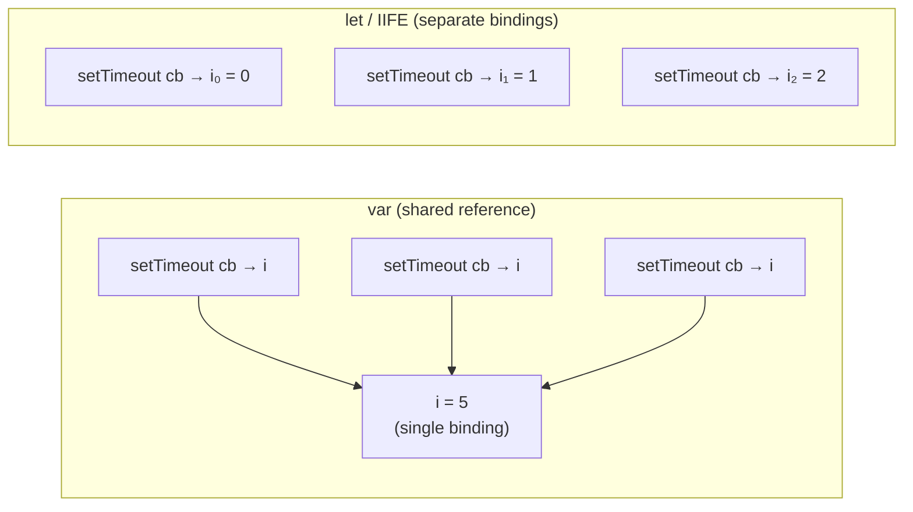

### Module Design Pattern — `Closure.js` (Interview)

Closures power the **Module Design Pattern**, which is one of the most important pre-ES6 patterns for data hiding and encapsulation:

```js
const Calculator = (function () {
    let result = 0; // private state — inaccessible from outside

    return {
        add(x) {
            result += x;
            return this;
        },
        subtract(x) {
            result -= x;
            return this;
        },
        getResult() {
            return result;
        },
        reset() {
            result = 0;
            return this;
        },
    };
})();

Calculator.add(10).subtract(3).add(5);
console.log(Calculator.getResult()); // 12
console.log(Calculator.result); // undefined — private!
```

The IIFE runs once, creates the `result` variable in its scope, and returns an object whose methods close over that variable. External code can only interact through the returned API — `result` is completely hidden.

### Closure vs Scope — Key Distinction

| Aspect             | Scope                                                          | Closure                                                                         |
| ------------------ | -------------------------------------------------------------- | ------------------------------------------------------------------------------- |
| **What it is**     | The set of rules for where a variable can be accessed          | A function + its lexical environment preserved after the outer function returns |
| **When it exists** | During function execution                                      | After the outer function has finished executing                                 |
| **Purpose**        | Controls variable visibility and lifetime                      | Preserves state across function calls                                           |
| **Example**        | A variable inside a `for` loop only accessible within the loop | A counter function that remembers its count between calls                       |

Scope defines _where_ variables live. Closures capture scope so it _outlives_ the function that created it.

### Are Modules Closures?

Yes. ES Modules behave like closures at the file level. Variables declared at the top level of a module are scoped to that module — they are not global. Exported values are live bindings that close over the module's internal state. This is why a module can export a `count` variable and an `increment()` function, and callers see the updated value — the module's scope persists just like a closure.

### Production Use-Cases of Closures

1. **Data Privacy / Encapsulation** — Private variables accessed only through a public API (module pattern).
2. **Function Factories** — `createLogger(prefix)` that returns a logger function pre-configured with the prefix.
3. **Event Handlers** — Handlers that need to remember context from when they were registered.
4. **Debounce / Throttle** — Timer ID and last-call timestamp preserved across invocations.
5. **Iterators** — A function that maintains a pointer to the current position in a collection.
6. **Partial Application / Currying** — Pre-filling arguments via closure.

### V8 Memory & How Closures Are Stored

#### Types of Memory in V8

V8 manages memory in two main regions:

**1. Stack (Call Stack)**

- Stores **primitive values**, **function call frames**, and **local variables**
- Fixed size, LIFO — automatically cleaned up when a function returns
- Fast access

```js
function add(a, b) {
    // a, b → stored on stack
    let result = a + b; // result → stored on stack
    return result; // frame popped after return
}
```

**2. Heap**
The heap is where **objects, arrays, functions, and closures** live. V8 divides it into:

| Region                    | Purpose                                                                        |
| ------------------------- | ------------------------------------------------------------------------------ |
| **New Space** (Young Gen) | Newly created short-lived objects. Collected by **Scavenger GC**               |
| **Old Space** (Old Gen)   | Objects that survived 2+ GC cycles. Collected by **Mark-Sweep / Mark-Compact** |
| **Large Object Space**    | Objects too big for other spaces (never moved)                                 |
| **Code Space**            | JIT-compiled machine code                                                      |
| **Map Space**             | Object shape/structure metadata (hidden classes)                               |

#### Where Variables Are Stored

| What                                                        | Where                 |
| ----------------------------------------------------------- | --------------------- |
| Primitive local variables                                   | Stack                 |
| Reference (pointer to object)                               | Stack                 |
| Object / Array / Function data                              | Heap                  |
| Captured closure variables                                  | Heap (Context object) |
| `let`/`const`/`var` in a regular function (not closed over) | Stack                 |

#### How Closures Are Stored in V8

When a function references variables from its outer scope, V8 **moves those variables from the stack to the heap** — stored in a **Context object**:

```js
function outer() {
    let count = 0; // normally on stack...
    return function () {
        // ...but inner fn closes over it
        count++; // so `count` is MOVED to HEAP (Context object)
        return count;
    };
}
const fn = outer(); // outer() is done, but count survives on heap
```

**V8 internally creates a `Context` object on the heap:**

```
Context {
    count: 0       ← captured variable lives here
}
↑
inner function holds a [[Environment]] pointer to this Context
```

- Only variables **actually referenced** by the inner function are captured — the rest are garbage collected
- Each call to `outer()` creates a **new, independent Context** on the heap
- The Context stays alive as long as the inner function is reachable
- When the inner function is no longer reachable, the Context is GC'd

```
stack                heap
─────────────────    ──────────────────────────
outer() frame  →     Context { count: 0 }
  (popped)               ↑
                     inner fn  ──── [[Environment]] pointer
```

### Interview Questions — Closures

1. **What is a closure?** — A function that retains access to variables from its lexical scope even after the outer function has returned. It bundles the function with its surrounding environment.
2. **How are closures used for data encapsulation?** — By returning functions from an outer function, internal variables become private — only accessible through the returned interface (like the counter pattern).
3. **What is the classic `setTimeout` + `var` closure problem?** — In a loop with `var`, all `setTimeout` callbacks share the same variable, printing the final value. Fix: use `let` (block-scoped) or wrap in an IIFE.
4. **Do closures cause memory leaks?** — They can, if they hold references to large data structures that are no longer needed. Modern engines optimize by only keeping referenced variables.
5. **What is the Module Design Pattern?** — Using closures to create private state and expose a public API via returned objects or functions, simulating encapsulation without classes.
6. **How does garbage collection work with closures?** — Unreferenced variables in the outer scope are garbage collected. Only variables actually used by the inner function are retained.
7. **What is the difference between scope and closure?** — Scope defines where variables are accessible during execution. A closure captures that scope so it persists after the defining function returns.
8. **Are ES Modules closures?** — Yes. Module-scoped variables persist between imports, and exported functions close over the module's internal state.
9. **How does V8 store closure variables?** — Captured variables are moved from the stack to a **Context object** on the heap. The inner function holds a `[[Environment]]` pointer to this Context, keeping it alive as long as the function is reachable.

[↑ Back to Index](#table-of-contents)

---

## 10. Higher-Order Functions & Functional Programming

**Functional Programming** is a paradigm where computation is done using pure functions, immutability, and function composition, avoiding shared mutable state and side effects. JavaScript supports functional programming natively through first-class functions.

A **Higher-Order Function (HOF)** is a function that either takes one or more functions as arguments or returns a function. This is possible because functions are first-class citizens. Examples include `map`, `filter`, `reduce`, `forEach`, and custom functions that accept callbacks.

**Core principles of functional programming in this codebase:**

1. **Pure Functions** — Given the same input, always produce the same output with no side effects.
2. **Immutability** — Never modify existing data; create new data structures instead. Use spread operator, `map`, `filter` instead of `push` or direct mutation.
3. **Function Composition** — Build complex operations by chaining simpler functions.
4. **Avoiding Side Effects** — Functions should not modify external state.

### From the Repository — `HOF.js`

```js
// Pure function — same input always gives same output
function add(x, y) {
    return x + y;
}

// Immutability — create new array instead of mutating
const arr = [1, 2, 3];
const newArr = [...arr, 4, 5]; // arr is unchanged

// Higher-Order Function — takes a function as argument
const radius = [3, 1, 2, 4];

const area = (r) => Math.PI * r * r;
const circumference = (r) => 2 * Math.PI * r;
const diameter = (r) => 2 * r;

// Custom HOF added to Array.prototype
Array.prototype.calculate = function (logic) {
    const output = [];
    for (let index = 0; index < this.length; index++) {
        output.push(logic(this[index]));
    }
    return output;
};

console.log(radius.calculate(area));
console.log(radius.calculate(circumference));
console.log(radius.calculate(diameter));
```

The `calculate` method is a custom implementation of `map` — it takes a transformation function and applies it to each element. This demonstrates how higher-order functions enable reusable, generic logic. The same `calculate` method works with `area`, `circumference`, or `diameter` — the specific behavior is injected through the callback.

---

### Function Composition

**Function composition** is the process of combining two or more functions so the output of one becomes the input of the next. It is the core idea behind building complex logic from small, reusable, pure functions.

- **`compose`** — runs functions **right to left**: `compose(f, g, h)(x)` = `f(g(h(x)))`
- **`pipe`** — runs functions **left to right**: `pipe(f, g, h)(x)` = `h(g(f(x)))`

```js
// compose — right to left
const compose =
    (...fns) =>
    (x) =>
        fns.reduceRight((acc, fn) => fn(acc), x);

// pipe — left to right (more readable)
const pipe =
    (...fns) =>
    (x) =>
        fns.reduce((acc, fn) => fn(acc), x);

// Simple pure functions
const double = (x) => x * 2;
const addTen = (x) => x + 10;
const square = (x) => x * x;

// compose: runs square → addTen → double (right to left)
const transformCompose = compose(double, addTen, square);
console.log(transformCompose(3)); // square(3)=9 → addTen(9)=19 → double(19)=38

// pipe: runs double → addTen → square (left to right)
const transformPipe = pipe(double, addTen, square);
console.log(transformPipe(3)); // double(3)=6 → addTen(6)=16 → square(16)=256
```

**Practical — string `slugify` pipeline:**

```js
const trim = (str) => str.trim();
const toLowerCase = (str) => str.toLowerCase();
const removeSpaces = (str) => str.replace(/\s+/g, "_");

const slugify = pipe(trim, toLowerCase, removeSpaces);
console.log(slugify("  Hello World  ")); // "hello_world"
```

**Practical — data pipeline (filter → filter → map):**

```js
const users = [
    { name: "Prashant", age: 26, active: true },
    { name: "Raju", age: 50, active: false },
    { name: "Prabhas", age: 22, active: true },
    { name: "Alice", age: 17, active: true },
];

const isActive = (users) => users.filter((u) => u.active);
const isAdult = (users) => users.filter((u) => u.age >= 18);
const getNames = (users) => users.map((u) => u.name);

const getActiveAdultNames = pipe(isActive, isAdult, getNames);
console.log(getActiveAdultNames(users)); // ["Prashant", "Prabhas"]
```

Each step is a **pure function** that does one thing. `pipe` wires them together without nesting callbacks or chaining methods directly.

---

### Interview Questions — HOF & Functional Programming

1. **What is a higher-order function?** — A function that takes another function as an argument or returns a function.
2. **What is a pure function?** — A function that always returns the same output for the same input and has no side effects (no mutation of external state).
3. **Why is immutability important in functional programming?** — It prevents unexpected state changes, makes code predictable, and eliminates entire classes of bugs related to shared mutable state.
4. **How would you implement your own `map` function?** — Create a function that iterates over an array, applies a callback to each element, and pushes results into a new array (like the `calculate` function in the codebase).
5. **What is function composition?** — Combining small pure functions so the output of one becomes the input of the next. Implemented as `compose` (right-to-left) or `pipe` (left-to-right) using `reduceRight`/`reduce`.
6. **What is the difference between `compose` and `pipe`?** — Both combine functions, but `compose` executes right-to-left (mathematical style) while `pipe` executes left-to-right (more readable for data pipelines).

[↑ Back to Index](#table-of-contents)

---

## 11. Function Currying & Memoization

### Function Currying

**Currying** transforms a function that takes multiple arguments into a sequence of functions, each taking a single argument. This allows partial application — creating specialized versions of a function by pre-filling some arguments.

### From the Repository — `HOF.js`

```js
function curriedAdd(a) {
    return function (b) {
        return a + b;
    };
}

const addFive = curriedAdd(5);
console.log(addFive(3)); // 8
console.log(addFive(10)); // 15
```

`curriedAdd(5)` returns a new function that remembers `a = 5` through a closure. This pre-configured function can then be called multiple times with different `b` values. Currying is useful in event handling (pre-configured handlers) and API calls (pre-filled API keys or configuration).

**Generic `curry` function — works for any number of arguments:**

```js
// A universal curry: transform f(a, b, c) into f(a)(b)(c)
function curry(fn) {
    return function curried(...args) {
        if (args.length >= fn.length) {
            // Received enough args — call the original
            return fn(...args);
        }
        // Not enough yet — return a function waiting for more
        return function (...moreArgs) {
            return curried(...args, ...moreArgs);
        };
    };
}

function add(a, b, c) {
    return a + b + c;
}

const curriedAdd = curry(add);
console.log(curriedAdd(1)(2)(3)); // 6  — one arg at a time
console.log(curriedAdd(1, 2)(3)); // 6  — partial batch
console.log(curriedAdd(1)(2, 3)); // 6  — other partial batch
console.log(curriedAdd(1, 2, 3)); // 6  — all at once
```

**Real-world currying — pre-configured functions:**

```js
// Validator factory — pre-fill the rule, reuse with different values
const validate = curry((min, max, value) => value >= min && value <= max);

const isAdult = validate(18, 120); // min=18, max=120
const isValidPort = validate(1, 65535); // min=1, max=65535
const isPercent = validate(0, 100); // min=0, max=100

console.log(isAdult(25)); // true
console.log(isAdult(10)); // false
console.log(isValidPort(80)); // true
console.log(isPercent(105)); // false

// Logger factory — pre-fill the prefix
const log = curry(
    (prefix, level, message) => `[${prefix}][${level}] ${message}`,
);

const appLog = log("MyApp"); // prefix locked
const errLog = appLog("ERROR"); // prefix + level locked
const infoLog = appLog("INFO");

console.log(errLog("DB connection failed")); // [MyApp][ERROR] DB connection failed
console.log(infoLog("Server started")); // [MyApp][INFO] Server started
```

**Currying vs Partial Application:**

```js
// Currying: ALWAYS one arg per call — f(a)(b)(c)
// Partial Application: any number of args per call — f(a)(b, c) or f.bind(null, a)

// Partial application with bind (no currying needed):
function multiply(a, b, c) {
    return a * b * c;
}
const double = multiply.bind(null, 2); // pre-fill a=2
const triple = multiply.bind(null, 3); // pre-fill a=3

console.log(double(4, 5)); // 2 * 4 * 5 = 40
console.log(triple(2, 2)); // 3 * 2 * 2 = 12
```

**Memoization** is an optimization technique that caches the results of expensive function calls and returns the cached result when the same inputs occur again.

### From the Repository — `HOF.js`

```js
function memoize(fn) {
    const cache = new Map();
    return function (...args) {
        const key = args.toString();
        if (!cache.get(key)) {
            cache.set(key, fn(args));
        }
        console.log(cache);
        return cache.get(key);
    };
}

function fact(x) {
    if (x == 0) return 1;
    return x * factorial(x - 1);
}

const factorial = memoize(fact);
console.log(factorial(5)); // calculates
console.log(factorial(5)); // returns cached result
```

The `memoize` wrapper uses a `Map` as a cache. The key is the stringified arguments, and the value is the result. On subsequent calls with the same arguments, the function skips computation and returns the cached value directly. This pattern uses closures — the `cache` variable persists across calls because the returned function closes over it.

### Interview Questions — Currying & Memoization

1. **What is currying?** — Transforming a function `f(a, b, c)` into `f(a)(b)(c)` — a chain of single-argument functions.
2. **What is partial application?** — Pre-filling some arguments of a function to create a more specialized version, often using `bind` or currying.
3. **What is memoization?** — Caching function results based on arguments so that repeated calls with the same input return instantly from cache.
4. **How are closures involved in memoization?** — The cache (Map or object) is defined in the outer function and persists through the closure of the returned wrapper function.
5. **When should you NOT use memoization?** — When function results change over time (impure functions), when the argument space is too large (memory issues), or when the function is already fast.

[↑ Back to Index](#table-of-contents)

---

# Phase 3 — Objects & Prototypes

---

## 12. Prototypes & Inheritance

JavaScript uses a **prototype-based inheritance** model rather than classical class-based inheritance. Every object in JavaScript has an internal link to another object called its **prototype**. When you access a property on an object, JavaScript first checks the object itself. If the property is not found, it follows the prototype chain — checking the object's prototype, then the prototype's prototype, and so on until it reaches `null`.

The root of all prototype chains is `Object.prototype`, whose prototype is `null`. This is where methods like `toString()`, `hasOwnProperty()`, and `valueOf()` come from — every object inherits them through the chain.

**Key distinctions:**

- `__proto__` (or `Object.getPrototypeOf()`) is the actual link from an object to its prototype.
- `prototype` is a property on constructor functions that becomes the `__proto__` of objects created with `new`.
- `Object.create(proto)` creates a new object with `proto` as its prototype — a clean way to set up delegation.

---

### Step 1 — What the Prototype Chain Looks Like as a JSON Snapshot

The easiest way to understand the prototype chain is to picture each object as a JSON-like node with a hidden `__proto__` pointer. Consider this simple case:

```js
const parent = {
    a: 1,
    greet() {
        return "hi from parent";
    },
};
const child = Object.create(parent);
child.b = 2;
```

Here is how V8 sees the memory — each box is an object, each arrow is a `__proto__` link:

```
┌─────────────────────────────────┐
│  child  (own properties only)   │
│  { b: 2 }                       │
│  [[Prototype]] ─────────────────┼──────────────────────────────────┐
└─────────────────────────────────┘                                  │
                                                                     ▼
                                              ┌──────────────────────────────────┐
                                              │  parent                          │
                                              │  { a: 1, greet: [Function] }     │
                                              │  [[Prototype]] ──────────────────┼──────┐
                                              └──────────────────────────────────┘      │
                                                                                        ▼
                                                             ┌────────────────────────────────────────┐
                                                             │  Object.prototype                      │
                                                             │  { toString, hasOwnProperty, valueOf…} │
                                                             │  [[Prototype]] ────────────────────────┼──► null
                                                             └────────────────────────────────────────┘
```

**JS object mental model** — imagine the chain as a nested object literal:

```js
// child object — what you create
{
    b: 2,
    __proto__: {
        // parent object — Object.create(parent) links here
        a: 1,
        greet: [Function],
        __proto__: {
            // Object.prototype — the root of every plain object
            toString: [Function],
            hasOwnProperty: [Function],
            valueOf: [Function],
            __proto__: null
        }
    }
}
```

> **Rule:** `__proto__` is never actually printed by `console.log` — it is a hidden internal slot. The object literal above is just a teaching model to visualize the chain.

**Running proof in code:**

```js
const parent = { a: 1 };
const child = Object.create(parent);
child.b = 2;

// What child "owns" vs what it inherits
console.log(child); // { b: 2 }          ← own
console.log(child.__proto__); // { a: 1 }          ← parent
console.log(child.__proto__.__proto__); // Object.prototype   ← root
console.log(child.__proto__.__proto__.__proto__); // null          ← chain ends

// Property lookup
console.log(child.b); // 2     — found on child itself
console.log(child.a); // 1     — not on child, found on parent
console.log(child.toString()); // "[object Object]" — found on Object.prototype

// Ownership check
console.log(child.hasOwnProperty("b")); // true  — own property
console.log(child.hasOwnProperty("a")); // false — inherited, NOT own
console.log("a" in child); // true  — `in` walks the full chain
console.log("a" in parent); // true
console.log("x" in child); // false — nowhere in the chain
```

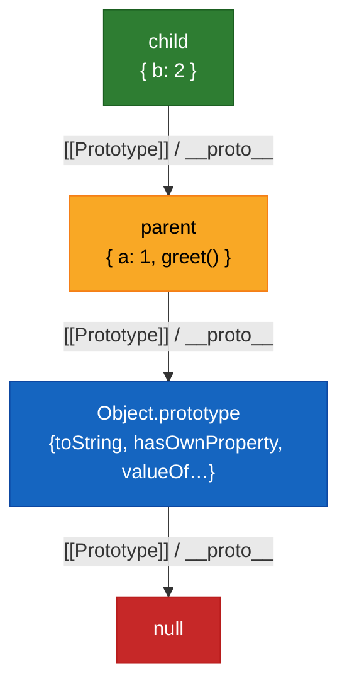

---

### Step 2 — Property Lookup Walk-Through (Step by Step)

When you write `child.a`, JavaScript performs this exact algorithm:

```
1. Look for "a" on child itself          → NOT FOUND (child only has "b")
2. Follow child.__proto__ → parent       → FOUND! a = 1  ✅  return 1
```

When you write `child.toString()`:

```
1. Look for "toString" on child          → NOT FOUND
2. Follow child.__proto__ → parent       → NOT FOUND (parent only has "a", "greet")
3. Follow parent.__proto__ → Object.prototype → FOUND! toString = [Function] ✅
```

When you write `child.xyz`:

```
1. Look for "xyz" on child               → NOT FOUND
2. Follow child.__proto__ → parent       → NOT FOUND
3. Follow parent.__proto__ → Object.prototype → NOT FOUND
4. Follow Object.prototype.__proto__ → null → STOP → return undefined
```

---

### Step 3 — From the Repository — `prototypeInheritance.js`

```js
// Extending Array.prototype — adding custom method to all arrays
Array.prototype.logData = function () {
    this.map((x) => console.log(x));
};
const arr = [1, 2, 3, 4];
arr.logData(); // logs 1, 2, 3, 4

// Prototype chain with Object.create
const parent = { a: 1 };
const child = Object.create(parent);
child.b = 2;

console.log(child); // { b: 2 }
console.log(child.__proto__); // { a: 1 }
console.log(child.__proto__.__proto__); // Object.prototype
console.log(child.__proto__.__proto__.__proto__); // null

console.log(child.hasOwnProperty("a")); // false — a is inherited
console.log("a" in child); // true — checks full chain
```

---

### Step 4 — Real-World Example: Multi-Level Prototype Chain

A practical example — a 3-level chain: `Animal → Dog → myDog`:

```js
// Level 1 — The root ancestor (manually set up with Object.create)
const Animal = {
    kingdom: "Animalia",
    breathe() {
        return `${this.name} breathes air`;
    },
};

// Level 2 — Dog inherits from Animal
const Dog = Object.create(Animal);
Dog.legs = 4;
Dog.bark = function () {
    return `${this.name} says Woof!`;
};

// Level 3 — a specific dog instance inherits from Dog
const myDog = Object.create(Dog);
myDog.name = "Rex";
myDog.breed = "Labrador";
```

**JS object snapshot of the chain:**

```js
// myDog — own properties only
{
    name: "Rex",
    breed: "Labrador",
    __proto__: {
        // Dog.prototype
        legs: 4,
        bark: [Function],
        __proto__: {
            // Animal (the object used with Object.create)
            kingdom: "Animalia",
            breathe: [Function],
            __proto__: {
                // Object.prototype
                hasOwnProperty: [Function],
                toString: [Function],
                __proto__: null
            }
        }
    }
}
```

```js
// Property lookups across 3 levels
console.log(myDog.name); // "Rex"      — own property (level 3)
console.log(myDog.legs); // 4          — found on Dog (level 2)
console.log(myDog.kingdom); // "Animalia" — found on Animal (level 1)
console.log(myDog.toString()); // "[object Object]" — found on Object.prototype

// Method calls — `this` is always myDog because of how the call is made
console.log(myDog.bark()); // "Rex says Woof!"   — Dog.bark, this = myDog
console.log(myDog.breathe()); // "Rex breathes air" — Animal.breathe, this = myDog

// Ownership checks
console.log(myDog.hasOwnProperty("name")); // true  — own
console.log(myDog.hasOwnProperty("legs")); // false — inherited from Dog
console.log(myDog.hasOwnProperty("kingdom")); // false — inherited from Animal

// Confirming the chain
console.log(Object.getPrototypeOf(myDog) === Dog); // true
console.log(Object.getPrototypeOf(Dog) === Animal); // true
console.log(Object.getPrototypeOf(Animal) === Object.prototype); // true
```

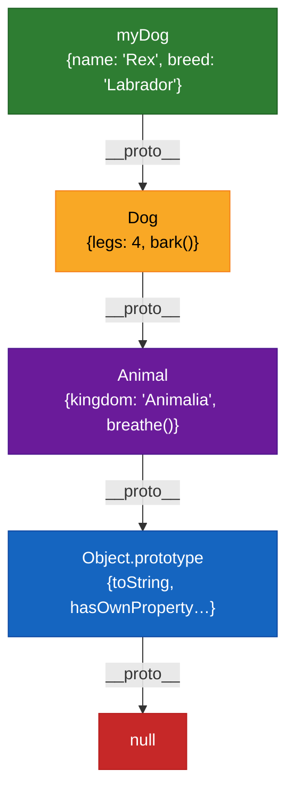

---

### Step 5 — Constructor Functions & `new` Keyword

Constructor functions are the classic way to create multiple objects sharing the same prototype. The pattern is: **own data goes on `this`, shared methods go on `Constructor.prototype`**.

```js
function User(name, role) {
    // Own properties — each instance gets its own copy
    this.name = name;
    this.role = role;
}

// Shared method — stored ONCE on the prototype, all instances share it
User.prototype.greet = function () {
    return `Hi, I am ${this.name} (${this.role})`;
};

User.prototype.promote = function (newRole) {
    this.role = newRole;
    return this;
};

const u1 = new User("Prashant", "developer");
const u2 = new User("Raju", "designer");

console.log(u1.greet()); // "Hi, I am Prashant (developer)"
console.log(u2.greet()); // "Hi, I am Raju (designer)"

// Both instances share the SAME greet function — not copied!
console.log(u1.greet === u2.greet); // true  ✅ memory efficient

// Own properties are independent per instance
console.log(u1.name === u2.name); // false — "Prashant" vs "Raju"
```

**JS object snapshot of `u1`:**

```js
// u1 — own properties
{
    name: "Prashant",
    role: "developer",
    __proto__: {
        // User.prototype — shared across ALL User instances
        greet: [Function],
        promote: [Function],
        constructor: [Function: User],
        __proto__: {
            // Object.prototype
            toString: [Function],
            hasOwnProperty: [Function],
            __proto__: null
        }
    }
}
```

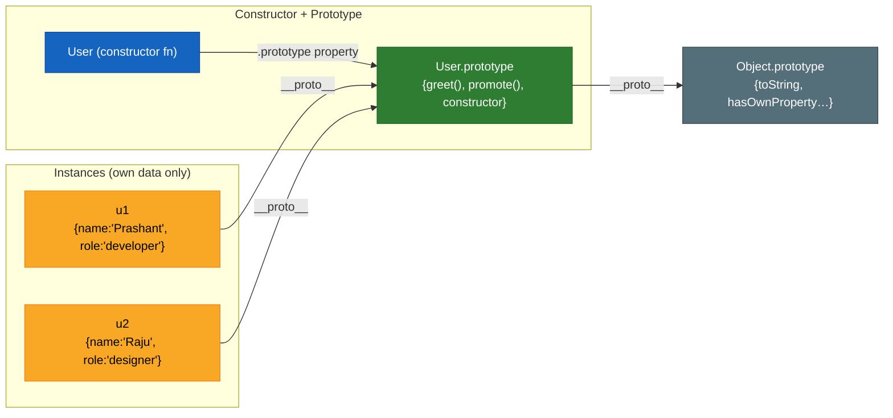

**Why methods go on `prototype`, not inside the constructor:**

```js
// ❌ BAD — greet is re-created for every new instance (wastes memory)
function UserBad(name) {
    this.name = name;
    this.greet = function () {
        return `Hi, I am ${this.name}`;
    };
    //           ^^^^^^^^^^^ new function object created on every `new UserBad()`
}
const a = new UserBad("A");
const b = new UserBad("B");
console.log(a.greet === b.greet); // false ❌ — two separate function objects

// ✅ GOOD — greet lives on prototype, shared by all instances
function UserGood(name) {
    this.name = name;
}
UserGood.prototype.greet = function () {
    return `Hi, I am ${this.name}`;
};

const c = new UserGood("C");
const d = new UserGood("D");
console.log(c.greet === d.greet); // true ✅ — same function object
```

---

### Step 6 — How `new` Works Internally

```js
// What happens behind the scenes when you call: new User("Prashant", "developer")

// Step 1: Create a new empty object
const obj = {};

// Step 2: Link its prototype to the constructor's prototype object
Object.setPrototypeOf(obj, User.prototype);
// Equivalent: obj.__proto__ = User.prototype

// Step 3: Execute the constructor with `this` bound to the new object
const result = User.call(obj, "Prashant", "developer");

// Step 4: Result matters only if it is a non-null object
return typeof result === "object" && result !== null ? result : obj;
//      ^^^^^^^^^^^^^^^^^^^^^^^^^^^^^^^^^^^^^^^^^^^^  usually false → we return obj
```

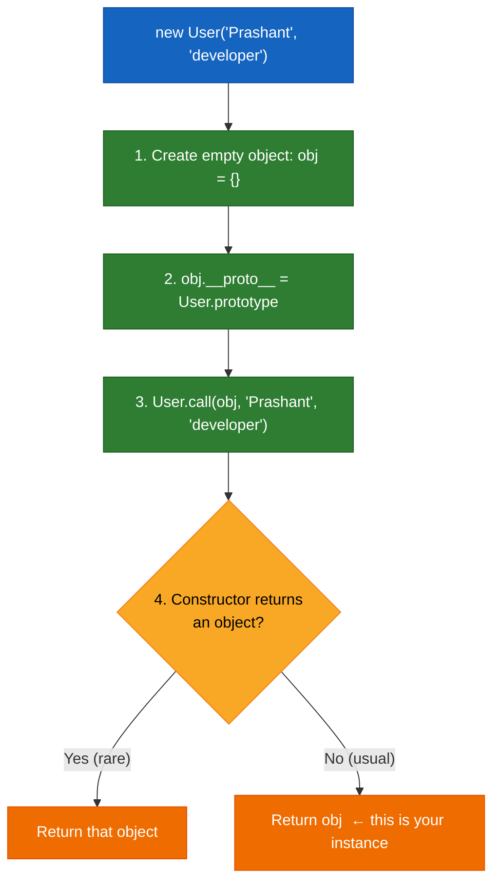

**Edge case — constructor returning a plain object hijacks the instance:**

```js
function Weird() {
    this.own = "mine";
    return { hijacked: true }; // returning an object overrides the new object
}
const w = new Weird();
console.log(w); // { hijacked: true }  — NOT the object with `own`
console.log(w.own); // undefined

function Normal() {
    this.own = "mine";
    return 42; // returning a primitive is IGNORED
}
const n = new Normal();
console.log(n.own); // "mine" — primitive return is ignored, usual behavior
```

---

### Step 7 — Prototype Chain for Built-in Types

Every built-in type in JavaScript also has a prototype chain. This is how arrays, strings, and functions get their methods.

**Array prototype chain:**

```js
const nums = [1, 2, 3];

// nums.__proto__ → Array.prototype → Object.prototype → null
console.log(Object.getPrototypeOf(nums) === Array.prototype); // true
console.log(nums.hasOwnProperty("map")); // false — map is on Array.prototype
console.log(Array.prototype.hasOwnProperty("map")); // true

// Array.prototype.__proto__ is Object.prototype
console.log(Object.getPrototypeOf(Array.prototype) === Object.prototype); // true
```

**JS object snapshot of `[1, 2, 3]`:**

```js
// nums — own properties (indices + length)
{
    0: 1,
    1: 2,
    2: 3,
    length: 3,
    __proto__: {
        // Array.prototype
        map: [Function],
        filter: [Function],
        reduce: [Function],
        push: [Function],
        pop: [Function],
        __proto__: {
            // Object.prototype
            toString: [Function],
            hasOwnProperty: [Function],
            __proto__: null
        }
    }
}
```

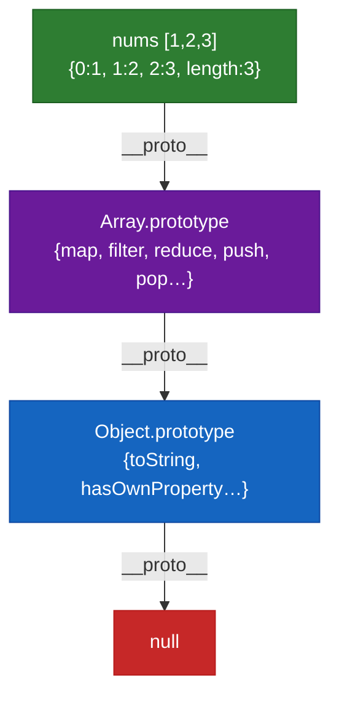

**Function prototype chain:**

```js
function greet() {}

// greet.__proto__ → Function.prototype → Object.prototype → null
console.log(Object.getPrototypeOf(greet) === Function.prototype); // true
console.log(greet.hasOwnProperty("call")); // false — call is on Function.prototype
console.log(Function.prototype.hasOwnProperty("call")); // true
```

**`typeof` vs `instanceof` vs `isPrototypeOf`:**

```js
const nums = [1, 2, 3];

console.log(typeof nums); // "object"  — typeof is limited
console.log(nums instanceof Array); // true      — checks the prototype chain
console.log(nums instanceof Object); // true      — Array.prototype is in the chain
console.log(Array.prototype.isPrototypeOf(nums)); // true      — same check, different syntax
console.log(Object.prototype.isPrototypeOf(nums)); // true
```

---

### Step 8 — `Object.create()` vs `new` — Comparison

| Feature                   | `Object.create(proto)`                                  | `new Constructor()`                                      |
| ------------------------- | ------------------------------------------------------- | -------------------------------------------------------- |
| **How it sets prototype** | Directly sets `[[Prototype]]` to whatever you pass      | Sets `[[Prototype]]` to `Constructor.prototype`          |
| **Constructor called?**   | No — zero initialization logic runs                     | Yes — constructor body executes with `this` = new object |
| **Initialization**        | You set own properties manually afterwards              | Constructor sets own properties via `this.x = ...`       |
| **Use case**              | Pure prototypal delegation when you want manual control | Classical OOP-style pattern                              |

```js
// Object.create — prototype set directly, no constructor called
const vehicleProto = {
    describe() {
        return `${this.make} ${this.model} (${this.year})`;
    },
};

const car = Object.create(vehicleProto); // car.__proto__ === vehicleProto
car.make = "Toyota";
car.model = "Corolla";
car.year = 2024;

console.log(car.describe()); // "Toyota Corolla (2024)" — delegated to vehicleProto

console.log(Object.getPrototypeOf(car) === vehicleProto); // true
console.log(car.hasOwnProperty("describe")); // false — it's on the proto
console.log(car.hasOwnProperty("make")); // true  — own property

// new — constructor does the initialization
function Vehicle(make, model, year) {
    this.make = make;
    this.model = model;
    this.year = year;
}
Vehicle.prototype.describe = function () {
    return `${this.make} ${this.model} (${this.year})`;
};

const truck = new Vehicle("Ford", "F-150", 2023);
console.log(truck.describe()); // "Ford F-150 (2023)"
console.log(Object.getPrototypeOf(truck) === Vehicle.prototype); // true
```

**`Object.create(null)` — an object with NO prototype:**

```js
// Useful for pure hash maps — no inherited properties to conflict with
const dict = Object.create(null);
dict.name = "hash map";

console.log(dict.__proto__); // undefined — there is no prototype at all
console.log(dict.toString); // undefined — no Object.prototype methods
console.log(Object.getPrototypeOf(dict)); // null

// Use case: safe key-value store (no risk of overwriting "toString", "constructor" etc.)
const safeMap = Object.create(null);
safeMap["constructor"] = "safe!"; // no prototype clash
console.log(safeMap["constructor"]); // "safe!"
```

---

### Step 9 — Inheritance Pattern: Extending Constructor Functions

Before ES6 `class`, JavaScript inheritance was done by manually wiring prototype chains:

```js
// Parent constructor
function Animal(name, sound) {
    this.name = name;
    this.sound = sound;
}
Animal.prototype.speak = function () {
    return `${this.name} says ${this.sound}`;
};
Animal.prototype.toString = function () {
    return `[Animal: ${this.name}]`;
};

// Child constructor — calls parent constructor to initialize own props
function Dog(name) {
    Animal.call(this, name, "Woof"); // ← inherit OWN properties
    this.tricks = [];
}

// Wire up the prototype chain: Dog.prototype → Animal.prototype
Dog.prototype = Object.create(Animal.prototype);
Dog.prototype.constructor = Dog; // ← restore the constructor reference

// Add Dog-specific methods
Dog.prototype.learn = function (trick) {
    this.tricks.push(trick);
    return this;
};
Dog.prototype.perform = function () {
    return `${this.name} performs: ${this.tricks.join(", ")}`;
};

// Usage
const rex = new Dog("Rex");
rex.learn("sit").learn("shake").learn("roll over");

console.log(rex.speak()); // "Rex says Woof"   — inherited from Animal.prototype
console.log(rex.perform()); // "Rex performs: sit, shake, roll over" — own to Dog
console.log(rex instanceof Dog); // true
console.log(rex instanceof Animal); // true — chain includes Animal.prototype
```

**JS object snapshot of `rex`:**

```js
// rex — own properties
{
    name: "Rex",
    sound: "Woof",
    tricks: ["sit", "shake", "roll over"],
    __proto__: {
        // Dog.prototype
        constructor: [Function: Dog],
        learn: [Function],
        perform: [Function],
        __proto__: {
            // Animal.prototype
            speak: [Function],
            toString: [Function],
            __proto__: {
                // Object.prototype
                hasOwnProperty: [Function],
                __proto__: null
            }
        }
    }
}
```

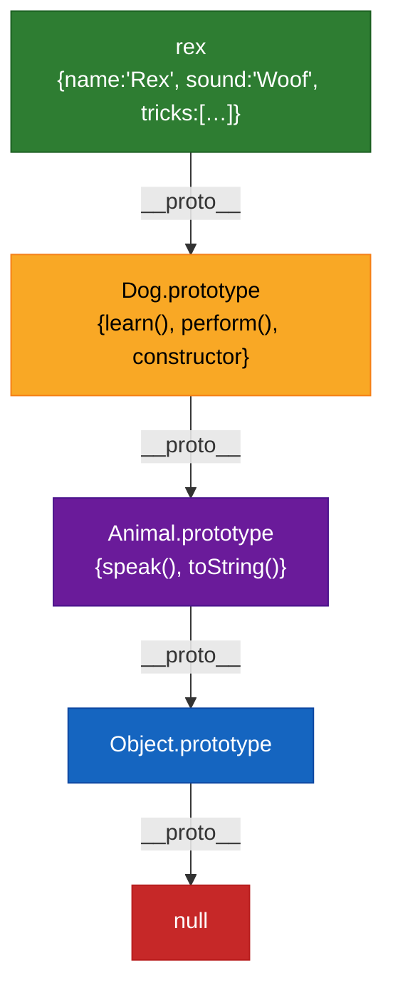

---

### Step 10 — ES6 Classes: Syntactic Sugar Over Prototypes

`class` syntax is clean, readable, and used in modern code — but it compiles down to exactly the same prototype chain shown above. Nothing changes under the hood.

```js
class Animal {
    constructor(name, sound) {
        this.name = name; // own property
        this.sound = sound; // own property
    }

    speak() {
        // goes on Animal.prototype
        return `${this.name} says ${this.sound}`;
    }
}

class Dog extends Animal {
    constructor(name) {
        super(name, "Woof"); // calls Animal constructor — sets this.name, this.sound
        this.tricks = []; // own property
    }

    learn(trick) {
        // goes on Dog.prototype
        this.tricks.push(trick);
        return this;
    }

    perform() {
        // goes on Dog.prototype
        return `${this.name} performs: ${this.tricks.join(", ")}`;
    }
}

const rex = new Dog("Rex");
rex.learn("sit").learn("shake");

console.log(rex.speak()); // "Rex says Woof"
console.log(rex.perform()); // "Rex performs: sit, shake"

// Proof: under the hood it is still prototypes
console.log(Object.getPrototypeOf(rex) === Dog.prototype); // true
console.log(Object.getPrototypeOf(Dog.prototype) === Animal.prototype); // true

// Own vs inherited
console.log(rex.hasOwnProperty("name")); // true  — set by constructor
console.log(rex.hasOwnProperty("speak")); // false — on Animal.prototype
console.log(rex.hasOwnProperty("learn")); // false — on Dog.prototype
```

**The class syntax produces the IDENTICAL prototype chain as the manual constructor approach:**

```
rex  →  Dog.prototype  →  Animal.prototype  →  Object.prototype  →  null
```

| ES6 `class` syntax         | Prototype equivalent                              |
| -------------------------- | ------------------------------------------------- |
| `class Dog extends Animal` | `Dog.prototype = Object.create(Animal.prototype)` |
| `constructor(){ super() }` | `Animal.call(this, ...args)`                      |
| Method inside class body   | `Dog.prototype.methodName = function(){}`         |
| `static` method            | `Dog.methodName = function(){}`                   |

---

### Step 11 — `__proto__` vs `prototype` — Side-by-Side

```js
function Cat(name) {
    this.name = name;
}
Cat.prototype.purr = function () {
    return `${this.name} purrs~`;
};

const kitty = new Cat("Kitty");

// `prototype`  — only exists on FUNCTIONS, it is the blueprint object
console.log(typeof Cat.prototype); // "object"
console.log(Cat.prototype.purr); // [Function]
console.log(Cat.prototype.constructor === Cat); // true

// `__proto__`  — exists on EVERY object, it is the actual chain link
console.log(kitty.__proto__ === Cat.prototype); // true  ← instance link points to blueprint
console.log(Cat.__proto__ === Function.prototype); // true ← Cat is also an object!

// Modern API — prefer Object.getPrototypeOf over __proto__
console.log(Object.getPrototypeOf(kitty) === Cat.prototype); // true
```

```
Cat (constructor fn)
 ├── .prototype  ──────────► Cat.prototype { purr(), constructor }
 │                                │
 │                                │  __proto__ (every object has this)
 │                                ▼
 │                          Object.prototype { toString, valueOf, ... }
 │                                │
 │                                ▼
 │                              null
 │
kitty (instance)
 └── .__proto__  ──────────► Cat.prototype   (same object as above)
```

**Summary rule:**

- `Constructor.prototype` → what becomes `__proto__` of every instance created with `new Constructor()`
- `instance.__proto__` → the live link walking up the chain during property lookup

---

### Prototypal Delegation Model

JavaScript does not copy methods from parent to child (unlike classical inheritance). Instead, it uses **delegation**: when a property is not found on an object, the engine delegates the lookup to the object's prototype. This means changes to a prototype are immediately visible to all objects linked to it.

```js
function Bird(name) {
    this.name = name;
}
Bird.prototype.fly = function () {
    return `${this.name} is flying`;
};

const b1 = new Bird("Sparrow");
const b2 = new Bird("Eagle");

console.log(b1.fly()); // "Sparrow is flying"
console.log(b2.fly()); // "Eagle is flying"

// LIVE delegation — patching the prototype affects ALL existing instances immediately
Bird.prototype.land = function () {
    return `${this.name} has landed`;
};

console.log(b1.land()); // "Sparrow has landed" — b1 was created BEFORE land() was added!
console.log(b2.land()); // "Eagle has landed"   — same for b2
// This works because instances delegate to the prototype at lookup time, not at creation time.
```

---

### Interview Questions — Prototypes

1. **What is the prototype chain?** — The linked list of objects that JavaScript traverses when looking up a property. Each object's `[[Prototype]]` (`__proto__`) points to the next object in the chain. The chain ends at `null`.
2. **What is the difference between `__proto__` and `prototype`?** — `__proto__` is the actual prototype link on every object (the live runtime slot). `prototype` is a property that only exists on constructor functions — it becomes the `__proto__` of instances created with `new`.
3. **How does property lookup work on an object?** — JavaScript checks the object itself first. If not found, it walks `__proto__` links one level at a time until it either finds the property or reaches `null` (returns `undefined`).
4. **How does `Object.create()` work?** — It creates a new object whose internal prototype is set to the passed argument. No constructor is called. `Object.create(null)` creates an object with no prototype at all.
5. **What is the difference between `hasOwnProperty()` and the `in` operator?** — `hasOwnProperty` checks only the object's own properties. `in` walks the entire prototype chain.
6. **Why should you be cautious extending native prototypes like `Array.prototype`?** — It can conflict with future language features, third-party libraries, or polyfills. It also makes properties show up in `for...in` loops unless marked non-enumerable.
7. **What are the 4 steps `new` performs?** — (1) Creates an empty object, (2) sets its `__proto__` to `Constructor.prototype`, (3) runs the constructor with `this` bound to the new object, (4) returns the new object (unless the constructor explicitly returns a different object).
8. **What is delegation in JavaScript?** — When a property isn't found on an object, the lookup is delegated to its prototype. Unlike classical inheritance, no copying occurs — the prototype is a live shared object that all linked instances reference.
9. **What is the difference between `Object.create()` and `new`?** — `Object.create()` sets the prototype directly without running a constructor. `new` calls a constructor function, sets `__proto__` = `Constructor.prototype`, and initializes own properties.
10. **How does `class extends` relate to the prototype chain?** — `class` is syntactic sugar. `class Dog extends Animal` sets `Dog.prototype.__proto__ = Animal.prototype` and `super()` calls `Animal.call(this, ...)`. The runtime behavior is identical to the manual constructor pattern.
11. **How can you check all levels of an object's prototype chain?** — Use a `while` loop with `Object.getPrototypeOf()`:

```js
let proto = Object.getPrototypeOf(myDog);
while (proto !== null) {
    console.log(proto);
    proto = Object.getPrototypeOf(proto);
}
```

[↑ Back to Index](#table-of-contents)

---

## 13. Property Descriptors & Object Immutability

Every property in a JavaScript object has invisible metadata called a **property descriptor** that controls how that property behaves. Understanding descriptors is essential for understanding how `Object.freeze`, getters/setters, and read-only constants actually work.

---

### The Two Types of Descriptors

There are exactly **two flavors** of descriptor. A property can be one or the other — never both.

| Type                    | Keys it uses                                      | What it does                 |
| ----------------------- | ------------------------------------------------- | ---------------------------- |
| **Data descriptor**     | `value`, `writable`, `enumerable`, `configurable` | Stores a plain value         |
| **Accessor descriptor** | `get`, `set`, `enumerable`, `configurable`        | Runs functions on read/write |

Both share `enumerable` and `configurable`. Data descriptors also have `value`/`writable`. Accessor descriptors swap those for `get`/`set`.

---

### Data Descriptors — Reading Flags on Normal Properties

Every property you assign normally (`obj.x = 1`) gets a descriptor with all flags defaulting to `true`:

```js
const obj = { name: "Prashant", age: 25 };

// Inspect the descriptor of a regular property
console.log(Object.getOwnPropertyDescriptor(obj, "name"));
// {
//   value:        "Prashant",
//   writable:     true,   ← can be reassigned
//   enumerable:   true,   ← shows in for..in / Object.keys
//   configurable: true    ← can be deleted or redefined
// }
```

**What each flag controls:**

```js
const config = {};

Object.defineProperty(config, "VERSION", {
    value: "1.0.0",
    writable: false, // ← cannot reassign
    enumerable: true, // ← visible in Object.keys
    configurable: false, // ← cannot delete or redefine
});

config.VERSION = "2.0.0"; // silently fails (throws in strict mode)
delete config.VERSION; // silently fails
console.log(config.VERSION); // "1.0.0" — unchanged
console.log(Object.keys(config)); // ["VERSION"] — visible because enumerable: true
```

```js
// non-enumerable — hidden from loops but still accessible directly
Object.defineProperty(config, "_secret", {
    value: "abc123",
    writable: false,
    enumerable: false, // ← hidden
    configurable: false,
});

console.log(config._secret); // "abc123" — still directly accessible
console.log(Object.keys(config)); // ["VERSION"] — _secret does NOT appear
console.log(JSON.stringify(config)); // {"VERSION":"1.0.0"} — _secret excluded
for (const key in config) console.log(key); // only "VERSION"
```

**Default flag values — the critical gotcha:**

```js
// Regular assignment → all flags default to TRUE
const a = {};
a.x = 10;
console.log(Object.getOwnPropertyDescriptor(a, "x"));
// { value: 10, writable: true, enumerable: true, configurable: true }

// Object.defineProperty → all flags default to FALSE if not specified
const b = {};
Object.defineProperty(b, "x", { value: 10 });
console.log(Object.getOwnPropertyDescriptor(b, "x"));
// { value: 10, writable: false, enumerable: false, configurable: false }
//                       ^^^^^             ^^^^^               ^^^^^ all false!
```

---

### Accessor Descriptors — Getters & Setters

Instead of storing a plain value, accessor descriptors run a **function** when the property is read (`get`) or written (`set`). This lets you add computed properties, validation, and side-effects transparently.

```js
const user = {
    _name: "Prashant", // convention: _ prefix = "private-ish"

    get name() {
        // called when you READ user.name
        return this._name.toUpperCase();
    },

    set name(value) {
        // called when you WRITE user.name = something
        if (typeof value !== "string")
            throw new TypeError("Name must be a string");
        this._name = value.trim();
    },
};

console.log(user.name); // "PRASHANT"  — getter runs
user.name = "  Alice  "; // setter runs, trims whitespace
console.log(user.name); // "ALICE"
// user.name = 42;           // TypeError: Name must be a string
```

**Inspecting an accessor descriptor:**

```js
console.log(Object.getOwnPropertyDescriptor(user, "name"));
// {
//   get:          [Function: get name],
//   set:          [Function: set name],
//   enumerable:   true,
//   configurable: true
//   ← NO "value" or "writable" keys — that's how you tell it's an accessor
// }
```

**Real-world use case — computed/lazy property:**

```js
const circle = {
    radius: 5,

    get area() {
        // computed on every access — no stored value
        return +(Math.PI * this.radius ** 2).toFixed(2);
    },

    get circumference() {
        return +(2 * Math.PI * this.radius).toFixed(2);
    },
};

console.log(circle.area); // 78.54
console.log(circle.circumference); // 31.42
circle.radius = 10;
console.log(circle.area); // 314.16 — recalculated from new radius
```

---

### `Object.defineProperty` vs `Object.defineProperties`

```js
// Single property
Object.defineProperty(obj, "propName", {
    value: "...",
    writable: true,
    enumerable: true,
    configurable: true,
});

// Multiple properties at once
const product = {};
Object.defineProperties(product, {
    name: {
        value: "Laptop",
        writable: false,
        enumerable: true,
        configurable: false,
    },
    price: { value: 999, writable: true, enumerable: true, configurable: true },
    _id: { value: "abc123", enumerable: false }, // hidden from loops
});

console.log(Object.keys(product)); // ["name", "price"]  — _id is non-enumerable
product.name = "Phone"; // silently ignored   — writable: false
console.log(product.name); // "Laptop"
product.price = 799; // works              — writable: true
console.log(product.price); // 799
```

---

### Three Levels of Object Immutability

JavaScript gives you three increasingly strict ways to lock down an object:

```
preventExtensions  ⊂  seal  ⊂  freeze
(weakest)                       (strongest)
```

```js
// ── Object.preventExtensions ──────────────────────────────────────
// Can NOT: add new properties
// CAN:     modify existing values, delete properties
const obj1 = { a: 1, b: 2 };
Object.preventExtensions(obj1);

obj1.c = 3; // silently fails (new property blocked)
obj1.a = 99; // works  ✅ — existing property can change
delete obj1.b; // works  ✅ — can still delete
console.log(obj1); // { a: 99 }

// ── Object.seal ───────────────────────────────────────────────────
// Can NOT: add or delete properties
// CAN:     modify existing values
const obj2 = { x: 1 };
Object.seal(obj2);

obj2.y = 2; // blocked ❌
delete obj2.x; // blocked ❌
obj2.x = 99; // works   ✅ — existing value can change
console.log(obj2); // { x: 99 }

// ── Object.freeze ─────────────────────────────────────────────────
// Can NOT: add, delete, or modify anything
const obj3 = { z: 1 };
Object.freeze(obj3);

obj3.w = 2; // blocked ❌
delete obj3.z; // blocked ❌
obj3.z = 99; // blocked ❌
console.log(obj3); // { z: 1 }   — unchanged
```

| Operation             | `preventExtensions` | `seal`  | `freeze` |
| --------------------- | :-----------------: | :-----: | :------: |
| Add new property      |         ❌          |   ❌    |    ❌    |
| Delete existing       |         ✅          |   ❌    |    ❌    |
| Modify existing value |         ✅          |   ✅    |    ❌    |
| Change descriptor     |         ✅          |   ❌    |    ❌    |
| **Depth**             |       Shallow       | Shallow | Shallow  |

**Checking status:**

```js
const obj = { a: 1 };
Object.freeze(obj);

console.log(Object.isFrozen(obj)); // true
console.log(Object.isSealed(obj)); // true  — freeze implies seal
console.log(Object.isExtensible(obj)); // false — freeze implies non-extensible
```

**All three are SHALLOW — nested objects are NOT protected:**

```js
const config = Object.freeze({
    db: { host: "localhost", port: 5432 }, // ← nested object is NOT frozen!
});

config.newProp = "x"; // blocked ✅ — top level is frozen
config.db.port = 9999; // WORKS! ❌ — nested object is mutable
console.log(config.db.port); // 9999

// Deep freeze — freeze recursively
function deepFreeze(obj) {
    Object.getOwnPropertyNames(obj).forEach((key) => {
        const val = obj[key];
        if (val && typeof val === "object") deepFreeze(val);
    });
    return Object.freeze(obj);
}

const safe = deepFreeze({ db: { host: "localhost", port: 5432 } });
safe.db.port = 1234; // silently fails — now truly immutable
console.log(safe.db.port); // 5432
```

---

### Interview Questions — Property Descriptors

1. **What are the two types of property descriptors?** — Data descriptors (`value`, `writable`) and accessor descriptors (`get`, `set`). Both share `enumerable` and `configurable`. A property can only be one type.
2. **What are the default flag values for `Object.defineProperty` vs regular assignment?** — Regular assignment defaults all flags to `true`. `defineProperty` defaults unspecified flags to `false` — this is the critical gotcha.
3. **What happens if you set `enumerable: false` on a property?** — The property is hidden from `for...in`, `Object.keys()`, and `JSON.stringify()` — but it is still directly accessible by name.
4. **What is the difference between `Object.freeze` and `Object.seal`?** — `seal` prevents adding/deleting but allows modifying existing values. `freeze` prevents everything including modification.
5. **Are `Object.freeze` and `Object.seal` deep?** — No. Both are shallow. Nested objects remain fully mutable. Use a recursive `deepFreeze` function for truly immutable deep objects.
6. **What are getters and setters?** — Functions that run when you read (`get`) or write (`set`) a property. They enable computed properties, validation, and side-effects while keeping a clean property-access syntax.
7. **Can you have both `value` and `get` in the same descriptor?** — No. That would mix data and accessor types, which throws a `TypeError`.
8. **How do you inspect a property's descriptor?** — `Object.getOwnPropertyDescriptor(obj, "propName")` returns the descriptor object for that property.

[↑ Back to Index](#table-of-contents)

---

## 14. Object Methods

JavaScript provides several built-in static methods on the `Object` constructor for inspecting and controlling objects.

### From the Repository — `_ObjectMethods.js`

```js
const obj1 = { a: 1, b: 2, c: 3 };

// Inspection methods
Object.keys(obj1); // ["a", "b", "c"]
Object.values(obj1); // [1, 2, 3]
Object.entries(obj1); // [["a", 1], ["b", 2], ["c", 3]]

// Property checking
"a" in obj1; // true — checks prototype chain too
obj1.hasOwnProperty("a"); // true — own properties only
Object.hasOwn(obj1, "a"); // true — modern replacement for hasOwnProperty

// Immutability controls
Object.freeze(obj1); // prevents ALL changes: no add, update, or remove
Object.seal(obj1); // prevents add/remove, but ALLOWS updating existing properties

// Object identity
const a = {};
const b = {};
Object.is(a, a); // true  — same reference
Object.is(a, b); // false — different references
```

**`Object.freeze()`** makes an object completely immutable at the top level — no adding, updating, or deleting properties. Note that it is shallow: nested objects can still be modified unless they are also frozen.

**`Object.seal()`** prevents adding new properties or deleting existing ones, but allows modification of existing property values. It is less restrictive than `freeze`.

**`Object.is()`** performs a strict equality check similar to `===` but handles edge cases: `Object.is(NaN, NaN)` is `true` and `Object.is(+0, -0)` is `false`.

### Property Descriptors

Every property in JavaScript has a **property descriptor** — metadata that controls how the property behaves:

```js
const obj = { name: "Prashant" };

// Get a property's descriptor
console.log(Object.getOwnPropertyDescriptor(obj, "name"));
// { value: "Prashant", writable: true, enumerable: true, configurable: true }

// Define a property with custom descriptor
Object.defineProperty(obj, "role", {
    value: "developer",
    writable: false, // cannot reassign
    enumerable: false, // won't show in for...in or Object.keys
    configurable: false, // cannot delete or redefine
});

console.log(obj.role); // "developer"
obj.role = "admin"; // silently fails (or throws in strict mode)
console.log(Object.keys(obj)); // ["name"] — "role" is not enumerable
```

| Flag           | Default (defineProperty) | Default (regular assignment) | Effect                                                        |
| -------------- | ------------------------ | ---------------------------- | ------------------------------------------------------------- |
| `writable`     | `false`                  | `true`                       | Whether the value can be changed                              |
| `enumerable`   | `false`                  | `true`                       | Whether it shows in `for...in` / `Object.keys()`              |
| `configurable` | `false`                  | `true`                       | Whether the property can be deleted or its descriptor changed |

### `Object.preventExtensions`, `Object.seal`, `Object.freeze` — Comparison

JavaScript provides three levels of object immutability:

```js
// Object.preventExtensions — cannot ADD new properties
const obj1 = { a: 1 };
Object.preventExtensions(obj1);
obj1.b = 2; // silently fails
obj1.a = 10; // works — can still modify
delete obj1.a; // works — can still delete

// Object.seal — cannot ADD or DELETE properties
const obj2 = { a: 1 };
Object.seal(obj2);
obj2.b = 2; // fails
delete obj2.a; // fails
obj2.a = 10; // works — can still modify values

// Object.freeze — cannot ADD, DELETE, or MODIFY properties
const obj3 = { a: 1 };
Object.freeze(obj3);
obj3.a = 10; // fails
obj3.b = 2; // fails
```

| Feature                 | `preventExtensions` | `seal`  | `freeze` |
| ----------------------- | :-----------------: | :-----: | :------: |
| Add new properties      |         ❌          |   ❌    |    ❌    |
| Delete properties       |         ✅          |   ❌    |    ❌    |
| Modify existing values  |         ✅          |   ✅    |    ❌    |
| Reconfigure descriptors |         ✅          |   ❌    |    ❌    |
| Depth                   |       Shallow       | Shallow | Shallow  |

**All three are shallow.** Nested objects remain mutable. To deep-freeze:

```js
function deepFreeze(obj) {
    Object.freeze(obj);
    Object.getOwnPropertyNames(obj).forEach((prop) => {
        if (
            typeof obj[prop] === "object" &&
            obj[prop] !== null &&
            !Object.isFrozen(obj[prop])
        ) {
            deepFreeze(obj[prop]);
        }
    });
    return obj;
}
```

### `Object.assign()` vs Spread

```js
const target = { a: 1 };
const source = { b: 2, c: 3 };

// Object.assign — mutates the target
Object.assign(target, source);
console.log(target); // { a: 1, b: 2, c: 3 } — target is modified!

// Spread — creates a new object
const merged = { ...target, ...source };
// target is NOT modified
```

|                   | `Object.assign(target, source)` | `{ ...target, ...source }` |
| ----------------- | :-----------------------------: | :------------------------: |
| Mutates target?   |             ✅ Yes              |     ❌ No (new object)     |
| Triggers setters? |             ✅ Yes              |           ❌ No            |
| Copies getters?   |        ❌ (copies value)        |     ❌ (copies value)      |
| Depth             |             Shallow             |          Shallow           |

### `Object.fromEntries()`

Converts an iterable of key-value pairs back into an object — the inverse of `Object.entries()`:

```js
const entries = [
    ["name", "Prashant"],
    ["age", 25],
];
const obj = Object.fromEntries(entries);
console.log(obj); // { name: "Prashant", age: 25 }

// Practical: transform an object’s values
const prices = { apple: 1, banana: 2, cherry: 3 };
const doubled = Object.fromEntries(
    Object.entries(prices).map(([key, val]) => [key, val * 2]),
);
console.log(doubled); // { apple: 2, banana: 4, cherry: 6 }

// Convert Map to Object
const map = new Map([
    ["x", 1],
    ["y", 2],
]);
const fromMap = Object.fromEntries(map); // { x: 1, y: 2 }
```

### Interview Questions — Object Methods

1. **What is the difference between `Object.freeze` and `Object.seal`?** — `freeze` prevents all changes. `seal` prevents adding/removing properties but allows updating existing values.
2. **How do `Object.keys`, `Object.values`, and `Object.entries` differ?** — `keys` returns property names, `values` returns property values, `entries` returns key-value pairs as arrays.
3. **What is `Object.hasOwn` and why was it introduced?** — A modern replacement for `hasOwnProperty` that works reliably even on objects created with `Object.create(null)`.
4. **How is `Object.is` different from `===`?** — `Object.is(NaN, NaN)` is `true` (unlike `===`), and `Object.is(+0, -0)` is `false` (unlike `===`).
5. **What is a property descriptor?** — An object that describes a property's behavior: `value`, `writable`, `enumerable`, and `configurable`. Use `Object.getOwnPropertyDescriptor()` to inspect and `Object.defineProperty()` to set.
6. **What is the difference between `Object.preventExtensions`, `Object.seal`, and `Object.freeze`?** — `preventExtensions` blocks adding properties. `seal` additionally blocks deleting. `freeze` additionally blocks modifying values. All are shallow.
7. **What is `Object.fromEntries`?** — The inverse of `Object.entries()` — converts an iterable of [key, value] pairs into an object.
8. **What is the difference between `Object.assign` and spread?** — `Object.assign` mutates the target object and triggers setters. Spread creates a new object and doesn't trigger setters. Both are shallow.

[↑ Back to Index](#table-of-contents)

---

# Phase 4 — Built-in Data Types & Methods

---

## 15. Array Methods — map, filter, reduce & More

Arrays are the most commonly used data structure in JavaScript, and the language provides a rich set of built-in methods on `Array.prototype`. These methods are higher-order functions that accept callbacks and are the backbone of functional data transformation.

### Core Trio — map, filter, reduce

**`map(callback)`** transforms each element of an array and returns a new array of the same length. It does not mutate the original array.

**`filter(callback)`** tests each element with a predicate function and returns a new array containing only elements that pass the test.

**`reduce(callback, initialValue)`** accumulates array elements into a single value (number, string, object, array — anything). It is the most versatile array method.

All three share the callback signature: `(element, index, array)`, iterate left to right, skip empty slots in sparse arrays, and accept an optional `thisArg`.

**Step-by-step trace \u2014 `map`:**

```js
const nums = [1, 2, 3, 4];
const doubled = nums.map((n) => n * 2);

// Iteration 1: n=1  \u2192  1 * 2 = 2   \u2192 result so far: [2]
// Iteration 2: n=2  \u2192  2 * 2 = 4   \u2192 result so far: [2, 4]
// Iteration 3: n=3  \u2192  3 * 2 = 6   \u2192 result so far: [2, 4, 6]
// Iteration 4: n=4  \u2192  4 * 2 = 8   \u2192 result so far: [2, 4, 6, 8]
// Final result: [2, 4, 6, 8]   \u2190 NEW array, original [1,2,3,4] unchanged
```

**Step-by-step trace \u2014 `filter`:**

```js
const evens = nums.filter((n) => n % 2 === 0);

// n=1: 1 % 2 = 1  \u2192 falsy  \u2192 SKIPPED
// n=2: 2 % 2 = 0  \u2192 truthy \u2192 INCLUDED  \u2192 result: [2]
// n=3: 3 % 2 = 1  \u2192 falsy  \u2192 SKIPPED
// n=4: 4 % 2 = 0  \u2192 truthy \u2192 INCLUDED  \u2192 result: [2, 4]
// Final result: [2, 4]
```

**Step-by-step trace \u2014 `reduce`:**

```js
const sum = nums.reduce((acc, n) => acc + n, 0);

// Start:      acc = 0  (initial value)
// n=1:  acc = 0 + 1 = 1
// n=2:  acc = 1 + 2 = 3
// n=3:  acc = 3 + 3 = 6
// n=4:  acc = 6 + 4 = 10
// Final result: 10
```

**What if you forget the initial value in `reduce`?**

```js
const nums = [1, 2, 3];

// WITH initial value 0:
nums.reduce((acc, n) => acc + n, 0); // 0+1+2+3 = 6  \u2705

// WITHOUT initial value \u2014 first element becomes acc:
nums.reduce((acc, n) => acc + n); // acc=1, n=2 \u2192 3; n=3 \u2192 6  \u2705 same here

// Dangerous on empty array without initial value:
[].reduce((acc, n) => acc + n); // \u274c TypeError: Reduce of empty array with no initial value
[].reduce((acc, n) => acc + n, 0); // \u2705 returns 0
```

**map vs forEach \u2014 the key rule:**

```js
const nums = [1, 2, 3];

// map \u2014 transforms, returns a NEW array
const mapped = nums.map((n) => n * 2);
console.log(mapped); // [2, 4, 6]
console.log(nums); // [1, 2, 3]  \u2190 original untouched

// forEach \u2014 side effects only, returns undefined
const result = nums.forEach((n) => console.log(n)); // 1, 2, 3
console.log(result); // undefined  \u2190 never assign forEach to a variable
```

### From the Repository \u2014 `MapReduceFilter.js`

```js
const users = [
    { firstName: "Prashant", lastName: "Chevula", age: 26 },
    { firstName: "Donald", lastName: "trump", age: 75 },
    { firstName: "Elon", lastName: "musk", age: 50 },
    { firstName: "Prabhas", lastName: "Raj", age: 26 },
];

// map — transform
const fullName = users.map((user) => `${user.firstName} ${user.lastName}`);

// reduce — group by age
const ageGroupBy = users.reduce((acc, user) => {
    if (!acc[user.age]) {
        acc[user.age] = 1;
    } else {
        acc[user.age] += 1;
    }
    return acc;
}, {});
// { '26': 2, '50': 1, '75': 1 }

// Chaining filter + reduce — filter users under 30, get first names
const filterByAge = users.reduce((acc, user) => {
    if (user.age < 30) acc.push(user.firstName);
    return acc;
}, []);
// ["Prashant", "Prabhas"]
```

### Deep Flatten with reduce — `_ArrayMethods.js`

```js
const arr2 = [1, 2, 3, [4, 5, [6, 7, 8]], 9];

function deepFlat(arr) {
    return arr.reduce((acc, curr) => {
        if (Array.isArray(curr)) {
            acc.push(...deepFlat(curr));
        } else {
            acc.push(curr);
        }
        return acc;
    }, []);
}

console.log(deepFlat(arr2)); // [1, 2, 3, 4, 5, 6, 7, 8, 9]
```

### Other Array Methods — `_ArrayMethods.js` & `_arrays.js`

```js
// Checking methods
arr.some((x) => x === 4); // true if ANY element passes
arr.every((x) => typeof x === "number"); // true if ALL elements pass
arr.includes(1); // true if value exists

// Transformation
arr.flatMap((x) => [x, x * 2]); // map + flat(1) in one step
arr.sort((x, y) => y - x); // sorts in-place (descending)

// Mutation methods
a1.pop(); // remove last element, returns it
a1.push(7); // add to end, returns new length
a1.shift(); // remove first element, returns it
a1.unshift(1); // add to start, returns new length

// Splice vs Slice
a1.splice(1, 3, 10, 11); // mutates: remove 3 items at index 1, insert 10, 11
a1.slice(1, 3); // non-mutating: returns subarray [index 1 to 2]

// ES2023+
fruits.toReversed(); // non-mutating reverse (returns new array)
```

### Interview Questions — Array Methods

1. **What is the difference between `map` and `forEach`?** — `map` returns a new array with transformed values; `forEach` returns `undefined` and is used for side effects.
2. **How does `reduce` work?** — It iterates over the array, passing an accumulator and the current element to a callback, building up a single return value.
3. **What is the difference between `splice` and `slice`?** — `splice` mutates the original array (insert/remove elements). `slice` returns a new subarray without mutating.
4. **How would you flatten a deeply nested array without using `.flat(Infinity)`?** — Use a recursive `reduce` that checks `Array.isArray()` and recursively flattens nested arrays.
5. **What is `flatMap`?** — A method that maps each element with a function and then flattens the result by one level. Equivalent to `.map().flat(1)` but more efficient.
6. **Difference between `some` and `every`?** — `some` returns `true` if at least one element passes the test. `every` returns `true` only if all elements pass.

[↑ Back to Index](#table-of-contents)

---

## 16. String Methods

Strings in JavaScript are immutable primitives, but they have a rich set of methods available through `String.prototype` (automatically wrapped as `String` objects when methods are called).

### From the Repository — `_StringMethods.js`

```js
// Searching
"hello world".includes("hello"); // true
"url/api".startsWith("url"); // true
"file.txt".endsWith("txt"); // true

// Extraction & Transformation
let myName = "prashant";
myName.slice(0, 5); // "prash"
myName.split("a"); // ["pr", "sh", "nt"]
myName.toUpperCase(); // "PRASHANT"

// Character access
myName.charAt(0); // "p"
myName.charCodeAt(0); // 112 (Unicode code point)

// Padding & Repeating
"1".padStart(4, "0"); // "0001"
"1".padEnd(3, "0"); // "100"
"1".repeat(10); // "1111111111"

// Replacing
myName.replace("a", "A"); // "prAshant" (first occurrence only)
myName.replaceAll("a", "A"); // "prAshAnt" (all occurrences)

// Trimming
"   q1q    ".trim(); // "q1q"
```

### Interview Questions — String Methods

1. **What is the difference between `slice` and `substring`?** — `slice` accepts negative indices (counting from end), `substring` treats negative values as 0.
2. **How does `replace` differ from `replaceAll`?** — `replace` replaces only the first match. `replaceAll` replaces every occurrence.
3. **What does `padStart` do?** — Pads the start of a string with a specified character until it reaches the target length — useful for formatting numbers.
4. **Are strings mutable in JavaScript?** — No. All string methods return new strings; the original is never modified.

[↑ Back to Index](#table-of-contents)

---

## 17. Iterators & the `for...of` Loop

### What is an Iterator?

An iterator is an object with a `next()` method that returns `{ value, done }`. Any object with a `[Symbol.iterator]` method that returns an iterator is **iterable** and can be used with `for...of`.

### From the Repository — `_arrays.js`

```js
// Sparse arrays and the keys() iterator
const fruits = ["apple", , "banana", , "cherry"];
console.log(fruits.length); // 5 (includes empty slots)
console.log(Object.keys(fruits)); // ["0", "2", "4"] — skips empty slots

// Array.keys() returns an iterator that INCLUDES empty slot indices
const iterator = fruits.keys();
for (const key of iterator) {
    console.log(key); // 0, 1, 2, 3, 4 — includes all indices
}

// Array.entries() — returns [index, value] pairs
for (const [index, value] of fruits.entries()) {
    console.log(index, value); // 0 "apple", 1 undefined, 2 "banana", ...
}

// for...of vs for...in
const arr = [10, 20, 30];
for (const value of arr) console.log(value); // 10, 20, 30 (values)
for (const key in arr) console.log(key); // "0", "1", "2" (keys as strings)
```

### `for...of` vs `for...in`

|                     | `for...of`                             | `for...in`                                  |
| ------------------- | -------------------------------------- | ------------------------------------------- |
| Iterates over       | **Values**                             | **Keys** (property names)                   |
| Works with          | Arrays, strings, Maps, Sets, iterables | Any object (including plain objects)        |
| Includes prototype? | No                                     | Yes (unless filtered with `hasOwnProperty`) |
| Type of key         | N/A (gives values)                     | Always a string                             |

### Sparse Arrays

```js
const sparse = [1, , , 4]; // 2 empty slots
console.log(sparse.length); // 4

// Methods that SKIP empty slots:
sparse.forEach((v) => console.log(v)); // 1, 4 (skips empty)
sparse.map((v) => v * 2); // [2, empty × 2, 8]

// Methods that INCLUDE empty slots:
sparse.fill(0); // [0, 0, 0, 0]
Array.from(sparse); // [1, undefined, undefined, 4]
```

### Immutable Array Methods (ES2023)

```js
const arr = [3, 1, 4, 1, 5];

// Old mutating methods → New non-mutating equivalents
arr.sort(); // mutates arr → [1, 1, 3, 4, 5]
arr.toSorted(); // returns new sorted array, arr unchanged

arr.reverse(); // mutates arr
arr.toReversed(); // returns new reversed array, arr unchanged

arr.splice(1, 1); // mutates arr
arr.toSpliced(1, 1); // returns new array, arr unchanged
```

### `Array.fill()`

```js
// Fill entire array
const zeros = new Array(5).fill(0); // [0, 0, 0, 0, 0]

// Fill with start and end indices
const arr = [1, 2, 3, 4, 5];
arr.fill(9, 1, 3); // [1, 9, 9, 4, 5] — fills index 1 to 2
```

### Interview Questions — Iterators

1. **What is the difference between `for...of` and `for...in`?** — `for...of` iterates over values of iterables (arrays, strings). `for...in` iterates over enumerable property keys (including inherited ones).
2. **What is a sparse array?** — An array with empty slots (holes). Most array methods skip these holes.
3. **What makes an object iterable?** — It must implement a `[Symbol.iterator]` method that returns an object with a `next()` method returning `{ value, done }`.
4. **What are `toSorted`, `toReversed`, and `toSpliced`?** — ES2023 non-mutating alternatives to `sort`, `reverse`, and `splice` that return new arrays.

[↑ Back to Index](#table-of-contents)

---

## 18. Typed Arrays & Buffers

JavaScript provides **ArrayBuffer** and **Typed Arrays** for handling raw binary data. An `ArrayBuffer` is a fixed-length block of memory, and typed arrays provide views into that memory for reading and writing specific numeric types.

### From the Repository — `_buffers.js`

```js
// Allocate 8 bytes of raw memory
const buffer = new ArrayBuffer(8);

const data = {
    int_8: new Int8Array(buffer), // 1 byte per element → 8 elements
    uint_8: new Uint8Array(buffer), // 1 byte per element → 8 elements
    int_16: new Int16Array(buffer), // 2 bytes per element → 4 elements
    uint_16: new Uint16Array(buffer), // 2 bytes per element → 4 elements
    uint_32: new Uint32Array(buffer), // 4 bytes per element → 2 elements
    float_32: new Float32Array(buffer), // 4 bytes per element → 2 elements
    bigint_64: new BigUint64Array(buffer), // 8 bytes per element → 1 element
};

data.int_16[0] = 64;

const no_of_bytes = {
    int_8: Int8Array.BYTES_PER_ELEMENT, // 1
    uint_8: Uint8Array.BYTES_PER_ELEMENT, // 1
    uint_16: Uint16Array.BYTES_PER_ELEMENT, // 2
};
```

All typed array views share the same `ArrayBuffer`. Writing `data.int_16[0] = 64` modifies the underlying buffer, and all other views reflect that change. This is critical for performance-sensitive applications like WebGL, audio processing, network protocols, and file I/O.

### Interview Questions — Typed Arrays

1. **What is an ArrayBuffer?** — A fixed-length block of raw binary memory that cannot be directly manipulated — you need typed array views to read/write data.
2. **What is a Typed Array?** — A view over an ArrayBuffer that interprets the raw bytes as a specific numeric type (Int8, Uint16, Float32, etc.).
3. **What happens when multiple typed arrays share the same buffer?** — They all view the same memory, so changes through one view are visible through all others.
4. **When would you use typed arrays in practice?** — WebGL rendering, audio/video processing, binary file parsing, network protocols, and any scenario requiring efficient binary data handling.

[↑ Back to Index](#table-of-contents)

---

# Phase 5 — ES6+ & Modules

---

## 19. ES6+ Features — Spread, Rest, Destructuring & More

ES6 (ECMAScript 2015) and later versions introduced many features that made JavaScript more expressive and concise.

### Spread Operator (`...`)

The spread operator **expands** an iterable (array, object, string) into individual elements. It is commonly used for cloning, merging, and passing arrays as function arguments.

**Important:** Spread creates a **shallow copy**. Nested objects/arrays share the same reference.

### Rest Operator (`...`)

The rest operator **collects** remaining elements into an array. Despite using the same `...` syntax, it works in the opposite direction — gathering values instead of spreading them.

### Destructuring

Destructuring allows you to **unpack** values from arrays or properties from objects into distinct variables. It supports default values, renaming, and nested patterns.

### From the Repository — `es6.js`

```js
// Spread — shallow copy
const a = [1, 2];
const b = [...a, 3]; // [1, 2, 3]
const a1 = { x: 1 };
const b1 = { ...a1, y: 2 }; // { x: 1, y: 2 }

// Spread is SHALLOW — nested objects share references
const b2 = { x: 1, y: { z: 1 } };
const copy1 = { ...b2 };
copy1.y.z = 2;
console.log(b2.y.z); // 2! — shared reference

// Deep copy with structuredClone
const copy2 = structuredClone(b2);
copy2.y.z = 10;
console.log(b2.y.z); // 2 — independent copy

// Rest — collect values
function sum(...numbers) {
    return numbers.reduce((acc, curr) => acc + curr, 0);
}
console.log(sum(1, 2, 3, 4, 5, 6, 7, 8, 9, 10)); // 55

const [first, ...rest] = [1, 2, 3]; // first=1, rest=[2,3]

// Destructuring — unpack values
const [num1, num2 = 0] = [1]; // num1=1, num2=0 (default)

const info = { name: "Prashant", place: "Telangana", a: { x: 1 } };
const {
    name: userName, // rename
    place: userLocation,
    userRole = "default", // default value
    a: { x: someData }, // nested destructuring
} = info;

// Optional Chaining — safe property access
console.log(info?.name); // "Prashant"
// console.log(info.x?.y);  // undefined instead of TypeError

// Nullish Coalescing — default for null/undefined only
console.log(0 ?? 1); // 0  (0 is not null/undefined)
console.log(null ?? 1); // 1
console.log(undefined ?? 1); // 1
```

### ES6 Classes — Syntactic Sugar

```js
class User {
    constructor(name) {
        this.name = name;
    }
    sayName() {
        console.log(this.name);
    }
}
const user1 = new User("Prashant");
user1.sayName();
```

Classes in JavaScript are syntactic sugar over the prototype system. Under the hood, `class` still uses prototypes for method delegation.

### Template Literals

Template literals (backtick strings) provide string interpolation, multi-line strings, and tagged template support:

```js
const name = "Prashant";
const age = 25;

// String interpolation
console.log(`Hello, ${name}! You are ${age} years old.`);

// Expressions inside ${}
console.log(`Next year you'll be ${age + 1}`);
console.log(`Is adult: ${age >= 18 ? "Yes" : "No"}`);

// Multi-line strings (no \n needed)
const html = `
  <div>
    <h1>${name}</h1>
    <p>Age: ${age}</p>
  </div>
`;

// Tagged templates — custom string processing
function highlight(strings, ...values) {
    return strings.reduce((result, str, i) => {
        return (
            result + str + (values[i] !== undefined ? `**${values[i]}**` : "")
        );
    }, "");
}
console.log(highlight`Name: ${name}, Age: ${age}`);
// "Name: **Prashant**, Age: **25**"
```

Tagged templates receive the static string parts as an array and the interpolated values as separate arguments. This powers libraries like `styled-components`, `graphql-tag`, and sanitization utilities.

### `Array.find()` and `Array.findIndex()`

```js
const users = [
    { id: 1, name: "Alice" },
    { id: 2, name: "Bob" },
    { id: 3, name: "Charlie" },
];

// find — returns the FIRST element that matches
const bob = users.find((user) => user.name === "Bob");
console.log(bob); // { id: 2, name: "Bob" }

// findIndex — returns the INDEX of the first match
const idx = users.findIndex((user) => user.id === 3);
console.log(idx); // 2

// Returns undefined / -1 if not found
console.log(users.find((u) => u.name === "Dave")); // undefined
console.log(users.findIndex((u) => u.name === "Dave")); // -1
```

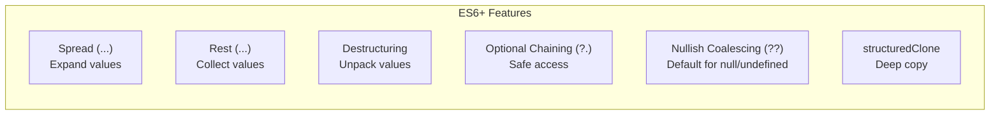

### Interview Questions — ES6+

1. **What is the difference between spread and rest?** — Spread expands values (in function calls or literals). Rest collects remaining values (in function parameters or destructuring).
2. **Why is spread a shallow copy?** — It copies top-level properties by value/reference. Nested objects are copied by reference, so mutations to nested objects affect both copies.
3. **How do you deep clone an object?** — Use `structuredClone()` (modern) or `JSON.parse(JSON.stringify(obj))` (older, with limitations on functions and special types).
4. **What is optional chaining?** — The `?.` operator safely accesses nested properties, returning `undefined` instead of throwing if an intermediate value is `null` or `undefined`.
5. **How is `??` different from `||`?** — `??` only treats `null` and `undefined` as "missing." `||` treats any falsy value (`0`, `""`, `false`, `NaN`) as missing.
6. **Are ES6 classes real classes?** — No. They are syntactic sugar over JavaScript's prototype-based inheritance system.
7. **What are template literals?** — Strings delimited by backticks that support `${}` interpolation, multi-line text, and tagged template functions for custom processing.
8. **What is the difference between `find` and `filter`?** — `find` returns the first matching element (or `undefined`). `filter` returns all matching elements as a new array.

[↑ Back to Index](#table-of-contents)

---

## 20. Template Literals & Tagged Templates

### Tagged Templates — Advanced

Tagged templates let you define a function that processes a template literal. The tag function receives the static string parts and the interpolated expressions separately:

```js
function sql(strings, ...values) {
    // strings: ["SELECT * FROM users WHERE name = ", " AND age > ", ""]
    // values: [userName, minAge]
    const query = strings.join("?");
    return { query, params: values };
}

const userName = "Prashant";
const minAge = 18;
const result = sql`SELECT * FROM users WHERE name = ${userName} AND age > ${minAge}`;
// { query: "SELECT * FROM users WHERE name = ? AND age > ?", params: ["Prashant", 18] }
```

This pattern is used by real libraries for SQL parameterization, CSS-in-JS, GraphQL queries, and HTML sanitization.

### `String.raw` — Built-in Tag

```js
// Normal template literal processes escape sequences
console.log(`Line1\nLine2`); // Line1
// Line2

// String.raw preserves raw escape sequences
console.log(String.raw`Line1\nLine2`); // "Line1\nLine2" (literal backslash-n)

// Useful for regex and file paths
const path = String.raw`C:\Users\Prashant\Documents`;
const regex = new RegExp(String.raw`\d+\.\d+`);
```

### Interview Questions — Template Literals

1. **What are tagged template literals?** — A function call syntax where a template literal follows a function name. The function receives the string parts and interpolated values as separate arguments.
2. **What is `String.raw`?** — A built-in tag function that returns a string with escape sequences not processed (raw backslashes preserved).
3. **Name a real-world use of tagged templates.** — SQL query parameterization (preventing injection), CSS-in-JS (`styled-components`), GraphQL (`gql` tag), internationalization.

[↑ Back to Index](#table-of-contents)

---

## 21. ES Modules

JavaScript Modules allow code to be split into separate files with explicit imports and exports. The project uses **ES Modules** (ESM), as indicated by `"type": "module"` in the `package.json`.

### Key Characteristics of ES Modules

- Use `import` / `export` syntax (not `require` / `module.exports`).
- Modules have their own scope — top-level variables are not global.
- Module code runs in strict mode automatically.
- Each module is evaluated once and its exports are live bindings (not copies).
- Modules are effectively closures — module-level variables persist across imports and are private unless exported.

### From the Repository — `package.json`

```json
{
    "name": "nodejs-sandbox",
    "type": "module",
    "scripts": {
        "start": "node --watch index.js"
    }
}
```

The `"type": "module"` setting tells Node.js to treat `.js` files as ES Modules. The `--watch` flag enables auto-restart on file changes during development.

### Top-Level `await`

The repository uses `await` at the top level in `_PromiseAPIS.js` (without wrapping in an `async` function). This is possible because ES Modules support **top-level `await`** — the module itself acts as an async context.

### Interview Questions — Modules

1. **What is the difference between CommonJS and ES Modules?** — CommonJS uses `require()`/`module.exports`, is synchronous, and copies values. ESM uses `import`/`export`, is asynchronous, and provides live bindings.
2. **What does `"type": "module"` in package.json do?** — Tells Node.js to treat `.js` files as ES Modules instead of CommonJS.
3. **Are modules closures?** — Yes. Each module has its own scope, and exported values are maintained through closure-like semantics.
4. **What is top-level `await`?** — The ability to use `await` directly in a module's top-level code without wrapping it in an `async` function.

[↑ Back to Index](#table-of-contents)

---

# Phase 6 — Asynchronous JavaScript

---

## 22. Callbacks & Callback Hell

A **callback** is a function passed as an argument to another function, which is then invoked inside the outer function to complete an action. Callbacks are JavaScript's original mechanism for handling asynchronous operations — you pass a function that should run "when something is done."

### From the Repository — `callBacks.js`

```js
function x(y) {
    console.log("x");
    y();
}

x(function y() {
    console.log("y");
});
// Output: "x" then "y"
```

The function `y` is passed as a callback to `x`. Inside `x`, after logging "x," it invokes the callback `y()`.

### Callback Hell — `callBackHell.js`

When multiple asynchronous operations depend on each other, callbacks become deeply nested, creating a pattern known as **Callback Hell** or the **Pyramid of Doom**:

```js
const cart = ["shoes", "pants", "shorts"];

api.createOrder(cart, function () {
    api.proceedToPayment(function () {
        api.showOrderSummary(function () {
            api.updateWallet(function () {
                return "wallet Updated";
            });
        });
    });
});
```

This code suffers from two major problems:

1. **Readability** — Deep nesting makes the code extremely hard to read and maintain.
2. **Inversion of Control** — When you pass a callback to an external function, you lose control over when and how many times it is called. The external function might call your callback twice, never call it, or call it with an error you didn't expect.

**Inversion of Control — why it is dangerous:**

```js
// You write this:
thirdPartyPayment.process(cart, function onSuccess() {
    // You have NO guarantee about:
    // 1. Will this be called once? (might be called twice → double charge!)
    // 2. Will this be called at all? (might be silently swallowed)
    // 3. Will it be called synchronously or async?
    // 4. Will errors be passed to this callback or thrown?
    completeSale();
});
// Control is INVERTED — thirdPartyPayment now owns your code

// Promise solution — control returned to you:
thirdPartyPayment
    .process(cart)
    .then(onSuccess) // YOU decide what to do on success
    .catch(onError); // YOU decide what to do on failure
// The promise is a trust contract: resolve or reject, exactly once
```

Promises solve both of these problems.

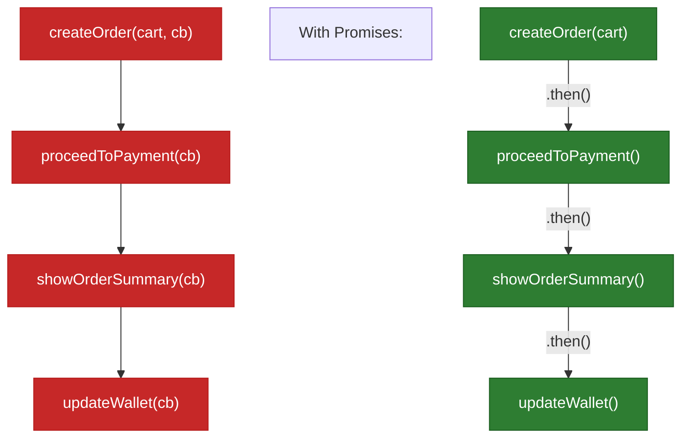

### Interview Questions — Callbacks

1. **What is a callback function?** — A function passed as an argument to another function, to be called later when a task completes.
2. **What is callback hell?** — Deeply nested callbacks that arise from sequential async operations, making code unreadable and hard to maintain.
3. **What is inversion of control?** — When you hand over execution control to an external function via a callback, losing guarantees about when/how your code runs.
4. **How do Promises solve callback hell?** — Promises flatten the nesting into a chain of `.then()` calls and give you control back (you attach handlers to the promise, rather than passing callbacks into another function).

[↑ Back to Index](#table-of-contents)

---

## 23. Promises

A **Promise** is an object representing the eventual completion (or failure) of an asynchronous operation and its resulting value. Promises have three states:

- **Pending** — The initial state; the operation hasn't completed yet.
- **Fulfilled** — The operation completed successfully, with a result value.
- **Rejected** — The operation failed, with a reason (error).

A promise is settled (fulfilled or rejected) exactly once and cannot change state afterward. You attach handlers using `.then()` for success, `.catch()` for errors, and `.finally()` for cleanup that runs regardless of outcome.

**Promise internal state — as a JS object snapshot:**

```js
// A Promise is internally like this object (conceptual model):

// ── Pending (just created) ────────────────────────────────────────
{
    [[PromiseState]]:  "pending",
    [[PromiseResult]]: undefined,
    // Waiting... .then() and .catch() callbacks queue here
}

// ── After resolve(42) is called ─────────────────────────────────
{
    [[PromiseState]]:  "fulfilled",
    [[PromiseResult]]: 42,
    // .then(fn) callbacks are scheduled as microtasks with result = 42
}

// ── After reject(new Error("oops")) is called ────────────────────
{
    [[PromiseState]]:  "rejected",
    [[PromiseResult]]: Error("oops"),
    // .catch(fn) callbacks are scheduled as microtasks with reason = Error
}

// Key rule: once settled, state NEVER changes.
const p = new Promise((resolve, reject) => {
    resolve(1);   // ✅ state becomes fulfilled
    resolve(2);   // ❌ ignored — already settled
    reject("x"); // ❌ ignored — already settled
});
p.then(v => console.log(v)); // 1 — only the first resolve/reject counts
```

**Promise chaining** allows sequential async operations to be expressed as a flat chain instead of nested callbacks. Each `.then()` returns a new promise, so more `.then()` calls can be appended. If a `.then()` returns a value, the next `.then()` receives it. If it returns a promise, the chain waits for that promise to settle.

### From the Repository — `_Promises.js`

```js
const cart = ["shoes", "pants", "shorts", "goggles"];
let orderID = 10000;

const createOrder = (cart) => {
    const promise = new Promise((resolve, reject) => {
        resolve({
            data: `Order Created for cart ${cart}`,
            orderId: ++orderID,
        });
    });
    return promise;
};

const proceedToPayment = (orderId) => {
    return Promise.resolve({
        data: `Payment done for order_id ${orderId}`,
        invoiceNo: new Date().getTime(),
    });
};

// Promise Chaining — flat and readable
createOrder("shoes")
    .then((order) => order?.orderId)
    .then((orderId) => proceedToPayment(orderId))
    .then((res) => console.log(res))
    .catch((err) => console.log(err.message));
```

In this example, `createOrder` returns a promise that resolves with order data. The chain extracts the `orderId`, passes it to `proceedToPayment` (which also returns a promise), and then logs the payment result. The `.catch()` at the end handles any error from any step in the chain.

### `.catch()` vs `.finally()`

```js
fetchData()
    .then((data) => process(data))
    .catch((err) => console.error("Error:", err)) // runs ONLY on rejection
    .finally(() => hideLoadingSpinner()); // runs ALWAYS
```

|                    | `.catch(fn)`                                      | `.finally(fn)`                             |
| ------------------ | ------------------------------------------------- | ------------------------------------------ |
| When it runs       | Only on rejection                                 | Always (fulfilled or rejected)             |
| Receives arguments | The rejection reason                              | No arguments                               |
| Return value       | Can recover the chain (returns fulfilled promise) | Passes through the original result/error   |
| Use case           | Error handling, fallbacks                         | Cleanup (close connections, hide spinners) |

**Key behavior:** `.finally()` does not receive the resolved value or rejection reason. It transparently passes through whatever the previous promise settled with:

```js
Promise.resolve(42)
    .finally(() => console.log("cleanup")) // no access to 42
    .then((val) => console.log(val)); // 42 — passed through
```

### Error Propagation in Promise Chains

Errors in promise chains propagate forward until they find a `.catch()` handler:

```js
Promise.resolve(1)
    .then((val) => {
        throw new Error("Boom!");
    }) // Error thrown
    .then((val) => console.log("Skipped")) // Skipped!
    .then((val) => console.log("Also skipped")) // Skipped!
    .catch((err) => {
        console.log("Caught:", err.message); // "Caught: Boom!"
        return "recovered";
    })
    .then((val) => console.log(val)); // "recovered"
```


A `.catch()` mid-chain can **recover** the chain by returning a value. Subsequent `.then()` calls receive that value. If `.catch()` throws or returns a rejected promise, the error continues propagating.

### Promise Executor Behavior

The executor function passed to `new Promise((resolve, reject) => { ... })` runs **synchronously** — immediately when the Promise is created:

```js
console.log("Before");

const p = new Promise((resolve, reject) => {
    console.log("Inside executor"); // runs synchronously!
    resolve(42);
});

console.log("After");
p.then((val) => console.log("Then:", val));

// Output: "Before", "Inside executor", "After", "Then: 42"
```

The executor runs inline, but `.then()` callbacks are always scheduled as **microtasks** — they never run synchronously, even if the promise is already resolved.

### `try/catch` Maps to Promise `.catch()`

```js
// Async/await pattern
async function fetchUser() {
    try {
        const user = await getUser();
        const profile = await getProfile(user.id);
        return profile;
    } catch (err) {
        console.error(err);
    }
}

// Equivalent Promise chain
function fetchUser() {
    return getUser()
        .then((user) => getProfile(user.id))
        .catch((err) => console.error(err));
}
```

Each `await` that might throw corresponds to a `.then()` in the chain, and the `catch` block maps directly to `.catch()`. The `try/catch` version is often more readable for sequential async operations.

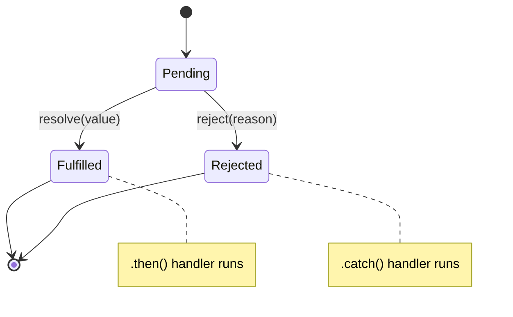

### Interview Questions — Promises

1. **What is a Promise?** — An object representing the eventual result of an asynchronous operation, with three states: pending, fulfilled, rejected.
2. **What are the three states of a Promise?** — Pending (not yet settled), Fulfilled (resolved with a value), Rejected (failed with a reason).
3. **What is Promise chaining?** — Connecting multiple `.then()` calls where each returns a value or promise, allowing sequential async operations in a flat structure.
4. **What happens if you don't return a value in a `.then()`?** — The next `.then()` receives `undefined`.
5. **Where should `.catch()` be placed in a chain?** — At the end to catch errors from any step above. It can also be placed mid-chain to handle specific errors while allowing the chain to continue.
6. **What is `Promise.resolve()` vs `new Promise()`?** — `Promise.resolve(value)` is a shorthand that creates an already-fulfilled promise. `new Promise(executor)` gives you control over when to resolve or reject.
7. **Does the executor function run synchronously?** — Yes. The function passed to `new Promise()` executes immediately. Only `.then()`/`.catch()`/`.finally()` callbacks are deferred as microtasks.
8. **What does `.finally()` receive as arguments?** — Nothing. It runs for cleanup and passes through the original settled value.
9. **How does error propagation work in promise chains?** — Errors skip `.then()` handlers and propagate forward until a `.catch()` handles them. A `.catch()` can recover the chain by returning a value.

[↑ Back to Index](#table-of-contents)

---

## 24. Promise Internals — Deep Dive

### The Microtask Queue and Promise Scheduling

When a promise resolves, its `.then()` callbacks do not run immediately — they are placed on the **microtask queue**. The event loop drains all microtasks before moving to the next macrotask:

```js
console.log("1");

setTimeout(() => console.log("2"), 0); // macrotask

Promise.resolve()
    .then(() => console.log("3")) // microtask
    .then(() => console.log("4")); // microtask (chained)

Promise.resolve().then(() => console.log("5")); // microtask

console.log("6");

// Output: 1, 6, 3, 5, 4, 2
```

**Why this order?** After sync code (1, 6), the microtask queue is drained: 3 and 5 (first `.then()` from each chain), then 4 (chained `.then()` from the first chain creates a new microtask). Only after ALL microtasks are done does the macrotask (2) execute.

### Why `Promise.resolve` Doesn't Pause Execution

```js
const p = Promise.resolve(42);
console.log("After resolve"); // runs immediately — resolve is synchronous
p.then((val) => console.log(val)); // 42 — runs as microtask AFTER current code
```

Calling `resolve()` inside a Promise constructor or using `Promise.resolve()` does not pause or defer anything at that point. The resolution is synchronous — it changes the promise's internal state. It's only the `.then()`/`.catch()` handlers that are scheduled as microtasks.

### `await` Desugaring

`await` is syntactic sugar for `.then()`. The JS engine transforms async/await code into promise chains:

```js
// What you write:
async function example() {
    const a = await fetchA();
    const b = await fetchB(a);
    return b;
}

// What the engine does (conceptually):
function example() {
    return fetchA()
        .then((a) => fetchB(a))
        .then((b) => b);
}
```

Each `await` splits the function into continuations. The code after `await` becomes the `.then()` callback. When the awaited promise settles, the continuation is scheduled as a microtask.

### Why `Promise.all` Doesn't Create Parallelism

```js
// WRONG mental model — Promise.all does NOT start the promises
const results = await Promise.all([fetchA(), fetchB(), fetchC()]);

// The promises are ALREADY running when created with fetchA(), fetchB(), fetchC()
// Promise.all just waits for all of them to settle
```

`fetchA()`, `fetchB()`, and `fetchC()` each return a promise that starts executing when called. `Promise.all` simply aggregates their results. If you want sequential execution, use `await` one at a time:

```js
const a = await fetchA(); // starts and finishes before fetchB starts
const b = await fetchB(a); // sequential, not parallel
```

### Interview Questions — Promise Internals

1. **When does a `.then()` callback run?** — It's scheduled as a microtask when the promise settles, and runs when the call stack is empty and all prior microtasks have been processed.
2. **Is the Promise constructor executor synchronous?** — Yes. The callback to `new Promise(fn)` runs immediately. Only `.then()`/`.catch()` callbacks are deferred.
3. **How does `await` work under the hood?** — It's desugared to `.then()` — the code after `await` becomes the `.then()` callback, scheduled as a microtask when the awaited promise settles.
4. **Does `Promise.all` create parallel execution?** — No. It waits for already-running promises. The promises start when they're created, not when passed to `Promise.all`.

[↑ Back to Index](#table-of-contents)

---

## 25. Promise Combinators — all, allSettled, race, any

Promise combinators coordinate multiple promises that are already running. They do not create parallelism — the promises start when they are created. Combinators simply manage how their results are aggregated.

### From the Repository — `_PromiseAPIS.js`

```js
const p1 = Promise.reject(3);
const p2 = 42;
const p3 = new Promise((resolve, reject) => {
    setTimeout(reject, 100, "foo");
});

// Promise.all — resolves when ALL succeed, rejects on FIRST failure
Promise.all([p1, p2, p3])
    .then((res) => console.log("all -> " + res))
    .catch((err) => console.log("all -> " + err)); // "all -> 3"

// Promise.allSettled — waits for ALL to settle, never rejects
Promise.allSettled([p1, p2, p3]).then((res) => console.log(res));
// [{ status: "rejected", reason: 3 },
//  { status: "fulfilled", value: 42 },
//  { status: "rejected", reason: "foo" }]

// Promise.race — settles with the FIRST promise to settle (win or lose)
Promise.race([p1, p2, p3])
    .then((res) => console.log("race -> " + res))
    .catch((err) => console.log("race -> " + err)); // "race -> 3"

// Promise.any — resolves with FIRST success, rejects only if ALL fail
Promise.any([p1, p2, p3])
    .then((res) => console.log("any -> " + res))
    .catch((err) => console.log("any -> " + err)); // "any -> 42"
```

| Combinator           | Resolves When          | Rejects When                           |
| -------------------- | ---------------------- | -------------------------------------- |
| `Promise.all`        | All promises fulfill   | Any promise rejects (fail-fast)        |
| `Promise.allSettled` | All promises settle    | Never rejects                          |
| `Promise.race`       | First promise settles  | First promise settles (if it rejects)  |
| `Promise.any`        | First promise fulfills | All promises reject (`AggregateError`) |

### Interview Questions — Promise Combinators

1. **What is the difference between `Promise.all` and `Promise.allSettled`?** — `all` fails fast on the first rejection. `allSettled` waits for all promises and returns the result of each, regardless of success or failure.
2. **When would you use `Promise.race`?** — When you want the result of whichever async operation finishes first, such as implementing a timeout for a network request.
3. **What is `Promise.any` and how does it differ from `Promise.race`?** — `any` resolves with the first _successful_ promise and ignores rejections (unless all reject). `race` settles with the first promise regardless of whether it fulfills or rejects.
4. **Does `Promise.all` create parallel execution?** — No. The promises are already running when passed to `all`. It simply waits for all of them to finish.

[↑ Back to Index](#table-of-contents)

---

## 26. Async / Await

`async`/`await` is syntactic sugar over Promises that makes asynchronous code look and behave like synchronous code. An `async` function always returns a Promise. The `await` keyword pauses execution of the async function (not the entire JavaScript thread) until the awaited promise settles.

When the engine encounters `await`, it suspends the async function, pops it off the call stack, and continues executing other synchronous code. When the awaited promise settles, the function is resumed from where it left off.

### From the Repository — `AsyncAwait.js`

```js
const p1 = new Promise((resolve) => {
    setTimeout(() => resolve("Promise 1 resolved!"), 5000);
});

const p2 = new Promise((resolve) => {
    setTimeout(() => resolve("Promise 2 resolved!"), 5000);
});

console.log("1");

async function handlePromise() {
    const val1 = await p1; // suspends handlePromise, not the main thread
    console.log("2");
    console.log(val1);

    const val2 = await p2; // suspends again
    console.log("3");
    console.log(val2);
}

handlePromise();
console.log("4");

// Output order: "1", "4", then after ~5s: "2", "Promise 1 resolved!", "3", "Promise 2 resolved!"
```

Notice that `"4"` prints before `"2"` even though `handlePromise()` is called before `console.log("4")`. This is because `await` suspends only the async function — the rest of the synchronous code continues.

### Blocking vs Non-Blocking — from `test.js`

```js
function blockingWait() {
    const start = Date.now();
    while (Date.now() - start < 10000) {} // Blocks the event loop!
    console.log("Blocking task finished");
}

async function asyncWait() {
    await new Promise((resolve) => setTimeout(resolve, 5000));
    console.log("Async task finished"); // Non-blocking
}

console.log("Start");
setTimeout(() => console.log("Timeout executed"), 0);
asyncWait();
console.log("End");

// Output: "Start", "End", "Timeout executed", then after 5s: "Async task finished"
```

The `blockingWait` function would freeze everything — including the `setTimeout` callback — because it holds the call stack with a busy loop. The `asyncWait` function suspends itself and frees the stack, letting other code (like the timeout callback) run.

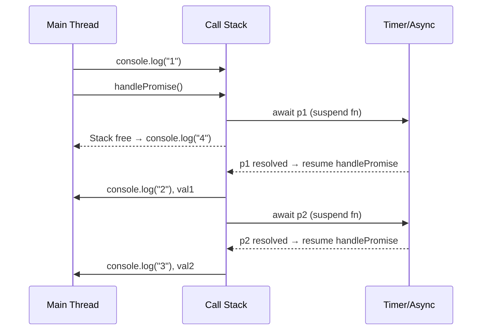

### Interview Questions — Async/Await

1. **What does `async` do to a function?** — Wraps its return value in a Promise. The function always returns a Promise, even if you return a plain value.
2. **Does `await` block the main thread?** — No. It suspends only the async function and frees the call stack for other code to execute.
3. **What is the difference between sequential and parallel await?** — Sequential: `await p1; await p2;` waits for p1 to finish before starting p2. Parallel: `const [r1, r2] = await Promise.all([p1, p2]);` runs both concurrently.
4. **How do you handle errors with async/await?** — Use try/catch blocks around `await` calls, which maps to `.catch()` in the underlying Promise chain.
5. **What is the output order of: `console.log("A"); async function f() { await p; console.log("B"); } f(); console.log("C");`?** — "A", "C", "B" — because `await` suspends the function and the synchronous code runs first.

[↑ Back to Index](#table-of-contents)

---

## 27. The Event Loop

The **Event Loop** is the mechanism that allows JavaScript to perform non-blocking operations despite being single-threaded. It continuously checks whether the call stack is empty and, if so, pushes the next task from the queue onto the stack.

### How It Works

1. **Call Stack** — Executes synchronous code. Functions are pushed when called and popped when they return.
2. **Web APIs / C++ APIs** — The environment (browser or Node.js) handles async operations like `setTimeout`, HTTP requests, and DOM events outside the main thread.
3. **Task Queue (Macro-task Queue)** — Callbacks from `setTimeout`, `setInterval`, I/O, etc., are placed here after completion.
4. **Microtask Queue** — Callbacks from Promises (`.then`, `.catch`, `.finally`) and `queueMicrotask` are placed here. **Microtasks have higher priority** — the event loop drains the entire microtask queue before picking from the task queue.

### Execution Priority

After each task completes on the call stack:

1. Drain **all** microtasks (Promise callbacks, `queueMicrotask`)
2. Pick **one** macrotask (`setTimeout`, `setInterval`, I/O)
3. Repeat

This is why Promise `.then()` callbacks always execute before `setTimeout(..., 0)` callbacks.

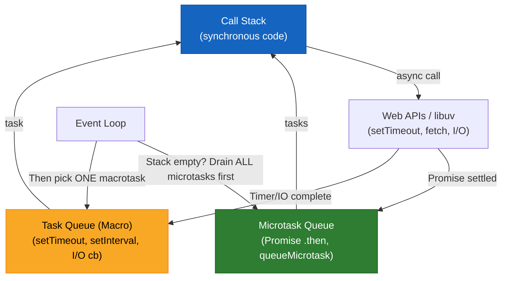

### Event Loop Example

```js
console.log("Start"); // 1. Call stack

setTimeout(() => console.log("Timeout"), 0); // 2. Sent to Web API → Task Queue

Promise.resolve().then(
    () => console.log("Promise"), // 3. Microtask Queue
);

console.log("End"); // 4. Call stack

// Output: "Start", "End", "Promise", "Timeout"
```

**Why?** After the synchronous code runs ("Start", "End"), the event loop checks the microtask queue first (Promise callback → "Promise"), then the macrotask queue (setTimeout callback → "Timeout").

**Full execution order trace — step by step:**

```js
console.log("A"); // [1] sync

setTimeout(() => console.log("B"), 0); // goes to macrotask queue

Promise.resolve()
    .then(() => console.log("C")) // goes to microtask queue
    .then(() => console.log("D")); // chained — queued AFTER C runs

Promise.resolve().then(() => console.log("E")); // goes to microtask queue

console.log("F"); // [2] sync

// Execution order:
// 1. Sync code:       A, F
// 2. Microtasks:      C, E  (first batch — both were queued before stack cleared)
// 3. Microtasks:      D     (second batch — queued when C ran)
// 4. Macrotask:       B     (timer, runs only after ALL microtasks done)

// Output: A, F, C, E, D, B
```

**Why D comes after E:** When C runs, it schedules D as a NEW microtask. E was already in the queue before C ran. The loop drains existing microtasks first (C, E), then picks up D (which C created), then finally moves to macrotask B.

### Node.js Event Loop Phases

In Node.js, the event loop has distinct phases powered by **libuv**:

1. **Timers** — Execute `setTimeout` and `setInterval` callbacks
2. **Pending callbacks** — Execute I/O callbacks deferred from the previous cycle
3. **Idle/Prepare** — Internal use
4. **Poll** — Retrieve new I/O events; execute I/O callbacks
5. **Check** — Execute `setImmediate` callbacks
6. **Close callbacks** — Execute close event callbacks (e.g., `socket.on('close')`)

Between each phase, Node.js processes **microtasks** (`process.nextTick` first, then Promise microtasks).

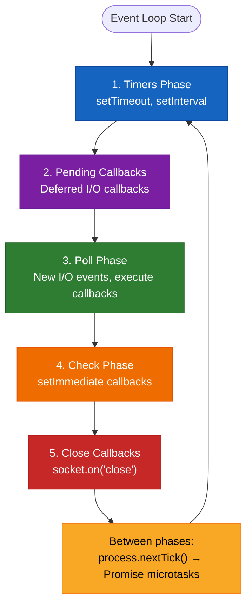

### `setTimeout` vs `setImmediate`

|                         | `setTimeout(fn, 0)`                            | `setImmediate(fn)`             |
| ----------------------- | ---------------------------------------------- | ------------------------------ |
| **Phase**               | Timers phase                                   | Check phase                    |
| **When it runs**        | After a minimum delay (even 0 is ~1ms)         | After the Poll phase completes |
| **Order guarantee**     | Non-deterministic when called from main module | Always after I/O callbacks     |
| **Inside I/O callback** | `setImmediate` runs first                      | `setImmediate` runs first      |

```js
// Order is NON-DETERMINISTIC in the main module:
setTimeout(() => console.log("timeout"), 0);
setImmediate(() => console.log("immediate"));
// Could be either order!

// Inside an I/O callback, setImmediate ALWAYS runs first:
const fs = require("fs");
fs.readFile(__filename, () => {
    setImmediate(() => console.log("immediate")); // 1st
    setTimeout(() => console.log("timeout"), 0); // 2nd
});
```

### `process.nextTick` vs Promise Microtasks

```js
Promise.resolve().then(() => console.log("Promise microtask"));
process.nextTick(() => console.log("nextTick"));
console.log("Sync");

// Output: "Sync", "nextTick", "Promise microtask"
```

`process.nextTick` callbacks run **before** Promise microtasks. Both run between event loop phases, but `nextTick` has higher priority:

**Execution priority order:**

1. Synchronous code (call stack)
2. `process.nextTick` queue
3. Promise microtask queue
4. Macrotask queue (timers, I/O, check)

> **Warning:** Recursive `process.nextTick()` can starve the event loop because it keeps running before any I/O or timer callbacks.

### Browser vs Node.js Event Loop

| Feature            | Browser                          | Node.js                                 |
| ------------------ | -------------------------------- | --------------------------------------- |
| Microtask queue    | After each macro task            | Between each phase                      |
| `setImmediate`     | Not available (polyfilled)       | Available (Check phase)                 |
| `process.nextTick` | Not available                    | Higher priority than Promise microtasks |
| I/O handling       | Web APIs (XMLHttpRequest, fetch) | libuv (OS-level I/O)                    |
| Rendering          | Microtasks run before repaint    | No rendering concerns                   |

### Interview Questions — Event Loop

1. **What is the event loop?** — A mechanism that monitors the call stack and task queues, pushing queued callbacks onto the stack when it is empty.
2. **What is the difference between the microtask queue and the macrotask queue?** — Microtasks (Promises) are drained completely before any macrotask (setTimeout) is executed.
3. **Why does `Promise.then()` execute before `setTimeout(..., 0)`?** — Promise callbacks are microtasks, which have higher priority than timer macrotasks.
4. **What is `process.nextTick` in Node.js?** — It queues a callback that runs before any other microtask or I/O event, at the end of the current operation.
5. **What causes the event loop to be blocked?** — Long-running synchronous operations (heavy computation, busy while-loops) that hold the call stack and prevent the event loop from processing other tasks.

[↑ Back to Index](#table-of-contents)

---

## 28. Node.js Event Loop — Deep Dive

### libuv — The Engine Behind Node.js Async

**libuv** is the C library that powers Node.js's event loop and async I/O. It provides:

- **Thread pool** (default 4 threads) for file system operations, DNS lookups, and crypto operations
- **OS-level async I/O** for network operations (using epoll/kqueue/IOCP)
- **Event loop phases** for scheduling callbacks

```mermaid
flowchart TB
    subgraph "Node.js Architecture"
        JS["JavaScript Code"]
        V8["V8 Engine<br/>(compiles & runs JS)"]
        NB["Node.js Bindings<br/>(C++ bridge)"]
        LUV["libuv<br/>(async I/O, event loop)"]
        TP["Thread Pool<br/>(fs, DNS, crypto)"]
        OS["OS Async<br/>(network I/O)"]
    end

    JS --> V8
    V8 --> NB
    NB --> LUV
    LUV --> TP
    LUV --> OS

    style JS fill:#f9a825,color:#000,stroke:#f57f17
    style V8 fill:#1565c0,color:#fff,stroke:#0d47a1
    style NB fill:#7b1fa2,color:#fff,stroke:#6a1b9a
    style LUV fill:#2e7d32,color:#fff,stroke:#1b5e20
    style TP fill:#ef6c00,color:#fff,stroke:#e65100
    style OS fill:#c62828,color:#fff,stroke:#b71c1c
```

### Complete Execution Order Rules

Given this code, predict the output:

```js
console.log("1 - sync");

setTimeout(() => console.log("2 - setTimeout"), 0);

setImmediate(() => console.log("3 - setImmediate"));

Promise.resolve().then(() => console.log("4 - promise"));

process.nextTick(() => console.log("5 - nextTick"));

console.log("6 - sync");
```

**Output:** `1 - sync`, `6 - sync`, `5 - nextTick`, `4 - promise`, `2 - setTimeout` OR `3 - setImmediate` (non-deterministic), then the other.

**Execution order:**

1. Synchronous code runs first (1, 6)
2. `process.nextTick` callbacks (5) — highest priority microtask
3. Promise microtasks (4)
4. `setTimeout` and `setImmediate` — order between these two is **non-deterministic** in the main module

### Starvation Warning — `process.nextTick`

```js
// ❌ DANGER: This starves the event loop
function recurse() {
    process.nextTick(recurse); // keeps adding to nextTick queue
}
recurse();
// setTimeout, setImmediate, and I/O callbacks NEVER run!
```

`process.nextTick` always executes before any I/O or timers. Recursive use prevents the event loop from advancing to its next phase.

### Interview Questions — Node.js Event Loop

1. **What is libuv?** — A C library that provides Node.js's event loop, thread pool, and async I/O abstractions for cross-platform operation.
2. **What are the phases of the Node.js event loop?** — Timers, Pending Callbacks, Poll, Check, Close Callbacks — with microtask processing between each phase.
3. **What is the thread pool used for?** — File system operations, DNS lookups, and CPU-intensive crypto operations that can't use OS-level async I/O.
4. **Can `process.nextTick` starve the event loop?** — Yes. Recursive `nextTick` calls continuously queue microtasks, preventing the event loop from proceeding to timers or I/O.
5. **In what scenario is `setImmediate` guaranteed to run before `setTimeout`?** — Inside an I/O callback (e.g., `fs.readFile`), `setImmediate` always runs before `setTimeout(..., 0)`.

[↑ Back to Index](#table-of-contents)

---

## 29. Async Pitfalls & Production Patterns

### Pitfall 1 — Unhandled Promise Rejections

```js
// ❌ BAD: No .catch() — unhandled rejection
async function fetchData() {
    const data = await fetch("/api/data"); // if this rejects, nothing catches it
    return data.json();
}
fetchData(); // unhandled rejection if fetch fails!

// ✅ GOOD: Always handle rejections
fetchData().catch((err) => console.error("Failed:", err));

// ✅ OR: Use try/catch inside the function
async function fetchDataSafe() {
    try {
        const data = await fetch("/api/data");
        return data.json();
    } catch (err) {
        console.error("Failed:", err);
        return null; // graceful fallback
    }
}
```

In Node.js, unhandled promise rejections will terminate the process by default (since Node 15+). Always handle rejections.

### Pitfall 2 — Sequential `await` When Parallel is Possible

```js
// ❌ SLOW: Sequential — total time: fetchA time + fetchB time
async function slow() {
    const a = await fetchA(); // waits for A to finish
    const b = await fetchB(); // THEN starts B — unnecessary wait!
    return [a, b];
}

// ✅ FAST: Parallel — total time: max(fetchA time, fetchB time)
async function fast() {
    const [a, b] = await Promise.all([fetchA(), fetchB()]);
    return [a, b];
}

// ✅ ALSO GOOD: Start promises first, then await
async function alsoFast() {
    const promiseA = fetchA(); // starts immediately
    const promiseB = fetchB(); // starts immediately
    const a = await promiseA; // now await both
    const b = await promiseB;
    return [a, b];
}
```

### Pitfall 3 — `async` + `forEach` Bug

```js
// ❌ BROKEN: forEach does NOT await async callbacks
const urls = ["/api/1", "/api/2", "/api/3"];
urls.forEach(async (url) => {
    const data = await fetch(url); // fires all at once, forEach doesn't wait
    console.log(data);
});
console.log("Done"); // prints BEFORE any fetch completes!

// ✅ FIX 1: Use for...of for sequential processing
for (const url of urls) {
    const data = await fetch(url);
    console.log(data);
}

// ✅ FIX 2: Use Promise.all for parallel processing
await Promise.all(
    urls.map(async (url) => {
        const data = await fetch(url);
        console.log(data);
    }),
);
```

`forEach` is not async-aware — it ignores the promise returned by the async callback. Use `for...of` for sequential or `Promise.all(arr.map(...))` for parallel.

### Pitfall 4 — Race Conditions on Shared State

```js
// ❌ RACE CONDITION: Multiple async operations modifying shared state
let count = 0;

async function increment() {
    const current = count; // read
    await someAsyncWork(); // yield control
    count = current + 1; // write — might overwrite another increment!
}

// Both read count as 0, both write 1 — expected 2, got 1
await Promise.all([increment(), increment()]);

// ✅ FIX: Use serial execution or atomic operations
async function safeIncrement() {
    await mutex.acquire(); // use a mutex/lock pattern
    count++;
    mutex.release();
}
```

### Pitfall 5 — Swallowed Errors in `.then()`

```js
// ❌ Error is silently swallowed — no .catch()
Promise.resolve()
    .then(() => {
        throw new Error("Oops!");
    })
    .then(() => console.log("This never runs"));
// Error disappears silently!

// ✅ Always end chains with .catch()
Promise.resolve()
    .then(() => {
        throw new Error("Oops!");
    })
    .catch((err) => console.error("Caught:", err.message));
```

### Pattern — Retry with Exponential Backoff

```js
async function fetchWithRetry(url, maxRetries = 3) {
    for (let attempt = 0; attempt < maxRetries; attempt++) {
        try {
            return await fetch(url);
        } catch (err) {
            if (attempt === maxRetries - 1) throw err;
            const delay = Math.pow(2, attempt) * 1000; // 1s, 2s, 4s
            await new Promise((resolve) => setTimeout(resolve, delay));
        }
    }
}
```

### Pattern — Timeout Wrapper

```js
function withTimeout(promise, ms) {
    const timeout = new Promise((_, reject) =>
        setTimeout(() => reject(new Error(`Timeout after ${ms}ms`)), ms),
    );
    return Promise.race([promise, timeout]);
}

// Usage
const data = await withTimeout(fetch("/api/slow"), 5000);
```

```mermaid
flowchart TB
    subgraph "Common Async Pitfalls"
        P1["Unhandled<br/>Rejections"]
        P2["Sequential await<br/>(should be parallel)"]
        P3["async + forEach<br/>(doesn't await)"]
        P4["Race Conditions<br/>(shared state)"]
        P5["Swallowed Errors<br/>(missing .catch)"]
    end

    subgraph "Fixes"
        F1["try/catch or .catch()"]
        F2["Promise.all()"]
        F3["for...of or<br/>Promise.all(map)"]
        F4["Serial execution<br/>or mutex"]
        F5["Always end with<br/>.catch()"]
    end

    P1 --> F1
    P2 --> F2
    P3 --> F3
    P4 --> F4
    P5 --> F5

    style P1 fill:#c62828,color:#fff,stroke:#b71c1c
    style P2 fill:#c62828,color:#fff,stroke:#b71c1c
    style P3 fill:#c62828,color:#fff,stroke:#b71c1c
    style P4 fill:#c62828,color:#fff,stroke:#b71c1c
    style P5 fill:#c62828,color:#fff,stroke:#b71c1c
    style F1 fill:#2e7d32,color:#fff,stroke:#1b5e20
    style F2 fill:#2e7d32,color:#fff,stroke:#1b5e20
    style F3 fill:#2e7d32,color:#fff,stroke:#1b5e20
    style F4 fill:#2e7d32,color:#fff,stroke:#1b5e20
    style F5 fill:#2e7d32,color:#fff,stroke:#1b5e20
```

### Interview Questions — Async Pitfalls

1. **What happens if you don't handle a promise rejection?** — In Node.js 15+, unhandled rejections crash the process. In browsers, they trigger an `unhandledrejection` event and a console warning.
2. **Why doesn't `forEach` work with `async`/`await`?** — `forEach` doesn't return or await the promises returned by async callbacks. Use `for...of` or `Promise.all(arr.map(...))`.
3. **How do you run async operations in parallel?** — Use `Promise.all([p1, p2, p3])`. Don't `await` each sequentially unless they depend on each other.
4. **What is a race condition in async JavaScript?** — When multiple async operations read and write shared state, the final result depends on timing and may be incorrect.
5. **How would you implement a retry with backoff?** — Loop with try/catch, doubling the delay between attempts (`2^attempt * 1000ms`), rethrowing after max retries.
6. **How would you add a timeout to a promise?** — Use `Promise.race([originalPromise, timeoutPromise])` where the timeout rejects after a set duration.

[↑ Back to Index](#table-of-contents)

---

---

## Quick Reference — Concept Map

```mermaid
mindmap
  root((JavaScript))
    Execution
      Execution Context
      Call Stack
      Event Loop
      Microtask Queue
      Macrotask Queue
      libuv & Thread Pool
    Scope & Variables
      var / let / const
      Lexical Scope
      Scope Chain
      Block Scope
      Hoisting
      TDZ
    Functions
      First-Class Functions
      Arrow vs Regular
      HOF
      Closures
      Module Pattern
      Currying
      Memoization
      Callbacks
    OOP & Prototypes
      Prototype Chain
      Delegation Model
      Constructor Functions
      ES6 Classes
      Object.create vs new
      this Binding
      Property Descriptors
    Async
      Callbacks
      Promises
      .catch / .finally
      Promise Combinators
      async / await
      Async Pitfalls
      Retry & Timeout Patterns
    Data
      Array Methods
      Object Methods
      String Methods
      Typed Arrays
      Buffers
      Iterators & for...of
      Sparse Arrays
    ES6+
      Spread / Rest
      Destructuring
      Template Literals
      Tagged Templates
      Optional Chaining
      Nullish Coalescing
      Modules
      Classes
      structuredClone
    Object Immutability
      freeze / seal / preventExtensions
      Object.assign vs Spread
      Object.fromEntries
      Getters & Setters
    Node.js Event Loop
      libuv Phases
      setTimeout vs setImmediate
      process.nextTick
      Browser vs Node.js
```

---

> **End of Notes** — This handbook covers 29 sections spanning all JavaScript concepts found in the project codebase, cross-referenced with the structured learning index from the Notes folder. Each section includes explanations, code from the repository, visual diagrams, comparison tables, and targeted interview questions. Topics range from execution fundamentals through async pitfalls and production patterns.
